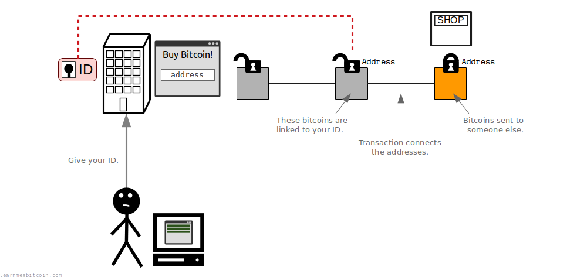
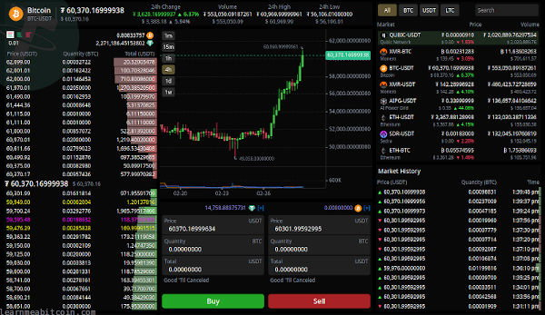
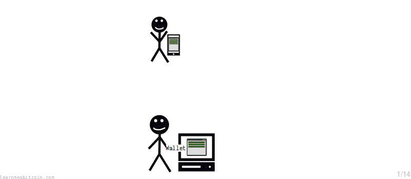
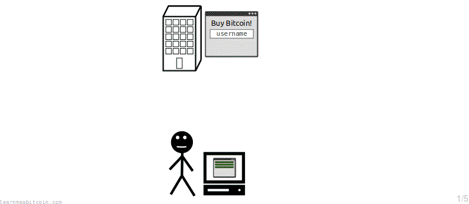
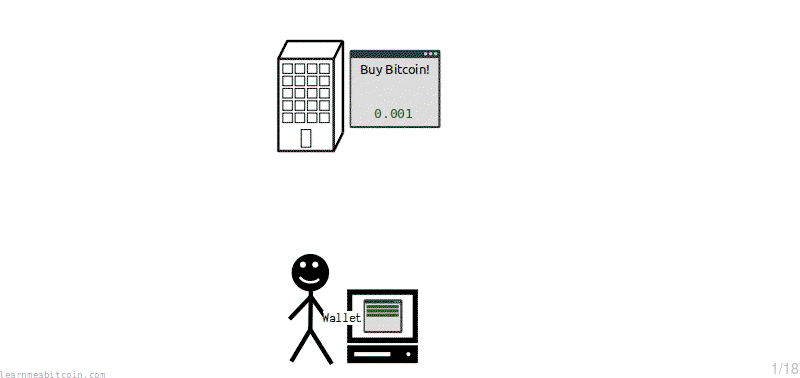

以下是我认为在网上购买比特币的**最佳交易所**简短列表。

这并不是互联网上所有交易所的详尽列表；它们是我*个人推荐*的交易所：

交易所 | 级别 | 需要身份证件 | 托管型 | 法币 | 风险 | 备注
--- | --- | --- | --- | --- | --- | ---
[Kraken](https://www.kraken.com/) | 初学者/高级 | 是 | 是 | 是 | 低 | 优秀的公司，安全可靠 |
[Peach Bitcoin](https://peachbitcoin.com/) | 中级 | 否 | 否 | 是 | 中 | P2P 交易，仅限 App，瑞士 |
[Bisq](https://bisq.network/) | 高级 | 否 | 否 | 是 | 中 | P2P 交易，仅限桌面端 |

* **级别** – 交易所最适合初学者、中级还是高级用户。
* **需要身份证件** – 交易所是否允许你匿名购买比特币而无需提供身份证件（即 No-KYC）。
* **法币** – 交易所是否允许你使用法定货币（例如美元、欧元、英镑等）充值并购买比特币。
* **托管型** – 交易所是否在买卖时为你保管比特币。
* **风险** – 交易所的风险程度。我不会推荐我不信任的交易所，但不同的交易所由于运营方式不同，其风险水平也不同。

如果你是第一次购买比特币，并且希望过程尽可能简单且安全，请使用 [Kraken](https://www.kraken.com/)。

## 在选择交易所时，你应该看重什么？

在从交易所购买比特币时，我主要看重以下几点（按重要性排序）：

### 1. 信任

最重要的一点是**只使用你*信任*的交易所**。

你将把*你的钱*托付给交易所，所以你需要确信他们能够妥善保管它，并且在你需要时能够随时提现。

我喜欢先了解一下所有者是谁。我认为通过观察交易所的运营者，你可以很好地感受到它的可信度。我通常会去“关于我们 (about)”页面看看幕后是谁，并找一些视频采访看看他们是什么样的人。

这并不是一门精确的科学，但你的直觉会引导你走得很远。

有些交易所是匿名运营的，并不清楚背后是谁。信任这样的交易所似乎很荒谬，风险也总是更大，但我仍然认为你可以通过该网站的设计 and 功能对其有一个不错的判断。

我还认为看起来太“花哨”的交易所是一种警示信号。归根结底，交易所是一项相当技术性的运营，所以如果他们看起来是在用闪烁的大图和极具诱惑的安全承诺来“重形式轻功能”，那就要保持警惕。

我在[玩在线扑克方面有相当丰富的经验](/about/)，这些年来我曾向许多不道德的公司汇款和收款，所以我认为自己对一家值得信赖的机构是什么样子的有很好的判断力。

但归根结底，你必须接受你永远无法对*任何*交易所做到 100% 确定。但如果你深入挖掘并避免纯粹根据表面价值进行判断，你就能够*接近* 100%，这将在未来为你避免噩梦般的结果。

换句话说，相信你的直觉。

### 2. 隐私

在决定使用哪家交易所时，你的**隐私**可能是一个重要因素。

一般来说，在网上购买比特币时，*便利性*和*匿名性*之间通常需要进行权衡：

* **要求身份验证的交易所通常风险较低。** 这意味着你失去了匿名性，但它们的风险通常较小，而且购买流程很简单。
* **不要求身份验证的交易所通常风险较高。** 这对于匿名性很好，但它们自然风险更大，而且可能更难使用。

如果你是第一次购买比特币，和/或对于向交易所提供身份证件没有意见，我总是建议选择你能找到的最大且最值得信赖的交易所（例如 [Kraken](https://www.kraken.com/)）。这种方式要简单得多。

然而，如果匿名是你的首要关切，你就需要寻找规模较小的交易所，并接受随之而来的风险。在这种情况下，你需要尽可能多地做研究。

没有哪一个交易所对所有人来说都是完美的，你只需要选择适合你自己的那一个。

你只需要聪明一点。

[KYCnot.me](https://kycnot.me/) 是一个用于寻找允许匿名购买比特币的交易所的好资源。

#### 你应该避免使用要求提供身份证件的交易所吗？

不一定。

然而，如果你从要求提供身份证件的公司购买比特币，那么你可以认为你从他们那里购买的所有比特币都已“标记”了你的身份。

这对你意味着什么？

举个例子，假设你决定把这些比特币发送到一家秘密商店。这没关系，但如果该秘密商店因为某种原因被查封，并且他们发现其比特币/地址，那么就可以查看到该商店接收到的所有交易。结果就是，鉴于你发送到那里的比特币带有你身份的标记，就有可能查出是*你*将比特币发送到了那家商店。

我不会劝阻任何人不要从要求提供身份证件的公司购买比特币，但了解它们是如何运作的非常重要。只需记住，比特币[交易](../technical/transaction.md)是连接在一起的，因此你的硬币的隐私取决于你*不要*在你的身份与你使用的[地址](../technical/keys/address.md)之间建立关联。

我不定义购买比特币需要身份证件符合比特币的真正精神，但这些类型的交易所确实为你获得第一批比特币提供了一种便捷的方法。

简而言之，比特币*可以*匿名使用，但前提是你必须小心，不要将你的身份与你使用的任何地址绑定。通过从需要身份证件的公司购买比特币，你是在**为了便利而牺牲隐私**。

用本杰明·富兰克林的话来说：

> 那些为了获得一点点临时安全而放弃基本自由的人，既不配享有自由，也不配享有安全。

[本杰明·富兰克林](https://founders.archives.gov/documents/Franklin/01-06-02-0107)

### 3. 费用

提前查看交易所收取的**费用**总是好的。

交易所提供服务，这意味着在买卖时会产生相关费用。这些费用通常相对较小，但在做决定之前，值得对比一下你所关注的不同交易所之间的费用。

我个人不会将*费用*作为决定是否使用某个交易所的首要因素；我宁愿支付更多的费用来使用我信任的交易所，也不愿为了节省一点费用而在一张我不信任的交易所上冒险。

但如果是几个不同交易所之间的艰难抉择，我会偏向于费用最低的那一个。

### 4. 易用性

坚持使用你认为**易于使用**的交易所绝对没有错。

在网上购买比特币可能是一次相当令人生畏的经历，特别是如果你是第一次这样做。所以你不必因为使用能让这个过程变得简单的交易所而感到愧疚。

有些交易所可能相当专业，是为有经验的交易员设计的，如果你以前没有使用过，就可能不太清楚发生了什么。而其他交易所则是为初学者设计的，尽可能地简化了过程。

这种界面并不是每个人的菜。

你在这里处理的是你自己的钱，你不应该感到被迫去使用可能会导致你犯错的交易所。

最好的方法是从简单的开始，然后逐步深入。

## 常见问题

### 你如何购买比特币？

从根本上说，购买比特币的方式就是从出售它们的人那里购买。

但当然，并不是每个人都认识有比特币出售的人，所以出现了一些以出售比特币为生的公司。这些公司被称为交易所，它们在网上提供了一种*便捷*的比特币购买方式。

所以这个页面列出了我认为在网上购买比特币的最佳交易所。

但当然，如果可以（且愿意）的话，直接从某人那里购买也没有任何问题。如果说有什么不同的话，这正是比特币的真谛。

### 你应该把你的比特币留在交易所吗？

如果你愿意，你可以这样做，但你需要意识到交易所将完全控制你的比特币。

这就像从网站“购买”黄金，但只能在你的账户中看到黄金的数量，而实际上并没有把黄金拿到自己手里。因此，如果交易所的计算机发生爆炸、被黑客入侵，或者该公司直接凭空消失，那么你的比特币也就没有了。

那有什么替代方案？

好吧，如果你想完全控制你的比特币（我推荐这样做），那么你需要将比特币*提现*到你自己的[钱包](wallets.md)。通过提现，你是要求该公司创建一个[交易](../technical/transaction.md)，将一定数量的比特币锁定到你的[地址](../technical/keys/address.md)之一。这意味着你将拥有允许你转移比特币的[密钥](../technical/keys.md)，这意味着除了你之外，没有其他人可以控制它们。

**完全拥有和控制自己的资金是比特币的核心原则之一。** 这就是为什么我建议尽可能将比特币从交易所提现到你的钱包里，因为这才是比特币设计用来带给你的自由。

通过提现到你的钱包，你现在也掌控了那些比特币的[安全](security.md)。这完全是可管理的，但也不要掉以轻心。

## 接下来该做什么？

在你购买了你的第一批比特币之后，你应该考虑将它们提现到你自己的[钱包](wallets.md)。

从这里开始，你可以开始进行交易并向其他人及企业[发送比特币](sending.md)。

这就是乐趣开始的地方。