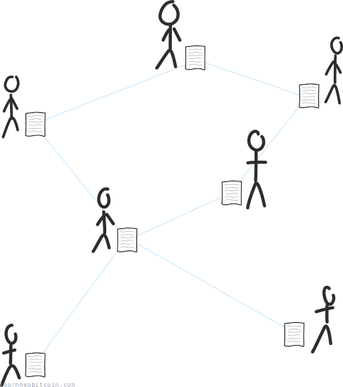
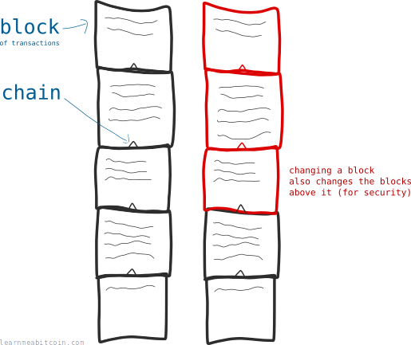
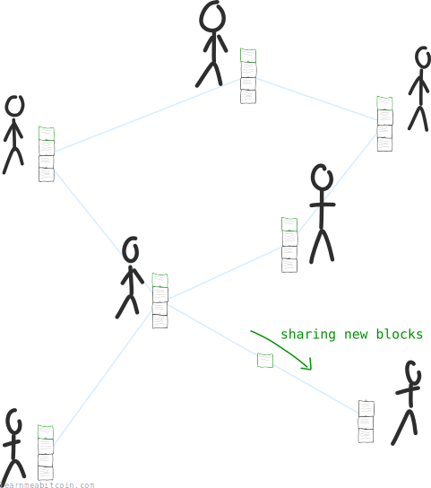

The blockchain is a file that contains a list of bitcoin [transactions](/beginners/guide/transactions/).

Everyone on the [bitcoin network](/beginners/guide/network/) shares a copy of this file, and it updates regularly with the latest transactions.

## Why is the blockchain important?

The blockchain tells you **how many bitcoins each person owns**.

This is because having *a complete list of transactions* allows you to work out how many bitcoins are located at each [address](/technical/keys/address/). Therefore, you can figure out how many bitcoins each person has.

So the blockchain is like a logbook, or a *ledger*.

> **Ledger** – a book in which the monetary transactions of a business are posted in the form of debits and credits.

## Why is it called the blockchain?

Because transactions aren't added to the file individually. Instead, they are bunched together and added in blocks. Hence, **block**chain.

Also, these blocks are *linked* together, which prevents anyone from modifying blocks that are already in the chain (as any changes would break the links between them). So **linked**blocks, or block**chain**.

The *chaining* of blocks is a security feature. This makes it impossible to tamper with the blockchain without anyone noticing.

Furthermore, the process of adding transactions in *blocks* makes it easier for everyone to share a copy of the blockchain; it's much easier to share a file that updates once every 10 minutes, than one that updates multiple times a second.

## How is the blockchain shared?

The blockchain is shared by the [nodes](/beginners/guide/node/) on the [bitcoin network](/beginners/guide/network/), similar to how a totally legit and non-copyrighted video file might be shared on the [BitTorrent network](https://en.wikipedia.org/wiki/BitTorrent).

So if my file hasn't got the latest blocks of transactions, someone will share them with me to get me up-to-date.

P2P file sharing is a topic of its own, but for now just know that the blockchain is shared like a BitTorrent file across the bitcoin network.

## Where can I get a copy of the blockchain?

You can get your own copy of a genuine, bona fide, electrified ~~monorail~~ blockchain by downloading the original [bitcoin client](https://bitcoin.org/en/download).

Once installed and running, the client will connect to other nodes on the network and start downloading the blockchain. It's currently around `857` GB, so give it some time.

What? It does contain every single bitcoin transaction you know (every one since 03 January 2009), so `857` GB is reasonable. Also, the initial download of the full blockchain is a one-off thing. After that it's smooth sailing – your blockchain updates with the latest blocks, and they're only around 1 MB in size.

When the download finishes you'll have a complete copy of the blockchain, and a list of every bitcoin transaction is in your hands. Furthermore, every time you run the bitcoin client you'll be helping to share this file with everyone else joining the network. Some of your friends may even start calling you a "Full Node".

By keeping a copy of the blockchain and sharing it with other people on the network, you make Bitcoin stronger.

If you're a fan of torrents, you could think of yourself as **seeding** the blockchain. Everyone loves a seeder.

## Where is the blockchain file stored on my computer?

The location of your copy of the blockchain depends on what operating system you're using:

Linux
:   `/home/[username]/.bitcoin/blocks/`

Windows
:   * `C:\Users\[username]\AppData\Roaming\Bitcoin\blocks\` ([v27.2](https://github.com/bitcoin/bitcoin/blob/master/doc/release-notes/release-notes-27.2.md) and below)
    * `C:\Users\[username]\AppData\Local\Bitcoin\blocks\` ([v28.0](https://github.com/bitcoin/bitcoin/blob/master/doc/release-notes/release-notes-28.0.md) onwards)

Mac
:   `~/Library/Application Support/Bitcoin/blocks/`

The actual blockchain data is stored in files with names like: `blk00000.dat`. There's also `blk00001.dat`, `blk00002.dat`, and so on. Splitting the blockchain into multiple files makes it easier to work with than having one huge file.

However, these [.dat files](/technical/block/blkdat/) contain data designed for a computer to read, so if you open one using a text editor you'll see a bunch of mumbo-jumbo. But trust me, all the transactions are in there.

If you want to browse around a readable version of the blockchain, try my [blockchain explorer](/explorer/). I basically take the data from the raw blockchain files (the very same copies you have), *parse* them, and display the contents on a web page.