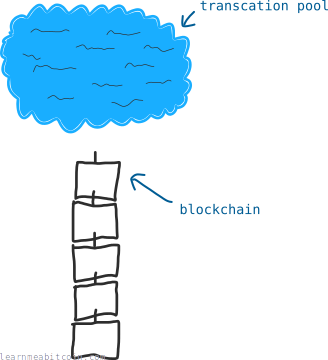
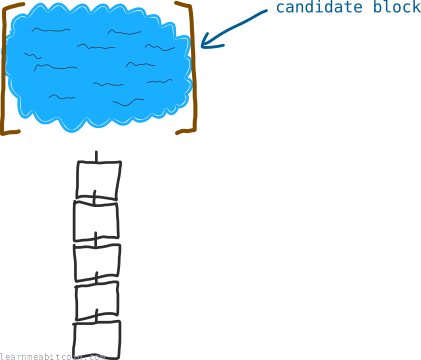
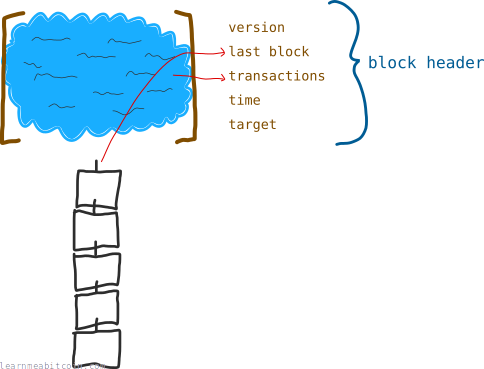
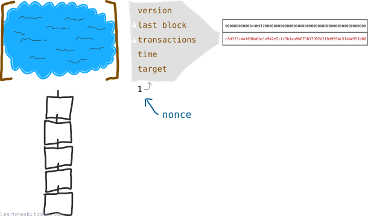
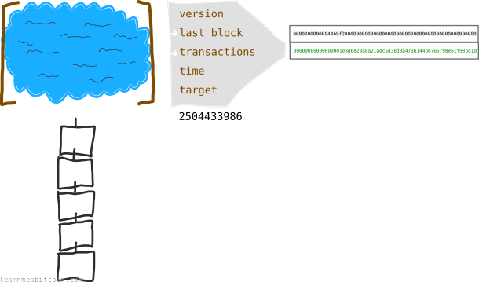
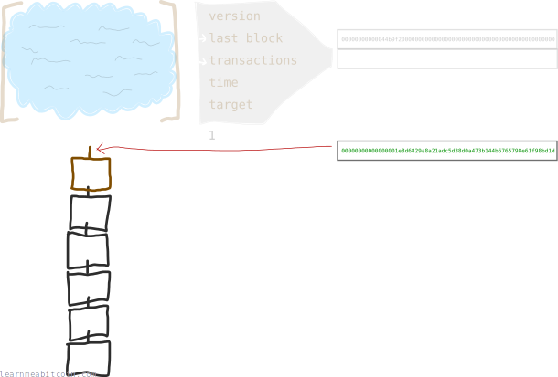

A block is a bunch of [transactions](/beginners/guide/transactions/) that have been added to the [blockchain](/beginners/guide/blockchain/).

## How are blocks formed?

Blocks are constructed during the process of [mining](/beginners/guide/mining/).

### Mining basics

When you make a bitcoin transaction, it isn't added to the blockchain straight away. Instead, it is held in a temporary pool of transactions.

I've called it a "transaction pool" here, but the official term is *[memory pool](/technical/mining/memory-pool/)*.

If you are a miner, your job is to gather transactions from the transaction pool into a "[candidate block](/technical/mining/candidate-block/)", and to *try* and add this candidate block to the blockchain.

#### Block header

Each candidate block is given a [block header](/technical/block/#header), which is basically a bunch of *metadata* containing information about the contents of the block.

Miners use this block header as the starting point when trying to add a block to the blockchain.

> **Metadata** – data that describes other data, serving as an informative label.

##### Block header fields

The details of the block header fields isn't important right now, but here's a quick summary anyway:

[Version](/technical/block/version/)
:   Version number for the block.

Previous Block
:   An identification number for the previous block that we want to build upon.

[Merkle Root](/technical/block/merkle-root/)
:   A fingerprint for all the transactions in the block (basically all of the transactions [hashed](/technical/cryptography/hash-function/) together). This as the most significant part of the block header.

[Time](/technical/block/time/)
:   The current time. Always handy.

Target
:   The value that miners work with to try and add this block to the blockchain. This will make more sense in a moment.

## How are blocks added to the blockchain?

To add a candidate block to the blockchain, you **[hash](/technical/cryptography/hash-function/) the data in the block header** and hope that the result is *below a certain [target](/technical/mining/target/) value*.

The *target* is calculated from the [difficulty](/beginners/guide/difficulty/), which is a value set by the bitcoin network to regulate how difficult it is to add a block of transactions to the blockchain.

Don't worry, I know this *difficulty* and *target* business is a little confusing at first, but it will make more sense over time.

[Difficulty](/beginners/guide/difficulty/)
:   A value used to regulate how quickly blocks are solved. All nodes agree on the same calculation of the difficulty for the current height of the blockchain. It adjusts every 2,016 blocks (roughly every 2 weeks) to help create an average of 10 minutes between blocks.

Think of the target as the limbo pole for candidate blocks – the greater the difficulty, the lower the target, and the more difficult it is to find a [block hash](/technical/block/hash/) that is below this value.

### An extra number

I lied. You don't actually hash the block header on its own. You actually hash it with *an extra number*.

This extra number is called a [nonce](/technical/block/nonce/), and it's basically a dummy field that miners use to help them get a block hash below the target value.

> **Nonce** – an arbitrary number used only once in a cryptographic communication.

If the first nonce doesn't work (starting at 0), *keep incrementing it and hashing the block header*. If you're lucky you'll find a nonce that returns a block hash that is *below* the current target value.

I know these hash values contain letters, but you can still think of them as numbers like any other. They're simply [hexadecimal](/technical/general/hexadecimal/) values, and computers love working with them.

### Solving the block

Once you've found a nonce that produces a low-enough block hash, the block is "solved" and all of the transactions in this block are added to the blockchain.

All miners will now head back to the transaction pool and start working on the next candidate block. They will use your successful block hash in their next block header (so they can build upon the block you've just mined), and the race to add a new block of transactions to the blockchain starts again.

Good work.