[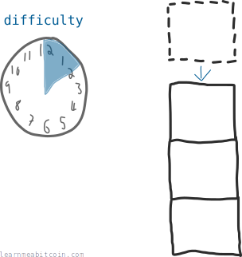](../../images/beginners_guide_difficulty_00-difficulty.png)

当前难度：

133,869,853,540,305.41

区块高度：[956,479](/explorer/956479)

难度是一个代表矿工向[区块链](blockchain.md)添加新[交易](transactions.md)[区块](blocks.md)难易程度的数字。

它**每 2 周调整一次**，以确保添加新区块到区块链平均需要 10 分钟。

## 为什么难度很重要？

难度确保了在[挖矿](mining.md)期间，即使有更多矿工加入[网络](network.md)，交易区块也能以**固定时间间隔**被添加到区块链中。

如果难度保持不变，随着新矿工加入网络，添加新区块到区块链所需的时间将逐渐缩短。

因此，难度调整意味着区块链可以持续稳定地更新。

## 难度何时发生变化？

难度**每 2,016 个区块**调整一次（大约每 2 周）。

在此间隔，每个[节点](node.md)都会获取开采最后 2,016 个区块的*预期时间*（2016 x 10 分钟），并除以实际所用的*实际时间*：

```
expected / actual
20160 / actual
```

如果矿工解决每个区块的速度快于预期，例如每个区块花费 9 分钟，你会得到类似这样的数字：

```
20160 / 18144 = 1.11
```

然后，每个节点使用这个数字来调整下 2,016 个区块的难度：

```
difficulty x 1.11 = new difficulty
```

* 如果该数字大于 1（区块开采速度比预期*快*），难度就会增加。
* 如果该数字小于 1（区块开采速度比预期慢），难度就会降低。

就是这样。现在比特币网络上的每个矿工在接下来的 2,016 个区块中都使用这个新难度。

难度一次最多只会调整 4 倍（即乘数不大于 4 且不小于 0.25）。这是为了防止在不同的难度周期之间发生过于剧烈的变化。

## 难度如何控制区块之间的时间？

好的，我将从一个简单的例子开始，并以此为基础进行构建。

### 1. 简单的例子

假设我给你一个 1 到 100 的数字范围。

[](../../images/beginners_guide_difficulty_01-range.png)

现在，假设你能够*每分钟一次*随机生成一个 1 到 100 之间的数字，并且**你的目标是生成一个低于我的*目标*数的数字**。

假设我将目标设置为 **50**：

[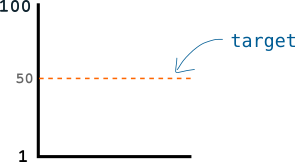](../../images/beginners_guide_difficulty_01-range_target.png)

鉴于你只能*每分钟*生成一个数字，你平均需要花费 **2分钟** 才能找到低于该目标值的数字。

但这太容易了。所以假设我将目标降低到 **20**，这意味着你只有 1/5 的概率生成获胜数字，或者说平均每 **5分钟** 才能找到一个：

[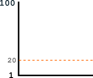](../../images/beginners_guide_difficulty_01-range_target_20.png)

目标越低，生成获胜数字就越*困难*。

所以如你所见，我可以使用目标的高度来控制你找到获胜数字需要多长时间（当然，这取决于你每分钟能够生成多少个数字）。

这不会是*每一次*都恰好是 5 分钟，因为你在第一次尝试时就可能运气好。然而，从长期来看，平均间隔时间会是 5 分钟。

#### 那么什么是难度？

除了*直接*告诉你目标值外，我还可以通过用一个*新数字***除以数字范围**来给你目标：

[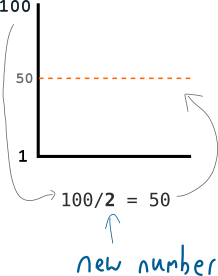](../../images/beginners_guide_difficulty_01-range_target_difficulty.png)

这个*新数字*就是**难度**，它被用来调整目标的高度。

以下是通过难度设置目标的等式：

```
target = max target / difficulty
```

所以现在我可以使用这个*难度*值来帮助我把目标设定到我想要的任何水平：

[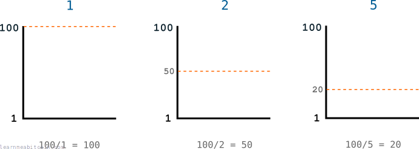](../../images/beginners_guide_difficulty_01-range_target_difficulty_examples.png)

因此，我使用*难度*来控制*目标*，而目标反过来控制你生成低于目标的获胜数字所需的时间。

* 这里的*难度*基本上是表示当前*目标*的另一种方式。
* 难度越大，目标越低。

### 2. 比特币的例子

比特币中的难度工作原理完全相同——它被用于设定目标值，矿工不断生成数字（对其候选[区块](blocks.md)进行[哈希](../../technical/cryptography/hash-function.md)计算），以期找到低于该目标值的[区块哈希](../../technical/block/hash.md)：

[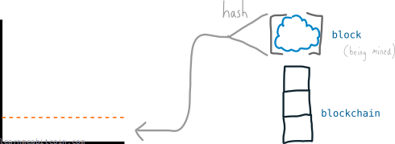](../../images/beginners_guide_difficulty_02-bitcoin_target_hash.png)

鉴于矿工每秒能够生成成千上万的数字（哈希值），比特币的目标使用了极其庞大的数字：

[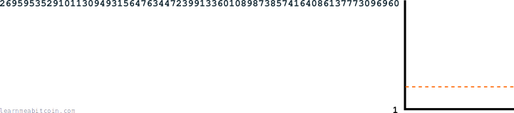](../../images/beginners_guide_difficulty_02-bitcoin_range.png)

由于现在有成千上万的矿工在尝试寻找获胜数字，为了确保每 10 分钟（而不是每隔几秒）找到一个获胜数字，成功的数字范围最终变得极其微小：

[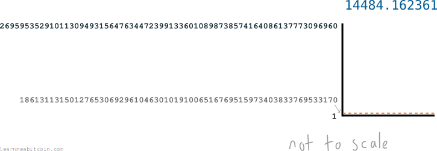](../../images/beginners_guide_difficulty_02-bitcoin_range_target.png)

即使那个难度数字看起来很大，目标依然低到令人发指，极其难以低于此目标。这就像买彩票。

#### 十六进制数字

因为这些目标数字太庞大了，我们通常会以较短的[十六进制](../../technical/general/hexadecimal.md)格式来显示它们。

[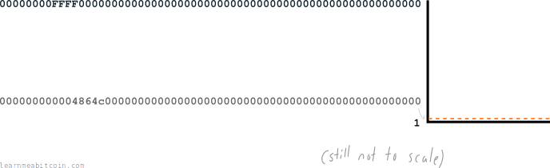](../../images/beginners_guide_difficulty_02-bitcoin_range_target_hex.png)

这就是为什么区块哈希看起来像这样：`000000000003ba27aa200b1cecaad478d2b00432346c3f1f3986da1afd33e506`

但即使它包含字母，它*依然是一个数字*。所以目标是一个十六进制值，矿工正在尝试获得一个低于目标的十六进制区块哈希。

事实上，你可以很容易地在十六进制和“正常”数字（即十进制数字）之间进行转换：

 进制转换器

二进制 (Base 2)

0b

`0 位`

十进制 (Base 10)

0d

`0 位`

十六进制 (Base 16)

0x

`0 位`


+1


0 secs

|  |  |
| --- | --- |
| 十六进制 | 000000000004864c000000000000000000000000000000000000000000000000 |
| 十进制 | 1861311314983800126815643622927230076368334845814253369901973504 |
[区块 100,000](/explorer/block/000000000003ba27aa200b1cecaad478d2b00432346c3f1f3986da1afd33e506) 的目标值

|  |  |
| --- | --- |
| 十六进制 | 000000000003ba27aa200b1cecaad478d2b00432346c3f1f3986da1afd33e506 |
| 十进制 | 1533267872647776902154320487930659211795065581998445848740226310 |
[区块 100,000](/explorer/block/000000000003ba27aa200b1cecaad478d2b00432346c3f1f3986da1afd33e506) 的哈希值

所以这就是为什么你通常会看到哈希和目标是一串数字*和字母*——它们使用的是十六进制，而不是我们人类更熟悉的十进制。

只需记住，这些十进制和十六进制数字具有*相同的**数值***，你可以很容易地在两者之间进行转换。

尴尬的是，难度通常是用十进制格式表示，而区块哈希和目标则是用十六进制表示：

[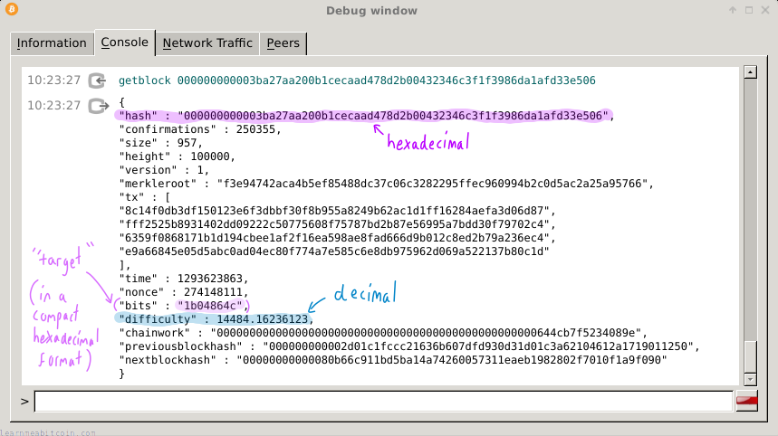](../../images/beginners_guide_difficulty_blockheader_hexadecimal_decimal.png)

目标是十六进制的，但它以一种 compact 格式存储在区块头中，称为 [bits](../../technical/block/bits.md)。

但正如我所说，它们都是数字，所以如果你将它们转换为相同的格式，你仍然可以使用它们。

## 你如何计算难度？

当前

随机示例

高度：

最大目标

0x

目标

0x

`0 字节`

难度

0d


0 secs

难度是通过将最大可能的目标值除以当前区块的目标计算出来的。

最大目标是为[创世区块（第一个区块）](/explorer/block/000000000019d6689c085ae165831e934ff763ae46a2a6c172b3f1b60a8ce26f)设置的目标：

```
max target = 0x00000000ffff0000000000000000000000000000000000000000000000000000
```

因此，要算出例如[区块 100,000](/explorer/block/000000000003ba27aa200b1cecaad478d2b00432346c3f1f3986da1afd33e506) 的难度，我们只需要找出该区块的目标是多少：

```
target = 0x000000000004864c000000000000000000000000000000000000000000000000
```

现在，如果我们将这两个值都转换为十进制并相除，我们就得到了难度：

 进制转换器

二进制 (Base 2)

0b

`0 位`

十进制 (Base 10)

0d

`0 位`

十六进制 (Base 16)

0x

`0 位`


+1


0 secs

```
difficulty = max target / target
difficulty = 0x00000000ffff0000000000000000000000000000000000000000000000000000 / 0x000000000004864c000000000000000000000000000000000000000000000000
difficulty = 26959535291011309493156476344723991336010898738574164086137773096960 / 1861311314983800126815643622927230076368334845814253369901973504
difficulty = 14484.162361
```

所以如你所见，难度只是表示当前目标距离最大可能目标的偏移程度。

在比特币内部，只有目标值在进行调整。所以难度只是一种表示这一变化的方式。

## 你如何根据难度计算目标？

**难度是*根据*目标计算出来的。** 然而，如果你愿意，你总是可以倒推根据难度计算出目标。

让我们使用*难度*来算出[区块 100,000](/explorer/block/000000000003ba27aa200b1cecaad478d2b00432346c3f1f3986da1afd33e506) 的*目标*。

我们将（主要）使用十进制数字进行计算，因为它们更容易理解。

以下是难度：

```
bitcoin-cli getblockheader 000000000003ba27aa200b1cecaad478d2b00432346c3f1f3986da1afd33e506

{
"hash" : "000000000003ba27aa200b1cecaad478d2b00432346c3f1f3986da1afd33e506",
...
"height" : 100000,
...
"difficulty" : 14484.16236123,
...
}
```

很好。

现在，让我们记下我们用来寻找目标的等式：

```
target = max target / difficulty
```

让我们准备好*最大目标*和难度以代入等式。

```
max target = 0x00000000ffff0000000000000000000000000000000000000000000000000000
difficulty = 14484.162361
```

* *最大目标*是一个固定值；它是为最初的[创世区块](/explorer/block/000000000019d6689c085ae165831e934ff763ae46a2a6c172b3f1b60a8ce26f)设置的初始目标。
* 0x 前缀用于表示十六进制值（0x 不是数字的一部分）。值中存在字母通常是明显的标志（但并不总是如此）。
* 我从上面的区块头信息中得到了难度。

但是，*最大目标*目前是十六进制格式，因此我们将其转换为十进制。

 进制转换器

二进制 (Base 2)

0b

`0 位`

十进制 (Base 10)

0d

`0 位`

十六进制 (Base 16)

0x

`0 位`


+1


0 secs

```
max target = 26959535291011309493156476344723991336010898738574164086137773096960
```

现在我们只需将这些数字代入等式，就可以得出：

```
target = max target / difficulty
target = 26959535291011309493156476344723991336010898738574164086137773096960 / 14484.162361
target = 1861311315012765306929610463010191006516769515973403833769533170
```

搞定。

所以当矿工试图解决区块 100,000 时，她希望为她的候选区块获得一个低于 `1861311315012765306929610463010191006516769515973403833769533170` 的哈希值。

### 检查结果

让我们将这个目标值与她为该区块获得的哈希值进行对比，以检查她是否真的成功（即她为区块计算的哈希值低于目标）：

```
target = 1861311315012765306929610463010191006516769515973403833769533170
hash   = 0x000000000003ba27aa200b1cecaad478d2b00432346c3f1f3986da1afd33e506
```

啊，是的，哈希值是十六进制格式。让我们再次将十六进制转换为十进制，以便对比这两个数字：

 进制转换器

二进制 (Base 2)

0b

`0 位`

十进制 (Base 10)

0d

`0 位`

十六进制 (Base 16)

0x

`0 位`


+1


0 secs

```
target = 1861311315012765306929610463010191006516769515973403833769533170
hash   = 1533267872647776902154320487930659211795065581998445848740226310
```

是的，该哈希值*确实*低于目标，因此该区块可以添加到区块链中。

## 我在哪里可以找到当前的难度？

你可以使用 `bitcoin-cli getdifficulty` 命令来找到当前的难度：

[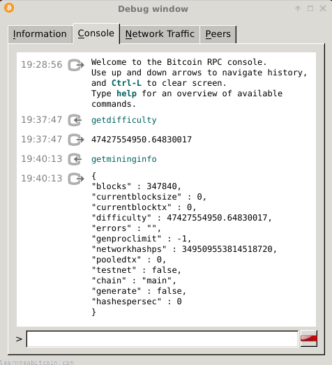](../../images/beginners_guide_difficulty_getdifficulty.png)

* 当前难度也可以在 `bitcoin-cli getmininginfo` 中找到。
* 这是一个显示难度随时间变化的图表：[blockchain.com/explorer/charts/difficulty](https://www.blockchain.com/explorer/charts/difficulty)

## 总结

**[目标](../../technical/mining/target.md)**是区块哈希必须低于的实际 limbo 杆，只有低于此目标，新区块才能被添加到区块链上。

**难度**只是衡量目标距离其初始初始值移动了多少的指标。或者换句话说，与区块链刚刚启动时相比，现在开采区块有多困难。

## 资源

* [bitcoin.it/wiki/Difficulty](https://en.bitcoin.it/wiki/Difficulty)
* [What is the numeric precision of Network Difficulty?](https://bitcoin.stackexchange.com/questions/121131/what-is-the-numeric-precision-of-network-difficulty)