A digital signature is used to show that you know the [private key](/docs/beginners/guide/private-keys.md) connected to a [public key](/docs/beginners/guide/public-keys.md), **without having to reveal the private key**.

[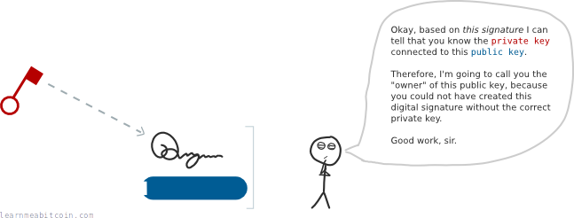](https://static.learnmeabitcoin.com/beginners/guide/digital-signatures/01-digital-signature-usage.png)

So if anyone ever asks if you have the private key for a specific public key (or [address](/docs/technical/keys/address.md)), you can give them a digital signature to prove it.

## Why do we use digital signatures in Bitcoin?

When you make a [transaction](/docs/beginners/guide/transactions.md), you need to unlock the [outputs](/docs/beginners/guide/outputs.md) you want to spend.

To do this you need to show that you "own" the output. This is done by proving that you know the private key of the address the output is [locked](/docs/beginners/guide/locks.md) to:

[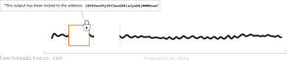](https://static.learnmeabitcoin.com/beginners/guide/digital-signatures/02-transaction-data.png)

But if you put your private key into the transaction data directly, everyone on the network will be able to see it:

[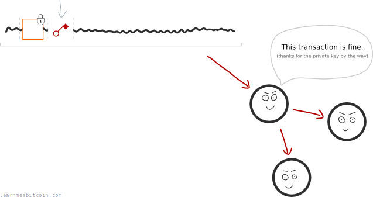](https://static.learnmeabitcoin.com/beginners/guide/digital-signatures/02-transaction-data-privkey.png)

And if anyone gets your private key, they can use it to unlock and spend any other outputs that have been locked to that same address.

So how can we unlock outputs without giving away our private key?

### Enter the digital signature

A digital signature can be created *from* a private key to prove that we know the private key for an [address](/docs/technical/keys/address.md).

This means we can use a digital signature to unlock outputs without having to give away our private key:

[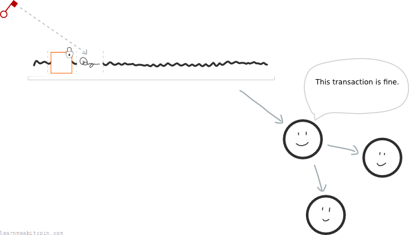](https://static.learnmeabitcoin.com/beginners/guide/digital-signatures/02-transaction-data-digsig.png)

This is why we use digital signatures instead of putting our private keys directly into the transaction data.

## What prevents someone from reusing a digital signature?

Good question. After all, if the private key can unlock any output locked to an address, why can't someone take the digital signature and use it to do the same thing?

Answer: Because every digital signature is tied to a transaction.

In other words; you don't just use your private key to make a digital signature; you use your private key *and* the original transaction data itself:

[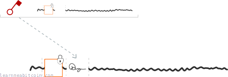](https://static.learnmeabitcoin.com/beginners/guide/digital-signatures/03-digital-signature-components.png)

Therefore, each digital signature is *connected to the transaction* it is being used in:

So if someone tries to use this digital signature in a different transaction, it will not match the transaction data that was used to create it, and [nodes](/docs/beginners/guide/node.md) on the [bitcoin network](/docs/beginners/guide/network.md) will reject it.

[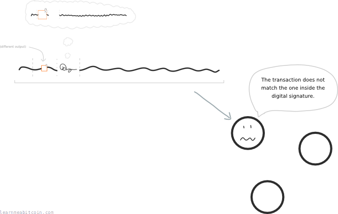](https://static.learnmeabitcoin.com/beginners/guide/digital-signatures/03-digital-signature-environment-different.png)

Furthermore, the digital signature also protects against anyone tampering with a transaction. Because if the transaction data is changed (e.g. someone tries to change the amount being sent or where it's being sent), the digital signature will no longer work.

## How do digital signatures work?

Mathematics, good old mathematics.

There are two parts to using digital signatures:

1. **Signing:** You combine the private key + `transaction data`, and use some mathematics to create a digital signature.
2. **Verifying:** You can then take the digital signature + `transaction data` + public key, perform some more mathematics, and the result will confirm whether a legitimate private key was used to create the digital signature.

Because remember, **the goal of a using a digital signature is to prove that you're the owner of a public key**.

Don't forget that an address is just an encoding of a public key. So even though you send bitcoins to an address, you're actually locking them to a public key.

I know the process seems like ~~smoke and mirrors~~ magic at first, but it's honestly just mathematics underneath.

## How do you create a digital signature?

A digital signature contains two parts:

1. A **random** part.
2. A **signature** part.

### 1. Random Part

Start by generating a large random number.

You then multiply this with the generator point on the elliptic curve (the same generator point used when making a [public key](/docs/beginners/guide/public-keys.md)):

[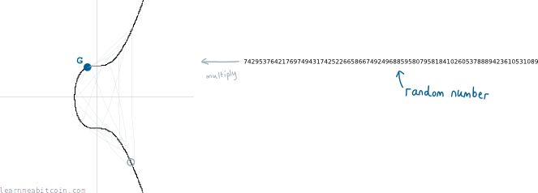](https://static.learnmeabitcoin.com/beginners/guide/digital-signatures/04-signing-random-point.png)

The **random** part of our digital signature is the point on the curve that we end up with. But we'll just take the x-coordinate of it:

[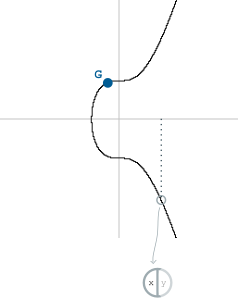](https://static.learnmeabitcoin.com/beginners/guide/digital-signatures/04-signing-random-point-x.png)

We'll call this "r" for short.

* This is basically the same process as creating a private key and a public key. Except here we're doing this to add a random element to our digital signature.
* This random element helps to ensure that every digital signature is unique.

So now we've got the *first half* of our digital signature ready, but we haven't used our private key for anything yet. This is where the second half comes in…

### 2. Signature Part

Next we take our private key, and multiply it with `r` (the x-coordinate of that random point on the curve we just found).

[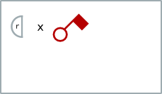](https://static.learnmeabitcoin.com/beginners/guide/digital-signatures/04-signing-signature-r-privkey.png)

Next we add *the thing we want to sign*. This is called the `message`. In Bitcoin, the `message` is the hash of the entire transaction data that contains the output that we want to unlock:

[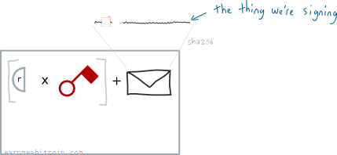](https://static.learnmeabitcoin.com/beginners/guide/digital-signatures/04-signing-signature-r-privkey-thing.png)

Including the transaction hash ties the signature to one transaction (so it can't be used within a different transaction).

Finally, for good measure, we divide all of this by that initial random number we started with:

[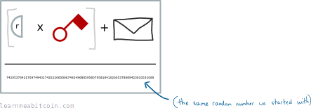](https://static.learnmeabitcoin.com/beginners/guide/digital-signatures/04-signing-signature-r-privkey-thing-randnum.png)

And hey presto, we have the vital "signature" part of our digital signature. We'll call this `s` for short.

[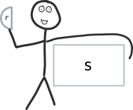](https://static.learnmeabitcoin.com/beginners/guide/digital-signatures/04-signing-signature-rs.png)

Mr. D Signature.

This entire signature then goes into the [unlocking code](/docs/technical/transaction/input/scriptsig.md) section of a transaction:

[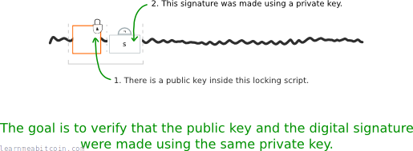](https://static.learnmeabitcoin.com/beginners/guide/digital-signatures/05-verifying-goal.png)

Note: The private key we used to create the signature is the one connected to the public key the output is locked to.

Now here's the fun bit…

If someone asks us to prove that we know the private key for a public key, we can give them our digital signature (`r` and `s`) as proof.

But how the hell can someone use this as proof?

## How do you verify a digital signature?

To verify that a digital signature was made using a correct private key, the person you give this digital signature to needs to use both parts to find **two new points** on the elliptic curve:

### Point 1

Divide the `message` by `s`. The first point is then the **generator point** multiplied by this value:

[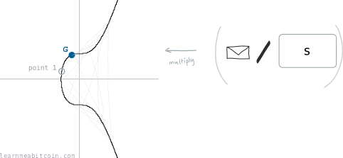](https://static.learnmeabitcoin.com/beginners/guide/digital-signatures/05-verifying-point1.png)

### Point 2

Divide `r` by `s`. The second point is then the public key multiplied by this value:

[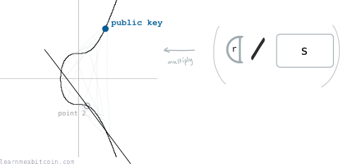](https://static.learnmeabitcoin.com/beginners/guide/digital-signatures/05-verifying-point2.png)

### Verification

Now if we add these two points together, we will get a *third* point on the curve:

[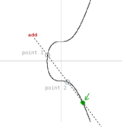](https://static.learnmeabitcoin.com/beginners/guide/digital-signatures/05-verifying-add.png)

And if the x-coordinate of this third point is the same as the x-coordinate of the random point we started with (`r`), then this is proof that the digital signature was created using the private key connected to this public key.

[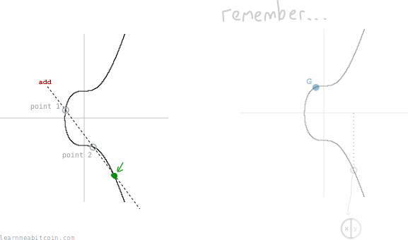](https://static.learnmeabitcoin.com/beginners/guide/digital-signatures/05-verifying-final.png)

**This is a simplified explanation of the mathematics involved in digital signatures.** For a more technical explanation, see [ECDSA](/docs/technical/cryptography/elliptic-curve/ecdsa.md).

## Resources

* [Bitcoin 101: The Magic of Signing & Verifying](https://www.youtube.com/watch?v=U2bw_N6kQL8) – An excellent introductory video that covers the actual mathematics of signature generation and verification.