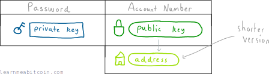
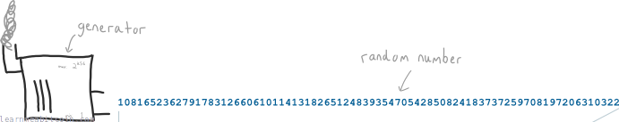
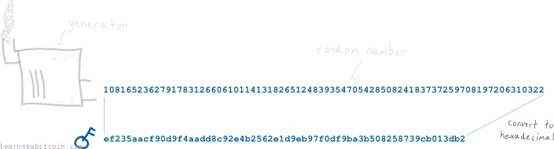
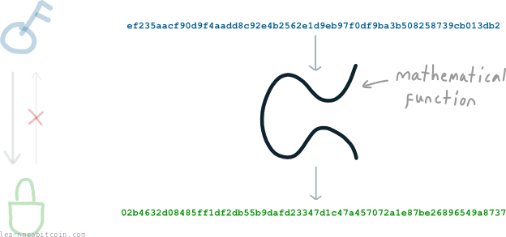
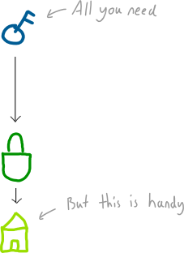
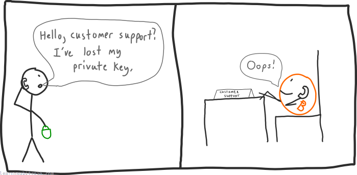

要发送和接收比特币，你需要某种“账号”和“密码”。

在比特币中，我们称之为[公钥](/docs/beginners/guide/public-keys.md)和[私钥](/docs/beginners/guide/private-keys.md)。

这就是你的账户明细。欢迎来到比特币世界。

然而，这个“账号”是一个笨拙而冗长的*数字*。所以为了方便使用，我们创建了公钥的*缩短*版本，我们称之为地址。

稍后你就会看到公钥有多丑陋了。

总结一下：

* **公钥** – 你的*账号*。
  + **地址** – 也是你的*账号*，但在人们向你发送比特币时，使用的是一个缩短的版本。
* **私钥** – 你的*密码*。这可以防止其他人从你的地址发送比特币。

## 密钥与地址从哪里来？

比特币中使用的所有密钥都是在你的计算机上随机生成的。

### [私钥](/docs/beginners/guide/private-keys.md)

一切都始于私钥，它只是一个**随机生成的数字**：

但因为这个数字太大，我们通常会以[十六进制](/docs/technical/general/hexadecimal.md)格式显示它：

十六进制数字比十进制数字短，因为它们还使用字母 a, b, c, d, e 和 f。

这样我们就拥有了一个私钥；它只是一个巨大的随机数。

例如：

|  |  |
| --- | --- |
| 私钥 | ef235aacf90d9f4aadd8c92e4b2562e1d9eb97f0df9ba3b508258739cb013db2 |

**请勿使用本页面的示例私钥（或地址）。** 我仅将这些作为展示其外观的示例。你所有的私钥都应该在自己的电脑/设备上安全生成并保持私密。

私钥可以是 **1** 到 **115792089237316195423570985008687907852837564279074904382605163141518161494336** 之间的任意数字。

### [公钥](/docs/beginners/guide/public-keys.md)

你使用私钥来计算你的公钥。

但首先，这个公钥是会被其他人看到的。因此，当我们使用私钥生成公钥时，**我们不希望任何人有可能推算算我们的私钥是什么**。

因为归根结底，私钥保护着我们的比特币。

我们不希望任何人能够从公钥反向推导出私钥。

幸运的是，我们可以使用一种特殊的**数学函数**来实现这一点。

我们只需要把私钥（它毕竟只是一个数字）输入到这个函数中，函数就会输出一个公钥（这又是另一个数字）。

现在，使用这一特定函数有两个好处：

1. **私钥和公钥之间存在数学上的联系。** 当我们稍后想要在[交易](/docs/beginners/guide/transactions.md)中花费我们的比特币时，这将派上用场。
   
2. **不可能从公钥算出私钥。** 尽管公钥是从私钥计算出来的，但我们使用的是所谓的“单向”函数，因此你无法从公钥反向推算出来计算私钥。

多亏了我们的随机数和这个函数，我们现在有了一*对密钥*，可以用来发送和接收比特币：

|  |  |
| --- | --- |
| 私钥 | ef235aacf90d9f4aadd8c92e4b2562e1d9eb97f0df9ba3b508258739cb013db2 |
| 公钥 | 02b4632d08485ff1df2db55b9dafd23347d1c47a457072a1e87be26896549a8737 |

### 地址

公钥看起来挺丑的，对吧。没有人会喜欢手动输入那一长串东西。

所以让我们把它变得好看一点，称之为地址。

谢天谢地。

我们在这里所做的只是*压缩*公钥（使用[哈希函数](/docs/technical/cryptography/hash-function.md)），并将其转换为一种不使用任何在写下来时看起来相似字符的格式（称为 [Base58](/docs/technical/keys/base58.md)）。

所以它依然不是你见过的最短最甜的数据片段，但它*确实*是一种进步。

而地址仅此而已；它是公钥的较短版本：

|  |  |
| --- | --- |
| 私钥 | ef235aacf90d9f4aadd8c92e4b2562e1d9eb97f0df9ba3b508258739cb013db2 |
| 公钥 | 02b4632d08485ff1df2db55b9dafd23347d1c47a457072a1e87be26896549a8737 |
| 地址 | 1EUXSxuUVy2PC5enGXR1a3yxbEjNWMHuem |

**也无法从地址反向推导出公钥。** 这是因为在压缩公钥时使用了哈希函数。

## 我需要记住这 3 个密钥吗？

因为你的公钥和地址都是*从*你的私钥计算出来的，**所以你其实只需保存好你的私钥即可**。

所以，如果遇到最坏的情况，无论何时你需要把地址发给别人，你都可以通过你的私钥把它推导出来。

你大部分时候都在使用[钱包](/docs/beginners/wallets.md)，所以管理单个私钥和地址并不是一个真正的问题。在使用钱包时，你唯一需要保护安全的就是你的[种子](/docs/technical/keys/hd-wallets/mnemonic-seed.md)。

## 如果我丢失了私钥会怎么样？

那你就彻底……失去它们了。

**不可能从公钥或地址推算出私钥**，所以如果你丢失了私钥，它就真的消失了。

你无法从地址或公钥计算出私钥。

如果你没有一个地址对应的私钥，锁定在该地址下的任何比特币将永远被所在那里。

这种安全防护觉得如何？

这看起来可能是一个毫不留情的系统，事实也确实如此。

但换个角度，知道你的钱没有后门可以进入也是件令人欣慰的事。你的比特币只有一把钥匙，而你完全掌控着它。

