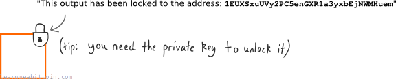
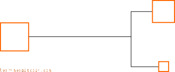
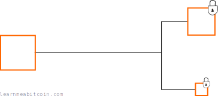
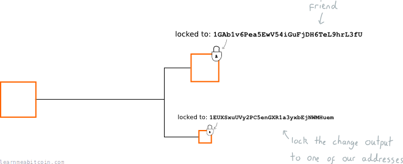
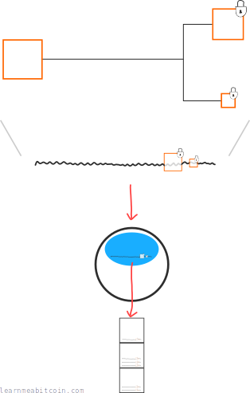
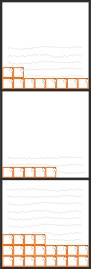
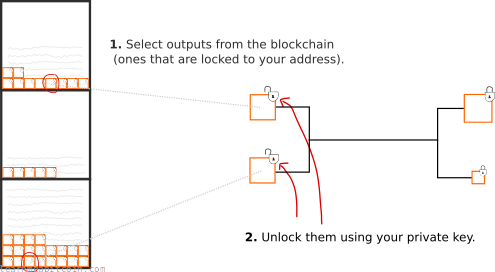
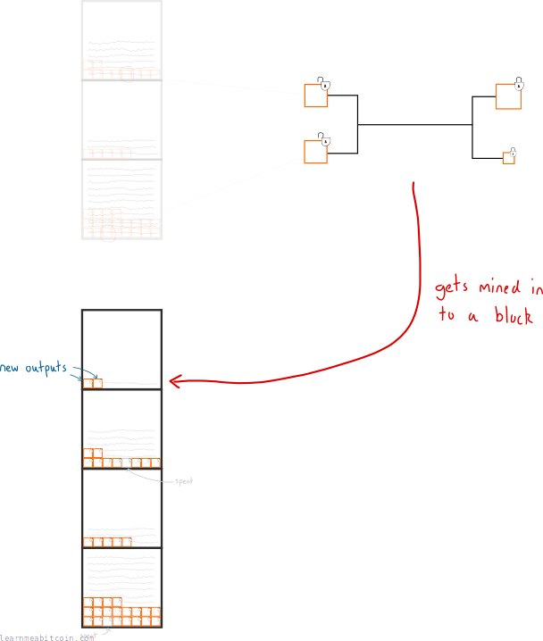
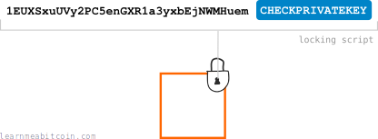

Every [output](/beginners/guide/outputs/) in a [transaction](/beginners/guide/transactions/) has a lock on it. This lock is a **set of requirements** that must be met to spend the output in a future transaction.

So in other words, these locks prevent bitcoins from being stolen (i.e. someone else spending your bitcoins), as every output we receive is *encumbered* by a lock.

For example, a typical lock reads something like this:

## When do locks get placed on outputs?

As we know, a [transaction](/beginners/guide/transactions/) takes existing outputs and creates new ones from them:

And it's during the creation of these outputs that we give each one their own "lock":

So when we want to send bitcoins to a friend, we create a new output, and add a lock that says "only the owner of the address 1friend1234567890... can use this output":

As a result, this new output will effectively "belong" to our friend, because they are the only person who has the [private key](/beginners/guide/private-keys/) required to unlock the bitcoins locked to this [address](/technical/keys/address/), so nobody else will be able to spend it.

### Where do bitcoins live?

As you may have noticed, you're never really "sending" bitcoins directly from your computer to someone else's computer.

Instead, you're constructing a transaction that creates new outputs (with locks on them), sending this transaction data into the [bitcoin network](/beginners/guide/network/), and waiting for it to get mined into the [blockchain](/beginners/guide/blockchain/).

So even though the blockchain is a file of transactions, on a practical level you can think of it as **storage for outputs**.

The blockchain is just one big storage unit for outputs.

And when you want to send "your" bitcoins to someone, you simply select the outputs in the blockchain that you are able to unlock:

And when this transaction gets mined into the blockchain, the outputs you used (as inputs) cannot be used again.

So the blockchain stores outputs, and you can spend any of these outputs any time you want (as long as you can unlock them, of course).

## What does a lock look like?

Locks are written in a basic programming language called [Script](/technical/script/).

It's a bit tricky to explain the workings of an entire programming language in one diagram, but here we go:

This is a simplified example of a locking script; it's not exactly what Script looks like.

Now, the most interesting part of this locking script is the `CHECKPRIVATEKEY` part, which is a *function* that we use to help set the requirements for the lock.

So for this particular output, we've *set a lock* that wants to compare the address 1EUXSxuUVy2PC5enGXR1a3yxbEjNWMHuem with a [private key](/beginners/guide/private-keys/).

If we can provide this lock with the correct private key (which the owner of the address keeps secret), we can unlock it and spend it in a transaction.

## How do you unlock a lock?

When you construct the transaction data, you include an "unlocking script" alongside each output you want to spend:

So for example, to unlock a typical locking script (e.g. `[address] CHECKPRIVATEKEY`), we need to prove that we *own* the address inside the lock. To do this, we provide the private key connected to the address.

So when a node receives this transaction data, they will run the "locking"+"unlocking" scripts together to see if your private key is mathematically connected to the address.

If everything is cool, the node accepts the transaction and passes it on to other nodes, who will each in turn run the "locking"+"unlocking" script before accepting the transaction.

And that's how you unlock a lock on an output.

### Aren't we giving away our private key?

Astute observation.

Confession: We don't actually put our private key into the unlocking script.

You see, to save us from giving our private key away within the transaction data, we use the private key to create something called a [digital signature](/beginners/guide/digital-signatures/) instead:

Obviously I lied about that `CHECKPRIVATEKEY` function as well.

However, there *is* a function that compares an address with a digital signature, and it's called `CHECKSIG`:

And thanks to the mathematics of digital signatures and the `CHECKSIG` function, we can still lock outputs to addresses, and unlock them without having to give away the private key.

Awesome.

There are many different functions available in the [Script](/technical/script/) programming language. The `CHECKSIG` function is designed for locking an output to a specific address, but you can use others (and in various combinations) to create much more complex locks.

For example, you could create a lock that can only be unlocked after a specific date, or a lock that can only be unlocked by the owners of two (or more) different addresses.

This is why bitcoin is sometimes referred to as "programmable money".