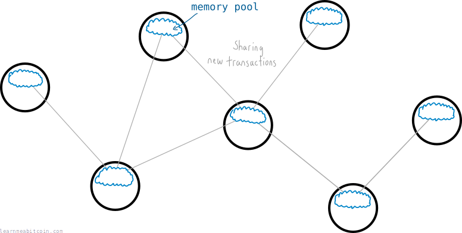
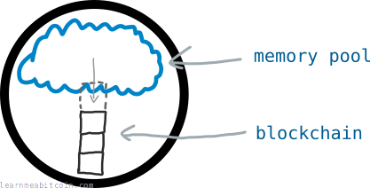
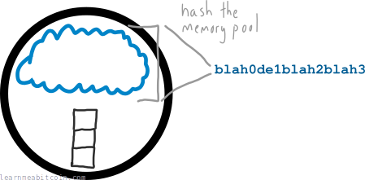
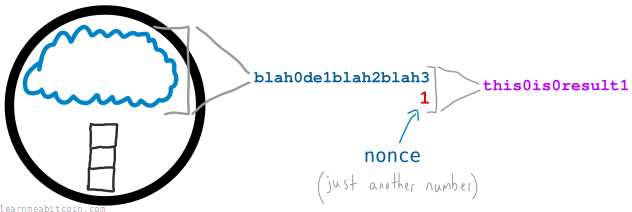
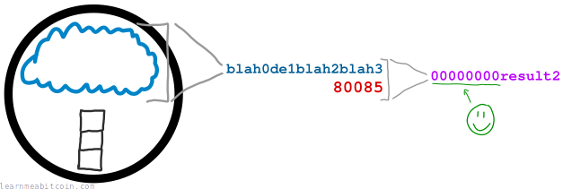
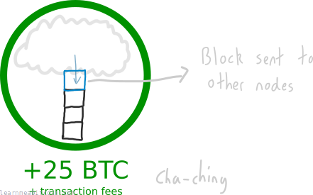
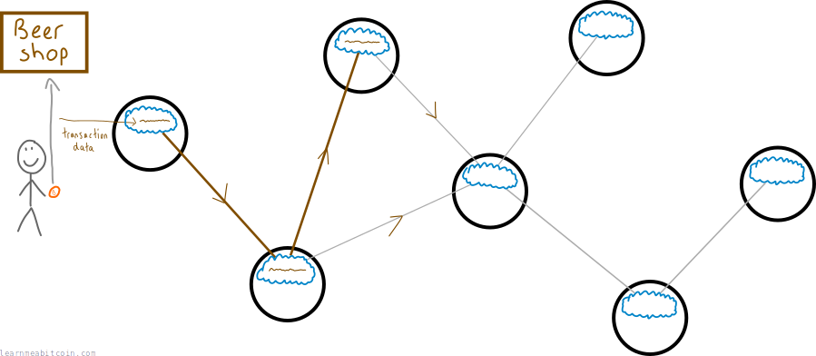
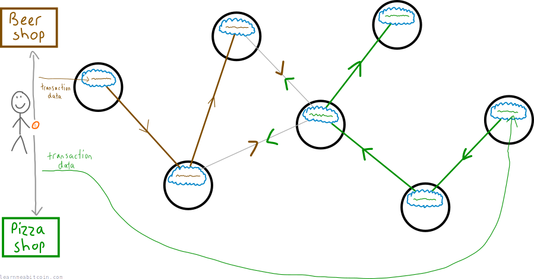
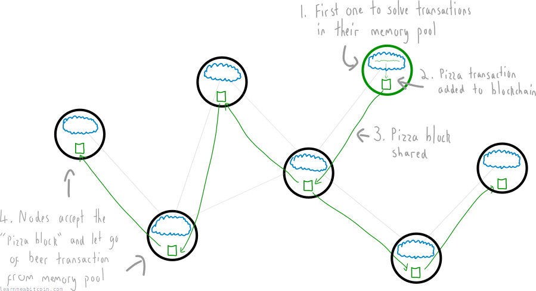
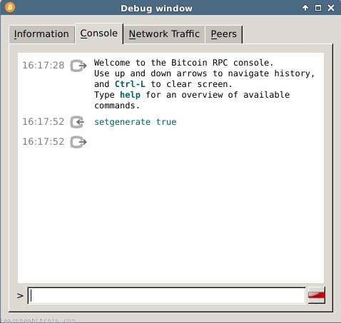

Bitcoin mining is the process of **adding [transactions](/beginners/guide/transactions/) to the [blockchain](/beginners/guide/blockchain/)**.

## How does mining work?

Every [node](/beginners/guide/node/) on the [bitcoin network](/beginners/guide/network/) shares information about new transactions.

Each node stores the new transactions they receive in their *memory pool*.

The *memory pool* is a node's temporary storage area for new transactions.

Each node also has the option to try and "mine" the transactions in their memory pool into a permanent **file**. This file is a ledger of every bitcoin transaction, and it's called the *blockchain*.

You could think of the memory pool as containing "floating" transactions, and the blockchain as containing "archived" transactions.

However, to add transactions from the memory pool to the blockchain, a node has to use a lot of computer **processing power**.

This processing power is required due to the presence of a specific type of *challenge*.

### What is this challenge?

Okay, imagine you're a node. At any moment in time you can condense the transactions in your memory pool into a single "string" of numbers and letters.

This string represents all of the transactions in your memory pool.

This "string" is basically a [hash](/technical/cryptography/hash-function/) of the transactions in the memory pool

Now, your objective is to [hash](/technical/cryptography/hash-function/) this string with *another number* (called a *[nonce](/technical/block/nonce/)*) to try and get a new string that **begins with a certain number of zeros**.

Most of the time you will get a result that isn't even close:

But if you keep going you may stumble upon a number that works:

 Example Hash Function

Text

Enter any string of characters

`0 characters`

SHA-256

SHA-256(text)

`0 bytes`

0 secs

**This is just a quick example of the SHA-256 hash function.** It hashes text (ASCII characters) instead of hexadecimal bytes. Use SHA-256 and HASH256 instead for hashing actual raw data in Bitcoin using SHA-256.

Now, this sounds easy enough, but it's actually very difficult. The process is utterly *random*, and you can only hope to find a winning result through trial and error. And that's what mining *is* – lots of hashing (using processing power) and hoping to get **lucky**.

But if you are lucky enough to find a successful hash result, the transactions in your memory pool get added to the blockchain, and every other node on the network will add your block of transactions to their blockchain too.

Furthermore, you'll also receive a [block reward](/technical/mining/block-reward/) for your effort (which also includes any [fees](/technical/transaction/fee/) from the transactions you've added to the blockchain).

Note: The block reward is no longer 25 BTC (I originally wrote this article in 2015).

The "certain number of zeros" comes from the [difficulty](/beginners/guide/difficulty/). This changes based on the speed of mining across the network – the faster people mine, the greater the difficulty becomes, and the more zeros are needed at the start (which helps to keep the time between blocks consistent).

This is a slightly simplified version of how blocks are added to the blockchain. For more detail, check out [blocks](/beginners/guide/blocks/).

## Why is mining important?

Good question. Why not add transactions directly to the blockchain?

Because mining allows the entire bitcoin network to agree on which transactions get "archived", and this is how you sort out fraudulent transactions in a digital currency.

### Go on...

When you make a bitcoin transaction, not all nodes on the network will hear about it instantly. Instead, transactions travel across the bitcoin network by being passed from one node to the next.

*Propagation* is the word used to describe the way transactions travel across the network.

However, it's actually possible to make *another* transaction spending those same bitcoins and insert that second transaction into a different part of the network.

For example, you could buy a beer with some bitcoins, then quickly attempt to buy a slice of pizza with those *same* bitcoins.

In other words, some good ol' **fraud**.

So what's going on here?

* Some nodes get the pizza transaction first (and ignore the beer transaction).
* Some nodes get the beer transaction first (and ignore the pizza transaction).

Yet even though we know you made the beer transaction first, due to the way transactions travel across the bitcoin network, the network would be in a disagreement about whether you should get the beer or the pizza.

### So how does the network decide which transaction to keep?

Mining, of course.

The **first** node on the network to complete the challenge will add the transactions in *their* memory pool on to the blockchain.

For example, if a node with the pizza transaction successfully mines a block, then that's the transaction that gets added to the blockchain, and the beer transaction gets kicked out of the network.

It seems like an unorthodox way to select transactions, I know, but this is the solution the bitcoin network uses to reach a *consensus* when dealing with conflicting transactions (also known as a "double-spend").

It only takes about 10 minutes for each new block of transactions to be added to the blockchain, so you only need to wait 10 minutes for a confirmation that bitcoins have "arrived" at a new address (and haven't been sent to an alternative address).

### Another benefit of mining.

If you want to try and control the blocks (i.e. transactions) that get added to the blockchain, you have to compete to solve block puzzles with every other mining node on the bitcoin network.

To put it another way: you need to have a computer with enough processing power to out-work the processing power of every other bitcoin miner combined.

Which is entirely possible – you just need to spend a few billion on hardware and you're good to go (although this figure increases as more mining power joins the network).

So in other words, this mining competition prevents any single miner from having complete control over which transactions get added to the blockchain.

## How do I start mining?

Mining through the Bitcoin Core client is no longer possible.

This functionality was completely removed in 2016:

> As CPU mining has been useless for a long time, the internal miner has been removed in this release, and replaced with a simpler implementation for the test framework.

[Bitcoin 0.13.0 Release Notes](https://github.com/bitcoin/bitcoin/blob/master/doc/release-notes/release-notes-0.13.0.md#removal-of-internal-miner)

If you want to start mining, you will need to look into buying your own specialized hardware and joining what's known as a "mining pool".