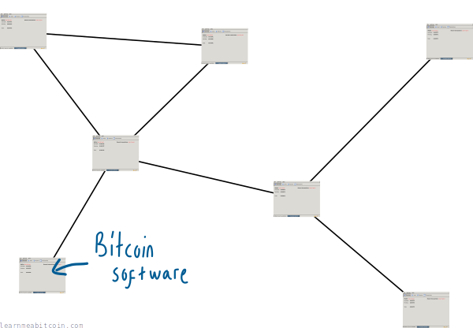
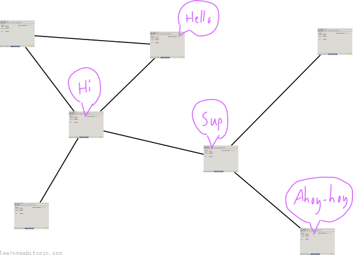
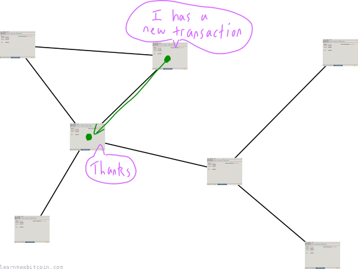
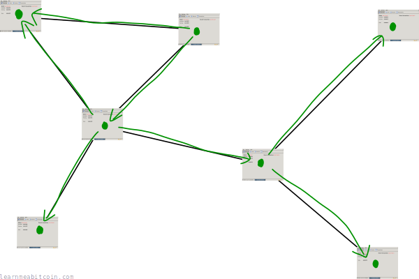
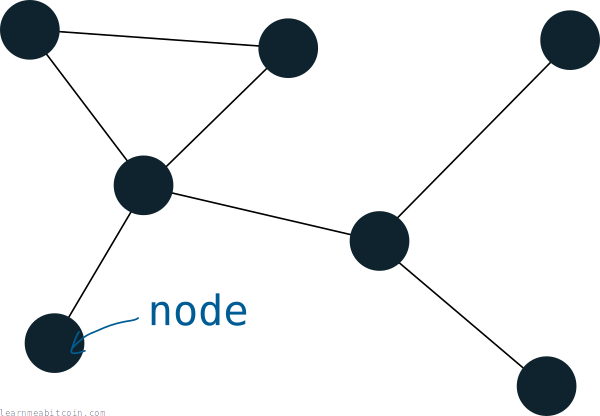

比特币网络由运行[比特币软件](https://bitcoincore.org/en/download/)的个人组成。

这个软件被称为“比特币客户端”。

## 网络是做什么的？

网络上的个人（其实是*比特币客户端*）**相互进行交谈**。

我所说的“相互交谈”，指的是*传递*关于网络其他部分正在发生什么的信息。这是通过向彼此发送*[消息](../../technical/networking.md#messages)*来实现的。

例如，消息可以是**关于新*[交易](transactions.md)*的信息**。

共享信息（例如交易）是允许网络上的每个人保持最新状态的原因，如果你想在互联网上运行一种数字货币，这一点非常重要。

而且因为网络上的所有节点都致力于分享交易，所以网络上的每个人最终都会知道最新的交易。

优秀的网络。

比特币网络被描述为“对等网络 (P2P)”，因为：

1. 每个人都相互连接，所以这是一个*网络*。
2. 网络上的每个人都是平等的，所以我们是*对等体 (peers)*。

## 谁组成了网络？

如前所述，**任何拥有活跃互联网连接并运行比特币客户端的人**。

严肃地说，*任何人都可以加入比特币网络*。你所需要的只是一个互联网连接和一个[比特币客户端](https://bitcoin.org/en/download/)，这只是一款和其他任何软件一样的程序。

一旦你运行起来，你就会被称为比特币网络上的一个**[节点](node.md)**。

“节点”是表示“运行比特币客户端并在网络中中继转发信息的个人”的一种略微更简练的表达方式。

## 我该如何加入网络？

这就是比特币精神。

你所需要做的就是下载（并运行）一个[比特币客户端](https://bitcoincore.org/en/download/)。

当你运行该客户端时，它将连接到其他节点，并开始下载完整的[区块链](blockchain.md)副本（包含所有已验证交易的文件）。之后，你的客户端将开始从其他节点接收交易，并在网络中对其进行中继转发。

恭喜你，你现在是比特币网络上的一个节点了。

你可能需要[在你的路由器中修改一些设置，以允许其他节点连接到你](https://bitcoin.org/en/full-node#enabling-connections)，但这只是一个微小的配置。通过下载并运行比特币客户端，你已经完成了成为比特币网络中活跃节点 95% 的过程。