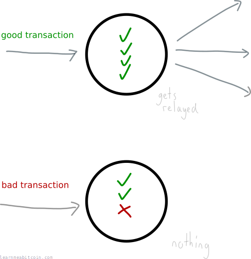
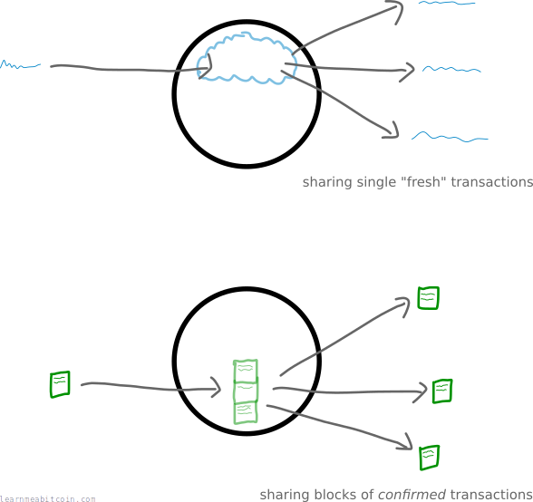
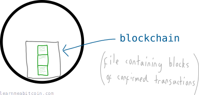
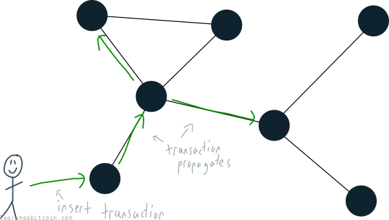

A Bitcoin node is just a **computer that is running the [Bitcoin program](https://bitcoincore.org/en/download/)**.

More importantly, it is *connected to other computers* (running the same program) to create a [network](/docs/beginners/guide/network.md).

## What does a node do?

A node has three jobs:

1. Follow the rules
2. Share information
3. Keep a copy of confirmed [transactions](/docs/beginners/guide/transactions.md)

### 1. Follow the rules

Each node (bitcoin client) has been programmed to follow a set of rules. By following these rules a node is able to check the transactions it receives and only relay them if everything is cool. If there are any problems, the transaction isn't passed on.

Your node ain't gonna be relaying any dodgy transactions.

For example, one rule is that a person must own an equal or greater amount of bitcoins than they are trying to send. So if your node receives a transaction where someone has tried to send more bitcoins than they own, the transaction won't be passed on to other nodes.

### 2. Share information

A node's main job is to share information with other nodes, and the core information a node shares is **[transactions](/docs/beginners/guide/transactions.md)**.

Now, there are two types of transactions that nodes share:

1. **Fresh transactions** – transactions that have recently entered the network.
2. **Confirmed transactions** – transactions that have been "confirmed" and written to a file. These are shared in [blocks](/docs/beginners/guide/blocks.md) of transactions (as opposed to individually).

Don't worry about the difference between these two right now. It will all become clear in [mining](/docs/beginners/guide/mining.md) and [blocks](/docs/beginners/guide/blocks.md).

### 3. Keep a copy of confirmed transactions

As mentioned, each node also keeps blocks of *confirmed* transactions. These are held together in a file called the [blockchain](/docs/beginners/guide/blockchain.md).

Fresh transactions are bounced around the network until they are etched into the blockchain, which is **permanent storage** for transactions.

Each node has a copy of the blockchain for safe keeping, and shares it with other nodes if their copy isn't up-to-date.

The process of adding fresh transactions to the blockchain is called [mining](/docs/beginners/guide/mining.md).

## Who controls the bitcoin nodes?

Each node is *autonomous*.

> **Autonomous** – Not controlled by others or by outside forces; independent.

By that I mean that when you run a bitcoin client, the network doesn't "tell you what to do". Instead, your bitcoin client already knows what to do, and it *makes its own decisions*.

So the entire bitcoin network is made up of nodes *making their own decisions*, but they each make the same decisions as one another, which makes it a completely *decentralized* yet powerful network.

If every other node went offline, your node would be upholding the entire bitcoin network.

## Do I have to run a node to use bitcoin?

Nope.

You can send and receive bitcoins without having to run a node. You just need to get the transaction *in* to the bitcoin network and you're good to go.

If you send a message to just *one* node about a transaction, it will eventually propagate the entire network.

If you're using a [wallet](/docs/beginners/wallets.md) for example, they will feed the transactions you make into the network for you.