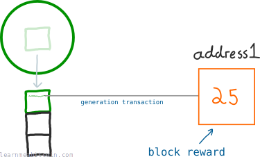
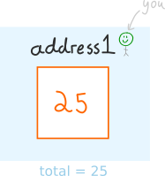
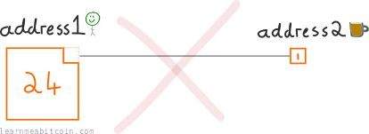
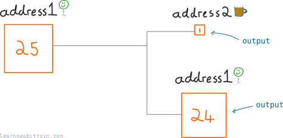
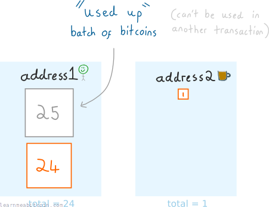
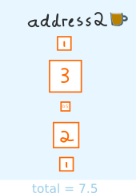
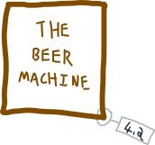
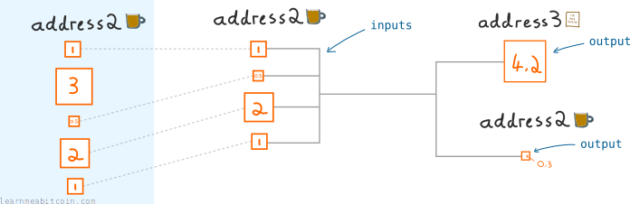
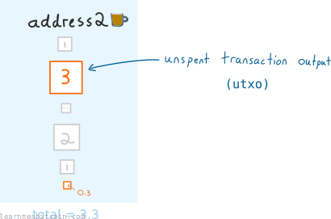
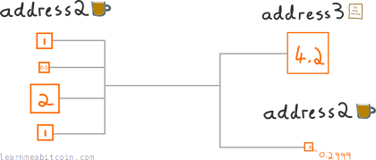

比特币的[交易](transactions.md)系统涉及发送和接收被称为“输出 (outputs)”的整批比特币。

这足够简单，但真正理解输出如何工作的唯一方法是看看几个交易示例。

## 输出从哪里来？

让我们通过一批新鲜比特币的诞生来开始对交易输出的解释……

你正在独自[开采（挖矿）](mining.md)比特币。奇迹般地，你成功开采了一个交易[区块](blocks.md)并为自己赢得了[区块奖励](../../technical/mining/block-reward.md)。

[](../../images/beginners_guide_outputs_00-generation-transaction.png)

每个矿工都会在每个区块的顶部包含他们自己的地址，所以如果他们成功开采了该区块，区块奖励就可以发送到他们的地址。这是通过 [Coinbase 交易](../../technical/mining/coinbase-transaction.md)（或者像以前人们称呼的那样，即“币源交易（generation transaction）”）来申领的。

所以这就是你比特币地址的当前状态：

[](../../images/beginners_guide_outputs_01-transaction1-before.png)

我最初写这篇文章时，区块奖励是 25 BTC。

自然地，你的第一本能是庆祝。所以让我们使用其中的 1 个比特币来买些啤酒。

[](../../images/beginners_guide_outputs_01-beer.png)

啤酒。

现在，你的另一个第一本能是切下这 1 个比特币（来自区块奖励）来支付这瓶啤酒。这看起来很合乎逻辑，但交易并不是这么运作的。

[](../../images/beginners_guide_outputs_01-transaction1-chip.png)

不对。而且这啤酒可真贵。

相反，我们必须在交易中**发送整批 25 个比特币**。

但为了确保我们*不会在“1 个比特币”的付款中把全部 25 个比特币都花掉*，我们**把这批比特币分开**并发送到*两个目的地*：

1. 支付给啤酒商店作为货款
2. 发送回我们自己的地址作为找零

[](../../images/beginners_guide_outputs_01-transaction1.png)

新创建出来的批次被称为*输出 (outputs)*。

这种做法虽然有点绕圈子，但它达到了相同的最终结果。

无论如何，交易*之后*比特币地址看起来是这样的：

[](../../images/beginners_guide_outputs_01-transaction1-after.png)

啤酒商店有一批新的 1 个比特币，我们给自己发送了一批新的 24 个比特币（作为找零）。原来那批 25 个比特币现在已经被“用完”，不能再花费了。

所以实际上，这就像是我们从自己的地址拿了 1 个比特币并发送到另一个地址……但现在我们知道在底层*真正*发生了什么。

### 总结：

一笔交易：

1. 使用现有的输出作为输入 (inputs)。
2. 从输入中创建全新大小的输出。
3. 将输出锁定到不同的地址。

交易使用这种“输出”系统的原因在于，从编程的角度来看，这是构建支付的一种简便方式。

## 你如何在一笔交易中花费多个输出？

好的，从现在开始我们将使用*输出 (output)*一词，而不是“批次”。

无论如何，自从啤酒商店卖给我们那瓶啤酒后，已经过去了几天。从他们比特币地址的当前状态来看，啤酒生意正在蓬勃发展：

[](../../images/beginners_guide_outputs_02-transaction2-before.png)

自从我们买了啤酒之后，啤酒商店已经收到了四笔新的付款。

但正如我们所知，啤酒不会长在树上。所以啤酒商店正在寻找一台全新的啤酒机。

[](../../images/beginners_guide_outputs_02-beer-machine.png)

这就是我朋友在出去玩的晚上对我的称呼。

看啊，一台很棒的啤酒机，价格极低，只需 4.2 个比特币。

让我们买下它……

[](../../images/beginners_guide_outputs_02-transaction2.png)

为啤酒机构建交易。

好吧，我意识到我刚才在这个图表的复杂程度上又提高了几档，但它其实不难理解：

1. 啤酒商店在他们的地址上没有单个能够覆盖啤酒机成本（4.2 BTC）的输出。因此，我们*把几个输出收集在一起*，使其总和大于 4.2 BTC。
2. 当我们构建一笔交易时，我们收集用于花费的输出被称为交易*输入 (inputs)*。
3. 使用 **4.5 BTC** 的总输入金额，啤酒商店创建了两个分别为 **4.2 BTC** 和 **0.3 BTC** 的新输出。

当你在交易中*花费*一个输出时，它就被称为一个**输入 (input)**。

交易后啤酒商店的比特币地址状态如下：

[](../../images/beginners_guide_outputs_02-transaction2-after.png)

啤酒商店用完了 4 个输出，并得到了一个新的 0.3 BTC 输出（来自找零）。

再次说明，被用作*输入*的*输出*已经被“花费”了，不能再使用了。

然而，“未花费”的输出依然可以用来花费，所以我们把它们称为*未花费交易输出*（[UTXO](../../technical/transaction/utxo.md)）。

一个地址的余额就是该地址 UTXO 的总和。

### UTXO 选择

我们选择了 `[1] + [0.5] + [2] + [1]` 的输出作为交易的输入。但只要总和大于我们想发送的金额，我们就可以使用我们想要的任何输出（也就是*输入*）组合。

例如：

```
[1] + [3] + [0.5]             = 4.5
[3] + [2]                     = 5
[1] + [3] + [0.5] + [2] + [1] = 7.5
```

任何这些输入组合都是可以的。你自己可以算出每一个组合的找零。

## 交易费从哪里来？

啊，是的，我们在最后两笔交易中都没有包含[交易费](../../technical/transaction/fee.md)。

如果没有交易费，这两笔交易可能需要很长时间才能被包含在区块中（如果真的被包含的话）。这是因为交易费能给你的交易带来*优先级*。

你看，当矿工开采区块时，他们会收取交易费。所以如果有很多交易在[内存池](../../technical/mining/memory-pool.md)中等待，添加交易费会给矿工提供*激励*，促使他们将你的交易包含在下一个区块中。

总之，假装我们没有把最后一笔交易发送到网络中，让我们给它添加一笔交易费：

[](../../images/beginners_guide_outputs_03-transaction2-fee.png)

好吧，那交易费的输出到底在哪里？额，其实并没有。但**看看输出的金额大小**。

输出的总和小于输入的总和，这意味着有一些剩余的比特币没有被用完。这个“遗留”下的金额就是交易费。

而交易费仅此而已——就是一笔交易的剩余部分。

**一笔交易中剩余的金额总是会被矿工拿走。** 所以如果你手动构建一笔交易并忘记为自己创建找零输出，矿工就会拿走你留下的所有余额，无论那是多少。不过，如果你使用的是[钱包](../wallets.md)为你构建交易，这并不是需要担心的问题，因为它们总是会自动为你处理好找零。