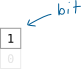
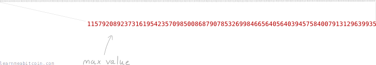
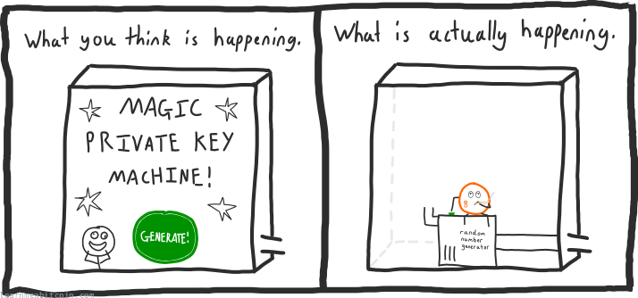
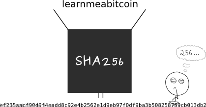

私钥是一个**随机生成的大数**。

例如：

Generate

但更精确地讲，私钥是一个随机的 **256-[位](/docs/technical/general/bytes.md#bit)** 数字：

是的，这依然是一个*数字*。它只是用*二进制*表示的，也就是数字在计算机中的存储方式。毕竟你知道，比特币归根结底是一个计算机程序。

无论如何，我们可以很容易地将这个私钥从*二进制*转换为*十进制*：

或者转换为* [十六进制](/docs/technical/general/hexadecimal.md)*：

这没有任何区别。它们都是同一个数字，也都是同一个私钥。

 进制转换器

二进制 (Base 2)

0b

`0 位`

十进制 (Base 10)

0d

`0 位`

十六进制 (Base 16)

0x

`0 位`


+1


0 secs

因为归根结底，私钥只是一个数字。

原始私钥通常以*十六进制*格式显示。

## 什么是 256 位数字？

256 位数字是一个可以存储在 256 *位 (bits)*数据内部的数字。

### 什么是位？

[位](/docs/technical/general/bytes.md#bit)是计算机内部最小的数据单位。

| 单位 | 大小 |
| --- | --- |
| 吉字节 (GB) | 1000 兆字节 |
| 兆字节 (MB) | 1000 千字节 |
| 千字节 (KB) | 1000 字节 |
| 字节 (Byte) | 8 位 |
| 位 (Bit) |  |

事实上，一个位是如此之小，它只能保存 `1` 或 `0` 的值：

[](/docs/beginners/guide/private-keys/01-bit.png.md)

尽管如此，你仍然可以使用位来表示其他类型的数据，例如日常数字。

例如，以下是利用位在计算机中存储十进制数字 0 到 8 的方法：

[](/docs/beginners/guide/private-keys/01-bit-numbers.png.md)

因此，一个 256 位数字是一个可以使用 256 个这样的位来表示的数字：

[](/docs/beginners/guide/private-keys/01-bit-numbers-max.png.md)

或者换句话说，一个 256 位数字处于：

```
最小: 0
最大: 115792089237316195423570985008687907853269984665640564039457584007913129639935
```

所以如你所见，256 位给你留出了使用相当庞大数字的空间。

而这正是 256 位数字的全部；即能容纳在 256 位数据内部的数字。

256 位数字的最大数量等于 2^256。

## 私钥是从哪里来的？

我说它们是随机生成的，并没有说谎。

老实说，当你使用任何种类的比特币软件生成私钥时，它们并没有在施展魔法——它们只是给你一个随机的 256 位数字。

[](/docs/beginners/guide/private-keys/02-lol-private-key-machine.png.md)

因此，没有理由你不能自己创建私钥。你所需要的只是能够*安全地*生成一个随机的 256 位数字。

你可以通过多种方式来做这件事：

### 1. 投掷硬币 256 次。

投掷硬币 256 次允许你生成一个**二进制**的 256 位私钥：

[](/docs/beginners/guide/private-keys/02-1-coin.png.md)

然后可以将这个 256 位的二进制结果转换为十六进制。

 进制转换器

二进制 (Base 2)

0b

`0 位`

十进制 (Base 10)

0d

`0 位`

十六进制 (Base 16)

0x

`0 位`


+1


0 secs

### 2. 使用你最喜欢的编程语言。

这将给你一个**十进制**的私钥：

```python
# need to use the operating system's random number generator for security
import random
random.SystemRandom().randint(1, 115792089237316195423570985008687907852837564279074904382605163141518161494336)
```

**使用编程语言生成随机数时要小心。** 大多数编程语言中的默认“随机”函数通常不够随机，因此请确保你使用的函数被描述为“密码学安全”。

### 3. 使用 SHA-256 [哈希函数](/docs/technical/cryptography/hash-function.md)对一些随机数据进行哈希计算。

将*随机*数据输入 SHA-256 将返回一个 32 字节（256 位）的**十六进制**结果，这可以用作私钥：

[](/docs/beginners/guide/private-keys/02-3-sha256.png.md)

 SHA-256 (Text)

Text

输入任意字符

`0 字符`


SHA-256

SHA-256(text)

`0 字节`


0 secs

**这只是 SHA-256 哈希函数的一个快速示例。** 它对文本（ASCII 字符）进行哈希处理，而不是十六进制字节。在比特币中使用 SHA-256 和 HASH256 来对实际原始数据进行 SHA-256 哈希计算。

**你哈希的数据必须足够庞大且随机。** 将单词“bitcoin”放入 SHA-256 哈希函数中（并将其用作你的私钥）是不安全的。

所有这些方法都会给你一个 256 位数字。如果你有一个 256 位数字，你就拥有了一个私钥。

你的私钥必须是*随机的*。

如果你使用的随机数生成器不够可靠地随机（即它生成随机数的方式存在规律/模式），你就会让自己容易受到任何熟悉你所用随机数生成器缺陷的人的攻击。

而如果有人能够重现与你相同的私钥，他们就能拿走你的比特币。

因此，大多数指南都会让你对生成自己的私钥感到恐惧，因为没有人想为你的错误承担责任。

但不要让所有这些恐吓阻止你。只要你保持谨慎，你就不会有事。

**有效的私钥实际上略小于最大 256 位数字。** 因此，如果你正在生成私钥，你需要在尝试使用它之前检查它是否在[有效范围](/docs/technical/keys/private-key.md#range)内。这种情况很少见，但检查它很重要。

**任何人都可以通过简单地生成一个随机数来创建自己的“账户”，这是比特币的一个重要特征。** 这意味着没有人在控制分发账户，这意味着任何能够生成大随机数的人都可以使用比特币。

## 如果有人生成了和我一模一样的私钥怎么办？

那么他们就能偷走你的比特币。

但别担心，**没有人会随机生成和你一模一样的私钥**。

### 难道不可能吗？

好吧，理论上确实有可能，但由于可能私钥的数量范围巨大，这基本上“不可能”。

例如，如果我有一百万只猴子，每只猴子每秒钟能生成一百万个私钥（我把它们训练得很好），它们大约需要 3,671,743,063,080,803,235,470,924,132,853,876,261,056,103,149,731,840 百万年（大约）才能生成所有可能出现的私钥。

现在，如果你尝试通过暴力破解搜索来找到别人的私钥，*平均*而言，在找到你要找的那个私钥之前，你需要运行所有可能私钥中的*一半*，这意味着如果这些猴子想要生成与你完全相同的私钥，它们将面临 1,835,871,531,540,401,617,735,462,066,426,938,130,528,051,574,865,920 百万年的工作量。

```python
keys = 115792089237316195423570985008687907852837564279074904382605163141518161494336
monkeys = 1000000
rate = 1000000

keyspersecond = monkeys * rate

seconds = keys / keyspersecond
minutes = seconds / 60
hours = minutes / 60
days = hours / 24
years = days / 365
millionyears = years / 1000000

print(round(millionyears))     #=> 3671743063080803235470924132853876261056103149731840 (所有私钥)
print(round(millionyears / 2)) #=> 1835871531540401617735462066426938130528051574865920 (找到别人私钥的平均时间)
```

所以如你所见，我这边并没有足够的时间或猴子算力。其他人也没有。

存在着如此之多可能的私钥，以至于随机选择一个本身就是安全的。

### 说的也是。

我还没说完。

256 位数字的范围（以及因此可能私钥的数量）是大到无法想象的。就像人类大脑无法想象宇宙的真实尺度一样，人类大脑也无法理解 256 位数字的庞大规模。

所以，如果你对你的 256 位数字的安全性有任何怀疑，要么是因为你没有使用足够可靠的随机数生成器，要么是因为你不了解我们正在打交道的数字的庞大数量级。

现在，请离开我的办公室。

随机生成
重置


### 二进制位 (256 Bits)

```
00000000 00000000 00000000 00000000 00000000 00000000 00000000 00000000
00000000 00000000 00000000 00000000 00000000 00000000 00000000 00000000
00000000 00000000 00000000 00000000 00000000 00000000 00000000 00000000
00000000 00000000 00000000 00000000 00000000 00000000 00000000 00000000
```

二进制 (Base 2)

0b0000000000000000000000000000000000000000000000000000000000000000000000000000000000000000000000000000000000000000000000000000000000000000000000000000000000000000000000000000000000000000000000000000000000000000000000000000000000000000000000000000000000000000

`256 位`

十进制 (Base 10)

0d0

`0 位`

十六进制 (Base 16)

0x0000000000000000000000000000000000000000000000000000000000000000

`0 字节`


**切勿使用网站生成的私钥，也不要在网站上输入你的私钥。** 网站很容易保存私钥并用它来窃取你的比特币。

0 secs