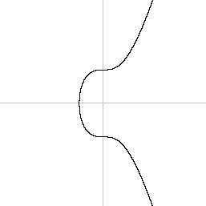
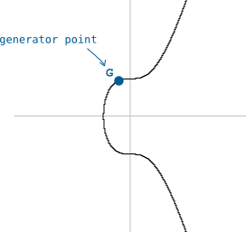
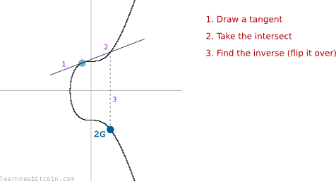
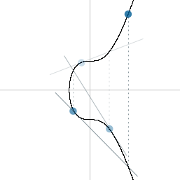
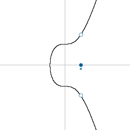
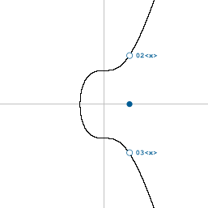
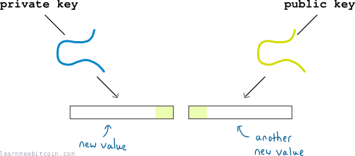
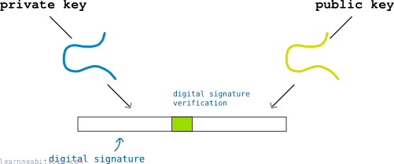

公钥是[私钥](../../technical/keys/private-key.md)的对应物。

与私钥类似，它显示为一个[十六进制](../../technical/general/hexadecimal.md)字符串。

例如：

```
03afc4052aa75b35ea6f688a113ae2d358a3aa55539e070d7d2dd4b2f57bdad2d5
```

如果我们不把这个公钥缩短为[地址](../../technical/keys/address.md)，那么在进行[交易](transactions.md)时，它就是你向其发送比特币的“账号”。

总之，这里是很有趣的部分：**你的公钥是由你的私钥计算出来的**。

## 你如何从私钥得到公钥？

你将私钥输入到一个特殊的*数学函数*中，结果就是公钥。

### 这个函数是什么？

它被称为**[椭圆曲线乘法](../../technical/cryptography/elliptic-curve.md#multiply)**。

这基本上包括在椭圆曲线的图表上不断“弹跳”，直到你最终落在图表上的一组最终坐标上，这些结果坐标就是你的公钥。

我向你展示一下会更容易理解……

### 椭圆曲线看起来像什么？

像这样：

[](../../images/beginners_guide_public-keys_01-elliptic-curve.png)

此外，[比特币中使用的椭圆曲线](../../technical/cryptography/elliptic-curve.md)带有一个特定的*起点*。

[](../../images/beginners_guide_public-keys_01-elliptic-curve-g.png)

我们把这个起点称为*生成点* (G)。

如果我们要在这条曲线上做一些“乘法”（例如将起点“乘以” 2），我们就会像这样在曲线上移动。

[](../../images/beginners_guide_public-keys_01-elliptic-curve-g-multiplication.png)

我们可以在曲线上的任何地方画一条切线，且它与曲线上的*另一个*点相交，这是椭圆曲线的一个特殊特征。

就是这样。我们刚刚将起点坐标 **G** 乘以了 2，并找到了最终坐标 **2G** 的位置。

这是椭圆曲线乘法的*一轮*计算。

#### 椭圆曲线乘法

我一直把“乘法”放在引号里，因为椭圆曲线上的乘法**不是普通的乘法**。例如，如果你只是把 G 的坐标乘以 2，它并不会给你 2G 的坐标（如图表所示）。

你看，发现可以以这种特定方式在曲线上移动的天才们不得不给它起个名字，所以他们决定将这种操作称为“乘法”。毕竟，数学永远都不嫌够让人困惑。

所以从现在开始，当我提到“乘法”时，我的意思是“椭圆曲线乘法”。

### 你如何创建公钥？

在上面的例子中，我们把 `G` 乘以 2 得到了 `2G`。

要得到公钥，我们将 `G` 乘以我们的私钥。

```
private key = 62132aa90f42874faae316b40190b0f4306300e9a0e00d636bf1a4ffc8716199
private key = 44360523686575499951926356314921230805999682578161446845471888997559888339353

public key  = 44360523686575499951926356314921230805999682578161446845471888997559888339353 * G
```

 椭圆曲线乘法

生成点

随机点


点 1

x:

0d

y:

0d


乘数

0d


+1

随机


点 1 x 乘数

x:

0d

y:

0d


步骤


0 secs

或者换句话说，“在椭圆曲线上弹跳私钥数字所代表的次数”。

[](../../images/beginners_guide_public-keys_02-public-key-multiplication.png)

椭圆曲线上的最终落脚点将给你一组坐标，这些坐标构成了公钥。

所以，如果把 `G` 乘以我们的私钥后，我们最终得到的坐标是：

```
x = 79501086185442349843693847274906543406531753578810518737095233142215568708309
y = 69919270316357694283546792236970490308989664412014609961442098166755831692197
```

那么我们只需要把这两个数字转换为十六进制并拼在一起……

```
public key (x) = afc4052aa75b35ea6f688a113ae2d358a3aa55539e070d7d2dd4b2f57bdad2d5
public key (y) = 9a94e79317110f6ebb9d7d26fc6c57cb507bea9646dc73f950fb4e7c5c61bba5

public key (x,y) = afc4052aa75b35ea6f688a113ae2d358a3aa55539e070d7d2dd4b2f57bdad2d59a94e79317110f6ebb9d7d26fc6c57cb507bea9646dc73f950fb4e7c5c61bba5
```

 公钥

随机生成

私钥

`0 字节`

公钥


坐标

x:

0d

y:

0d

奇偶性 (parity):

公钥只是椭圆曲线上的一个点。最终的公钥就是十六进制的这些坐标。

压缩
 已压缩 (02 或 03 前缀)
 未压缩 (04 前缀)
 仅 x (无前缀)

椭圆曲线沿 x 轴对称，因此*压缩的*公钥只需要存储完整的 x 坐标，以及 y 坐标是奇数还是偶数。

仅 x 的公钥用于 [Taproot](../../technical/upgrades/taproot.md) 输出中。对应的 y 坐标被假定为偶数。

`0 字节`


**切勿在网站中输入你的私钥，也不要使用网站生成的私钥。** 网站很容易保存私钥并用它来窃取你的比特币。

0 secs

大功告成！一个公钥诞生了！

#### 公钥格式

这是*旧*的（长的）公钥格式，这意味着我必须在开头放一个 `04`。像这样：

```
public key = 04afc4052aa75b35ea6f688a113ae2d358a3aa55539e070d7d2dd4b2f57bdad2d59a94e79317110f6ebb9d7d26fc6c57cb507bea9646dc73f950fb4e7c5c61bba5
```

要找出为什么是这样，恐怕你得读一读关于[压缩公钥](#compressed-public-keys)的部分了。

### 压缩公钥

为了节省空间，公钥（现在）只使用完整的 `x` 坐标。

这是因为椭圆曲线是一个*方程* (`y^2 = x^3 + 7`)，这意味着如果你有了 `x` 坐标，你就可以算出对应的 `y` 坐标。

然而，由于方程中 `y^2` 部分的存在，`y` 可以是一个*正数*或*负数*：

[](../../images/beginners_guide_public-keys_03-y-polarity.png)

所以，找到正确的 `y` 坐标所需的唯一额外信息就是知道 `y` 坐标是在 x 轴*上方*还是*下方*。而根据椭圆曲线的工作原理：

* 如果 `y` 是**偶数**，它就在 x 轴*上方*。
* 如果 `y` 是**奇数**，它就在 x 轴*下方*。

所以你不需要同时存储完整的 `x` 和 `y` 坐标，你可以只存储完整的 `x` 坐标，以及 `y` 坐标是*偶数*还是*奇数*。

在比特币中，`y` 坐标的极性由一个前缀表示：

* `02` = 偶数
* `03` = 奇数

[](../../images/beginners_guide_public-keys_03-y-polarity-prefix.png)

因此，旧式的未压缩公钥以 `04` 开头，而**压缩公钥**则以 `02` 或 `03` 开头：

```
public key (uncompressed) = 04afc4052aa75b35ea6f688a113ae2d358a3aa55539e070d7d2dd4b2f57bdad2d59a94e79317110f6ebb9d7d26fc6c57cb507bea9646dc73f950fb4e7c5c61bba5
public key (compressed)   = 03afc4052aa75b35ea6f688a113ae2d358a3aa55539e070d7d2dd4b2f57bdad2d5
```

短了许多。

这看起来像为省去一小部分数据付出了很多努力，但由于几乎所有交易中都会使用公钥，这确实在随着时间的推移为[区块链](blockchain.md)节省了大量空间。

## 为什么我们使用椭圆曲线乘法来制作公钥？

因为在创建私钥/公钥对时，椭圆曲线有两个有用的属性。

1. **椭圆曲线乘法是一个“陷门函数”**。换句话说，你无法从公钥反向寻找计算出私钥是什么。

   > 陷门函数是一个单向函数，在一个方向上很容易计算，而在相反方向上（寻找它的逆）很难计算，除非有特殊的被称为“陷门”的信息。
2. **公钥与私钥有*数学上的联系***。因此，在不需要透露你的私钥的情况下证明这种联系（利用稍微多一些的数学）是可能的。

   所以如果我给你我的公钥（或[地址](../../technical/keys/address.md)），我可以向你证明我“拥有”它，而不需要给你看我的私钥。

   这个特性在进行比特币[交易](transactions.md)时尤其好用。当你想要接收比特币时，你的公钥可以被放入交易中，而当你稍后想要花费它们时，你不需要直接泄露私钥（见[数字签名](digital-signatures.md)）。因此，这意味着没有人可以获取私钥并用它来花费锁定在相同公钥下的比特币。

   当我所说*证明*我拥有一个公钥时，我的意思是“展示我拥有创建该公钥对应的私钥”。

### 你如何证明你拥有公钥？

这本身就是一个（或两个）完整的主题。但鉴于这是一个如此具有相关性的问题，我会尽力介绍基础知识。

如上所述，私钥和公钥之间存在数学连接。

结果是：

1. 我可以让我的私钥经过更多的椭圆曲线数学计算，以得到***一个新值***（称为数字签名）。
2. 我可以让我的公钥经过其他的椭圆曲线数学计算，以得到***一个新值***。

[](../../images/beginners_guide_public-keys_04-keys-ec-math.png)

现在，在这些新值之间会存在一些微小的*重叠*：

[](../../images/beginners_guide_public-keys_04-keys-ec-math-verification.png)

而这个重叠部分就足以证明公钥和私钥之间存在*数学连接*。

而且因为在没有私钥的情况下，没有人能够重新生成这个数字签名，所以我的数字签名就足以证明我“拥有”公钥。

因此，我可以用数字签名向你展示我拥有一个公钥，而你永远不需要看到我的私钥。

### 结论

向椭圆曲线致敬。