[BIP 141: Segregated Witness](https://github.com/bitcoin/bips/blob/master/bip-0141.mediawiki)

The Segregated Witness (*SegWit*) upgrade in 2017 changed the structure of [transaction data](/docs/technical/transaction.md) in Bitcoin.

The main reason for this upgrade was to fix **transaction malleability** (I'll explain this in a moment). The other significant change was a **[block size](/docs/technical/block.md#weight) increase**.

## What was the main change?

### Legacy transaction

In a [legacy transaction](/docs/technical/transaction.md#example-legacy), the unlocking code (and [signatures](/docs/technical/keys/signature.md)) sit *next* to each [input](/docs/technical/transaction/input.md), so the unlocking code is spread throughout the transaction data.

The [TXID](/docs/technical/transaction/input/txid.md) is then created from the **entire transaction data**:

[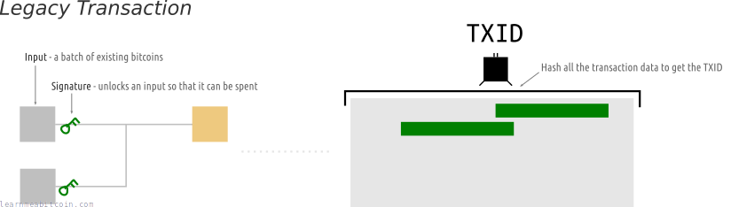](https://static.learnmeabitcoin.com/beginners/guide/segwit/txid.png)

### SegWit transaction

In a [segwit transaction](/docs/technical/transaction.md#example-segwit), however, all of the unlocking code (and signatures) are moved to the *end* of the transaction data instead.

The TXID is then created from all of the transaction data, **except for the unlocking code**:

[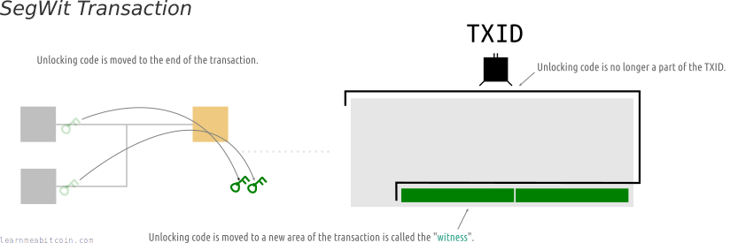](https://static.learnmeabitcoin.com/beginners/guide/segwit/txid-segwit.png)

As a result, the TXID in a **segwit transaction** is only influenced by the *effects* of the transaction (the movement of bitcoins), and not by the code required to *validate* the transaction (i.e. the signatures required for unlocking the bitcoins for spending).

[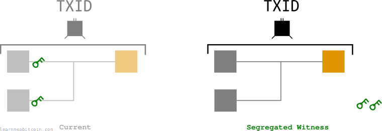](https://static.learnmeabitcoin.com/beginners/guide/segwit/txid-segwit-structure.png)

So in essence, you have separated the "validating" part (unlocking code) from the rest of the transaction.

If you were to refer to this validation code as *witness* data (as a cryptographer might), you could say that you have "*segregated* the *witness*". \*wink\*

## What are the benefits?

1. [Fixes transaction malleability](#fixes-transaction-malleability)
2. [Increased block capacity](#increased-block-capacity)

### 1. Fixes transaction malleability

In Bitcoin, **transaction malleability** refers to the fact that the **[TXID](/docs/technical/transaction/input/txid.md) of a transaction can be changed by altering the [signatures](/docs/technical/keys/signature.md)**:

[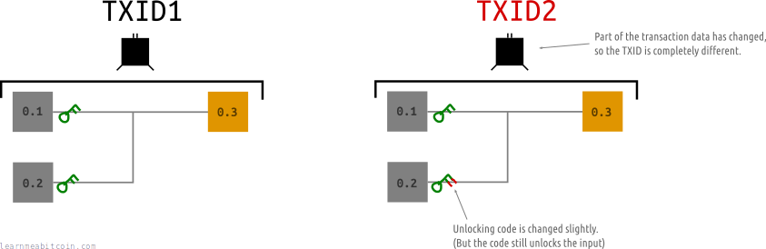](https://static.learnmeabitcoin.com/beginners/guide/segwit/transaction-malleability.png)

A signature can be altered by inverting the [s value](/docs/technical/keys/signature.md#legacy-step-6). The signature is still valid and the transaction has the same effect, but the TXID is different.

This means that when you send a legacy transaction into the network, any [node](/docs/beginners/guide/node.md) has the ability to change the TXID before passing it on:

[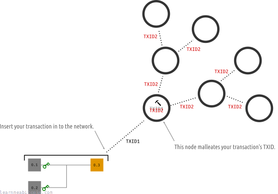](https://static.learnmeabitcoin.com/beginners/guide/segwit/transaction-malleability-network.png)

Eventually your transaction will make it into the blockchain under a different TXID than you expected, which would be somewhat annoying.

However, if the signatures are no longer part of the TXID, it's no longer possible for someone else to change the TXID of your transaction later on:

[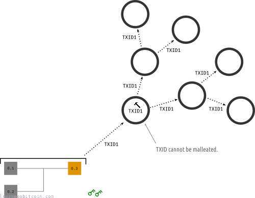](https://static.learnmeabitcoin.com/beginners/guide/segwit/transaction-malleability-network-segwit.png)

So in other words, SegWit makes TXIDs *reliable*.

### 2. Increased block capacity

Due to the fact that the unlocking code was moved to a *new* [witness field](/docs/technical/transaction/witness.md) in the transaction data, the way block sizes were calculated could also be changed.

Previously, transactions were measured in [bytes](/docs/technical/transaction/size.md#bytes), and the block size limit was 1,000,000 bytes (1 MB):

[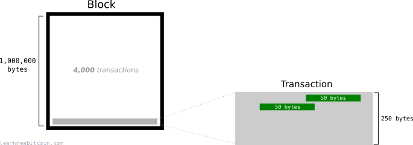](https://static.learnmeabitcoin.com/beginners/guide/segwit/block-size-bytes.png)

With SegWit, transactions are *no longer measured in bytes*. Instead, transactions and blocks were given a new metric called [weight](/docs/technical/transaction/size.md#weight):

[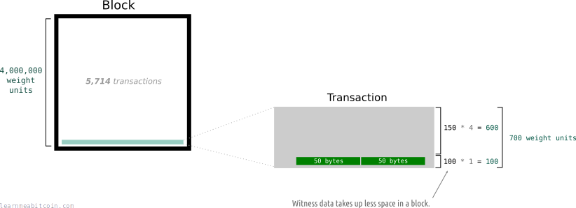](https://static.learnmeabitcoin.com/beginners/guide/segwit/block-size-weight.png)

* A block has a maximum size of `4,000,000` weight units.
  + A *normal* byte in a transaction is equal to `4` weight units.
  + A *witness* byte in a transaction is equal to `1` weight unit.

So basically, the block size limit is multiplied by 4 to give you the new *block weight limit*.

Each byte in a transaction is then also multiplied by 4 to give you a [transaction weight](/docs/technical/transaction/size.md#weight). However, you only multiply the bytes of witness data by 1, which basically gives you a 75% discount on how much space the "unlocking code" takes up in a block.

So you could say that unlocking data takes up a *quarter* of the space it used to, which means there's more space in the block overall for transaction data.

## Was SegWit a block size increase?

Yes, each block can now be greater than 1,000,000 bytes (1 MB) in size.

So whilst the block size limit was not increased by a specific number of *bytes*, the discounted weight for unlocking data means that blocks can exceed the previous 1 MB limit.

Just because the block size changed from 1,000,000 bytes to 4,000,000 weight units, it does not make SegWit an absolute block size increase to 4 MB.

This is because a typical block is not going to be filled exclusively with witness data (1 weight unit per byte). Instead, transactions contain a combination of normal data (4 weight units) and witness data (1 weight unit). So the "block size increase" varies depending on the composition of transactions in a block.

### How much of a block size increase was SegWit?

The SegWit upgrade increased the maximum size for *typical* blocks to around **1.8 MB**.

You see, a typical block of transactions consists of around **60% unlocking data**1. So if we calculate the *weight* of a 1 MB block consisting of "typical" transaction data, we get:

```
400,000 bytes * 4 = 1,600,000 weight units
600,000 bytes * 1 =   600,000 weight units

Total Weight      = 2,200,000 weight units
```

Now, if a block can now weigh a maximum of 4,000,000 weight units, we can work out how much of an increase this gives us:

```
4,000,000 / 2,200,000 = 1.81
```

So you could say this was effectively a block size limit increase to **1.8 MB**.

1. I got this 60% figure by running through [blk.dat](/docs/technical/block/blkdat.md) files and adding up the `scriptSig` data for all the transactions in a block, and comparing it to the total size of the block. I haven't done an exhaustive test, but 60% seems like a fair average. For example, here are the result for [blk00700.dat](blk00700_scriptsig.txt).

## Why were the changes implemented in this way?

Or, to put it another way…

If you want to fix transaction malleability and increase block capacity, surely there's a more *straightforward* way of doing it? Why do you need to restructure the transaction data, and create a new metric called "block weight"?

Good question. And you're right – these changes could have been made much more simply. For example, you could have just done this:

[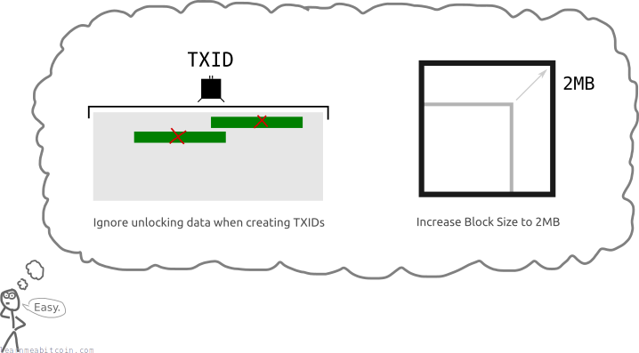](https://static.learnmeabitcoin.com/beginners/guide/segwit/easy-implementation.png)

However, if you did this, the transactions and blocks would become "invalid" under the current rules.

Basically, this means nodes on the network would reject these new transactions and blocks, because they do not comply with their rules on how transactions and blocks should "look".

[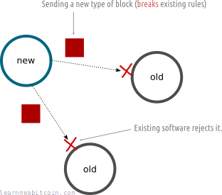](https://static.learnmeabitcoin.com/beginners/guide/segwit/hardfork-network.png)

For example, one of the rules was that each block must be 1 MB or less.

Therefore, if you wanted to make these changes, **you would need to get everyone on the network to upgrade their software** (and obviously agree to the changes).

Because if you didn't, you would end up with a network that builds two different blockchains – upgraded nodes building a blockchain using the new rules, and old nodes continuing to build a blockchain using the old rules.

[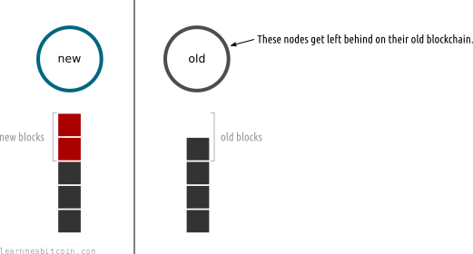](https://static.learnmeabitcoin.com/beginners/guide/segwit/hardfork-blockchain.png)

This is known as a [hard fork](/docs/technical/blockchain/hard-fork.md). It can work, but it's risky, and will cause problems for those who do not upgrade.

### How did SegWit avoid a hard fork?

Instead of SegWit being a hard fork, it was implemented as a [soft fork](/docs/technical/blockchain/soft-fork.md).

With the SegWit upgrade, **transactions and blocks *still follow* the current rules of the bitcoin network**, so all nodes still see SegWit blocks as valid. Therefore, "old" nodes will accept these "new" blocks and add them to their blockchains too.

[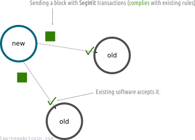](https://static.learnmeabitcoin.com/beginners/guide/segwit/softfork-network.png)

Therefore, old nodes still keep up with the new nodes, *even if they do not upgrade*.

[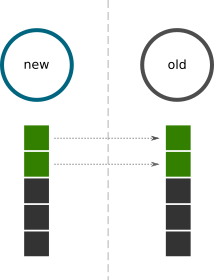](https://static.learnmeabitcoin.com/beginners/guide/segwit/softfork-blockchain.png)

Everyone stays in sync with a single version of the blockchain with a soft fork.

The downside for "old" nodes is that they cannot take advantage of the new features of SegWit until they upgrade. However, until then they can continue to make "old-style" transactions as normal and **keep up with the blockchain**.

So in summary, the SegWit upgrade may seem like a "hacky" way of fixing transaction malleability and increasing block capacity, but this approach avoids the problem of trying to get everyone to upgrade to the new software (or else get left behind).

## When was SegWit activated?

Segwit was activated on 24th August 2017, 01:57:37, at block height [481,824](/explorer/block/0000000000000000001c8018d9cb3b742ef25114f27563e3fc4a1902167f9893).

This was when nodes started enforcing the new consensus rules of the SegWit upgrade for all new blocks and transactions.

## How did SegWit come into effect?

The Segregated Witness upgrade came into effect when **95%** of miners signaled readiness for it.

Miners can signal their readiness by using a designated [version number](/docs/technical/block/version.md) in the blocks they mine.

[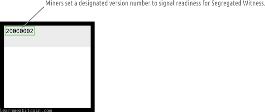](https://static.learnmeabitcoin.com/beginners/guide/segwit/signal-block-version.png)

The version field is part of the [block header](/docs/technical/block.md#header).

So when 95% of blocks had this version number, SegWit was scheduled for activation:

[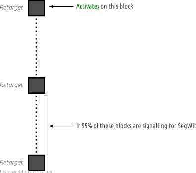](https://static.learnmeabitcoin.com/beginners/guide/segwit/signal-blockchain-activation.png)

The 95% threshold is calculated within a [target](/docs/technical/mining/target.md) readjustment period. If the 95% threshold is met, the soft fork is activated at the start of the *next* target adjustment period (which is 2016 blocks, or roughly 2 weeks).

### Was there a time limit on activation?

Yes, this was the activation window:

|  |  |
| --- | --- |
| Start Time: | 15th November 2016, 00:00 |
| **Timeout:** | 15th November 2017, 00:00 |

If not enough miners signaled their readiness for the Segregated Witness upgrade by midnight 15th November 2017, the proposal would have expired.

### Activation timeline

Here's a table showing the number of blocks signaling for SegWit across each target period leading up to the activation:

| Start Time | Target Period | Signaling Blocks | Percentage |
| --- | --- | --- | --- |
| 18 Nov 2016, 08:30:15 | [439,488](/explorer/439488#blockchain) to [441,503](/explorer/441503#blockchain) | 451/2016 | 22.37% |
| 02 Dec 2016, 02:46:26 | [441,504](/explorer/441504#blockchain) to [443,519](/explorer/443519#blockchain) | 487/2016 | 24.16% |
| 15 Dec 2016, 01:28:33 | [443,520](/explorer/443520#blockchain) to [445,535](/explorer/445535#blockchain) | 520/2016 | 25.79% |
| 28 Dec 2016, 17:40:55 | [445,536](/explorer/445536#blockchain) to [447,551](/explorer/447551#blockchain) | 521/2016 | 25.84% |
| 10 Jan 2017, 22:40:52 | [447,552](/explorer/447552#blockchain) to [449,567](/explorer/449567#blockchain) | 489/2016 | 24.26% |
| 22 Jan 2017, 22:52:52 | [449,568](/explorer/449568#blockchain) to [451,583](/explorer/451583#blockchain) | 468/2016 | 23.21% |
| 04 Feb 2017, 23:38:49 | [451,584](/explorer/451584#blockchain) to [453,599](/explorer/453599#blockchain) | 485/2016 | 24.06% |
| 18 Feb 2017, 09:38:26 | [453,600](/explorer/453600#blockchain) to [455,615](/explorer/455615#blockchain) | 537/2016 | 26.64% |
| 03 Mar 2017, 19:04:46 | [455,616](/explorer/455616#blockchain) to [457,631](/explorer/457631#blockchain) | 532/2016 | 26.39% |
| 17 Mar 2017, 08:36:15 | [457,632](/explorer/457632#blockchain) to [459,647](/explorer/459647#blockchain) | 582/2016 | 28.87% |
| 30 Mar 2017, 16:39:08 | [459,648](/explorer/459648#blockchain) to [461,663](/explorer/461663#blockchain) | 614/2016 | 30.46% |
| 13 Apr 2017, 02:59:50 | [461,664](/explorer/461664#blockchain) to [463,679](/explorer/463679#blockchain) | 671/2016 | 33.28% |
| 27 Apr 2017, 02:20:01 | [463,680](/explorer/463680#blockchain) to [465,695](/explorer/465695#blockchain) | 698/2016 | 34.62% |
| 10 May 2017, 03:40:48 | [465,696](/explorer/465696#blockchain) to [467,711](/explorer/467711#blockchain) | 663/2016 | 32.89% |
| 23 May 2017, 07:29:52 | [467,712](/explorer/467712#blockchain) to [469,727](/explorer/469727#blockchain) | 622/2016 | 30.85% |
| 04 Jun 2017, 14:35:07 | [469,728](/explorer/469728#blockchain) to [471,743](/explorer/471743#blockchain) | 642/2016 | 31.85% |
| 17 Jun 2017, 23:18:53 | [471,744](/explorer/471744#blockchain) to [473,759](/explorer/473759#blockchain) | 825/2016 | 40.92% |
| 02 Jul 2017, 00:47:17 | [473,760](/explorer/473760#blockchain) to [475,775](/explorer/475775#blockchain) | 917/2016 | 45.49% |
| 14 Jul 2017, 08:45:42 | [475,776](/explorer/475776#blockchain) to [477,791](/explorer/477791#blockchain) | 1440/2016 | 71.43% |
| 27 Jul 2017, 11:03:54 | [477,792](/explorer/477792#blockchain) to [479,807](/explorer/479807#blockchain) | 2016/2016 | 100.00% |

As you can see, the 95% threshold for miners signaling readiness for SegWit was exceeded during the target adjustment period between blocks [477,792](/explorer/block/00000000000000000016ba7786309176445b838b36a16bd1ef3c3e3020473206) and [479,807](/explorer/block/00000000000000000053e2d10bd703ad5b7787614965711d6170b69b133aa366).

Consequently, the SegWit upgrade was activated 2,016 blocks (roughly 2 weeks) later at block [481,824](/explorer/block/0000000000000000001c8018d9cb3b742ef25114f27563e3fc4a1902167f9893):

| Start Time | Target Period | Note |
| --- | --- | --- |
| 09 Aug 2017, 12:36:50 | [479,808](/explorer/479808#blockchain) to [481,823](/explorer/481823#blockchain) | SegWit Locked In |
| 24 Aug 2017, 01:57:37 | [481,824](/explorer/481824#blockchain) onwards | SegWit Activated |

* The target period from 439,488 to 441,503 was the first signaling period after the start of the activation window.
* 100% of the blocks between 477,792 and 479,807 signaled for the SegWit upgrade. You can see the blocks and their signals here: <segwit-signals-version-bits.txt> (the second bit from the right signaled for SegWit).
* There is a gap of one target period where the soft fork is "locked in" before the soft fork is activated.

### Why were *miners* given the decision on activation?

Because if you want a soft fork to be successful, you want a majority of miners [mining](/docs/beginners/guide/mining.md) the "new" type of blocks on to the blockchain.

This is so the blockchain with "new" blocks on it will outpace any blockchain being built with "old" blocks (from any non-upgraded miners who could still be mining).

As a result, the "new" blockchain will be built faster than any blockchain being built with "old" blocks, so all nodes will naturally adopt the same [longest chain](/docs/technical/blockchain/longest-chain.md):

[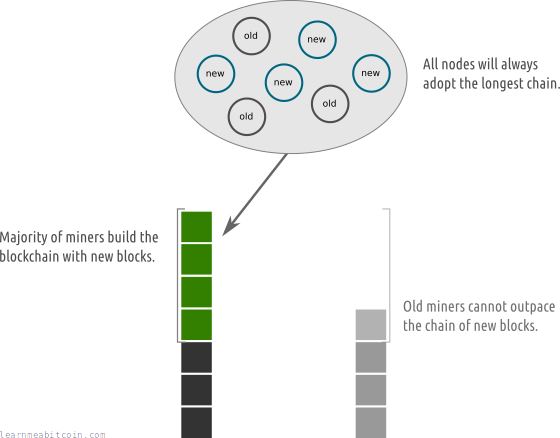](https://static.learnmeabitcoin.com/beginners/guide/segwit/miners-softfork.png)

Having a majority of mining power keeps everyone on the network on the same chain.

So having a strong majority of miners on board allows for a smooth upgrade, as it ensures that the whole network will converge on one single blockchain.

It's not necessarily that miners are the most knowledgeable group for deciding upon the merits of a soft fork upgrade; it's more that they're *needed* to ensure a smooth upgrade for the entire network.

## What happens if I don't run the SegWit upgrade?

If you're running an old node (e.g. [Bitcoin Core v0.13.0](https://github.com/bitcoin/bitcoin/blob/master/doc/release-notes/release-notes-0.13.0.md) or below), any SegWit nodes that you are connected to will strip out all of the [witness data](/docs/technical/transaction/witness.md) from transactions before sending them to you.

[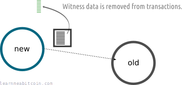](https://static.learnmeabitcoin.com/beginners/guide/segwit/old-node-witness-data.png)

What this means is:

* You will still receive the same transactions as everyone else.
* If you receive a SegWit transaction, you will see the *movement* of bitcoins, but you will not see any of the *unlocking code* data.

So basically, your node will get a "lightweight" version of SegWit transactions.

## How do I upgrade?

That's the spirit.

* **Bitcoin Core** – Just make sure you're using version [0.13.1](https://github.com/bitcoin/bitcoin/blob/master/doc/release-notes/release-notes-0.13.1.md) or greater.
* **Other Wallets** – Almost all modern [wallets](/docs/beginners/wallets.md) these days support SegWit transactions.

SegWit has been around for so long now that it's unlikely that you'll run into any software that does not support it (unless it's obviously old).

## Resources

* [BIP 141 (Consensus Layer)](https://github.com/bitcoin/bips/blob/master/bip-0141.mediawiki)
* [BIP 144 (Peer Services)](https://github.com/bitcoin/bips/blob/master/bip-0144.mediawiki)
* [Bitcoin.org – Segregated Witness Benefits](https://bitcoincore.org/en/2016/01/26/segwit-benefits/)

### Thanks

* [Pieter Wuille](https://github.com/sipa) – for explaining [SegWit transaction data structure](https://bitcoin.stackexchange.com/questions/49097/what-does-a-segregated-witness-transaction-look-like) (amongst other things).
* [Gregory Maxwell](https://github.com/gmaxwell) and [Luke-jr](https://github.com/luke-jr) – for explaining [block weight](https://www.reddit.com/r/Bitcoin/comments/5e7a8n/what_will_be_the_block_size_limit_if_segwit/).

### Further reading

* [Segregated Witness Explained](https://www.youtube.com/watch?v=DzBAG2Jp4bg) – A good video explanation of SegWit, with helpful visualizations of the change in transaction data structure.