A bitcoin transaction is just a **bunch of data**.

It contains information about the **amount** being sent, the account it is being sent **from**, and the account it is being sent **to**.

This is just information, so it can be easily represented in a single line of data:

[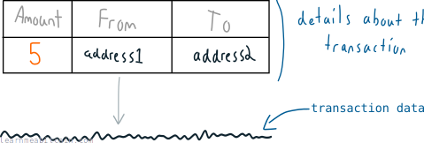](https://static.learnmeabitcoin.com/beginners/guide/transactions/01-transaction-table-data.png)

And when you "make a transaction", you just send this *transaction data* into the [bitcoin network](/beginners/guide/network/).

[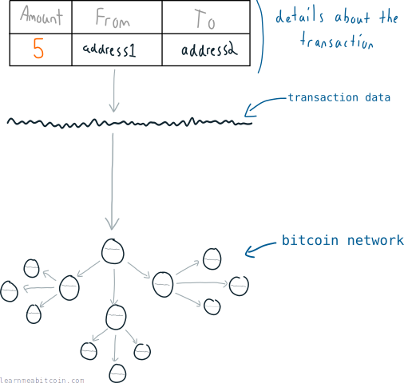](https://static.learnmeabitcoin.com/beginners/guide/transactions/01-transaction-table-data-network.png)

Eventually, one of the [nodes](/beginners/guide/node/) on the network will [mine](/beginners/guide/mining/) your transaction into a [block](/beginners/guide/blocks/), and this block (with your transaction in it) will be added to the permanent file of transactions (called the [blockchain](/beginners/guide/blockchain/)).

And that's all a bitcoin transaction is – a simple line of data that gets sent into the bitcoin network so that it can get mined on to the blockchain.

## How does a bitcoin transaction work?

A bitcoin [address](/technical/keys/address/) is like an *account number* that holds bitcoins.

However, when you make a transaction, it's not like taking an exact amount of coins out of a pot and moving them into another.

[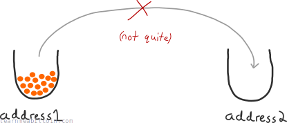](https://static.learnmeabitcoin.com/beginners/guide/transactions/02-pot.png)

Instead, an address keeps track of *each individual payment* it has received:

[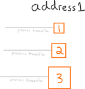](https://static.learnmeabitcoin.com/beginners/guide/transactions/02-address1.png)

So when you want to send bitcoins to someone else, you grab *whole amounts* that you have already received, and use them to send a *new amount* to a new address:

[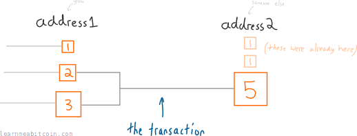](https://static.learnmeabitcoin.com/beginners/guide/transactions/02-address1-address2.png)

And when that someone else wants to send bitcoins to another person, they will use up whole amounts they have received in the same way:

[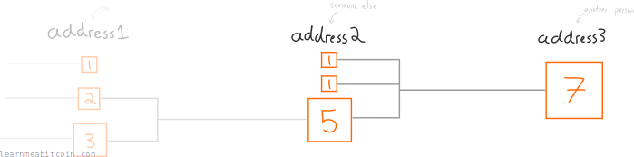](https://static.learnmeabitcoin.com/beginners/guide/transactions/02-address1-address2-address3.png)

So in effect you receive bitcoins in *batches*, and you use those batches to create new batches to send to other people.

That's how transactions work.

### What if the batches add up to more than the amount I want to send?

Good question Sir/Madam.

In this instance (which it often is), you just add another *output* to the transaction and send the difference back to yourself:

[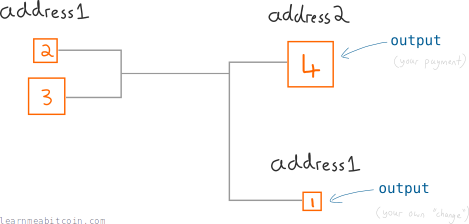](https://static.learnmeabitcoin.com/beginners/guide/transactions/02-address1-address2-change.png)

This may seem awkward at first, I know, but it's a precise way of doing it from a programming perspective.

### Summary

1. Your [wallet](/beginners/wallets/) gives you a bitcoin address. Bitcoins arrive at this address in batches, called *outputs*.
2. A bitcoin transaction is the process of using these outputs (as inputs) to create new outputs that belong to someone else's address.
3. All of this can be represented by a single line of data.

[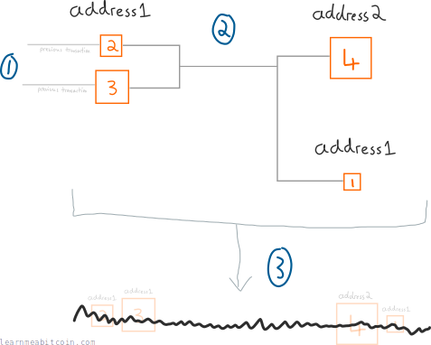](https://static.learnmeabitcoin.com/beginners/guide/transactions/02-address1-address2-change-data.png)

For more details on how this system of outputs works, check out [outputs](/beginners/guide/outputs/).

## What prevents other people from spending my bitcoins?

Or in other words…

**Question:** "If making a transaction is simply a case of feeding a line of data into the bitcoin network, why can't someone construct a transaction that includes *my address* and use it to send bitcoins to *their address*?"

**Answer:** Because each transaction output has a *lock* on it:

[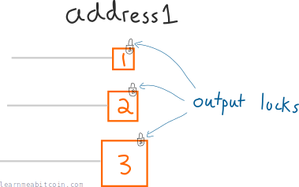](https://static.learnmeabitcoin.com/beginners/guide/transactions/03-output-locks.png)

And if you create a transaction *without* unlocking these outputs, nodes on the bitcoin network will reject the transaction:

[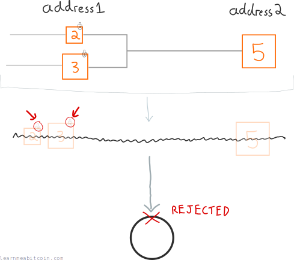](https://static.learnmeabitcoin.com/beginners/guide/transactions/03-output-locks-rejected.png)

But fortunately for you, each address comes with a unique [private key](/technical/keys/private-key/):

So if you want to send bitcoins in a transaction, you use this private key to create a one-time signature that can *unlock* the outputs located at your address.

[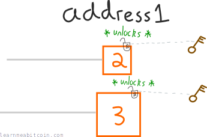](https://static.learnmeabitcoin.com/beginners/guide/transactions/03-address-key-unlock.png)

After unlocking all of the outputs you want to use, the transaction will be accepted by nodes and propagated across the Bitcoin network.

[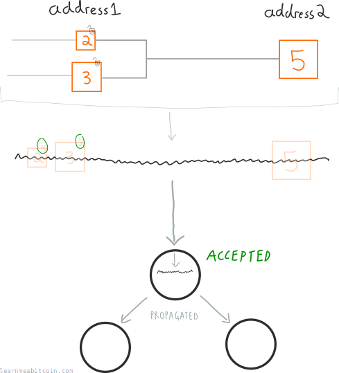](https://static.learnmeabitcoin.com/beginners/guide/transactions/03-output-locks-accepted.png)

And that's how bitcoin transactions work.