Bitcoin is an **electronic payment system** that allows anyone to create an account and send any amount of money to anyone in the world.

You might want to read that again.

It was created as an alternative to the current financial system. In the current system we have a small number of large banks that control who can create an account and what transactions you can make. This centralizes the control of money, and we have no other option but to trust these banks to act fairly and responsibly.

> Banks must be trusted to hold our money and transfer it electronically, but they lend it out in waves of credit bubbles with barely a fraction in reserve.

Satoshi Nakamoto, 
[satoshi.nakamotoinstitute.org](https://satoshi.nakamotoinstitute.org/posts/p2pfoundation/1/)

Bitcoin was developed in response to the [2007-2008 financial crisis](https://en.wikipedia.org/wiki/2007%E2%80%932008_financial_crisis) caused by the centralization of the current system. It was designed anonymously by Satoshi Nakamoto, and was [released in January 2009](https://www.metzdowd.com/pipermail/cryptography/2009-January/014994.html) as a payment system that runs *without* a central point of control.

It's also [open-source software](https://github.com/bitcoin/bitcoin/), which means that anyone can run the program and interact with the system.

The following is a simple explanation of how it works.

## What is Bitcoin?

Bitcoin is just a **computer program**. You can [download](https://bitcoin.org/en/download) it and run it on your computer.

When you run the program for the first time, it will connect to other computers running the same program, and they will *start sharing a file* with you. This file is called the [**blockchain**](/docs/technical/blockchain.md), which is a big list of [*transactions*](/docs/technical/transaction.md).

[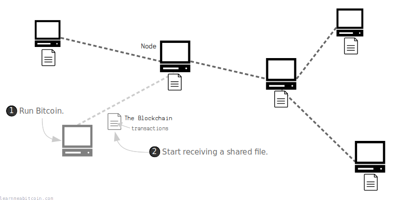](/docs/beginners/how-does-bitcoin-work/1_2_network.png.md)

When a new transaction enters the network, it gets *relayed* from computer to computer until everyone has a copy of the transaction. At roughly 10 minute intervals, a random computer ([node](/docs/technical/networking/node.md)) on the network will add the latest transactions they have received on to the blockchain, and share the updates with everyone else.

[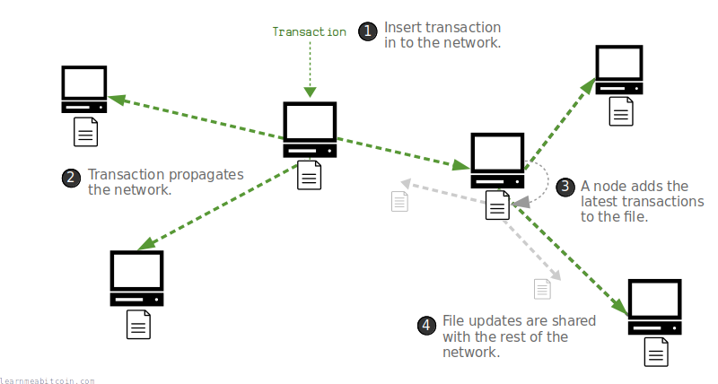](/docs/beginners/how-does-bitcoin-work/1_3_network_transactions.png.md)

As a result, the Bitcoin program creates a large **[network](/docs/technical/networking.md) of computers** that communicate with each other to **share a file and update it with new transactions**.

## What problem does Bitcoin solve?

Bitcoin solves the problem of being able to have a **payment system that operates without a central point of control**.

Before Bitcoin, it was possible to relay transactions across a network of computers. However, the problem is that **you can insert conflicting transactions into a network of computers**. For example, you could create two separate transactions that spend the *same* digital coin, and send both of these transactions into the network at the same time.

This is called a "**double-spend**":

[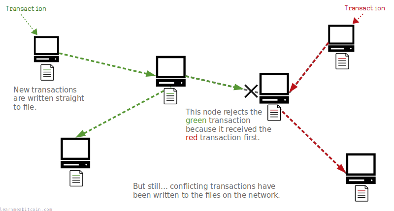](/docs/beginners/how-does-bitcoin-work/2_1_why_double_spend.png.md)

Some computers will receive the green transaction first, and some computers will receive the red transaction first.

Now if you're creating an electronic payment system without a central authority, you have the problem of figuring out which of these transactions came "first", and this is a difficult thing to determine when you have a network of computers acting independently.

So who's to *decide* which transaction came "first" and should be the only one written to the file?

Bitcoin solves this problem by forcing nodes to keep all the transactions they receive *in [memory](/docs/technical/mining/memory-pool.md)* before writing them to a file. Then, at 10-minute intervals, a *random node* on the network will add the transactions from their memory on to the file.

[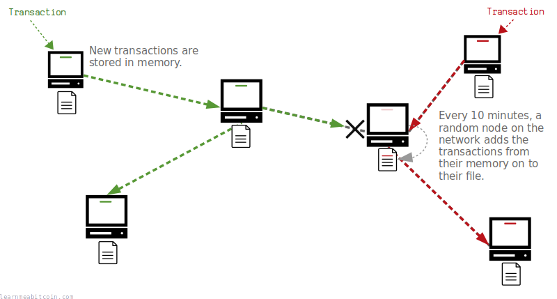](/docs/beginners/how-does-bitcoin-work/2_2_why_mining.png.md)

This updated file is then shared with the rest of the network. Nodes will accept the transactions in the updated file as the "correct" ones, and remove any conflicting transactions from their memory.

As a result, no double-spend transactions will ever be written to the file, and all nodes regularly update to the same version of the shared file.

[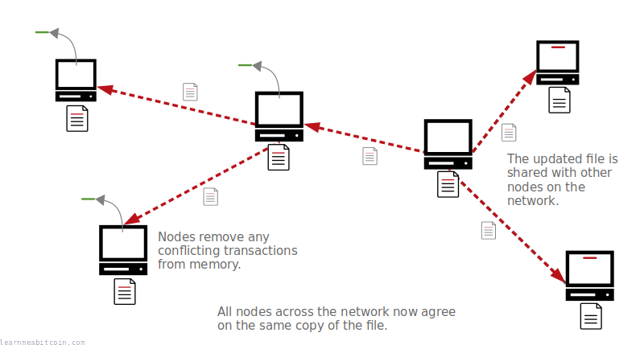](/docs/beginners/how-does-bitcoin-work/2_3_why_solved.png.md)

This process of adding transactions on to the file is called [**mining**](/docs/technical/mining.md), and it's a network-wide *competition* that cannot be controlled by a single node on the network.

## How does mining work?

Mining is the process of adding new blocks of transactions on to the blockchain.

To start with, each node stores the latest [transactions](/docs/technical/transaction.md) they have received in their [**memory pool**](/docs/technical/mining/memory-pool.md), which is just temporary memory on their computer.

Any node can then try and *mine* the transactions from their memory pool on to the shared file (the [**blockchain**](/docs/technical/blockchain.md)).

To do this, a node will gather the transactions from its memory pool into a container called a [**block**](/docs/technical/block.md), and then use *processing power* to try and add this block of transactions onto the blockchain.

[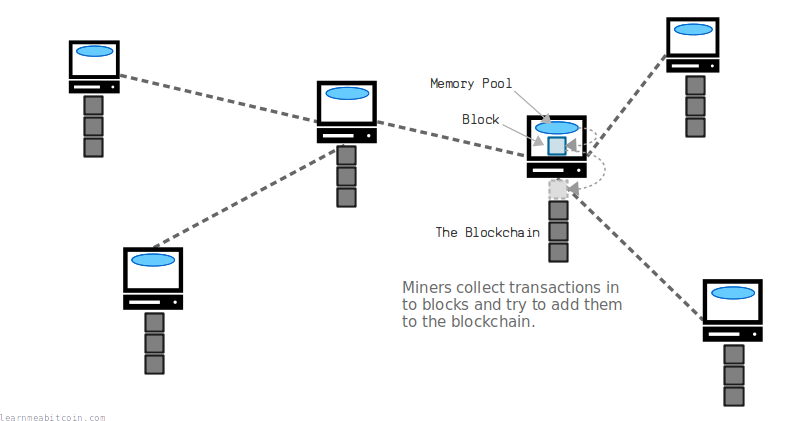](/docs/beginners/how-does-bitcoin-work/3_1_mining.png.md)

So where does this processing power come in? Well, to add this block to the blockchain, you must feed your block of transactions in to something called a [**hash function**](/docs/technical/cryptography/hash-function.md). A hash function is basically a mini computer program that will take in any amount of data, scramble it, and spit out a completely unique (and unpredictable) number.

[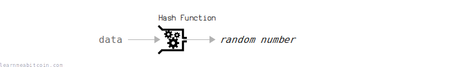](/docs/beginners/how-does-bitcoin-work/3_2_hash_function.png.md)

For your block to be successfully added on to the blockchain, this number (or [**block hash**](/docs/technical/block/hash.md)) must be **equal to or below** the [**target**](/docs/technical/mining/target.md), which is a threshold that everyone on the network agrees upon.

[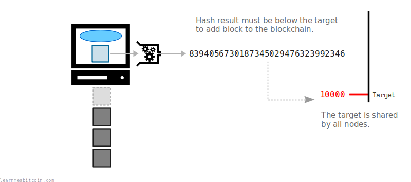](/docs/beginners/how-does-bitcoin-work/3_3_mining_block_hash.png.md)

If your resulting **block hash** is *not* below the target, you can make a small adjustment to the data inside the block and put it through the hash function again. This will produce a *completely different* number that will hopefully be below the target. If not, you adjust the block and try again.

[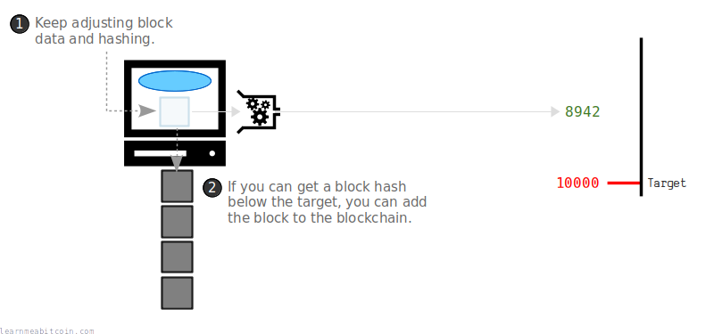](/docs/beginners/how-does-bitcoin-work/3_4_mining_nonce.png.md)

Eventually one of the nodes (or miners) on the network will find a block hash below the target, and this block of transactions will be added on to the blockchain.

Then the mining process starts over again to add the next block on to the chain.

So in summary, the process of mining uses processing power to perform hash calculations as fast as you can to try and be the first computer on the network to get a block hash below the target. If you're successful, you can add your block of transactions onto the blockchain and share it with the rest of the network.

The use of the hash function in conjunction with a target value creates a network-wide competition that anyone can compete in. It also means that no single computer on the network has complete control over adding transactions on to the blockchain, which creates a file sharing network with no central point of control.

**Although it's still possible for anyone to try and mine blocks, it is no longer competitive to do so on a home computer.** Miners now use specialized hardware designed to perform hash calculations as fast (and as efficiently) as possible, which means that mining is now mostly performed by those with access to specialized hardware and cheap electricity.

### Where do bitcoins come from?

As an incentive to use processing power to try and add new blocks of transactions on to the blockchain, each new block makes a fixed amount of bitcoins available that did not previously exist. Therefore, if you are able to successfully mine a block, you are able to "send" yourself these new bitcoins as a reward for your effort.

[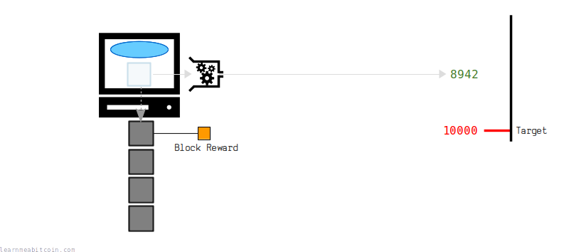](/docs/beginners/how-does-bitcoin-work/3_5_mining_block_reward.png.md)

This batch of new bitcoins is called the **[block reward](/docs/technical/mining/block-reward.md)**, and is the reason why the process is called "mining".

## Why is the file called the "blockchain"?

Transactions are not added to the file individually – they are collected together and added in blocks. Each of these new blocks *builds on top of* an existing one, and so the file is made up of a *chain* of **blocks**; hence, [**blockchain**](/docs/technical/blockchain.md).

[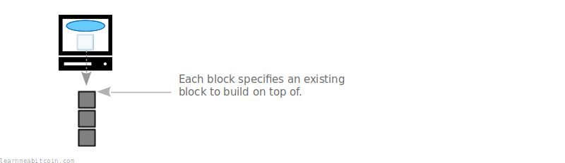](/docs/beginners/how-does-bitcoin-work/4_1_blockchain.png.md)

Furthermore, every node on the network **will always adopt the [longest chain](/docs/technical/blockchain/longest-chain.md) of blocks they receive** as the "official" version of the blockchain.

This means that miners will always try to build on top of the "tip" of the longest known chain of blocks, as any transactions that are not part of the longest chain will be invalid.

[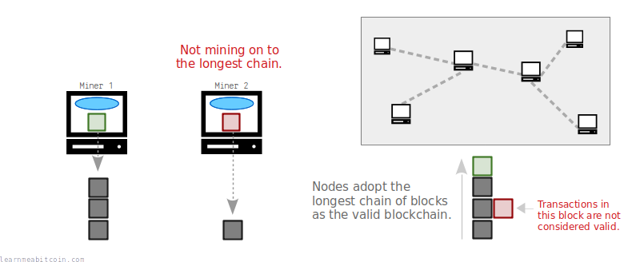](/docs/beginners/how-does-bitcoin-work/4_2_blockchain_longest.png.md)

Therefore, if someone wanted to rewrite the history of transactions, they would need to rebuild a longer chain of blocks to create a new longest chain for other nodes to adopt. However, to achieve this, a single miner would need to have more computer processing power than the rest of the network combined.

[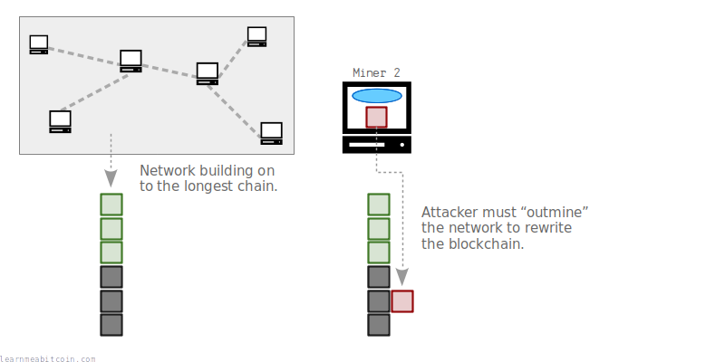](/docs/beginners/how-does-bitcoin-work/4_3_blockchain_hashpower.png.md)

As a result, the combined effort of the network makes it difficult for any individual to "outrun" the network and rewrite the blockchain.

In other words, the entire history of transactions (and your money) is protected by the combined energy of mining.

## How do transactions work?

You can think of the blockchain as being a storage facility for *safe deposit boxes*, which we call [**outputs**](/docs/technical/transaction/output.md). These outputs are just containers that hold various amounts of bitcoin.

[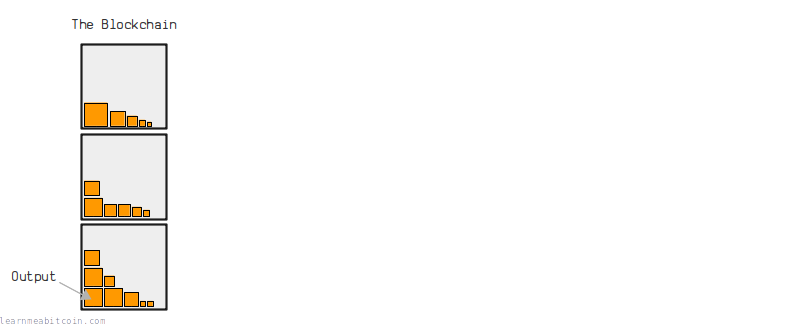](/docs/beginners/how-does-bitcoin-work/5_1_outputs.png.md)

When you make a bitcoin [**transaction**](/docs/technical/transaction.md), you select some outputs and *unlock* them, then create new outputs and put new [locks](/docs/technical/transaction/output/scriptpubkey.md) on them.

[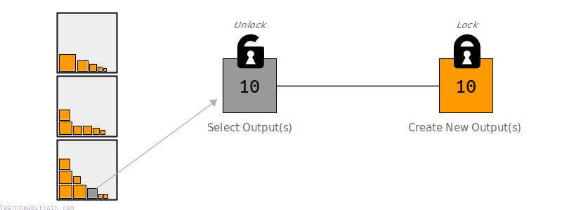](/docs/beginners/how-does-bitcoin-work/5_2_transaction.png.md)

So when you "send" someone bitcoins, you are actually placing an amount of bitcoins into a new safe deposit box, and putting a lock on it that only the person you are "sending" the bitcoins to can unlock.

For example, if I wanted to send you some bitcoins, I would select some outputs from the blockchain that I can unlock, and create a new output from them that only *you* can unlock. Furthermore, if I didn't want to send you all of the bitcoins that I had unlocked, I would create an extra output as my "change" and lock it to myself.

[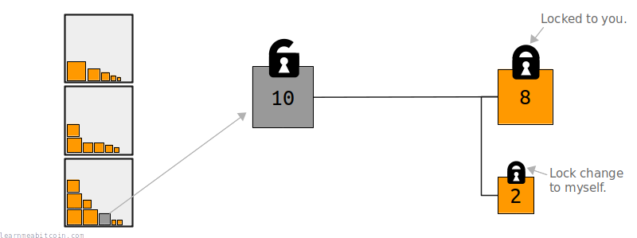](/docs/beginners/how-does-bitcoin-work/5_3_transaction_change.png.md)

Moving forward, if you want to send your bitcoins to someone else, you would repeat the process of selecting existing outputs (that you can unlock) and creating new outputs from them. As a result, bitcoin transactions form a graph-like structure, where the movement of bitcoins is connected by a series of transactions.

[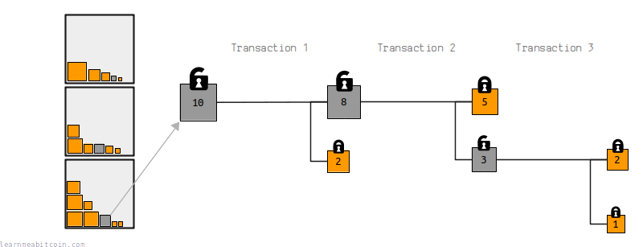](/docs/beginners/how-does-bitcoin-work/5_4_transaction_graph.png.md)

Lastly, when a transaction gets mined on to the blockchain, the outputs that were used up (spent) in the transaction cannot be used in another transaction, and the newly created outputs will be available to be spent in a future transaction.

[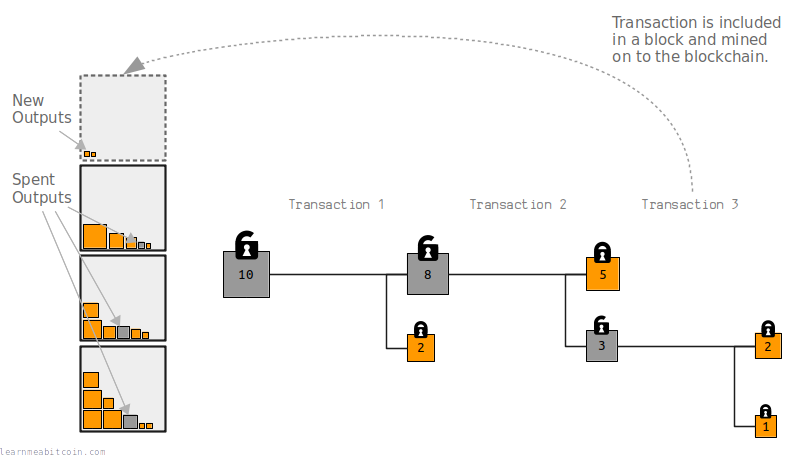](/docs/beginners/how-does-bitcoin-work/5_5_transaction_blockchain_outputs.png.md)

## How do you own bitcoins?

To be able to "receive" bitcoins, you need to have your own set of [keys](/docs/technical/keys.md).

This set of keys is like your *account number* and *password*, except in Bitcoin they're called your [public key](/docs/technical/keys/public-key.md) and your [private key](/docs/technical/keys/private-key.md).

For example, if I wanted to send you some bitcoins, you would first need to give me your public key. When I create my transaction, I would place your public key *inside* the lock on the output (the safe deposit box). And when you want to send these bitcoins on to someone else, you would use your private key to unlock this output.

[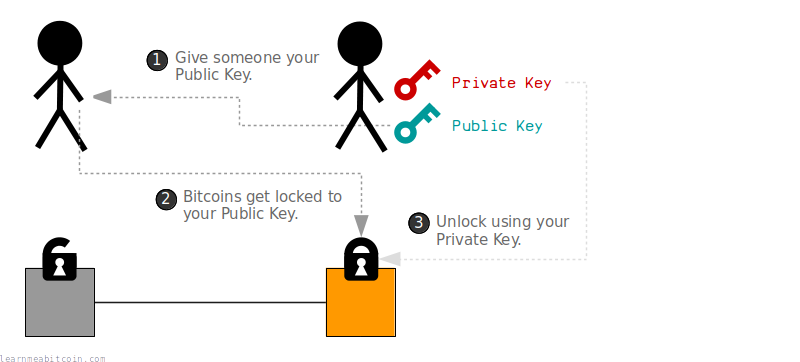](/docs/beginners/how-does-bitcoin-work/6_1_keys.png.md)

So where can you get a public key and private key? Well, with the help of [cryptography](/docs/technical/cryptography.md) you can actually **generate them yourself**.

In short, your private key is just a large *random number*, and your public key is a number *calculated from* this private key. But the clever part is; you can give your public key to someone else, but they cannot work backwards from it to work out the private key.

[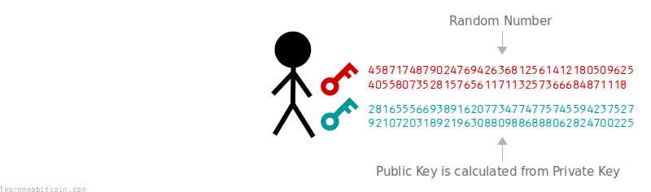](/docs/beginners/how-does-bitcoin-work/6_2_keys_generate.png.md)

Now, when you want to unlock bitcoins that are assigned to your public key, you use your private key to create what's called a [digital signature](/docs/technical/keys/signature.md). This signature proves that you are the owner of the public key (and therefore can unlock the bitcoins), *without having to reveal your private key*. This signature is also only valid for the transaction it was created for, so it cannot be used to unlock other bitcoins locked to the same public key.

[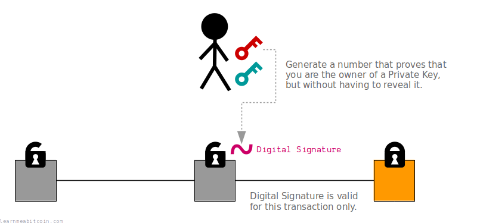](/docs/beginners/how-does-bitcoin-work/6_3_keys_digital_signature.png.md)

This system is known as [Public Key Cryptography](/docs/technical/cryptography.md#public-key-cryptography), and has been available since 1978 (see [RSA](https://en.wikipedia.org/wiki/RSA_(cryptosystem))). Bitcoin makes use of this system to allow anyone to create keys for sending and receiving bitcoins securely, without the need of a central authority to issue accounts and passwords.

In Bitcoin we convert the public key to a more user-friendly [address](/docs/technical/keys/address.md), which is what you'll typically use when sending and receiving payments.

## Summary

[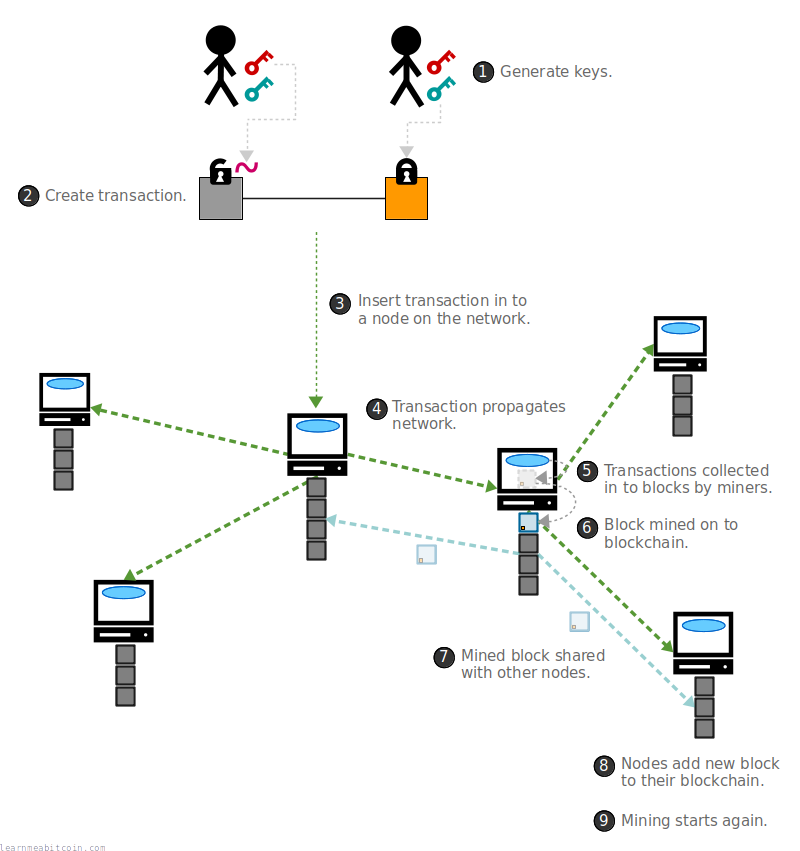](/docs/beginners/how-does-bitcoin-work/7_1_bitcoin_system.png.md)

To use Bitcoin, you generate your own [private key](/docs/technical/keys/private-key.md) and [public key](/docs/technical/keys/public-key.md). Your private key is a very large random number, and your public key is calculated from it. These keys can be easily generated on your computer, or even on something as simple as a calculator. Most people, however, use a [bitcoin wallet](/docs/beginners/wallets.md) to help generate and manage their keys.

To receive bitcoins, you give the person sending them to you your public key. This person then creates a [transaction](/docs/technical/transaction.md) where they unlock bitcoins that they own, and create a new "safe deposit box" of bitcoins and put your public key inside the lock.

This transaction is then sent to a [node](/docs/technical/networking/node.md), where it's relayed from computer to computer until every node on the [network](/docs/technical/networking.md) has a copy of the transaction. From here, each node has the opportunity to try and *mine* the latest transactions they have received on to the [blockchain](/docs/technical/blockchain.md).

The process of [mining](/docs/technical/mining.md) involves a node collecting transactions from its [memory pool](/docs/technical/mining/memory-pool.md) into a [block](/docs/technical/block.md), and repeatedly [hashing](/docs/technical/cryptography/hash-function.md) the block (with a minor adjustment each time) to try and get a [block hash](/docs/technical/block/hash.md) below the current [target](/docs/technical/mining/target.md) value.

The first miner to find a block hash below the target will add the block to their [blockchain](/docs/technical/blockchain.md), and broadcast this block to the other nodes on the network. Each node will then verify and add this block to their blockchain (removing any conflicting transactions from their memory pool in the process), and restart the mining process to try and build on top of this new block in the chain.

Lastly, the miner who mined this block will have placed their own [special transaction](/docs/technical/mining/coinbase-transaction.md) inside the block, which allows them to collect a set amount of bitcoins that did not already exist. This [block reward](/docs/technical/mining/block-reward.md) acts as an incentive for nodes to continue to build the blockchain, whilst simultaneously distributing new coins across the bitcoin network.

## Conclusion

Bitcoin is a computer program that shares a secure file with other computers around the world. This secure file is made up of transactions, and these transactions use cryptography to allow people to send and receive digital safe deposit boxes.

As a result, this creates an electronic payment system that can be used by anyone, and operates without a central point of control.

The Bitcoin network has been running uninterrupted since its release in January 2009. In 2023, the Bitcoin network processed over **153 million transactions**, moving a total of **$12,820,677,140,286** (12.82 trillion)[1](#fn1).

The Bitcoin program itself is also under active development, with over **600** individuals contributing to the code since its release[2](#fn2). This is due to the fact that the software is "open source", which means that anyone can view the code and contribute to improving it.

* [bitcoin.pdf](/bitcoin.pdf) – Whitepaper
* [github.com/bitcoin/bitcoin/](https://github.com/bitcoin/bitcoin/) – Source code