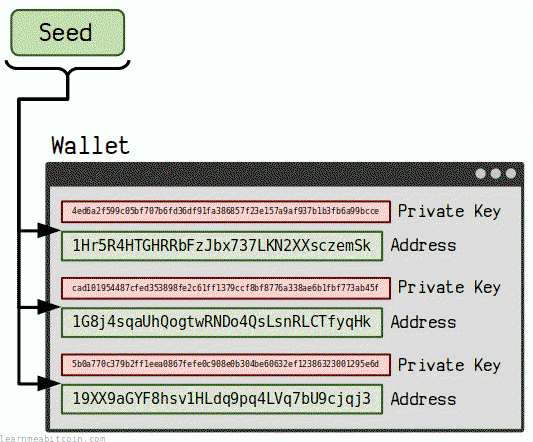

你已经[购买了一些比特币](/docs/beginners/exchanges.md)，拥有的一定数量可能开始让你感到有些焦虑。

你能做些什么来保护它们呢？

以下是你可以采取的、用于**保障比特币安全**的最*简单*且最*有效*的步骤。

## 1. 硬件钱包

[](https://static.learnmeabitcoin.com/diagrams/png/beginners-wallets-hardware-wallet.png)

首先也是最重要的一步，保护比特币的最大举措是获取一个*硬件钱包*。

以下是我的首推品牌：

钱包 | 级别 | 发布年份
--- | --- | ---
[Trezor](https://trezor.io/) | 初学者 | 2014
[Coldcard](https://coldcard.com/) | 高级 | 2018

硬件钱包是一个在你想发送和接收比特币时连接到计算机的小设备。然而，**所有的[私钥](/docs/technical/keys/private-key.md)都存储在设备内部，永远不会暴露给互联网**。

因此，你将私钥与互联网*断开*连接，从而保护你的比特币免受数字攻击。因此，别人窃取你比特币的唯一方法就是获取你设备（或种子）的物理访问权限。

[软件钱包](/docs/beginners/wallets.md#type-software-wallet)对于日常使用很方便，但如果你在日常使用的计算机上使用软件钱包，你就会让比特币容易受到恶意软件和病毒的攻击。虽然这并不保证你的软件钱包里的比特币一定会被盗，但*存在这种可能*就已经足够让你强烈考虑投资一个硬件钱包来存储比特币了。

所以，如果你对持有的比特币数量感到焦虑，硬件钱包就是解决方案。

即使有人偷走了你的硬件钱包，提取私钥也需要一些时间和精力，这为你将硬币转移到其他钱包提供了一个机会窗口。

## 2. 密码短语 (Passphrase)

[](/docs/beginners/security/passphrase.gif.md)


使用密码短语允许你从初始种子创建一个完全不同的钱包。

结合使用密码短语与你的[种子](/docs/technical/keys/hd-wallets/mnemonic-seed.md)是为比特币添加**额外安全层**的一种简单而有效的方法。

如果你使用密码短语，别人窃取你比特币的唯一方法就是同时获取你的种子*和*密码短语。因此，如果有人偶然发现了你的种子，除非他们也能找到你的密码短语，否则他们将无法恢复你的私钥。

换句话说，密码短语为你的比特币大门添加了额外的锁。

自然，这也意味着除了备份种子之外，你还需要**备份你的密码短语**，但通过将它们*分开*存储，会让窃贼极难获取你的比特币。

使用密码短语不是必须的，但它是一个简单且有效的安全升级。

 Mnemonic Seed

Generate Random
Reset

Size

128 Bit (12 words) (standard)
160 Bit (15 words) 
192 Bit (18 words) 
224 Bit (21 words) 
256 Bit (24 words) (standard)


Entropy

0

0

0

0

0

0

0

0

0

0

0

0

0

0

0

0

0

0

0

0

0

0

0

0

0

0

0

0

0

0

0

0

0

0

0

0

0

0

0

0

0

0

0

0

0

0

0

0

0

0

0

0

0

0

0

0

0

0

0

0

0

0

0

0

0

0

0

0

0

0

0

0

0

0

0

0

0

0

0

0

0

0

0

0

0

0

0

0

0

0

0

0

0

0

0

0

0

0

0

0

0

0

0

0

0

0

0

0

0

0

0

0

0

0

0

0

0

0

0

0

0

0

0

0

0

0

0

0

`128 bits`


Checksum

0

0

0

0
`4 bits`


Words
 

Mnemonic Sentence

`0 words`

Passphrase (optional)

`extra word`

Seed

PBKDF2

`0 bytes`


**绝不要使用网站生成的种子，也不要在网站上输入你的种子。** 网站很容易保存种子并用它来窃取你所有的比特币。

0 secs

**你的密码短语与你的种子同样重要。** 如果你丢失了密码短语，你将失去访问比特币的能力。因此，像保管种子一样安全地保管你的密码短语。

* **你的密码短语应该和优质密码一样安全。** 如果有人拿到了你的种子，他们可能会尝试暴力破解密码短语来窃取你的比特币。你的密码短语越安全，攻击者破解它的难度就越大。
* **一种流行的设置是在不使用密码短语的情况下，在同一个钱包中保留少量的比特币。** 这样做的好处是允许你检测种子是否已被泄露（以便在你的密码短语被破解之前将硬币转移到其他钱包），并且在遭受物理攻击时，它也可以用作胁迫钱包。
* **如果你的密码短语容易记住，那会有所帮助。** 记住它可以提供额外的备份形式，并能更轻松地访问你的硬件钱包。然而，拥有一个*安全*的密码短语比拥有一个好记的密码短语更重要。

## 3. 种子存储

考虑将你的种子存储在某些*坚固*的介质上是一个好主意。

[设置钱包](/docs/beginners/wallets.md#setup)的第一步是将你的种子写在纸上。这是一个好建议，因为这意味着你只会拥有一份种子的*物理*副本，从而远离互联网以及可能来自互联网的所有攻击。

然而，如果你的房子着火了，纸张就起不到作用了。

因此，投资一种更坚坚固的种子存储方法是值得的，以防你的锅炉爆炸，或者你买的便宜电器决定将你的家变成一片火海。

*不锈钢*（高抗拉强度和高熔点）是坚固种子存储的首选材料，市场上有一些现成的[金属种子存储选择](https://jlopp.github.io/metal-bitcoin-storage-reviews/)。

或者，你也可以自己将种子单词冲压到坚固的钢板上。

无论哪种方式，将你的种子从纸张转换为不锈钢都能让你高枕无忧，并在现实世界发生意外灾难时提供良好的备份。

无论你决定以何种方式存储种子，请务必将其保存在*安全*的地方。

## 提示

关于安全的一些额外提示：

### 1. 保持简单

想象如何通过将种子分割成多个加密部分并分发到多个地理位置，且只留下一道只有你自己理解的谜题来将它们重新组合在一起，从而创建最复杂的系统来保障你的比特币安全，这很有趣。

但是你的比特币面临的最大风险不是别人，而是*你*。

简而言之，你希望用于恢复比特币的设置尽可能*简单*，同时不妥协*安全性*。对于大多数人来说，这将类似于：

* **一个硬件钱包。**
* **两份种子备份。** 存放在不同的地方，最好有一份存在钢板上。
* **两份密码短语备份。** 存放在不同的地方，并且与你的种子*分开*存放。同时尝试记住它。

当然，最好的系统将基于你个人的具体情况，只有你才能确定你面临的最大风险是什么。

但如果你问自己“在不觉得自己暴露于风险之中的情况下，我能把这个过程简化到什么程度？”，你就能高枕无忧，同时也能保护自己免受自己的失误影响。

**在备份数据方面，[3-2-1 备份系统](https://www.seagate.com/blog/what-is-a-3-2-1-backup-strategy/)始终是一个很好的起点。** 这涉及在 2 种不同类型的存储介质上拥有 3 份副本，并将其中 1 份保存在不同的地点。例如，将你的比特币存储在硬件钱包中，并准备两份种子的纸质副本（其中一份种子保存在不同的物理地点）即可满足这一要求。

### 2. 不要依赖记忆

你的记忆只适合作为*额外*的备份，而不是你唯一的备份。

我们的记忆永远没有我们想象的那么好（尤其是对于我们不需要经常回忆的事情），并且它有一个糟糕的习惯，即在我们最需要它的时候让我们失望。

相信我，没有什么比忘记你的种子更让人痛心疾首的了。

如果你没有将种子（和/或密码短语）保存在某个地方，那么你应该认为自己根本没有任何备份。

仅仅因为你*可以*记住某些东西，并不意味着你*应该*这样做。

### 3. 不要告诉任何人你拥有多少比特币

[物理攻击](https://github.com/jlopp/physical-bitcoin-attacks)比你想象的更常见。

比特币与将钱存入银行完全不同；因为如果有人想窃取你的比特币，他们只需要通过任何必要的手段从*你*身上榨取即可。

如果你向世界宣扬你的比特币余额，你就是在把自己变成一个行走的靶子。

所以，如果有人问你有多少比特币，正确的回答是“不够多”。更好的是，为了最大程度的人身安全，你最好根本不让任何人知道你对比特币感兴趣。

披露持有规模来宣扬你对比特币的热爱是很诱人的，但你需要意识到你将自己置于的危险之中。你认为你获得的赞誉永远不足以抵消你对个人安全造成的风险。

## 常见问题

### 你应该使用 12 个单词还是 24 个单词的种子？

12 个单词 the 种子完全没有问题。

如果愿意（或者这是你唯一的选择），你可以使用 24 个单词的种子，但在实际使用中，使用 12 个单词的种子并不会在安全性上做出任何妥协。

例如，如果你能够使用世界上最强大的计算机，暴力破解一个随机生成的种子密句将需要以下时间：

| 种子大小 | 破解时间 |
| --- | --- |
| 12 个单词 | 118,150 亿年 |
| 24 个单词 | 4,020,557,286,295,325,548,893,299,578,907,195,707,752,448 亿年 |

关于我是如何得出这些数字的，请参阅[计算方法](#calculation)。

鉴于[宇宙的年龄大约是 140 亿年](https://en.wikipedia.org/wiki/Age_of_the_universe)，你可以非常确信近期内没有人能破解你 12 个单词的种子密句。

So don't get bogged down in the security benefits of a 12-word vs 24-word seed; they're **both extremely secure**.

**如果你目前对 12 个单词的种子感到满意，我认为没有必要换成 24 个单词的种子。** 如果非要说的话，12 个单词的种子密句更实用，因为它还有一个额外的好处，那就是更容易被记住，以此作为一种*额外*的备份形式。

#### Calculation

The two different seed phrase sizes contain the following [bits](/docs/technical/general/bytes.md#bit) of entropy:

```
12 words = 128 bits
24 words = 256 bits
```

In other words, there are this many different combinations for each seed size:

```
12 words = 340282366920938463463374607431768211456
24 words = 115792089237316195423570985008687907853269984665640564039457584007913129639936
```

These numbers are calculated by raising 2 to the power of the number of bits of entropy (e.g. `2^128`)

Now, let's assume the combined [hashrate](/docs/technical/blockchain/51-attack.md) of all the miners on the bitcoin network constitutes the biggest "computer" in the world (or at least one of the biggest). With all this computing power, we can see that this "computer" has the ability to perform this many hashes per second:

```
Bitcoin hashes per second = 935160135489377927168
```

You can get this data using `bitcoin-cli getmininginfo`

In addition, you actually need to perform [2,048 hashes to generate each individual seed](/docs/technical/keys/hd-wallets/mnemonic-seed.md#mnemonic-to-seed). Using this information, we can divide the *hashes per second* by the number of hashes required to generate each seed to calculate how many seeds the fastest computer in the world can generate per second:

```
seeds per second = 456621159906922816
```

So if we divide all of the possible combinations of each seed by the number of seeds the biggest computer can generate per second, we can work out how many seconds it would take to run through all the possible seeds:

```
12 words = 745218130036508313528 seconds
24 words = 253584589161218754926938008578650677148511103196174980847779 seconds
```

And if we divide that by the number of seconds in a year (31536000), we get:

```
12 words = 23630711885987 years
24 words = 8041114572590650524065766380601556226170443404241976 years
```

Lastly, when determining how long it would take for an attacker to crack a password, we base this on how long it would take for them to run through [half](https://security.stackexchange.com/questions/257519/how-many-bits-of-entropy-should-a-password-have-to-be-reasonably-future-proof-1) of the total combinations. So if we divide this time by 2 we get:

```
12 words = 11815355942993 years
24 words = 4020557286295325262032883190300778113085221702120988 years
```

And that's how long it would take to crack each type of seed.

So whilst there is a significant difference between a 12-word and 24-word seed in terms of how long it takes to brute-force each one, in practical terms you're only going from "impossible" to "even more impossible".

* I'm assuming it would be faster to perform [2048 hashes of the mnemonic sentence to calculate each seed](/docs/technical/keys/hd-wallets/mnemonic-seed.md#mnemonic-to-seed) than it would be to run through all possible combinations of raw 512-bit seeds.
* These calculations assume you're using a seed phrase without a passphrase. If you add a passphrase, you add more entropy, and it will take even longer again.

##### Code

```ruby
# Calculate the number of years to crack different lengths of seeds in bitcoin

# 12 words = 128 bits of entropy
# 24 words = 256 bits of entropy
entropy = 128

# use the bits of entropy to calculate the total combinations of seeds
number_of_seeds = 2**entropy

# the hash power of the fastest computer you can think of
# the bitcoin network is a good example - you can get the current hashes per second using `bitcoin-cli getmininginfo`
hashes_per_second = 696360280251533623296

# you need to perform 2048 hashes to generate each individual seed
# NOTE: The bitcoin network uses SHA-256, but seeds are actually created using 2048 iterations of SHA-512
hashes_per_seed = 2048

# calculate the number of seeds the fastest computer can hash per second
seeds_per_second = hashes_per_second / hashes_per_seed

# calculate the number of seconds the fastest computer would take to generate all of the possible seeds
seconds_to_generate_all_seeds = number_of_seeds / seeds_per_second

# convert seconds to years (31536000 seconds in a year)
years_to_generate_all_seeds = seconds_to_generate_all_seeds / 31536000

# assume that an attacker will get a specific seed in half the number of tries needed
years_to_crack_seed = years_to_generate_all_seeds / 2

# show the result
puts years_to_crack_seed
```

## 总结

只需采取几个*简单的步骤*，就可以从容易受到攻击的状态转变为拥有坚如磐石的安全设置。

并非每个人都需要采取上述所有步骤来提高其安全性；这完全取决于你持有多少比特币以及你对风险的承受能力。但如果比特币的安全问题一直在你脑海中萦绕，那么是时候朝着更自信的方向迈出几步了。

如果你不确定且不知道从哪里开始，只需**获取一个[硬件钱包](#hardware-wallet)**。

提高比特币的安全性并不一定很复杂。事实上，不复杂反而要好得多。但了解你可以使用的提高安全性的最佳选择是一件好事。

这并没有你想的那么难。

## 资源

* [Bitcoin Storage – The ZeroTrust System](https://armantheparman.com/zerotrust/)
* [Optional Passphrases: Benefits and risks](https://blog.bitbox.swiss/en/optional-passphrases-benefits-and-risks/)
* [Video: Getting Started With Bitcoin (Securing)](https://youtu.be/hRnYKO5CNmc?t=3156)