So you've just [bought some bitcoin](/beginners/exchanges/) and withdrawn them to your [wallet](/beginners/wallets/). Now you want to *send* some bitcoins to someone else.

This is where you need to make a *transaction*.

In this guide I'll give you a quick overview of **how to make your first bitcoin transaction**.

## Basics

How do you make a transaction?

[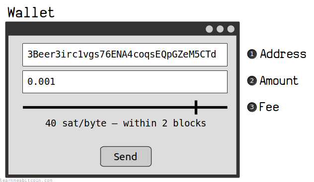](https://static.learnmeabitcoin.com/diagrams/png/beginners-sending-wallet.png)

The process for making a bitcoin transaction is the same for any [bitcoin wallet](/beginners/wallets/) you use:

1. **Enter the address.** This is where you want to "send" the bitcoins.
2. **Enter the amount.** The amount of bitcoins you want to send. This will most likely be in BTC or satoshis.  

    Unit Converter

   BTC

   whole bitcoin

   mBTC

   one-thousandth of a bitcoin

   uBTC

   one-millionth of a bitcoin

   Sats

   one-hundred-millionth of a bitcoin

   0 secs
3. **Set the fee. *(optional)*** This basically sets the "priority" for how quickly the transaction will get finalized.

Then just click "send" and you're done.

From here you'll just need to wait for the transaction to get added to the *blockchain*…

**Always triple-check the *amount* and the *address*.** You cannot "undo" bitcoin transactions, so if you send bitcoins to the wrong address, you're not going to get them back.

**Don't worry too much about typos in the address.** The address contains a [checksum](/technical/keys/checksum/), which means your wallet will detect if it's invalid. So you don't have to check every individual character to make sure the address is correct – I usually just check the first and last 4 or 5 characters.

**Use the TXID to track your transaction.** When you *send* your transaction your wallet will give you a [TXID](/technical/transaction/input/txid/), which is a unique *reference number* that you can use to check the status of your transaction on any [blockchain explorer](/explorer/).

## Process

What happens when you make a transaction?

When you click "send", your wallet sends your transaction in to one of the [nodes](/beginners/guide/node/) on the [bitcoin network](/beginners/guide/network/).

From here it gets relayed from node to node until every node on the network has a copy of your transaction.

[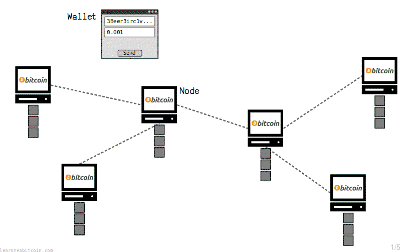](https://static.learnmeabitcoin.com/beginners/sending/send-transaction.gif)

At first, your transaction gets stored in the [memory pool](/technical/mining/memory-pool/) of each node, which is like a temporary "waiting area" for transactions that have recently been broadcast across the network.

[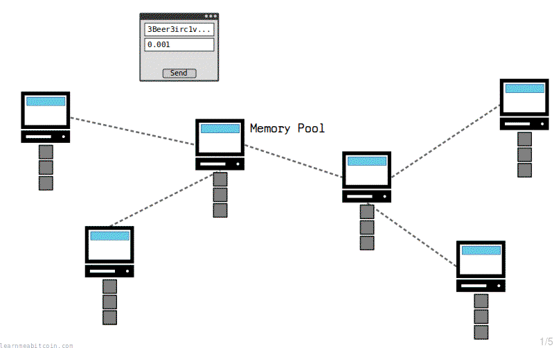](https://static.learnmeabitcoin.com/beginners/sending/memory-pool.gif)

After roughly 10 minutes, one of the nodes on the network will [mine](/beginners/guide/mining/) the latest transactions from their memory pool on to their [blockchain](/beginners/guide/blockchain/).

They will then share this new [block](/beginners/guide/blocks/) of transactions with the other nodes on the network.

[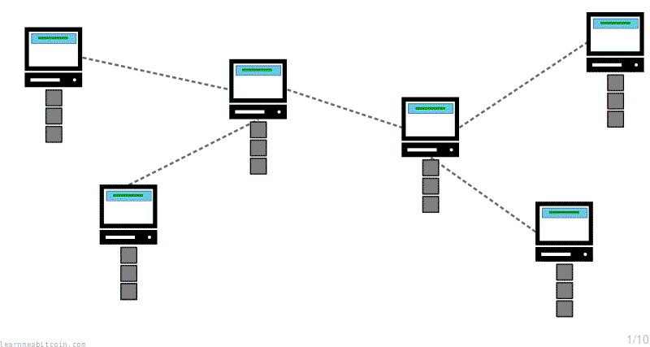](https://static.learnmeabitcoin.com/beginners/sending/transaction-blockchain.gif)

Upon receiving this block, each node will verify it and add it to their blockchain too.

As a result, each of the nodes will update their blockchain to include the latest transactions that have been moved from the memory pool (temporary storage) to the blockchain (permanent storage):

[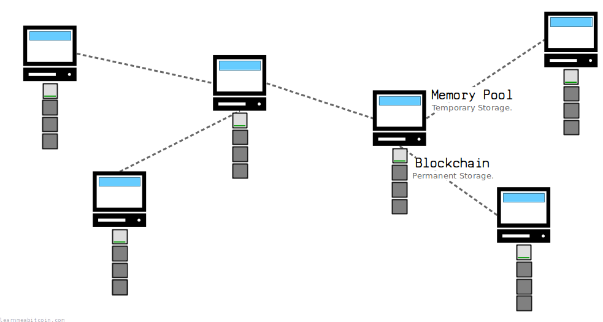](https://static.learnmeabitcoin.com/diagrams/png/beginners-sending-blockchain-network.png)

And if your transaction gets included in a block, then your transaction has been **confirmed** and the payment is complete.

If not, you'll just have to keep waiting for your transaction to make it from the memory pool to the blockchain.

**New blocks are added to the blockchain at 10-minute intervals (on average).** So depending on the [fee](#fees) you've set on your transaction, you shouldn't have to wait too long for your transaction to get confirmed.

**Don't rely on transactions in the memory pool.** Memory pool transactions are not permanent, so don't consider a payment as "complete" until the transaction has made it into the blockchain.

## Mining

How does a transaction make it into the blockchain?

Each node has the opportunity to try and add the transactions from their memory pool on to their blockchain. This process is known as [**mining**](/beginners/guide/mining/).

To add transactions on to the blockchain, a *miner* gathers transactions from their memory pool into a container called a [candidate block](/technical/mining/candidate-block/). From here, the miner *uses energy* to try and "mine" this block on to the blockchain.

[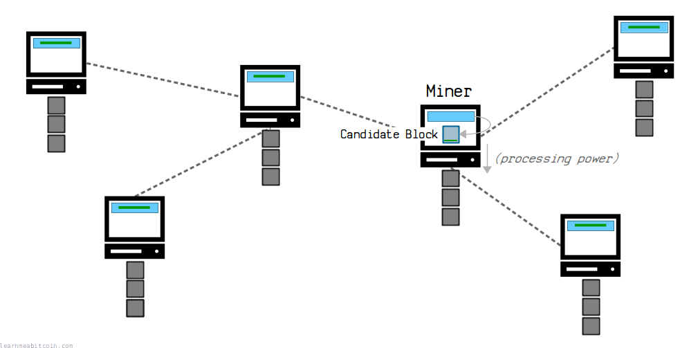](https://static.learnmeabitcoin.com/diagrams/png/beginners-sending-miner.png)

Any node on the network can become a miner.

As a result the *mining* process is basically a **network-wide competition**, where any node on the network has a chance of mining the next block. A node that can mine faster has a better chance of mining the next block, but the process of mining is *unpredictable*, so no single node is in control of adding blocks to the blockchain.

[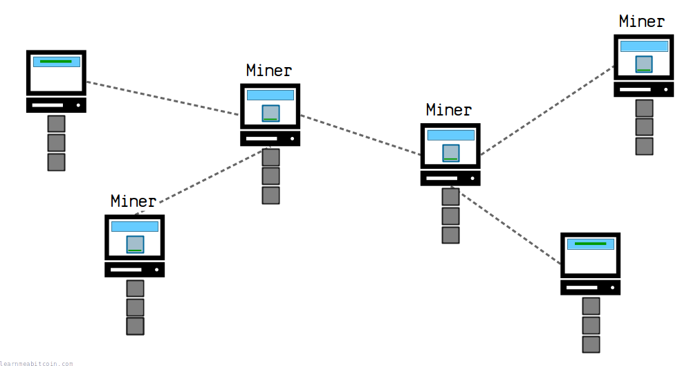](https://static.learnmeabitcoin.com/diagrams/png/beginners-sending-miners.png)

Any of these miners could be the one to mine the next block on to the blockchain.

After about 10 minutes (on average), one of the miners will eventually mine the next block of transactions and share it with all the other nodes on the network. Each node then checks the block (to make sure it is valid and has been mined correctly) and adds it to their blockchain too.

[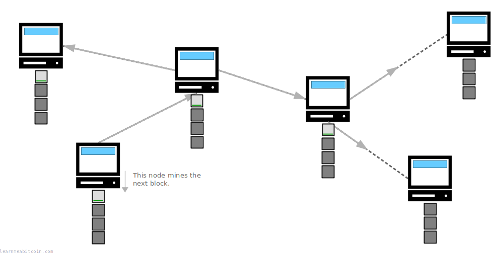](https://static.learnmeabitcoin.com/diagrams/png/beginners-sending-mined-block.png)

Nodes across the network update their blockchain with the newly-mined block.

From here, each miner constructs a new candidate block (with new transactions from the memory pool) and starts trying to mine the next block on to the chain.

As a result, miners are constantly working to extend the blockchain with new blocks of transactions from their memory pool.

### Why do transactions have to be mined?

The mechanism of [mining](/technical/mining/) is important for the following reasons:

1. **Prevents conflicting transactions from being written to the blockchain.** If two conflicting transactions are sent into the network (e.g. trying to send the same bitcoins to two different places), then only *one* of those transactions will be written to the blockchain.
2. **Any node can mine the next block of transactions.** Due to the fact that the mining mechanism is unpredictable, *any* node is in with a chance of mining the next block, which means that no single node is in complete control of the transactions that get added to the blockchain.
3. **It's difficult to remove transactions from the blockchain.** Mining a block requires energy, which makes it difficult for any individual miner to acquire enough energy to rewrite the blockchain.

All in all, *mining* is what allows multiple computers on a decentralized network to agree upon the same copy of a regularly updated file.

Or in other words, it's what allows Bitcoin to maintain a secure ledger of transactions.

## Fees

What are transaction fees?

Every bitcoin transaction includes a [fee](/technical/transaction/fee/).

These fees are collected by miners, and therefore act as an **incentive for miners to include your transaction in a [block](/technical/block/)**.

Why?

Because a [candidate block](/technical/mining/candidate-block/) can only hold a certain amount of data. So if a lot of people are making transactions at the same time, there may be more transactions inside the [memory pool](/technical/mining/memory-pool/) than can fit inside a block:

[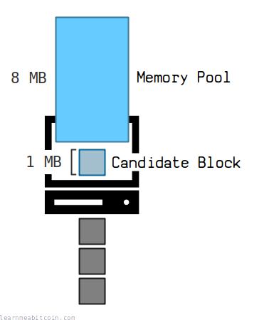](https://static.learnmeabitcoin.com/diagrams/png/beginners-sending-memory-pool-overflow.png)

**Note:** A block can hold [roughly 2MB](/technical/block/#weight) of transaction data, but the memory pool can hold [300MB+](/technical/mining/memory-pool/#size-limit)

Therefore, miners will choose to populate their candidate blocks with transactions that have the **highest fees** on them, because they can collect these fees (via the [coinbase transaction](/technical/mining/coinbase-transaction/)) if they are successful in mining the block.

[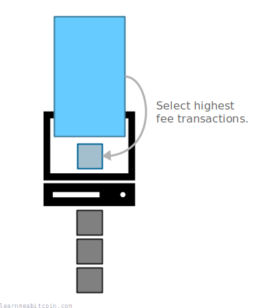](https://static.learnmeabitcoin.com/diagrams/png/beginners-sending-miner-highest-fees.png)

Because at the end of the day, most miners want to make as much money as possible from mining.

So when there are a lot of transactions in the memory pool, the higher the fee you place on your transaction, the higher the "priority" your transaction has for getting included in a block, and the faster it will get mined.

[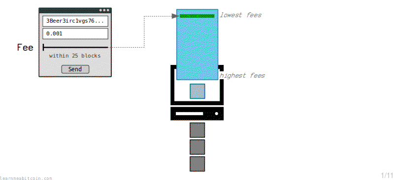](https://static.learnmeabitcoin.com/beginners/sending/wallet-set-fee.gif)

* **The memory pool is like a queue.** Transactions with the highest fees are at the front.
* **The transaction fee effectively determines a transaction's *position* in the memory pool.** The higher the fee, the *more quickly* it will be mined.
* **A good wallet will allow you to set your own fee.** The wallet should also give you an estimate of how long it will take for the transaction to be mined based on the size of your fee.

### What fee should I put on my transaction?

This depends on **how quickly you want your transaction to be mined** based on how many transactions are currently waiting in the [memory pool](/technical/mining/memory-pool/):

Current Mempool Size:

1.12 vMB

4,270 transactions

Note: This is the size of the mempool for my local node.  
The size of your memory pool will differ depending on how long your node has been online and which nodes you are connected to.

The faster you want your transaction to get mined, the higher the fee you should use.

Therefore, a good wallet uses the **current size of the memory pool** to recommend various [feerates](/technical/transaction/fee/#feerates) based on how many *blocks* you'd like your transaction to be mined within:

| Blocks | Time (estimate) | Feerate |
| --- | --- | --- |
| 2 | 20 minutes | 1 sats/vbyte |
| 3 | 30 minutes | 1 sats/vbyte |
| 6 | 1 hour | 1 sats/vbyte |
| 12 | 2 hours | 1 sats/vbyte |
| 144 | 1 day | 1 sats/vbyte |
| 432 | 3 days | 1 sats/vbyte |

Note: A new block is [mined](/technical/mining/) every 10 minutes (on average).

* **These feerates come from Bitcoin Core's `bitcoin-cli estimatesmartfee` command.** This is what most [bitcoin wallets](/beginners/wallets/) use for fee recommendations.
* **These are *estimates*.** Nobody can guarantee when your transaction will get mined, as more transactions could enter the [network](/technical/networking/) after you made your transaction and push your transaction toward the back of the queue.
* **Fee sizes are sorted by [sats/vbyte](/technical/transaction/fee/#sats-per-vbyte).** This is the size of the fee in *satoshis* divided by the size of the transaction in *virtual bytes*. This is because miners want to get the most in fees for the amount of space each transaction takes up in a [block](/technical/block/).

You can always choose to set your own **custom fee** on your transaction too. You can check out the current status of the memory pool yourself and decide on a fee that you think will work best for your needs.

But in general:

* If there are **more** transactions in the memory pool than can fit inside a [candidate block](/technical/mining/candidate-block/), you will need to use a suitably high fee to compete with the other transactions in the memory pool to get inside an upcoming block.
* If there are **fewer** transactions in the memory pool than can fit inside a candidate block, you can set the [minimum fee](/technical/mining/memory-pool/#minimum-fee) of 1 sat/vbyte.

* **It's useful to check out the state of the memory pool when deciding what size transaction fee to use:**
  + [mempool.space](https://mempool.space) – shows a visualization of upcoming blocks and the range of transaction fees within each block.
  + [Johoe's Bitcoin Mempool Size Statistics](https://jochen-hoenicke.de/queue/#0,24h) – shows a detailed chart of the current state of the memory pool.
* **Don't put too high a fee on your transaction unless you really need to.** If you're happy to wait for a while for your transaction to get mined, use a lower fee.

### What happens if I put a low fee on my transaction?

By setting a **low fee** on your transaction you're putting it at "the back of the queue" in the memory pool.

This is fine, but it means that you're going to be waiting for a *quiet period* where the memory pool is cleared out so that your transaction can be included in a block.

Lower-fee transactions will eventually get included in a block if there are no higher-fee transactions left in the memory pool.

However, transactions will only stay in a node's memory pool for **2 weeks** (see [mempoolexpiry](/technical/mining/memory-pool/#mempoolexpiry)), and after this time period a node will **remove the transaction from its memory pool**. If this happens, your transaction will disappear from the network, and it's as if your transaction never happened.

[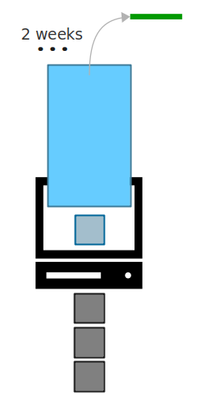](https://static.learnmeabitcoin.com/diagrams/png/beginners-sending-mempool-expiry.png)

Transactions only wait around in the memory pool for a set amount of time.

* **Most wallets allow you to [bump the fee](/technical/transaction/input/sequence/#replace-by-fee) of your transaction whilst it's still in the memory pool.** So if your transaction is taking too long to get mined, you can increase the size of the fee on that transaction to speed up the process.
* You can always re-broadcast your transaction to the network if it leaves the memory pool.

**Do not consider a bitcoin transaction as final until it has been confirmed.** Transactions with very low fees in may not get mined, and will disappear from the network if they've been sat in the memory pool for too long.

## Confirmations

How many confirmations should I wait for?

As a quick guide:

* **1 confirmation** is usually good enough.
* **2 confirmations** is better if you want to protect against an uncommon [chain reorganization](/technical/blockchain/chain-reorganization/).
* **3+ confirmations** is only required if you are concerned about a [network-scale attack](/technical/blockchain/51-attack/) to reverse your transaction.

A *confirmation* is when your transaction gets mined into a block. Additional confirmations are when further blocks are mined *on top* of the block your transaction was included in.

[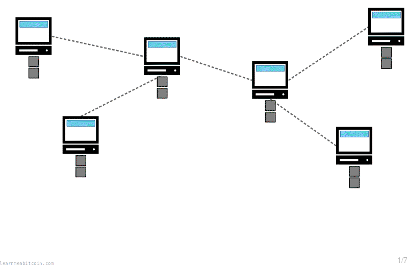](https://static.learnmeabitcoin.com/beginners/sending/confirmations.gif)

The number of confirmations refers to how deep your transaction is in the blockchain.

Why does this matter?

Well, I know I said that you cannot remove a transaction from the blockchain, but it is technically possible for it to happen. Due to the way the [blockchain](/technical/blockchain/) works, a [bad miner](/technical/blockchain/51-attack/) with a lot of mining power could use their energy to build a new [longer blockchain](/technical/blockchain/longest-chain/) for nodes to adopt, and replace blocks (and transactions) that are already in the chain.

This has not yet happened in Bitcoin, but as I say, it's *technically* possible.

[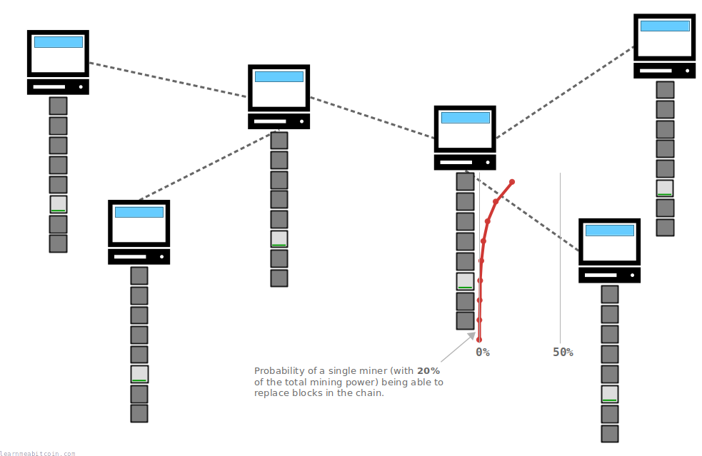](https://static.learnmeabitcoin.com/diagrams/png/beginners-sending-replacing-blocks.png)

It becomes exponentially more difficult for a miner to remove a transaction the deeper it makes its way down the blockchain.

So this is why it's sometimes recommended to wait for **6 confirmations** (or more) to be sure a transaction cannot be reversed, because at this point it's no longer "computationally feasible" for a miner to replace that number of blocks. However, unless you're protecting yourself from a bad miner performing an attack against the entire network, this is overkill.

A more reasonable amount of time to wait to be confident that a transaction isn't going to be undone is **2 confirmations**. This is because the top block in the blockchain has a tendency to change around with another block during natural [chain reorganization](/technical/blockchain/chain-reorganization/).

[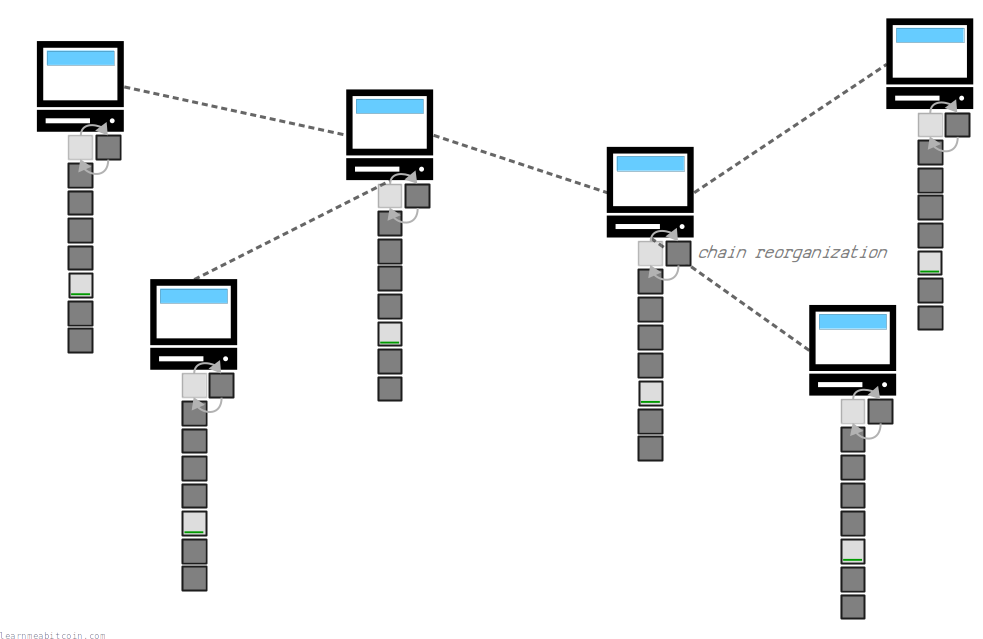](https://static.learnmeabitcoin.com/diagrams/png/beginners-sending-chain-reorganization.png)

Chain reorganizations happen when two blocks are mined at the same time and compete for the same spot in the chain.

So when your transaction makes it past the *first* block (i.e 2 confirmations), you can be confident that it isn't going to be undone due the natural operation of the way the blockchain is built.

Chain reorganizations happen roughly once every `44.3` days (once every `6,451` blocks).

Personally, **1 confirmation is good enough for me most of the time**, and I'll wait for 2 confirmations if I'm receiving a large payment that I want to be doubly-sure isn't going to be reversed.

I'd only wait for about 6+ confirmations if I'm selling my house for bitcoin, and I'm actively worried that the blockchain could be under attack.

## Monitoring

How can I check the status of my transaction?

One of the coolest things about bitcoin is that you can use [blockchain explorers](/explorer/) to see the status of your transactions in real time.

When you make a bitcoin transaction, your wallet should give you the [TXID](/technical/transaction/input/txid/) for that transaction. This is like a unique reference number for the transaction, and you can use it to find the transaction in a blockchain explorer.

Here are a few handy blockchain explorers:

* [mempool.space](https://mempool.space) – Probably the most popular explorer, and rightfully so. Easy to use and stylish.
* [bitref.com](https://bitref.com) – A clean, fast, blockchain explorer. Nice and simple.
* [learnmeabitcoin.com/explorer/](/explorer/) – This is an explorer I made. It's not terribly popular, but it is a fully-functioning blockchain explorer nonetheless.

Now, a blockchain explorer is basically just a website that acts as a *window* into a bitcoin [node](/technical/networking/node/). So by entering your TXID, you're just asking the explorer to look into its blockchain (or memory pool) and show you the details of a transaction it has received.

[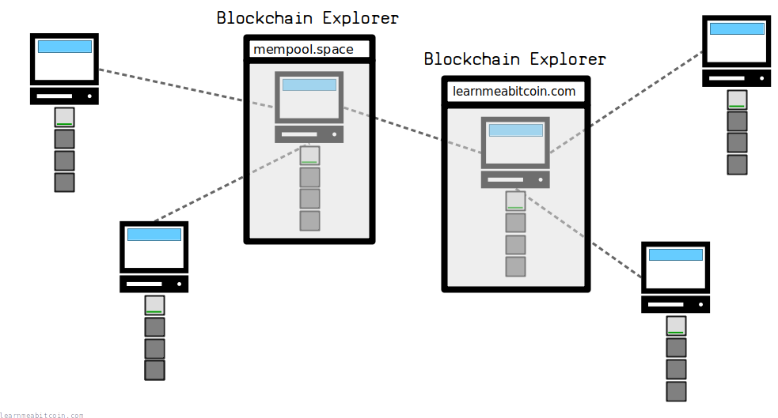](https://static.learnmeabitcoin.com/diagrams/png/beginners-sending-blockchain-explorers.png)

Block explorers just display the data from inside their blockchain (and memory pool).

I won't cover all the details of what explorers can show you, but some of the things I find most useful are:

* **The number of confirmations.** Is my transaction still in the [memory pool](/technical/mining/memory-pool/), or has it been mined into a [block](/technical/block/)?
* **The movement of bitcoins.** Which [addresses](/technical/keys/address/) did the bitcoins come from, and which addresses are they being locked up to?
* **The locks on the bitcoins.** What [locking scripts](/technical/script/) were placed on the bitcoins?

Anyway, your wallet will probably tell you the basic information about your transaction (such as whether it has been confirmed or not), but a blockchain explorer allows you to dig into the details of the transaction, which is pretty cool.

You can also find the status of transactions from your own Bitcoin Core node using `bitcoin-cli gettransaction [txid]`

## Summary

Here are my top tips for making bitcoin transactions:

* Use a [wallet](/beginners/wallets/) that you feel comfortable with.
* Set the **lowest fee** you can get away with.
* Follow the transaction's progress with a [blockchain explorer](/explorer/).
  + **1 confirmation** is enough most of the time.
  + 2 confirmations is better if you want to be extra sure in the rare case of a natural [chain reorganization](/technical/blockchain/chain-reorganization/).
  + 3+ confirmations is overkill unless you're afraid someone is going to orchestrate a [network-scale attack](/technical/blockchain/51-attack/) to undo your transaction.

You'll get the hang of it after your first few transactions.

I've tried to make this guide as comprehensive as possible, but ultimately **experience is always the best teacher**. So just take your time and give it a go.