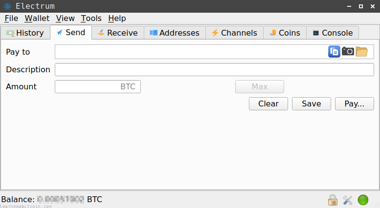
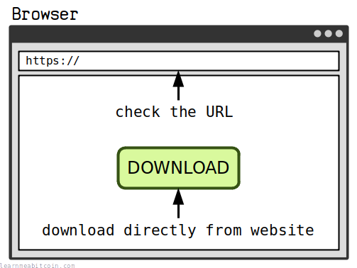
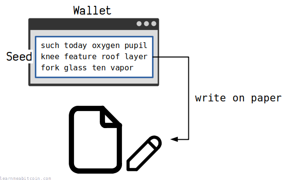
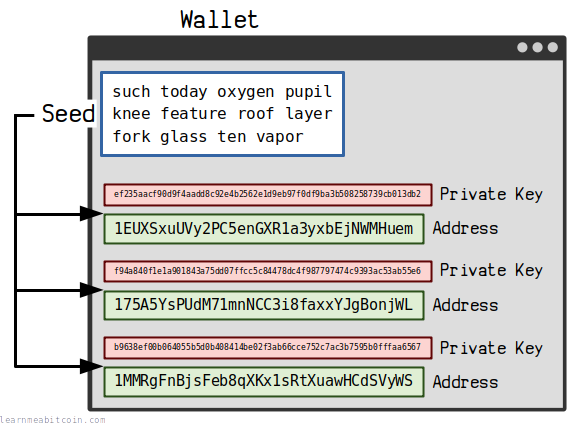
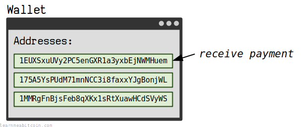
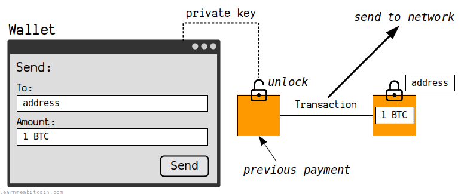
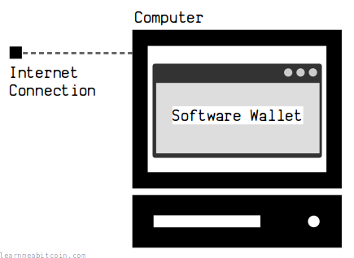
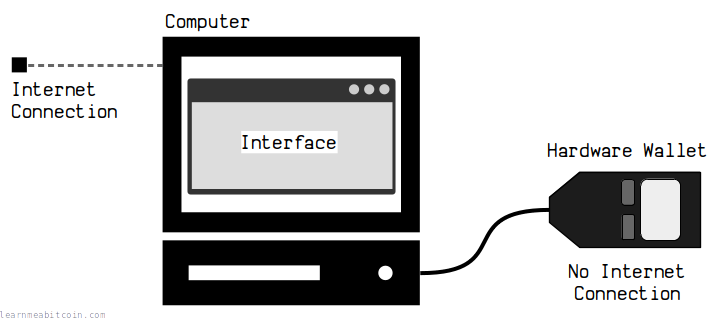
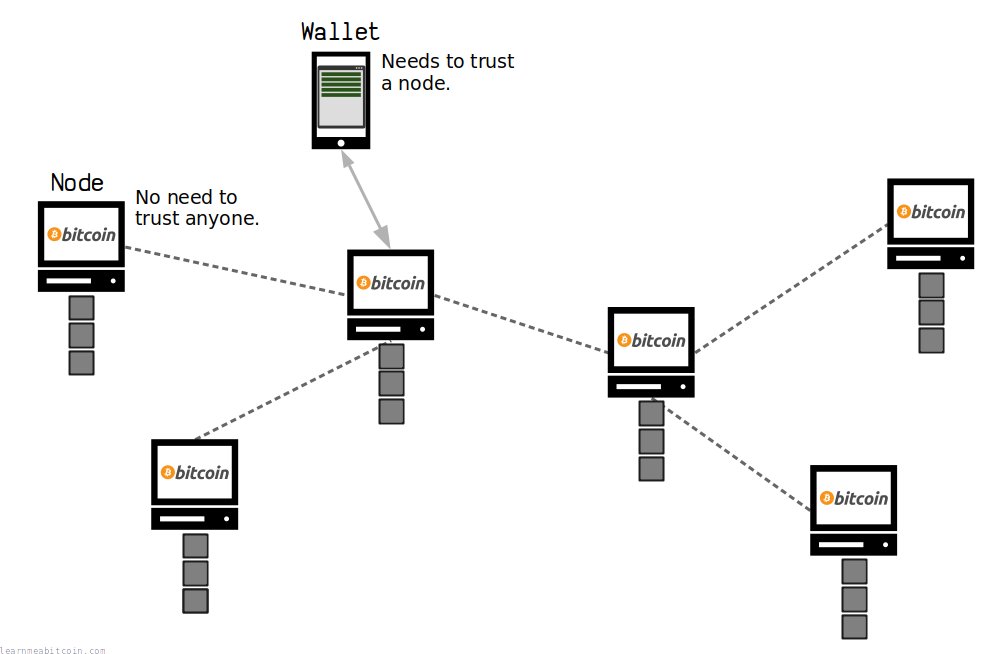
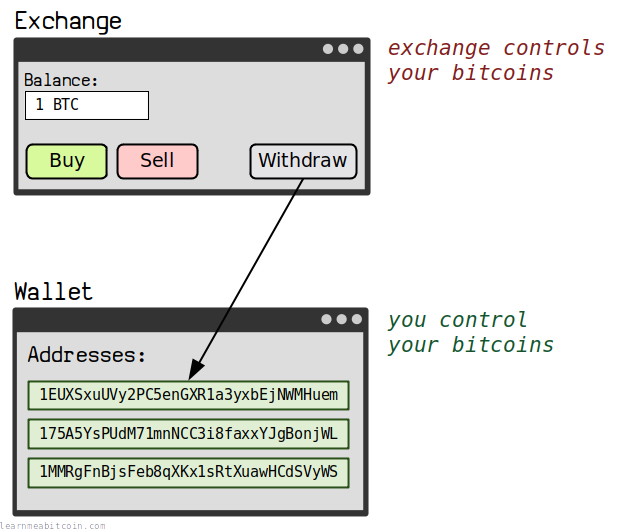

[Electrum](https://electrum.org/) screenshot.

The first thing you need to do to start using bitcoin is to **get your own wallet**. They're completely free, and it only takes a couple of minutes to [set one up](#setup).

Once you've got a wallet, you've got everything you need to start receiving and [sending](/docs/beginners/sending.md) bitcoins.

## Best Wallets

Here's my list of the **best bitcoin wallets**.

This isn't an extensive list of all the bitcoin wallets available; it's just a shortlist of the ones that I've personally used and *trust*.

### Desktop Wallets

Wallet | Level | OS | Released || [Electrum](https://electrum.org/) | Beginner/Intermediate | Linux/Windows/Mac | 2011 |
| [Sparrow Wallet](https://www.sparrowwallet.com/) | Advanced | Linux/Windows/Mac | 2020 |

If you're new to using bitcoin, I would strongly recommend starting out with a *desktop wallet*.

Desktop wallets tend to offer more features than [mobile wallets](#mobile-wallets), and give you more control over managing your bitcoins.

**I highly recommend [Electrum](https://electrum.org/).** I've been using it for years and it's my personal favorite.

### Mobile Wallets

Wallet | Level | OS | Released || [BlueWallet](https://bluewallet.io/) | Beginner | iOS/Android | 2018 |
| [Electrum](https://electrum.org/) | Beginner | Android | 2016 |
| [Blockstream Green](https://blockstream.com/green/) | Beginner | iOS/Android | 2020 |
| [Mycelium](https://wallet.mycelium.com/) | Intermediate | Android | 2012 |

A mobile wallet is a good alternative if you don't have access to a desktop computer.

I'm not a huge fan of mobile wallets as they tend to be limited in the features they offer, and I don't like the idea of carrying all of your bitcoin around with you everywhere you go.

However, a mobile wallet is perfectly fine to start out with if it's the only option you have available, or if you want to use one to hold a small amount of bitcoin for making payments. I would just avoid storing too much bitcoin on a mobile wallet, and upgrade to a [desktop wallet](#desktop-wallets) or a [hardware wallet](#hardware-wallets) when you get the chance.

### Hardware Wallets

Wallet | Level | Released || [Trezor](https://trezor.io/) | Beginner | 2014 |
| [Coldcard](https://coldcard.com/) | Advanced | 2018 |

A hardware wallet is the best option for [secure storage](/docs/beginners/security.md) of your bitcoins.

Hardware wallets cost money to buy and are not as convenient as desktop/mobile wallets, but they're the best option for *security*.

I would recommend getting started with a [desktop](#desktop-wallets) wallet first, then upgrade to a hardware wallet when you've got an amount of bitcoin that's worth protecting.

Keep your bitcoins in a desktop wallet for day-to-day spending, and keep everything else in a hardware wallet.

## Setup

How do you set up a bitcoin wallet?

I've set up many a bitcoin wallet in my time.

It's pretty straightforward, and setting up a bitcoin wallet can be boiled down to two simple steps:

### 1. Download and install

Obviously the first step is to download and install the bitcoin wallet.

A bitcoin wallet is just a small computer program after all, so you download and install one like you would with any other program or app.

The most important thing with bitcoin wallets though is to **download them directly from the wallet's website**.

A bitcoin wallet manages all the [keys](/docs/beginners/guide/keys-addresses.md) you need to access your bitcoin, and some of these need to be kept private. So the last thing you want to do is download your wallet from an unreliable source. If you download directly from the wallet's website, you can be confident that you're getting an authentic version of the software.

So always **double-check the URL of the website** you're downloading your wallet from.

You can also *verify* that your download is authentic using the signatures provided on the wallet website (e.g. [Electrum](https://electrum.org/)). This isn't strictly necessary, but it's good for peace of mind if you're able to do it.

### 2. Write down the seed

During the initial setup of your wallet you will be given a 12 or 24 word [seed](/docs/technical/keys/hd-wallets/mnemonic-seed.md).

**Write this seed down on paper and store it somewhere safe.**

**This is an example seed, do not use it.** Your seed must be unique and randomly generated by your own wallet.

This seed is the source of all your [keys and addresses](/docs/beginners/guide/keys-addresses.md). Therefore, it allows you to recover all of your bitcoins if you end up losing your wallet for whatever reason.

All of your private keys and addresses are generated from the seed.

It's basically a master backup in the event that something goes wrong.

But this also means that anyone can steal your bitcoins if they gain access to your seed, so it's vitally important that you keep it secure.

A couple of quick tips:

* **Write the seed down on *paper*.** Writing the seed down on paper is the quickest and easiest way to keep it safe from digital attacks. It sounds basic, but it works.
* **Do not save the seed in plaintext on your computer.** If you save your seed in some text file on your computer, you're leaving it vulnerable to being stolen if your computer gets hacked or someone gains access to your device.

I have a friend who took a screenshot of their seed and stored it in a shared Dropbox folder. I don't know how it got stolen exactly, but it didn't take very long.

Keeping your seed offline by writing it on paper is simple *and* effective.

* **It's a good idea to also note the *wallet name* and *date* alongside your seed.** This isn't essential, but it may be helpful when you come to restore your wallet later on down the line.
* **[KeepassXC](https://keepassxc.org/) is a good option if you want to store your seed digitally.** But if you're not confident using password managers, just write it down on paper.

## Function

What does a wallet do?

A bitcoin wallet **manages the keys** you need for sending and receiving bitcoin.

You use one of your [addresses](/docs/technical/keys/address.md) when you want to *receive* a payment. The [way Bitcoin works](/docs/beginners/how-does-bitcoin-work.md) is a certain amount of bitcoin will get *locked* to your address in a [transaction](/docs/beginners/guide/transactions.md).

When you *send* bitcoins to someone else, your wallet will create a new transaction that *unlocks* an amount of bitcoin you've received using the corresponding [private key](/docs/technical/keys/private-key.md), and locks up an amount of bitcoin to someone else's address.

So in summary, a wallet does three main things:

1. Manages the [addresses](/docs/technical/keys/address.md) required for receiving bitcoins.
2. Manages the corresponding [private keys](/docs/technical/keys/private-key.md) for sending bitcoins.
3. Creates [transactions](/docs/technical/transaction.md) and sends them into the network.

* A wallet is more like *key management* software.
* You'll typically only see your addresses when you use your wallet – the private keys are managed behind the scenes.

## Types

What are the different types of wallets?

There are two main types of wallet:

### 1. Software Wallet

aka Hot Wallet

A software wallet is a wallet that you download and run on your desktop or mobile. These wallets are **connected to the Internet** and allow you to quickly and easily send and receive bitcoins.

The downside however is that they are *connected to the Internet*. Therefore, software wallets are **at risk from malware and viruses**.

They're perfectly fine to use if you're competent with computer security and don't make a habit of downloading dangerous software from unreliable sources. But naturally, the risk is always there.

### 2. Hardware Wallet

aka Cold Wallet

A hardware wallet is a *device* used solely for storing bitcoin.

These devices are **not connected to the Internet**, which means they're protected from the attacks that software wallets are vulnerable to.

A hardware wallet stores all of your [private keys](/docs/beginners/guide/private-keys.md) on the device. So when you connect the hardware wallet to a computer to make a [transaction](/docs/beginners/guide/transactions.md), all of the [signing](/docs/beginners/guide/digital-signatures.md) takes place on the device and your private keys are never exposed to the Internet.

Hardware wallets cost money to buy and add another step compared to the convenience of software wallets, but if you've got a significant amount of bitcoin that you want to protect, you should strongly consider getting yourself a hardware wallet.

A hardware wallet is the first step you should take to improve the [security of your bitcoins](/docs/beginners/security.md).

**A hardware wallet is like setting up a software wallet on a separate laptop that doesn't have an Internet connection.** This is what we used to do in the old days before hardware wallets became a thing. It's just that getting a hardware wallet is cheaper and more convenient than getting a secondary laptop.

## FAQ

### What about Bitcoin Core?

[Bitcoin Core](https://bitcoincore.org/en/download/) is an excellent option for use as a bitcoin wallet.

If anything, it's the *ultimate* option for using Bitcoin, because it allows you to verify every single payment you receive **without having to trust** any other [node](/docs/technical/networking/node.md) on the network (because you are one).

The downside is that you have to download the entire [blockchain](/docs/technical/blockchain.md) before you can get started, which slows down the initial setup process. But if you've got the computer hardware and time to set it up, it's a perfectly good option for a bitcoin wallet.

However, it's just **much quicker and easier to download a simple software wallet instead**, which is what most people do for sending and receiving bitcoin (including me). These wallets *connect* to nodes on the network to get information about transactions, which saves you having to download and store the entire blockchain yourself.

But there's nothing wrong with using Bitcoin Core if you prefer.

For increased privacy, you can always connect a software wallet directly to your own Bitcoin Core node.

### Do you need a wallet?

Using a bitcoin wallet gives you **control over your bitcoins**.

If you keep your bitcoins on an [exchange](/docs/beginners/exchanges.md), they have control over your bitcoins instead. They can determine how much you can withdraw, and where you can send your bitcoins. Worse still, if the exchange disappears, then so do your bitcoins.

There's a popular saying in Bitcoin:

> Not your keys, not your coins.

By withdrawing to your own wallet, you're taking *custody* of your bitcoins. This gives you the freedom to do what you want with your coins, and nobody can decide to take them away from you.

But this also means you're responsible for your own *security*.

If you trust an exchange more than your own ability to use a wallet, then there's nothing *wrong* with leaving bitcoins on the exchange. This might sound like sacrilege, but if it feels less risky for you to keep your bitcoins on an exchange, then I would be a fool to try and convince you otherwise.

Of course, I'm a big fan of the freedom that Bitcoin offers, and I would encourage anyone to use a wallet to manage their bitcoins if they can. But at the end of the day, you've got to do what's right for you.

Just be aware that keeping your coins on an exchange comes with its own set of risks.

I would recommend to at least try withdrawing a small amount to a wallet to see how it feels. Experience is a great teacher.

## What next?

Once you've got your bitcoin wallet set up, you're all set to [buy your first bitcoins](/docs/beginners/exchanges.md).