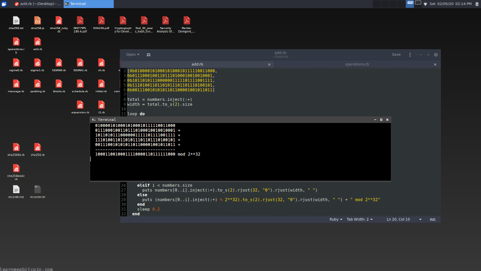
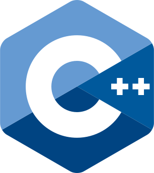

# Technical Icon Technical

This is a complete technical guide to bitcoin.

Each page contains simple **text explanations** and **diagrams** for how the different parts of bitcoin work. They also include real-world **examples** and **tools** to help you work with raw data in bitcoin.

So if you *really* want to know how bitcoin works under the hood, this guide is for you.

## How to become a bitcoin programmer

I've included lots of **code examples** within this technical guide to help you with writing your own scripts.

This is because the best way to learn how to become a bitcoin developer is to actually **write code**.

## Code examples are in these boxes


Most of the code examples are in [Ruby](https://www.ruby-lang.org/en/) because I think it's the easiest language to read.

If you're not using Ruby, you should be able to use the code snippets as a reference for rewriting the code in the programming language of your choice.

You can read about how bitcoin works as much as you want, but until you start coding, making mistakes (which you will), and building some useful tools, you're never going to make progress. So don't be afraid to give it a go. We've all got to start somewhere.

And if I can learn how to make stuff with bitcoin, so can you.

Anyway, there's no single "best" way to get started with working on bitcoin, but if you're completely new and have no idea where to start, this is what I would recommend…

### Install Linux (optional)

This is completely optional, but I'd recommend installing Linux.

* **[Xubuntu](https://xubuntu.org/)** – This is my Linux distribution of choice. It's just the popular [Ubuntu](https://ubuntu.com/) bundled with the lightweight and functional [XFCE](https://xfce.org/) desktop environment. It's easy to use, and is a good starting point if you're moving from Mac or Windows, because everything just works out of the box.
    

  [](https://static.learnmeabitcoin.com/technical/my-setup-2020.png)


  This is what my desktop looks like. I was making this [SHA256 animation](https://www.youtube.com/watch?v=f9EbD6iY9zI) at the time.

I really like Linux for programming work. Linux gives you complete control over your system, and it feels like a natural environment for writing your own programs and tools, because nothing is hidden away from you for your own safety or convenience.

I switched to Linux over a decade ago, and I haven't looked back since – it felt like I gained freedom over my operating system and I've never wanted to go back.

Obviously, if you're proficient with your current development environment, stick with that. But if you want to get better at programming and have felt limited in some way up until now, try using Linux instead.

### Install Bitcoin Core


If you're going to be working with bitcoin, it's a good idea to install [Bitcoin Core](https://bitcoin.org/en/download) (the original bitcoin program).

There are a few benefits to running your own local bitcoin node:

* **Access to raw bitcoin data.** By running a full node on your local computer you can quickly and easily access raw [block](/technical/block/) and [transaction](/technical/transaction/) data without having to rely on a third-party API:  

  ```
  bitcoin-cli getrawtransaction <txid>
  bitcoin-cli getblock <hash>
  ```
* **Useful command line tools.** The Bitcoin Core program comes packaged with a bunch of command line tools that I regularly use for debugging and decoding. Here are a couple of useful examples:  

  ```
  bitcoin-cli decoderawtransaction <raw transaction data>
  bitcoin-cli decodescript <hex script>
  ```
* **Sending raw transactions.** If you're in the business of constructing your own raw [transactions](/technical/transaction/), you can send them into the bitcoin network via your own local node:  

  ```
  bitcoin-cli sendrawtransaction <raw transaction data>
  ```

Depending on what kind of work you're doing with bitcoin, you may or may not need to run your own full Bitcoin Core node. But if you're not sure, it's good to have it there anyway.

You can list all of the available commands by running `bitcoin-cli help`.

### Use your favorite programming language





**You can work with bitcoin in *any* programming language you like**, so you might as well use your favorite.

You're more likely to succeed if you work with a programming language that you enjoy, rather than forcing yourself to try to code in a language that you think you "should" be using for some reason.

And if you don't know any languages yet, pick the one that you think looks cool.

Worse comes to worst, if it turns out the language you've chosen is too slow or completely inadequate for some reason, you can always rewrite your project in a different language later on. But you won't know until you try. And rewriting will be much easier the second time around, because you'll already have a library of code to work from.

So don't stress about which programming language to use. Just pick one and go for it. Some popular choices include:

* **[Python](https://www.python.org/)** – Good for beginners.
* **[Ruby](https://www.ruby-lang.org/en/)** – My personal favorite language. Also good for beginners.
* **Javascript** – Good for web-based stuff.
* **[Go](https://go.dev/)** – Good for fast server-side programs.
* **[C++](https://en.cppreference.com/w/)** – This is what the Bitcoin Core codebase is written in.

If you want to become a *Bitcoin Core developer*, you're going to need to learn **C++**.

I'm a big fan of [PHP](https://www.php.net/) and [Ruby](https://www.ruby-lang.org/en/). PHP because it's the language I'm most proficient with (it's what this website and my personal bitcoin library is coded in), and Ruby because it's enjoyable to use and easy to read (it's what most of the examples on this website are written in).

That's not to say you should use these particular languages. In fact, I'd probably get laughed out of some programming circles for using PHP and Ruby (and rightfully so). But they work well for me, and I've created some really useful tools with them, and that's all that matters.

So who's laughing now.

In short, don't get hung up on which language is "best" for bitcoin. The best language is always going to be the one that you can use to actually **build stuff with**.

**There's going to be more help available if you stick to a fairly [popular language](https://www.tiobe.com/tiobe-index/).** If you use a language that nobody else is using, you're going to find that you'll be on your own a lot when it comes to solving tricky problems.

### Where to start with bitcoin programming

If I had to provide you with a specific route to take, I'd say these are the **three** most practical (and satisfying) milestones when learning how to program with bitcoin:

1. **Generating your own [keys](/technical/keys/).** This is the perfect place to start. Try generating your own [private key](/technical/keys/private-key/), [public key](/technical/keys/public-key/), and [address](/technical/keys/address/). Then import the private key into a wallet, and see if you get the same address as the one you generated.  

   Generate

   ```
   private key: d7e59ef51ed9889a218086021c3a9d883250434719efde12ec86a60eef566ec5
   public key:  03e79f1ddd24311b4988bf5089d8f8d4b41b581f7202a42bb80d6dd0eb0cf0ce48
   address:     1CX78rJhYpYuJ6TvoHP3HDHopm9PeKN7pd
   ```
2. **Decoding a [transaction](/technical/transaction/).** Learning how to decode a raw transaction will teach you a lot about the structure of a bitcoin transaction, and they make up 99% of the data inside the [blockchain](/technical/blockchain/).  

    Transaction Splitter

   Random Example

   Transaction Data

   * `0 bytes`
   * `0 vbytes`

   Result

   ```
    
   ```


   0 secs
3. **Creating your own transaction.** After decoding a transaction, you're all set to create your own. This is a much bigger milestone (so take your time), but it's the natural next step. [Signing](/technical/keys/signature/) it will be the tricky part, but if you can successfully send your own bitcoin transaction into the [network](/technical/networking/), then you can safely say that you're a pretty good bitcoin programmer.  

    Transaction Builder

   Random Example

   Type

    Legacy

    Segwit

   Version

   0d

   * Basic Transaction


   Inputs (1)


   Input 0 


   TXID
   * **Note:** This is just a placeholder TXID given as an example.
   VOUT

   0d

   scriptSig (ASM)


   Sequence

   0x


   [+] Add Input


   Outputs (1)


   Output 0


   Amount (satoshis)

   0d


   scriptPubKey (ASM)


   Type

    Non-Standard
    P2PK (Pay To Pubkey)
    P2PKH (Pay To Pubkey Hash)
    P2MS (Multisig)
    P2SH (Pay To Script Hash)
    P2WPKH (Pay To Witness Pubkey Hash)
    P2WSH (Pay To Witness Script Hash)
    P2TR (Pay To Taproot)
    OP\_RETURN (Data)


   [+] Add Output


   Locktime

   0d

   * Block Height

   ---


   Raw Transaction Data

   ```
   0100000001aaaaaaaaaaaaaaaaaaaaaaaaaaaaaaaaaaaaaaaaaaaaaaaaaaaaaaaaaaaaaaaa0000000000ffffffff0100000000000000000000000000
   ```

   * `60 bytes`
   * `60 vbytes`

   0 secs

And if you can create you own bitcoin transactions, there's nothing else in bitcoin that will be outside your ability.

### Write command line tools

[](https://static.learnmeabitcoin.com/technical/command-line-tools.gif)

Writing command-line tools is a good way to get started with programming for bitcoin.

This is especially true if you don't have an idea for a project yet. Plus, if you're going to be spending any time working with bitcoin data, it's always going to be handy to have a bunch of command-line utilities to help you along the way.

Some basic command line tools that will prove to be very useful over the long run are:

* **Hash Functions** - It's handy to have a quick and easy way to get the [HASH256](/technical/cryptography/hash-function/#hash256) or [HASH160](/technical/cryptography/hash-function/#hash160) of some data, because they're used everywhere in Bitcoin.  

   HASH256

  Random Transaction Data

  Random Block Header

  Data (Hex)

  `0 bytes`


  
  SHA-256

  
  SHA-256

  HASH256

  SHA-256(SHA-256(data))

  `0 bytes`


  0 secs

   HASH160

  Data (Hex)

  A public key or script for example

  `0 bytes`


  
  SHA-256

  
  RIPEMD-160

  HASH160

  RIPEMD-160(SHA-256(data))

  `0 bytes`


  0 secs
* **Reversing Byte Order** - This one is invaluable to me. You often need to reverse the [byte order](/technical/general/byte-order/) of [TXIDs](/technical/transaction/input/txid/) and [block hashes](/technical/block/hash/), because the byte order you use within raw transaction data and block data is the reverse of what you use to search for them in a [blockchain explorer](/explorer/). Furthermore, most fields in raw bitcoin data are in "[little-endian](/technical/general/little-endian/)", so you'll often find yourself needing to reverse the byte order before converting numbers between hexadecimal and decimal  

   Reverse Bytes

  Random Example

  Bytes

  `0 bytes`

  Reversed

  `0 bytes`


   Show Details


  0 secs
* **Number Converter** - I can't tell you how many times I've converted something from [hexadecimal](/technical/general/hexadecimal/) to decimal (and vice versa). You can use an online tool if you want, but there's nothing quite like firing up a terminal and converting a number using a script you've written yourself.  

   Number Converter

  Binary (Base 2)

  0b

  `0 digits`

  Decimal (Base 10)

  0d

  `0 digits`

  Hexadecimal (Base 16)

  0x

  `0 digits`


  +1


  0 secs

But don't get bogged down by writing command line tools for the sake of it. It's a good way to get started, but your main focus on your journey to becoming a bitcoin programmer should be working on your own projects…

### Your first bitcoin project (important)

The best way to learn to become a bitcoin programmer is to try and **build something**.

If you've got an idea for something you want to build, just go for it and **learn what you need to learn as you go**. You don't need to know about every aspect of bitcoin to start making something useful.

It may seem like an intimidating task at the start, especially if you're new to bitcoin and/or programming, but if you just take it one step at a time you'll get there eventually.

Because as with anything in life, it's impossible to fail if you refuse to give up.

Anyway, I'm guessing you've already got an idea of what you want to build. But if you need some inspiration, here are some popular tools that other people have built:

#### Web Tools

* [Mnemonic Code Converter](https://iancoleman.io/bip39/) (by [Ian Coleman](https://iancoleman.io/))
* [Bitfeed](https://bitfeed.live/) (by [mononaut](https://x.com/mononautical))
* [Yogh Explorer](https://yogh.io/) (by [Jorn C](https://github.com/JornC))
* [mainnet-observer](https://mainnet.observer/) (by [b10c](https://github.com/0xB10C))
* [Bitcoin Mempool Size Statistics](https://jochen-hoenicke.de/queue/) (by [Jochen Hoenicke](https://jochen-hoenicke.de/))

#### Desktop Tools

* [Electrum](https://electrum.org/) (by [Thomas Voegtlin](https://github.com/ecdsa))
* [Sparrow Wallet](https://www.sparrowwallet.com/) (by [Craig Raw](https://x.com/craigraw))

#### Command Line Tools

* [bitcoin-iterate](https://github.com/rustyrussell/bitcoin-iterate) (by [Rusty Russel](https://x.com/rusty_twit))
* [vanitygen](https://github.com/samr7/vanitygen) (by [samr7](https://github.com/samr7))
* [bitcoin-utxo-dump](https://github.com/in3rsha/bitcoin-utxo-dump) (by [Greg Walker](https://learnmeabitcoin.com/))

This is just a handful of cool tools that I know have been made by *individuals*. I think they're good inspiration for what can be done with bitcoin if you have a good idea and the determination to see it through.

So just go ahead and create something useful that doesn't already exist, then make it available for other people to use, and see what happens.

**Be responsible.** You need to be very careful if you're creating a tool that handles [private keys](/technical/keys/private-key/) or creates [transactions](/technical/transaction/) for other people (e.g. a wallet). It's one thing to make your own mistakes and lose your own coins, but it's another to make mistakes that cause other people to lose coins, so don't take it lightly.

**Share your work on [GitHub](https://github.com/).** This is a good way to share your code with the world, and it's also a good way to display your experience if you're looking to get a job (if that's the direction you want to go in).

### Summary

Don't let anyone make you think that you can't be a bitcoin programmer.

Bitcoin is decentralized, open-source software. You can generate your own [keys](/technical/keys/) and construct your own [transactions](/technical/transaction/) if you want to, and nobody can stop you. That's part of what makes bitcoin, bitcoin.

I'm sure some people will want to convince you that you need some kind of qualification to work with bitcoin, but allow me to tell you, you don't. Everything you need can be learnt for free on the Internet, or even by just looking at the [bitcoin source code](https://github.com/bitcoin/bitcoin/). The only real qualification you need to work on bitcoin is the desire to contribute, and everything else can be learnt along the way.

We've all got to start somewhere, and if you've got an idea and the passion to make it happen, then you're just as qualified to become a bitcoin programmer as anyone else.

The best wallets and tools were built by people that, at some point, had no prior experience with bitcoin.

### Other Resources

Nobody learns about an entire subject from just a single book or website any more, so here are some other excellent technical resources for bitcoin that I've found useful:

#### Websites

* [Bitcoin Developer Guide](https://developer.bitcoin.org/devguide/) – The official guide. Quite technical, but covers a lot.
* [Bitcoin Wiki](https://en.bitcoin.it/wiki/Main_Page) – A lot of technical information that you won't find anywhere else.
* [Bitcoin Stack Exchange](https://bitcoin.stackexchange.com/) – The best place for getting answers to questions.
* [BIPs](https://bips.dev/) – Most proposals contain good technical information about a specific upgrade.

#### Books

* [Mastering Bitcoin](https://github.com/bitcoinbook/bitcoinbook)
* [Programming Bitcoin](https://github.com/jimmysong/programmingbitcoin)

#### Other

* [lopp.net Resources](https://www.lopp.net/bitcoin-information.html) – The famous hub for Bitcoin-related resources.
* [Royal Fork Blog](https://www.royalfork.org/) – Masterfully written articles explaining some aspects of Bitcoin. Some of these pages inspired this website.
* [Minimum Viable Block Chain](https://www.igvita.com/2014/05/05/minimum-viable-block-chain/) – Incredible single-page article on blockchain technology by a great technical writer.
* [RaspiBolt](https://raspibolt.org/) – Guide to setting up a Bitcoin node on a Raspberry Pi. Worth doing at least once for the experience.

#### Libraries

A smart way to learn how bitcoin works is to learn from **existing bitcoin libraries** written in the language you're using yourself.

You can find a bitcoin library in pretty much any programming language by searching for "[language] bitcoin library". For example:

* Go: [btcd](https://github.com/btcsuite/btcd) (highly recommended; excellent code comments)
* PHP: [bitcoin-php](https://github.com/Bit-Wasp/bitcoin-php)
* Ruby: [bitcoin-ruby](https://github.com/lian/bitcoin-ruby)
* Javascript: [bcoin](https://github.com/bcoin-org/bcoin)

There's a wealth of open-source code out there, and sometimes it's best to see how someone else has solved a problem to help you figure out how to do it yourself.

Good luck.