[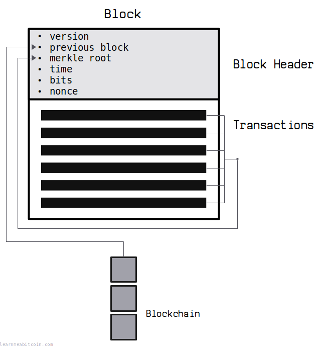](https://static.learnmeabitcoin.com/diagrams/png/block.png)

A block is a container for [transactions](/docs/technical/transaction.md).

At the top of every block is a **block header**, which summarizes all of the data in the block. This contains a fingerprint ([merkle root](/docs/technical/block/merkle-root.md)) of all the transactions in the block, as well as a reference to a previous block.

Miners repeatedly [hash](/docs/technical/cryptography/hash-function.md) this block header to try and get a result below the current [target](/docs/technical/mining/target.md). If you can get a [block hash](/docs/technical/block/hash.md) below the target, the block can be added on to the [blockchain](/docs/technical/blockchain.md). This process is called [mining](/docs/technical/mining.md).

Newly mined blocks get sent between nodes on the bitcoin [network](/docs/technical/networking.md), and are permanently stored on disk as part of the blockchain.

> Nodes collect new transactions into a block, hash them into a hash tree, and scan through nonce values to make the block's hash satisfy proof-of-work requirements. When they solve the proof-of-work, they broadcast the block to everyone and the block is added to the block chain.

Satoshi Nakamoto, [Bitcoin v0.1 (main.h)](https://github.com/Maguines/Bitcoin-v0.1/tree/master/bitcoin0.1/src/main.h#L794)

## Example

The following is the **raw block data** for [block 1](/explorer/block/00000000839a8e6886ab5951d76f411475428afc90947ee320161bbf18eb6048) (the first block after the genesis block).

I've split it up and highlighted the individual fields:

```
01000000 6fe28c0ab6f1b372c1a6a246ae63f74f931e8365e15a089c68d6190000000000 982051fd1e4ba744bbbe680e1fee14677ba1a3c3540bf7b1cdb606e857233e0e 61bc6649 ffff001d 01e36299 01 01000000010000000000000000000000000000000000000000000000000000000000000000ffffffff0704ffff001d0104ffffffff0100f2052a0100000043410496b538e853519c726a2c91e61ec11600ae1390813a627c66fb8be7947be63c52da7589379515d4e0a604f8141781e62294721166bf621e73a82cbf2342c858eeac00000000
```

This block only contains one transaction, but the basic structure is the same for every block.

## Structure

Block

| Field | Size | Format | Description |
| --- | --- | --- | --- |
| [Version](#version) | 4 bytes | [little-endian](/docs/technical/general/little-endian.md) | The version number for the block. |
| [Previous Block](#previous-block) | 32 bytes | [natural byte order](/docs/technical/general/byte-order.md#natural-byte-order) | The block hash of a previous block this block is building on top of. |
| [Merkle Root](#merkle-root) | 32 bytes | natural byte order | A fingerprint for all of the transactions included in the block. |
| [Time](#time) | 4 bytes | little-endian | The current time as a Unix timestamp. |
| [Bits](#bits) | 4 bytes | little-endian | A compact representation of the current target. |
| [Nonce](#nonce) | 4 bytes | little-endian |  |
| Transaction Count | compact | [compact size](/docs/technical/general/compact-size.md) | The number of upcoming transactions included in the block. |
| Transactions | variable | transaction data | All of the raw transactions included in the block concatenated together. |

**Note:** Rows in highlighted in gray are part of the block header.

**Note:** Natural byte order is effectively the same as little-endian.

## Block Header

Every raw block begins with a block *header*.

The block header contains a **summary of the block's contents**, and is used to create the [block hash](/docs/technical/block/hash.md).

 Block Header

Random Example

Block:

Block Header (Hex)

`0 bytes`


Block Header (Fields)


Version


0

0

0

0

0

0

0

0

0

0

0

0

0

0

0

0

0

0

0

0

0

0

0

0

0

0

0

0

0

0

0

0

Previous Block:
Merkle Root
Time

0d

Bits
Nonce

0d


+1


Block Hash

This is the HASH256 of the hex block header. It's also in reverse byte order, because that's how block hashes are displayed in block explorers.


0 secs

### [Version](/docs/technical/block/version.md)

* Size: 4 bytes
* Type: signed integer / bit field
* Format: little-endian
* Example: `01000000` (i.e. 0x00000001 in little-endian)

[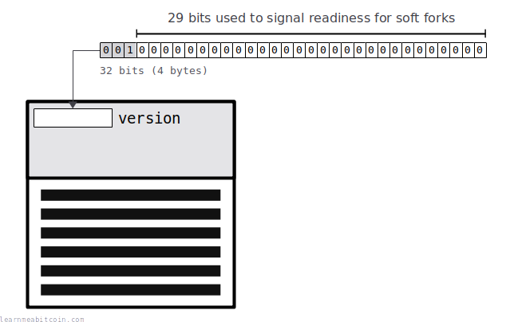](https://static.learnmeabitcoin.com/diagrams/png/block-version.png)

The *version* field is used to **signal for upgrades** to Bitcoin.

It was originally just a simple integer that marked an update to block structure after a [soft fork](/docs/technical/blockchain/soft-fork.md), but now it's used by miners as a way to vote for upgrades to the software.

#### BIP 9

Since 2015 and the introduction of [BIP 9](https://github.com/bitcoin/bips/blob/master/bip-0009.mediawiki) the 4-byte version field is now interpreted as a [bit field](/docs/technical/general/bytes.md#bit-field), where each bit can be assigned to a new potential upgrade. Miners signal their readiness for upgrades by turning specific bits on, and upgrades can be locked in for activation once enough miners signal for the same upgrade over a specific period of time.

The default block version using a BIP 9 bit field is 0b00100000000000000000000000000000. In hex this is 0x20000000. This does not signal for any proposed upgrades.

The minimum valid block version is 0x00000004. This is due to the last sequential version number upgrade ([BIP 65](https://github.com/bitcoin/bips/blob/master/bip-0065.mediawiki)) making all blocks with a version below 4 invalid. However, due to most miners now following BIP 9 you'll, mostly see block versions of at least 0x20000000 (but this is not a requirement).

If you look at most blocks since 2016 they will appear to have unusually large "numbers" in their version field if you interpret them as simple integers (as some block explorers do). This is because the first 3 bits must be set to 0b001 when using BIP 9. But as I say, we don't use the version field for simple numbers anymore, so it isn't useful to convert the version to an integer.


### [Previous Block](/docs/technical/block/previous-block.md)

* Size: 32 bytes
* Type: plain bytes
* Format: natural byte order
* Example: `6fe28c0ab6f1b372c1a6a246ae63f74f931e8365e15a089c68d6190000000000`

[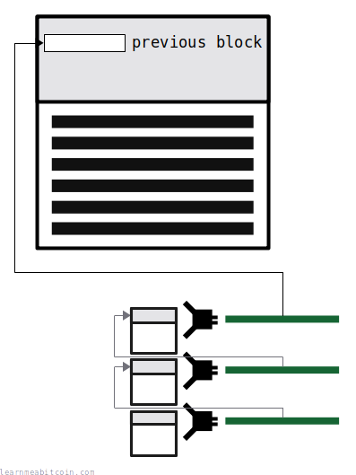](https://static.learnmeabitcoin.com/diagrams/png/block-previous-block.png)

The *previous block* field contains the **hash of an existing block**, which is what the current block builds upon.

All miners want to extend the [longest chain](/docs/technical/blockchain/longest-chain.md) of blocks. This is because the longest chain of blocks is what all nodes adopt as the "correct" blockchain. So by adding a block to the "correct" chain, the miner will be able to collect the [block reward](/docs/technical/mining/block-reward.md) if they're able to successfully mine their block.

If you built upon a block lower down in the chain, your block would not be part of the longest chain, so you would not be able to collect the block reward, and your efforts for mining the block would be wasted.

So in other words, when you create a new block, the *previous block* field contains the block hash of the block that's currently on the top of the blockchain (aka the "tip").

* The *previous block* field in the block header is what connects blocks together in a chain, hence the term "block chain".
* There are no blocks before the [genesis block](/explorer/block/000000000019d6689c085ae165831e934ff763ae46a2a6c172b3f1b60a8ce26f), so its *previous block* field is all zeros.

### [Merkle Root](/docs/technical/block/merkle-root.md)

* Size: 32 bytes
* Type: plain bytes
* Format: natural byte order
* Example: `982051fd1e4ba744bbbe680e1fee14677ba1a3c3540bf7b1cdb606e857233e0e`

[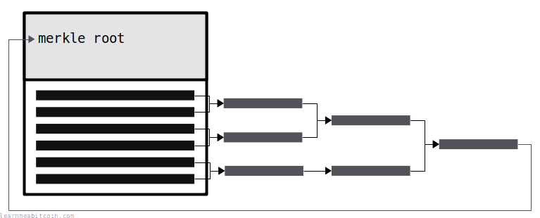](https://static.learnmeabitcoin.com/diagrams/png/block-merkle-root-basic.png)

 Merkle Root

Random Example

Block

TXID List

A list of TXIDs separated by *spaces*, *commas*, or *new lines*. Quotes and brackets are ignored.

The TXIDs should be input in [reverse byte order](/docs/technical/general/byte-order.md#reverse-byte-order) (as they appear on blockchain explorers), but they are converted to [natural byte order](/docs/technical/general/byte-order.md#natural-byte-order) before the merkle root is calculated.


TXIDs (0)
 

Merkle Root (Natural Byte Order)

The byte order as it comes out of the hash function

Merkle Root (Reverse Byte Order)

The byte order as shown on blockchain explorers


0 secs

The *merkle root* field contains a **fingerprint for all the transaction data** in the block.

You create a merkle root by hashing all of the transaction IDs together in pairs in a tree-like structure, until you end up with a single hash at the end. So the merkle root is ultimately a hash of the transaction data inside the block.

The merkle root prevents the block contents from being changed by someone else. All of the transaction data in the block gets "committed" to the block header via the merkle root, so if any transactions inside the block get modified at a later date, the merkle root will no longer match the contents of the block (and the block will be invalid).

So the merkle root is like putting a tamper-resistant seal on the block.

### [Time](/docs/technical/block/time.md)

* Size: 4 bytes
* Type: unsigned integer
* Format: little-endian
* Example: `61bc6649` (i.e. 0x4966bc61, or 1231469665)

[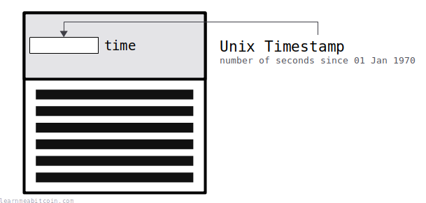](https://static.learnmeabitcoin.com/diagrams/png/block-time.png)

 Unix Time

Unix Time

0d


Now

Date


0 secs

The time field contains the **time the block was constructed** as a Unix timestamp.

This time does not have to be exact; it's just a rough indicator of when the block was constructed by the miner. However, the time in the block header must be within two hours either side of the median network time for nodes to accept the block as valid.

So it's possible that a block higher up in the chain could have an earlier *time* than a block lower down in the chain. It doesn't matter though because the time field is not critical to the order of blocks.

### [Bits](/docs/technical/block/bits.md)

* Size: 4 bytes
* Format: little-endian
* Example: `ffff001d` (i.e. `1d00ffff` in little-endian)

[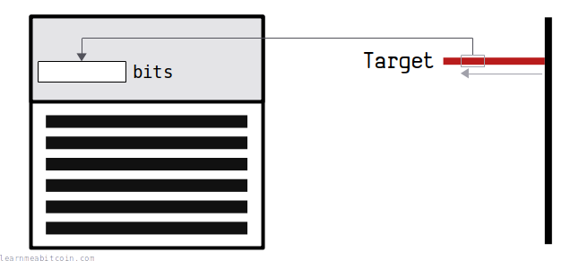](https://static.learnmeabitcoin.com/diagrams/png/block-bits.png)

 Target Bits

Current

Random Example

Height:

Target

0x

`0 bytes`

Bits`0 bytes`


0 secs

The bits field is a **compact representation of the [target](/docs/technical/mining/target.md)** at the time the block was mined.

Every block needs to get below a specific target value for it to be considered valid (i.e. for it to get added on to the blockchain). But instead of storing the full 32-byte target value in the block header, we use the compact 4-byte "bits" encoding instead.

The basic format of the bits field is:

* The last 3 bytes contain the rough *precision* of the full target.
* The first byte indicates *"how many bytes to the left"* those 3 bytes sit in a full 32-byte field.

I don't know why this field is named "bits". It's a confusing name seeing as we already have the terms *[bits](/docs/technical/general/bytes.md#bit)* for measurements of data (i.e. 8 bits in a byte), but that's what it's called anyway.

This compact representation of the target is the *actual value* the block hash needs to get below when mining. The full target itself does have more precision when it's initially calculated, but this compact *bits* field with lower precision is the actual threshold the block hash needs to get below.

### [Nonce](/docs/technical/block/nonce.md)

* Size: 4 bytes
* Type: unsigned integer
* Format: little-endian
* Example: `01e36299`

[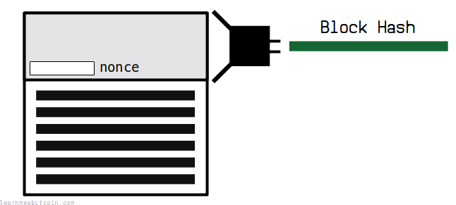](https://static.learnmeabitcoin.com/diagrams/png/block-nonce.png)

This field is short for "number used once". It's basically a **spare field** in the block header that you can increment to get different [hash](/docs/technical/cryptography/hash-function.md) results for the block header.

I like to call it the "[mining](/docs/technical/mining.md) field".

So when you're trying to mine a block, instead of having to reconstruct the entire block for every attempt, you can just increment the nonce field and get a completely different hash result for the same block of transactions.

Every block you see in the blockchain shows the "magic" nonce value that just so happened to produce a block hash that was below the [target](/docs/technical/mining/target.md) at the time. There is no skill in finding the right nonce; it's just about trying different nonces as fast as you can and hoping to get lucky.

* **Not every block will have a "magic" nonce value.** In fact, most blocks' headers will not produce a low enough hash even if you completely exhaust the nonce field.
* The nonce field is only 4 bytes in size, so the exact same block can have up to 4294967295 (`0xffffffff`) attempts at being hashed before the nonce field is exhausted. After that, the block needs to be reconstructed (or at least the time field updated) to create a different block header to work on.

## Transactions

[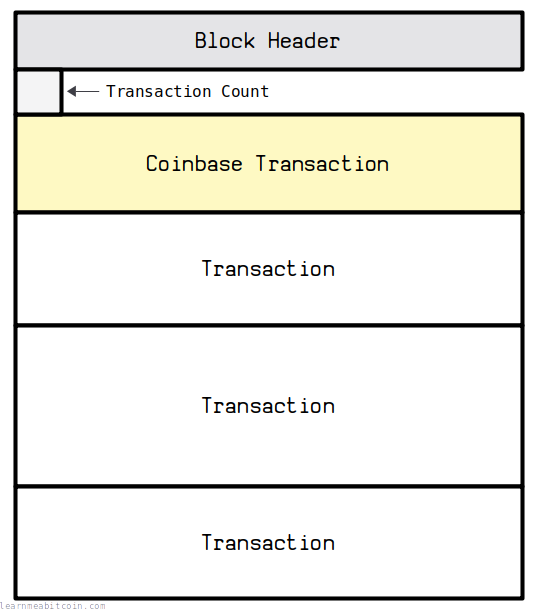](https://static.learnmeabitcoin.com/diagrams/png/block-transactions.png)

After the block header we have the actual transaction data. This is just a series of transactions one after the other.

### Transaction Count

* Size: variable
* Type: [compact size](/docs/technical/general/compact-size.md)
* Example: `01`

 Compact Size

Integer

0d

Compact Size

`0 bytes`


Prefix

The first byte indicates which bytes encode the integer:

 `<=FC`
– This byte (0 - 252)
 `FD`
– The next two bytes (253 - 65535)
 `FE`
– The next four bytes (65536 - 4294967295)
 `FF`
– The next eight bytes (4294967296 - 18446744073709551615)

Note: Bytes encoding the integer are in little endian.


0 secs

The first piece of data after the block header is actually a transaction count indicating the **number of upcoming transactions in the block**. It's a compact size field, so it's usually either 1 or 3 bytes in size (depending on how many transactions are in the block).

### [Coinbase Transaction](/docs/technical/mining/coinbase-transaction.md)

[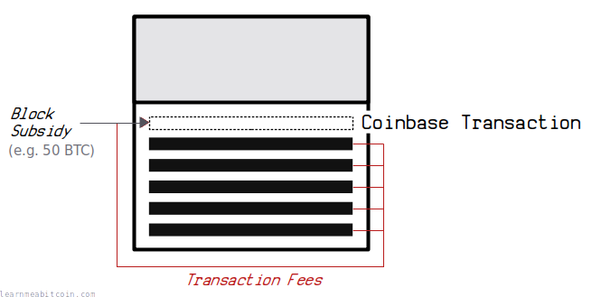](https://static.learnmeabitcoin.com/diagrams/png/block-coinbase-transaction.png)

> The first transaction in the block is a special one that creates a new coin owned by the creator of the block.

Satoshi Nakamoto, [Bitcoin v0.1 (main.h)](https://github.com/Maguines/Bitcoin-v0.1/tree/master/bitcoin0.1/src/main.h#L794)

The *first* transaction in every block is the coinbase transaction. This is a **special transaction that miners place inside the block to collect the [block reward](/docs/technical/mining/block-reward.md)** (*block subsidy* + *[transaction fees](/docs/technical/transaction/fee.md)*).

The main technical difference between a coinbase transaction and a "regular" transaction is that a coinbase transaction doesn't "spend" any existing bitcoins. Instead, the [input](/docs/technical/transaction/input.md) to a coinbase transaction is blank (all zeros), and the amount of the [output](/docs/technical/transaction/output.md) is the value of the block reward.

A coinbase transaction is a requirement for every block. Without one the block would be invalid.

Miners often put custom signatures and messages in the [scriptsig](/docs/technical/transaction/input/scriptsig.md) of their coinbase transaction. This is because a coinbase transaction doesn't need to *unlock* any existing coins, so miners are free to put any kind of data they like into the scriptsig.

### Regular [Transactions](/docs/technical/transaction.md)

[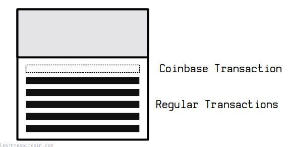](https://static.learnmeabitcoin.com/diagrams/png/block-regular-transactions.png)

Following the coinbase transaction we have all the "regular" transactions, concatenated one after the other.

These transactions are selected from the [memory pool](/docs/technical/mining/memory-pool.md) when the miner constructs the block. A miner can include as many or as few transactions in their block as they like (up to the [block size limit](#weight)). However, miners are incentivized to include as many transactions as they can so that they can maximize the amount they can earn if they are successful in mining the block.

Miners are responsible for checking that each transaction in their block must be valid, otherwise the entire block will be considered invalid and cannot be added to the blockchain.

Parent transactions must always come before child transactions in a block. So if a transaction spends an output, that output must have been created by a transaction in a previous block or earlier on in the same block.

## [Block Hash](/docs/technical/block/hash.md)

[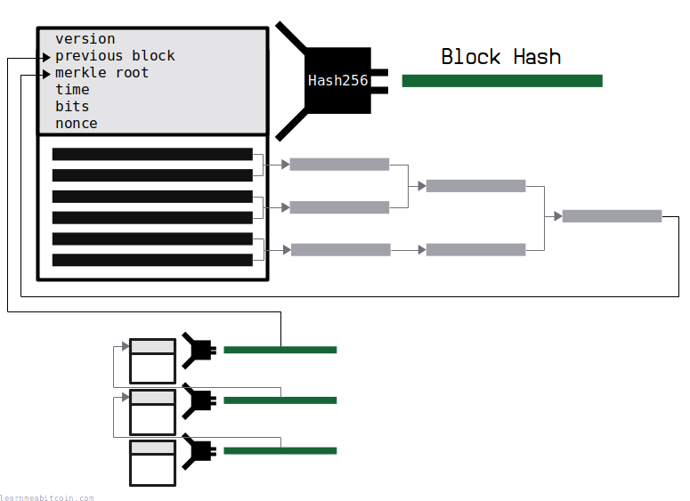](https://static.learnmeabitcoin.com/diagrams/png/block-hash.png)

 Block Hash

Random Example

Block Header

`0 bytes`

Block Hash (Natural Byte Order)

Used internally inside raw block headers

`0 bytes`

Block Hash (Reverse Byte Order)

Used externally when searching for blocks on block explorers

`0 bytes`


0 secs

A block hash is created by double-SHA256'ing the block header. The block hash is a **unique identifier** for a block, which has two benefits:

* The block hash can be used to reference a previous block to build on, which is what *chains* the blocks together.
* The block hash can be used to look up a block in a block explorer.

The block hash is in [reverse byte order](/docs/technical/general/byte-order.md#reverse-byte-order) when searching for a block in a block explorer.

And as mentioned, during the process of [mining](/docs/technical/mining.md) the block hash must get below the current [target](/docs/technical/mining/target.md) for the block to get added on to the blockchain. That's why all block hashes start with a bunch of zeros.

## Weight

What is the maximum size of a block?

[](https://static.learnmeabitcoin.com/diagrams/png/block-weight.png)

A block has a maximum capacity of **4,000,000 weight units**.

* The block header is a fixed size of 320 weight units (80 bytes).
* Each transaction then has its own weight, typically around 550-850 [weight units](/docs/technical/transaction/size.md#weight) each (but this can vary significantly).

### [Transaction Weight](/docs/technical/transaction/size.md#weight)

The average transaction is typically around 550-850 weight units, but this can vary significantly depending on the number of inputs and outputs in the transaction.

For example:

```
226ae926a0c7b608762ddd1091f6f061330fd70328d58184d97f77d4e7805c9a = 1 input,  2 outputs = 565 weight units
f82ec8b10a384577d0031eab359b80cfdc07ab2879a8b0d6492cd707bd7ab43a = 2 inputs, 2 outputs = 836 weight units
```

So in general, the more inputs and outputs in a transaction, the more space it takes up in a block.

## Location

Where can you find raw block data?

If you're running a Bitcoin Core node, the raw block data for the blockchain is stored in the [blkXXXXX.dat](/docs/technical/block/blkdat.md) files in the `blocks/` directory:

```
Linux:   ~/.bitcoin/blocks/
Mac:     ~/Library/Application Support/Bitcoin/blocks/
Windows: %APPDATA%\Bitcoin\blocks\
```

The blocks are stored in raw bytes, so you will need to use something like the `hexdump` command to be able to print them. This is the genesis block for example:

```
$ hexdump -C -s 8 -n 285 blk00000.dat

00000008  01 00 00 00 00 00 00 00  00 00 00 00 00 00 00 00  |................|
00000018  00 00 00 00 00 00 00 00  00 00 00 00 00 00 00 00  |................|
00000028  00 00 00 00 3b a3 ed fd  7a 7b 12 b2 7a c7 2c 3e  |....;...z{..z.,>|
00000038  67 76 8f 61 7f c8 1b c3  88 8a 51 32 3a 9f b8 aa  |gv.a......Q2:...|
00000048  4b 1e 5e 4a 29 ab 5f 49  ff ff 00 1d 1d ac 2b 7c  |K.^J}._I......+||
00000058  01 01 00 00 00 01 00 00  00 00 00 00 00 00 00 00  |................|
00000068  00 00 00 00 00 00 00 00  00 00 00 00 00 00 00 00  |................|
00000078  00 00 00 00 00 00 ff ff  ff ff 4d 04 ff ff 00 1d  |..........M.....|
00000088  01 04 45 54 68 65 20 54  69 6d 65 73 20 30 33 2f  |..EThe Times 03/|
00000098  4a 61 6e 2f 32 30 30 39  20 43 68 61 6e 63 65 6c  |Jan/2009 Chancel|
000000a8  6c 6f 72 20 6f 6e 20 62  72 69 6e 6b 20 6f 66 20  |lor on brink of |
000000b8  73 65 63 6f 6e 64 20 62  61 69 6c 6f 75 74 20 66  |second bailout f|
000000c8  6f 72 20 62 61 6e 6b 73  ff ff ff ff 01 00 f2 05  |or banks........|
000000d8  2a 01 00 00 00 43 41 04  67 8a fd b0 fe 55 48 27  |*....CA.g....UH'|
000000e8  19 67 f1 a6 71 30 b7 10  5c d6 a8 28 e0 39 09 a6  |.g..q0..\..(.9..|
000000f8  79 62 e0 ea 1f 61 de b6  49 f6 bc 3f 4c ef 38 c4  |yb...a..I..?L.8.|
00000108  f3 55 04 e5 1e c1 12 de  5c 38 4d f7 ba 0b 8d 57  |.U......\8M....W|
00000118  8a 4c 70 2b 6b f1 1d 5f  ac 00 00 00 00           |.Lp+k.._.....|)
0000125
```

More simply, you can request the same raw blocks from your local Bitcoin Core node using `bitcoin-cli` commands:

```
$ bitcoin-cli getblock 000000000019d6689c085ae165831e934ff763ae46a2a6c172b3f1b60a8ce26f false

0100000000000000000000000000000000000000000000000000000000000000000000003ba3edfd7a7b12b27ac72c3e67768f617fc81bc3888a51323a9fb8aa4b1e5e4a29ab5f49ffff001d1dac2b7c0101000000010000000000000000000000000000000000000000000000000000000000000000ffffffff4d04ffff001d0104455468652054696d65732030332f4a616e2f32303039204368616e63656c6c6f72206f6e206272696e6b206f66207365636f6e64206261696c6f757420666f722062616e6b73ffffffff0100f2052a01000000434104678afdb0fe5548271967f1a67130b7105cd6a828e03909a67962e0ea1f61deb649f6bc3f4cef38c4f35504e51ec112de5c384df7ba0b8d578a4c702b6bf11d5fac00000000
```

Alternatively, you can receive the latest blocks that have been mined by [connecting to a node on the network](/docs/technical/networking.md).