# 区块总览 (Block)


[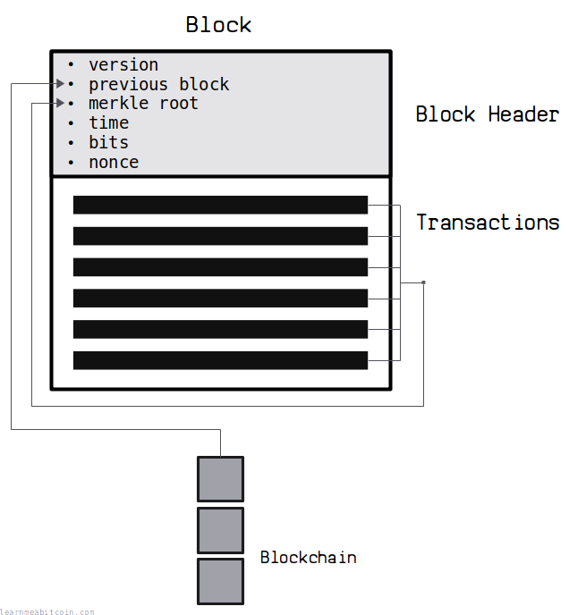](../images/diagrams_png_block.png)

区块是存放[交易](transaction.md)的容器。

在每个区块的顶部是一个**区块头 (block header)**，它对区块中的所有数据进行了摘要。这包含了区块中所有交易的数字指纹（[默克尔根 (merkle root)](block/merkle-root.md)），以及对前一个区块的引用。

矿工不断地对这个区块头进行[哈希 (hash)](cryptography/hash-function.md)计算，试图得出一个低于当前[目标值 (target)](mining/target.md)的结果。如果你能得出一个低于该目标值的[区块哈希 (block hash)](block/hash.md)，这个区块就可以被添加到[区块链 (blockchain)](blockchain.md)上。这个过程被称为[挖矿 (mining)](mining.md)。

新挖出的区块会在比特币[网络 (network)](networking.md)的节点之间传送，并作为区块链的一部分被永久存储在磁盘上。

> 节点将新的交易收集到一个区块中，将它们哈希成一个哈希树，并扫描随机数（nonce）值以使区块的哈希满足工作量证明要求。当它们解决了工作量证明时，它们会将区块广播给所有人，该区块就会被添加到区块链中。

中本聪, [Bitcoin v0.1 (main.h)](https://github.com/Maguines/Bitcoin-v0.1/tree/master/bitcoin0.1/src/main.h#L794)

## 示例 (Example)

以下是[区块 1](/explorer/block/00000000839a8e6886ab5951d76f411475428afc90947ee320161bbf18eb6048)（创世区块之后的第一个区块）的**原始区块数据**。

我将其拆分并高亮显示了各个字段：

```text
01000000 6fe28c0ab6f1b372c1a6a246ae63f74f931e8365e15a089c68d6190000000000 982051fd1e4ba744bbbe680e1fee14677ba1a3c3540bf7b1cdb606e857233e0e 61bc6649 ffff001d 01e36299 01 01000000010000000000000000000000000000000000000000000000000000000000000000ffffffff0704ffff001d0104ffffffff0100f2052a0100000043410496b538e853519c726a2c91e61ec11600ae1390813a627c66fb8be7947be63c52da7589379515d4e0a604f8141781e62294721166bf621e73a82cbf2342c858eeac00000000
```

这个区块只包含一笔交易，但每个区块的基本结构都是相同的。

## 结构 (Structure)

区块 (Block)

| 字段 (Field) | 大小 (Size) | 格式 (Format) | 描述 (Description) |
| --- | --- | --- | --- |
| [版本 (Version)](#version) | 4 bytes | [小端序 (little-endian)](general/little-endian.md) | 该区块的版本号。 |
| [前一区块 (Previous Block)](#previous-block) | 32 bytes | [自然字节序 (natural byte order)](general/byte-order.md#natural-byte-order) | 该区块所建立在其之上的前一个区块的区块哈希。 |
| [默克尔根 (Merkle Root)](#merkle-root) | 32 bytes | natural byte order | 区块中包含的所有交易的数字指纹。 |
| [时间 (Time)](#time) | 4 bytes | little-endian | 当前时间的 Unix 时间戳。 |
| [位 (Bits)](#bits) | 4 bytes | little-endian | 当前目标值的紧凑表示。 |
| [随机数 (Nonce)](#nonce) | 4 bytes | little-endian |  |
| 交易数量 (Transaction Count) | compact | [紧凑尺寸 (compact size)](general/compact-size.md) | 区块中包含的随后的交易数量。 |
| 交易 (Transactions) | variable | transaction data | 区块中包含的所有原始交易连接在一起。 |

**注：** 灰色高亮的行是区块头的一部分。

**注：** 自然字节序实际上与小端序相同。

## 区块头 (Block Header)

每个原始区块都以一个区块**头 (header)**开始。

区块头包含了**区块内容的摘要**，用于创建[区块哈希](block/hash.md)。

###  区块头 (Block Header)

| 字段 (Field) | 值 (Value) |
| --- | --- |
| Block | |
| Block Header (Hex) | `0 bytes` |
| Block Header (Fields)<br>Version | 0 |
| Previous Block | |
| Merkle Root | |
| Time | 0d |
| Bits | |
| Nonce | 0d<br>+1 |
| Block Hash | 这是十六进制区块头的 HASH256。它也采用反向字节序，因为这就是在区块浏览器中显示区块哈希的方式。 |

### [版本 (Version)](block/version.md)

* 大小：4 字节
* 类型：有符号整数 / 位字段
* 格式：小端序
* 示例：`01000000` (即小端序中的 0x00000001)

[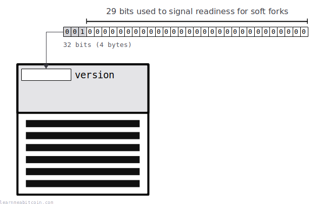](../images/diagrams_png_block-version.png)

*版本 (version)* 字段用于**发出比特币升级信号**。

最初它只是一个简单的整数，用于标记在[软分叉 (soft fork)](blockchain/soft-fork.md)之后对区块结构的更新，但现在它被矿工用作投票支持软件升级的方式。

#### BIP 9

自 2015 年引入 [BIP 9](https://github.com/bitcoin/bips/blob/master/bip-0009.mediawiki) 以来，4 字节的版本字段现在被解释为一个[位字段 (bit field)](general/bytes.md#bit-field)，其中每个位都可以被分配给一个新的潜在升级。矿工通过开启特定的位来发出他们已准备好升级的信号，当有足够多的矿工在特定时间段内发出相同升级的信号时，升级就可以被锁定并激活。

使用 BIP 9 位字段的默认区块版本是 0b00100000000000000000000000000000。在十六进制中，这即为 0x20000000。这表示没有对任何提议的升级发出信号。

最小的有效区块版本是 0x00000004。这是因为最后一次顺序版本号升级 ([BIP 65](https://github.com/bitcoin/bips/blob/master/bip-0065.mediawiki)) 使得所有版本低于 4 的区块都变为无效。然而，由于现在大多数矿工都遵循 BIP 9，你通常会看到至少为 0x20000000 的区块版本（但这并不是一项硬性要求）。

如果你查看 2016 年以来的大多数区块，如果你将它们作为简单的整数来解释（正如一些区块浏览器所做的那样），你会发现它们的版本字段中似乎有着不同寻常的大“数字”。这是因为当使用 BIP 9 时，前 3 位必须设置为 0b001。但正如我所说，我们不再将版本字段用于简单的数字，因此将版本转换为整数并没有意义。


### [前一区块 (Previous Block)](block/previous-block.md)

* 大小：32 字节
* 类型：普通字节
* 格式：自然字节序
* 示例：`6fe28c0ab6f1b372c1a6a246ae63f74f931e8365e15a089c68d6190000000000`

[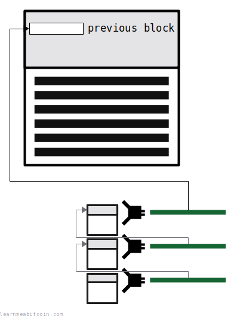](../images/diagrams_png_block-previous-block.png)

*前一区块 (previous block)* 字段包含了**一个现有区块的哈希**，当前区块正是建立在其基础之上。

所有矿工都希望延长[最长区块链 (longest chain)](blockchain/longest-chain.md)。这是因为最长的区块链正是所有节点所采用的“正确”区块链。因此，通过将一个区块添加到“正确”的链上，如果矿工成功挖出他们的区块，他们就能够获得[区块奖励 (block reward)](mining/block-reward.md)。

如果你在一个位于链中较低位置的区块上进行构建，你的区块将不会成为最长链的一部分，那么你将无法获得区块奖励，你在挖出这个区块上所付出的努力也将白费。

换句话说，当你创建一个新区块时，*前一区块*字段包含了当前位于区块链顶部（即“链尖”）的区块的区块哈希。

* 区块头中的*前一区块*字段将各个区块连接成一条链，这也是“区块链 (block chain)”一词的由来。
* 在[创世区块 (genesis block)](/explorer/block/000000000019d6689c085ae165831e934ff763ae46a2a6c172b3f1b60a8ce26f)之前没有区块，因此其*前一区块*字段全为零。

### [默克尔根 (Merkle Root)](block/merkle-root.md)

* 大小：32 字节
* 类型：普通字节
* 格式：自然字节序
* 示例：`982051fd1e4ba744bbbe680e1fee14677ba1a3c3540bf7b1cdb606e857233e0e`

[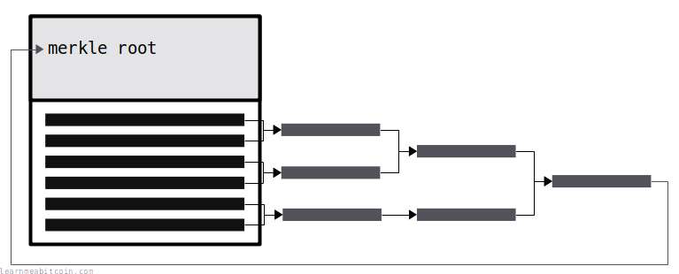](../images/diagrams_png_block-merkle-root-basic.png)

###  默克尔根 (Merkle Root)

| 字段 (Field) | 值 (Value) |
| --- | --- |
| Block | |
| TXID List | 以*空格*、*逗号*或*换行符*分隔的 TXID（交易 ID）列表。引号和括号将被忽略。<br><br>TXID 应该以[反向字节序](general/byte-order.md#reverse-byte-order)（正如它们在区块链浏览器上显示的那样）输入，但在计算默克尔根之前，它们会被转换为[自然字节序](general/byte-order.md#natural-byte-order)。 |
| TXIDs (0) | |
| Merkle Root (Natural Byte Order) | 从哈希函数中输出的字节序 |
| Merkle Root (Reverse Byte Order) | 在区块链浏览器上显示的字节序 |

*默克尔根 (merkle root)* 字段包含了区块中**所有交易数据的数字指纹**。

你可以通过在树状结构中将所有交易 ID 成对哈希在一起，直到最后剩下一个单一的哈希值，从而创建一个默克尔根。所以默克尔根最终就是区块内交易数据的哈希。

默克尔根可以防止区块内容被他人篡改。区块中的所有交易数据都通过默克尔根“承诺”到了区块头中，因此如果区块内的任何交易在日后被修改，默克尔根将不再匹配区块的内容（该区块将失效）。

所以默克尔根就像是在区块上贴了一张防伪标签。

### [时间 (Time)](block/time.md)

* 大小：4 字节
* 类型：无符号整数
* 格式：小端序
* 示例：`61bc6649` (即 0x4966bc61, 或 1231469665)

[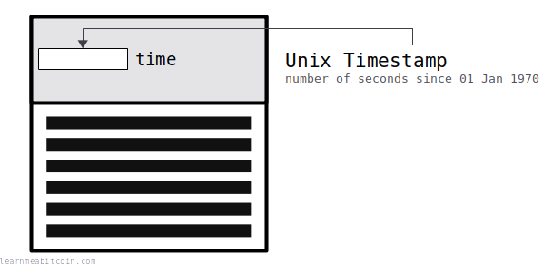](../images/diagrams_png_block-time.png)

###  Unix 时间 (Unix Time)

| 字段 (Field) | 值 (Value) |
| --- | --- |
| Unix Time | 0d |
| Date | |

时间字段包含了**区块被构建的时间**，以 Unix 时间戳的形式表示。

这个时间不必非常精确；它只是由矿工构建区块时间的粗略指标。然而，为了使节点接受该区块为有效，区块头中的时间必须在网络中位时间的前后两个小时以内。

因此，链中较高位置的区块有可能拥有比链中较低位置的区块更早的*时间*。但这并不重要，因为时间字段对于区块的顺序并不关键。

### [位 (Bits)](block/bits.md)

* 大小：4 字节
* 格式：小端序
* 示例：`ffff001d` (即小端序中的 `1d00ffff`)

[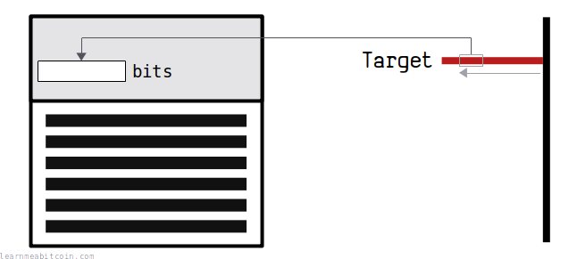](../images/diagrams_png_block-bits.png)

###  目标位 (Target Bits)

| 字段 (Field) | 值 (Value) |
| --- | --- |
| Height | |
| Target | 0x<br>`0 bytes` |
| Bits | `0 bytes` |

位字段是在区块被挖出时**[目标值 (target)](mining/target.md)的紧凑表示**。

每个区块都需要低于特定的目标值才能被视为有效（即才能被添加到区块链上）。但我们没有将完整的 32 字节目标值存储在区块头中，而是使用了紧凑的 4 字节“位”编码。

位字段的基本格式是：

* 最后 3 个字节包含完整目标值的粗略*精度*。
* 第 1 个字节表示那 3 个字节在完整的 32 字节字段中位于“靠左多少字节”的位置。

我不知道为什么这个字段被命名为“位（bits）”。考虑到我们已经有了用于测量数据的术语 *[位 (bits)](general/bytes.md#bit)*（即一个字节有 8 位），这是一个容易令人混淆的名字，但它就是这样称呼的。

目标值的这种紧凑表示是区块哈希在挖矿时需要低于的*实际值*。完整的目标值在最初计算时的确具有更高的精度，但这种精度较低的紧凑*位*字段才是区块哈希需要低于的实际阈值。

### [随机数 (Nonce)](block/nonce.md)

* 大小：4 字节
* 类型：无符号整数
* 格式：小端序
* 示例：`01e36299`

[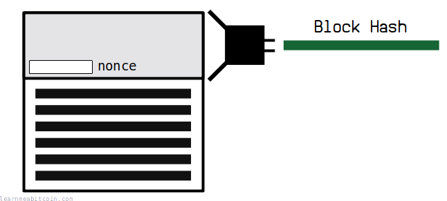](../images/diagrams_png_block-nonce.png)

这个字段是 "number used once"（只用一次的数字）的缩写。它基本上是区块头中的一个**备用字段**，你可以增加它以获得关于区块头的不同[哈希](cryptography/hash-function.md)结果。

我喜欢称它为“[挖矿 (mining)](mining.md)字段”。

因此，当你试图挖出一个区块时，你无需在每次尝试时都重建整个区块，而只需增加随机数字段的值，就能为同一区块的交易得到一个完全不同的哈希结果。

你在区块链中看到的每一个区块，都显示了那个“有魔力”的随机数值，它恰好能产生一个低于当时[目标值](mining/target.md)的区块哈希。寻找正确的随机数并没有任何技巧可言；它只是关于尽可能快地尝试不同的随机数，并希望自己能交好运。

* **并非每个区块都会有一个“有魔力”的随机数值。** 事实上，即使你完全穷举随机数字段，大多数区块的区块头也无法产生足够低的哈希。
* 随机数字段的大小只有 4 个字节，因此完全相同的区块在随机数字段被穷举之前，最多可以进行 4294967295 (`0xffffffff`) 次哈希计算尝试。之后，需要重新构建区块（或者至少更新时间字段）以创建一个不同的区块头来进行工作。

## 交易 (Transactions)

[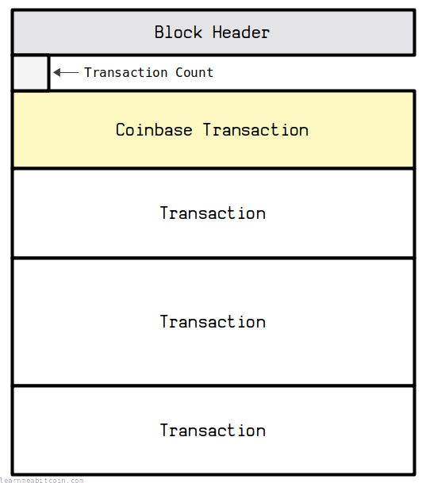](../images/diagrams_png_block-transactions.png)

在区块头之后是实际的交易数据。这只是一系列接连相连的交易。

### 交易数量 (Transaction Count)

* 大小：可变
* 类型：[紧凑尺寸 (compact size)](general/compact-size.md)
* 示例：`01`

###  紧凑尺寸 (Compact Size)

| 字段 (Field) | 值 (Value) |
| --- | --- |
| Integer | 0d |
| Compact Size | `0 bytes` |
| Prefix | 第一个字节表示哪些字节对整数进行了编码：<br><br>- `<=FC` – 该字节 (0 - 252)<br>- `FD` – 接下来的 2 个字节 (253 - 65535)<br>- `FE` – 接下来的 4 个字节 (65536 - 4294967295)<br>- `FF` – 接下来的 8 个字节 (4294967296 - 18446744073709551615)<br><br>注意：对整数进行编码的字节采用小端序。 |

区块头之后的第一条数据实际上是一个交易数量，指示了**区块中接下来的交易数量**。它是一个紧凑尺寸字段，因此其大小通常为 1 字节或 3 字节（取决于区块中有多少笔交易）。

### [币基交易 (Coinbase Transaction)](mining/coinbase-transaction.md)

[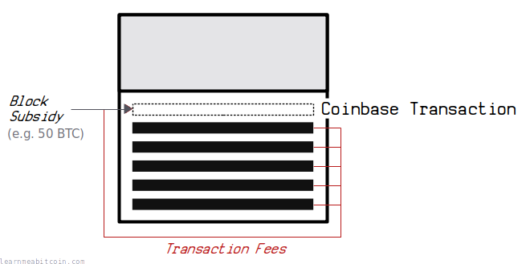](../images/diagrams_png_block-coinbase-transaction.png)

> 区块中的第一笔交易是一笔特殊的交易，它创造了一枚由该区块的创建者所拥有的新硬币。

中本聪, [Bitcoin v0.1 (main.h)](https://github.com/Maguines/Bitcoin-v0.1/tree/master/bitcoin0.1/src/main.h#L794)

每个区块中的*第一笔*交易都是币基交易 (coinbase transaction)。这是一笔**矿工放置在区块内的特殊交易，用于收集[区块奖励](mining/block-reward.md)**（*区块补贴 (block subsidy)* + *[交易费 (transaction fees)](transaction/fee.md)*）。

币基交易与“普通”交易的主要技术区别在于，币基交易不“花费”任何现有的比特币。相反，币基交易的[输入 (input)](transaction/input.md)是空白的（全为零），而[输出 (output)](transaction/output.md)的金额则是区块奖励的价值。

币基交易是每个区块的必要条件。没有它，区块就会失效。

矿工经常在他们的币基交易的[解锁脚本 (scriptsig)](transaction/input/scriptsig.md)中放入自定义签名和消息。这是因为币基交易不需要*解锁*任何现有的硬币，所以矿工可以自由地将任何类型的数据放入解锁脚本中。

### 普通[交易 (Transactions)](transaction.md)

[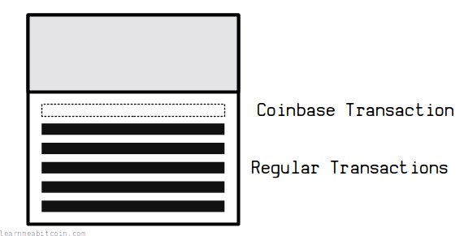](../images/diagrams_png_block-regular-transactions.png)

在币基交易之后，我们有了所有的“普通”交易，它们一个个连接在一起。

这些交易是矿工在构建区块时从[内存池 (memory pool)](mining/memory-pool.md)中挑选出来的。矿工可以在其区块中包含他们想要的任意多或任意少的交易（最高可达[区块大小限制](#weight)）。然而，矿工会受到激励去尽可能多地包含交易，以便在成功挖出区块时能够最大化他们的收益。

矿工有责任检查他们区块中的每笔交易是否必须有效，否则整个区块将被视为无效并且无法添加到区块链中。

在一个区块中，父交易必须始终先于子交易。所以如果一笔交易花费了一个输出，那个输出必定是由前一个区块中的交易或者在同一个区块中更早位置的交易创建的。

## [区块哈希 (Block Hash)](block/hash.md)

[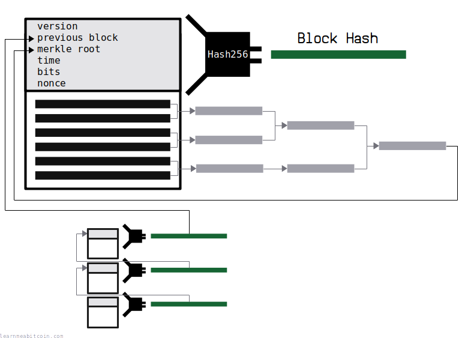](../images/diagrams_png_block-hash.png)

###  区块哈希 (Block Hash)

| 字段 (Field) | 值 (Value) |
| --- | --- |
| Block Header | `0 bytes` |
| Block Hash (Natural Byte Order) | 在原始区块头内部使用<br>`0 bytes` |
| Block Hash (Reverse Byte Order) | 在区块浏览器上搜索区块时在外部使用<br>`0 bytes` |

区块哈希是通过对区块头进行双 SHA256 运算创建的。区块哈希是区块的**唯一标识符**，它具有两个好处：

* 区块哈希可以被用来引用前一个被构建的基础区块，这就是将各个区块*链接*在一起的东西。
* 区块哈希可以用来在区块浏览器中查找区块。

当在区块浏览器中搜索区块时，区块哈希采用[反向字节序](general/byte-order.md#reverse-byte-order)。

而且如前所述，在[挖矿](mining.md)过程中，区块哈希必须低于当前的[目标值](mining/target.md)，区块才能被添加到区块链上。这就是为什么所有的区块哈希都以一堆零开头。

## 权重 (Weight)

一个区块的最大大小是多少？

[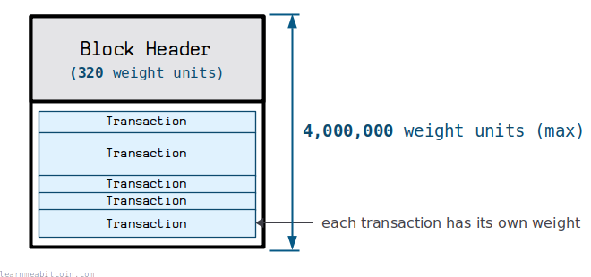](../images/diagrams_png_block-weight.png)

一个区块的最大容量为 **4,000,000 个权重单位 (weight units)**。

* 区块头是固定的，大小为 320 个权重单位（80 字节）。
* 然后每笔交易都有自己的权重，每笔交易通常约为 550-850 个[权重单位](transaction/size.md#weight)（但这可能会有很大差异）。

### [交易权重 (Transaction Weight)](transaction/size.md#weight)

普通的交易通常约为 550-850 个权重单位，但这可能会因交易中输入和输出的数量而有很大差异。

例如：

```text
226ae926a0c7b608762ddd1091f6f061330fd70328d58184d97f77d4e7805c9a = 1 input,  2 outputs = 565 weight units
f82ec8b10a384577d0031eab359b80cfdc07ab2879a8b0d6492cd707bd7ab43a = 2 inputs, 2 outputs = 836 weight units
```

因此总体而言，交易中的输入和输出越多，它在区块中占据的空间就越大。

## 位置 (Location)

你在哪里可以找到原始的区块数据？

如果你正在运行一个 Bitcoin Core 节点，区块链的原始区块数据被存储在 `blocks/` 目录下的 [blkXXXXX.dat](block/blkdat.md) 文件中：

```text
Linux:   ~/.bitcoin/blocks/
Mac:     ~/Library/Application Support/Bitcoin/blocks/
Windows: %APPDATA%\Bitcoin\blocks\
```

这些区块以原始字节的形式存储，因此你需要使用像 `hexdump` 这样的命令才能打印它们。比如下面就是创世区块：

```bash
$ hexdump -C -s 8 -n 285 blk00000.dat

00000008  01 00 00 00 00 00 00 00  00 00 00 00 00 00 00 00  |................|
00000018  00 00 00 00 00 00 00 00  00 00 00 00 00 00 00 00  |................|
00000028  00 00 00 00 3b a3 ed fd  7a 7b 12 b2 7a c7 2c 3e  |....;...z{..z.,>|
00000038  67 76 8f 61 7f c8 1b c3  88 8a 51 32 3a 9f b8 aa  |gv.a......Q2:...|
00000048  4b 1e 5e 4a 29 ab 5f 49  ff ff 00 1d 1d ac 2b 7c  |K.^J}._I......+||
00000058  01 01 00 00 00 01 00 00  00 00 00 00 00 00 00 00  |................|
00000068  00 00 00 00 00 00 00 00  00 00 00 00 00 00 00 00  |................|
00000078  00 00 00 00 00 00 ff ff  ff ff 4d 04 ff ff 00 1d  |..........M.....|
00000088  01 04 45 54 68 65 20 54  69 6d 65 73 20 30 33 2f  |..EThe Times 03/|
00000098  4a 61 6e 2f 32 30 30 39  20 43 68 61 6e 63 65 6c  |Jan/2009 Chancel|
000000a8  6c 6f 72 20 6f 6e 20 62  72 69 6e 6b 20 6f 66 20  |lor on brink of |
000000b8  73 65 63 6f 6e 64 20 62  61 69 6c 6f 75 74 20 66  |second bailout f|
000000c8  6f 72 20 62 61 6e 6b 73  ff ff ff ff 01 00 f2 05  |or banks........|
000000d8  2a 01 00 00 00 43 41 04  67 8a fd b0 fe 55 48 27  |*....CA.g....UH'|
000000e8  19 67 f1 a6 71 30 b7 10  5c d6 a8 28 e0 39 09 a6  |.g..q0..\..(.9..|
000000f8  79 62 e0 ea 1f 61 de b6  49 f6 bc 3f 4c ef 38 c4  |yb...a..I..?L.8.|
00000108  f3 55 04 e5 1e c1 12 de  5c 38 4d f7 ba 0b 8d 57  |.U......\8M....W|
00000118  8a 4c 70 2b 6b f1 1d 5f  ac 00 00 00 00           |.Lp+k.._.....|
0000125
```

更简单地说，你可以使用 `bitcoin-cli` 命令向本地的 Bitcoin Core 节点请求相同的原始区块：

```bash
$ bitcoin-cli getblock 000000000019d6689c085ae165831e934ff763ae46a2a6c172b3f1b60a8ce26f false

0100000000000000000000000000000000000000000000000000000000000000000000003ba3edfd7a7b12b27ac72c3e67768f617fc81bc3888a51323a9fb8aa4b1e5e4a29ab5f49ffff001d1dac2b7c0101000000010000000000000000000000000000000000000000000000000000000000000000ffffffff4d04ffff001d0104455468652054696d65732030332f4a616e2f32303039204368616e63656c6c6f72206f6e206272696e6b206f66207365636f6e64206261696c6f757420666f722062616e6b73ffffffff0100f2052a01000000434104678afdb0fe5548271967f1a67130b7105cd6a828e03909a67962e0ea1f61deb649f6bc3f4cef38c4f35504e51ec112de5c384df7ba0b8d578a4c702b6bf11d5fac00000000
```

或者，你可以通过[连接到网络上的节点](networking.md)来接收已经挖出的最新区块。
