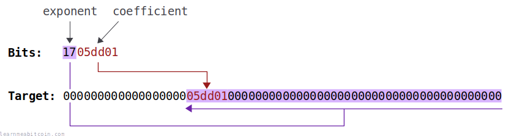

[](https://static.learnmeabitcoin.com/diagrams/png/block-bits.png)

The bits field contains a compact representation of the [target](/docs/technical/mining/target.md).

It indicates what the [block hash](/docs/technical/block/hash.md) has to be below for the block to be [mined](/docs/technical/mining.md), and it has to represent the correct target value for the height of the block in the [blockchain](/docs/technical/blockchain.md).

Current

Random Example

Height:

Target

0x

`0 bytes`

Bits`0 bytes`


0 secs

## Structure

How does the bits field represent the target?

[](https://static.learnmeabitcoin.com/diagrams/png/block-bits-to-target.png)

The bits field has two parts:

1. **Exponent (First Byte):** This is "how far up" the coefficient is.
2. **Coefficient (Next 3 Bytes):** This contains some precision from the full target value.

## Converting

How do you convert between target and bits?

### Bits to Target

To convert *bits* to a *target*, you **shift the coefficient the specified number of *bytes* to the left** as indicated by the exponent.

For example:

```
Bits: 1705dd01

                          coefficient (05dd01)
                          ------
Target: 00000000000000000005dd010000000000000000000000000000000000000000
                          <---------------------------------------------
                          exponent (0x17 = 23 bytes)
```

## Code

```
# bits
exponent = 0x17
coefficient = 0x05dd01

# target
target = coefficient * 2**(8 * (exponent - 3))
# 2**            = using a power of two for bit-shifting
# (8 *           = there are 8 bits in a byte
# (exponent - 3) = leave space for the coefficient to fill 

# target (hex)
target_hex = target.to_s(16)

puts target_hex #=> 5dd010000000000000000000000000000000000000000
```

### Target to Bits

Converting a target to a bits field is the reverse of the bits to target conversion. You take the first 3 significant bytes from the target, then work out how many bytes they're shifted to the left.

For example:

```
                          coefficient (05ae3af)
                          ------
Target: 00000000000000000005ae3af5b1628dc0000000000000000000000000000000
                          <---------------------------------------------
                          exponent (0x17 = 23 bytes)

Bits: 1705ae3a
```

Don't forget you're looking for the first significant **byte** for the coefficient. That's why the first significant byte is `05` and not `5a`, as the `5` and `a` belong to two different bytes.

The first significant byte for the coefficient must be below `80`. If it's not, you have to take the preceding `00` as the first byte.

This is because Bitcoin uses a custom encoding for [uint256](https://github.com/bitcoin/bitcoin/blob/master/src/arith_uint256.cpp) values; if the `00800000` bit is set then it indicates a negative value. So if this coefficient is above `007fffff`, then it's indicating a negative value, and the target can't be negative.

For example, the full target for block [489,888](/explorer/489888#blockchain) was:

```
Target: 000000000000000000eb304f6a76a77000000000000000000000000000000000
```

However, the first significant byte is `eb`. This is greater than `7f`, so we have to use the `00` byte before it to prevent the coefficient from indicating a negative number:

```
                        coefficient
                        ------
Target: 000000000000000000eb30000000000000000000000000000000000000000000
                        <-----------------------------------------------
                        exponent (0x18 = 24 bytes)
              
Coefficient: 00eb30
Exponent: 18

Bits: 1800eb30
```

If it wasn't for this custom uint256 encoding, the bits field would have been `17eb304f`.

That's why some bits fields have a coefficient that starts with `00`.

See here: [Why 1D00FFFF and not 1CFFFFFF as target in genesis block](https://bitcoin.stackexchange.com/questions/113535/why-1d00ffff-and-not-1cffffff-as-target-in-genesis-block)

Anyway, this target-to-bits conversion is what miners do when creating a bits field for their block header after a [target recalculation](/docs/technical/mining/target.md#adjustment).

 Target Adjustment

Previous Adjustment
Current Target

0x

`0 bytes`


Time (seconds)

Actual

0d

Expected

0d

The target adjustment period is 2016 blocks. A block is mined on average every 600 seconds (10 minutes), so the expected time is 2016 \* 600 = 1209600 seconds.

Ratio

The *actual* time divided by the *expected* time. We multiply the current target by this ratio to get the new target.

New Target (Full Precision)

0x

New Target

0x

`0 bytes`

Note: This target value has been truncated slightly for storage in the bits field of the block header, and that's the target value that's actually used when mining.


0 secs

You do lose some precision when converting the target to bits. However, the numbers are so large that it doesn't really matter, so there's no need to store the absolute precision of the target in the block header.

The "bits" representation of the target is the actual value that miners need to get below to mine a block.

## Benefits

Why do we convert the target to bits?

The *bits* field saves space in the block header.

So instead of storing the full 32-byte target, we store a 4-byte compact representation of it instead.

## Purpose

Why does the block header contain the target?

There are two main functions of the *bits* field:

1. **It's useful for quickly finding out what the target for the block was.**
2. **It's the *actual* level of precision that the block hash has to get below for the block to get mined.** So even if the full target value after a target recalculation has more precision, it's actually the precision of the bits field that the block hash has to get below.

For example, during the target recalculation at block [40,320](/explorer/40320#blockchain) this would have been the full target:

```
Target: 00000000654657a76a76a8000000000000000000000000000000000000000000
```

But the *actual* target that a miner needs to get below is the amount of precision that can be stored in the bits field, which is:

```
Target: 0000000065465700000000000000000000000000000000000000000000000000
```

But as I say, this loss of precision here isn't a big deal. I've never seen a block that has been mined with a hash that is below the truncated target, but above the original target calculation.

However, there was no need for Satoshi to include a compact representation of the target in the block header. Nodes calculate target values internally, so having the target in the block header is redundant.

Nonetheless, that's what Satoshi decided to do, probably as some sort of convenience. Removing it would involve a [hard-fork](/docs/technical/blockchain/hard-fork.md), and it wouldn't be worth the effort, so that's why it's still a part of the block header today.

## Terminology

Why is it called "bits"?

I don't know why the field is called "bits". Satoshi never explained the reason behind their choice for the name of this field.

It's a bit awkward though, as a "[bit](/docs/technical/general/bytes.md#bit)" is the word used for the smallest unit of data (i.e. 8 bits in a byte), which is a bit confusing.

Maybe it's because they were storing *some bits* from the target (and not the full precision), so "bits" was a quick and easy name for the field. I mean, we all use quick variable names when in the middle of programming, and they don't always turn out to be perfect.

## Resources

* [Do Miners have to get below the Target or the Bits value?](https://bitcoin.stackexchange.com/questions/43722/do-miners-have-to-get-below-the-target-or-the-bits-value)
* [Why is the target stored in compact form in the block header?](https://bitcoin.stackexchange.com/questions/36744/why-is-the-target-stored-in-compact-form-in-the-block-header)
* [Why are block header bits necessary?](https://bitcoin.stackexchange.com/questions/81574/why-are-block-header-bits-necessary-valid-difficulty-is-already-implied-by-cha)