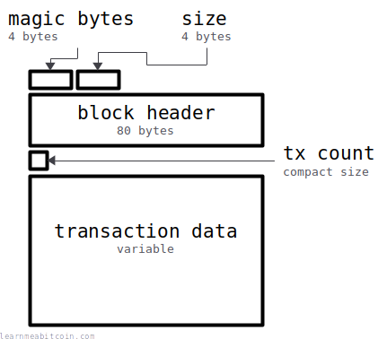
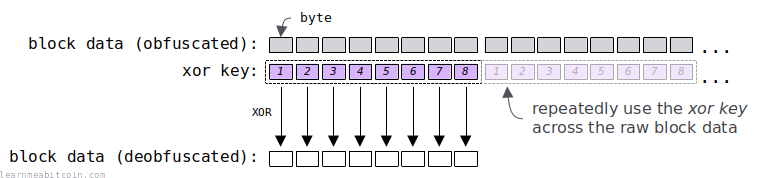

The blk.dat files in the `~/.bitcoin/blocks/` directory contain the **raw [block](/docs/technical/block.md) data** received by your [*Bitcoin Core*](https://bitcoin.org/en/download) node.

These blk.dat files basically store the entire [blockchain](/docs/technical/blockchain.md).

## Location

Where is the blockchain stored on your computer?

The location of the raw blockchain files on your disk depends on what operating system you're using. These are the default locations:

* **Linux:** `~/.bitcoin/blocks/`
* **Mac:** `~/Library/Application Support/Bitcoin/blocks/`
* **Windows:**
  + `C:\Users\[username]\AppData\Roaming\Bitcoin\blocks\` ([v27.2](https://github.com/bitcoin/bitcoin/blob/master/doc/release-notes/release-notes-27.2.md) and below)
  + `C:\Users\[username]\AppData\Local\Bitcoin\blocks\` ([v28.0](https://github.com/bitcoin/bitcoin/blob/master/doc/release-notes/release-notes-28.0.md) onwards)

You can change the location of the block data directory by setting the `datadir=<dir>` option in the [bitcoin.conf configuration file](https://github.com/bitcoin/bitcoin/blob/master/doc/bitcoin-conf.md).

## Filenames

How are the blockchain files organized?

Every [block](/docs/technical/block.md) that your node receives gets appended to a blk.dat file. But instead of the entire blockchain being stored in one massive file, they are split into multiple blk\*.dat files.

* ~/.bitcoin/blocks/
  1. blk00000.dat
  2. blk00001.dat
  3. blk00002.dat
  4. blk00003.dat
  5. blk00004.dat
  6. and so on...

Your node first adds blocks to blk00000.dat, then when it fills up it moves on to blk00001.dat, then blk00002.dat..., and so on. If you're on Linux, you can navigate to the data directory and list all the raw block files with:

```
$ cd ~/.bitcoin/blocks/
$ ls blk*

blk00000.dat
blk00001.dat
blk00002.dat
blk00003.dat
blk00004.dat
blk00005.dat
blk00006.dat
...
```

The maximum blk.dat file size is **128 MiB** (134,217,728 bytes). This limit is set by [MAX\_BLOCKFILE\_SIZE](https://github.com/bitcoin/bitcoin/blob/master/src/node/blockstorage.h).

## Example

What does a raw block look like?

The data in blk.dat files is stored in binary, which is basically a bunch of 1s and 0s and not human-readable text.

Nonetheless, we can look at the [genesis block](/explorer/block/000000000019d6689c085ae165831e934ff763ae46a2a6c172b3f1b60a8ce26f) by reading the first *293 bytes* of blk00000.dat. I've split up the individual fields so you can see them more clearly:

```
f9beb4d9 1d010000 01000000 0000000000000000000000000000000000000000000000000000000000000000 3ba3edfd7a7b12b27ac72c3e67768f617fc81bc3888a51323a9fb8aa4b1e5e4a 29ab5f49 ffff001d 1dac2b7c 01 01000000010000000000000000000000000000000000000000000000000000000000000000ffffffff4d04ffff001d0104455468652054696d65732030332f4a616e2f32303039204368616e63656c6c6f72206f6e206272696e6b206f66207365636f6e64206261696c6f757420666f722062616e6b73ffffffff0100f2052a01000000434104678afdb0fe5548271967f1a67130b7105cd6a828e03909a67962e0ea1f61deb649f6bc3f4cef38c4f35504e51ec112de5c384df7ba0b8d578a4c702b6bf11d5fac00000000
```

See the [od command](#od) below for displaying the [hex bytes](/docs/technical/general/bytes.md#representing-bytes) from a binary file.

## Structure

What is the structure of a raw block?

[](https://static.learnmeabitcoin.com/diagrams/png/block-blkdat.png)

The data above can be split into five parts:

1. The [**magic bytes**](/docs/technical/networking/magic-bytes.md) (4 bytes) is a message delimiter indicating the start of a block.
2. The **size** (4 bytes) indicates the size of the upcoming block in [bytes](/docs/technical/general/bytes.md).
3. The [**block header**](/docs/technical/block.md#header) (80 bytes) is a summary of the block data.
4. The **tx count** ([compact size](/docs/technical/general/compact-size.md)) indicates how many transactions are in the block.
5. The [**transaction data**](/docs/technical/transaction.md) (variable) is all of the transactions in the block concatenated one after the other.

The size field is what allowed me to figure out that I needed to read **293 bytes** to get the whole block in the example above. The size of the block is indicated as `1d010000`, so to get this in human format:

1. Convert `1d010000` from *little-endian* to *big-endian* to get `0000011d`
2. Convert `0000011d` from *hexadecimal* to *decimal* to get `285`

 Little Endian

+1

Decimal

0d

Hex Bytes (Big Endian)

0x

`0 bytes`

Hex Bytes (Little Endian)

0x

`0 bytes`


Field Size

 Any

 2 Bytes

 4 Bytes

 8 Bytes

 12 Bytes

 16 Bytes

 32 Bytes


0 secs

 Number Converter

Binary (Base 2)

0b

`0 digits`

Decimal (Base 10)

0d

`0 digits`

Hexadecimal (Base 16)

0x

`0 digits`


+1


0 secs

So the actual block itself is only 285 bytes. But then there is an extra 8 bytes at the start for the magic-bytes + size, so I needed to read **293 bytes** from the start of the raw blockchain file to get the full block of data.

## Linux Tools

How can you read raw blockchain data?

As mentioned, the data inside a blk.dat file is *binary*, so you're probably not getting to see anything useful if you open one up in a regular text editor. But no matter, because binary data can be easily displayed as [hexadecimal](/docs/technical/general/hexadecimal.md) bytes, and there are a few commands that can help:

### 1. `xxd`

This is a simple one. It dumps out the contents of raw binary files in hexadecimal.

```
$ xxd -p -s 8 -l 285 blk00000.dat

010000000000000000000000000000000000000000000000000000000000
0000000000003ba3edfd7a7b12b27ac72c3e67768f617fc81bc3888a5132
3a9fb8aa4b1e5e4a29ab5f49ffff001d1dac2b7c01010000000100000000
00000000000000000000000000000000000000000000000000000000ffff
ffff4d04ffff001d0104455468652054696d65732030332f4a616e2f3230
3039204368616e63656c6c6f72206f6e206272696e6b206f66207365636f
6e64206261696c6f757420666f722062616e6b73ffffffff0100f2052a01
000000434104678afdb0fe5548271967f1a67130b7105cd6a828e03909a6
7962e0ea1f61deb649f6bc3f4cef38c4f35504e51ec112de5c384df7ba0b
8d578a4c702b6bf11d5fac00000000

# -p      <- show plain hexadecimal bytes
# -s 8    <- seek to a position in the file (using 8 to skip the magic bytes and block size fields)
# -l 285  <- number of bytes to read (the genesis block is the next 285 bytes)
```

If you're running Bitcoin Core `v28.0` or newer, you may need to *deobfuscate* ([XOR](#xor)) the raw block data first to get the same result as above.

### 2. `od`

This is another simple one. It dumps out the contents of files in your format of choice.

```
$ od -x --endian=big -N 293 -An blk00000.dat

 f9be b4d9 1d01 0000 0100 0000 0000 0000
 0000 0000 0000 0000 0000 0000 0000 0000
 0000 0000 0000 0000 0000 0000 3ba3 edfd
 7a7b 12b2 7ac7 2c3e 6776 8f61 7fc8 1bc3
 888a 5132 3a9f b8aa 4b1e 5e4a 29ab 5f49
 ffff 001d 1dac 2b7c 0101 0000 0001 0000
 0000 0000 0000 0000 0000 0000 0000 0000
 0000 0000 0000 0000 0000 0000 0000 ffff
 ffff 4d04 ffff 001d 0104 4554 6865 2054
 696d 6573 2030 332f 4a61 6e2f 3230 3039
 2043 6861 6e63 656c 6c6f 7220 6f6e 2062
 7269 6e6b 206f 6620 7365 636f 6e64 2062
 6169 6c6f 7574 2066 6f72 2062 616e 6b73
 ffff ffff 0100 f205 2a01 0000 0043 4104
 678a fdb0 fe55 4827 1967 f1a6 7130 b710
 5cd6 a828 e039 09a6 7962 e0ea 1f61 deb6
 49f6 bc3f 4cef 38c4 f355 04e5 1ec1 12de
 5c38 4df7 ba0b 8d57 8a4c 702b 6bf1 1d5f
 ac00 0000 0000

# -x           <- show hexadecimal
# --endian=big <- display bytes in big endian
# -N 293       <- number of bytes to read
# -An          <- do not show file offset
```

"od" stands for **o**ctal **d**ump, but you can dump out data in other formats than just [octal](https://en.wikipedia.org/wiki/Octal).

### 3. `hexdump`

This is similar to `xxd` and `od`, but it also gives you the option of displaying [ASCII](/docs/technical/general/bytes.md#text) text from the data (which is also handy for looking at messages contained inside transaction data).

```
$ hexdump -C -s 8 -n 285 blk00000.dat

00000008  01 00 00 00 00 00 00 00  00 00 00 00 00 00 00 00  |................|
00000018  00 00 00 00 00 00 00 00  00 00 00 00 00 00 00 00  |................|
00000028  00 00 00 00 3b a3 ed fd  7a 7b 12 b2 7a c7 2c 3e  |....;...z{..z.,>|
00000038  67 76 8f 61 7f c8 1b c3  88 8a 51 32 3a 9f b8 aa  |gv.a......Q2:...|
00000048  4b 1e 5e 4a 29 ab 5f 49  ff ff 00 1d 1d ac 2b 7c  |K.^J}._I......+||
00000058  01 01 00 00 00 01 00 00  00 00 00 00 00 00 00 00  |................|
00000068  00 00 00 00 00 00 00 00  00 00 00 00 00 00 00 00  |................|
00000078  00 00 00 00 00 00 ff ff  ff ff 4d 04 ff ff 00 1d  |..........M.....|
00000088  01 04 45 54 68 65 20 54  69 6d 65 73 20 30 33 2f  |..EThe Times 03/|
00000098  4a 61 6e 2f 32 30 30 39  20 43 68 61 6e 63 65 6c  |Jan/2009 Chancel|
000000a8  6c 6f 72 20 6f 6e 20 62  72 69 6e 6b 20 6f 66 20  |lor on brink of |
000000b8  73 65 63 6f 6e 64 20 62  61 69 6c 6f 75 74 20 66  |second bailout f|
000000c8  6f 72 20 62 61 6e 6b 73  ff ff ff ff 01 00 f2 05  |or banks........|
000000d8  2a 01 00 00 00 43 41 04  67 8a fd b0 fe 55 48 27  |*....CA.g....UH'|
000000e8  19 67 f1 a6 71 30 b7 10  5c d6 a8 28 e0 39 09 a6  |.g..q0..\..(.9..|
000000f8  79 62 e0 ea 1f 61 de b6  49 f6 bc 3f 4c ef 38 c4  |yb...a..I..?L.8.|
00000108  f3 55 04 e5 1e c1 12 de  5c 38 4d f7 ba 0b 8d 57  |.U......\8M....W|
00000118  8a 4c 70 2b 6b f1 1d 5f  ac 00 00 00 00           |.Lp+k.._.....|)
0000125

# -C <- display data in the same byte-order that is used in bitcoin, and also ascii text
# -s <- start point (offset in bytes)
# -n <- number of bytes to read
```

This is a popular way to display the genesis block, and you'll see it floating around the Internet in various places.

Anyway, you can chain some commands together so that you just get the raw hexadecimal bytes without any formatting if you prefer:

```
$ hexdump -C -s 8 -n 285 blk00000.dat | cut -c 11-58 | tr '\n' ' ' | tr -d ' '

0100000000000000000000000000000000000000000000000000000000000000000000003ba3edfd7a7b12b27ac72c3e67768f617fc81bc3888a51323a9fb8aa4b1e5e4a29ab5f49ffff001d1dac2b7c0101000000010000000000000000000000000000000000000000000000000000000000000000ffffffff4d04ffff001d0104455468652054696d65732030332f4a616e2f32303039204368616e63656c6c6f72206f6e206272696e6b206f66207365636f6e64206261696c6f757420666f722062616e6b73ffffffff0100f2052a01000000434104678afdb0fe5548271967f1a67130b7105cd6a828e03909a67962e0ea1f61deb649f6bc3f4cef38c4f35504e51ec112de5c384df7ba0b8d578a4c702b6bf11d5fac00000000%

# cut -c 11-58 <- cuts out anything outside the columns from characters 11 to 58 (on each line)
# tr '\n' ' ' <- translate new lines in to spaces
# tr -d ' ' <- deletes all spaces
```

But if you're going to go to the effort of doing that, you might as well extract raw block data directly from Bitcoin Core by using:

```
$ bitcoin-cli getblock <hash> 0
```

### 4. bitcoin-iterate

[bitcoin-iterate](https://github.com/rustyrussell/bitcoin-iterate) is an excellent tool for extracting data from raw blockchain files. It's surprisingly fast too. Here are some simple examples:

```
# Usage
bitcoin-iterate -h

# return the block headers for the first 100 blocks
bitcoin-iterate -q --block='%bH' --end=100 > headers.txt

# return the all raw transactions in block 123,456
bitcoin-iterate -q --tx='%tX' --start=123456 --end=123456 > transactions.txt

# return every single scriptpubkey in the blockchain along with the txid for the transaction they were included in
bitcoin-iterate -q --output='%th %os' > scriptpubkeys.txt
```

I use it all the time to look for interesting blocks and transactions in the blockchain.

## XOR

Since [v28.0](https://github.com/bitcoin/bitcoin/blob/master/doc/release-notes/release-notes-28.0.md), the raw block data in the blkXXXXX.dat files is **obfuscated by default**. It's easy enough to *deobfuscate*, but it does mean that the raw block data is no longer stored in "plain text" like it used to be.

> **obfuscate** — to make something less clear and harder to understand, especially intentionally

[Cambridge Dictionary](https://dictionary.cambridge.org/dictionary/english/obfuscate)

The reason for this is because you have no control over what other people might decide to store inside the blockchain, so to [prevent anti-virus software detecting any issues](https://github.com/bitcoin/bitcoin/pull/28052) with the raw block data, it is lightly "scrambled" when stored on your computer. But as I say, it's easy enough to unscramble it to get it back to its natural form.

So if you want to read raw block data from disk, you need to learn how to **deobfuscate it first**.

* You can turn off obfuscation by setting `blocksxor=0` in your `bitcoin.conf` file. However, this only works if you're starting with a fresh download of the blockchain.
* If you were running a bitcoin node before upgrading to v28.0, your raw block data files will remain in plain text. So existing and new block data will not be obfuscated moving forward.

### Example

This is what the [genesis block](/explorer/block/000000000019d6689c085ae165831e934ff763ae46a2a6c172b3f1b60a8ce26f) looks like in its natural form:

```
$ hexdump -C -s 8 -n 285 blk00000.dat

00000008  01 00 00 00 00 00 00 00  00 00 00 00 00 00 00 00  |................|
00000018  00 00 00 00 00 00 00 00  00 00 00 00 00 00 00 00  |................|
00000028  00 00 00 00 3b a3 ed fd  7a 7b 12 b2 7a c7 2c 3e  |....;...z{..z.,>|
00000038  67 76 8f 61 7f c8 1b c3  88 8a 51 32 3a 9f b8 aa  |gv.a......Q2:...|
00000048  4b 1e 5e 4a 29 ab 5f 49  ff ff 00 1d 1d ac 2b 7c  |K.^J}._I......+||
00000058  01 01 00 00 00 01 00 00  00 00 00 00 00 00 00 00  |................|
00000068  00 00 00 00 00 00 00 00  00 00 00 00 00 00 00 00  |................|
00000078  00 00 00 00 00 00 ff ff  ff ff 4d 04 ff ff 00 1d  |..........M.....|
00000088  01 04 45 54 68 65 20 54  69 6d 65 73 20 30 33 2f  |..EThe Times 03/|
00000098  4a 61 6e 2f 32 30 30 39  20 43 68 61 6e 63 65 6c  |Jan/2009 Chancel|
000000a8  6c 6f 72 20 6f 6e 20 62  72 69 6e 6b 20 6f 66 20  |lor on brink of |
000000b8  73 65 63 6f 6e 64 20 62  61 69 6c 6f 75 74 20 66  |second bailout f|
000000c8  6f 72 20 62 61 6e 6b 73  ff ff ff ff 01 00 f2 05  |or banks........|
000000d8  2a 01 00 00 00 43 41 04  67 8a fd b0 fe 55 48 27  |*....CA.g....UH'|
000000e8  19 67 f1 a6 71 30 b7 10  5c d6 a8 28 e0 39 09 a6  |.g..q0..\..(.9..|
000000f8  79 62 e0 ea 1f 61 de b6  49 f6 bc 3f 4c ef 38 c4  |yb...a..I..?L.8.|
00000108  f3 55 04 e5 1e c1 12 de  5c 38 4d f7 ba 0b 8d 57  |.U......\8M....W|
00000118  8a 4c 70 2b 6b f1 1d 5f  ac 00 00 00 00           |.Lp+k.._.....|)
0000125
```

However, my `xor_key` is `17 7a 35 a3 e4 32 54 ff`, so this is what my genesis block looks like on disk:

```
$ hexdump -C -s 8 -n 285 blk00000.dat

00000008  16 7a 35 a3 e4 32 54 ff  17 7a 35 a3 e4 32 54 ff  |.z5..2T..z5..2T.|
00000018  17 7a 35 a3 e4 32 54 ff  17 7a 35 a3 e4 32 54 ff  |.z5..2T..z5..2T.|
00000028  17 7a 35 a3 df 91 b9 02  6d 01 27 11 9e f5 78 c1  |.z5.....m.'...x.|
00000038  70 0c ba c2 9b fa 4f 3c  9f f0 64 91 de ad ec 55  |p.....O<..d....U|
00000048  5c 64 6b e9 cd 99 0b b6  e8 85 35 be f9 9e 7f 83  |\dk.......5.....|
00000058  16 7b 35 a3 e4 33 54 ff  17 7a 35 a3 e4 32 54 ff  |.{5..3T..z5..2T.|
00000068  17 7a 35 a3 e4 32 54 ff  17 7a 35 a3 e4 32 54 ff  |.z5..2T..z5..2T.|
00000078  17 7a 35 a3 e4 32 ab 00  e8 85 78 a7 1b cd 54 e2  |.z5..2....x...T.|
00000088  16 7e 70 f7 8c 57 74 ab  7e 17 50 d0 c4 02 67 d0  |.~p..Wt.~.P...g.|
00000098  5d 1b 5b 8c d6 02 64 c6  37 39 5d c2 8a 51 31 93  |].[...d.79]..Q1.|
000000a8  7b 15 47 83 8b 5c 74 9d  65 13 5b c8 c4 5d 32 df  |{.G..\t.e.[..]2.|
000000b8  64 1f 56 cc 8a 56 74 9d  76 13 59 cc 91 46 74 99  |d.V..Vt.v.Y..Ft.|
000000c8  78 08 15 c1 85 5c 3f 8c  e8 85 ca 5c e5 32 a6 fa  |x....\?....\.2..|
000000d8  3d 7b 35 a3 e4 71 15 fb  70 f0 c8 13 1a 67 1c d8  |={5..q..p....g..|
000000e8  0e 1d c4 05 95 02 e3 ef  4b ac 9d 8b 04 0b 5d 59  |........K.....]Y|
000000f8  6e 18 d5 49 fb 53 8a 49  5e 8c 89 9c a8 dd 6c 3b  |n..I.S.I^.....l;|
00000108  e4 2f 31 46 fa f3 46 21  4b 42 78 54 5e 39 d9 a8  |./1F..F!KBxT^9..|
00000118  9d 36 45 88 8f c3 49 a0  bb 7a 35 a3 e4           |.6E...I..z5..|
00000125
```

The `xor_key` is randomly generated by your node, so your genesis block will look different on your disk.

### Deobfuscate

The raw block data is obfuscated using the `xor_key` stored in the `xor.dat` file in your `/blocks/` folder.

For example:

```
$ xxd -p ~/.bitcoin/blocks/xor.dat

177a35a3e43254ff
```

To deobfuscate the raw block data, you simply use this `xor_key` and XOR it across the raw block data, which "flips the bits" back to their natural form.

This `xor_key` is **8 bytes** in length, so you need to repeatedly XOR every 8 bytes of raw block data to deobfuscate it.

[](https://static.learnmeabitcoin.com/diagrams/png/block-blkdat-xor.png)

Here's some simple code to show you how it works:

```


copied


copied

# get the xor key
file_xor = File.open("/home/username/.bitcoin/blocks/xor.dat", "r") # don't forget to change the path
xor_key = file_xor.read # this is 8 bytes

# set the position you're reading from in the raw block data file
offset = 8 # skip the magic bytes (4 bytes) and block size (4 bytes) fields

# read the raw data for the genesis block from the blk.dat file
file_blk = File.open("/home/username/.bitcoin/blocks/blk00000.dat", "r") # don't forget to change the path
file_blk.seek(offset) # move to where you want to start reading from in the file
blk_data = file_blk.read(285) # the next 285 bytes is the actual block data (I already know this)

# convert the xor key and raw block data to byte arrays
xor_key_bytes = xor_key.bytes
blk_data_bytes = blk_data.bytes

# create an array for storing the resulting xor'd bytes
result = []

# run through each byte of the raw block data
blk_data_bytes.each_with_index do |byte, i|
	
  # there are only 8 bytes in the xor key, so use the modulo operator to loop around to use each byte as we go
  xor_i = (offset + i) % 8 # the offset allows us to start from the correct byte in the xor key

  # xor each byte from the raw block data using the next byte from the xor key, and store each byte in the result array
  result[i] = byte ^ xor_key_bytes[xor_i] # ^ is the XOR operator
end

# convert the result from a byte array to a byte string, then convert to a hexadecimal string (for display purposes)
result_hex = result.pack("C*").unpack("H*")

# show the result
puts result_hex #=> 0100000000000000000000000000000000000000000000000000000000000000000000003ba3edfd7a7b12b27ac72c3e67768f617fc81bc3888a51323a9fb8aa4b1e5e4a29ab5f49ffff001d1dac2b7c0101000000010000000000000000000000000000000000000000000000000000000000000000ffffffff4d04ffff001d0104455468652054696d65732030332f4a616e2f32303039204368616e63656c6c6f72206f6e206272696e6b206f66207365636f6e64206261696c6f757420666f722062616e6b73ffffffff0100f2052a01000000434104678afdb0fe5548271967f1a67130b7105cd6a828e03909a67962e0ea1f61deb649f6bc3f4cef38c4f35504e51ec112de5c384df7ba0b8d578a4c702b6bf11d5fac00000000
```

As you can see, the important part is making sure to use the correct byte from the `xor_key` for each byte of the raw block data.

#### XOR Operator

The [XOR](https://stackoverflow.com/questions/14526584/what-does-the-xor-operator-do) (exclusive or) bitwise operator works on bits (`1`s and `0`s) of binary data. It works as follows:

* Returns a `1` if both input bits are different.
* Returns a `0` if both input bits are the same.

In practical terms, this operator is useful for "flipping bits".

For example:

```
0101010101 <- raw data
1111111111 <- example xor_key
---------- XOR
1010101010 <- result
```

Then if you use the same `xor_key` on the result, you flip the bits back to their original form:

```
1010101010 <- raw data
1111111111 <- example xor_key
---------- XOR
0101010101 <- result
```

Therefore:

* If you use an xor\_key of all `1`s, it will **flip every bit** of the original data.
* If you use an xor key of all `0`s, it will **not flip any of the bits** (so the original data will remain the same).

So by using a random `xor_key`, different keys will flip different bits of the raw block data when stored on your disk. These bits can then be "flipped back" using the same `xor_key` on the obfuscated result.

If you upgrade to v28.0 from an earlier version, your `xor_key` will be all `0`s, so the raw block data will remain unchanged on disk.

It's a bit annoying to have to deobfuscate the raw block data after v28.0, especially if you've already written a tool that reads through the blkXXXXX.dat files. But it's pretty straightforward to unscramble the raw data, so it shouldn't require too much effort to update your code and get it working again.

## Notes

### Block Order

If you are parsing the blk.dat files with your own script, be aware that blocks are **not going to be in order**. For example, you may encounter blocks in this order as you run through the file:

```
A B C E F D G
```

This is because your bitcoin node will **download blocks in parallel** so that it can download the blockchain as quickly as possible. So instead of having to wait to receive each block in order, your node will download blocks further ahead of the current one as it goes.

The maximum distance ahead your node will fetch from (or the "maximum out-of-orderness") is controlled by [BLOCK\_DOWNLOAD\_WINDOW](https://github.com/bitcoin/bitcoin/blob/master/src/net_processing.cpp) in the bitcoin source code.

## Resources

* [Bitcoin Core file system](https://github.com/bitcoin/bitcoin/blob/master/doc/files.md)
* [Why are blk\*.dat files ~134200000 bytes?](https://bitcoin.stackexchange.com/questions/50693/why-are-blk-dat-files-134200000-bytes)
* [Making Sense of Hexdump](https://www.suse.com/c/making-sense-hexdump/)