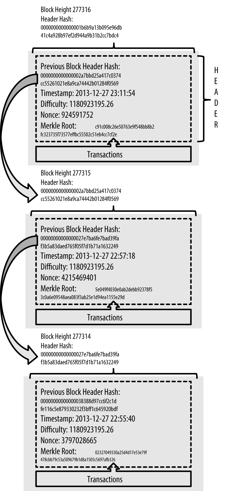
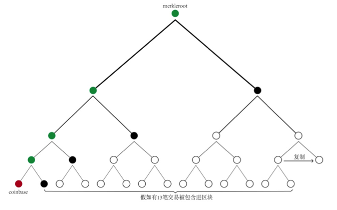

# 区块深度考古：创世区块谜题、blk.dat 与协议演进 (Genesis Block & Archaeology)

在前面的章节中，我们已经系统学习了[区块的基本结构](../block.md)、[blk.dat 文件格式](blkdat.md) 以及[挖矿与共识原理](../mining.md)。本章作为进阶专题，我们将从底层源码与历史协议演进的视角，深挖比特币区块实现中的几大硬核细节与历史考古谜题。

---

## 1. 全节点磁盘数据布局与区块解析

当您在本地运行一个完整的 `bitcoind` 节点时，数据目录中主要维护四类关键文件：

```text
datadir/
├── blocks/
│   ├── blkxxxxx.dat    # 原始区块数据（Blockchain 的主体存储）
│   ├── revxxxxx.dat    # 区块撤销/回滚记录（链发生分叉重组时用于更新 UTXO）
│   └── index/*.ldb     # 区块索引数据库（LevelDB，记录每个区块和交易在 blk 文件中的偏移量）
└── chainstate/*.ldb    # UTXO 状态数据库（记录全网当前所有未花费的交易输出）
```

* **原始区块数据 (`blk*.dat`)**：纯追加写入。由于 `bitcoind` 写入区块是并发处理的，因此物理文件内部的区块排序**并非严格按时间顺序排列**，而是交错存储的。
* **UTXO 状态集合 (`chainstate`)**：验证新交易的核心。如果节点崩溃，`chainstate` 和 `index` 可以纯靠扫描所有的 `blk*.dat` 文件重建，但在海量数据下重建可能需要数十小时。

### 实战：解析本地 blk.dat 文件
由于区块结构由 `[4字节 Block Size] + [80字节 Block Header] + [VarInt 交易数] + [交易列表]` 构成，我们可以直接用 Python 脚本脱离 RPC 接口，对磁盘上的原始二进制进行流式解析：

```python
# 推荐使用成熟的开源解析库快速遍历本地区块
# pip install python-bitcoin-blockchain-parser
from blockchain_parser.blockchain import Blockchain

blockchain = Blockchain("~/.bitcoin/blocks")
for block in blockchain.get_ordered_blocks():
    print(f"高度: {block.height}, 区块哈希: {block.hash}")
    for tx in block.transactions:
        print(f"  交易哈希: {tx.txid}, 输入数: {len(tx.inputs)}, 输出数: {len(tx.outputs)}")
```

---

## 2. 创世区块的秘密：为何那 50 枚比特币永远无法被花费？

区块链的第一个区块创建于 2009-01-03 18:15:05 GMT，被称为**创世区块 (Genesis Block)**，其哈希值为：
`000000000019d6689c085ae165831e934ff763ae46a2a6c172b3f1b60a8ce26f`。

创世区块并不是挖矿挖出来的，而是中本聪在源码中手工硬编码构造的（见 [Satoshi v0.01 源码 main.cpp#L1439](https://github.com/brain-zhang/bitcoin_satoshi/blob/v0.01/main.cpp#L1439)）。

这里有一个极其著名的历史谜题：**创世区块中 Coinbase 奖励给中本聪的 50 枚 BTC，在技术上是永远无法被花费的。这究竟是为什么？**



### 中本聪 v0.01 源码级考古

通读中本聪发布的第一版比特币源代码，答案水落石出：

1. **合法 UTXO 的判定依据**：初版比特币客户端判断一笔交易的输入（vin）是否合法，依赖于该输入关联的 UTXO 是否存在于**区块索引文件**中。在早期版本中，原始区块存放在 `blk0001.dat`，而所有区块的元数据与索引存放在 `blkindex.dat` 中。
2. **索引写入的时机**：源码中，`blkindex.dat` 只有在**节点自己挖出新区块**或者**从网络接收并验证周围节点广播的区块**时，才会调用写入函数。
3. **关键 Bug / 疏漏**：中本聪在手工构造创世区块并启动客户端时，直接把创世块写进了内存与代码，**但并未调用索引写入函数将其写入 `blkindex.dat`**！
4. **历史演进的固化**：后来比特币客户端架构多次重构，存储 UTXO 的引擎从 BerkeleyDB 换成了 LevelDB（`chainstate`），但始终保持了这一历史事实——创世区块的交易没有进入全局 UTXO 数据库。因此，任何人尝试花费创世块输出的交易都会因“找不到引用的 UTXO”而被视为非法交易并拒绝。

#### 为什么社区从未“修复”这个 Bug？
* 修复该问题需要全网执行一次硬分叉升级；
* 为了一笔只有中本聪拥有私钥且从未动用过的 50 BTC 去冒全网硬分叉的风险毫无必要；
* 如今，这 50 枚不可花费的创世比特币已经成为了比特币网络永久的历史丰碑。

---

## 3. 挖矿通信协议演进：从 getwork 到 Stratum

在[挖矿与共识](../mining.md)中，我们了解到矿工的本质是在区块头中寻找满足目标难度的随机数（Nonce）。随着算力的爆炸式增长，矿机与节点之间的通信协议经历了三次重大变革：

### 1. CPU / 本地挖矿时代
早期只有少数极客运行 `bitcoind`，客户端集成了钱包、节点与挖矿功能。单核 CPU 遍历 4 字节的 Nonce（4G 空间）完全足够，无需网络协议分工。

### 2. GPU 时代与 getwork 协议
当使用显卡挖矿时，计算程序开始与节点分离。节点通过 RPC 提供 `getwork` 接口：
* **运作方式**：节点在内存中构造好候选区块头（80 字节），交给外部 GPU 挖矿程序；GPU 仅遍历 Nonce。
* **缺陷**：4 字节的 Nonce 空间（约 42.9 亿次哈希）在高速计算下几秒就会耗尽，矿工必须频繁请求节点刷新。此外，`getwork` 是矿工拉取模式，全网出块时无法及时通知，存在算力浪费。

### 3. 矿池崛起与 Stratum 协议
随着 ASIC 矿机出现，算力进入 T/s 级别，单一矿工难以独立爆块，矿池应运而生。矿池面临巨大挑战：
* 每次给矿工分派任务不能传输上万笔交易的庞大列表（带宽吃不消）；
* 仅给 4 字节 Nonce 空间矿机微秒内就会算完。

**Stratum 协议的绝妙创新**：矿池将构造 Coinbase 交易的权利部分下放给矿工。
矿工可以在 Coinbase 的 `scriptSig` 中随意填充 ExtraNonce，从而改变 Coinbase 的哈希值。而 Coinbase 位于 Merkle 树的最左侧，改变它就会改变整个 Merkle Root，从而获得近乎无限的搜索空间！



如上图所示，当区块包含 $N$ 笔交易时，矿池无需发送所有交易，**只需发送 $\log_2(N)$ 个中间哈希分支（Merkle Branch）交付给矿工**。矿工在本地仅需对 Coinbase 和这些分支两两合并哈希，即可自行推导最新的 `Merkle Root`。

Stratum 协议成功实现了**高频任务轻量下发**与**无限搜索空间**的完美平衡，支撑了现代全球矿池的百万级算力并发。

---

## 4. 深入 SPV 节点的轻量验证机制

Merkle 树除了服务于矿池，也是**简单支付验证 (SPV - Simplified Payment Verification)** 钱包的基础。

SPV 节点不下载数百 GB 的完整区块数据，只下载 80 字节的区块头链：
1. 当用户需要验证一笔收款交易是否已上链时，SPV 节点向全节点请求包含该交易的 Merkle 分支路径（即认证路径）。
2. SPV 节点自行根据交易哈希和路径向上计算，如果计算出的根哈希与本地已通过工作量证明累积的区块头中的 `Merkle Root` 一致，即可在数学上确信该交易已经被打包并获得了足够的 PoW 确认。
3. 全过程仅需传输千字节（KB）级别的数据，赋予了移动端和嵌入式轻钱包极高的安全性与便利性。

---

## 5. 小结

从原始文件的十六进制存储，到中本聪 v0.01 创世块的代码遗迹，再到 Stratum 协议通过 Merkle 树精妙降低带宽负载——比特币不仅是一套精巧的密码学经济学系统，更是一部在真实网络对抗和工程性能极限中不断迭代进化的分布式系统工程史诗。