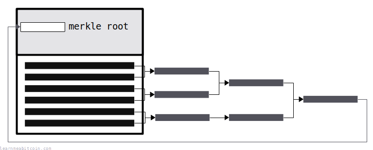
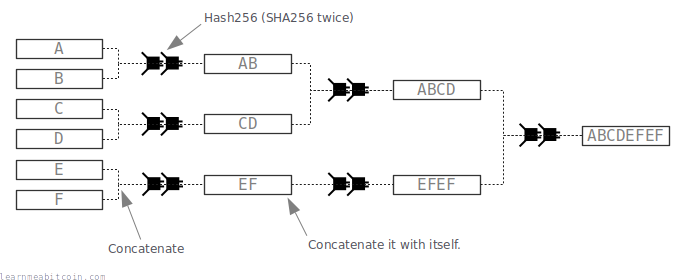
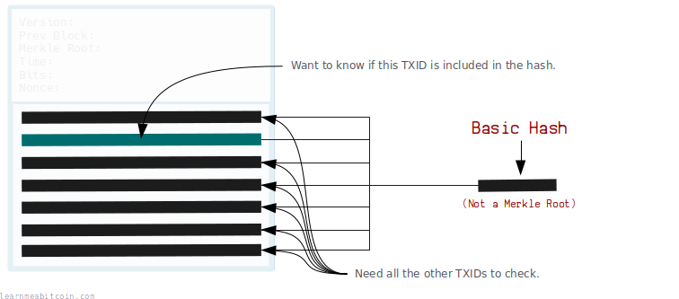
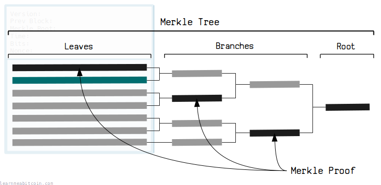
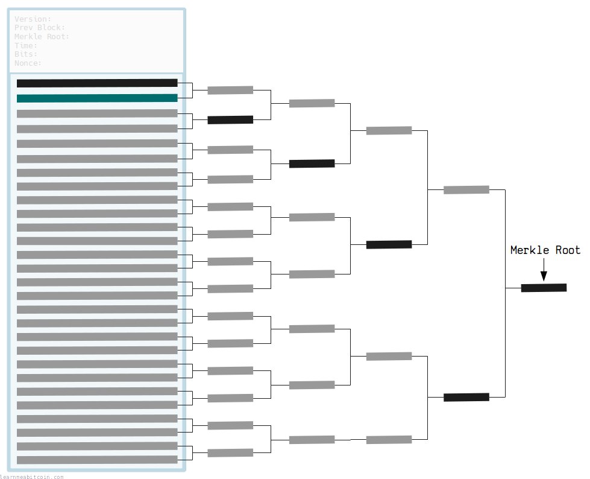
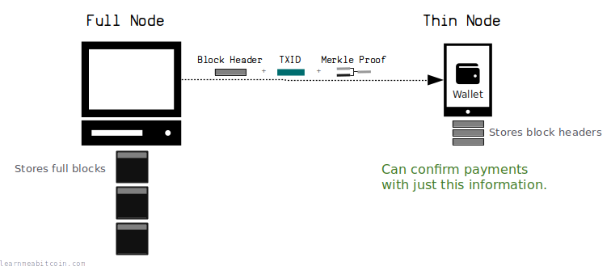
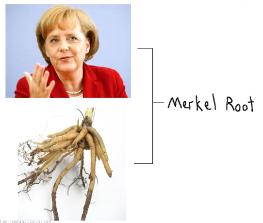

[](https://static.learnmeabitcoin.com/diagrams/png/block-merkle-root.png)

Merkle Root 是通过将成对的 [TXID](/docs/technical/transaction/input/txid.md) 组合进行[哈希运算](/docs/technical/cryptography/hash-function.md)创建的，以获取一个简短且独特的**指纹，代表[区块](/docs/technical/block.md)中的所有[交易](/docs/technical/transaction.md)**。

这个 Merkle Root 被放置在[区块头](/docs/technical/block.md#header)中，以防止区块内容随后被篡改。因此，如果有人试图从区块中添加或删除交易，区块内交易的 Merkle Root 将不再与区块头内的 Merkle Root 相匹配。

换句话说，Merkle Root 是连接区块头与区块中交易的纽带。

随机示例

区块

TXID 列表

TXID 列表，以*空格*、*逗号*或*换行符*分隔。引号和括号会被忽略。

TXID 应以[反向字节顺序](/docs/technical/general/byte-order.md#reverse-byte-order)（如它们在区块链浏览器上显示的那样）输入，但在计算 Merkle Root 之前，它们会被转换为[自然字节顺序](/docs/technical/general/byte-order.md#natural-byte-order)。


TXIDs (0)
 

Merkle Root (自然字节顺序)

来自哈希函数的字节顺序

Merkle Root (反向字节顺序)

在区块链浏览器上显示的字节顺序


0 秒

## 结构

如何创建 Merkle Root？

Merkle Root 是通过在树状结构中对 TXID 进行哈希运算创建的。

1. 将 TXID 成对地组合并进行哈希运算。
   * **注意:** 如果最后剩下一个单独的项，则将其与自身进行哈希。
2. 提取得到的哈希值，并将它们成对组合并哈希。
3. 重复此过程，直到只剩下一个哈希值。

[](https://static.learnmeabitcoin.com/diagrams/png/block-merkle-root-technical-diagram.png)

## 代码

这里有一些用 Ruby 编写的从 `TXID` 列表创建 Merkle Root 的代码。该代码非常易读，即使您不认为自己是一名程序员，也值得通读这些步骤。

```
require 'digest' # Need this for the SHA256 hash function

# Hash function used in the merkle root function (and in bitcoin in general)
def hash256(hex)
    binary = [hex].pack("H*")
    hash1 = Digest::SHA256.digest(binary)
    hash2 = Digest::SHA256.digest(hash1)
    result = hash2.unpack("H*")[0]
    return result
end

def merkleroot(txids)

  # Exit Condition: Stop recursion when we have one hash result left
  if txids.length == 1
    # Convert the result to a string and return it
    return txids.join('')
  end
  
  # Keep an array of results
  result = []

  # 1. Split up array of hashes in to pairs
  txids.each_slice(2) do |one, two|
    # 2a. Concatenate each pair
    if (two)
      concat = one + two
    # 2b. Concatenate with itself if there is no pair
    else
      concat = one + one
    end

    # 3. Hash the concatenated pair and add to results array
    result << hash256(concat)
  end

  # Recursion: Do the same thing again for these results
  merkleroot(result)
end


# Test (e.g. block 000000000003ba27aa200b1cecaad478d2b00432346c3f1f3986da1afd33e506)
txids = [
  "8c14f0db3df150123e6f3dbbf30f8b955a8249b62ac1d1ff16284aefa3d06d87",
  "fff2525b8931402dd09222c50775608f75787bd2b87e56995a7bdd30f79702c4",
  "6359f0868171b1d194cbee1af2f16ea598ae8fad666d9b012c8ed2b79a236ec4",
  "e9a66845e05d5abc0ad04ec80f774a7e585c6e8db975962d069a522137b80c1d"
]

# TXIDs must be in natural byte order when creating the merkle root
txids = txids.map {|x| x.scan(/../).reverse.join('') }

# Create the merkle root
result = merkleroot(txids)

# Display the result in reverse byte order
puts result.scan(/../).reverse.join('') #=> f3e94742aca4b5ef85488dc37c06c3282295ffec960994b2c0d5ac2a25a95766
```

**[字节顺序](/docs/technical/general/byte-order.md):** 在创建 Merkle Root 时，TXID 必须处于自然字节顺序。生成的 Merkle Root 也将处于自然字节顺序，但在[区块链浏览器](/explorer/)上会以反向字节顺序显示。

如果区块中只有*一笔*交易，则 Merkle Root 将与该交易的 TXID 相同。

## Merkle 树

为什么我们使用 Merkle Root？

这种将列表项哈希在一起的结构被称为 **Merkle 树 (merkle tree)**。但为什么要使用 Merkle 树呢？

我的意思是，我们*本来*可以一次性对所有 TXID 进行哈希。那将为区块中的所有交易创建一个指纹，并且这也是可行的。但随后如果我们想知道某个特定的 TXID 是否用于创建该指纹，我们将需要知道**所有**其他 TXID：

[](https://static.learnmeabitcoin.com/diagrams/png/block-merkle-root-fingerprint-hash.png)

这就是 Merkle 树的用武之地。如果我们改用 *Merkle 树*，我们只需要知道沿着树路径的**一些** *分支*，就可以验证一个 TXID 是否用于创建根哈希：

[](https://static.learnmeabitcoin.com/diagrams/png/block-merkle-root-fingerprint-merkle-tree.png)

这一路径被称为 *Merkle 证明 (merkle proof)*。

因此，通过使用 Merkle 树，我们可以找出某个交易是否是区块的一部分，而无需知道区块中的每个其他 `TXID`。或者用技术术语来说，Merkle 树提供了一种有效的方法来证明某物存在于一个集合中，而无需知道整个集合。

而如果您在处理包含 2,000 多笔交易的区块，Merkle 树比将所有 TXID 一次性哈希在一起要高效得多。

[](https://static.learnmeabitcoin.com/diagrams/png/block-merkle-root-fingerprint-merkle-tree-big.png)

### Merkle 证明示例

假设我们有一个区块头（因此也有 Merkle Root），对应区块 [00000000000000000027ad67588ebcf18eabe2250c411e6b79ad1c009b4cb54f](/explorer/block/00000000000000000027ad67588ebcf18eabe2250c411e6b79ad1c009b4cb54f)。

现在，假设我们想验证交易 [f66f6ab609d242edf266782139ddd6214777c4e5080f017d15cb9aa431dda351](/explorer/tx/f66f6ab609d242edf266782139ddd6214777c4e5080f017d15cb9aa431dda351) 是否在此区块内。

这是证明该交易在此区块内的 **Merkle 证明 (merkle proof)**：

```
txid
----
f66f6ab609d242edf266782139ddd6214777c4e5080f017d15cb9aa431dda351 (reverse byte order)

merkle proof
------------
50ba87bdd484f07c8c55f76a22982f987c0465fdc345381b4634a70dc0ea0b38 left
96b8787b1e3abed802cff132c891c2e511edd200b08baa9eb7d8942d7c5423c6 right
65e5a4862b807c83b588e0f4122d4ca2d46691d17a1ec1ebce4485dccc3380d4 left
1ee9441ddde02f8ffb910613cd509adbc21282c6e34728599f3ae75e972fb815 left
ec950fc02f71fc06ed71afa4d2c49fcba04777f353a001b0bba9924c63cfe712 left
5d874040a77de7182f7a68bf47c02898f519cb3b58092b79fa2cff614a0f4d50 left
0a1c958af3e30ad07f659f44f708f8648452d1427463637b9039e5b721699615 left
d94d24d2dcaac111f5f638983122b0e55a91aeb999e0e4d58e0952fa346a1711 left
c4709bc9f860e5dff01b5fc7b53fb9deecc622214aba710d495bccc7f860af4a left
d4ed5f5e4334c0a4ccce6f706f3c9139ac0f6d2af3343ad3fae5a02fee8df542 left
b5aed07505677c8b1c6703742f4558e993d7984dc03d2121d3712d81ee067351 left
f9a14bf211c857f61ff9a1de95fc902faebff67c5d4898da8f48c9d306f1f80f left

merkle root
-----------
17663ab10c2e13d92dccb4514b05b18815f5f38af1f21e06931c71d62b36d8af (reverse byte order)
```

这个 Merkle 证明包含我们到达 Merkle Root 所需的 Merkle 树上的*分支*列表。这些分支还指示了它们是在“左边 (left)”还是在“右边 (right)”，以便您在哈希时按正确的顺序串联每一对。

要检查 TXID 是否构成 Merkle Root 的一部分，我们只需从 TXID 开始，然后通过该 Merkle 证明递归地串联和哈希，以确认我们得到了与区块头中相同的 Merkle Root 结果。

#### 带宽

虽然 Merkle Root 最初在构建时需要花费更多精力，但在随后的验证时能节省带宽。例如，如果我们比较验证上区块中是否存在交易所需下载的数据量：

* **没有 Merkle Root:** 我们需要下载 **75,232 字节**（2,351 x 32 字节 TXID）的数据来重建区块中所有交易的哈希值。
* **有 Merkle Root:** 我们只需要下载 **384 字节**（沿着 Merkle 树路径的 12 x 32 字节分支）来重建 Merkle Root 哈希。

## 轻量级钱包

得益于 Merkle 树，您可以创建*轻量级钱包*（或“瘦节点”），它们可以验证交易是否已进入区块，**而无需下载和存储整个区块链的开销**。

这些钱包只需下载并存储[区块头](/docs/technical/block.md#header)（每个仅 80 字节，而不是 1 MB+ 的区块），并使用其中的 Merkle Root（以及从[全归档节点](/docs/technical/networking/node.md#archival-node)接收到的 *Merkle 证明*）来验证交易是否已被写入区块。

[](https://static.learnmeabitcoin.com/diagrams/png/block-merkle-root-thin-nodes.png)

轻量级钱包的一个流行示例是 [Electrum](https://electrum.org)。

不过我在这方面没有经验，这里有一些有趣的相关链接：

* <https://bitcoin.stackexchange.com/questions/32529/what-is-a-thin-client>
* <https://bitcoin.stackexchange.com/questions/11054/how-do-spv-simple-payment-verification-wallets-learn-about-incoming-transactio>

## 为什么它被称为 "merkle root"?

因为 [Ralph *Merkle*](https://en.wikipedia.org/wiki/Ralph_Merkle) 在 1979 年申请了该专利。

常见的误解。


## 资源

* [James D'Angelo explaining Merkle Roots](https://www.youtube.com/watch?v=gUwXCt1qkBU)
* [Understanding Merkle Trees - Why Use Them, Who Uses Them, and How to Use Them](https://www.codeproject.com/articles/Understanding-Merkle-Trees-Why-Use-Them-Who-Uses-T)

### 感谢

* 感谢 Gabriele Semeraro 指出 Ruby 代码中的一个错误。我原本将返回结果的退出条件放在了对成对的 TXID 进行哈希运算的步骤*之后*。但如果您只剩下一个项，只需直接返回它而不用做任何更多工作。换句话说，如果区块中只有一笔交易，Merkle Root 就与 TXID 相同。