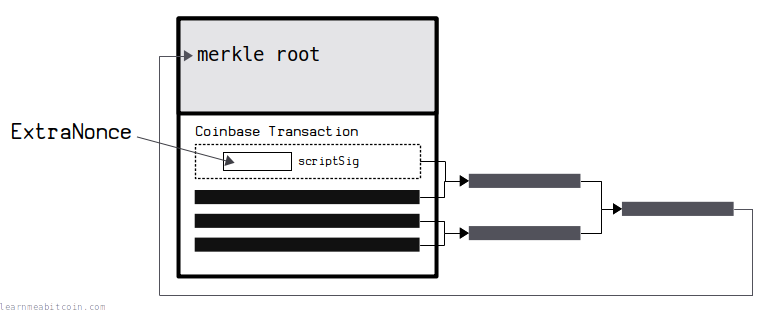
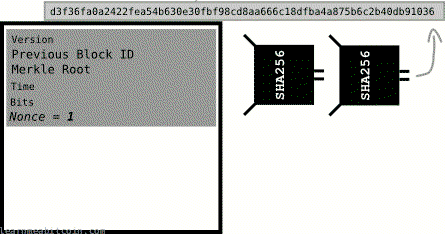
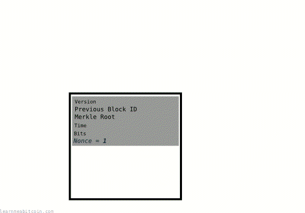

The nonce is a spare field at the end of the [block header](/docs/technical/block.md#header) used for [mining](/docs/technical/mining.md).

> Nonce is an abbreviation of **n**umber used **once**.

[cryptography.fandom.com/wiki/Cryptographic\_nonce](https://cryptography.fandom.com/wiki/Cryptographic_nonce)

I like to call it the "mining field".

Anyway, the easiest way to understand its purpose is to adjust the nonce in a block header to see how it affects the [block hash](/docs/technical/block/hash.md):

Random Example

Block:

Block Header (Hex)

`0 bytes`

Block Header (Fields)

Version

0

0

0

0

0

0

0

0

0

0

0

0

0

0

0

0

0

0

0

0

0

0

0

0

0

0

0

0

0

0

0

0

Previous Block:
Merkle Root
Time

0d

Bits
Nonce

0d

+1

Block Hash

This is the HASH256 of the hex block header. It's also in reverse byte order, because that's how block hashes are displayed in block explorers.

0 secs

## Usage

What is the nonce field used for?

The nonce is a 4-byte field that can hold numbers between **0** and **4294967295** (`0x0` to `0xffffffff` in hex).

Miners increment the nonce value when mining so that they can get completely different [hash](/docs/technical/cryptography/hash-function.md) results for the block header of their [candidate block](/docs/technical/mining/candidate-block.md). They hope to stumble upon a "magic" nonce value that will produce a block hash that is below the current [target](/docs/technical/mining/target.md).

So there's no skill in trying to find a nonce that works. It's just a spare field that allows miners to quickly re-hash their block header without having to reconstruct the entire block.

This is a slowed-down simulation of what the mining process looks like under the hood.
  
This [SHA-256 video](https://www.youtube.com/watch?v=f9EbD6iY9zI&t=140s) shows the mining process in action.

### Notes

Some extra details about how the nonce works:

* **You do not get closer to mining a block with every hash attempt.** Just because you're incrementing the nonce, it doesn't mean you're "working toward" mining the block. The result of the [hash function](/docs/technical/cryptography/hash-function.md) is completely unpredictable, so each result is independent of the last. You have just as much chance of mining a block with a nonce value of 0 as you do with a nonce value of 4294967295 – it makes no difference.
* **You do not have to *increment* the nonce.** You could work backwards, or even try random nonce values when attempting to mine a block. It doesn't matter. As long as you're not retrying with the same nonce values, your method for trying different nonces doesn't make any difference to your chances of mining the block. However, incrementing the nonce value on each attempt is the simplest and fastest method, so that's what miners typically do.
* **Not every block has a magic nonce value.** There is no guarantee that there will be a "magic" nonce value for any given block header. In fact, it's likely that there will be no nonce value that will produce a hash result below the target. If you exhaust the nonce, you need to start over again with a new block header (e.g. by adjusting the [time](/docs/technical/block/time.md) field, or changing the [transactions](/docs/technical/transaction.md) in the block).

## Limitations

Does every block have a "magic" nonce value?

Miners will usually exhaust the 4-byte nonce field in the block header **without** finding a "magic" nonce value that produces a block hash below the current target.

So no, most blocks will not have a "magic" nonce value.

When a miner exhausts the nonce field the obvious next step is to adjust the [time](/docs/technical/block/time.md) field. This produces a slightly different block header, which allows the miner to increment through the nonce field again in an attempt to mine the same block of transactions.

However, miners are so fast that they'll exhaust the nonce field in less than 1 second, so the *time* field isn't much help in this situation. Therefore, miners look for other ways to modify the block header without having to reconstruct the entire block of transactions (which would take more time)…

Having such a small 4-byte nonce field in the block header was possibly a design mistake by Satoshi.

## ExtraNonce

If a miner exhausts the nonce field, they will move on to adjusting what's referred to as an "ExtraNonce".

The ExtraNonce is located inside [scriptSig](/docs/technical/transaction/input/scriptsig.md) of the [coinbase transaction](/docs/technical/mining/coinbase-transaction.md). Miners are free to put any data they like in the scriptSig, which means they can modify it to serve as an **unofficial field for an additional nonce value**.

This works because:

1. Changing the contents of the [scriptSig](/docs/technical/transaction/input/scriptsig.md) changes the transaction data.
2. Changing the transaction data for the coinbase transaction changes its [TXID](/docs/technical/transaction/input/txid.md).
3. Changing the TXID for the coinbase transaction changes the [merkle root](/docs/technical/block/merkle-root.md).
4. Changing the merkle root changes the block header.

So a change to the scriptSig in the coinbase transaction is a quick and easy way to modify the block header via the merkle root.

There is no "official" position for an ExtraNonce inside the scriptsig, so it's not always easy to identify which part the miner used for the ExtraNonce. However, miners typically increment some data toward the start of the scriptsig field.

* **The quickest way to mine is by adjusting the nonce directly.** If you only used the ExtraNonce field for mining, you would have to recalculate the merkle root for every attempt, which would be slower.
* The [version](/docs/technical/block/version.md) field can also be used as an extra nonce.

## Terminology

Why is it called a nonce?

Good question.

It's a term used in cryptography for "number used once", so it basically refers to any time you need to use a one-off random number for some cryptographic purposes.

Unless you're British of course, in which case it doesn't mean that at all.

## Gifs

Here's a terrible gif I made in 2016 that shows how the nonce is used to change the block hash:

And here's another one showing a rough visualization of the mining process:

If those gifs don't explain everything, I don't know what will.

## Resources

* [Why didn't Satoshi make the nonce space larger?](https://bitcoin.stackexchange.com/questions/32603/why-didnt-satoshi-make-the-nonce-space-larger)
* [Determining a Block's Extranonce Value](https://bitcoin.stackexchange.com/questions/36455/determining-a-blocks-extranonce-value)