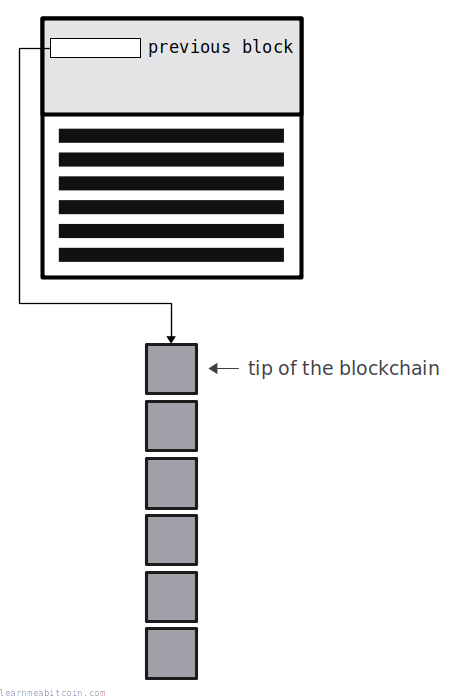
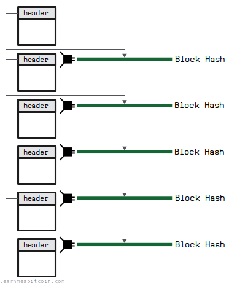
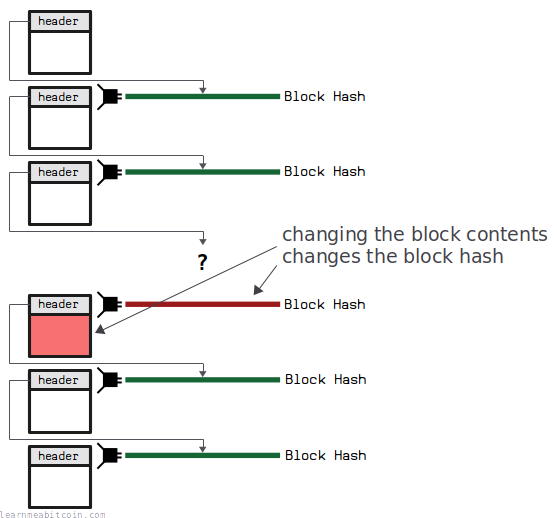

The previous block field in the [block header](/technical/block/#header) contains the [hash](/technical/block/hash/) of a previous block that the block **builds on**.

Each block links to a previous block, and this creates a *chain of blocks*. Or, as it's more commonly known, a [blockchain](/technical/blockchain/).

## Example

Below are the top 5 blocks in the blockchain. If you check them out, you'll see that they each contain the hash of the block below it in their block headers.

Height | Block Hash || 956,471 | [00000000000000000001ec048885e8386fd3d5b1f56248214e40586b57f80691](/explorer/block/00000000000000000001ec048885e8386fd3d5b1f56248214e40586b57f80691) |
| 956,470 | [000000000000000000005be2d95a0d27c094beafdb1b8c2bf7ca66835904ce24](/explorer/block/000000000000000000005be2d95a0d27c094beafdb1b8c2bf7ca66835904ce24) |
| 956,469 | [0000000000000000000169558ed73978cbd4158e8a519b6d419ee2f02a864edb](/explorer/block/0000000000000000000169558ed73978cbd4158e8a519b6d419ee2f02a864edb) |
| 956,468 | [0000000000000000000097fa1a5fec797ddc890357ee11d291590175b15c10c7](/explorer/block/0000000000000000000097fa1a5fec797ddc890357ee11d291590175b15c10c7) |
| 956,467 | [000000000000000000002d17cb7d778198a0aa3431b3b46d51b59ca634e776e2](/explorer/block/000000000000000000002d17cb7d778198a0aa3431b3b46d51b59ca634e776e2) |

You can visit every block in the blockchain by starting at the tip and following the *previous block*s all the way to the bottom.

## Usage

When constructing a [candidate block](/technical/mining/candidate-block/), a [miner](/technical/mining/) will put the block hash of the current **tip of the blockchain** in the previous block field.

All miners want to extend the current longest known chain of blocks, because the [longest chain](/technical/blockchain/longest-chain/) is what all nodes adopt as the *canonical* version of the blockchain, and they can only collect the [block reward](/technical/mining/block-reward/) if the block makes it 100 blocks deep into the longest chain.

> **canonical** – authorized; recognized; accepted

[collinsdictionary.com](https://www.collinsdictionary.com/dictionary/english/canonical)

You can find the block at the current tip of the blockchain by running `bitcoin-cli getbestblockhash`.

**All blocks must build upon an existing previous block.** If you put a hash in the previous block field of a block that does not exist, the block will be invalid and will be rejected by nodes on the [network](/technical/networking/).

## Purpose

Why do blocks contain the hash of a previous block?

The previous block field is what **connects blocks together** in the blockchain.

A [block hash](/technical/block/hash/) is a unique reference for a block, and it's determined by the contents of the block. So by including a previous block's hash in the block header, you can create a reliable chain of data, where each chunk of data (i.e. block of transactions) is linked to the one before it.

The blockchain is just a chain of blocks connected by block hashes.

So if you tried to modify the content of an older block (e.g. by replacing or removing a [transaction](/technical/transaction/)), this will change the hash for that block, and it will no longer be part of the same chain of blocks, because the block that builds upon it will no longer be referring to it anymore.

If you change one of the block hashes you're removing it from the chain.

So basically, this chain of block hashes is what prevents anyone from going back in time and changing the blockchain. Because if you did, nodes would ignore the modified block as it would not be a part of longest-known chain.

This is what people mean when they refer to the blockchain as being an "immutable ledger".

> **immutable** – Something that is immutable will never change or cannot be changed.

[collinsdictionary.com](https://www.collinsdictionary.com/dictionary/english/immutable)

## Genesis Block

The [genesis block](/explorer/block/000000000019d6689c085ae165831e934ff763ae46a2a6c172b3f1b60a8ce26f) is unique in that its previous block field contains **all zeros**. This is because it's the very first block in the blockchain, and so there is no "previous block" for it to build upon.

That's the only interesting fact I have about the previous block field in the block header.

## Resources

* <https://en.wikipedia.org/wiki/Hash_chain>
* [Blockchain Demo](https://andersbrownworth.com/blockchain/) - Cool interactive website that shows how blocks are connected in a blockchain by block hashes.