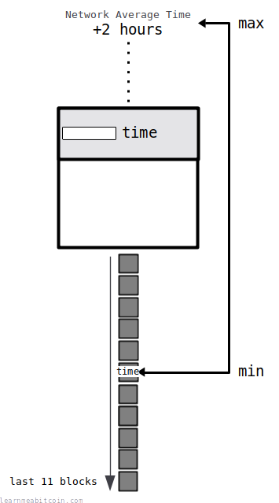
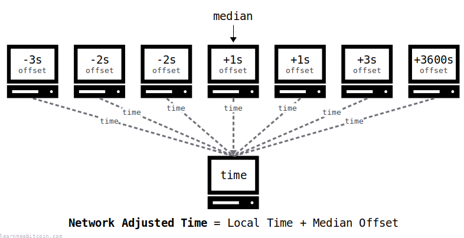
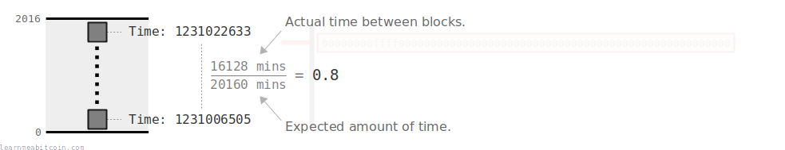

[](https://static.learnmeabitcoin.com/diagrams/png/block-time.png)

The time field in the [block header](/technical/block/#header) indicates the **rough time a block was created**.

Miners put the current time in the block header when they construct their [candidate block](/technical/mining/candidate-block/). It contains a Unix Timestamp (the number of seconds since 01 January 1970), which is what computer programs typically use to store specific points in time.

For example, the [genesis block](/explorer/block/000000000019d6689c085ae165831e934ff763ae46a2a6c172b3f1b60a8ce26f) contains the timestamp 1231006505, which represents the date *03 Jan 2009, 18:15:05*.

Unix Time

0d


Now

Date


0 secs

## Block Order

Does block time influence the order of blocks?

The timestamps **do not** influence the order of blocks in the [blockchain](/technical/blockchain/).

In fact, it's possible for a block to have an earlier timestamp than the block it builds on top of. For example:

* Block [790,402](/explorer/790402#blockchain) = 19 May 2023, 04:22 (2 minutes "before" the [previous block](/technical/block/previous-block/))
* Block [790,401](/explorer/790401#blockchain) = 19 May 2023, 04:24

Another particularly bad example is from 2011 where a block has a time of almost 2 hours "before" the block before it:

* Block [156,114](/explorer/156114#blockchain) = 05 Dec 2011, 06:17 (1 hour 59 minutes "before" the previous block)
* Block [156,113](/explorer/156113#blockchain) = 05 Dec 2011, 08:16

So whilst the timestamps are usually fairly accurate, sometimes blocks are not in "chronological" order, and that's perfectly fine.

The timestamp of each block is usually pretty close to the current time, but you shouldn't rely on them to be 100% correct. You'll see "out of order" blocks appear in the blockchain a few times a month, so it's not terribly uncommon.

## Requirements

What is the maximum and minimum block time?

[](https://static.learnmeabitcoin.com/diagrams/png/block-time-range.png)

The timestamp has to be within a certain range for it to be valid:

* It must be **greater than the median time of the last 11 blocks** (i.e. the time in the block 6 blocks below).
* It must be **less than the [network adjusted time](#network-adjusted-time) +2 hours**.

So there is some flexibility in what the timestamp can be. For any newly-mined block, the time field could be anywhere between -1 to +2 hours (roughly) from the actual current time, and it would still be valid.

This flexibility allows for a node to have an incorrect time setting (e.g. mistakes due to [Daylight Savings Time](https://en.wikipedia.org/wiki/Daylight_saving_time)), and for latency when transmitting blocks across the network.

There is no mathematical justification for the range being between the median of the last 11 blocks and up to +2 hours into the future. They're "good enough" values that Satoshi chose when they coded the first version of bitcoin, and we still use them today.

> The two hour rule is really weird. It's the only 'consensus' rule that isn't based on blockchain data but on local data.

John Newbery, [Bitcoin Core PR Review Club (Jun 19, 2019)](https://bitcoincore.reviews/15481)

### Network Adjusted Time

[Local Node](/explorer/):

Local Computer Time:   03 Jul 2026, 08:10:35

Network Adjusted Time: 03 Jul 2026, 07:32:50 (-37 minutes, 45 seconds)

The network adjusted time is your local time plus the median offset of all the nodes you are connected to.

[](https://static.learnmeabitcoin.com/diagrams/png/networking-network-adjusted-time.png)


Nodes send a UTC timestamp of their local time when they [connect](/technical/networking/) to each other.

For example:

```
Local Time = 1685010124

Connected Nodes:
  Node 1     = 1685010121 (-3 seconds)
  Node 2     = 1685010122 (-2 seconds)
  Node 3     = 1685010122 (-2 seconds)
  Node 4     = 1685010125 (+1 second)
  Node 5     = 1685010125 (+1 second)
  Node 6     = 1685010127 (+3 seconds)
  Node 7     = 1685010128 (+3600 seconds)
  Median Offset = +1 second

Network Adjusted Time = 1685010125

Note: This is just a quick example.  
Nodes are usually connected to more than 7 peers at a time.
```

The reason we use network adjusted time is that it's difficult for computers on a decentralized network to agree on the current exact time.

The network adjusted time allows the nodes to agree on a time between them, whilst limiting the ability of any one node from manipulating the "current" agreed time.

#### Network Adjusted Time bug

There is a well-known [bug](https://github.com/bitcoin/bitcoin/issues/4521) with the network adjusted time calculation in [timedata.cpp](https://github.com/bitcoin/bitcoin/blob/26.x/src/timedata.cpp).

Basically, if you have a long-running node, after 199 connections your node will get "stuck" with the median offset based on those first 199 connections, as any further connections will not be registered for the median offset calculation.

However, this bug protects other kinds of attacks [according to Gregory Maxwell](https://github.com/bitcoin/bitcoin/pull/4526#issuecomment-49115517), so it has intentionally not been fixed.

## Usage

What is the time field in the block header used for?

Besides being a rough indicator of when the block was mined, the block's timestamp has a couple of other uses within bitcoin:

### Target Recalculation

[](https://static.learnmeabitcoin.com/diagrams/png/target-period.png)

The timestamps in block headers are used to work out whether blocks are being mined more quickly or more slowly than expected over a 2016-block period, and the [target](/technical/mining/target/) is adjusted accordingly.

 Target Adjustment

Previous Adjustment
Current Target

0x

`0 bytes`


Time (seconds)

Actual

0d

Expected

0d

The target adjustment period is 2016 blocks. A block is mined on average every 600 seconds (10 minutes), so the expected time is 2016 \* 600 = 1209600 seconds.

Ratio

The *actual* time divided by the *expected* time. We multiply the current target by this ratio to get the new target.

New Target (Full Precision)

0x

New Target

0x

`0 bytes`

Note: This target value has been truncated slightly for storage in the bits field of the block header, and that's the target value that's actually used when mining.


0 secs

### Transaction Locktime

[](https://static.learnmeabitcoin.com/diagrams/png/transaction-locktime.png)

A transaction can include a specific [locktime](/technical/transaction/locktime/) to prevent it from being mined in a block until it's less a valid time field in a block header.

## Notes

* **Transactions do not have timestamps.** A raw transaction does not have a timestamp field. To figure out how "old" a transaction is, you have to find the block it is included in and get the timestamp from there. Alternatively, you could manually keep track of when your node first received the transaction from another node on the network (which is what Bitcoin Core does and is why you can see a transaction's "time" when you run `bitcoin-cli getmempoolentry [txid]`, but this information is only stored temporarily).

## Resources

* [From where does the 2 hours limitation on bitcoin time stamp come?](https://bitcoin.stackexchange.com/questions/77755/where-does-the-2-hour-limit-on-the-timestamp-come-from)
* [Why don't the timestamps in the block chain always increase?](https://bitcoin.stackexchange.com/questions/915/why-dont-the-timestamps-in-the-block-chain-always-increase)
* [mediantime.go](https://github.com/btcsuite/btcd/blob/master/blockchain/mediantime.go) – Source code for the *network adjusted time* calculation in the btcd implementation of Bitcoin. Contains excellent comments.