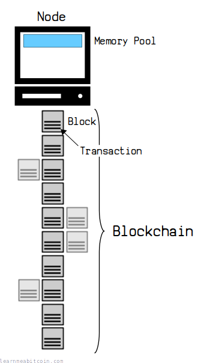
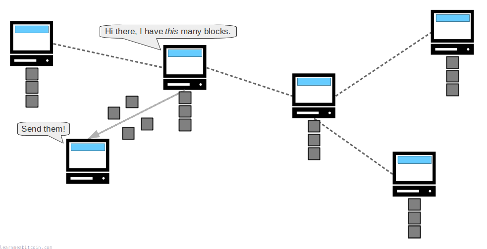
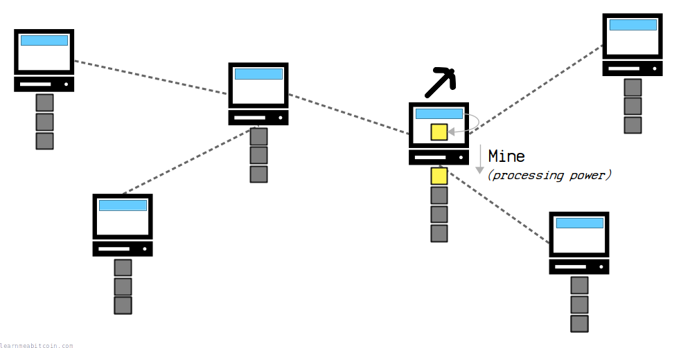
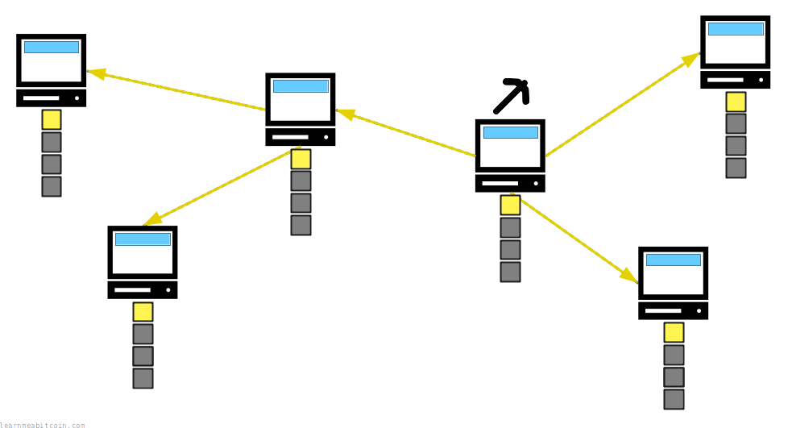
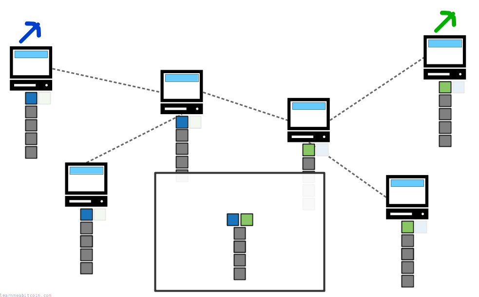
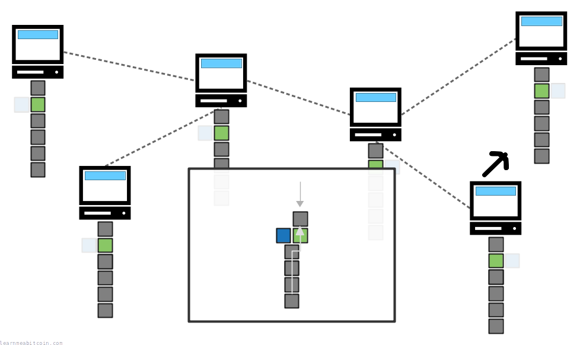
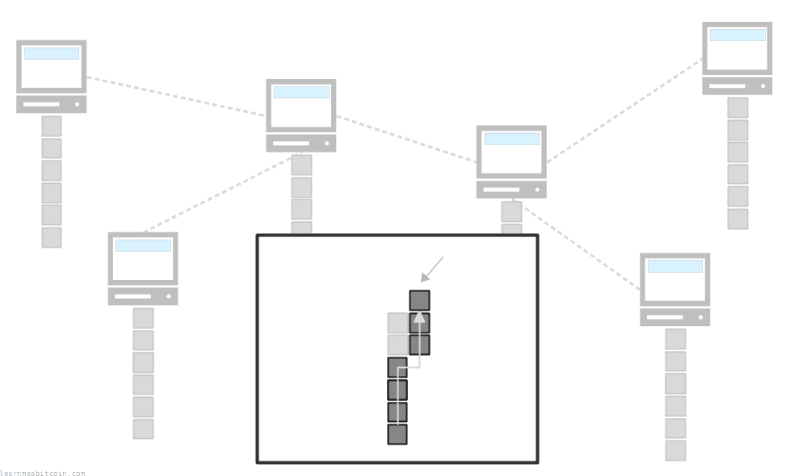
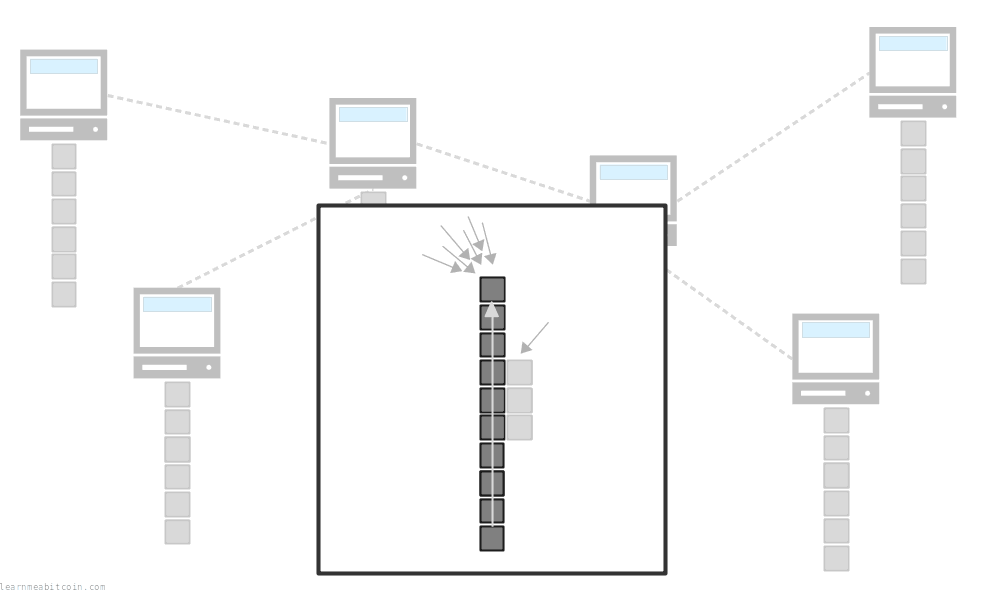
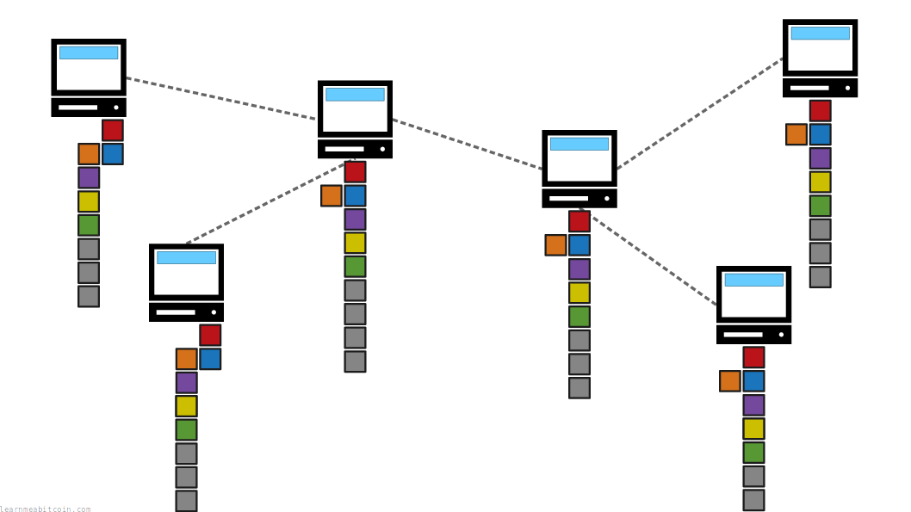

Current Blockchain Size:

856.92 GB

956,479 blocks

Note: This is the size of the blockchain for my local node.  
The size of your blockchain will differ depending on how many [chain reorganizations](/docs/technical/blockchain/chain-reorganization.md) your node has experienced and how many [stale blocks](/docs/technical/blockchain/chain-reorganization.md#stale-blocks) you have stored on disk.

The blockchain is a file of [transactions](/docs/technical/transaction.md). It's the most important file that a bitcoin node maintains.

It is called the "blockchain" because new transactions are added to the file in [blocks](/docs/technical/block.md), and these blocks are built on top of one another to create a *chain* of blocks. Hence, blockchain.

But ultimately, the blockchain is **permanent storage for bitcoin transactions**.

## Live Bitcoin Blockchain:

Tip: 956,479 (0 blocks away) ⇈

Next 0 blocks ↑

| [Height](/docs/technical/blockchain/height.md) | [Block Hash](/docs/technical/block/hash.md) | Txs | Size | Avg [Feerate](/docs/technical/transaction/fee.md#sats-per-vbyte) AFR | Time (UTC) |
| --- | --- | --- | --- | --- | --- |
| [956,479](/explorer/block/000000000000000000005af9d7cca01756b552b02e5f5fac6422864439807264) 956,479 | [000000000000000000005af9d7cca01756b552b02e5f5fac6422864439807264](/explorer/block/000000000000000000005af9d7cca01756b552b02e5f5fac6422864439807264) | 6,825 | 1.00/1.00 vMB | 0 | 51 mins, 14 secs ago |
| [956,478](/explorer/block/000000000000000000000af753580e7b7bd555102cfbe9c72b4b625dbd3f48d8) 956,478 | [000000000000000000000af753580e7b7bd555102cfbe9c72b4b625dbd3f48d8](/explorer/block/000000000000000000000af753580e7b7bd555102cfbe9c72b4b625dbd3f48d8) | 1,734 | 0.43/1.00 vMB | 3 | 53 mins, 31 secs ago |
| [956,477](/explorer/block/000000000000000000002c0a4bbbd933f15946021264162b74ce5c45b49a2100) 956,477 | [000000000000000000002c0a4bbbd933f15946021264162b74ce5c45b49a2100](/explorer/block/000000000000000000002c0a4bbbd933f15946021264162b74ce5c45b49a2100) | 5,826 | 1.00/1.00 vMB | 1 | 59 mins, 39 secs ago |
| [956,476](/explorer/block/000000000000000000000be1b133d433b3e0b0bf69f9368c20715ccf22ce85ce) 956,476 | [000000000000000000000be1b133d433b3e0b0bf69f9368c20715ccf22ce85ce](/explorer/block/000000000000000000000be1b133d433b3e0b0bf69f9368c20715ccf22ce85ce) | 4,861 | 1.00/1.00 vMB | 1 | 1 hr, 4 mins ago |
| [956,475](/explorer/block/000000000000000000000aad5f4e9a1b745a856f53e4c613253b8275284221e9) 956,475 | [000000000000000000000aad5f4e9a1b745a856f53e4c613253b8275284221e9](/explorer/block/000000000000000000000aad5f4e9a1b745a856f53e4c613253b8275284221e9) | 5,870 | 1.00/1.00 vMB | 0 | 1 hr, 10 mins ago |
| [956,474](/explorer/block/000000000000000000001075120ee6594b359a02eda683e7c1ec3830838e281a) 956,474 | [000000000000000000001075120ee6594b359a02eda683e7c1ec3830838e281a](/explorer/block/000000000000000000001075120ee6594b359a02eda683e7c1ec3830838e281a) | 4,675 | 1.00/1.00 vMB | 2 | 03 Jul 2026, 08:56 |
| [956,473](/explorer/block/00000000000000000001d570b3ae04d7465553432cd3566e0f879056df68ea86) 956,473 | [00000000000000000001d570b3ae04d7465553432cd3566e0f879056df68ea86](/explorer/block/00000000000000000001d570b3ae04d7465553432cd3566e0f879056df68ea86) | 3,570 | 1.00/1.00 vMB | 2 | 03 Jul 2026, 08:45 |
| [956,472](/explorer/block/00000000000000000001b9c4dc446b059b686ba5a38bd1e5cf4692d4420e2f54) 956,472 | [00000000000000000001b9c4dc446b059b686ba5a38bd1e5cf4692d4420e2f54](/explorer/block/00000000000000000001b9c4dc446b059b686ba5a38bd1e5cf4692d4420e2f54) | 4,539 | 1.00/1.00 vMB | 3 | 03 Jul 2026, 08:35 |
| [956,471](/explorer/block/000000000000000000006124edc0696e0918b53eb5132f0728f34a50f1fd24d5) 956,471 | [000000000000000000006124edc0696e0918b53eb5132f0728f34a50f1fd24d5](/explorer/block/000000000000000000006124edc0696e0918b53eb5132f0728f34a50f1fd24d5) | 4,811 | 1.00/1.00 vMB | 1 | 03 Jul 2026, 08:10 |
| [956,470](/explorer/block/00000000000000000001ec048885e8386fd3d5b1f56248214e40586b57f80691) 956,470 | [00000000000000000001ec048885e8386fd3d5b1f56248214e40586b57f80691](/explorer/block/00000000000000000001ec048885e8386fd3d5b1f56248214e40586b57f80691) | 4,361 | 1.00/1.00 vMB | 1 | 03 Jul 2026, 08:02 |
| [956,469](/explorer/block/000000000000000000005be2d95a0d27c094beafdb1b8c2bf7ca66835904ce24) 956,469 | [000000000000000000005be2d95a0d27c094beafdb1b8c2bf7ca66835904ce24](/explorer/block/000000000000000000005be2d95a0d27c094beafdb1b8c2bf7ca66835904ce24) | 3,817 | 1.00/1.00 vMB | 3 | 03 Jul 2026, 07:57 |
| [956,468](/explorer/block/0000000000000000000169558ed73978cbd4158e8a519b6d419ee2f02a864edb) 956,468 | [0000000000000000000169558ed73978cbd4158e8a519b6d419ee2f02a864edb](/explorer/block/0000000000000000000169558ed73978cbd4158e8a519b6d419ee2f02a864edb) | 5,364 | 1.00/1.00 vMB | 0 | 03 Jul 2026, 07:37 |
| [956,467](/explorer/block/0000000000000000000097fa1a5fec797ddc890357ee11d291590175b15c10c7) 956,467 | [0000000000000000000097fa1a5fec797ddc890357ee11d291590175b15c10c7](/explorer/block/0000000000000000000097fa1a5fec797ddc890357ee11d291590175b15c10c7) | 6,453 | 1.00/1.00 vMB | 1 | 03 Jul 2026, 07:35 |
| [956,466](/explorer/block/000000000000000000002d17cb7d778198a0aa3431b3b46d51b59ca634e776e2) 956,466 | [000000000000000000002d17cb7d778198a0aa3431b3b46d51b59ca634e776e2](/explorer/block/000000000000000000002d17cb7d778198a0aa3431b3b46d51b59ca634e776e2) | 4,261 | 1.00/1.00 vMB | 2 | 03 Jul 2026, 07:32 |
| [956,465](/explorer/block/000000000000000000010a9a845dc3848addcc57f10100433084f3569135e3ee) 956,465 | [000000000000000000010a9a845dc3848addcc57f10100433084f3569135e3ee](/explorer/block/000000000000000000010a9a845dc3848addcc57f10100433084f3569135e3ee) | 7,018 | 1.00/1.00 vMB | 0 | 03 Jul 2026, 07:15 |
| [956,464](/explorer/block/0000000000000000000164651ea5612d3393a9b03e9316c68622c52bae3a9474) 956,464 | [0000000000000000000164651ea5612d3393a9b03e9316c68622c52bae3a9474](/explorer/block/0000000000000000000164651ea5612d3393a9b03e9316c68622c52bae3a9474) | 6,392 | 1.00/1.00 vMB | 0 | 03 Jul 2026, 07:14 |
| [956,463](/explorer/block/000000000000000000017fbfc4a1bf42a917d87131169dcdcaa2cf74f5e4375d) 956,463 | [000000000000000000017fbfc4a1bf42a917d87131169dcdcaa2cf74f5e4375d](/explorer/block/000000000000000000017fbfc4a1bf42a917d87131169dcdcaa2cf74f5e4375d) | 5,684 | 1.00/1.00 vMB | 1 | 03 Jul 2026, 07:12 |
| [956,462](/explorer/block/000000000000000000013505ac1003fa61b330602facaab7cede161c8b065fad) 956,462 | [000000000000000000013505ac1003fa61b330602facaab7cede161c8b065fad](/explorer/block/000000000000000000013505ac1003fa61b330602facaab7cede161c8b065fad) | 6,220 | 1.00/1.00 vMB | 0 | 03 Jul 2026, 07:05 |
| [956,461](/explorer/block/000000000000000000014d1167cec7411a139d4310ce86132d0ff728d28bad1c) 956,461 | [000000000000000000014d1167cec7411a139d4310ce86132d0ff728d28bad1c](/explorer/block/000000000000000000014d1167cec7411a139d4310ce86132d0ff728d28bad1c) | 5,170 | 1.00/1.00 vMB | 1 | 03 Jul 2026, 07:04 |
| [956,460](/explorer/block/00000000000000000001209aeacef29b29526bcf9cffc95274676c8e198af91b) 956,460 | [00000000000000000001209aeacef29b29526bcf9cffc95274676c8e198af91b](/explorer/block/00000000000000000001209aeacef29b29526bcf9cffc95274676c8e198af91b) | 3,649 | 1.00/1.00 vMB | 1 | 03 Jul 2026, 06:59 |
| [956,459](/explorer/block/0000000000000000000098f2e73eb0fcbb5301edda9392b2fe08dad2b1b64be8) 956,459 | [0000000000000000000098f2e73eb0fcbb5301edda9392b2fe08dad2b1b64be8](/explorer/block/0000000000000000000098f2e73eb0fcbb5301edda9392b2fe08dad2b1b64be8) | 3,963 | 1.00/1.00 vMB | 3 | 03 Jul 2026, 06:57 |

Previous 10 blocks ↓

Total Size: 856.92 GB

## Download

How do you get a copy of the blockchain?

The easiest way to get a copy of the blockchain is to run a Bitcoin node.

When you run the Bitcoin program (e.g. [Bitcoin Core](https://bitcoin.org/en/bitcoin-core/)) your node will automatically download blocks from other nodes on the network until you have an up-to-date copy of the blockchain on your computer.

When nodes [connect](/docs/technical/networking.md) to each other, they tell each other the *height* of their chain (how many blocks they have) during the initial [handshake](/docs/technical/networking.md#handshake). If another node has more blocks than you, your node will request these blocks from the other nodes until you have a full copy of the blockchain.

As a result, nodes are constantly communicating with each other to replicate the blockchain across every computer on the network.

There is no single or definitive version of "the blockchain". Every node keeps their own local copy of the blockchain, and it can vary from computer to computer at any given time.

It can take a while to download the full blockchain when you run Bitcoin for the first time. This is referred to as the [Initial Block Download](https://btcinformation.org/en/developer-guide#initial-block-download) (IBD).

## [Mining](/docs/technical/mining.md)

How are new blocks added to the blockchain?

New blocks of transactions must be [mined](/docs/technical/mining.md) on to the blockchain.

In short, the process of mining involves collecting transactions from the [memory pool](/docs/technical/mining/memory-pool.md) into a [candidate block](/docs/technical/mining/candidate-block.md), and then using *processing power* to produce a [block hash](/docs/technical/block/hash.md) that is below a specific [target](/docs/technical/mining/target.md) value. This means that any node on the network can mine a new block, but you need to *use energy* to be able to do so.

 Block Hash

Random Example

Block Header

`0 bytes`

Block Hash (Natural Byte Order)

Used internally inside raw block headers

`0 bytes`

Block Hash (Reverse Byte Order)

Used externally when searching for blocks on block explorers

`0 bytes`

0 secs

 Target Adjustment

Previous Adjustment
Current Target

0x

`0 bytes`

Time (seconds)

Actual

0d

Expected

0d

The target adjustment period is 2016 blocks. A block is mined on average every 600 seconds (10 minutes), so the expected time is 2016 \* 600 = 1209600 seconds.

Ratio

The *actual* time divided by the *expected* time. We multiply the current target by this ratio to get the new target.

New Target (Full Precision)

0x

New Target

0x

`0 bytes`

Note: This target value has been truncated slightly for storage in the bits field of the block header, and that's the target value that's actually used when mining.

0 secs

When a node (or "miner") successfully mines a new block, they will share it with the other nodes on the network. When other nodes receive this new block, they will add it to their blockchain, and miners will start trying to mine a new block *on top* of it.

As a result, miners are constantly working to extend the blockchain with new blocks of transactions.

* Due to the processing power required to mine a block and the regularly adjusting target, new blocks are added to the blockchain once every **10 minutes** (on average).
* A node doesn't have to try and mine new blocks. Instead, it can just keep a copy of the blockchain and relay new blocks to other nodes when it receives them.

Here's a [video on how mining works in Bitcoin](https://www.youtube.com/watch?v=f9EbD6iY9zI&t=140s).

## [Chain Reorganizations](/docs/technical/blockchain/chain-reorganization.md)

Can two blocks be mined at the same time?

As the blockchain is being built, it's perfectly normal for two blocks to be mined at the same time.

If two blocks are mined at the same time it will cause a temporary "fork" in the chain.

In this situation, nodes will consider the **first** block they receive as part of their blockchain, but also keep the second block they receive *just in case*. However, the second block to arrive (and the transactions inside it) will not be considered as part of their *active* blockchain.

Consequently, nodes on the network will be in temporary disagreement about which of these two blocks belongs at the top of the chain.

This disagreement is resolved when the next block is mined. The next block will be built on top of *one* of these blocks, creating a new [longest chain](/docs/technical/blockchain/longest-chain.md) of blocks, and as a rule **nodes will always adopt the longest known chain of blocks** as their active blockchain.

As a result, nodes with the shorter chain will perform a [chain reorganization](/docs/technical/blockchain/chain-reorganization.md) to move out blocks from their old active chain in favor of blocks that make up a new longer chain.

A fork is resolved when a new block is mined, as this will create a new longest chain.

So although there may be disagreements across the network about which block(s) belong at the top of the blockchain at any given time, the mining of new blocks and the adoption of the longest chain means that nodes will always eventually be in sync.

**A temporary fork like this is rare.** This happens about once a month (roughly), and usually only affects the top block on the blockchain.

## [Longest Chain](/docs/technical/blockchain/longest-chain.md)

Can blocks in the blockchain be replaced?

Due to the way the blockchain is built, it's **possible for blocks at the top of the chain to be replaced**.

Nodes always adopt the [longest chain](/docs/technical/blockchain/longest-chain.md) as the "true" version of the blockchain. Therefore, you could always try and build a new longer chain of blocks to replace an existing one, and every node on the network will adopt it.

As a result, this allows you to "undo" or reverse a bitcoin transaction from the blockchain.

If you build a new longest chain of blocks, other nodes will adopt it as their blockchain.

However, the problem is that all miners are incentivized to always be building on top of the longest known chain. This means that the combined processing power of miners on the network will be focused on building one single chain, which will be built faster than any chain you could build on your own.

Miners naturally work to extend the current longest chain.

In other words, the combined processing power of the network working to build the blockchain helps to protect blocks (and transactions) that have already been mined on to the blockchain.

So the only way you could perform an intentional chain reorganization (to "undo" a transaction in an existing block) would be to have more processing power than every other miner combined so that you could out-mine the network and build a longer chain for everyone to adopt. This is referred to as a "[51% Attack](/docs/technical/blockchain/51-attack.md)".

Nobody has performed a successful 51% attack on the Bitcoin blockchain.

## Location

Where is the blockchain stored?

If you're running a Bitcoin Core node, the blockchain files can be found in the following location on your computer:

* **Linux**: `~/.bitcoin/blocks/`
* **Mac**: `~/Library/Application Support/Bitcoin/blocks/`
* **Windows**:
  + `C:\Users\[username]\AppData\Roaming\Bitcoin\blocks\` ([v27.2](https://github.com/bitcoin/bitcoin/blob/master/doc/release-notes/release-notes-27.2.md) and below)
  + `C:\Users\[username]\AppData\Local\Bitcoin\blocks\` ([v28.0](https://github.com/bitcoin/bitcoin/blob/master/doc/release-notes/release-notes-28.0.md) onwards)

The blockchain is split into multiple files named `blk00000.dat`, `blk00001.dat`, `blk00002.dat`, and so on. This is because it's easier to work with multiple small files than it is to work with one giant file. See [blk.dat](/docs/technical/block/blkdat.md) for details.

## Summary

Click on the image to see a nice and slow visualization of a blockchain being built over time, including a chain reorganization.

The blockchain is permanent storage for bitcoin [transactions](/docs/technical/transaction.md). New transactions are added to the file in [blocks](/docs/technical/block.md), and these blocks are built on top of each other to create a *chain*.

New blocks are added to the blockchain through [mining](/docs/technical/mining.md), which involves the use of computer processing power. This means it takes energy to mine a block, but any node can work to try and add the next block on to the chain.

When a new block is mined, it will be relayed across the [network](/docs/technical/networking.md), which nodes will verify and add on to their chain. This makes the blockchain a constantly growing ledger of transactions, distributed across multiple computers on a network.

Nodes always adopt the [longest chain](/docs/technical/blockchain/longest-chain.md) of blocks as the active version of the blockchain, which resolves disagreements about which blocks belong at the top of the chain. This also protects blocks that are already in the blockchain, as it would require large amounts of energy to build a chain that replaces blocks lower down in the chain.

The mechanism of mining and adopting the longest chain **allows multiple computers over a network to agree on the same set of blocks and transactions**, whilst also making it difficult for anyone to make historic changes to the blocks (and therefore transactions) in the blockchain.

As a result the blockchain is a secure, distributed, and regularly updated file of transactions.

## Resources

* [Why are blk\*.dat files ~134200000 bytes?](https://bitcoin.stackexchange.com/questions/50693/why-are-blk-dat-files-134200000-bytes)