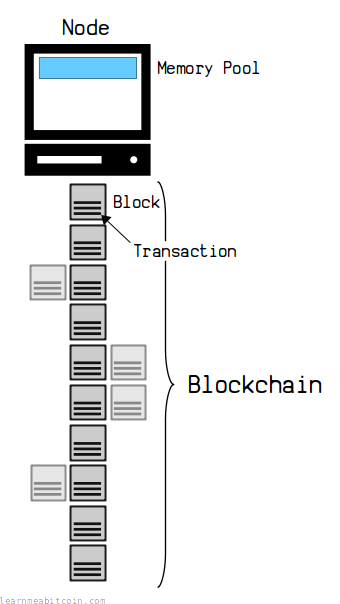
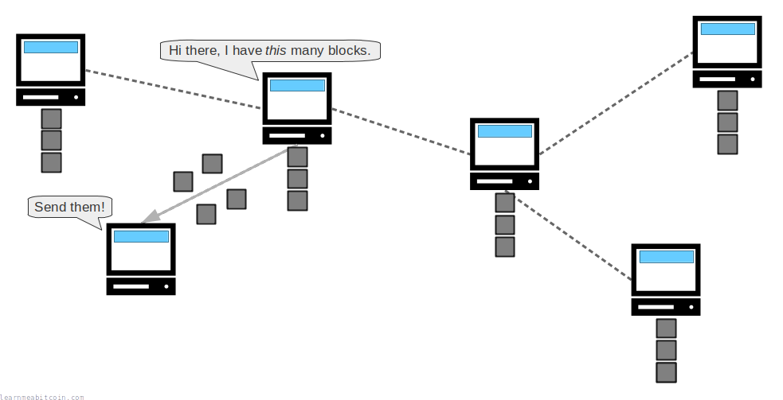
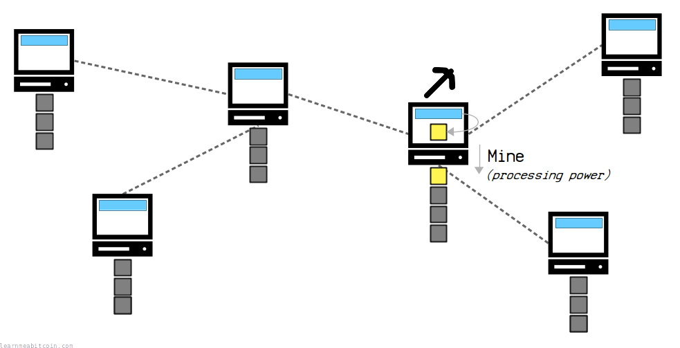
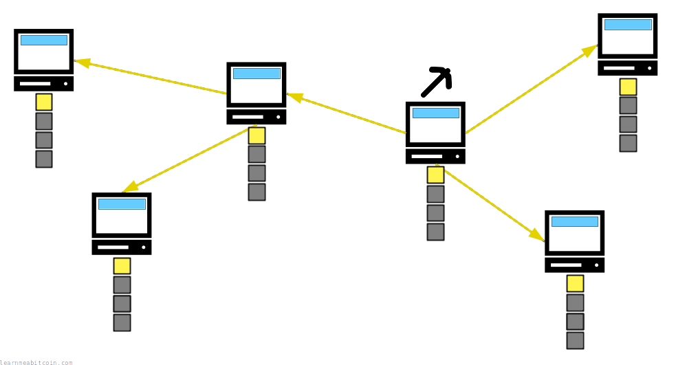
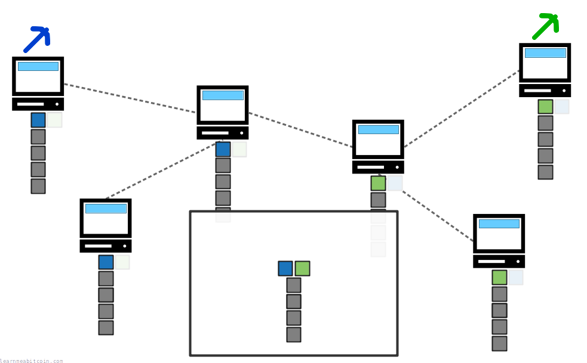
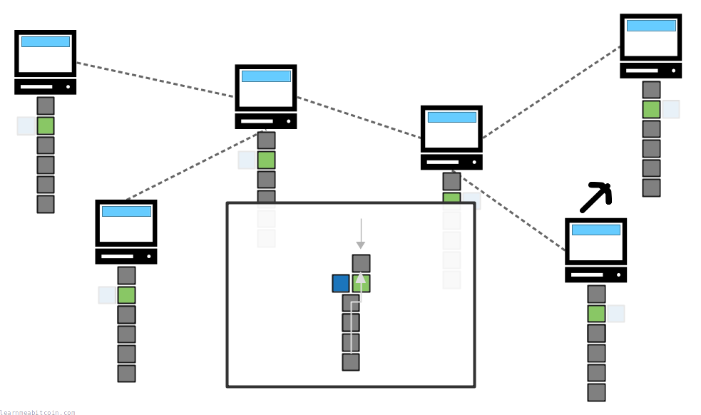
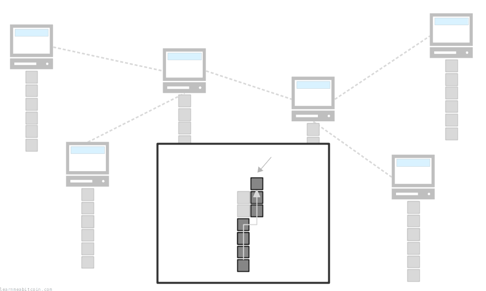
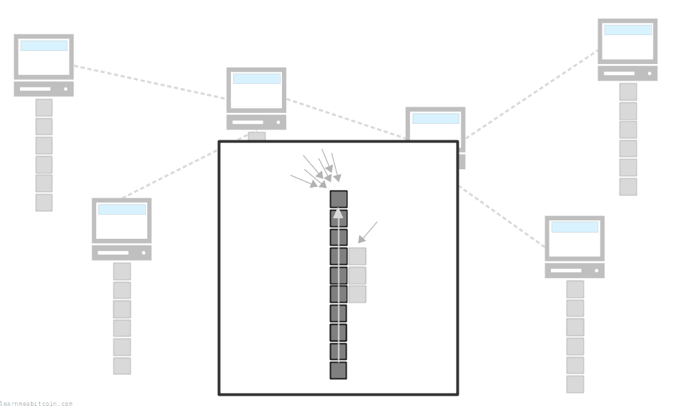
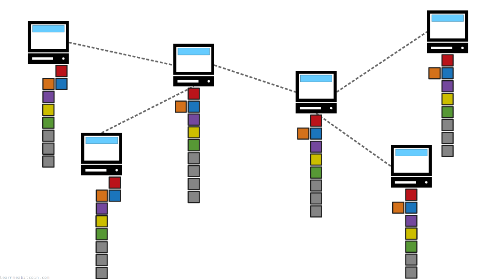

# 区块链总览 (Blockchain)

当前区块链大小 (Current Blockchain Size):

856.92 GB

956,479 blocks

注意：这是我本地节点的区块链大小。
您的区块链大小会有所不同，取决于您的节点经历了多少次[链重组 (chain reorganizations)](blockchain/chain-reorganization.md)，以及您在磁盘上存储了多少个[陈腐区块 (stale blocks)](blockchain/chain-reorganization.md#stale-blocks)。

区块链是一个由[交易 (transactions)](transaction.md)组成的文件。它是比特币节点维护的最重要的文件。

它被称为“区块链 (blockchain)”，因为新交易被包含在[区块 (blocks)](block.md)中添加到文件中，并且这些区块相互叠加，形成了一个区块的*链条*。因此称为区块链。

但归根结底，区块链是**比特币交易的永久存储 (permanent storage for bitcoin transactions)**。

## 实时比特币区块链 (Live Bitcoin Blockchain):

顶端 (Tip): 956,479 (距离 0 个区块) ⇈

接下来 0 个区块 ↑

| [高度 (Height)](blockchain/height.md) | [区块哈希 (Block Hash)](block/hash.md) | 交易数 (Txs) | 大小 (Size) | 平均[费率 (Feerate)](transaction/fee.md#sats-per-vbyte) AFR | 时间 (UTC) |
| --- | --- | --- | --- | --- | --- |
| [956,479](/explorer/block/000000000000000000005af9d7cca01756b552b02e5f5fac6422864439807264) 956,479 | [000000000000000000005af9d7cca01756b552b02e5f5fac6422864439807264](/explorer/block/000000000000000000005af9d7cca01756b552b02e5f5fac6422864439807264) | 6,825 | 1.00/1.00 vMB | 0 | 51 mins, 14 secs ago |
| [956,478](/explorer/block/000000000000000000000af753580e7b7bd555102cfbe9c72b4b625dbd3f48d8) 956,478 | [000000000000000000000af753580e7b7bd555102cfbe9c72b4b625dbd3f48d8](/explorer/block/000000000000000000000af753580e7b7bd555102cfbe9c72b4b625dbd3f48d8) | 1,734 | 0.43/1.00 vMB | 3 | 53 mins, 31 secs ago |
| [956,477](/explorer/block/000000000000000000002c0a4bbbd933f15946021264162b74ce5c45b49a2100) 956,477 | [000000000000000000002c0a4bbbd933f15946021264162b74ce5c45b49a2100](/explorer/block/000000000000000000002c0a4bbbd933f15946021264162b74ce5c45b49a2100) | 5,826 | 1.00/1.00 vMB | 1 | 59 mins, 39 secs ago |
| [956,476](/explorer/block/000000000000000000000be1b133d433b3e0b0bf69f9368c20715ccf22ce85ce) 956,476 | [000000000000000000000be1b133d433b3e0b0bf69f9368c20715ccf22ce85ce](/explorer/block/000000000000000000000be1b133d433b3e0b0bf69f9368c20715ccf22ce85ce) | 4,861 | 1.00/1.00 vMB | 1 | 1 hr, 4 mins ago |
| [956,475](/explorer/block/000000000000000000000aad5f4e9a1b745a856f53e4c613253b8275284221e9) 956,475 | [000000000000000000000aad5f4e9a1b745a856f53e4c613253b8275284221e9](/explorer/block/000000000000000000000aad5f4e9a1b745a856f53e4c613253b8275284221e9) | 5,870 | 1.00/1.00 vMB | 0 | 1 hr, 10 mins ago |
| [956,474](/explorer/block/000000000000000000001075120ee6594b359a02eda683e7c1ec3830838e281a) 956,474 | [000000000000000000001075120ee6594b359a02eda683e7c1ec3830838e281a](/explorer/block/000000000000000000001075120ee6594b359a02eda683e7c1ec3830838e281a) | 4,675 | 1.00/1.00 vMB | 2 | 03 Jul 2026, 08:56 |
| [956,473](/explorer/block/00000000000000000001d570b3ae04d7465553432cd3566e0f879056df68ea86) 956,473 | [00000000000000000001d570b3ae04d7465553432cd3566e0f879056df68ea86](/explorer/block/00000000000000000001d570b3ae04d7465553432cd3566e0f879056df68ea86) | 3,570 | 1.00/1.00 vMB | 2 | 03 Jul 2026, 08:45 |
| [956,472](/explorer/block/00000000000000000001b9c4dc446b059b686ba5a38bd1e5cf4692d4420e2f54) 956,472 | [00000000000000000001b9c4dc446b059b686ba5a38bd1e5cf4692d4420e2f54](/explorer/block/00000000000000000001b9c4dc446b059b686ba5a38bd1e5cf4692d4420e2f54) | 4,539 | 1.00/1.00 vMB | 3 | 03 Jul 2026, 08:35 |
| [956,471](/explorer/block/000000000000000000006124edc0696e0918b53eb5132f0728f34a50f1fd24d5) 956,471 | [000000000000000000006124edc0696e0918b53eb5132f0728f34a50f1fd24d5](/explorer/block/000000000000000000006124edc0696e0918b53eb5132f0728f34a50f1fd24d5) | 4,811 | 1.00/1.00 vMB | 1 | 03 Jul 2026, 08:10 |
| [956,470](/explorer/block/00000000000000000001ec048885e8386fd3d5b1f56248214e40586b57f80691) 956,470 | [00000000000000000001ec048885e8386fd3d5b1f56248214e40586b57f80691](/explorer/block/00000000000000000001ec048885e8386fd3d5b1f56248214e40586b57f80691) | 4,361 | 1.00/1.00 vMB | 1 | 03 Jul 2026, 08:02 |
| [956,469](/explorer/block/000000000000000000005be2d95a0d27c094beafdb1b8c2bf7ca66835904ce24) 956,469 | [000000000000000000005be2d95a0d27c094beafdb1b8c2bf7ca66835904ce24](/explorer/block/000000000000000000005be2d95a0d27c094beafdb1b8c2bf7ca66835904ce24) | 3,817 | 1.00/1.00 vMB | 3 | 03 Jul 2026, 07:57 |
| [956,468](/explorer/block/0000000000000000000169558ed73978cbd4158e8a519b6d419ee2f02a864edb) 956,468 | [0000000000000000000169558ed73978cbd4158e8a519b6d419ee2f02a864edb](/explorer/block/0000000000000000000169558ed73978cbd4158e8a519b6d419ee2f02a864edb) | 5,364 | 1.00/1.00 vMB | 0 | 03 Jul 2026, 07:37 |
| [956,467](/explorer/block/0000000000000000000097fa1a5fec797ddc890357ee11d291590175b15c10c7) 956,467 | [0000000000000000000097fa1a5fec797ddc890357ee11d291590175b15c10c7](/explorer/block/0000000000000000000097fa1a5fec797ddc890357ee11d291590175b15c10c7) | 6,453 | 1.00/1.00 vMB | 1 | 03 Jul 2026, 07:35 |
| [956,466](/explorer/block/000000000000000000002d17cb7d778198a0aa3431b3b46d51b59ca634e776e2) 956,466 | [000000000000000000002d17cb7d778198a0aa3431b3b46d51b59ca634e776e2](/explorer/block/000000000000000000002d17cb7d778198a0aa3431b3b46d51b59ca634e776e2) | 4,261 | 1.00/1.00 vMB | 2 | 03 Jul 2026, 07:32 |
| [956,465](/explorer/block/000000000000000000010a9a845dc3848addcc57f10100433084f3569135e3ee) 956,465 | [000000000000000000010a9a845dc3848addcc57f10100433084f3569135e3ee](/explorer/block/000000000000000000010a9a845dc3848addcc57f10100433084f3569135e3ee) | 7,018 | 1.00/1.00 vMB | 0 | 03 Jul 2026, 07:15 |
| [956,464](/explorer/block/0000000000000000000164651ea5612d3393a9b03e9316c68622c52bae3a9474) 956,464 | [0000000000000000000164651ea5612d3393a9b03e9316c68622c52bae3a9474](/explorer/block/0000000000000000000164651ea5612d3393a9b03e9316c68622c52bae3a9474) | 6,392 | 1.00/1.00 vMB | 0 | 03 Jul 2026, 07:14 |
| [956,463](/explorer/block/000000000000000000017fbfc4a1bf42a917d87131169dcdcaa2cf74f5e4375d) 956,463 | [000000000000000000017fbfc4a1bf42a917d87131169dcdcaa2cf74f5e4375d](/explorer/block/000000000000000000017fbfc4a1bf42a917d87131169dcdcaa2cf74f5e4375d) | 5,684 | 1.00/1.00 vMB | 1 | 03 Jul 2026, 07:12 |
| [956,462](/explorer/block/000000000000000000013505ac1003fa61b330602facaab7cede161c8b065fad) 956,462 | [000000000000000000013505ac1003fa61b330602facaab7cede161c8b065fad](/explorer/block/000000000000000000013505ac1003fa61b330602facaab7cede161c8b065fad) | 6,220 | 1.00/1.00 vMB | 0 | 03 Jul 2026, 07:05 |
| [956,461](/explorer/block/000000000000000000014d1167cec7411a139d4310ce86132d0ff728d28bad1c) 956,461 | [000000000000000000014d1167cec7411a139d4310ce86132d0ff728d28bad1c](/explorer/block/000000000000000000014d1167cec7411a139d4310ce86132d0ff728d28bad1c) | 5,170 | 1.00/1.00 vMB | 1 | 03 Jul 2026, 07:04 |
| [956,460](/explorer/block/00000000000000000001209aeacef29b29526bcf9cffc95274676c8e198af91b) 956,460 | [00000000000000000001209aeacef29b29526bcf9cffc95274676c8e198af91b](/explorer/block/00000000000000000001209aeacef29b29526bcf9cffc95274676c8e198af91b) | 3,649 | 1.00/1.00 vMB | 1 | 03 Jul 2026, 06:59 |
| [956,459](/explorer/block/0000000000000000000098f2e73eb0fcbb5301edda9392b2fe08dad2b1b64be8) 956,459 | [0000000000000000000098f2e73eb0fcbb5301edda9392b2fe08dad2b1b64be8](/explorer/block/0000000000000000000098f2e73eb0fcbb5301edda9392b2fe08dad2b1b64be8) | 3,963 | 1.00/1.00 vMB | 3 | 03 Jul 2026, 06:57 |

之前 10 个区块 (Previous 10 blocks) ↓

总大小 (Total Size): 856.92 GB

## 下载 (Download)

您如何获得区块链的副本？

获得区块链副本的最简单方法是运行一个比特币节点。

当您运行比特币程序（例如 [Bitcoin Core](https://bitcoin.org/en/bitcoin-core/)）时，您的节点将自动从网络上的其他节点下载区块，直到您的计算机上拥有最新版本的区块链副本。

当节点彼此[连接 (connect)](networking.md)时，它们会在初始[握手 (handshake)](networking.md#handshake)期间互相告知它们链的*高度*（它们拥有的区块数量）。如果另一个节点的区块比您多，您的节点将向其他节点请求这些区块，直到您拥有区块链的完整副本。

因此，节点会不断地相互通信，以便在网络上的每台计算机之间复制区块链。

并不存在单一或最终版本的“区块链”。每个节点都保留它们自己的本地区块链副本，在任何给定时间，不同的计算机上的副本可能会有所不同。

当您第一次运行比特币时，下载完整的区块链可能需要一段时间。这被称为[初始区块下载 (Initial Block Download)](https://btcinformation.org/en/developer-guide#initial-block-download) (IBD)。

## [挖矿 (Mining)](mining.md)

如何将新区块添加到区块链？

包含交易的新区块必须被[挖 (mined)](mining.md)到区块链上。

简而言之，挖矿的过程包括将交易从[内存池 (memory pool)](mining/memory-pool.md)收集到一个[候选区块 (candidate block)](mining/candidate-block.md)中，然后使用*处理能力*生成一个低于特定[目标 (target)](mining/target.md)值的[区块哈希 (block hash)](block/hash.md)。这意味着网络上的任何节点都可以挖掘新区块，但您需要*耗费能量*才能做到。

| 字段 (Field) | 值 (Value) |
| --- | --- |
| 区块头 (Block Header) | `0 bytes` |
| 区块哈希 (自然字节序) (Block Hash (Natural Byte Order)) | 在原始区块头内部使用 `0 bytes` |
| 区块哈希 (反转字节序) (Block Hash (Reverse Byte Order)) | 在区块浏览器上搜索区块时在外部使用 `0 bytes` |

| 字段 (Field) | 值 (Value) |
| --- | --- |
| 当前目标 (Current Target) | 0x `0 bytes` |
| 时间（秒） 实际 (Time (seconds) Actual) | 0d |
| 时间（秒） 预期 (Time (seconds) Expected) | 0d  目标调整周期为 2016 个区块。平均每 600 秒（10 分钟）挖出一个区块，因此预期时间为 2016 \* 600 = 1209600 秒。 |
| 比率 (Ratio) | *实际*时间除以*预期*时间。我们将当前目标乘以这个比率以获得新目标。 |
| 新目标 (全精度) (New Target (Full Precision)) | 0x |
| 新目标 (New Target) | 0x `0 bytes`  注意：这个目标值被略微截断以存储在区块头的 bits 字段中，这是实际挖矿时使用的目标值。 |

当一个节点（或“矿工”）成功挖出一个新区块时，他们会将其分享给网络上的其他节点。当其他节点接收到这个新区块时，他们会将其添加到自己的区块链中，然后矿工们将开始尝试*在这个新区块之上*挖出一个新区块。

因此，矿工们不断努力利用新的交易区块来延长区块链。

* 由于挖出一个区块所需的处理能力以及定期调整的目标，平均每 **10 分钟**就会有一个新区块添加到区块链中。
* 节点不必尝试挖掘新区块。相反，它只需保留区块链的副本并在收到新区块时将其转发给其他节点即可。

这里有一段[关于比特币挖矿工作原理的视频 (video on how mining works in Bitcoin)](https://www.youtube.com/watch?v=f9EbD6iY9zI&t=140s)。

## [链重组 (Chain Reorganizations)](blockchain/chain-reorganization.md)

两个区块可以同时被挖出吗？

在区块链的构建过程中，两个区块同时被挖出是完全正常的。

如果两个区块同时被挖出，它将导致链上的暂时“分叉”。

在这种情况下，节点会将他们接收到的**第一个**区块视为其区块链的一部分，但也会保留接收到的第二个区块*以防万一*。然而，后到达的第二个区块（以及其中的交易）不会被视为其*活跃*区块链的一部分。

因此，网络上的节点将暂时对这两个区块中哪一个属于链的顶端存在分歧。

当下一个区块被挖出时，这种分歧将得到解决。下一个区块将建立在其中*一个*区块之上，从而创建一个新的[最长区块链 (longest chain)](blockchain/longest-chain.md)，通常来说，**节点始终会采用已知的最长区块链**作为其活跃的区块链。

因此，拥有较短链的节点将执行[链重组 (chain reorganization)](blockchain/chain-reorganization.md)，从其旧的活跃链中移出区块，转而支持构成新的较长链的区块。

当新区块被挖出时，分叉就会被解决，因为这将创造一条新的最长链。

因此，尽管整个网络对于在任何给定时间哪个（或哪些）区块属于区块链顶端可能存在分歧，但新区块的挖掘和最长链的采用意味着节点最终将始终保持同步。

**像这样的临时分叉很少见。** 这大约每个月发生一次，通常只影响区块链上的顶端区块。

## [最长链 (Longest Chain)](blockchain/longest-chain.md)

区块链中的区块可以被替换吗？

由于区块链的构建方式，**链顶端的区块是有可能被替换的**。

节点始终采用[最长链 (longest chain)](blockchain/longest-chain.md)作为区块链的“真实”版本。因此，您始终可以尝试构建一个更长的新区块链来替换现有的区块链，网络上的每个节点都会采用它。

这使您可以从区块链中“撤销 (undo)”或反转一笔比特币交易。

如果您构建了一条新的最长区块链，其他节点会将其用作他们的区块链。

然而，问题在于所有的矿工都被激励始终在已知最长链的基础上进行构建。这意味着网络上矿工的合并处理能力将集中在构建一条单一的链上，这条链的构建速度将比您自己构建的任何链都快。

矿工们自然而然地努力去延长当前的最长链。

换句话说，网络致力于构建区块链的合并处理能力，有助于保护已经挖出并添加到区块链上的区块（以及交易）。

因此，执行蓄意的链重组（以“撤销”现有区块中的一笔交易）的唯一方法是拥有比所有其他矿工总和更多的处理能力，这样您就可以超越网络的挖掘速度，构建一条更长的链供大家采用。这被称为“[51% 攻击 (51% Attack)](blockchain/51-attack.md)”。

目前还没有人成功对比特币区块链进行过 51% 攻击。

## 位置 (Location)

区块链存储在哪里？

如果您运行的是 Bitcoin Core 节点，可以在您计算机的以下位置找到区块链文件：

* **Linux**: `~/.bitcoin/blocks/`
* **Mac**: `~/Library/Application Support/Bitcoin/blocks/`
* **Windows**:
  + `C:\Users\[username]\AppData\Roaming\Bitcoin\blocks\`（[v27.2](https://github.com/bitcoin/bitcoin/blob/master/doc/release-notes/release-notes-27.2.md) 及更低版本）
  + `C:\Users\[username]\AppData\Local\Bitcoin\blocks\`（[v28.0](https://github.com/bitcoin/bitcoin/blob/master/doc/release-notes/release-notes-28.0.md) 及以后版本）

区块链被拆分成名为 `blk00000.dat`、`blk00001.dat`、`blk00002.dat` 等等多个文件。这是因为处理多个小文件比处理一个巨大的文件要容易得多。详情请见 [blk.dat](block/blkdat.md)。

## 总结 (Summary)

点击图片观看一段精美、缓慢的动画，展示随着时间推移区块链是如何构建的，其中还空间包括了一次链重组。

区块链是比特币[交易 (transactions)](transaction.md)的永久存储。新交易被包含在[区块 (blocks)](block.md)中添加到文件中，并且这些区块相互叠加以形成一条*链*。

新区块通过[挖矿 (mining)](mining.md)添加到区块链中，这需要使用计算机的处理能力。这意味着挖掘一个区块需要消耗能量，但任何节点都可以努力尝试将下一个区块添加到链上。

当新区块被挖出时，它将被中继到[网络 (network)](networking.md)中，节点将验证并将其添加到它们的链中。这使得区块链成为了一个不断增长的交易账本，分布在网络上的多台计算机中。

节点始终采用[最长的区块链 (longest chain)](blockchain/longest-chain.md)作为区块链的活跃版本，这解决了有关哪些区块属于链顶端的分歧。这也保护了已经在区块链中的区块，因为构建一条能够替换较低层区块的链需要耗费大量能量。

挖矿和采用最长链的机制**允许多台计算机在同一个网络上就相同的区块和交易集达成一致**，同时也使得任何人都难以对区块链中的历史区块（进而影响交易）进行更改。

因此，区块链是一个安全、分布式、并且定期更新的交易文件。

## 资源 (Resources)

* [为什么 blk\*.dat 文件大约是 134200000 字节？(Why are blk\*.dat files ~134200000 bytes?)](https://bitcoin.stackexchange.com/questions/50693/why-are-blk-dat-files-134200000-bytes)
