[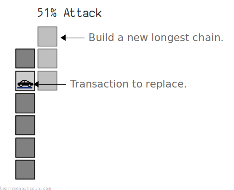](https://static.learnmeabitcoin.com/diagrams/png/blockchain-51-attack.png)

Current Network Hashrate:

958,292,360,507,524,907,008 hashes per second

See [calculation](#hashpower)

A 51% attack refers to the act of intentionally building a new [longest chain](/docs/technical/blockchain/longest-chain.md) of [blocks](/docs/technical/block.md) to replace blocks already in the [blockchain](/docs/technical/blockchain.md). This allows you to **replace [transactions](/docs/technical/transaction.md)** that have previously been [mined](/docs/technical/mining.md) into the blockchain.

This kind of attack is easiest to perform when you have a ***majority* of the mining power**, which is why it's referred to as a "majority attack" or a "51% attack".

## Method

How does a 51% attack work?

Nodes always accept the [longest known chain](/docs/technical/blockchain/longest-chain.md) of blocks as the *valid* version of the blockchain. So if you want to "undo" a transaction from the blockchain, you just need to **build a new, longer chain of blocks** *without* that transaction in it.

[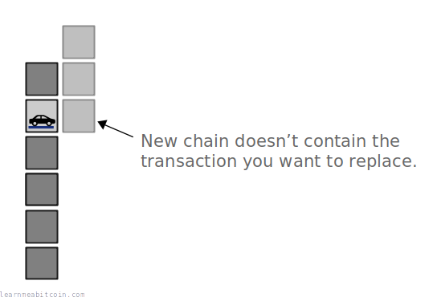](https://static.learnmeabitcoin.com/diagrams/png/blockchain-51-attack-example-build-longest-chain.png)


Let's say we paid for a car in bitcoin and drove off with it.

When nodes receive this new *longer* chain of blocks, they will perform a [chain reorganization](/docs/technical/blockchain/chain-reorganization.md) to *deactivate* blocks in their old longest chain, and *activate* the blocks in the new longest chain you have built.

[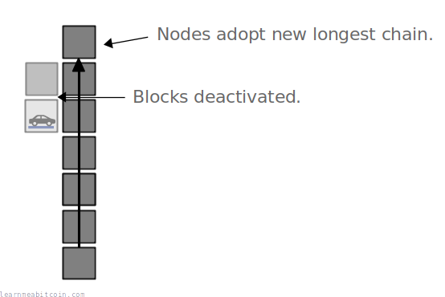](https://static.learnmeabitcoin.com/diagrams/png/blockchain-51-attack-example-chain-reorganization.png)


Transactions in the old longest chain are now invalid. It's as if the payment for the car never happened.

So by building a new longest chain to replace an existing one, you are effectively **rewriting the blockchain** and creating a new history of transactions that every node on the [network](/docs/technical/networking.md) will adopt. As a result, you have reversed transactions that we previously thought to have been a permanent part of the blockchain.

But performing a successful 51% attack is not easy.

You would want to include a *replacement* transaction in the new chain to send the bitcoins to a *new* destination (e.g. to your [address](/docs/technical/keys/address.md) and not to the car dealer's). Otherwise, the original transaction could get re-mined into the new chain.

## Prevention

What prevents a 51% attack?

Every miner is incentivized to build upon the current longest chain of blocks. So if the combined mining power of every other miner on the network is greater than yours, it makes it **incredibly difficult to outwork the other miners** to build a longer chain and replace the existing one.

[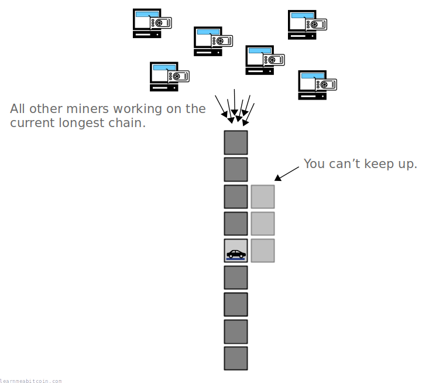](https://static.learnmeabitcoin.com/diagrams/png/blockchain-51-attack-prevention-combined-mining.png)


Miners working together can build a chain faster than you can on your own.

But of course, if you can actually acquire *more* mining power than all other miners combined, then you have the ability to outrun the current longest chain and build a new longer chain for everyone else to adopt.

[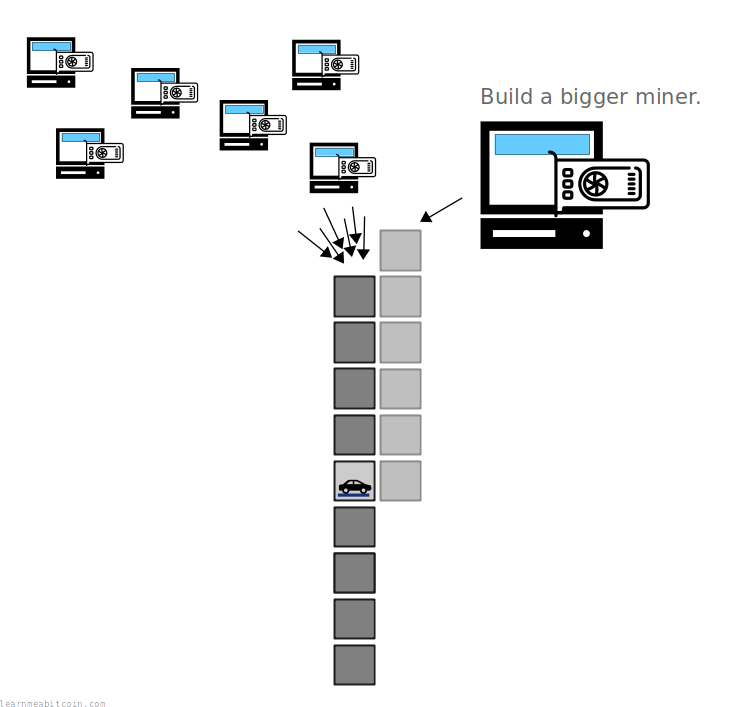](https://static.learnmeabitcoin.com/diagrams/png/blockchain-51-attack-prevention-majority-power.png)


If you have the majority of mining power, it's just a matter of time before you build a longer chain.

So to help prevent this from happening, we want to make it difficult for a single miner to acquire a majority of the mining power. This is achieved by **allowing anyone in the world to mine**, and offering a **[block reward](/docs/technical/mining/block-reward.md) as an incentive** to build on the longest known chain.

[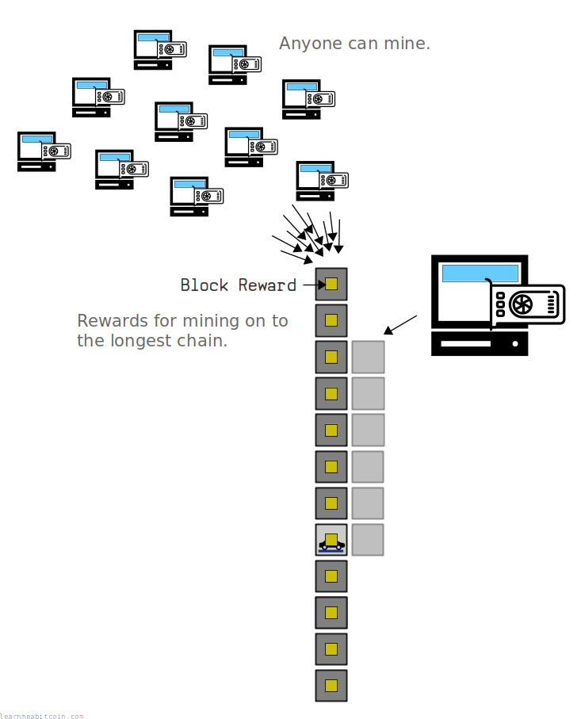](https://static.learnmeabitcoin.com/diagrams/png/blockchain-51-attack-prevention-incentive.png)


The block reward can only be spent when it reaches 100 blocks deep in the longest chain.

As a result, miners focus their energy on building the same chain, making it difficult (or at least very expensive) for any individual to try and rewrite the blocks in the blockchain.

> As long as a majority of CPU power is controlled by nodes that are not cooperating to attack the network, they’ll generate the longest chain and outpace attackers.

Satoshi Nakamoto, [Bitcoin Whitepaper](/bitcoin.pdf)

## Practicality

How difficult is it to perform a 51% attack?

The trickiest part of performing a 51% attack would be getting all the hardware needed to be able to perform the attack in the first place, as this would be incredibly expensive.

However, if you *did* manage to acquire a majority of the mining power, then it's **only a matter of time** before you build a new longest chain.

Having said that, it requires more work to replace a larger number of blocks than it does to replace just a few. So the further down a transaction makes it into the blockchain, the more time and energy it's going to take to reverse it.

[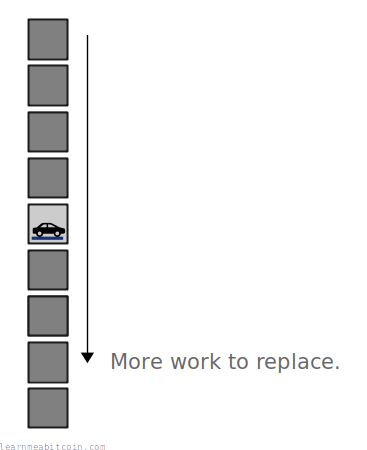](https://static.learnmeabitcoin.com/diagrams/png/blockchain-51-attack-depth-work.png)


Transactions get harder to replace the further they get into the blockchain.

But again, this is assuming you can get the hardware to attain 51% or more of the mining power to outpace all the other miners.

Nonetheless, you can still try and perform this kind of attack with less than 50% mining power, but the odds are very much against you…

## Probability

Can you rewrite the blockchain with less than 50% mining power?

Mining Power

%


Random Example


0 secs

It's possible to rewrite the blockchain *without* a majority of the mining power, but you'll need to be **lucky**.

Mining is unpredictable, so even if you've got a small amount of mining power, there's nothing to say that you wouldn't be able to get lucky and mine the next 2 blocks in a row. It's unlikely, but not impossible. The probability depends on how much mining power you have relative to everyone else.

[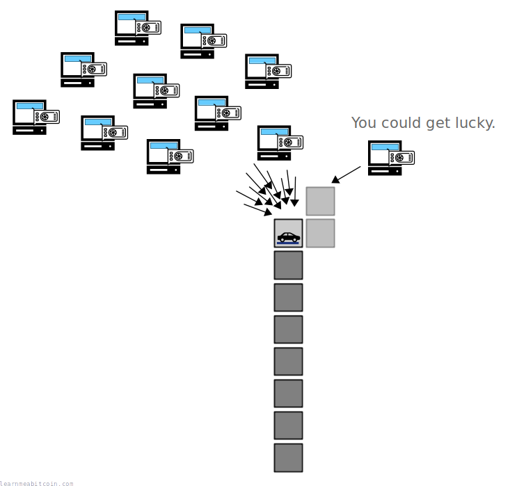](https://static.learnmeabitcoin.com/diagrams/png/blockchain-51-attack-rewrite-luck.png)

Of course, the further down a transaction is in the blockchain, the luckier you'll need to get to be able to mine X blocks in a row. If nobody has a majority of the mining power, it gets *exponentially more difficult* to replace a transaction the further it gets into the blockchain.

[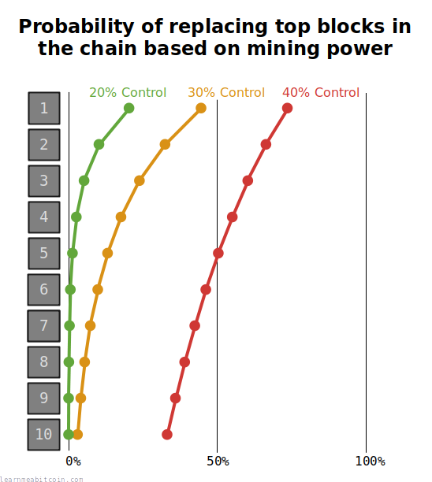](https://static.learnmeabitcoin.com/diagrams/png/blockchain-51-attack-mining-power-success-chart.png)


If a miner has 40% of the mining power, they have roughly a 50% chance of being able to replace a transaction 5 blocks deep in the chain.

So unless you've got a significant proportion of the total mining power on the bitcoin network, your chances of replacing a mined transaction are slim, and those chances diminish quickly as the transaction makes it further down the chain.

Here's a table of your exact odds:

Probability of replacing top X blocks in the blockchain based on percentage mining power.

| **Blocks** | 50%+ Control | 40% Control | 30% Control | 20% Control | 10% Control |
| 1 | 100% | 73.6% | 44.6% | 20.4% | 5.1% |
| 2 | 100% | 66.4% | 32.5% | 10.3% | 1.3% |
| 3 | 100% | 60.3% | 23.9% | 5.3% | 0.4% |
| 4 | 100% | 55.0% | 17.7% | 2.7% | 0.1% |
| 5 | 100% | 50.4% | 13.2% | 1.4% | 0.02% |
| 6 | 100% | 46.2% | 9.9% | 0.7% | 0.006% |
| 7 | 100% | 42.5% | 7.4% | 0.4% | 0.001% |
| 8 | 100% | 39.1% | 5.6% | 0.2% | 0.0004% |
| 9 | 100% | 36.0% | 4.2% | 0.1% | 0.0001% |
| 10 | 100% | 33.2% | 3.1% | 0.06% | 0.00003% |

The numbers in the table above assume you are attempting to replace blocks by building an alternate chain that is *one block longer* than the current longest chain.

### Equation

The probability of being able to rewrite blocks in the blockchain is a function of **how much mining power** you have and **how many blocks** you want to try and replace.

Here's the equation from the [Bitcoin Whitepaper](/bitcoin.pdf) (Section 11):

[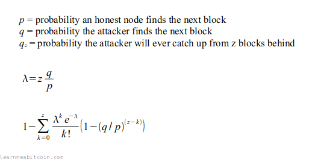](https://static.learnmeabitcoin.com/technical/blockchain/51-attack/equation-success.png)


The proof that blocks get harder to replace the further down they are in the chain is an important part of the system's integrity and security.

Anyway, here's what that equation looks like in Ruby code:

```


copied


copied

# p = probability honest node finds the next block
# q = probability attacker finds the next block
# z = number of blocks to catch up

def attacker_success_probability(q, z)
  p = 1 - q
  lambda = z * (q / p) # expected number of occurrences in the poisson distribution
  sum = 1.0

  for k in 0..z
    poisson = Math.exp(-lambda) # exp() raises e (natural logarithm) to a number
    for i in 1..k
      poisson *= lambda / i
      puts poisson
    end

    sum -= poisson * (1 - (q/p)**(z-k) )
  end

  return sum
end

# Example
puts attacker_success_probability(0.4, 5) #=> 0.5506251290702077
```

The equation above works out the probability of *catching up* with the longest chain (from being a specified number of blocks behind). If you want to *replace* blocks in the chain, you need to go *one block longer*.

### Chart

[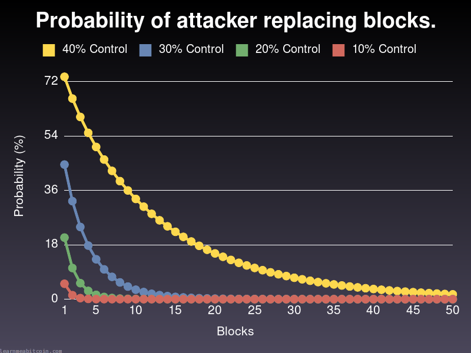](https://static.learnmeabitcoin.com/technical/blockchain/51-attack/success_chart_50_blocks.png)


There is an exponential decay in the probability of replacing a transaction the deeper it makes it into the blockchain.

## FAQ

### Has anyone successfully performed a 51% attack on Bitcoin?

Nope, not yet.

Some miners have come close to reaching 50% or more of the total mining power over Bitcoin's history, but nobody has actually performed a successful 51% attack.

[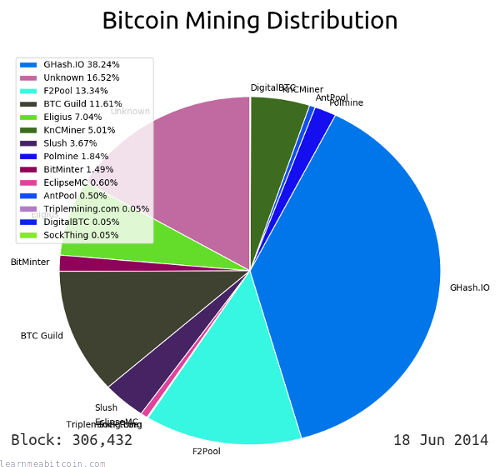](https://static.learnmeabitcoin.com/technical/blockchain/51-attack/mining-distribution-ghash-2014.jpg)


GHash.io came close to reaching 50% in 2014.  
[github.com/in3rsha/bitcoin-mining-distribution](https://github.com/in3rsha/bitcoin-mining-distribution)

Even if a miner gets over 50% mining power, it doesn't necessarily mean that they're actually going to perform an attack; it just means that they *can*. If anything, if you've got that much power, it's probably more lucrative to keep mining blocks and collecting block rewards than it would be to reverse a single transaction (and sink the value of bitcoin because of your attack).

### How much hashpower do I need to perform a 51% attack?

You can use the current [target](/docs/technical/mining/target.md) value to estimate how much hash power you would need to get majority control.

The target moves up and down based on how much quickly all miners on the network are able to mine new blocks. We can therefore use it to figure out how fast we need to be able to hash to outpace the current speed of the network.

#### 1. Find the current target

Firstly, we can get the current target by looking at the "[bits](/docs/technical/block/bits.md)" field inside the block header of the most recently mined block.

```
$ bitcoin-cli getblockcount
956471

$ bitcoin-cli getblockhash 956471
000000000000000000006124edc0696e0918b53eb5132f0728f34a50f1fd24d5

$ bitcoin-cli getblockheader 000000000000000000006124edc0696e0918b53eb5132f0728f34a50f1fd24d5 | grep bits
"bits": "17021a42",
```

Now, this "bits" value is just the target in compact format. So converting from bits to target we get:

```
0x000000000000000000021a420000000000000000000000000000000000000000
```

 Target Bits

Current

Random Example

Height:

Target

0x

`0 bytes`

Bits`0 bytes`


0 secs

And that's the number that all miners need to get a [block hash](/docs/technical/block/hash.md) below to mine a block.

#### 2. Calculate the average number of hashes required to mine the next block

We can work out how many hashes we would need to perform (on average) to get below this target value by dividing the range of all possible hash results by the target:

```
hashes = (2**256) / 0x000000000000000000021a420000000000000000000000000000000000000000
hashes = 574975416304515007119360
```

So that tells us that we need to do `574975416304515007119360` hashes on average to mine the next block.

Or in other words, this is roughly the combined number of hashes all the miners on the network are performing **every 10 minutes**.

See the [chainwork calculation explanation](/docs/technical/blockchain/longest-chain.md#calculation) for more information on how we get this "expected number of hashes".

#### 3. Convert to hashes per second

Anyway, using this number we can work out the hashes per second of the network:

```
hashes per second = 574975416304515007119360 / 600 # there are 600 seconds in 10 minutes
hashes per second = 958292360507524907008
```

So the current combined hash rate of every miner on the bitcoin network is `958292360507524907008` hashes/sec.

Converting this to **TH/s** (terahashes per second) we get:

```
terahashes per second = 958292360507524907008 / 10**12
terahashes per second = 958292360
```

Therefore, to acquire 50% control over mining blocks, we need to build a mining farm that is capable of performing over `958,292,360` TH/s.

## Resources

* [Hashrate Distribution Chart](https://mainnet.observer/charts/mining-pools-hashrate-distribution/) — Useful pie chart showing the bitcoin mining distribution. The [Mining Centralization Index chart](https://mainnet.observer/charts/mining-pools-centralization-index/) is also interesting.
* [Coin Dance - Latest Blocks](https://coin.dance/blocks/today) – Another website showing a pie chart of the current bitcoin mining distribution. The more distributed the better.