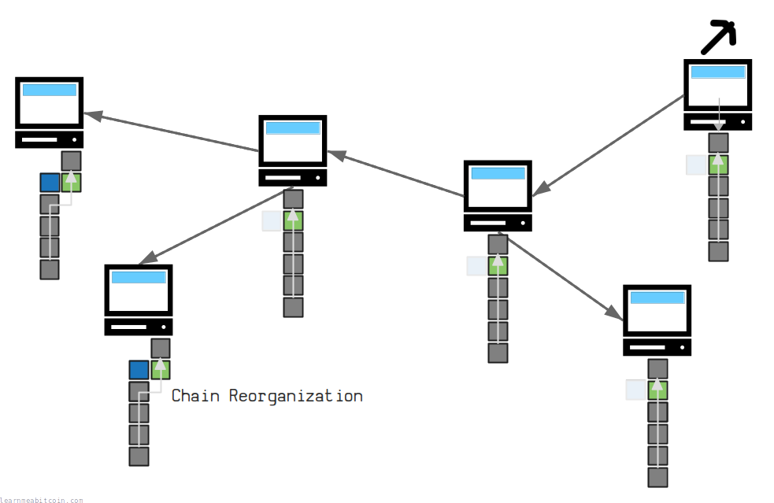
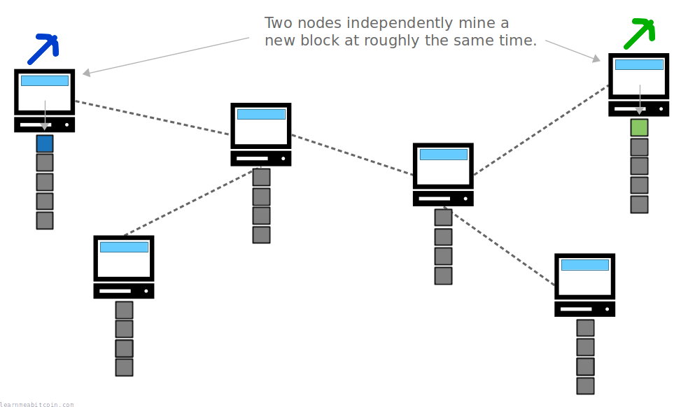
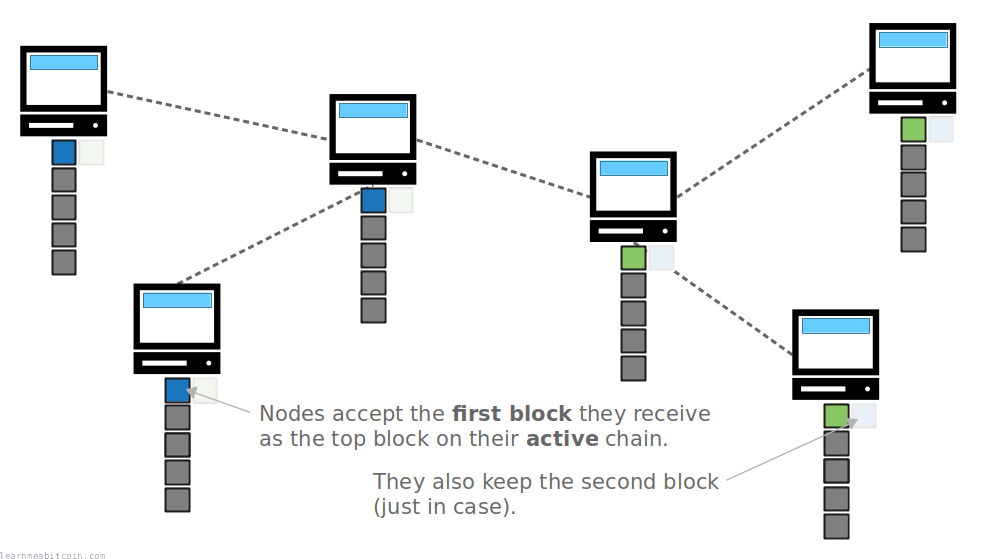
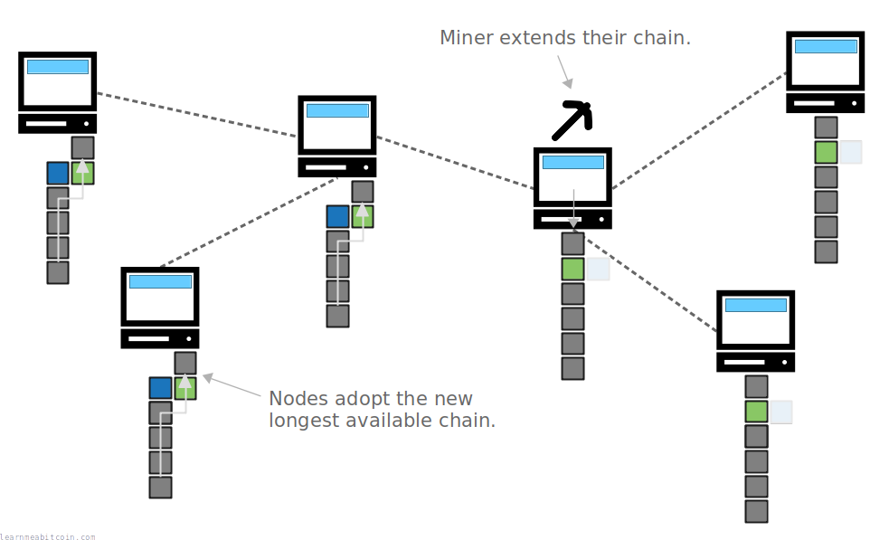
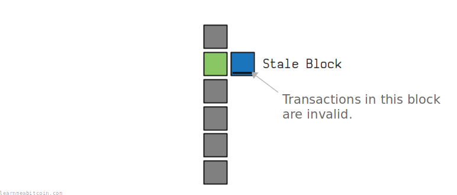
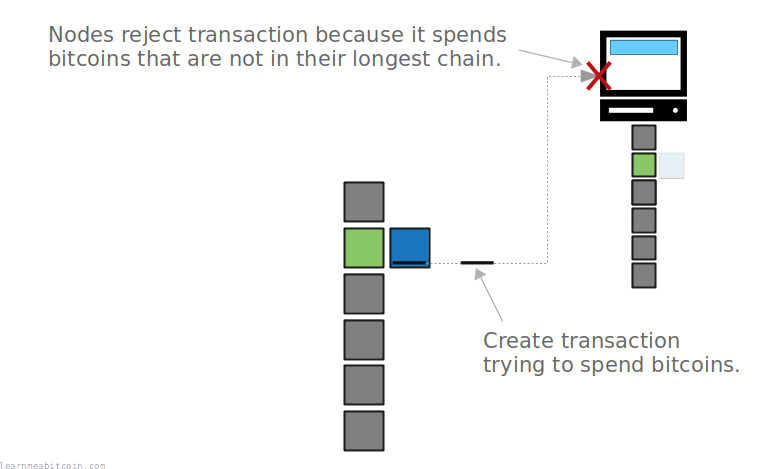
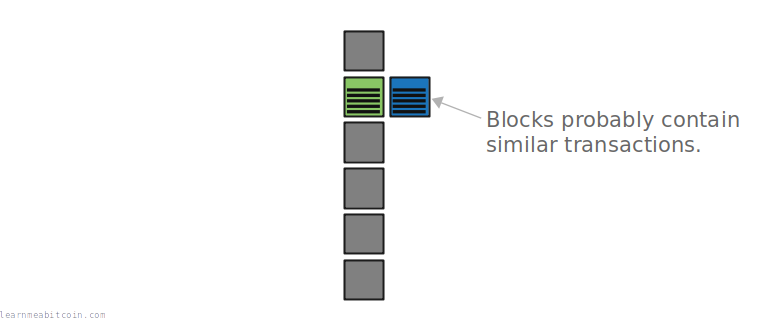
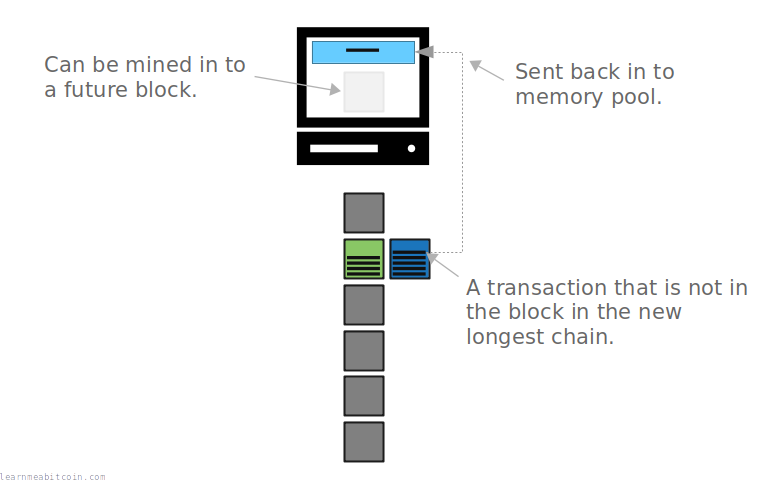
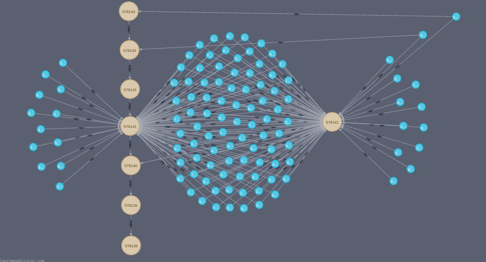
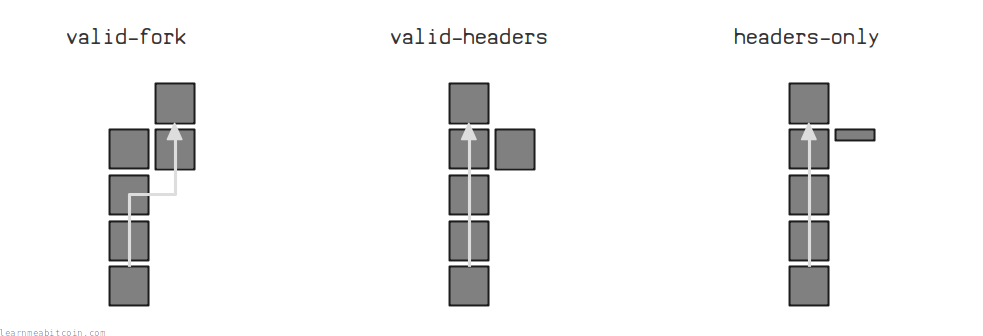

[](../../images/diagrams_png_blockchain-chain-reorganization.png)

最近的区块重组 (Recent Chain Reorganizations):

| 高度 | 长度 | 日期 |
| --- | --- | --- |
| [956,337](/explorer/956337) | 1 | 2026 年 7 月 2 日 |
| [951,052](/explorer/951052) | 1 | 2026 年 5 月 26 日 |
| [945,189](/explorer/945189) | 1 | 2026 年 4 月 15 日 |
| [944,852](/explorer/944852) | 1 | 2026 年 4 月 13 日 |
| [941,882](/explorer/941882) | 2 | 2026 年 3 月 23 日 |
| [939,832](/explorer/939832) | 1 | 2026 年 3 月 8 日 |
| [935,497](/explorer/935497) | 1 | 2026 年 2 月 8 日 |
| [933,995](/explorer/933995) | 1 | 2026 年 1 月 27 日 |
| [928,484](/explorer/928484) | 1 | 2025 年 12 月 19 日 |
| [925,605](/explorer/925605) | 1 | 2025 年 11 月 28 日 |
| [920,138](/explorer/920138) | 1 | 2025 年 10 月 21 日 |
| [916,308](/explorer/916308) | 1 | 2025 年 9 月 25 日 |
| [904,623](/explorer/904623) | 1 | 2025 年 7 月 8 日 |
| [901,092](/explorer/901092) | 1 | 2025 年 6 月 13 日 |
| [894,657](/explorer/894657) | 1 | 2025 年 4 月 30 日 |
| [883,183](/explorer/883183) | 1 | 2025 年 2 月 10 日 |
| [881,953](/explorer/881953) | 1 | 2025 年 2 月 2 日 |
| [881,780](/explorer/881780) | 1 | 2025 年 2 月 1 日 |
| [877,770](/explorer/877770) | 1 | 2025 年 1 月 4 日 |
| [863,888](/explorer/863888) | 1 | 2024 年 10 月 3 日 |
| [856,689](/explorer/856689) | 1 | 2024 年 8 月 14 日 |
| [853,051](/explorer/853051) | 1 | 2024 年 7 月 20 日 |
| [851,248](/explorer/851248) | 1 | 2024 年 7 月 8 日 |
| [849,233](/explorer/849233) | 1 | 2024 年 6 月 24 日 |
| [848,477](/explorer/848477) | 1 | 2024 年 6 月 18 日 |
| [847,849](/explorer/847849) | 1 | 2024 年 6 月 14 日 |
| [829,613](/explorer/829613) | 1 | 2024 年 2 月 9 日 |
| [827,853](/explorer/827853) | 1 | 2024 年 1 月 28 日 |
| [819,343](/explorer/819343) | 1 | 2023 年 12 月 1 日 |
| [818,038](/explorer/818038) | 1 | 2023 年 11 月 23 日 |
| [815,202](/explorer/815202) | 1 | 2023 年 11 月 4 日 |
| [813,210](/explorer/813210) | 1 | 2023 年 10 月 21 日 |
| [803,389](/explorer/803389) | 1 | 2023 年 8 月 16 日 |
| [800,786](/explorer/800786) | 1 | 2023 年 7 月 29 日 |
| [792,379](/explorer/792379) | 1 | 2023 年 6 月 1 日 |
| [789,147](/explorer/789147) | 1 | 2023 年 5 月 10 日 |
| [788,837](/explorer/788837) | 1 | 2023 年 5 月 8 日 |
| [788,805](/explorer/788805) | 1 | 2023 年 5 月 8 日 |
| [781,487](/explorer/781487) | 1 | 2023 年 3 月 19 日 |
| [781,277](/explorer/781277) | 1 | 2023 年 3 月 18 日 |
| [730,848](/explorer/730848) | 1 | 2022 年 4 月 7 日 |
| [685,135](/explorer/685135) | 1 | 2021 年 5 月 27 日 |
| [675,407](/explorer/675407) | 1 | 2021 年 3 月 20 日 |
| [675,392](/explorer/675392) | 1 | 2021 年 3 月 20 日 |

当您的节点收到属于新的[最长链](longest-chain.md)的区块时，就会发生区块重组 (chain reorganization，或简称 “reorg”)。您的节点将*停用*其旧最长链中的区块，以采用构建**新最长链**的区块。

这一过程允许整个网络中的各个节点**商定同一个版本的[区块链](../blockchain.md)**，因为全球接受的区块链视图将始终是包含最长\*区块链接的视图。

\*从技术上讲，它是包含最大*工作量*的链，但通常区块数量最多也就是指相同的内容。

> 必须严格规定，最长链总是被视为有效的链。
> 
> 中本聪, [密码学邮件列表 (Bitcoin P2P e-cash paper)](https://satoshi.nakamotoinstitute.org/emails/cryptography/6/)

## 发生场景

何时会发生区块重组？

区块重组最常发生在**两个[区块](../block.md)被同时[挖掘出](../mining.md)**之后。

[](../../images/diagrams_png_blockchain-chain-reorganization-example-two-blocks.png)

虽然少见，但同时挖掘出两个区块是完全正常的。

由于区块在[网络](../networking.md)上的传播速度不同，某些节点会先收到其中一个区块，而另一些节点会先收到另一个区块。因此，对于这两个区块中哪一个实际上是“第一位”并应该放在每个人区块链的最顶端，会存在临时的分歧。

[](../../images/diagrams_png_blockchain-chain-reorganization-example-chain-split.png)

节点会暂时对区块链的外观产生分歧。

那么，我们该如何解决这个争议并确保每个人都同意同一个版本的区块链呢？

当*下一个区块被挖出*时，这个问题就会得到解决。下一个被挖出的区块将构建在这些区块之中的*一个*之上，从而创建一条新的最长链。当节点收到这个最新区块时，它们会发现它创建了一条新的最长链，并且它们将执行*区块重组*来采用它。

[](../../images/diagrams_png_blockchain-chain-reorganization-example-next-block-resolved.png)

旧较短链中的区块被停用，新最长链中的区块被激活。

得益于区块重组，每个节点最终都会像其他所有人一样商定同一个版本的区块链。

## 过期区块 (Stale Blocks)

旧最长链中的交易会发生什么？

> **stale** – 活力或有效性受损
> 
> [Merriam-Webster 词典](https://www.merriam-webster.com/dictionary/stale)

如果一个区块因为区块重组而被停用（“过期区块”），其中的交易将**不再是区块链的一部分**。

[](../../images/diagrams_png_blockchain-chain-reorganization-stale-block.png)

过期区块是指不再属于最长链一部分的区块。

因此，如果您尝试使用*过期区块*中交易的[输出 (outputs)](../transaction/output.md)，节点会拒绝您的交易，因为您正试图消费在有效链中并不存在的比特币。

[](../../images/diagrams_png_blockchain-chain-reorganization-stale-block-invalid-transaction.png)

过期区块中交易的输出是不能被消费的；这就像交易从未发生过一样。

不过在实际操作中，如果同时挖掘出两个区块，它们可能会包含相同（或相似）的交易，因此重组通常不会造成问题。

[](../../images/diagrams_png_blockchain-chain-reorganization-stale-block-similar-transactions.png)

在区块重组后，您的交易极有可能包含在“竞争”区块中。

然而，如果过期区块中存在*未*包含在竞争区块中的交易，它们将被退回到您节点的[内存池 (memory pool)](../mining/memory-pool.md)中，并在网络中重新传播，以获得被挖掘到未来区块中的*机会*。

[](../../images/diagrams_png_blockchain-chain-reorganization-stale-block-transactions-recycled.png)

如果过期区块中的交易未在竞争区块中，它们将被回收回到内存池。

但这并不能保证成功，如果交易在活跃链中不存在，它可能就像从未发生过一样。

**在将交易视为最终交易之前，值得等待交易进入区块链达 2 个以上的区块。** 始终存在它被重组掉的几率，届时您将不得不等待并希望它被重新挖掘回最长链。

**“过期区块 (stale block)”有时被称为“孤块 (orphan block)”，但“过期区块”是更准确的术语。** *孤块*是指您的节点在收到它赖以构建的父区块之前就收到了该区块，而过期区块并不是孤块，因为它们有父区块。

### 示例

在这里，我们可以看到一个发生在区块高度 [578,141](/explorer/578141) 的区块链中实际发生区块重组的示例。

[](../../images/technical_blockchain_chain-reorganization_neo4j-reorg-5.jpg)

过期区块中的大多数交易都包含在竞争区块中，但有些交易在稍后的区块中被重新开采。

## 长度

区块重组的长度可以有多大？

区块重组可以是**任意区块长度**。

如果您的节点收到了一条比当前活跃链更长的新区块链接，无论有多少个区块会被替换，您的节点都将进行区块重组以采用新链。

这就是为什么拥有大多数哈希算力的矿工能够通过 [51% 攻击](51-attack.md)来替换您当前最长链中的区块和交易的原因。最长链总是获胜。

然而，“自然”的区块重组（由于同时开采出两个区块而发生的重组）**很少涉及您链中顶端区块之外的区块**。

## 频率

区块重组发生的频率如何？

并不经常。对于您的节点而言，要经历一次真正的区块重组，需要发生以下情况：

1. 两个区块同时被挖出。
2. 您的节点首先收到了其中一个区块，但*另一个*区块被后续构建并成为了新的最长链。

我不知道这在数学上的概率是多少，因此以下是基于[我的比特币节点](/explorer/)（自 **2021 年 3 月** 以来一直持续运行）数据统计出的区块重组发生频率：

* **实际重组:** 44 次 (每 6,451 个区块发生 1 次 / 44.3 天一次)
  + 我们收到了一条新的最长链并更新至该链，同时停用了旧最长链中的区块。
* **避免的重组:** 232 次 (每 1,223 个区块发生 1 次 / 8.4 天一次)
  + 我们得知了可能成为新最长链的链接，但我们当时的活跃链作为最长链继续保持。

## 命令

您如何查找区块重组？

您可以使用 `bitcoin-cli getchaintips` 命令查看您的节点观察到的区块重组。

例如：

```
[
  {
    "height": 589919,
    "hash": "000000000000000000149b18e74316248d106e42ca410f509305ae58ccda6b13",
    "branchlen": 0,
    "status": "active"
  },
  {
    "height": 578141,
    "hash": "0000000000000000001253a5f37d3763dbe928d21f7d72a708f05268c044179c",
    "branchlen": 1,
    "status": "valid-fork"
  },
  {
    "height": 575695,
    "hash": "0000000000000000002409ed07fdbb1d0359a0c516014115c5451aea724baec8",
    "branchlen": 1,
    "status": "valid-headers"
  },
  ...
```

* `branchlen` – 告诉您在竞争的区块分支中有多少个区块。
* `status` – 指示以下内容：
  + `active` – 这是我们当前的活跃链（最长链）。
  + `valid-fork` – **我们的节点执行了区块重组。** 我们下载并验证了这些区块，并让它们作为我们活跃链的一部分，但我们在收到新的最长区块链接后停用了它们。
  + `valid-headers` – **我们的节点观察到了可能的区块重组。** 我们下载了这些区块，但没有验证它们，因为我们当时等效的活跃链变得更长了。
  + `headers-only` – **我们的节点观察到了可能的区块重组。** 我们收到了竞争链的区块头，但没有下载完整的区块。
  + `invalid` – 包含无效区块的分支。

[](../../images/diagrams_png_blockchain-chain-reorganization-getchaintips-status.png)

状态为 `valid-fork` 的分支是包含我们最初认为是活跃区块链一部分的区块，但在收到新的最长区块链接后停用了它们。

状态为 `valid-headers` 的分支是在我们已拥有等效活跃链*之后*收到的竞争链。这些链本来可能导致重组，但我们的链作为最长链继续保持，因此没有发生重组。

**如果您没有持续运行节点几周或几个月，您不太可能看到任何区块重组。** 当您的节点[下载区块链](../blockchain.md#download)时，它将仅下载当前最长链中的区块（而不会下载来自任何分支或旧的区块重组的区块）。您的节点需要经历*实时发生的*区块重组，它们才会显示在 `bitcoin-cli getchaintips` 中。

## 总结

区块重组是比特币节点正常功能的*完全标准*部分。采用已知的最长链允许网络中的节点商定同一个区块链，而区块重组正是此过程的一部分。

由于区块重组而停用的区块中的交易将失效，但它们将被回收回内存池中，以获得挖掘到新最长链区块上的机会。

所以基本上，如果您的交易被开采到区块中，仍然有可能会因为区块重组而重新被扔回内存池。然而，这种自然重组通常只会发生在链的**顶端区块**，因此您应该等待您的交易进入 2 个区块深，以帮助避免这种场景。

## 资源

* [How to detect a fork with bitcoin-cli?](https://bitcoin.stackexchange.com/questions/44437/how-to-detect-a-fork-with-bitcoin-cli)
* [Understanding getchaintips in terms of chain reorganisations](https://bitcoin.stackexchange.com/questions/91111/understanding-getchaintips-in-terms-of-chain-reorganisations)
* [The difference between stale and orphan blocks](https://technicaldifficulties.io/2022/07/29/the-difference-between-stale-and-orphan-blocks/)