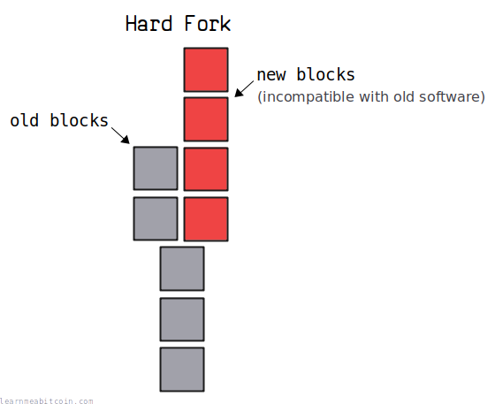
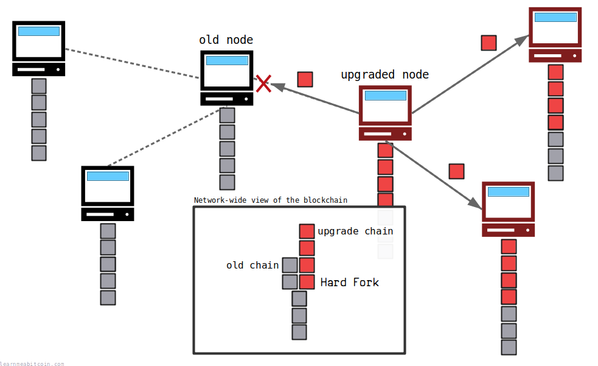
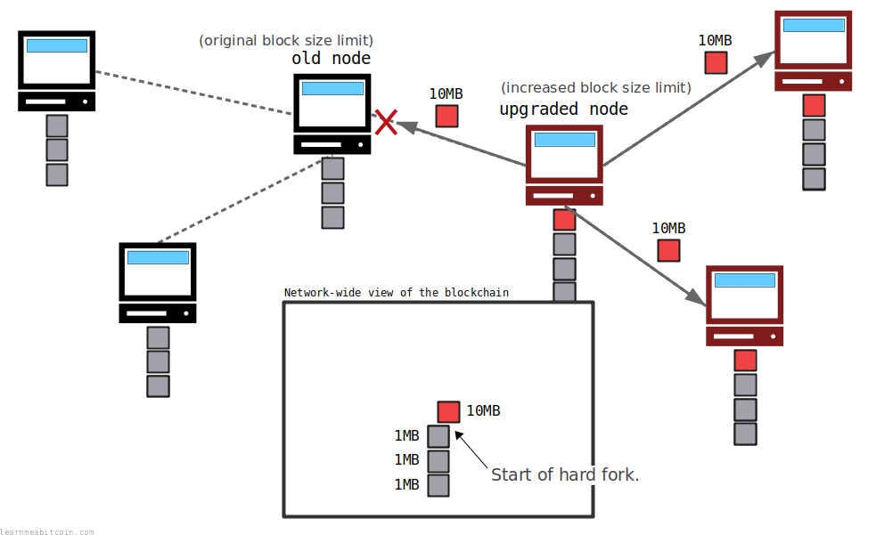
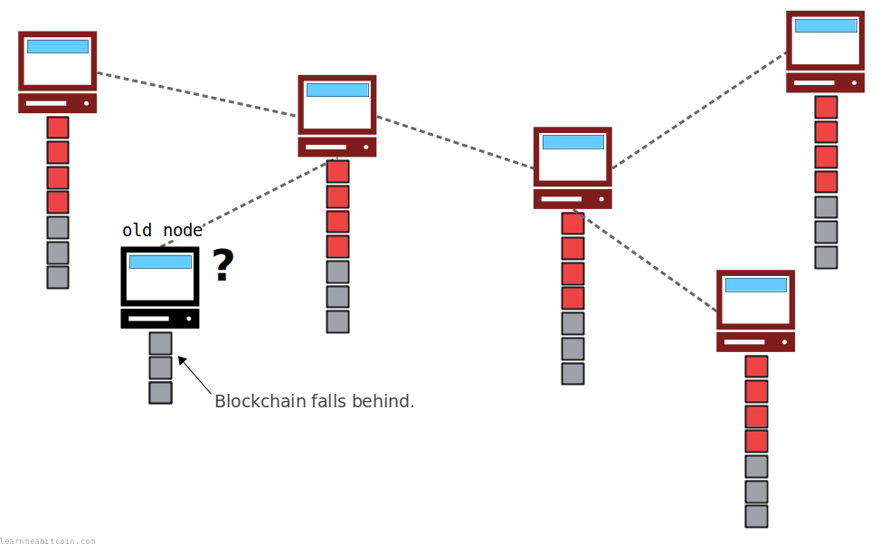
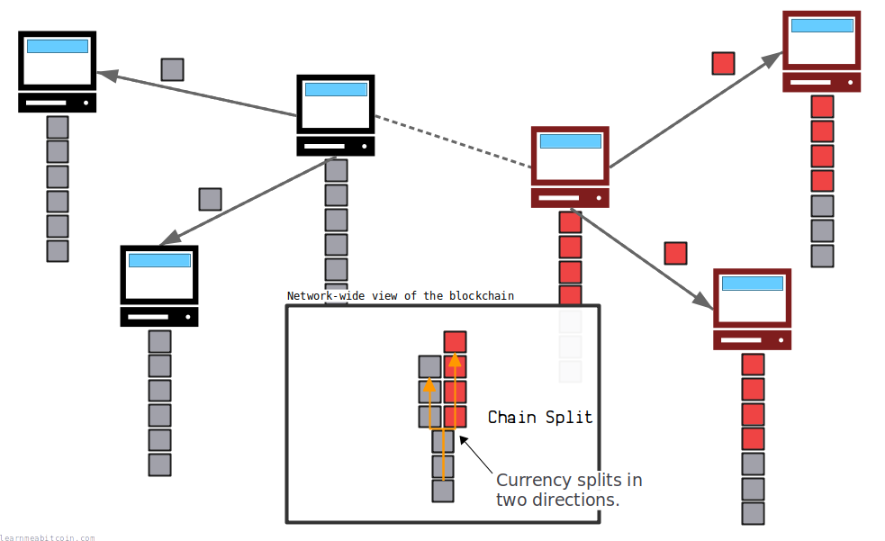

硬分叉 (hard fork) 发生于对比特币软件进行升级，且该升级与软件的旧版本*不兼容*时。

这是指对规则进行修改，从而使以前无效的[区块](/docs/technical/block.md)/[交易](/docs/technical/transaction.md)在软件新版本中被视为有效。

结果，除非每个人都升级到新软件，否则[区块链](/docs/technical/blockchain.md)将向两个不同的方向分裂：

1. 一条遵循**旧规则**区块组成的链。
2. 一条遵循**新规则**区块组成的链。

旧[节点](/docs/technical/networking/node.md)无法接受这些新区块，因此将存在**两条平行的区块链**。这在链中被称为“硬分叉”。

因此，如果您希望软件的硬分叉升级成功，您需要网络上的每个节点都同意更改并升级其软件。这是升级后每个人保持同步相同版本区块链的唯一方法。

“硬分叉”可以指对比特币*软件*所做的更改，或者是指更改之后*区块链*的状态。在本文中，我将使用以下术语：

* *硬分叉修改* – 对软件的升级。
* *硬分叉* – 当开采出新的不兼容区块时区块链发生的分裂。

## 场景

如何创建硬分叉？

要创建硬分叉，您需要更改软件规则，以允许**以前无效的区块/交易被视为有效**。

举一个简单的例子，假设区块大小限制为 1 MB（区块容量现在以[权重](/docs/technical/block.md#weight)来衡量，但现在先不用担心这个），并假设我们升级软件以接受最大为 **10 MB** 的区块。

当矿工升级到新版本时，硬分叉修改便开始了。而区块链中实际的硬分叉发生于开采出第一个 10 MB 区块时。

* 新矿工将开始构建包含 10 MB 区块的链。
* 旧矿工将继续构建仅包含 1 MB 区块的链，并拒绝新的 10 MB 区块。

只要新链（包含不兼容的 10 MB 区块）仍然是网络上的[最长链](/docs/technical/blockchain/longest-chain.md)，该硬分叉就会持续下去。

如果旧矿工占多数，并用 1 MB 区块构建了最长链，已升级的节点将接受其作为它们的区块链版本（因为它们仍然接受旧区块），硬分叉将被取消。

## 原因

什么会导致硬分叉？

任何**破坏现有共识规则**的更改都会导致硬分叉。

例如：

1. **区块结构的修改**
   * 例如：直接增加最大区块大小。
2. **交易结构的修改**
   * 例如：修改现有交易中用于[签名](/docs/technical/keys/signature.md)的[密码学](/docs/technical/cryptography.md)算法。
3. **其他共识规则的修改**
   * 例如：增加比特币的最大供应量。
   * 例如：手动调整[target](/docs/technical/mining/target.md)以使挖矿变得更容易。

因此，虽然并不是所有对比特币的更新都需要硬分叉，但任何从根本上改变比特币运作方式的行为都只能通过硬分叉来实现。

## 动力

为什么要创建硬分叉？

硬分叉修改是对比特币软件进行**破坏共识的升级的唯一方法**。

所以，如果您想对比特币进行升级，但唯一的实现方式是打破网络上所有节点当前遵循的规则，那么硬分叉是您的唯一选择。

您也可以使用所谓的[软分叉](/docs/technical/blockchain/soft-fork.md)来修改规则。然而，取决于升级的复杂程度，硬分叉通常是对比特币软件进行修改的*较简单*选择。

## 问题

为什么不想创建硬分叉？

硬分叉有两个主要问题：

### 1. 每个人都必须升级。

**任何未升级的人都将被抛在后面。** 他们将无法收到新的不兼容区块，因此将对网络上的最新交易一无所知。

换句话说，运行旧软件的人将会落后，并且不会知道自己可能收到的任何新付款。他们不会失去其持有的任何比特币，但他们将无法再正常参与系统。

这并不是一种对用户友好的对点对[网络](/docs/technical/networking.md)的升级方式。

### 2. 分歧将分裂网络。

最坏的情况是“有争议的硬分叉”。这是指网络上的部分矿工同意升级，但很大一部分人不同意。

这将导致区块链分裂为两条平行的链，实际上使**货币分道扬镳**，向两个不同的方向分裂。

这会在用户和商家之间造成混乱：谁接受货币的哪条分支？您如何确保自己在正确的链条分支上进行交易？

这种混乱会破坏对系统的总体信任，并可能导致比特币价值崩溃而无法恢复。如果目标是创造一种稳定的数字货币，这并不是一个理想的结果。

> 共识的激励非常大，因为分歧实际上意味着赋予每一个旧持有的币可以在分裂的两侧各消费一次的权利。
> 
> Pieter Wuille, [Bitcoin StackExchange](https://bitcoin.stackexchange.com/questions/9986/how-is-a-hard-fork-resolved)

**矿工之间的分裂也会将挖矿算力分流给两条链。** 因此，每条链都将*不那么安全*，因为每条链保护自身免受 [51% 攻击](/docs/technical/blockchain/51-attack.md) 的算力都变少了。

**旧矿工可以通过继续构建旧区块的最长可用链来取消升级。** 当然，除非升级在开始后由于某种原因也使旧区块无效，在此情况下会出现永久性链分裂。

## 好处

您何时会想对比特币创建硬分叉？

由于存在将区块链一分为二的风险，在对比特币软件进行*一般性改进*时应**避免**使用硬分叉修改。

例如，有几个可以通过硬分叉轻松修复的小 Bug：

* **修复 `OP_CHECKMULTISIG` [Script](/docs/technical/script.md) opcode (操作码)。** 此 opcode 会从堆栈中多弹出一项（参见 [P2MS](/docs/technical/script/p2ms.md)）。
* **增加区块头中 [Nonce](/docs/technical/block/nonce.md) 字段的大小。** Nonce 字段太小，这意味着在耗尽 Nonce 字段中所有可能的数字后，矿工必须 resort to 修改 [Coinbase](/docs/technical/mining/coinbase-transaction.md) 交易（参见 [ExtraNonce](/docs/technical/block/nonce.md#extranonce)）以继续[挖掘](/docs/technical/mining.md)该区块。
* **与[字节顺序](/docs/technical/general/byte-order.md)保持一致。** 在[浏览器](/explorer/)上搜索区块时，[区块哈希](/docs/technical/block.md#hash)以[反向字节顺序](/docs/technical/general/byte-order.md#reverse-byte-order)显示，但原始区块数据中使用的区块哈希处于[自然字节顺序](/docs/technical/general/byte-order.md#natural-byte-order)。如果内部所有的区块哈希都处于*反向字节顺序*，对开发人员来说会更容易。

然而，这些修改带来的微小好处并不足以抵挡在软件硬分叉修改中让每个人升级所带来的风险。

因此，硬分叉更新保留给潜在灾难性事件的**紧急修复**。这可能是以下情况：

* **摒弃 SHA-256 [哈希函数](/docs/technical/cryptography/hash-function.md)。** 如果发现削弱了开采区块所需工作量的漏洞，这就需要硬分叉。
* **手动增加目标值（即降低[难度](/docs/beginners/guide/difficulty.md)）。** 如果网络上的挖矿算力出现了不可恢复的流失，导致区块间隔时间变得极长，这就需要硬分叉。没有硬分叉，可能需要数月时间才能进行下一次目标调整并使交易再次得以及时挖掘。

这就是为什么到目前为止比特币的所有升级都是作为软分叉实现的；只有在系统运行方式出现根本性问题时，才有可能发生硬分叉。

## 示例

比特币历史上发生过硬分叉吗？

Bitcoin Core 开发人员并未提出过任何*有意的*硬分叉修改。

然而，有两次软件升级导致（或本可以导致）意外的硬分叉：

### 1. BerkeleyDB 升级到 LevelDB

[v0.7.0]( https://github.com/bitcoin/bitcoin/blob/master/doc/release-notes/release-notes-0.7.0.md) 升级到 [v0.8.0](https://github.com/bitcoin/bitcoin/blob/master/doc/release-notes/release-notes-0.8.0.md)

比特币使用一个独立的 [chainstate 数据库](https://github.com/in3rsha/bitcoin-chainstate-parser) 来记录所有的 [UTXO](/docs/technical/transaction/utxo.md)。v0.8.0 之前的版本使用 [BerkeleyDB](https://www.oracle.com/database/technologies/related/berkeleydb.html) 数据库。

由于 BerkeleyDB 的工作原理，它对可以包含在[区块](/docs/technical/block.md)内的[输入](/docs/technical/transaction/input.md)数量施加了限制。这创造了一个关于什么才是有效区块的未预料到且无意的网络共识规则。

当 v0.8.0 中 BerkeleyDB 被 [LevelDB](https://github.com/google/leveldb) 取代时，这一未知的限制被移除了。在 2013 年 3 月 12 日，开采出了一个包含比 v0.7.0 节点所能接受的更多输入的区块，从而在 v0.7.0 节点和 v0.8.0 节点之间产生了一个无意的硬分叉。

最初的解决办法是要求矿工降级到 v0.7.0，这意味着大多数挖矿算力回到了旧的 v0.7.0 链上。这使得 v0.7.0 链再次成为最长链，并且 v0.8.0 上的所有节点都[重组](/docs/technical/blockchain/chain-reorganization.md)回该链，临时解决了问题并迫使所有节点回到 v0.7.0 链。

在接下来的两个月里，所有使用 v0.7.0 的节点都被敦促升级到 v0.8.1 的最新版本。随后在 2013 年 8 月 16 日的区块高度 [252,451](/explorer/block/0000000000000024b58eeb1134432f00497a6a860412996e7a260f47126eed07) 处挖掘出了一个永久性硬分叉区块，彻底移除了区块中可以包含的输入数量限制。

* [记录 v0.8.0 硬分叉的原始帖子](https://bitcointalk.org/index.php?topic=152348.0)
* [BIP: 50 (March 2013 Chain Fork Post-Mortem)](https://github.com/bitcoin/bips/blob/master/bip-0050.mediawiki)

### 2. 双重支付漏洞 (CVE-2018-17144)

[v0.14.0](https://github.com/bitcoin/bitcoin/blob/master/doc/release-notes/release-notes-0.14.0.md) 升级到 [v0.15.0](https://github.com/bitcoin/bitcoin/blob/master/doc/release-notes/release-notes-0.15.0.md)/[v0.16.2](https://github.com/bitcoin/bitcoin/blob/master/doc/release-notes/release-notes-0.16.2.md)

0.15.0 和 0.16.2 之间的软件版本*本可以*导致潜在的硬分叉，但在该漏洞被利用之前就被修复了，因此没有发生实际的硬分叉。

简而言之，0.15.0 到 0.16.2 版本会允许矿工在同一交易中多次包含同一 UTXO 作为[输入](/docs/technical/transaction/input.md)时，对该 UTXO 进行双重支付。只有矿工能执行此攻击，因为只有在交易已被挖掘到区块中时，节点才会接受该交易（否则它们会拒绝该交易本身）。

这个双重支付漏洞在 [0.16.3](https://github.com/bitcoin/bitcoin/blob/master/doc/release-notes/release-notes-0.16.3.md) 中被修复，没有发生实际的硬分叉。

* [Bitcoin Core Bug CVE-2018–17144: An Analysis](https://hackernoon.com/bitcoin-core-bug-cve-2018-17144-an-analysis-f80d9d373362)

## 总结

*硬分叉*是指您对比特币软件进行升级，且会产生与**该软件的旧版本不兼容**的新[区块](/docs/technical/block.md)/[交易](/docs/technical/transaction.md)。

要成功进行硬分叉，您需要运行比特币的每个人（即[节点](/docs/technical/networking/node.md)和[矿工](/docs/technical/mining.md)）升级到软件的新版本。这样每个人都将收到这些新区块，并同意同一个升级后的[区块链](/docs/technical/blockchain.md)版本。

如果矿工对升级产生分歧，并继续用旧版和新版软件挖掘区块，区块链将分裂为两条平行的链。这会将比特币分裂为两种独立的货币，并破坏系统的完整性，这对比特币是有害的。

比特币目前尚未发生过有意的硬分叉。相反，软件的一般性升级更倾向于使用[软分叉](/docs/technical/blockchain/soft-fork.md)来实现。

## 资源

* [bitcoin.it/wiki/Hardfork](https://en.bitcoin.it/wiki/Hardfork)
* [bitcoin.it/wiki/Hardfork\_Wishlist](https://en.bitcoin.it/wiki/Hardfork_Wishlist)
* [Has a hard fork ever occurred?](https://bitcoin.stackexchange.com/questions/36090/has-a-hard-fork-ever-occurred)
* [Why is it dangerous to hard fork the Bitcoin network?](https://bitcoin.stackexchange.com/questions/42442/why-is-it-dangerous-to-hard-fork-the-bitcoin-network)
* [How is a hard fork resolved?](https://bitcoin.stackexchange.com/questions/9986/how-is-a-hard-fork-resolved)
* [Does a soft fork result in two different blockchain versions?](https://bitcoin.stackexchange.com/questions/99221/does-a-soft-fork-result-in-two-different-blockchain-versions)
* [After hard fork won't every new transaction go on both chains?](https://bitcoin.stackexchange.com/questions/52245/after-hard-fork-wont-every-new-transaction-go-on-both-chains)