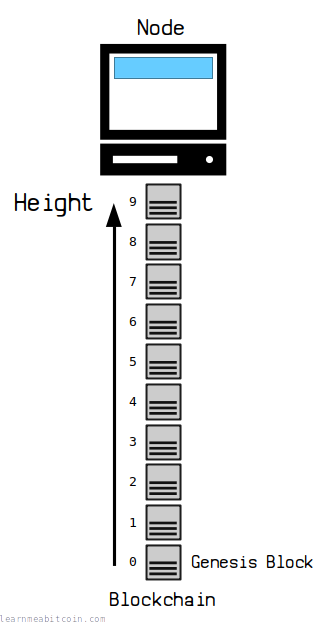
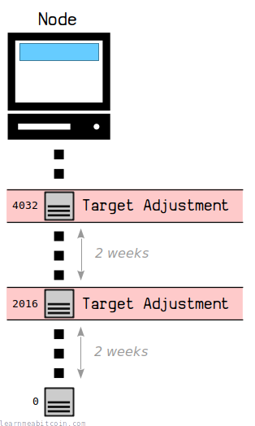
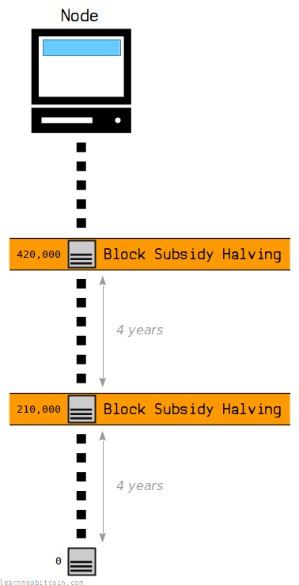
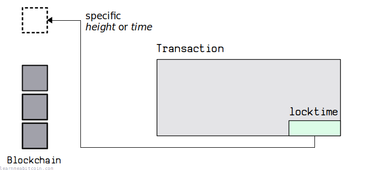
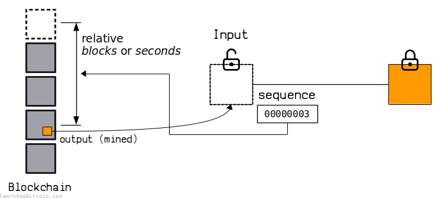
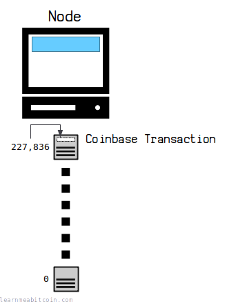
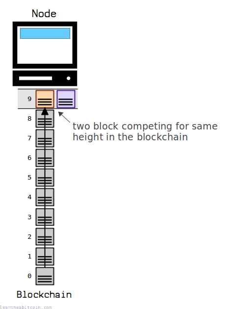
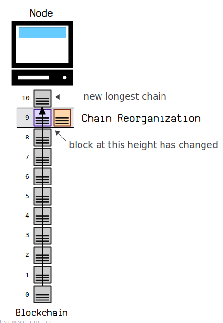

[](https://static.learnmeabitcoin.com/diagrams/png/blockchain-height.png)

Current Height:

[956,471](/explorer/956471#blockchain)

Note: This is the height of the block at the tip of the blockchain.

The height of a [block](/docs/technical/block.md) indicates its **position in the [blockchain](/docs/technical/blockchain.md)**.

It's calculated based on its distance from the *genesis block*.

**Counting starts at zero.** So the first block in the blockchain (the genesis block) is [block 0](/explorer/0#blockchain).

## Usage

How is the height used in Bitcoin?

There are **two major adjustments** that take place in Bitcoin at *specific height intervals*.

### 1. Target Adjustment

2,016 blocks

[](https://static.learnmeabitcoin.com/diagrams/png/blockchain-height-target.png)

|  |  |
| --- | --- |
| Next Adjustment | 957,600 (1,129 blocks away) |
| Current Height | 956,471 |

The [target](/docs/technical/mining/target.md) adjusts after every 2,016 blocks (roughly every 2 weeks).

This helps to keep a **10-minute interval between blocks** as [miners](/docs/technical/mining.md) join and leave the network over time.

For example, the first target adjustment took place at a block height of [2,016](/explorer/2016#blockchain), the second at a height of [4,032](/explorer/4032#blockchain), the third at a height of [6,048](/explorer/6048#blockchain), and so on.

### 2. Block Subsidy Halving

210,000 blocks

[](https://static.learnmeabitcoin.com/diagrams/png/blockchain-height-halving.png)

|  |  |
| --- | --- |
| Next Halving | 1,050,000 (93,529 blocks away) |
| Current Height | 956,471 |

The [block subsidy](/docs/technical/mining/block-reward.md#block-subsidy) halves after every 210,000 blocks (roughly every 4 years).

This halving of the block subsidy is what creates the **fixed supply** of bitcoin, as eventually the subsidy will reach zero and no new bitcoins will be issued.

For example, the block subsidy started at **50 BTC**. Then at the block height of [210,000](/explorer/210000#blockchain) it halved to **25 BTC**, and at block height [420,000](/explorer/420000#blockchain) it halved to **12.5 BTC**, and so on. At block height 6,930,000 (and after 33 [halvings](/docs/technical/mining/block-reward.md#halving-table) in total) the subsidy will reach **zero**.

### Other

The *height* is used in a few other places in Bitcoin, primarily to do with the eligibility for [transactions](/docs/technical/transaction.md) to get mined:

#### Locktime

[](https://static.learnmeabitcoin.com/diagrams/png/transaction-locktime.png)

The [locktime](/docs/technical/transaction/locktime.md) field can be used to **prevent a transaction from being mined until *after* a specific height**.

For example, if you set a locktime of **500,000** on a transaction, that transaction can only be mined into a block with a height of **500,001** or above.

#### Relative Locktime

[](https://static.learnmeabitcoin.com/diagrams/png/transaction-sequence-relative-locktime.png)

[Relative locktime](/docs/technical/transaction/input/sequence.md#relative-locktime) can be used to prevent a transaction from being mined until the [output](/docs/technical/transaction/output.md) it's spending has reached a certain *depth* in the blockchain.

For example, if you set a relative locktime of **100** blocks on a transaction [input](/docs/technical/transaction/input.md) spending the output of a transaction in block **500,000**, that transaction can only get mined into a block at a height of **500,101** or above.

#### Coinbase Transaction

[](https://static.learnmeabitcoin.com/diagrams/png/blockchain-height-coinbase-transaction.png)

Starting from block [227,836](/explorer/227836#blockchain), all [coinbase transactions](/docs/technical/mining/coinbase-transaction.md) **must contain the height** of the block they are going to be mined in.

This forces each coinbase transaction to have a unique [TXID](/docs/technical/transaction/input/txid.md), as before this it was possible for coinbase transactions in different blocks to have the [same TXID](/docs/technical/transaction/input/txid.md#duplicate).

## Referencing

Is the height a unique identifier for a block?

*Height* is **not guaranteed to be a unique identifier for a block**.

During the [mining](/docs/technical/mining.md) process, it's possible that two blocks will get mined at the same time. Therefore, there can be two different blocks competing for the same height in the blockchain:

[](https://static.learnmeabitcoin.com/diagrams/png/blockchain-height-competing.png)


This is a normal part of how bitcoin works.

Consequently, depending on which block gets built on top of first, there is a chance a block occupying a height close to the top of the chain will change:

[](https://static.learnmeabitcoin.com/diagrams/png/blockchain-height-competing-chain-reorganization.png)


This is known as a [chain reorganization](/docs/technical/blockchain/chain-reorganization.md).

So whilst the height is a generally useful way to reference a block in the blockchain, it can't always be relied upon to reference a *specific block*, especially if that block is close to the top of the blockchain.

* **The [block hash](/docs/technical/block/hash.md) is the most reliable way to reference a block.** A block hash always references a specific block, whereas the height is more of a *descriptor* than a unique identifier.
* **The height gets more reliable the further a block makes it down the blockchain.** If a block makes it 3+ blocks deep in the blockchain, it's highly unlikely that it's going to be switched out due to a [chain reorganization](/docs/technical/blockchain/chain-reorganization.md).

## Commands

### `bitcoin-cli getblockcount`

This command returns the current **height** of the blockchain.

```
$ bitcoin-cli getblockcount
956471
```

The height of the blockchain is currently 956,471. But because counting starts at *zero*, there are technically 956,472 blocks in the blockchain in total. This is not a terribly useful fact, but I thought I would mention it anyway.

### `bitcoin-cli getblockhash [height]`

This command returns the block hash for a specific height in the blockchain.

```
$ bitcoin-cli getblockhash 956471
000000000000000000006124edc0696e0918b53eb5132f0728f34a50f1fd24d5
```

As mentioned, the height is not a reliable way to reference blocks near the top of the blockchain. For example, if you were to use `bitcoin-cli getblockhash 956471` to get the block hash for the block currently at the top of the chain, the result may change if a [chain reorganization](/docs/technical/blockchain/chain-reorganization.md) takes place.

If your node holds multiple blocks at the same height, this command will return the block hash for the block that is part of the current [longest chain](/docs/technical/blockchain/longest-chain.md). If there are multiple blocks at the tip of your chain, your node will consider the *first* block it receives as part of the current longest chain (but again, this is liable to change if there is a chain reorganization).

### `bitcoin-cli getblockheader [hash]`

This command provides basic information about a block, including its height.

```
$ bitcoin-cli getblockheader 000000000000000000006124edc0696e0918b53eb5132f0728f34a50f1fd24d5
{
    "hash": "000000000000000000006124edc0696e0918b53eb5132f0728f34a50f1fd24d5",
    "confirmations": 1,
    "height": 956471,
    "version": 872415232,
    "versionHex": "34000000",
    "merkleroot": "d6a6f3d8b6c4d37bfcf6959e03a9e69c5050696919d533ff19fafd46ca19a1af",
    "time": 1783066235,
    "mediantime": 1783063970,
    "nonce": 914481153,
    "bits": "17021a42",
    "target": "000000000000000000021a420000000000000000000000000000000000000000",
    "difficulty": 133869853540305.4,
    "chainwork": "000000000000000000000000000000000000000134cd152c185fde26dc120668",
    "nTx": 4811,
    "previousblockhash": "00000000000000000001ec048885e8386fd3d5b1f56248214e40586b57f80691"
}
```

## Summary

The height is used to reference a block occupying a specific position in the blockchain.

You're better off using the [block hash](/docs/technical/block/hash.md) to reliably reference a block though, as the blocks near the top of the blockchain can change due to [chain reorganizations](/docs/technical/blockchain/chain-reorganization.md).

However, once a block makes it 3 or more blocks deep in the blockchain it's probably not going to be replaced by another block, and the height becomes good enough as a unique identifier. But still, it's safer to use the block hash if you can.