[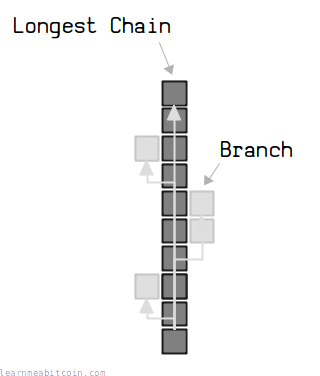](../../images/diagrams_png_blockchain-longest-chain.png)

当前最长链:

* **高度:** 956479
* **[累积工作量 (Chainwork)](#chainwork):** 0x000000000000000000000000000000000000000134d0e337eef3b345d0a8d660

最长链是比特币节点接受为**有效版本**的[区块链](../blockchain.md)。

最长链规则**允许网络上的每个节点商定**区块链的外观，并因此商定相同的交易历史。

换句话说，这意味着在网络上独立运行的计算机可以维护对全局更新文件的相同视图。

> 工作量证明链是解决同步问题以及在不信任任何人的情况下了解全球共享视图的解决方案。
> 
> 中本聪, [密码学邮件列表 (Bitcoin P2P e-cash paper)](https://satoshi.nakamotoinstitute.org/emails/cryptography/7/)

## 定义

什么是最长链？

最长链是构建时付出了**最多劳动的区块链接**。

简而言之，要向区块链中添加新区块，您需要[使用处理能力](../mining.md)，这意味着区块链上的每个区块都需要耗费一定的*能量*才能加入到其中。

[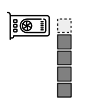](../../images/diagrams_png_blockchain-longest-chain-block-energy.png)

区块是使用计算能力开采出来的。

因此，包含*更多区块*的区块链将比包含较少区块的链消耗*更多能量*来构建，并且作为规则，节点将始终采用该链而不是“较短的”链。

[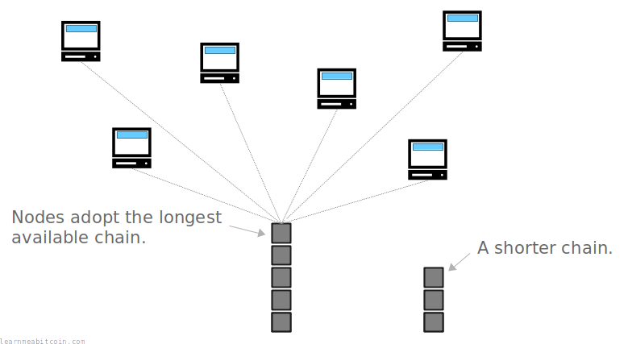](../../images/diagrams_png_blockchain-longest-chain-nodes-adopting.png)

结果，节点将始终采用耗费最多能量构建的链，这就是我们所说的“最长链”的意思。

> 多数决定由最长链来代表，该链投入了最大的工作量证明努力。
> 
> 中本聪, [比特币白皮书](/bitcoin.pdf)

## 常见误区

最长链就是区块数量最多的链吗？

您可能会认为*最长*链就是包含最多区块的链，但是，构建时需要最多能量的链**不一定包含最多的区块**。

这是因为[难度](../../beginners/guide/difficulty.md)的变化意味着有些区块比其他区块需要耗费更多的能量才能被挖掘。

例如，在相同的难度周期内，挖掘每个新区块所需的努力是相同的，因此为链增加了等量“工作量”：

[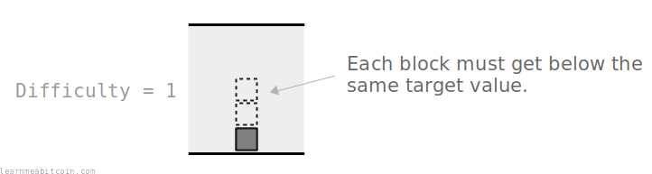](../../images/diagrams_png_blockchain-longest-chain-difficulty.png)

然而，如果难度增加了（因为开采区块的平均时间少于 10 分钟），新难度周期内的区块挖掘将需要*更多的努力*：

[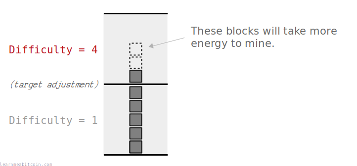](../../images/diagrams_png_blockchain-longest-chain-difficulty-adjustment.png)

现在，鉴于节点采用工作量最多的链，如果构建时不需要那么多工作，它们实际上并不会采用包含*更多*区块的链。

例如，如果您构建了跨越多个难度周期的两条不同的区块链，节点将采用累积“chainwork”最多的那条，而不仅仅是区块数量最多的那条：

[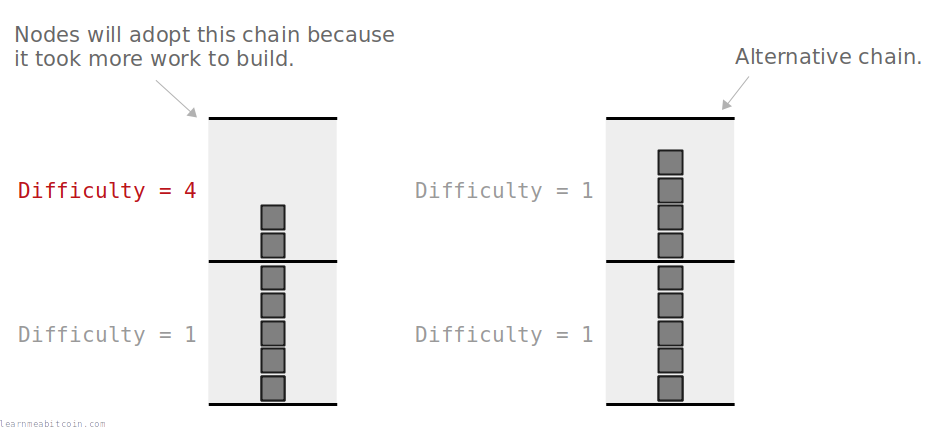](../../images/diagrams_png_blockchain-longest-chain-difficulty-adjustment-chainwork.png)

右边的链在构建时人为地保持了极低的难度。

所以总结来说，“最长链”一词指的是**消耗了最多能量构建的区块链**。在大多数情况下，这通常也是包含最多区块的链，但更准确地说，它是包含最多*工作量*的链。

在[比特币的第一个版本](https://github.com/Dan-McG/bitcoin-0.1.0)中，中本聪使用*区块数量*作为决定最长链的指标，认为这会是包含最多工作量的链。然而，这容易受到操纵，因此后来被[更改](https://bitcoin.stackexchange.com/questions/29742/strongest-vs-longest-chain-and-orphaned-blocks/29744#29744)为使用 chainwork（累积工作量）作为最长链的判定指标。

## 累积工作量 (Chainwork)

如何计算最长链？

最长链是通过名为“chainwork”的指标来衡量的。

> [Chainwork] 是预计产生当前链所必需的哈希总数。
> 
> Pieter Wuille, [bitcoin.stackexchange.com](https://bitcoin.stackexchange.com/questions/26869/what-is-chainwork/26894#26894)

要计算 chainwork，您只需要计算**挖掘链中每个区块预计需要执行多少次哈希**，然后将它们相加。

[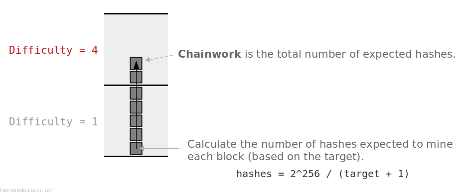](../../images/diagrams_png_blockchain-longest-chain-chainwork.png)

总 chainwork 是挖掘链中每个区块所需的平均预期哈希次数之和。

### 计算方法

[挖矿](../mining.md)的过程涉及对[区块头](../block.md#header)进行哈希运算。

每次您执行哈希时，[哈希函数](../cryptography/hash-function.md)都会输出一个 *256 位的数字*，该数字可以是 `0` 到以下值之间的任何数字：

```
0xffffffffffffffffffffffffffffffffffffffffffffffffffffffffffffffff
```

为了成功将该区块开采到区块链中，该哈希结果需要*小于或等于该高度在链中的 [target](../mining/target.md) 值*。[创世区块](/explorer/block/000000000019d6689c085ae165831e934ff763ae46a2a6c172b3f1b60a8ce26f)的目标值被设定为：

```
0x00000000ffff0000000000000000000000000000000000000000000000000000
```

因此，要算出得到低于该值的结果平均需要执行多少次哈希，您需要将*最大数值范围*除以*您希望低于的数值*。

```
range = 2^256
below = 0x00000000ffff0000000000000000000000000000000000000000000000000000 + 1

hashes = range / below
hashes = 0x0100010001
```

这意味着您平均需要进行 `0x0100010001` (4,295,032,833) 次哈希运算才能得到低于该目标值的结果。因此，这就是创世区块的实际 chainwork。

所以为了计算**一条链的总 chainwork**，您只需计算每个区块的预期哈希次数并将其相加。

您可以通过查看[区块头](../block.md#header)中的 [bits](../block/bits.md) 字段来找出每个区块的目标值。

#### 平均哈希的直观解释

假设您在 1 到 100 之间随机生成数字，并希望随机生成一个 **5 或以下** 的数字。平均而言，在生成低于目标的数字之前，您需要生成多少个数字？

```
100 / 5 = 20
```

因此，平均而言，**您需要生成 20 个数字**才能得到一个低于 **5** 的数字。

这与比特币中进行的计算完全相同，只是数字要大得多（通常使用[十六进制](../general/hexadecimal.md)值来计算）。

### 示例

为了提供一个如何计算 chainwork 的快速示例，让我们计算区块链中**第四个区块**的 chainwork。

对于前 2016 个区块，目标并没有调整，因此挖掘这前 4 个区块中每一个所需的平均哈希次数都是相同的：

```
Block 0
  Target: 0x00000000ffff0000000000000000000000000000000000000000000000000000
  Average Hashes: 2**256 / (Target + 1) = 4295032833

Block 1
  Target: 0x00000000ffff0000000000000000000000000000000000000000000000000000
  Average Hashes: 2**256 / (Target + 1) = 4295032833

Block 2
  Target: 0x00000000ffff0000000000000000000000000000000000000000000000000000
  Average Hashes: 2**256 / (Target + 1) = 4295032833

Block 3
  Target: 0x00000000ffff0000000000000000000000000000000000000000000000000000
  Average Hashes: 2**256 / (Target + 1) = 4295032833
```

总 chainwork 将是挖掘这些区块中的每一个的平均哈希次数之和：

```
Total Chainwork
  = 4295032833 + 4295032833 + 4295032833 + 4295032833
  = 17180131332
  = 0x400040004
```

我们可以使用 `bitcoin-cli` 检查我们的计算是否正确：

```
bitcoin-cli getblockhash 3
0000000082b5015589a3fdf2d4baff403e6f0be035a5d9742c1cae6295464449

bitcoin-cli getblock 0000000082b5015589a3fdf2d4baff403e6f0be035a5d9742c1cae6295464449
{
    ...
  "chainwork": "0000000000000000000000000000000000000000000000000000000400040004",
    ...
}
```

## 目的

为什么节点采用最长链？

使节点采用可用的最长链，允许整个网络中的计算机能够就同一个区块链版本达成一致。

以下是该机制被证明非常有用的两个场景：

### 1. 解决两个区块同时被挖掘出时的分歧。

由于比特币运行在[网络](../networking.md)上，两台独立的计算机有可能同时开采出一个区块。在此情况下，网络中的节点最终会对这两个区块中哪一个应该处于区块链尖端产生分歧。

[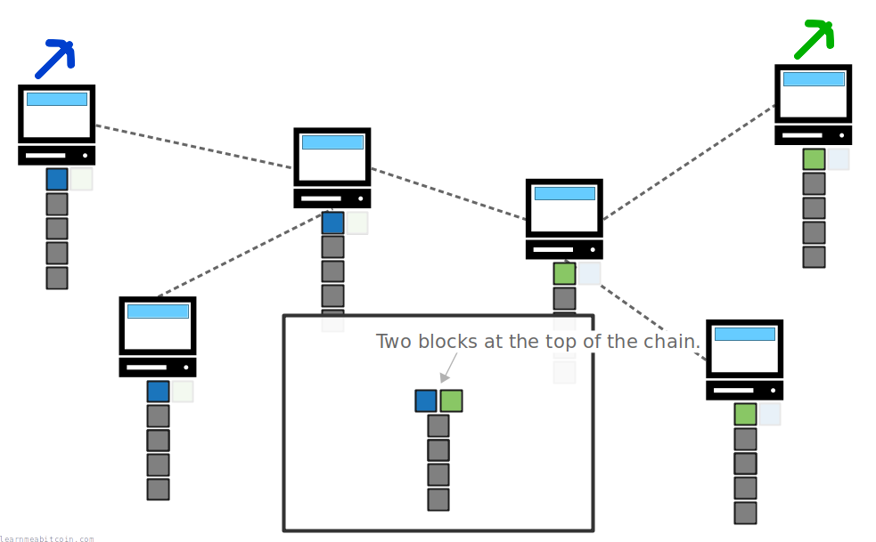](../../images/diagrams_png_blockchain-longest-chain-two-blocks-mined.png)

每个节点都会将其接收到的*第一个*区块放在其区块链的尖端。

然而，可以通过使节点采用最长区块链接来解决此问题。这是因为**下一个挖掘出的区块**将构建在这两个区块之中的*一个*之上，从而创建一条全网节点都乐意采用的新最长链。

[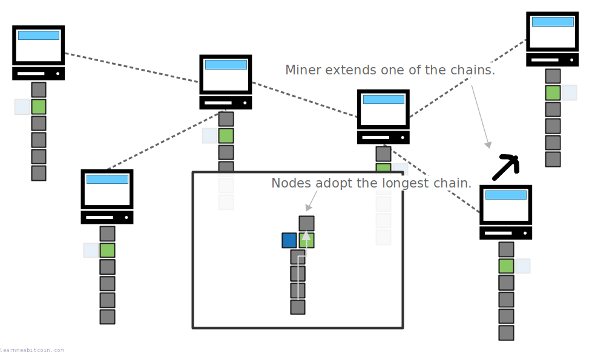](../../images/diagrams_png_blockchain-longest-chain-two-blocks-mined-reorg.png)

节点会乐意放弃较短的链以采用新的最长链。这被称为[区块重组](chain-reorganization.md)。

所以即使节点在任何给定时间都可能存在分歧（由于挖矿的不可预测性和网络中广播数据的速度限制），但采用最长可用链意味着节点最终*总是*会商定同一个区块链视图。

### 2. 保护已写入区块链的区块。

节点总是采用最长链作为区块链有效版本的事实，意味着替换链中已有的区块（以及其中的交易）是非常困难的。

如果有人想替换区块链中的一笔[交易](../transaction.md)，他们需要付出努力来构建一条**新的最长链来替换当前的链**。

然而，如果大多数矿工都在不断地工作以延长当前的同一条最长链，那么单个矿工将无法与所有其他矿工的合并努力进行竞争。

[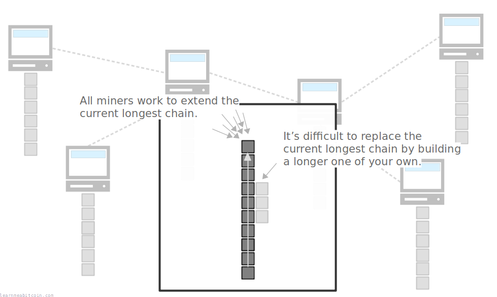](../../images/diagrams_png_blockchain-longest-chain-protection.png)

您需要拥有大多数挖矿算力才能超越所有其他矿工并构建一条新的最长链（这被称为 [51% 攻击](51-attack.md)）。

结果，矿工们协同延长同一条链的合并努力保护了现有区块和交易不被单个矿工替换。

> 将其视为共同合作去制作一条链。
> 
> 中本聪, [bitcointalk.org](https://bitcointalk.org/index.php?topic=6.msg31#msg31)

## 常见问题

### 为什么矿工选择在最长链上构建？

因为如果矿工能开采出一个区块，他们就可以声称获得了[区块奖励](../mining/block-reward.md)。

然而，只有当该区块在***最长链*中达到 100 个区块的深度**时，该区块奖励中的比特币才能被消费。因此，该区块奖励激励着矿工总是尝试去挖掘能够成为最长链一部分的新区块（通过始终尝试在当前最长链上进行构建）。

[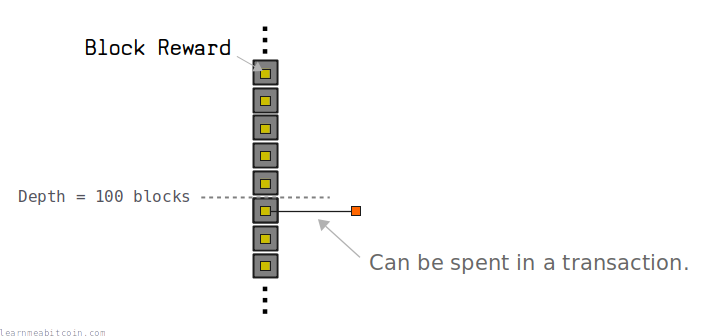](../../images/diagrams_png_blockchain-longest-chain-block-reward.png)

区块奖励只有在区块是最长链的一部分时才能被消费。

矿工最初通过 [Coinbase](../mining/coinbase-transaction.md) 交易来声称区块奖励。

### 那些不属于最长链的交易会发生什么？

在不属于最长链的区块中的[交易](../transaction.md)是**无效的**。

如果您试图使用不处于最长链中的交易[输出 (outputs)](../transaction/output.md)，节点既不会接受这笔新交易，也不会尝试将其挖掘到区块中。这是因为节点仅将**最长链视为有效的交易历史**，除此之外的任何交易都是无效的。

[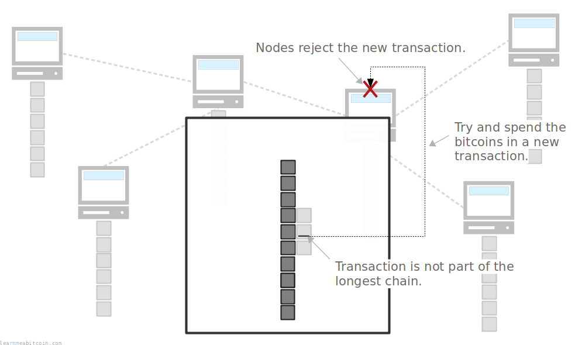](../../images/diagrams_png_blockchain-longest-chain-invalid-transaction.png)

不在最长链中的交易输出是不可消费的。

所以只有最长链中的交易才被视为有效交易历史的一部分，而链外的任何交易实际上都从未发生过。

**我建议您在判定比特币属于“您”之前，等待交易在区块链中达到 2 个或更多区块的深度。** 区块链中最顶端的区块总是有可能因为[区块重组](chain-reorganization.md)而发生改变，从而使此前有效的区块和交易失效。

## 命令

您可以使用以下 `bitcoin-cli` 命令自行找出 chainwork 值：

### `bitcoin-cli getblockchaininfo`

查看当前最长链的总 chainwork。

```
$ bitcoin-cli getblockchaininfo
{
  "chain": "main",
  "blocks": 599501,
  "headers": 599767,
  "bestblockhash": "0000000000000000000cb6141c8076e24f3a1799eef37201634ef392197668f3",
  "difficulty": 13008091666971.9,
  ...
  "chainwork": "0000000000000000000000000000000000000000094b1874d991d4e1fc51005a",
  ...
}
```

### `bitcoin-cli getblock [blockhash]`

查看链中任何给定区块的 chainwork。

```
$ bitcoin-cli getblock 00000000b8980ec1fe96bc1b4425788ddc88dd36699521a448ebca2020b38699
{
  "hash": "00000000b8980ec1fe96bc1b4425788ddc88dd36699521a448ebca2020b38699",
  ...
  "height": 12345,
  ...
  "bits": "1d00ffff",
  "difficulty": 1,
  "chainwork": "0000000000000000000000000000000000000000000000000000303a303a303a",
  ...
}
```

## 总结

采用最长区块链接允许计算机网络中的节点能够分享全局接受的区块链视图。此外，向链中添加新区块需要消耗能量的事实，使得任何个人都极难替换链中已被挖掘出的区块。

“最长链”通常指包含最多连续区块数量的链，但在技术上，它指基于挖掘每个区块的难度，拥有*最大工作量*的链。

## 资源

* [What does the term "Longest chain" mean?](https://bitcoin.stackexchange.com/questions/5540/what-does-the-term-longest-chain-mean)
* [chain.cpp](https://github.com/bitcoin/bitcoin/blob/master/src/chain.cpp)