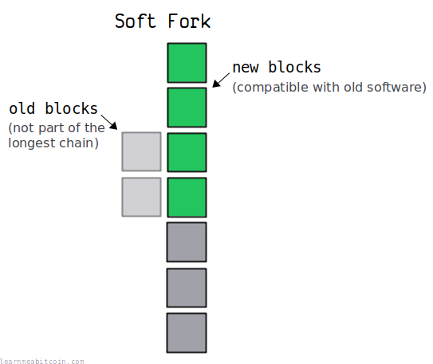
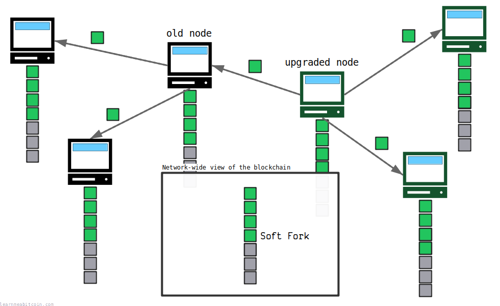
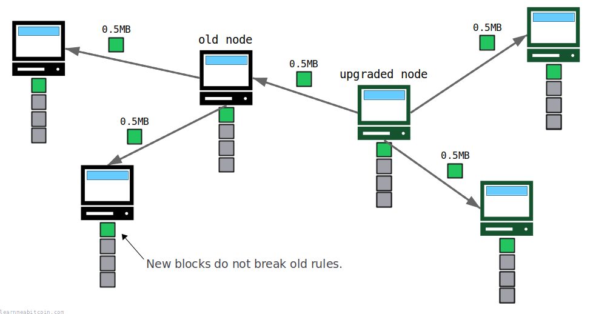
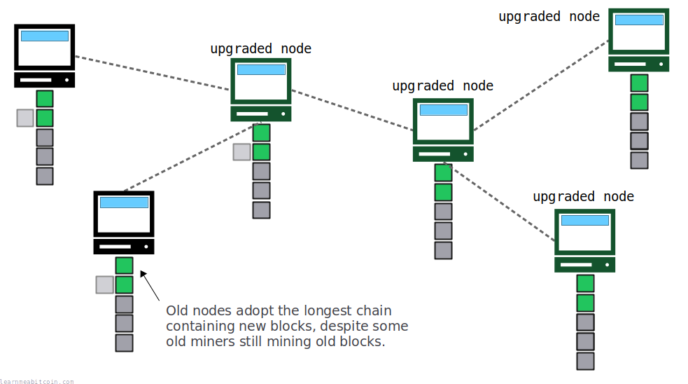
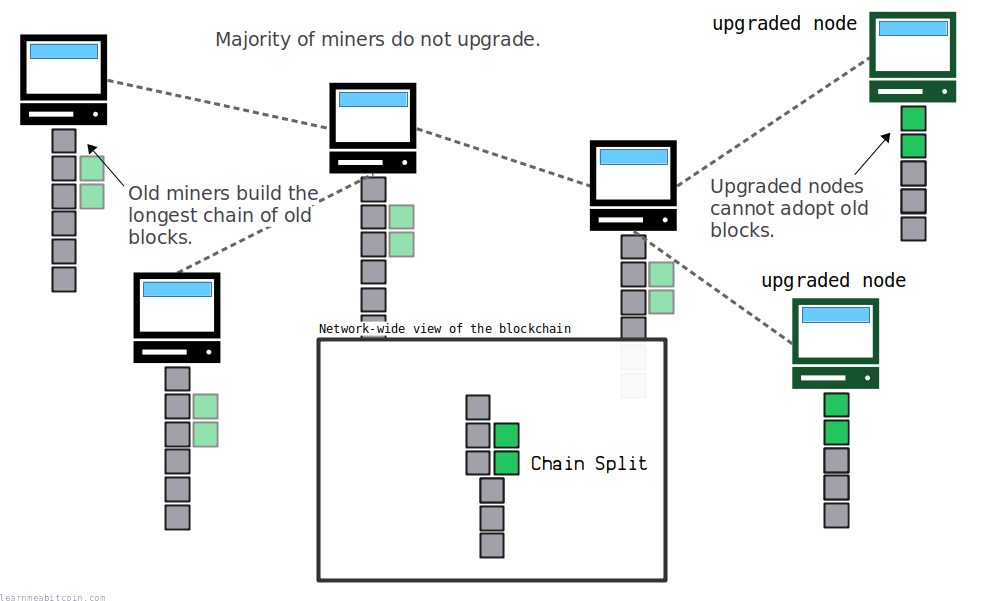
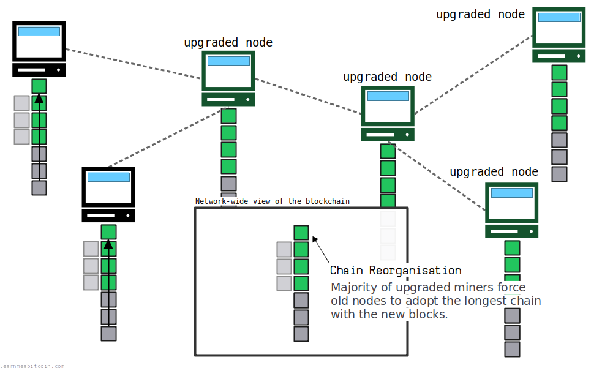

[](../../images/diagrams_png_blockchain-forks-soft-fork.png)

软分叉 (soft fork) 是指对比特币软件进行升级，且该升级与软件的旧版本*兼容*。

总结软分叉与[硬分叉](hard-fork.md)之间的区别：

* **硬分叉** *放宽*了关于什么是有效区块/交易的规则。
* **软分叉** *限制*了关于什么是有效区块/交易的规则。

使用软分叉，未升级软件的[节点](../networking/node.md)仍然能够接受由升级后软件创建的[区块](../block.md)/[交易](../transaction.md)。因此，未升级的节点将能够与[区块链](../blockchain.md)保持同步，而不会被抛在后面。

[](../../images/diagrams_png_blockchain-forks-soft-fork-network.png)

要使软分叉更改成功，您只需要网络上占*多数*的[矿工](../mining.md)升级到软件的新版本。因为如果您有多数矿工升级，它们的挖矿算力将构建起已升级区块的[最长链](longest-chain.md)（旧节点也会采用该链）。

## 场景

如何创建软分叉？

要创建软分叉，您需要*限制*关于什么是有效区块或交易的规则。

换句话说，您需要使**以前有效的区块/交易变得无效**。

例如，假设区块大小限制为 1 MB（区块容量现在以[权重](../block.md#weight)来衡量，但现在先不用担心这个）。软分叉修改将是创建一条新规则，将区块大小限制缩减至 **0.5 MB**（我知道这听起来像是倒退了一步，但这只是一个例子）。

当升级后的矿工开始开采这些较小的区块时，旧节点仍会将这些新区块视为有效，因此不会像在[硬分叉](hard-fork.md)中那样出现区块链的分支。

[](../../images/diagrams_png_blockchain-forks-soft-fork-compatibility.png)

## 激活方法

如何使软分叉成功？

要使软分叉成功，您需要**大多数矿工升级**到新版软件。

这是因为节点总是接受[最长链](longest-chain.md)，因此如果大多数矿工都在按照限制后的规则开采升级后的区块，旧节点自然会将其采用为自己的区块链。

[](../../images/diagrams_png_blockchain-forks-soft-fork-majority.png)

所以，即使少数旧矿工继续用旧区块构建区块链，它们也无法与升级后矿工开采新区块的速度相抗衡，因此旧节点将采用与已升级节点相同的区块链版本。

## 风险

软分叉有哪些风险？

软分叉的主要风险在于**未能获得大多数矿工的升级**。

这将导致区块链一分为二，因为大多数旧矿工将继续开采与软件新版本不兼容的旧区块。

[](../../images/diagrams_png_blockchain-forks-soft-fork-split.png)

由于旧区块构成了最长的可用链，旧节点将采用其作为自己的区块链。然而，已升级的节点将拒绝这些旧区块（因为根据它们升级后的规则，这些区块是无效的），它们将转而采用仅包含新区块的最长可用链。

所以，就像在硬分叉中一样，您再次拥有了两个平行的区块链版本：一个包含旧区块，另一个包含新区块。

然而，与两个链永远无法融合的硬分叉不同，这种链分裂可以通过**在主链上投入更多算力**来解决。如果已升级的矿工能够构建起最长链，旧节点将执行一次[区块重组](chain-reorganization.md)来采用由新区块构成的区块链。

[](../../images/diagrams_png_blockchain-forks-soft-fork-reconverge.png)

因此，通过让大多数矿工升级，您可以“鼓励”网络上的每个人保持同步同一个区块链版本。

## 妥协与代价

软分叉的缺点是什么？

软分叉最大的缺点是它们往往会使软件**更加复杂**（[SegWit](../upgrades/segregated-witness.md) 就是一个典型的例子）。

通过[硬分叉](hard-fork.md)直接升级软件会更容易。然而，由于硬分叉产生链分裂的风险更大（并且必须强制每个人都升级），所以大多数升级都是通过软分叉完成的。

因此，您必须保持更改与*旧软件*兼容的事实意味着您必须做出**更多的技术妥协**，这使得软件比您拥有制作与旧节点不兼容的更改自由时更加复杂。

简而言之：

* **硬分叉**允许您直接替换规则和代码。
* **软分叉**涉及*添加更多代码*以适配新规则。

## 示例

比特币发生过软分叉吗？

到目前为止，比特币的所有重大升级都是作为软分叉部署的。

以下是一些示例，包括它们引入的*新限制*的摘要：

### 1. [BIP 16](https://github.com/bitcoin/bips/blob/master/bip-0016.mediawiki): Pay to Script Hash

2012 年 1 月 3 日

#### 解决的问题

在向您发送比特币时，没有便利的方法让其他人使用您选择的自定义锁定脚本。

#### 引入的限制

特定的 [ScriptPubKey](../transaction/output/scriptpubkey.md) 模式现在有了额外的验证规则（参见 [P2SH](../script/p2sh.md)）。

因此，以前锁定脚本模式 `OP_HASH160` `OP_PUSHBYTES_20` `digest` `OP_EQUAL` 仅需要您提供一些哈希值为 `digest` 的数据即可解锁，而现在您需要提供以自定义锁定脚本形式呈现的数据（其哈希值为 `digest`），*并且*该脚本可以在执行的第二步中被评估并解锁。

换句话说，对于特定的锁定脚本如何被解锁，增加了额外的规则。

### 2. [BIP 30](https://github.com/bitcoin/bips/blob/master/bip-0030.mediawiki): 重复交易

2012 年 2 月 22 日

#### 解决的问题

以前不认为比特币中可能会出现重复交易。

然而，不同区块中的 [Coinbase](../mining/coinbase-transaction.md) 交易可以具有相同的 [TXID](../transaction/input/txid.md)，从而允许在区块链中存在重复交易。这也会允许随后创建更多的重复交易。

#### 引入的限制

区块中不允许包含具有与同一链中较早的、未完全消费的交易相匹配的 TXID 的交易。

### 3. [BIP 34](https://github.com/bitcoin/bips/blob/master/bip-0034.mediawiki): Block v2, Coinbase 中的高度

2012 年 7 月 6 日

#### 解决的问题

即使在引入了 BIP 30（见上文）之后，矿工仍有可能在不同区块中构建重复的 Coinbase 交易。

#### 引入的限制

Coinbase 交易必须在 [ScriptSig](../transaction/input/scriptsig.md) 的第一个字段中包含区块[高度](height.md)。这确保了每个 Coinbase 交易都将是唯一的（从而具有唯一的 [TXID](../transaction/input/txid.md)）。

现在，任何不包含当前区块高度的 Coinbase 交易都是无效的。

### 4. [BIP 65](https://github.com/bitcoin/bips/blob/master/bip-0065.mediawiki): OP\_CHECKLOCKTIMEVERIFY

2014 年 10 月 1 日

#### 解决的问题

以前没有机制能使交易[输出](../transaction/output.md)在未来的某个日期之前不可消费。

#### 引入的限制

`OP_NOP2` 操作码被重新定义为 `OP_CHECKLOCKTIMEVERIFY`。

结果，`OP_NOP2` 操作码不再“什么都不做”，使用它的脚本在没有满足额外规则的情况下将无法成功执行。

### 5. [BIP 66](https://github.com/bitcoin/bips/blob/master/bip-0066.mediawiki): 严格的 DER 签名

2015 年 1 月 10 日

#### 解决的问题

由于依赖 [OpenSSL](https://www.openssl.org/) 库，交易中[签名](../keys/signature.md)的编码缺乏一致性。

#### 引入的限制

限制签名必须遵循单一的[编码格式](../keys/signature.md#der)。这使得比特币的实现更容易，而无需将 OpenSSL 作为依赖项。

### 6. [BIP 141](https://github.com/bitcoin/bips/blob/master/bip-0141.mediawiki): [Segregated Witness (SegWit)](../upgrades/segregated-witness.md)

2015 年 12 月 21 日

#### 解决的问题

在将[交易](../transaction.md)发送到[网络](../networking.md)后，其 [TXID](../transaction/input/txid.md) 可以被修改，这意味着您随后无法依赖该 TXID 来引用交易。

这是因为生成 TXID 时把交易中的[签名](../keys/signature.md)也包括在内，而这些签名在创建后可以被修改（但仍然保持有效）。

#### 引入的限制

以前任何人都可以消费的两种新的 ScriptPubKey 模式（[P2WPKH](../script/p2wpkh.md), [P2WSH](../script/p2wsh.md)）现在只有在满足某些条件时才能被消费。

这允许使用一种新的交易数据结构，其中签名位于交易数据的末尾（在一个新的 [witness](../transaction/witness.md) 区域中），且不参与 TXID 的生成。

**SegWit 还允许增加区块大小。** 这是通过不向旧节点发送新的包含签名的 witness 部分交易数据来实现的。旧节点无论如何都会将这些输出视为任何人都可以消费，因此不需要签名即可认为交易有效。

### 7. [BIP 341](https://github.com/bitcoin/bips/blob/master/bip-0341.mediawiki): [Taproot](../upgrades/taproot.md)

2020 年 1 月 19 日

#### 解决的问题

ScriptPubKey 会在交易数据中暴露其所有的消费条件。这些条件可能会很复杂且庞大，暴露所有的消费条件不利于隐私保护。

#### 引入的限制

以前任何人都可以消费的新的 ScriptPubKey 模式（[P2TR](../script/p2tr.md)）现在只有在满足某些条件时才能被消费。这允许一种新的锁定和解锁机制，该机制仅公开*一个*消费条件（而不是该锁定可能存在的其他所有消费条件）。

## 部署

软分叉是如何部署的？

成功的软分叉的目标是让大多数矿工同意升级。

所以在软分叉更改被激活之前，需要矿工提前**指示其就绪状态 (signal readiness)**。矿工可以通过在区块头的 [version](../block/version.md) 字段中设置特定的位来表明就绪。

例如：

```
00100000 00000000 00000000 00000001 = Bit 0 = CHECKSEQUENCEVERIFY (BIP 65)
00100000 00000000 00000000 00000010 = Bit 1 = Segregated Witness (BIP 141)
00100000 00000000 00000000 00000100 = Bit 2 = Taproot (BIP 341)
```

 版本位 (Version Bits)

随机示例

位字段 (Bit Field)

0

0

1

0

0

0

0

0

0

0

0

0

0

0

0

0

0

0

0

0

0

0

0

0

0

0

0

0

0

0

0

0


十六进制 (Hex)

0x

`4 bytes`


* **Version Bits:** 已启用

当在一个[目标调整周期](../mining/target.md#period)内，有 90-95% 的矿工指示它们同意升级（并且它们将按照新规则开采新区块）时，该软分叉就会被“锁定 (locked in)”，并且在特定的区块[高度](height.md)处矿工们将开始挖掘新区块。

* 版本号中的前 3 位必须设置为 `001` 才能指示软分叉的就绪状态。
* 较早的软分叉（例如 [BIP 16](https://github.com/bitcoin/bips/blob/master/bip-0016.mediawiki)）在设置此特定指示系统之前就已部署。
* 软分叉通常需要 95% 的矿工指示才能激活，但对于 [Taproot](../upgrades/taproot.md) 这一比例被更改为仅需 90%。

## 总结

*软分叉*是指对比特币软件的升级，且与**软件的旧版本兼容**。它通过*限制*有效区块/交易的规则来保持这种兼容性，这与像[硬分叉](hard-fork.md)那样放宽规则相反。

软分叉的主要好处是，网络上的所有[节点](../networking/node.md)即使不升级也能与[区块链](../blockchain.md)保持同步。

软分叉成功的关键是让大多数矿工升级到软件的新版本。通过这样做，矿工将有能力构建起新区块/交易的[最长链](longest-chain.md)，旧节点将自然采用这条包含已升级区块的最长链。

到目前为止，比特币软件的所有升级都是通过软分叉进行的。

## 资源

* [What is a soft fork? What is a hard fork? What are their differences?](https://bitcoin.stackexchange.com/questions/30817/what-is-a-soft-fork-what-is-a-hard-fork-what-are-their-differences)
* [Why is a softfork unable to divide the network?](https://bitcoin.stackexchange.com/questions/75543/why-is-a-softfork-unable-to-divide-the-network)
* [Where can I find a record of blockchain soft forks?](https://bitcoin.stackexchange.com/questions/43538/where-can-i-find-a-record-of-blockchain-soft-forks)
* [How is SegWit a soft fork?](https://bitcoin.stackexchange.com/questions/52152/how-is-segwit-a-soft-fork)