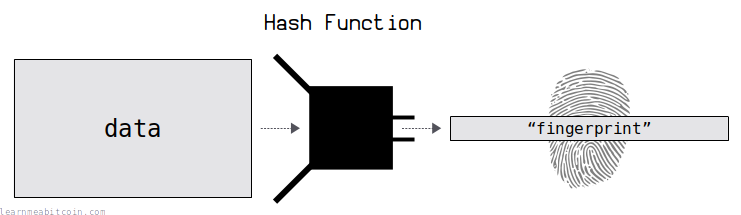
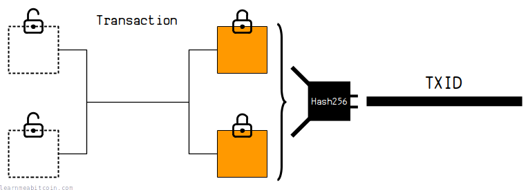
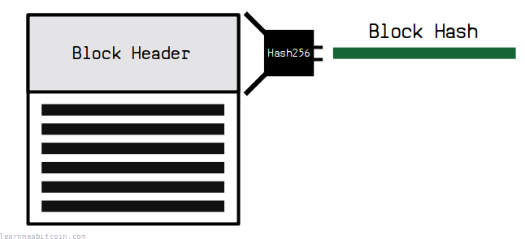
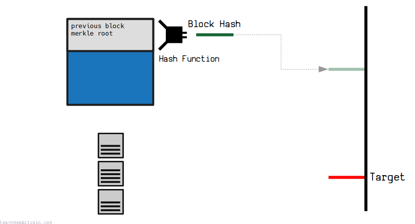
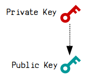
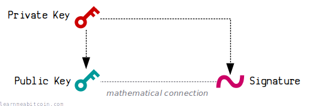
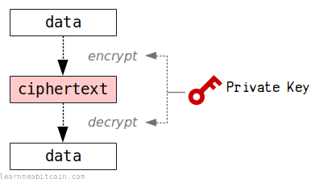
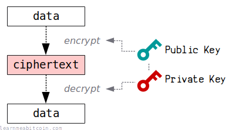

> Cryptography is the practice and study of techniques for secure communication in the presence of adversarial behavior.

Ron Rivest, Handbook of Theoretical Computer Science. Vol. 1. (1990)

Bitcoin uses cryptography. That's why it's sometimes referred to as a "cryptocurrency".

You might think that being a "cryptocurrency" means there's all kinds of cryptography flying around under the hood, but the Bitcoin software is actually built using *two* specific tools from the cryptographic toolbox:

1. [Hash Function](#hash-function)
2. [Public Key Cryptography](#public-key-cryptography)

## 1. Hash Function

A [hash function](cryptography/hash-function.md) is a tool that creates **fingerprints for data**.

 SHA-256 (Text)

Text

Enter any string of characters

`0 characters`

SHA-256

SHA-256(text)

`0 bytes`

0 secs

**This is just a quick example of the SHA-256 hash function.** It hashes text (ASCII characters) instead of hexadecimal bytes. Use SHA-256 and HASH256 instead for hashing actual raw data in Bitcoin using SHA-256.

It takes in any amount of data, and *scrambles* and *compresses* it to produce a short, unique result called a "hash". And because these "hashes" are unique for each piece of data, they're perfect for use as *reference numbers*.

For example, we hash [transaction data](transaction.md) to create [TXIDs](transaction/input/txid.md), and we hash [block data](block.md) to get [block hashes](block/hash.md). This gives us unique references for each transaction and block, which we can use to look them up in a [blockchain explorer](/explorer/).

A *TXID* is the hash of transaction data.

A *block hash* is the hash of a block header.

Furthermore, every transaction is connected to a block through a [merkle root](block/merkle-root.md), and every block is connected to another block by referencing the hash of a [previous block](block/previous-block.md).

Hashes are used to *connect* all the data in the [blockchain](blockchain.md) together.

But what makes Bitcoin an *invention* is that Satoshi came up with the idea to use a hash function as the basis for **[mining](mining.md)**.

In short, the result of the hash function is *uncontrollable*; you don't know what the result of the hash function is going to be until you actually hash the data. Satoshi used this property to create a form of lottery, where a new [block](block.md) can only be added to the [blockchain](blockchain.md) if someone is able to get a [block hash](block/hash.md) below a certain [target](mining/target.md) value.

The block hash is used in conjunction with a target to create a network-wide lottery.

This means that no single person/computer is ever in complete control of the blocks that get added to the blockchain. This is what separates Bitcoin from all other payment systems created in the past, because for the first time ever there is no central authority in control of a ledger of transactions.

So whilst hash functions are used throughout Bitcoin as a general tool for creating reference numbers and linking data together, **it's ultimately the clever use of the hash function for *mining* that sets Bitcoin apart**.

Anyway, there are [various flavors of hash function](https://en.wikipedia.org/wiki/List_of_hash_functions) you can use, but Bitcoin uses the following two exclusively:

1. [SHA-256](https://nvlpubs.nist.gov/nistpubs/FIPS/NIST.FIPS.180-4.pdf) (2001) – The primary hash function used throughout Bitcoin.
     

    SHA-256

   Data (Hex)

   `0 bytes`

   
   SHA-256

   SHA-256(data)

   `0 bytes`

   0 secs
2. [RIPEMD-160](https://homes.esat.kuleuven.be/~bosselae/ripemd160/pdf/AB-9601/AB-9601.pdf) (1996) – A secondary hash function, only used for [shortening public keys](keys/public-key/hash.md).
     

    RIPEMD-160

   Data (Hex)

   `0 bytes`

   
   RIPEMD-160

   RIPEMD-160(data)

   `0 bytes`

   0 secs

## 2. Public Key Cryptography

Public key cryptography involves using mathematics to create a *pair* of keys: a [private key](keys/private-key.md) and a [public key](keys/public-key.md).

These are basically two very large numbers. And due to the special cryptographic mathematics used to create these keys, you can give away the public key, but nobody can work backwards from it to figure out the private key.

This isn't particularly useful on its own. However, part of public key cryptography is the ability to use the private key to create what's known as a [digital signature](keys/signature.md), and this will also have a unique mathematical connection to the public key.

Anyway, Bitcoin utilizes this kind of public key cryptography as the basis for the locking mechanism inside [transactions](transaction.md):

When you want to "receive" bitcoins, someone will create a transaction that *locks* a set amount of bitcoins (an [output](transaction/output.md)) to your public key.

Then, when you want to "send" these bitcoins to someone else, you create a digital signature using your private key, and this *unlocks* the bitcoins so that you can send them on to someone else.

Now, there are two properties of digital signatures that are vitally important for this to work:

1. **Only the person who owns the private key for a public key can create a valid digital signature for it.** This means that nobody can unlock your bitcoins unless they have the private key for the public key that the bitcoins have been locked to, because only the owner of the private key can create a digital signature that will have a mathematical connection to the public key.
2. **A digital signature is created by using the private key to "sign" the entire transaction.** This means that nobody can reuse your digital signature to unlock bitcoins locked to the same public key in a *different* transaction, because the digital signature itself is "tied" to the transaction.

So in short, Bitcoin utilizes this type of *public key cryptography* as the basis for securely **controlling the ownership of bitcoins**, and it all works thanks to the clever use of mathematics.

Anyway, there are [various flavors of public key cryptosystems](https://en.wikipedia.org/wiki/Public-key_cryptography) you can use, but Bitcoin uses the following two exclusively:

1. [ECDSA](https://www.secg.org/sec1-v2.pdf) (1998) – The first public key cryptosystem used within Bitcoin.
     

    Public Key

   Generate Random

   Private Key

   `0 bytes`

   Public Key

   Coordinates

   x:

   0d

   y:

   0d

   parity:

   A public key is just a point on an elliptic curve. The final public key is these coordinates in hexadecimal.

   Compression
    Compressed (02 or 03 prefix)
    Uncompressed (04 prefix)
    x-only (no prefix)

   The elliptic curve is symmetrical along the x-axis, so a *compressed* public key only needs to store the full x-coordinate and whether the y-coordinate is even or odd.

   An x-only public key is used in [Taproot](upgrades/taproot.md) outputs. The corresponding y-coordinate is assumed to be even.

   `0 bytes`

   **Never enter your private key into a website, or use a private key generated by a website.** Websites can easily save the private key and use it to steal your bitcoins.

   0 secs

    ECDSA Sign

   Random Example

   Message Hash (z)

   This is typically the hash of some transaction data (that has been prepared for signing)

   0x

   `0 bytes`

   Nonce (k)

   0x

   Random

   Private Key (d)

   0x

   Random

   `0 bytes`

   Signature

   R:

   0d

   S:

   0d

   High:

   Low:

   **Never enter your private key into a website, or use a private key generated by a website.** Websites can easily save the private key and use it to steal your bitcoins.

   0 secs

    ECDSA Verify

   Random Example

   Message Hash (z)

   0x

   `0 bytes`

   Signature

   R:

   0d

   S:

   0d

   Public Key (Q)

   0x

   `0 bytes`

   Signature Verification

   x:

   0d

   y:

   0d

   0 secs
2. [Schnorr Signatures](https://github.com/bitcoin/bips/blob/master/bip-0340.mediawiki) (1990) – A more efficient alternative to ECDSA. The [patent](https://patents.google.com/patent/US4995082) for this cryptosystem expired in 2010 (a year after Bitcoin was first released). It was integrated into Bitcoin as part of the [Taproot](upgrades/taproot.md) upgrade in 2021.
     

    Schnorr Sign

   Random Example

   Private Key (d')

   0x

   Random

   `0 bytes`

   Auxiliary Bytes (aux\_rand)

   0x

   +1

   Random

   `0 bytes`

   Message (m)

   0x

   `0 bytes`

   ---

   Details

   Public Key (P) = d'G

   x:

   0x

   y:

   0x

   Private Key (d) = (n - d') if P[y] is odd

   0x

   Private Nonce

   aux\_rand\_hash = hashBIP0340/aux(aux\_rand)

   0x

   t = d XOR aux\_rand\_hash

   0x

   k' = int(hashBIP0340/nonce(t || P[x] || m)) % n

   0x

   Public Nonce (R) = k'G

   x:

   0x

   y:

   0x

   k  = (n - k') if R[y] is odd

   0x

   Challenge (e) = int(hashBIP0340/challenge(R[x] || P[x] || m)) % n

   0x

   Signature

   r = R[x]

   0d

   s = (k + ed) % n

   0d

   Signature

   0x

   `0 bytes`

   **Never enter your private key into a website, or use a private key generated by a website.** Websites can easily save the private key and use it to steal your bitcoins.

   0 secs

    Schnorr Verify

   Random Example

   Public Key (P[x])

   0x

   Random

   `0 bytes`

   Message (m)

   0x

   Random

   `0 bytes`

   Signature (r, s)

   0x

   `0 bytes`

   ---

   Details

   Public Key (P)

   x:

   0d

   y:

   0d

   Signature

   r:

   0d

   s:

   0d

   Point 1 = sG

   x:

   0d

   y:

   0d

   Challenge (e) = int(hashBIP0340/challenge(r || P[x] || m)) % n

   0d

   (n - e)

   0d

   Point 2 = (n-e)P

   x:

   0d

   y:

   0d

   R = sG + (n-e)P

   x:

   0d

   y:

   0d

   Verify (r = R[x])

   r:   

   0d

   R[x]:

   0d

   0 secs

### Brief History

I'm not a cryptography expert, but it's interesting to a know a little about the *history* of public key cryptography so you know where Bitcoin stands in the grand scheme of things…

Public key cryptography has been around since the 1970s.

Before this, data could only be encrypted and decrypted using the *same key* (**symmetric encryption**). This worked well, but the problem was that you had to share the same key between two people, which was a nightmare for security, as it's difficult to share a single key without someone else getting their hands on it.

Symmetric encryption.

Public key cryptography solved this problem by allowing you to use a *pair of keys* (**asymmetric encryption**) instead. Now you can hand out a public key for people to encrypt data with, and this can be decrypted using the corresponding private key.

Asymmetric encryption.

The first public key cryptography system was [RSA](https://en.wikipedia.org/wiki/RSA_%28cryptosystem%29) (**1977**), which was a groundbreaking advancement in the world of cryptography.

RSA is primarily used for *encryption*, where data is encrypted by anyone using the public key, and decrypted using the private key. However, RSA can also be used for *authentication* (i.e. digital signatures), where data is encrypted using the private key, and can be decrypted by anyone using the public key.

The first formal proposal for digital signatures was actually [DSA](https://en.wikipedia.org/wiki/Digital_Signature_Algorithm) (Digital Signature Algorithm) (**1991**). This uses the same principles of public key cryptography, but was designed specifically for creating digital signatures only.

DSA was improved upon by [Schnorr Signatures](cryptography/elliptic-curve/schnorr.md) (**1990**) and [ECDSA](cryptography/elliptic-curve/ecdsa.md) (Elliptic Curve Digital Signature Algorithm) (**1998**). These use the [elliptic curve](cryptography/elliptic-curve.md) to improve the efficiency of creating and verifying digital signatures.

Public key cryptography can be used for *encryption* and/or *authentication*. However, Bitcoin uses the *authentication* (digital signatures) side of public key cryptography.

## Summary

Satoshi didn't invent any new kind of cryptography for use within Bitcoin; they simply utilized existing cryptographic tools to build the first decentralized electronic payment system:

1. **[Hash Function](cryptography/hash-function.md)** – Used for [mining](mining.md) and connecting the [blockchain](blockchain.md) together.
2. **Digital Signatures** (e.g. [ECDSA](cryptography/elliptic-curve/ecdsa.md)) – Used for locking and unlocking bitcoins in [transactions](transaction.md).

It's possible that Satoshi didn't know the internal details of **hash functions** and **public key cryptography**. However, this wasn't important, as they knew *enough* about their properties to be able to combine them in a creative way to develop a system that had not previously existed.

And that was genius enough in itself.

So don't worry if you're not an expert in cryptography and you want to work with Bitcoin, because whilst it's cool to understand how it all works under the hood, it's only important to simply be *aware* of what tools are available and what they're useful for.

> Skill in production cryptanalysis has always been heavily on the side of the professionals, but innovation, particularly in the design of new types of cryptographic systems, has come primarily from the amateurs.

Whitfield Diffie, [New Directions in Cryptography](https://www.cs.jhu.edu/~rubin/courses/sp03/papers/diffie.hellman.pdf)

## Resources

* [Crypto by Steven Levy](https://www.stevenlevy.com/crypto) – This is an excellent book for anyone looking for a light yet deeply interesting introduction to the history of modern cryptography. I highly recommend it.
* [Introduction to Cryptography by Christof Paar](https://www.youtube.com/@introductiontocryptography4223) – Excellent series of lectures explaining the technical details of modern cryptography. Includes videos on hash functions, elliptic curve cryptography, and digital signatures.