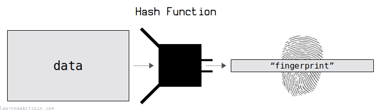
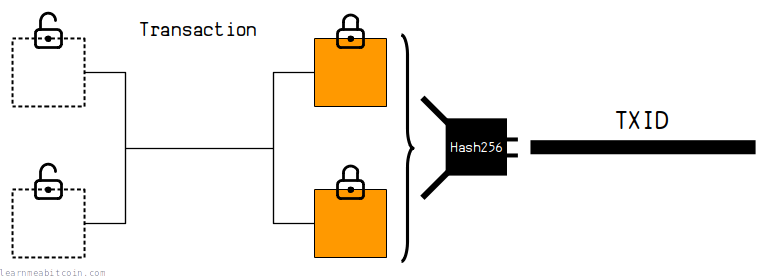
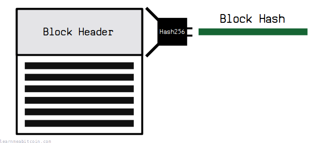
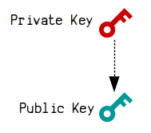
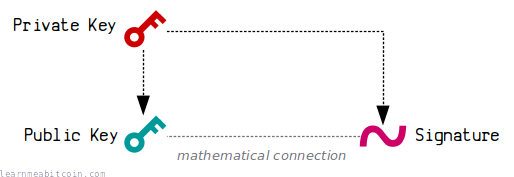
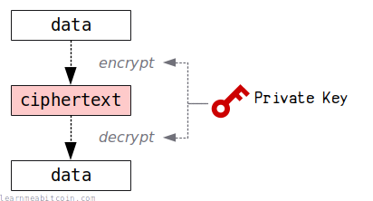
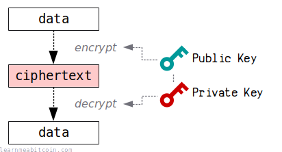

# 密码学总览 (Cryptography)

> 密码学是在存在对抗行为的情况下安全通信技术的实践和研究。
>
> — Ron Rivest, Handbook of Theoretical Computer Science. Vol. 1. (1990)

比特币使用密码学。这就是为什么它有时被称为“加密货币”（cryptocurrency）的原因。

你可能会认为作为“加密货币”意味着底层有各种各样的密码学技术，但比特币软件实际上只使用了密码学工具箱中的**两个**特定工具：

1. [哈希函数 (Hash Function)](#hash-function)
2. [公钥密码学 (Public Key Cryptography)](#public-key-cryptography)

## 1. 哈希函数 (Hash Function)

[哈希函数](cryptography/hash-function.md)是一种为数据创建**指纹**的工具。

| 字段 | 值 |
| --- | --- |
| 文本 | 输入任何字符串 `0 characters` |
| SHA-256(文本) | `0 bytes` |

**这只是 SHA-256 哈希函数的一个简单示例。** 它对文本（ASCII字符）进行哈希处理，而不是十六进制字节。在比特币中，请使用 SHA-256 和 HASH256 来哈希实际的原始数据。

它接收任意数量的数据，并对其进行*混淆*和*压缩*，从而产生一个短的、独特的结果，称为“哈希（hash）”。由于每个数据的这些“哈希”都是独一无二的，因此它们非常适合用作*参考编号*。

例如，我们对[交易数据](transaction.md)进行哈希处理以创建[TXID](transaction/input/txid.md)，并且我们对[区块数据](block.md)进行哈希处理以获得[区块哈希](block/hash.md)。这为每笔交易和每个区块提供了独特的引用，我们可以使用它们在[区块链浏览器](/explorer/)中进行查找。

*TXID* 是交易数据的哈希。

*区块哈希* 是区块头的哈希。

此外，每笔交易都通过[默克尔根 (merkle root)](block/merkle-root.md)连接到一个区块，并且每个区块都通过引用[前一个区块 (previous block)](block/previous-block.md)的哈希连接到另一个区块。

哈希用于将[区块链](blockchain.md)中的所有数据*连接*在一起。

但是，使比特币成为一项*发明*的原因是，中本聪想出了使用哈希函数作为**[挖矿](mining.md)**基础的主意。

简而言之，哈希函数的结果是*不可控*的；在实际对数据进行哈希处理之前，你无法知道哈希函数的结果会是什么。中本聪利用这个特性创建了一种彩票形式，只有当有人能够获得低于某个[目标 (target)](mining/target.md)值的[区块哈希](block/hash.md)时，新的[区块](block.md)才能被添加到[区块链](blockchain.md)中。

区块哈希与目标值结合使用，创建了一个全网范围的彩票系统。

这意味着没有任何单个人/计算机能够完全控制被添加到区块链上的区块。这就是比特币与过去创建的所有其他支付系统的区别所在，因为这是有史以来第一次没有中央权威机构控制交易账本。

因此，虽然哈希函数在比特币中被广泛用作创建参考编号和链接数据的通用工具，但**最终是巧妙地将哈希函数用于*挖矿*，才使比特币与众不同**。

无论如何，你可以使用[各种风格的哈希函数](https://en.wikipedia.org/wiki/List_of_hash_functions)，但比特币仅使用以下两种：

1. [SHA-256](https://nvlpubs.nist.gov/nistpubs/FIPS/NIST.FIPS.180-4.pdf) (2001) – 比特币中主要使用的哈希函数。
     

   | 字段 | 值 |
   | --- | --- |
   | 数据 (十六进制) | `0 bytes` |
   | SHA-256 | SHA-256(data) `0 bytes` |
2. [RIPEMD-160](https://homes.esat.kuleuven.be/~bosselae/ripemd160/pdf/AB-9601/AB-9601.pdf) (1996) – 辅助哈希函数，仅用于[缩短公钥](keys/public-key/hash.md)。
     

   | 字段 | 值 |
   | --- | --- |
   | 数据 (十六进制) | `0 bytes` |
   | RIPEMD-160 | RIPEMD-160(data) `0 bytes` |

## 2. 公钥密码学 (Public Key Cryptography)

公钥密码学涉及使用数学来创建*一对*密钥：[私钥](keys/private-key.md)和[公钥](keys/public-key.md)。

这基本上是两个非常大的数字。由于创建这些密钥所使用的特殊密码学数学，你可以分发公钥，但没有人可以从它反向推导出私钥。

这本身并不是特别有用。然而，公钥密码学的一部分能力是使用私钥创建被称为[数字签名](keys/signature.md)的东西，并且这也会与公钥产生独特的数学联系。

无论如何，比特币利用这种公钥密码学作为[交易](transaction.md)内部锁定机制的基础：

当你想“接收”比特币时，有人会创建一笔交易，将设定数量的比特币（一个[输出](transaction/output.md)）*锁定*到你的公钥上。

然后，当你想将这些比特币“发送”给其他人时，你可以使用你的私钥创建一个数字签名，这会*解锁*比特币，这样你就可以将它们发送给其他人。

现在，数字签名有两个对这项工作至关重要的属性：

1. **只有拥有对应公钥的私钥的人才能为其创建有效的数字签名。** 这意味着没有人可以解锁你的比特币，除非他们拥有锁定比特币的公钥对应的私钥，因为只有私钥的所有者才能创建与该公钥产生数学联系的数字签名。
2. **数字签名是通过使用私钥对“整个交易”进行“签名”来创建的。** 这意味着没有人可以重用你的数字签名，在*不同*的交易中解锁锁定在同一个公钥上的比特币，因为数字签名本身与这笔交易“绑定”在一起。

简而言之，比特币利用这种类型的*公钥密码学*作为安全地**控制比特币所有权**的基础，而这一切都归功于对数学的巧妙运用。

无论如何，你可以使用[各种风格的公钥密码系统](https://en.wikipedia.org/wiki/Public-key_cryptography)，但比特币仅使用以下两种：

1. [ECDSA](https://www.secg.org/sec1-v2.pdf) (1998) – 比特币内部使用的第一个公钥密码系统。
     

    公钥 (Public Key)

   | 字段 | 值 |
   | --- | --- |
   | 私钥 (Private Key) | `0 bytes` |
   | 公钥 坐标 (Coordinates) | x: 0d y: 0d 奇偶校验 (parity):  公钥只是椭圆曲线上的一个点。最终的公钥就是这些十六进制坐标。 |
   | 压缩 (Compression) | - 压缩 (02 或 03 前缀) - 未压缩 (04 前缀) - 仅x (无前缀)  椭圆曲线沿x轴对称，因此*压缩*公钥只需存储完整的x坐标以及y坐标是偶数还是奇数。  仅x公钥用于[Taproot](upgrades/taproot.md)输出。其相应的y坐标被假定为偶数。 |
   | 公钥 (十六进制) | `0 bytes` |

   **永远不要将您的私钥输入到网站，或使用网站生成的私钥。** 网站很容易保存私钥并用它来窃取您的比特币。

    ECDSA 签名 (Sign)

   | 字段 | 值 |
   | --- | --- |
   | 消息哈希 (z) | 这通常是某些（已经准备好进行签名的）交易数据的哈希 0x `0 bytes` |
   | 随机数 (Nonce) (k) | 0x |
   | 私钥 (d) | 0x |
   | 签名 (Signature) | R: 0d S: 0d High: Low: |

   **永远不要将您的私钥输入到网站，或使用网站生成的私钥。** 网站很容易保存私钥并用它来窃取您的比特币。

    ECDSA 验证 (Verify)

   | 字段 | 值 |
   | --- | --- |
   | 消息 (m) | `0 bytes` |
   | 签名 (Signature) | R: 0d S: 0d |
   | 公钥 (Q) | 0x `0 bytes` |
   | 签名验证 | x: 0d y: 0d |
2. [Schnorr 签名 (Schnorr Signatures)](https://github.com/bitcoin/bips/blob/master/bip-0340.mediawiki) (1990) – ECDSA 的一种更有效的替代方案。这个密码系统的[专利](https://patents.google.com/patent/US4995082)在2010年过期（在比特币首次发布一年后）。作为2021年[Taproot](upgrades/taproot.md)升级的一部分，它被整合到了比特币中。
     

    Schnorr 签名 (Sign)

   | 字段 | 值 |
   | --- | --- |
   | 私钥 (d') | 0x `0 bytes` |
   | 辅助字节 (aux_rand) | 0x `0 bytes` |
   | 消息 (m) | `0 bytes` |
   | 签名 (Signature) | R: 0d S: 0d |
   | 公钥 (Q) | 0x `0 bytes` |
   | 签名验证 | x: 0d y: 0d |

    Schnorr 验证 (Verify)

   | 字段 | 值 |
   | --- | --- |
   | 公钥 (P[x]) | 0x `0 bytes` |
   | 消息 (m) | 0x `0 bytes` |
   | 签名 (Signature) | r: 0d s: 0d |
   | 公钥 (P) | 0x `0 bytes` |
   | 挑战 (e) = int(hashBIP0340/challenge(r \|\| P[x] \|\| m)) % n | 0x |
   | 点 (R) | x: 0d y: 0d R = sG + (n-e)P x: 0d y: 0d |
   | 验证 (r = R[x]) | r: 0d R[x]: 0d |

### 简史 (Brief History)

我不是密码学专家，但了解一点公钥密码学的*历史*是很有趣的，这样你就知道比特币在整个大局中的地位……

公钥密码学自20世纪70年代就已经存在。

在此之前，数据只能使用*相同的密钥*进行加密和解密（**对称加密**）。这很有效，但问题是你必须在两个人之间共享相同的密钥，这对安全性来说是一场噩梦，因为在不被别人得到的情况下共享一个密钥是很困难的。

对称加密 (Symmetric encryption).

公钥密码学通过允许你使用*一对密钥*（**非对称加密**）解决了这个问题。现在你可以分发一个公钥让人们用来加密数据，而这些数据可以使用相应的私钥来解密。

非对称加密 (Asymmetric encryption).

第一个公钥密码系统是[RSA](https://en.wikipedia.org/wiki/RSA_%28cryptosystem%29)（**1977**），这是密码学世界中一项突破性的进步。

RSA主要用于*加密*，即任何人都可以使用公钥对数据进行加密，并使用私钥进行解密。然而，RSA也可以用于*认证*（即数字签名），即使用私钥对数据进行加密，并且任何人都可以使用公钥进行解密。

其实，第一个正式的数字签名提案是[DSA](https://en.wikipedia.org/wiki/Digital_Signature_Algorithm)（数字签名算法，Digital Signature Algorithm）（**1991**）。它使用了相同的公钥密码学原理，但是专门为仅仅创建数字签名而设计的。

DSA随后被[Schnorr 签名 (Schnorr Signatures)](cryptography/elliptic-curve/schnorr.md)（**1990**）和[ECDSA](cryptography/elliptic-curve/ecdsa.md)（椭圆曲线数字签名算法，Elliptic Curve Digital Signature Algorithm）（**1998**）所改进。这些使用了[椭圆曲线](cryptography/elliptic-curve.md)来提高创建和验证数字签名的效率。

公钥密码学可用于*加密*和/或*认证*。但是，比特币使用了公钥密码学的*认证*（数字签名）方面。

## 总结 (Summary)

中本聪并没有为比特币发明任何新型的密码学；他们只是利用现有的密码学工具建立起了第一个去中心化的电子支付系统：

1. **[哈希函数 (Hash Function)](cryptography/hash-function.md)** – 用于[挖矿](mining.md)并将[区块链](blockchain.md)连接在一起。
2. **数字签名 (Digital Signatures)**（例如 [ECDSA](cryptography/elliptic-curve/ecdsa.md)） – 用于在[交易](transaction.md)中锁定和解锁比特币。

有可能中本聪并不了解**哈希函数**和**公钥密码学**的内部细节。但这并不重要，因为他们对这些工具的属性有*足够*的了解，能够以一种创造性的方式将它们结合起来，开发出一个以前不存在的系统。

这本身就已经够天才的了。

因此，如果你不是密码学专家，并且你想使用比特币工作，请不要担心。因为虽然了解它是如何在底层运作的是件很酷的事情，但更重要的是只需*意识到*有哪些工具可用以及它们的用途。

> 生产环境下的密码分析技能一直严重依赖于专业人士，但创新，特别是在新型密码系统设计方面的创新，却主要来自于业余爱好者。
>
> — Whitfield Diffie, [New Directions in Cryptography](https://www.cs.jhu.edu/~rubin/courses/sp03/papers/diffie.hellman.pdf)

## 资源 (Resources)

* [Crypto by Steven Levy](https://www.stevenlevy.com/crypto) – 对于任何想要轻松而又深刻有趣地了解现代密码学历史的人来说，这是一本极好的书。我强烈推荐。
* [Introduction to Cryptography by Christof Paar](https://www.youtube.com/@introductiontocryptography4223) – 解释现代密码学技术细节的精彩系列讲座。包括关于哈希函数、椭圆曲线密码学和数字签名的视频。