[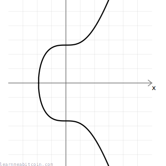](../../images/technical_cryptography_elliptic-curve_elliptic-curve.png)
[](../../images/technical_cryptography_elliptic-curve_latex-elliptic-curve-equation.png)

椭圆曲线 (elliptic curve) 被用作某些密码学系统的基础。

椭圆曲线的结构允许您执行一个数学函数（“[相乘](#multiply)”），以单向移动曲线上的点，而无法反向移动。这被称为“陷门函数 (trapdoor function)”，它是椭圆曲线的核心特征，使其非常适合用于[公钥密码学](../cryptography.md#public-key-cryptography)。

简而言之，**椭圆曲线具有使其在密码学中非常有用的数学性质**，它们是比特币中使用的数字[签名](../keys/signature.md)系统（[ECDSA](elliptic-curve/ecdsa.md)）的一部分。

* 您不需要了解椭圆曲线就能进行比特币开发，所以除非您真的想学，否则不要强迫自己学习这些内容。
* 在您的编程语言中使用椭圆曲线库来处理这一切，比您自己编写代码更安全也更容易。

## 参数 (Secp256k1)

中本聪选择将 **secp256k1** 曲线用于 [ECDSA](elliptic-curve/ecdsa.md)，该曲线具有以下参数：

```
# y² = x³ + ax + b
$a = 0
$b = 7

# prime field
$p = 115792089237316195423570985008687907853269984665640564039457584007908834671663 #=> 2**256 - 2**32 - 2**9 - 2**8 - 2**7 - 2**6 - 2**4 - 1

# number of points on the curve we can hit ("order")
$n = 115792089237316195423570985008687907852837564279074904382605163141518161494337

# generator point (the starting point on the curve used for all calculations)
$G = {
  x: 55066263022277343669578718895168534326250603453777594175500187360389116729240,
  y: 32670510020758816978083085130507043184471273380659243275938904335757337482424,
}
```

* `a`, `b` – 椭圆曲线是由方程 `y² = x³ + ax + b` 描述的一组点的集合，这就是变量 `a` 和 `b` 的来源。不同的曲线具有不同系数值，而对 *secp256k1* 来说特定的系数值是 `a=0` 和 `b=7`。
* `p` – 这是**质数模数 (prime modulus)**。在执行数学计算时，该数字将所有数字保持在特定范围内（同样，它针对 *secp256k1* 特有）。它是一个质数是密码学能够发挥作用的关键要素。
* `n` – 这是**阶数 (order)**。它是我们在曲线上可以到达的**点数数量**。它小于 `p`，并且受到选定基点（见下文）的影响。
* `G` – 这是**基点 (generator point)**，或称生成点。这是执行大多数数学运算时在曲线上的*起点*。选择该点的确切原因[尚不清楚](https://crypto.stackexchange.com/questions/60420/what-does-the-special-form-of-the-base-point-of-secp256k1-allow/60421#60421)，但通常是因为它提供了很高的*阶数*（见上文）并且未表现出任何固有的密码学漏洞。  
  [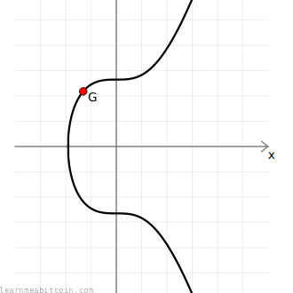](../../images/technical_cryptography_elliptic-curve_point-generator.png)

**Secp256k1** 只是密码学中使用的[其中一个特定椭圆曲线](http://www.secg.org/sec2-v2.pdf)的名称。它是以下词汇的缩写：

* **sec** = Standard for Efficient Cryptography (高效密码学标准) — 一个开发密码学商业标准的联盟。
* **p** = Prime (质数) — 使用质数来创建有限域。
* **256** = 256 位 (bits) — 所用质数域的大小。
* **k** = Koblitz (科布利茨) — 椭圆曲线的具体类型。
* **1** = 该类别下的第一条曲线。

### 为什么中本聪选择 Secp256k1？

> 我必须承认，这个项目在发布前开发了 2 年，而在诸多问题上我每一项只能花有限的时间。[...] 我没有发现有什么推荐曲线类型的资料，所以我只是……随便挑了一个。
> 
> 中本聪, [给 Mike Hearn 的邮件 (2011 年 1 月 10 日)](https://plan99.net/~mike/satoshi-emails/thread3.html)

## 有限域 (Finite Field)

> **有限域** – 具有有限个元素的整数环。

我在本教程中使用的图表显示了一条平滑的椭圆曲线，如下所示：

[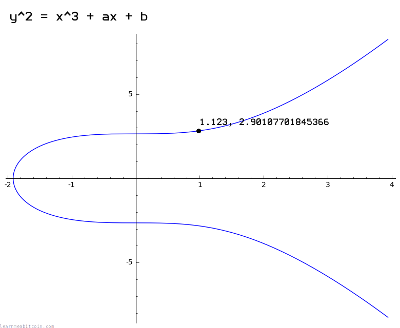](../../images/technical_cryptography_elliptic-curve_sage-elliptic-curve-real-numbers.png)

实数域上的椭圆曲线。

然而，比特币中使用的实际曲线看起来更像是点状的散点图，如下所示：

[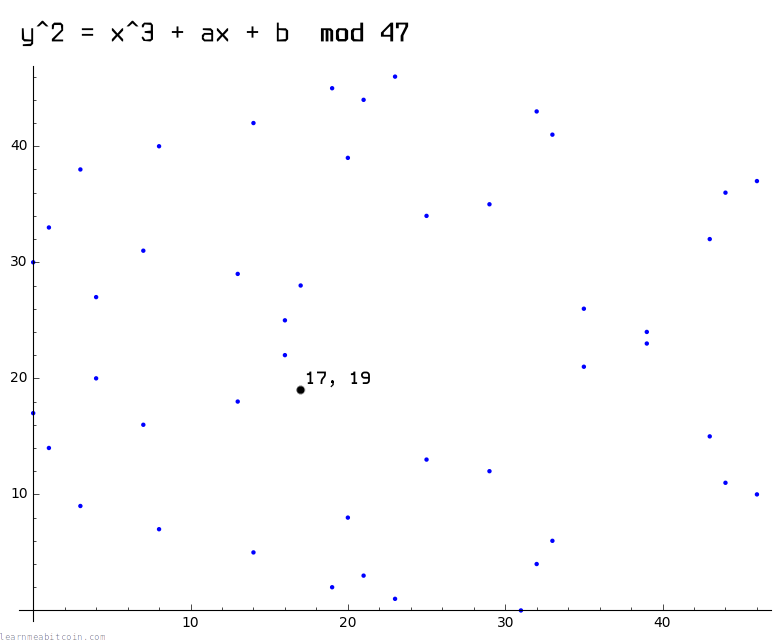](../../images/technical_cryptography_elliptic-curve_sage-elliptic-curve-finite-field-47.png)

有限域上的椭圆曲线 (模 47)。

这是因为比特币中使用的曲线位于*整数*的*有限域*上（即使用 `mod p` 将数字限制在特定范围内），这打破了您在使用*[实数](https://www.mathsisfun.com/numbers/real-numbers.html)*时所能得到的连续曲线。

然而，即使这些图表看起来截然不同，**您可以在这两条曲线上执行的数学运算仍以相同的方式工作**。

当然，*secp256k1* 曲线的 `p` 值*非常庞大*，因此它更像下面的图表，只不过想象一下上面的点数几乎和宇宙中的原子一样多：

[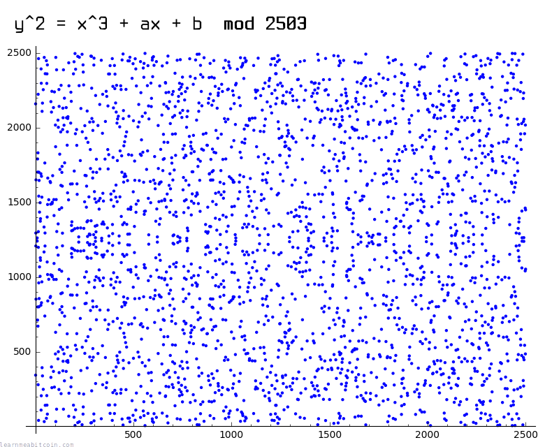](../../images/technical_cryptography_elliptic-curve_sage-elliptic-curve-finite-field-2503.png)

有限域上的椭圆曲线 (模 2503)。

### Sage Math

我使用 [Sage Math](https://www.sagemath.org/) 制作了本页上的图表。

在 Ubuntu 上安装：

```
sudo apt install sagemath
```

在有理数域（实数）上创建椭圆曲线：

```
sage: C = EllipticCurve([0,7]) # y^2 = x^3 + 7, where a=0, b=7
sage: plot(C)
sage: C.lift_x(1.123) # get example y coordinate
sage: C.lift_x(-1.834) # get example y coordinate
```

在较小有限域上创建椭圆曲线：

```
sage: F = FiniteField(47)
sage: C = EllipticCurve(F, [0, 7]) # y^2 = x^3 + 7, where a=0, b=7
sage: plot(C)
sage: C.lift_x(17) # get example y coordinate
```

创建比特币中使用的椭圆曲线（运行会较慢）：

```
sage: F = FiniteField(115792089237316195423570985008687907853269984665640564039457584007908834671663)
sage: C = EllipticCurve(F, [0, 7])
```

### 为什么使用有限域？

因为在计算机上实现密码学时，处理*有限*域中的整数（例如 `1, 2, 3, 4, ..., p`）比处理*无限*的实数（例如 `0.911722707844879, 2.90107701845366, ...`）要容易得多。

在计算机上处理小数时，您会面临精度丢失的风险，因此有限域整数所提供的绝对精度更适合密码学。

为了便于说明，我将在本教程的其余部分使用*平滑*曲线。

## 椭圆曲线数学

您可以在椭圆曲线上的*点*上执行几种数学运算。**两个主要的运算**是 [`double()`](#double)（翻倍）和 [`add()`](#add)（相加），然后它们可以组合起来执行 [`multiply()`](#multiply)（相乘）。

这些运算是椭圆曲线密码学的基石，用于在 [ECDSA](elliptic-curve/ecdsa.md) 中生成[公钥](../keys/public-key.md)和[签名](../keys/signature.md)。

* [模逆 (Modular Inverse)](#modular-inverse)
* [点翻倍 (Double)](#double)
* [点相加 (Add)](#add)
* [点相乘 (Multiply)](#multiply)

### 模逆 (Modular Inverse)

简单示例

数字

0d

逆元 (Inverse)

0d

模数 (Modulus)

0d

n
p

**n** = secp256k1 椭圆曲线上的点数（在处理标量时使用，例如私钥）  
**p** = secp256k1 椭圆曲线的有限域大小（在处理点时使用，即坐标）

0 秒

在我们在曲线上对点执行 [`double()`](#double) 和 [`add()`](#add) 运算之前，我们需要先求出有限域中数字的*模逆 (modular inverse)*。

这是因为 `double()` 和 `add()` 的计算公式中包含了*除法* `/` 运算。

然而，在整数有限域中并没有直接的*除法*运算。相反，您可以**乘以一个数字的*模逆元***，以达到与*除法*相同的效果：

[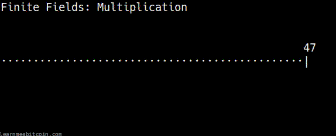](../../images/technical_cryptography_elliptic-curve_modular-inverse.gif)

在 **47** 的有限域中，**13** 的模乘逆元是 **29**。

换句话说，如果您从有限域中的特定数字开始并乘以另一个数字，您可以通过再次乘以所用数字的*逆元*来“回到”您开始的那个数字。

显然，这是椭圆曲线数学中令人困惑的第一步，但您可以直接将“乘以逆元”视为**模运算中*除法*的替代方案**。

**当有限域中元素的个数为*质数*时，这总是有效的。** 质数不能被任何其他数整除，因此它会将模乘的结果均匀地分布回有限域中的每个数字（不会重复或遗漏某些数字）。因此，通过使用质数作为模数，您可以*保证*有限域中的每个数字都存在一个乘法逆元（即存在一个“除法”运算）。

因此，椭圆曲线数学的第一步是能够求出有限域中数字的逆元：

#### 代码

```
def inverse(a, m = $p)

  # store original modulus
  m_orig = m

  # make sure a is positive
  if a < 0
    a = a % m
  end

  # set initial values before loop
  y_prev = 0
  y = 1

  while a > 1
    q = m / a

    y_before = y # store current value of y
    y = y_prev - q * y # calculate new value of y
    y_prev = y_before # set previous y value to the old y value

    a_before = a # store current value of a
    a = m % a # calculate new value of a
    m = a_before # set m to the old a value
  end
  
  return y % m_orig
end
```

* 此函数使用 [扩展欧几里得算法 (extended Euclidean algorithm)](https://web.archive.org/web/20230212044931/http://www-math.ucdenver.edu/~wcherowi/courses/m5410/exeucalg.html)（您不需要知道它的工作原理）来求解数字的模逆元。这只是一个比通过暴力搜索求解逆元更快的方法。
* 并非所有的编程语言都有内置的“模逆”函数，这就是为什么您有时必须自己实现一个才能开始研究椭圆曲线数学的原因。

#### 模逆符号

在数学等式中，一个数字的模逆元通常用右上角的 `⁻¹` 表示。

[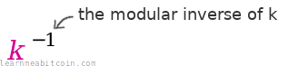](../../images/technical_cryptography_elliptic-curve_inverse-notation.png)

在接下来的运算中，数字的逆元有时是 `mod p`（模*质数*）求解的，有时是 `mod n`（模曲线上的*点数*）求解的。

### 点翻倍 (Double)

基点 (Generator Point)
随机点

点 1 (Point 1)

x:

0d

y:

0d


点 1 + 点 1

x:

0d

y:

0d

0 秒

对一个点进行“翻倍”与将一个点与自身“相加”是一回事。

从直观的几何角度来看，要对一个点进行“翻倍”，您需要在给定点上绘制曲线的*切线*，然后找出该切线与曲线相交的点（只会有一个），然后获取该点关于 x 轴的对称映射点（反射点）。

[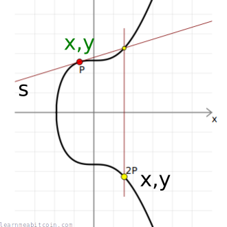](../../images/technical_cryptography_elliptic-curve_point-double.png)

`P` 是曲线上的一个普通点。  
`s` 指的是切线的斜率。

[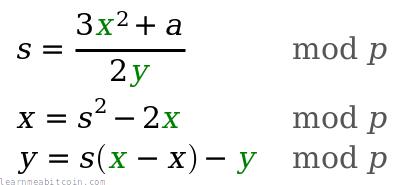](../../images/technical_cryptography_elliptic-curve_latex-point-double.png)

#### 代码

```
def double(point)
  # slope = (3x₁² + a) / 2y₁
  slope = ((3 * point[:x] ** 2 + $a) * inverse((2 * point[:y]), $p)) % $p # using inverse to help with division

  # x = slope² - 2x₁
  x = (slope ** 2 - (2 * point[:x])) % $p

  # y = slope * (x₁ - x) - y₁
  y = (slope * (point[:x] - x) - point[:y]) % $p

  # Return the new point
  return { x: x, y: y }
end
```

**椭圆曲线运算说明。**

在此，您并不是像在日常算术中那样将点的 `x` 和 `y` 坐标值乘以二。

本页上的“翻倍”、“相加”和“相乘”等词汇指的是**我们在椭圆曲线*点*上执行的特定运算**。因此，即使它们与普通的数学运算同名，但在椭圆曲线数学领域中，**它们是完全不同的**。

这有时会让人感到有些困惑，因为在这些方程中也有普通的“相加”和“相乘”运算。诀窍是记住：

* 当这些运算作用在*点 (point)*上时，我们使用的是**椭圆曲线点运算**。
* 当这些运算作用在两个*整数*上时，它只是**日常算术**。

### 点相加 (Add)

随机点

点 1 (Point 1)

x:

0d

y:

0d


点 2 (Point 2)

x:

0d

y:

0d


点 1 + 点 2

x:

0d

y:

0d

0 秒

正如所料，在椭圆曲线数学中，两个点的“相加”与普通的整数相加并不相同，但它仍被称为“相加”。

从几何的角度来看，要将两个点“相加”，您需要在它们之间画一条直线，然后找出该线与曲线相交的点（只会有一个），然后获取该点关于 x 轴的对称映射点。

[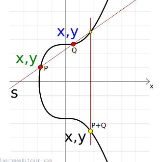](../../images/technical_cryptography_elliptic-curve_point-add.png)

`Q` 是曲线上的第二个普通点。

[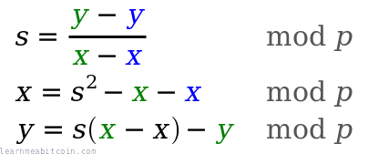](../../images/technical_cryptography_elliptic-curve_latex-point-add.png)

#### 代码

```
def add(point1, point2)
  # double if both points are the same
  if point1 == point2
    return double(point1)
  end

  # slope = (y₁ - y₂) / (x₁ - x₂)
  slope = ((point1[:y] - point2[:y]) * inverse(point1[:x] - point2[:x], $p)) % $p

  # x = slope² - x₁ - x₂
  x = (slope ** 2 - point1[:x] - point2[:x]) % $p

  # y = slope * (x₁ - x) - y₁
  y = ((slope * (point1[:x] - x)) - point1[:y]) % $p

  # Return the new point
  return { x: x, y: y }
end
```

### 点相乘 (Multiply)

此运算是椭圆曲线密码学的核心。

基点 (Generator Point)
随机点

点 1 (Point 1)

x:

0d

y:

0d


Multiplier

0d


+1

随机


点 1 x 乘数 (Multiplier)

x:

0d

y:

0d


步骤 (Steps)
 

0 秒

ECDSA 中的大多数点乘运算都从**基点** `G` 开始。

现在我们可以对曲线上的点进行 `double()` 和 `add()` 了，我们可以取曲线上的任何点，并将其 `multiply()`（乘以）一个整数以到达一个完全不同的新点。

最简单的椭圆曲线相乘方法是，将一个点反复与其自身进行 `add()`，直到达到您想要乘以的数字，这*确实*可行，但在乘以庞大的数字（如比特币中使用的数字）时，这种递增的相加方法将慢得令人无法忍受。

幸运的是，在椭圆曲线上面进行*点乘*有一种更快的方法……

#### 双倍相加算法 (Double-and-add algorithm)

[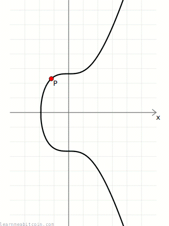](../../images/technical_cryptography_elliptic-curve_point-multiply.gif)

`3P = 2P + P`（一次翻倍，一次相加）

进行点乘的一种更快方法是使用*双倍相加算法 (double-and-add algorithm)*。

此算法结合使用*翻倍 (doubling)*和*相加 (adding)*，以**尽可能少的运算步骤**达到目标倍数。

例如，如果您从 `2` 开始并希望达到 `128`，执行*六次* `double()` 运算比执行*六十四次* `add()` 运算要快得多。

但是，您怎么知道需要多少次翻倍和相加操作才能达到您的目标倍数呢？

奇妙的是，如果您将任何整数转换为其*二进制*表示形式，其中的 `1` 和 `0` 将为您的 `double()` 和 `add()` 运算顺序提供一张*路线图*，引导您到达该倍数。

例如：

```
例如：1 * 21

21 = 10101 (binary)
      │││└ double and add = 21
      ││└─ double         = 10
      │└── double and add = 5
      └─── double         = 2
                            1  <- 始于此处
```

* 您始终从左向右读取。
* 您始终忽略二进制的首位。
* 无论如何，您始终以 `double()` 运算开始。这是因为您是从*单个点*（例如基点）开始的，所以您还没有两个不同的点可以相加。
* `0` = 翻倍 (double)
* `1` = 翻倍并相加 (double and add)

总之，这就是在 Ruby 代码中*使用双倍相加算法*进行**椭圆曲线点乘**的样子：

#### 代码

```
def multiply(k, point = $G)
  # create a copy the initial starting point (for use in addition later on)
  current = point

  # convert integer to binary representation
  binary = k.to_s(2)

  # double and add algorithm for fast multiplication
  binary.split("").drop(1).each do |char| # from left to right, ignoring first binary character
    # 0 = double
    current = double(current)

    # 1 = double and add
    current = add(current, point) if char == "1"
  end

  # return the final point
  current
end
```

## 总结

本文仅涵盖了**椭圆曲线上使用的基本数学运算**。

* 求*模逆*是能够执行 `double()` 和 `add()` 运算的基础要求。
* `double()` 和 `add()` 运算仅仅是 `multiply()` 运算的构建块。
* `multiply()` 运算是密码学系统中使用的核心点运算。

**必须记住，椭圆曲线上的“乘法”与日常乘法完全不同。** 最好将“椭圆曲线乘法”视为一种完全独特的*运算*，我们只是称其为“相乘”以便为其命名。很遗憾这极易引起混淆。

总之，这种 `multiply()` 运算允许您以单向移动曲线上的点，但没有数学运算能允许您“撤销”这种移动，这一性质正是椭圆曲线在密码学中如此有用的原因。

所有这些椭圆曲线数学都被用作比特币中所使用的数字签名系统的基础：[ECDSA](elliptic-curve/ecdsa.md) 和 [Schnorr](elliptic-curve/schnorr.md)（作为 2021 年 [Taproot](../upgrades/taproot.md) 升级的一部分被引入）。

## 资源

### **参考资料：**

* [sec2-v2.pdf](https://www.secg.org/sec2-v2.pdf) – 来自 SECG 的椭圆曲线密码学推荐曲线列表。包含比特币中使用的 *secp256k1* 曲线的参数。

### **说明文档：**

* [Elliptic Curve Cryptography: A Gentle Introduction](https://andrea.corbellini.name/2015/05/17/elliptic-curve-cryptography-a-gentle-introduction/) – Andrea Corbellini 撰写的椭圆曲线密码学极好四部分入门介绍。一个非常适合开始的地方。
* [Introducing Elliptic Curves](https://www.jeremykun.com/2014/02/08/introducing-elliptic-curves/) – 对椭圆曲线的介绍，作者对为何在密码学中使用它们有深刻的理解。
* [An Introduction to Elliptic Curve Cryptography](https://www.purplealienplanet.com/node/27) – 另一个关于 ECC 的介绍。比上面两个指南更短，但我发现它很有帮助。

### **实用工具：**

* [Elliptic Curve Plotter](https://kebekus.gitlab.io/ellipticcurve/) – 一个小巧而酷炫的程序，允许您试玩简单的椭圆曲线运算。我曾用它来帮助创建本页的图表。
* [Sage Math](https://www.sagemath.org/) – 一个庞大的数学库，附带椭圆曲线绘图功能。我用它展示了实数上和有限域上的椭圆曲线图像。
* [Interactive Elliptic Curve Operations](https://andrea.corbellini.name/ecc/interactive/modk-add.html) – 由 Andrea Corbellini 创建的酷炫网页工具，允许您在实数和有限域上直观地展示椭圆曲线的点相加和点翻倍运算。