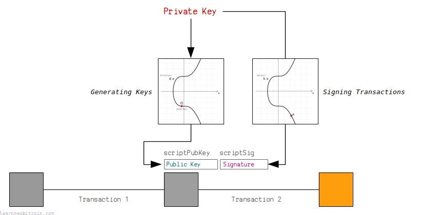
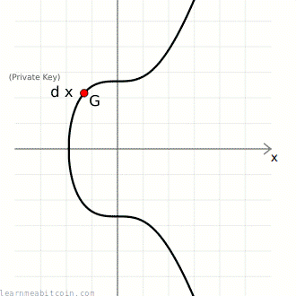
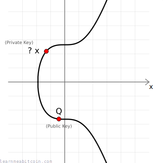
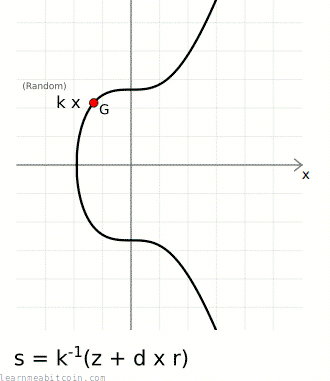
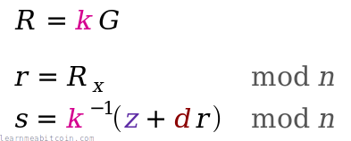
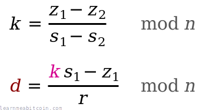
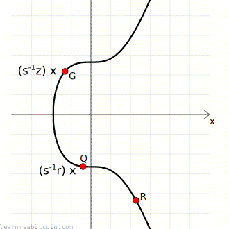

[](../../../images/diagrams_png_ecdsa-bitcoin.png)

比特币使用一种名为 ECDSA 的数字签名系统来控制比特币的所有权。

简而言之，数字签名系统允许您生成自己的[私钥](../../keys/private-key.md)/[公钥](../../keys/public-key.md)对。然后，您可以使用私钥生成[签名](../../keys/signature.md)来证明您是公钥的所有者，而无需泄露私钥。

此系统在比特币中用于允许人们在[交易](../../transaction.md)中接收和发送比特币。

任何人都可以生成自己的一对密钥，然后任何人都可以向您的公钥发送（或“锁定”）一个[输出](../../transaction/output.md)。没有人可以盗取这些比特币，因为只有拥有该公钥对应正确私钥的人，才能生成有效的签名来“解锁”这些比特币，并将其作为未来交易中的[输入](../../transaction/input.md)使用。

我对比特币密码学的了解还不够深入，无法解释*为什么* ECDSA 能起作用，但我可以向您展示 ECDSA 是*如何*运作的。

## 完整 ECDSA 代码

```
require "digest" # for hashing transaction data so we can sign it
require "securerandom" # for generating random nonces when signing

# -------------------------
# Elliptic Curve Parameters
# -------------------------
# y² = x³ + ax + b
$a = 0
$b = 7

# prime field
$p = 115792089237316195423570985008687907853269984665640564039457584007908834671663 #=> 2**256 - 2**32 - 2**9 - 2**8 - 2**7 - 2**6 - 2**4 - 1

# number of points on the curve we can hit ("order")
$n = 115792089237316195423570985008687907852837564279074904382605163141518161494337

# generator point (the starting point on the curve used for all calculations)
$G = {
  x: 55066263022277343669578718895168534326250603453777594175500187360389116729240,
  y: 32670510020758816978083085130507043184471273380659243275938904335757337482424,
}

# ---------------
# Modular Inverse: Ruby doesn't have a built-in modinv function
# ---------------
def inverse(a, m = $p)

  # store original modulus
  m_orig = m

  # make sure a is positive
  if a < 0
    a = a % m
  end

  # set initial values before loop
  y_prev = 0
  y = 1

  while a > 1
    q = m / a

    y_before = y # store current value of y
    y = y_prev - q * y # calculate new value of y
    y_prev = y_before # set previous y value to the old y value

    a_before = a # store current value of a
    a = m % a # calculate new value of a
    m = a_before # set m to the old a value
  end
  
  return y % m_orig
end

# ------
# Double: add a point to itself
# ------
def double(point)
  # slope = (3x₁² + a) / 2y₁
  slope = ((3 * point[:x] ** 2 + $a) * inverse((2 * point[:y]), $p)) % $p # using inverse to help with division

  # x = slope² - 2x₁
  x = (slope ** 2 - (2 * point[:x])) % $p

  # y = slope * (x₁ - x) - y₁
  y = (slope * (point[:x] - x) - point[:y]) % $p

  # Return the new point
  return { x: x, y: y }
end

# ---
# Add: add two points together
# ---
def add(point1, point2)
  # double if both points are the same
  if point1 == point2
    return double(point1)
  end

  # slope = (y₁ - y₂) / (x₁ - x₂)
  slope = ((point1[:y] - point2[:y]) * inverse(point1[:x] - point2[:x], $p)) % $p

  # x = slope² - x₁ - x₂
  x = (slope ** 2 - point1[:x] - point2[:x]) % $p

  # y = slope * (x₁ - x) - y₁
  y = ((slope * (point1[:x] - x)) - point1[:y]) % $p

  # Return the new point
  return { x: x, y: y }
end

# --------
# Multiply: use double and add operations to quickly multiply a point by an integer value (i.e. a private key)
# --------
def multiply(k, point = $G)
  # create a copy the initial starting point (for use in addition later on)
  current = point

  # convert integer to binary representation
  binary = k.to_s(2)

  # double and add algorithm for fast multiplication
  binary.split("").drop(1).each do |char| # from left to right, ignoring first binary character
    # 0 = double
    current = double(current)

    # 1 = double and add
    current = add(current, point) if char == "1"
  end

  # return the final point
  current
end

# ----
# Sign
# ----
def sign(private_key, hash, nonce = nil)
  # generate random number if not given
  if nonce == nil
    loop do
      nonce = SecureRandom.hex(32).to_i(16)
      break if nonce < $n # make sure random number is below the number of points of the curve
    end
  end

  # r = the x value of a random point on the curve
  r = multiply(nonce)[:x] % $n

  # s = nonce⁻¹ * (hash + private_key * r) mod n
  s = (inverse(nonce, $n) * (hash + private_key * r)) % $n # this breaks linearity (compared to schnorr)

  # signature is [r, s]
  return { r: r, s: s }
end

# ------
# Verify
# ------
def verify(public_key, signature, hash)
  # point 1
  point1 = multiply(inverse(signature[:s], $n) * hash)

  # point 2
  point2 = multiply((inverse(signature[:s], $n) * signature[:r]), public_key)

  # add two points together
  point3 = add(point1, point2)

  # check x coordinate of this point matches the x-coordinate of the random point given
  return point3[:x] % $n == signature[:r] # need to mod the x-coordinate with $n first
end

# -------------------
# Create A Public Key
# -------------------
# Example private key (in hexadecimal)
private_key = "f94a840f1e1a901843a75dd07ffcc5c84478dc4f987797474c9393ac53ab55e6"

# Public key is the generator point multiplied by the private key
point = multiply(private_key.to_i(16))

# convert x and y values of the public key point to hexadecimal
x = point[:x].to_s(16).rjust(64, "0") # pad with zeros to make sure it's 64 characters (32 bytes)
y = point[:y].to_s(16).rjust(64, "0")

# uncompressed public key (use full x and y coordinates) OLD FORMAT!
public_key_uncompressed = "04" + x + y

# compressed public key (use a prefix to indicate whether y is even or odd)
if (point[:y] % 2 == 0)
  public_key_compressed = "02" + x # y is even
else
  public_key_compressed = "03" + x # y is odd
end

#puts public_key_compressed #=> 024aeaf55040fa16de37303d13ca1dde85f4ca9baa36e2963a27a1c0c1165fe2b1

# ------------------
# Sign A Transaction
# ------------------
# A basic structure for holding the transaction data
def tx(scriptsig)
  # Need to calculate a byte indicating the size of upcoming scriptsig in bytes (rough code but does the job)
  size = (scriptsig.length / 2).to_s(16).rjust(2, "0")

  # Raw unsigned transaction data with the scriptsig field (you need to know the correct position)
  return "0100000001b7994a0db2f373a29227e1d90da883c6ce1cb0dd2d6812e4558041ebbbcfa54b00000000#{size}#{scriptsig}ffffffff01983a0000000000001976a914b3e2819b6262e0b1f19fc7229d75677f347c91ac88ac00000000"
end

# Private key and public key for the locked up bitcoins we want to spend
private_key = "f94a840f1e1a901843a75dd07ffcc5c84478dc4f987797474c9393ac53ab55e6" # sha256("learnmeabitcoin1")
public_key = "024aeaf55040fa16de37303d13ca1dde85f4ca9baa36e2963a27a1c0c1165fe2b1"

# NOTE: Need to remove all existing signatures from the transaction data first if there are any

# Put original scriptpubkey as a placeholder in to the scriptsig for the input you want to sign (required)
scriptpubkey = "76a9144299ff317fcd12ef19047df66d72454691797bfc88ac" # just one input in this transaction
transaction = tx(scriptpubkey)

# Append sighash type to transaction data (required)
transaction = transaction + "01000000"

# Get a hash of the transaction data (because we sign the hash of data and not the actual data itself)
hash = Digest::SHA256.hexdigest(Digest::SHA256.digest([transaction].pack("H*")))

# Use elliptic curve mathematics to sign the hash using the private key and nonce
signature = sign(private_key.to_i(16), hash.to_i(16), 123456789) # using a fixed nonce for testing (unsafe)

# Use the low s value (BIP 62: Dealing with malleability)
if (signature[:s] > $n / 2)
  signature[:s] = $n - signature[:s]
end

# Encode the signature in to DER format (slightly awkward format used for signatures in bitcoin transactions)
r = signature[:r].to_s(16).rjust(64, "0")  # convert r to hexadecimal
s = signature[:s].to_s(16).rjust(64, "0")  # convert s to hexadecimal
r = "00" + r if (r[0, 2].to_i(16) >= 0x80) # prepend 00 if first byte is 0x80 or above (DER quirk)
s = "00" + r if (s[0, 2].to_i(16) >= 0x80) # prepend 00 if first byte is 0x80 or above (DER quirk)
der = ""                                   # string for holding our der encoding
r_len = (r.length / 2).to_s(16).rjust(2, "0") # get length of r (in bytes)

s_len = (s.length / 2).to_s(16).rjust(2, "0") # get length of s (in bytes)
der << "02" << r_len << r << "02" << s_len << s   # Add to DER encoding (0x20 byte indicates an integer type in DER)
der_len = (der.length / 2).to_s(16).rjust(2, "0") # get length of DER data (in bytes)
der = "30" + der_len + der # Final DER encoding (0x30 byte indicates compound object type)

# Append sighashtype to the signature (required) (01 = ALL)
der = der + "01" # without it you get "mandatory-script-verify-flag-failed (Non-canonical DER signature) (code 16)"

# Construct full unlocking script (P2PKH scripts need original public key the bitcoins were locked to): <size> {signature} <size> {public_key}
scriptsig = (der.length / 2).to_s(16) + der + (public_key.length / 2).to_s(16) + public_key

# Put the full scriptsig in to the original transaction data
transaction = tx(scriptsig)

# Show the signed transaction
puts transaction #=> 0100000001b7994a0db2f373a29227e1d90da883c6ce1cb0dd2d6812e4558041ebbbcfa54b000000006a473044022008f4f37e2d8f74e18c1b8fde2374d5f28402fb8ab7fd1cc5b786aa40851a70cb02201f40afd1627798ee8529095ca4b205498032315240ac322c9d8ff0f205a93a580121024aeaf55040fa16de37303d13ca1dde85f4ca9baa36e2963a27a1c0c1165fe2b1ffffffff01983a0000000000001976a914b3e2819b6262e0b1f19fc7229d75677f347c91ac88ac00000000

# Send the transaction in to the bitcoin network
# $ bitcoin-cli sendrawtransaction [raw transaction data]
```

## 椭圆曲线

ECDSA 的数学支柱

[](../../../images/technical_cryptography_elliptic-curve_point-multiply.gif)

椭圆曲线点乘 (Elliptic curve multiplication)

ECDSA 使用[椭圆曲线](../elliptic-curve.md)作为数字签名系统的基础。

简而言之，公钥和签名都只是椭圆曲线上的**点 (points)**。如果这两个点是由同一个私钥（一个庞大的数字）创建的，那么它们之间将存在*几何关联*，证明创建签名的人同时也创建（或“拥有”）了该公钥。

在此我不会涉及[椭圆曲线数学](../elliptic-curve.md#mathematics)，但我们在比特币中使用 ECDSA 所需要的一切仅仅是能够**[乘以椭圆曲线上的点](../elliptic-curve.md#multiply)**。

 椭圆曲线乘法 (EC Multiply)

基点 (Generator Point)
随机点

点 1 (Point 1)

x:

0d

y:

0d


Multiplier

0d


+1

随机


点 1 x 乘数 (Multiplier)

x:

0d

y:

0d


步骤 (Steps)
 

0 秒

简而言之，椭圆曲线上的“乘法”基本上是指在曲线上面选择一个起点，并在曲线上弹跳一定次数以到达曲线上一个新的点。这种“乘法”运算的特殊性质在于无法“反向求出”，这就是为什么椭圆曲线被用于数字签名等密码学系统的原因。

无论如何，以下是执行椭圆曲线点乘的代码（使用比特币中使用的 *Secp256k1* 曲线的[参数](../elliptic-curve.md#parameters)）：

## Secp256k1 参数

```
# y² = x³ + ax + b
$a = 0
$b = 7

# prime field
$p = 115792089237316195423570985008687907853269984665640564039457584007908834671663 #=> 2**256 - 2**32 - 2**9 - 2**8 - 2**7 - 2**6 - 2**4 - 1

# number of points on the curve we can hit ("order")
$n = 115792089237316195423570985008687907852837564279074904382605163141518161494337

# generator point (the starting point on the curve used for all calculations)
$G = {
  x: 55066263022277343669578718895168534326250603453777594175500187360389116729240,
  y: 32670510020758816978083085130507043184471273380659243275938904335757337482424,
}
```

## 椭圆曲线数学

```
def inverse(a, m = $p)

  # store original modulus
  m_orig = m

  # make sure a is positive
  if a < 0
    a = a % m
  end

  # set initial values before loop
  y_prev = 0
  y = 1

  while a > 1
    q = m / a

    y_before = y # store current value of y
    y = y_prev - q * y # calculate new value of y
    y_prev = y_before # set previous y value to the old y value

    a_before = a # store current value of a
    a = m % a # calculate new value of a
    m = a_before # set m to the old a value
  end
  
  return y % m_orig
end

def add(point1, point2)
  # double if both points are the same
  if point1 == point2
    return double(point1)
  end

  # slope = (y₁ - y₂) / (x₁ - x₂)
  slope = ((point1[:y] - point2[:y]) * inverse(point1[:x] - point2[:x], $p)) % $p

  # x = slope² - x₁ - x₂
  x = (slope ** 2 - point1[:x] - point2[:x]) % $p

  # y = slope * (x₁ - x) - y₁
  y = ((slope * (point1[:x] - x)) - point1[:y]) % $p

  # Return the new point
  return { x: x, y: y }
end

def double(point)
  # slope = (3x₁² + a) / 2y₁
  slope = ((3 * point[:x] ** 2 + $a) * inverse((2 * point[:y]), $p)) % $p # using inverse to help with division

  # x = slope² - 2x₁
  x = (slope ** 2 - (2 * point[:x])) % $p

  # y = slope * (x₁ - x) - y₁
  y = (slope * (point[:x] - x) - point[:y]) % $p

  # Return the new point
  return { x: x, y: y }
end

def multiply(k, point = $G)
  # create a copy the initial starting point (for use in addition later on)
  current = point

  # convert integer to binary representation
  binary = k.to_s(2)

  # double and add algorithm for fast multiplication
  binary.split("").drop(1).each do |char| # from left to right, ignoring first binary character
    # 0 = double
    current = double(current)

    # 1 = double and add
    current = add(current, point) if char == "1"
  end

  # return the final point
  current
end
```

## 用法

如何使用 ECDSA 创建数字签名？

既然我们知道了如何**在椭圆曲线上面进行点乘**，我们就可以将其用作创建数字签名系统的基础。

以下系统被称为*椭圆曲线数字签名算法*，或简称为 ECDSA。

* [密钥生成](#key-generation)
* [签名](#sign)
* [验证](#verify)

### 密钥生成

 私钥 (Private Key)

随机生成 (Generate Random)
重置 (Reset)

Bits

0

0

0

0

0

0

0

0

0

0

0

0

0

0

0

0

0

0

0

0

0

0

0

0

0

0

0

0

0

0

0

0

0

0

0

0

0

0

0

0

0

0

0

0

0

0

0

0

0

0

0

0

0

0

0

0

0

0

0

0

0

0

0

0

0

0

0

0

0

0

0

0

0

0

0

0

0

0

0

0

0

0

0

0

0

0

0

0

0

0

0

0

0

0

0

0

0

0

0

0

0

0

0

0

0

0

0

0

0

0

0

0

0

0

0

0

0

0

0

0

0

0

0

0

0

0

0

0

0

0

0

0

0

0

0

0

0

0

0

0

0

0

0

0

0

0

0

0

0

0

0

0

0

0

0

0

0

0

0

0

0

0

0

0

0

0

0

0

0

0

0

0

0

0

0

0

0

0

0

0

0

0

0

0

0

0

0

0

0

0

0

0

0

0

0

0

0

0

0

0

0

0

0

0

0

0

0

0

0

0

0

0

0

0

0

0

0

0

0

0

0

0

0

0

0

0

0

0

0

0

0

0

0

0

0

0

0

0

0

0

0

0

0

0

0

0

0

0

0

0

0

0

0

0

0

0

0

0

0

0

0

0

0

0

0

0

0

0

0

0

0

0

0

0

0

0

0

0

0

0

0

0

0

0

0

0

0

0

0

0

0

0

0

0

0

0

0

0

0

0

0

0

0

0

0

0

0

0

0

0

0

0

0

0

0

0

0

0

0

0

0

0

0

0

0

0

0

0

0

0

0

0

0

0

0

0

0

0

0

0

0

0

0

0

0

0

0

0

0

0

0

0

0

0

0

0

0

0

0

0

Binary

0b

`0 bits`

Decimal

0d

Hexadecimal

0x

`0 bytes`

**切勿使用由网站生成的私钥，或在网站中输入您的私钥。** 网站很容易保存私钥并用其盗取您的比特币。

0 秒

基点 (Generator Point)
随机点

点 1 (Point 1)

x:

0d

y:

0d


Multiplier

0d


+1

随机


点 1 x 乘数 (Multiplier)

x:

0d

y:

0d


步骤 (Steps)
 

0 秒

我们使用椭圆曲线点乘来创建**密钥对**：

* [private key](../../keys/private-key.md) (`d`) — 一个介于 0 到[曲线上的点数](../elliptic-curve.md#parameters-n)（`[0...n-1]`）之间的随机生成大整数。
* [public key](../../keys/public-key.md) (`Q`) — [基点](../elliptic-curve.md#parameters-g) (`G`) 乘以 private key (`d`) 的点乘结果。

[](../../../images/technical_cryptography_elliptic-curve_ecdsa_point-multiply-public-key.gif)

`d` 是私钥 (一个整数)  
`G` 是基点 (一个椭圆曲线点)  
`Q` 是公钥 (一个椭圆曲线点)

[](../../../images/technical_cryptography_elliptic-curve_latex-point-multiply.png)

所以在椭圆曲线密码学中，私钥仅仅是一个大**随机整数**（小于曲线上的点数），而其对应的公钥仅仅是**曲线上的一个点**。

例如：

```
private key = 112757557418114203588093402336452206775565751179231977388358956335153294300646
public key  = {
    x: 33886286099813419182054595252042348742146950914608322024530631065951421850289,
    y: 9529752953487881233694078263953407116222499632359298014255097182349749987176
}
```

#### 陷门函数 (Trapdoor Function)

[](../../../images/technical_cryptography_elliptic-curve_ecdsa_point-multiply-public-key-trapdoor.png)

给定公钥点 `Q`，没有简单的方法可以反向推导出用于创建它的私钥 `d`。

推导私钥的唯一方法是用不同的数字手动点乘基点 `G`，看看能否得到相同的公钥，如果有人使用了一个非常庞大的数字作为其私钥，这种暴力方法将慢得令人绝望。

因此，*椭圆曲线乘法*被称为**陷门函数 (trapdoor function)**（因为向一个方向进行很容易，但反向进行却极难），这是所有[公钥密码学](../../cryptography.md#public-key-cryptography)的核心要素。

此外，私钥和公钥之间的单向数学关联意味着，您可以在以后分别使用这两者来计算椭圆曲线上的相同点，这在构建用于创建数字签名的系统时非常有用。

### 签名

随机示例

消息哈希 (Message Hash) (z)

这通常是已被准备用于签名的某些交易数据的哈希值。

0x

`0 bytes`

Nonce (k)

0x

随机 (Random)

私钥 (Private Key) (d)

0x

随机 (Random)

`0 bytes`

签名 (Signature)

R:

0d

S:

0d

High:
Low:

**切勿在网站中输入您的私钥，或使用由网站生成的私钥。** 网站很容易保存私钥并用其盗取您的比特币。

0 秒

要签署消息，您需要三样东西：

1. **随机数** (`k`) — 这在我们的签名中引入了随机性元素，这对于安全至关重要。这意味着即使我们对同一条消息签署两次，我们生成的每一个签名都会是不同的。
2. **消息哈希** (`z`) — 这是我们想要签署的消息的*哈希*。对消息进行[哈希运算](../hash-function.md)为我们提供了一个简短且唯一的指纹，对该指纹进行签名比对庞大的数据块进行签名更有效率。您可以选择要使用的哈希算法，但与 *secp256k1* 结合使用最常见的是 [SHA-256](../hash-function.md#sha256)。
3. **私钥** (`d`) — 对应已公开的公钥的源泉。

实际的签名由两部分组成：

* `r` — **曲线上的一个随机点。** 我们使用随机数 `k` 并点乘基点以获得随机点 `R`。实际上我们仅使用该点的 *x 坐标*，并将其称为小写 `r`。
* `s` — **随机点附带的一个数字。** 这是一个结合了*消息哈希* `z` 和私钥 `d` 创建出的唯一数字，它还使用 `r` 绑定到该随机点。

[](../../../images/technical_cryptography_elliptic-curve_ecdsa_point-sign.gif)

ECDSA 签名包含曲线上随机点的 x 坐标。

[](../../../images/technical_cryptography_elliptic-curve_ecdsa_latex-sign.png)

ECDSA 签名方程

`⁻¹` 符号表示该数字的[模逆](../elliptic-curve.md#modular-inverse)。在这里，模乘逆元是 `mod n`（曲线上的点数）求解的。

这两个 `[r, s]` 值就是“数字签名”。

例如：

```
random number   (k): 12345
message:             ECDSA is the most fun I have ever experienced
sha256(message) (z): 103318048148376957923607078689899464500752411597387986125144636642406244063093
private key     (d): 112757557418114203588093402336452206775565751179231977388358956335153294300646

random point (k*G = R): {
  x = 108607064596551879580190606910245687803607295064141551927605737287325610911759,
  y = 6661302038839728943522144359728938428925407345457796456954441906546235843221
}
signature: r = R[x], s = k⁻¹ * (z + r * d): {
  r = 108607064596551879580190606910245687803607295064141551927605737287325610911759,
  s = 73791001770378044883749956175832052998232581925633570497458784569540878807131
}
```

**Nonce:** 密码学中的随机数有时被称为 "nonce"，它是 "number used once"（使用一次的数字）的简写。

 数字转换器 (Number Converter)

二进制 (Base 2)

0b

`0 digits`

十进制 (Base 10)

0d

`0 digits`

十六进制 (Base 16)

0x

`0 digits`


+1


0 秒

简而言之，唯一的 `s` 值提供了到达随机生成点 `r` 的*路径*。

您可以将这两条信息提供给其他人，**从公钥点 `Q` 开始**，他们可以使用 `s` 值来帮助他们到达随机点 `r`。这里的诀窍是，只有拥有对应私钥 `d` 的人才能利用 `s` 创建出通往该随机点的有效路径。

该路径中也编码了*消息哈希* `z`，这正是使我们能够为消息创建签名的原因；在不知道私钥的情况下，没有人能够创建出从公钥**通过*消息哈希***到达曲线上随机点的路径。

#### ECDSA 签名代码

```
def sign(private_key, hash, nonce = nil)
  # generate random number if not given
  if nonce == nil
    loop do
      nonce = SecureRandom.hex(32).to_i(16)
      break if nonce < $n # make sure random number is below the number of points of the curve
    end
  end

  # r = the x value of a random point on the curve
  r = multiply(nonce)[:x] % $n

  # s = nonce⁻¹ * (hash + private_key * r) mod n
  s = (inverse(nonce, $n) * (hash + private_key * r)) % $n # this breaks linearity (compared to schnorr)

  # signature is [r, s]
  return { r: r, s: s }
end
```

#### 私钥恢复

如果您在多个签名中使用相同的随机点（即相同的 `k` 值），任何人都可以求出您的私钥。

例如，假设我们得到了两个使用相同 `k` 值生成的已签署消息。

对于每个已签署消息，我们拥有*消息哈希* `z`，以及来自各自签名的 `r` 和 `s` 值：

```
已签署消息 1: (z₁, r₁, s₁)
已签署消息 2: (z₂, r₂, s₂)
```

然而，因为每次都使用相同的 `k` 值生成随机点（`R = k*G`），所以这些签名中的 `r` 值（`R` 的 x 坐标）也将是相同的：

```
已签署消息 1: (z₁, r, s₁)
已签署消息 2: (z₂, r, s₂)
```

那么我们该如何利用这些信息推导出私钥 `d` 呢？

首先，我们知道每个签名中的 `s` 值是使用 `s = k⁻¹(z + r * d) mod n` 计算出来的，所以：

```
s₁ = k⁻¹(z₁ + r * d) mod n
s₂ = k⁻¹(z₂ + r * d) mod n
```

得益于这两个方程式现在具有相同的 `k` 值，我们可以将它们作为联立方程组进行求解，算出 `k` 的值。

为此，我们首先将第二个方程重新排列，使 `r * d` 独立在等式的一边：

```
s₂ = k⁻¹(z₂ + r * d) mod n
r * d = k * s₂ - z₂ mod n
```

然后，我们可以将其代入第一个方程中，并重新整理以求出 `k`：

```
s₁ = k⁻¹(z₁ + r * d) mod n
s₁ = k⁻¹(z₁ + (k * s₂ - z₂)) mod n
k = (z₁ - z₂) * (s₁ - s₂)⁻¹ mod n
```

请记住，乘以 `(s₁ - s₂)⁻¹` 意味着乘以 `(s₁ - s₂)` 的[*模乘逆元*](../elliptic-curve.md#modular-inverse)，这在椭圆曲线数学中等同于“除法”。

在求出 `k` 之后，我们可以将其再次代入 `s = k⁻¹(z + r * d) mod n` 中以求出 `d`。

因此，重新整理第一个方程（使用哪一个都可以）使 `d` 独立在等式的一边：

```
s₁ = k⁻¹(z₁ + r * d) mod n
d = (k * s₁ - z₁) * r⁻¹ mod n
```

因为我们已经知道了 `(z₁, r, s₁)` 并且刚刚求出了 `k`，我们可以将它们全部代入该方程中以求出私钥 `d`。

在数学符号中，私钥恢复如下所示：

[](../../../images/technical_cryptography_elliptic-curve_ecdsa_latex-private-key-recovery.png)

**因此，请确保您每次创建签名时，始终使用安全的随机值作为 `k`。** 如果有人发现您为同一公钥签署不同消息时使用了相同的 `r` 值，他们只需几毫秒即可恢复您的私钥。

在 2011 年，[黑客发现如何获取 PS3 的私钥](https://arstechnica.com/gaming/2010/12/ps3-hacked-through-poor-implementation-of-cryptography/)，因为索尼在生成签名时使用相同的 `k` 值。

以下是在 Ruby 中从使用相同 `k` 的两个签名恢复私钥的示例：

```
require 'digest' # used for hashing messages before signing

# Note: This code uses the previously defined inverse(), double(), add(), multiply(), and sign() functions

# -------------
# Sign Messages
# -------------

# 0. Keys
prv = 1111222233334444555566667777888899990000 # any old private key
pub = multiply(prv)

# 1. Create first signed message
k    = 800000
z1   = Digest::SHA256.hexdigest("Just a simple message.").to_i(16)
sig1 = sign(prv, z1, k)

# 2. Create second signed message
k    = 800000 # Using the same value for k!
z2   = Digest::SHA256.hexdigest("I have used the same k value.").to_i(16)
sig2 = sign(prv, z2, k)

# --------------------
# Private Key Recovery
# --------------------
# k = (z₁ - z₂) * (s1 - s₂)⁻¹  mod n
# d = (k * s₁ - z₁) * r⁻¹    mod n

# 1. Work out k (note: result may be the additive inverse of original k, but it still works fine)
k_calculated = ((z1 - z2) * inverse(sig1[:s] - sig2[:s], $n)) % $n

# 2. Work out d (the original private key)
d_calculated = ((k_calculated * sig1[:s] - z1) * inverse(sig1[:r], $n)) % $n
puts d_calculated #=> 1111222233334444555566667777888899990000
```

### 验证

随机示例

消息哈希 (Message Hash) (z)

0x

`0 bytes`

签名 (Signature)

R:

0d

S:

0d

公钥 (Public Key) (Q)

0x

`0 bytes`

签名验证 (Signature Verification)

x:

0d

y:

0d

0 秒

您可以使用三样东西来验证消息及其签名：

1. **公钥** `Q` — 声明创建该签名的用户的公钥。
2. **消息** — 被签署的数据。我们可以自己对其进行哈希运算以获得*消息哈希* `z`。
3. **签名** `[r, s]` — 为上述消息创建的签名，据称是由拥有该公钥对应私钥的用户创建的。

然后我们使用这三条数据在曲线上*计算两个点*：

* **点 1.** 从*基点* `G` 开始，并乘以 `inverse(s) * z`。
* **点 2.** 从公钥点 `Q` 开始，并乘以 `inverse(s) * r`。

我们现在可以将这两个点相加得到 **点 3**：

[](../../../images/technical_cryptography_elliptic-curve_ecdsa_point-verify.gif)

椭圆曲线上的 ECDSA 验证。

[](../../../images/technical_cryptography_elliptic-curve_ecdsa_latex-verify.png)

ECDSA 验证方程

**如果点 3 的 x 坐标与 r 相匹配，则签名有效**。

例如：

```
message:             ECDSA is the most fun I have ever experienced
sha256(message) (z): 103318048148376957923607078689899464500752411597387986125144636642406244063093
signature (r,s): {
  r = 108607064596551879580190606910245687803607295064141551927605737287325610911759,
  s = 73791001770378044883749956175832052998232581925633570497458784569540878807131
}
public key (Q): {
  x = 33886286099813419182054595252042348742146950914608322024530631065951421850289,
  y = 9529752953487881233694078263953407116222499632359298014255097182349749987176
}

verification (s⁻¹ * z)G + (s⁻¹ * r)Q: {
  x = 108607064596551879580190606910245687803607295064141551927605737287325610911759, <- matches r (x-coordinate of random point)
  y = 6661302038839728943522144359728938428925407345457796456954441906546235843221
}
```

 数字转换器 (Number Converter)

二进制 (Base 2)

0b

`0 digits`

十进制 (Base 10)

0d

`0 digits`

十六进制 (Base 16)

0x

`0 digits`


+1


0 秒

 公钥 (Public Key)

随机生成 (Generate Random)

私钥 (Private Key)

`0 bytes`

公钥 (Public Key)

坐标 (Coordinates)

x:

0d

y:

0d

奇偶性 (parity):

公钥只是椭圆曲线上的一个点。最终的公钥是这些十六进制的坐标。

压缩方式

 压缩格式 (以 02 或 03 开头)

 未压缩格式 (以 04 开头)

 仅含 x 轴 (无前缀)

椭圆曲线沿 x 轴对称，因此*压缩的*公钥只需要存储完整的 x 坐标以及 y 坐标是奇数还是偶数即可。

在 [Taproot](../../upgrades/taproot.md) 输出中使用仅含 x 轴的公钥。相应的 y 坐标默认假定为偶数。

`0 bytes`

**切勿在网站中输入您的私钥，或使用由网站生成的私钥。** 网站很容易保存私钥并用其盗取您的比特币。

0 秒

换句话说，该消息的签名只能由拥有公钥所对应的实际私钥的人创建。其他人无法提供一个 `s` 值，能让您在与公钥 `Q` 结合后到达随机点 `R`，*除非*他们知道该公钥对应的私钥 `d`。

如果您更改已签署消息的内容，或尝试将该签名与不同的公钥结合使用，则计算出的第三个点将无法与签名中给出的随机点相匹配，签名验证将失败。

#### ECDSA 验证代码

```
def verify(public_key, signature, hash)
  # point 1
  point1 = multiply(inverse(signature[:s], $n) * hash)

  # point 2
  point2 = multiply((inverse(signature[:s], $n) * signature[:r]), public_key)

  # add two points together
  point3 = add(point1, point2)

  # check x coordinate of this point matches the x-coordinate of the random point given
  return point3[:x] % $n == signature[:r] # need to mod the x-coordinate with $n first
end
```

#### 为什么起作用？（数学证明）

##### 签名过程：

创建签名的人首先使用一个随机数 `k` 来在曲线上生成一个随机点：

```
R = k * G
```

然后，他们使用自己的私钥 `d` 和消息的哈希值 `z`（以及 `r`（`R` 的 x 坐标）和随机数 `k`）来计算一个辅助数字：

```
s = k⁻¹ * (z + r * d)
```

##### 验证过程：

以下方程允许您通过结合使用公钥 `Q`、消息的哈希值 `z` 和给定的 `s` 值来计算出*相同的点*：

```
R = (s⁻¹ * z)G + (s⁻¹ * r)Q
```

我们现在可以重新整理该方程并代入一些值，以证明该方程确实能让我们得到相同的点。

首先，公钥 `Q` 就是 `d * G`，所以：

```
R = (s⁻¹ * z)G + (s⁻¹ * r)d*G
```

如果我们提取公因子重新整理该方程，我们得到：

```
R = (s⁻¹ * z)G + (s⁻¹ * r * d)G
R = s⁻¹ * (z + r * d) * G
```

现在，请记住 `s = k⁻¹ * (z + r * d)`。如果我们将此等式重新排列以使 `k` 独立在等式的一边，我们得到 `k = s⁻¹ * (z + r * d)`，将其代入上面的方程中：

```
R = k * G
```

而这正是最初用于生成随机点的相同计算方式。

## 总结

熟练掌握 ECDSA 的最佳方式是尝试自己编写代码。

最困难的部分通常不是[椭圆曲线数学](../elliptic-curve.md#mathematics)，而是在之后实际为用于比特币交易内的生成的[签名](../../keys/signature.md)准备格式并进行编码。此外，在某些编程语言中处理大数并不总是很容易，因此您可能需要使用特殊的库函数来执行椭圆曲线运算。

除此之外，代码并不像您最初想象的那么困难。

当然，我不建议在您最新的任务关键型系统中使用这些代码，但如果您想在不使用外部 ECDSA 库的情况下，在比特币中创建自己的公钥并签署您自己的[交易](../../transaction.md)，它应该能帮助您开始。

祝您玩得开心。

**中本聪并不需要了解数字签名系统工作原理的所有细节，就能创建比特币。** 他们所需要知道的仅仅是它*确实*起作用，并且他们可以将其用作在他们正在构建的系统中发送和接收资金的机制。比特币的第一个版本实际上使用 [OpenSSL](https://www.openssl.org/) 库来提供创建和验证数字签名的功能，因此这不是他们自己亲手编写的代码。

## 资源

### 参考资料：

* [NIST.FIPS.186-4.pdf](https://nvlpubs.nist.gov/nistpubs/FIPS/NIST.FIPS.186-4.pdf) - NIST 官方的*数字签名标准*。包含 DSA, RSA 和 ECDSA 的概述。
* [sec2-v2.pdf](https://www.secg.org/sec2-v2.pdf) - 来自 SECG 的椭圆曲线密码学推荐曲线列表。包含比特币中使用的 `secp256k1` 曲线的参数。

### 说明文档：

* [How The ECDSA Algorithm Works](https://kakaroto.ca/2012/01/how-the-ecdsa-algorithm-works/) - ECDSA 算法的简明解释。
* [Recovering private key from Secp256k1 signatures](https://crypto.stackexchange.com/questions/57846/recovering-private-key-from-secp256k1-signatures) - Thomas Pornin 关于如果有人多次使用相同的随机点生成签名，如何求出其私钥的简明数学解释。

### 代码

以下是我发现有用的不同编程语言中 ECDSA 的一些实现：

* Python: [github.com/wobine/blackboard101/blob/master/EllipticCurvesPart5-TheMagic-SigningAndVerifying.py](https://github.com/wobine/blackboard101/blob/master/EllipticCurvesPart5-TheMagic-SigningAndVerifying.py)
* Python: [github.com/andreacorbellini/ecc/blob/master/scripts/ecdsa.py](https://github.com/andreacorbellini/ecc/blob/master/scripts/ecdsa.py)
* Ruby: [github.com/DavidEGrayson/ruby\_ecdsa](https://github.com/DavidEGrayson/ruby_ecdsa)
* PHP: [github.com/BitcoinPHP/BitcoinECDSA.php](https://github.com/BitcoinPHP/BitcoinECDSA.php)