[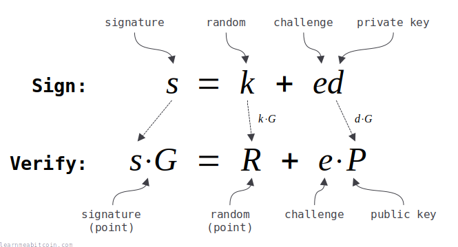](https://static.learnmeabitcoin.com/diagrams/png/schnorr-equations-summary.png)

Schnorr signatures are a better than [ECDSA](/technical/cryptography/elliptic-curve/ecdsa/) for creating and verifying [digital signatures](/technical/keys/signature/).

They're simpler, more efficient, and more secure than ECDSA.

Furthermore, the simpler mathematics also allows you to *add* signatures together, as well as [verify multiple signatures](#batch-verify) at the same time. These are two features that are not available with ECDSA.

Anyway, Schnorr signatures were added to Bitcoin in 2021 as part of the [Taproot](/technical/upgrades/taproot/) upgrade, and are currently used for unlocking [P2TR](/technical/script/p2tr/) locking scripts.

On this page I'll show you [how to implement](#implementation) Schnorr signatures in Bitcoin, and also give a brief explanation of [how they work](#basics).

Schnorr Signatures (Full Code)

```


copied


copied

# -------------------------
# Elliptic Curve Parameters
# -------------------------
# these are the parameters for secp256k1, which is the same curve used in ECDSA
# note: setting these as $global variables so they're accessible from with the functions below (without having to pass them as arguments)

# y² = x³ + ax + b
$a = 0
$b = 7

# prime field
$p = 115792089237316195423570985008687907853269984665640564039457584007908834671663 #=> 0xFFFFFFFFFFFFFFFFFFFFFFFFFFFFFFFFFFFFFFFFFFFFFFFFFFFFFFFEFFFFFC2F

# number of points on the curve we can hit ("order")
$n = 115792089237316195423570985008687907852837564279074904382605163141518161494337 #=> 0xFFFFFFFFFFFFFFFFFFFFFFFFFFFFFFFEBAAEDCE6AF48A03BBFD25E8CD0364141

# generator point (the starting point on the curve used for all calculations)
$G = {
  x: 55066263022277343669578718895168534326250603453777594175500187360389116729240, #=> 0x79BE667EF9DCBBAC55A06295CE870B07029BFCDB2DCE28D959F2815B16F81798
  y: 32670510020758816978083085130507043184471273380659243275938904335757337482424, #=> 0x483ADA7726A3C4655DA4FBFC0E1108A8FD17B448A68554199C47D08FFB10D4B8
}

# --------------------------
# Elliptic Curve Mathematics
# --------------------------

# Modular Inverse: Ruby doesn't have a built-in modinv function
def inverse(a, m = $p)
  m_orig = m         # store original modulus
  a = a % m if a < 0 # make sure a is positive
  y_prev = 0
  y = 1
  while a > 1
    q = m / a

    y_before = y # store current value of y
    y = y_prev - q * y # calculate new value of y
    y_prev = y_before # set previous y value to the old y value

    a_before = a # store current value of a
    a = m % a # calculate new value of a
    m = a_before # set m to the old a value
  end
  return y % m_orig
end

# Double: add a point to itself
def double(point)
  # check for point at infinity (greatest common divisor between 2y and p isn't 1)
  if (((2 * point[:y]) % $p).gcd($p) != 1) # taken from BitcoinECDSA.php
    raise "Point at infinity."
  end

  # slope = (3x₁² + a) / 2y₁
  slope = ((3 * point[:x] ** 2 + $a) * inverse((2 * point[:y]), $p)) % $p # using inverse to help with division

  # x = slope² - 2x₁
  x = (slope ** 2 - (2 * point[:x])) % $p

  # y = slope * (x₁ - x) - y₁
  y = (slope * (point[:x] - x) - point[:y]) % $p

  # Return the new point¢ªº
  return { x: x, y: y }
end

# Add: add two points together
def add(point1, point2)
  # double if both points are the same
  if point1 == point2
    return double(point1)
  end

  # check for point at infinity (greatest common divisor between x1-x2 and p isn't 1)
  if ((point1[:x] - point2[:x]).gcd($p) != 1) # taken from BitcoinECDSA.php
    raise "Point at infinity."
  end

  # slope = (y₁ - y₂) / (x₁ - x₂)
  slope = ((point1[:y] - point2[:y]) * inverse(point1[:x] - point2[:x], $p)) % $p

  # x = slope² - x₁ - x₂
  x = (slope ** 2 - point1[:x] - point2[:x]) % $p

  # y = slope * (x₁ - x) - y₁
  y = ((slope * (point1[:x] - x)) - point1[:y]) % $p

  # Return the new point
  return { x: x, y: y }
end

# Multiply: use double and add operations to quickly multiply a point by an integer value (i.e. a private key)
def multiply(k, point = $G)
  # create a copy the initial starting point (for use in addition later on)
  current = point

  # convert integer to binary representation
  binary = k.to_s(2)

  # double and add algorithm for fast multiplication
  binary.split("").drop(1).each do |char| # from left to right, ignoring first binary character
    # 0 = double
    current = double(current)

    # 1 = double and add
    current = add(current, point) if char == "1"
  end

  # return the final point
  current
end

# ---------
# Functions
# ---------
# helper functions

# convert hexadecimal string of bytes to integer
def int(bytes)
  return bytes.to_i(16)
end

# convert integer to hexadecimal string of bytes
def bytes(int)
  return int.to_s(16).rjust(64, "0") # convert to hex and pad with zeros to make it 32 bytes (64 characters)
end

# -----------
# Tagged Hash
# -----------
require "digest" # library for SHA256 hash function

# hash some data using SHA256 with a tag prefix
def tagged_hash(tag, message)

  # create a hash of the tag first
  tag_hash = Digest::SHA256.hexdigest(tag) # hash the string directly

  # prefix the message with the tag hash (the tag_hash is prefixed twice so that the prefix is 64 bytes in total)
  preimage = [tag_hash + tag_hash + message].pack("H*") # also convert to byte sequence before hashing

  # SHA256(tag_hash || tag_hash || message)
  result = Digest::SHA256.hexdigest(preimage);

  return result
end

# ----
# Keys
# ----
# Example private key (in hexadecimal)
private_key = "b7e151628aed2a6abf7158809cf4f3c762e7160f38b4da56a784d9045190cfef"

# Public key is the generator point multiplied by the private key
point = multiply(int(private_key))

# the public key is just the x value of this point
public_key = bytes(point[:x]) # convert x coordinate to hex bytes

#puts public_key #=> dff1d77f2a671c5f36183726db2341be58feae1da2deced843240f7b502ba659

# ----
# Sign
# ----
puts "Signing:"

private_key = "b7e151628aed2a6abf7158809cf4f3c762e7160f38b4da56a784d9045190cfef"
aux_rand = "0000000000000000000000000000000000000000000000000000000000000001" # auxiliary bytes for contributing to randomness of the nonce (security does not rely on this being random)
message = "243f6a8885a308d313198a2e03707344a4093822299f31d0082efa98ec4e6c89"

puts " private key: #{private_key}"
puts " aux rand:    #{aux_rand}"
puts " message:     #{message}"

# convert private key to an integer
d0 = int(private_key)

# make sure private key is in valid range (greater than 0 and less than the number of points on the curve)
unless (1..$n-1).include?(d0)
  raise "private key must be in the range 1..n-1"
end

# calculate the public key point from the private key
public_key_point = multiply(d0) # multiply() checks for point at infinity

# negate the private key if the public key it creates doesn't have an even y value, else keep the private key the same
# note: due to the way the elliptic curve works, negate the private key will produce a public key with the same x coordinate, but the opposite y value
if public_key_point[:y] % 2 != 0
  d = $n - d0
else
  d = d0
end

# create a tagged hash of the auxiliary bytes
aux_rand_hash = tagged_hash("BIP0340/aux", aux_rand)

# first step toward creating the nonce is to XOR the private key with the hash of the auxiliary bytes
t = d ^ int(aux_rand_hash)

# create the nonce by hashing t (from the previous step) along with the public_key and message
k0 = int(tagged_hash("BIP0340/nonce", bytes(t) + bytes(public_key_point[:x]) + message)) % $n # public key is included in hash for "key-prefixed" schnorr signatures

# check that the nonce isn't zero
if k0 == 0
  raise "nonce must not be zero (this is almost impossible, but checking anyway)"
end

# use this nonce to get a point on the curve
random_point = multiply(k0) # multiply() checks for point at infinity

# negate the nonce used to create the random point if the public key it creates doesn't have an even y value
if random_point[:y] % 2 != 0
  k = $n - k0
  # note: due to the way the elliptic curve works, the inverse private key will produce an even y value
else
  k = k0
end

# create the challenge e value by hashing the random point with the public key and message
e = int(tagged_hash("BIP0340/challenge", bytes(random_point[:x]) + bytes(public_key_point[:x]) + message)) % $n

# r value is the x-coordinate of point R
r =  random_point[:x]

# s value: (k + e*d) mod n
s = (k + e * d) % $n # this is linear (whereas s in ECDSA is non-linear)

# signature is the r and s values converted to 32-byte hexadecimal string and concatenated
sig = bytes(r) + bytes(s)

# you should check the signature verifies before returning it
puts "              ↓"
puts " signature:   #{sig}" #=> 6896bd60eeae296db48a229ff71dfe071bde413e6d43f917dc8dcf8c78de33418906d11ac976abccb20b091292bff4ea897efcb639ea871cfa95f6de339e4b0a
puts

# ------
# Verify
# ------
puts "Verifying:"

public_key = "dff1d77f2a671c5f36183726db2341be58feae1da2deced843240f7b502ba659"
message = "243f6a8885a308d313198a2e03707344a4093822299f31d0082efa98ec4e6c89"
sig = "6896bd60eeae296db48a229ff71dfe071bde413e6d43f917dc8dcf8c78de33418906d11ac976abccb20b091292bff4ea897efcb639ea871cfa95f6de339e4b0a"

puts " public key:  #{public_key}"
puts " message:     #{message}"
puts " signature:   #{sig}"

# convert public key (x coordinate only) in to a point - lift_x() in BIP 340
x = int(public_key) # convert from x coordinate from hex to an integer
y_sq = (x**3 + 7) % $p # use the elliptic curve equation (y² = x³ + ax + b) to work out the value of y from x
y = y_sq.pow(($p+1)/4, $p) # secp256k1 is chosen in a special way so that the square root of y is y^((p+1)/4)

# check that x coordinate is less than the field size
if x >= $p
  raise "x value in public key is not a valid coordinate because it is not less than the elliptic curve field size"
end

# verify that the computed y value is the square root of y_sq (otherwise the public key was not a valid x coordinate on the curve)
if (y**2) % $p != y_sq
  raise "public key is not a valid x coordinate on the curve"
end

# if the calculated y value is odd, negate it to get the even y value instead (for this x-coordinate)
if y % 2 != 0
  y = $p - y
end

# public key point
public_key_point = {x: x, y: y}

# extract r value from the signature and convert to an integer
r = sig[0..63] # first 32 bytes (64 characters)

# extract s value from the signature and convert to an integer
s = sig[64..-1] # last 32 bytes (64 characters)

# check that r is less than the field size
if int(r) >= $p
  raise "r value in signature is not less than the elliptic curve field size"
end

# check that s is less than the number of points on the curve (order)
if int(s) >= $n
  raise "s value in signature is not less than the number of points on the elliptic curve"
end

# create the challenge e by hashing the random point with the public key and message (same as during signing)
e = tagged_hash("BIP0340/challenge", r + bytes(x) + message).to_i(16) % $n # converting the x coordinate integer to 32-byte hexadecimal string

# create a point on the curve by multiplying the generator point by s
point1 = multiply(int(s), $G)

# create another point on the curve by multiplying the public key point by e
point2 = multiply($n - e, public_key_point) # note: we use ($n - e) so that the point addition in following step is subtraction instead (i.e. point1 - point2)

# add these points to get calculate a third point (R)
point3 = add(point1, point2) # add() checks for point at infinity

# check R has even y value
if point3[:y] % 2 != 0
  raise "calculated R during signature verification has an odd y value (it should be even)"
end

# signature verification: check that the third point calculated matches the x coordinate of the random point (r) given in the signature
puts "              ↓"
puts " result:      success" if point3[:x] == int(r)
puts " result:      fail" if point3[:x] != int(r)
```

## Implementation

How do you create a Schnorr signature?

Firstly, Schnorr signatures use **elliptic curve cryptography**. It's not essential to understand [elliptic curve mathematics](/technical/cryptography/elliptic-curve/#mathematics) before implementing Schnorr signatures, but it helps.

Anyway, Schnorr signatures use the *Secp256k1* elliptic curve (same as [ECDSA](/technical/cryptography/elliptic-curve/ecdsa/)):

Secp256k1 Parameters

```


copied


copied

# y² = x³ + ax + b
$a = 0
$b = 7

# prime field
$p = 115792089237316195423570985008687907853269984665640564039457584007908834671663 #=> 0xFFFFFFFFFFFFFFFFFFFFFFFFFFFFFFFFFFFFFFFFFFFFFFFFFFFFFFFEFFFFFC2F

# number of points on the curve we can hit ("order")
$n = 115792089237316195423570985008687907852837564279074904382605163141518161494337 #=> 0xFFFFFFFFFFFFFFFFFFFFFFFFFFFFFFFEBAAEDCE6AF48A03BBFD25E8CD0364141

# generator point (the starting point on the curve used for all calculations)
$G = {
  x: 55066263022277343669578718895168534326250603453777594175500187360389116729240, #=> 0x79BE667EF9DCBBAC55A06295CE870B07029BFCDB2DCE28D959F2815B16F81798
  y: 32670510020758816978083085130507043184471273380659243275938904335757337482424, #=> 0x483ADA7726A3C4655DA4FBFC0E1108A8FD17B448A68554199C47D08FFB10D4B8
}
```

Furthermore, you also need to be able to **multiply** points on an elliptic curve (same as [ECDSA](/technical/cryptography/elliptic-curve/ecdsa/)):

Elliptic Curve Mathematics

```


copied


copied

# Modular Inverse: Ruby doesn't have a built-in modinv function
def inverse(a, m = $p)
  m_orig = m         # store original modulus
  a = a % m if a < 0 # make sure a is positive
  y_prev = 0
  y = 1
  while a > 1
    q = m / a

    y_before = y # store current value of y
    y = y_prev - q * y # calculate new value of y
    y_prev = y_before # set previous y value to the old y value

    a_before = a # store current value of a
    a = m % a # calculate new value of a
    m = a_before # set m to the old a value
  end
  return y % m_orig
end

# Double: add a point to itself
def double(point)
  # check for point at infinity (greatest common divisor between 2y and p isn't 1)
  if (((2 * point[:y]) % $p).gcd($p) != 1) # taken from BitcoinECDSA.php
    raise "Point at infinity."
  end

  # slope = (3x₁² + a) / 2y₁
  slope = ((3 * point[:x] ** 2 + $a) * inverse((2 * point[:y]), $p)) % $p # using inverse to help with division

  # x = slope² - 2x₁
  x = (slope ** 2 - (2 * point[:x])) % $p

  # y = slope * (x₁ - x) - y₁
  y = (slope * (point[:x] - x) - point[:y]) % $p

  # Return the new point¢ªº
  return { x: x, y: y }
end

# Add: add two points together
def add(point1, point2)
  # double if both points are the same
  if point1 == point2
    return double(point1)
  end

  # check for point at infinity (greatest common divisor between x1-x2 and p isn't 1)
  if ((point1[:x] - point2[:x]).gcd($p) != 1) # taken from BitcoinECDSA.php
    raise "Point at infinity."
  end

  # slope = (y₁ - y₂) / (x₁ - x₂)
  slope = ((point1[:y] - point2[:y]) * inverse(point1[:x] - point2[:x], $p)) % $p

  # x = slope² - x₁ - x₂
  x = (slope ** 2 - point1[:x] - point2[:x]) % $p

  # y = slope * (x₁ - x) - y₁
  y = ((slope * (point1[:x] - x)) - point1[:y]) % $p

  # Return the new point
  return { x: x, y: y }
end

# Multiply: use double and add operations to quickly multiply a point by an integer value (i.e. a private key)
def multiply(k, point = $G)
  # create a copy the initial starting point (for use in addition later on)
  current = point

  # convert integer to binary representation
  binary = k.to_s(2)

  # double and add algorithm for fast multiplication
  binary.split("").drop(1).each do |char| # from left to right, ignoring first binary character
    # 0 = double
    current = double(current)

    # 1 = double and add
    current = add(current, point) if char == "1"
  end

  # return the final point
  current
end
```

### Keys

To create and verify Schnorr signatures, you need to start by generating a **pair of keys**.

1. [Private Key](#private-key)
2. [Public Key](#public-key)

These [private keys](/technical/keys/private-key/) and [public keys](/technical/keys/public-key/) are almost exactly the same as the ones you're already generating in Bitcoin.

#### 1. Private Key

A private key is a randomly generated 256-bit number.

This is usually represented as a 32-byte hexadecimal string:

```
6c8bedef612883700a7e66e2746eba4db006fd28bdd6db8f389a8845a0e3b59d
```

 Private Key

Generate Random
Reset


Bits

0

0

0

0

0

0

0

0

0

0

0

0

0

0

0

0

0

0

0

0

0

0

0

0

0

0

0

0

0

0

0

0

0

0

0

0

0

0

0

0

0

0

0

0

0

0

0

0

0

0

0

0

0

0

0

0

0

0

0

0

0

0

0

0

0

0

0

0

0

0

0

0

0

0

0

0

0

0

0

0

0

0

0

0

0

0

0

0

0

0

0

0

0

0

0

0

0

0

0

0

0

0

0

0

0

0

0

0

0

0

0

0

0

0

0

0

0

0

0

0

0

0

0

0

0

0

0

0

0

0

0

0

0

0

0

0

0

0

0

0

0

0

0

0

0

0

0

0

0

0

0

0

0

0

0

0

0

0

0

0

0

0

0

0

0

0

0

0

0

0

0

0

0

0

0

0

0

0

0

0

0

0

0

0

0

0

0

0

0

0

0

0

0

0

0

0

0

0

0

0

0

0

0

0

0

0

0

0

0

0

0

0

0

0

0

0

0

0

0

0

0

0

0

0

0

0

0

0

0

0

0

0

0

0

0

0

0

0

0

0

0

0

0

0

0

0

0

0

0

0

0

0

0

0

0

0

Binary

0b

`0 bits`

Decimal

0d

Hexadecimal

0x

`0 bytes`


**Never use a private key generated by a website, or enter your private key into a website.** Websites can easily save the private key and use it to steal your bitcoins.

0 secs

This is the same as any other private key you generate in Bitcoin.

A valid private key is in the range of `1..n-1`, where n is the number of points on the Secp256k1 elliptic curve (see [parameters](#secp256k1-parameters)). So a private key is actually slightly less than the maximum possible 256-bit number. It's unlikely that you'll generate a 256-bit private key outside this range, but you should always check.


#### 2. Public Key

A public key is created by **multiplying** the generator point on the elliptic curve by the private key.

For example:

```
public key = {
  x: 94143704248521553317086831157498059579898345832673799690735511018320990355030,
  y: 44438543306112247703620323006762464482367802894269621488396118668492541437765,
}
```

 Public Key

Generate Random

Private Key

`0 bytes`

Public Key


Coordinates

x:

0d

y:

0d

parity:

A public key is just a point on an elliptic curve. The final public key is these coordinates in hexadecimal.

Compression
 Compressed (02 or 03 prefix)
 Uncompressed (04 prefix)
 x-only (no prefix)

The elliptic curve is symmetrical along the x-axis, so a *compressed* public key only needs to store the full x-coordinate and whether the y-coordinate is even or odd.

An x-only public key is used in [Taproot](/technical/upgrades/taproot/) outputs. The corresponding y-coordinate is assumed to be even.

`0 bytes`


**Never enter your private key into a website, or use a private key generated by a website.** Websites can easily save the private key and use it to steal your bitcoins.

0 secs

This is the same as how you'd generate any other public key.

However, when using Schnorr signatures in Bitcoin, the [encoded public key](#public-key-encoding) is **just the x-coordinate** represented as a 32-byte hexadecimal string:

```
d02372c4789c6a1d6cf6cf137cc708153a4dbf70ec3ecd0b578476c5a2b4be56
```

**Public keys for Schnorr signatures in Bitcoin always use the *even* y-coordinate**. So information about the y-coordinate is not included as part of the encoded public key.

You can convert a typical [compressed public key](/technical/keys/public-key/#compressed) to a public key for use in Schnorr signatures by simply removing the first byte (which is used to indicate the polarity of the y-coordinate):

```
compressed public key = 03d02372c4789c6a1d6cf6cf137cc708153a4dbf70ec3ecd0b578476c5a2b4be56
schnorr public key    =   d02372c4789c6a1d6cf6cf137cc708153a4dbf70ec3ecd0b578476c5a2b4be56
```


Keys (Code)

This snippet requires the [Secp256k1 parameters](#secp256k1-parameters) and [elliptic curve mathematics](#elliptic-curve-mathematics) code above.

```


copied


copied

# ---------
# Functions
# ---------
# helper functions

# convert hexadecimal string of bytes to integer
def int(bytes)
  return bytes.to_i(16)
end

# convert integer to hexadecimal string of bytes
def bytes(int)
  return int.to_s(16).rjust(64, "0") # convert to hex and pad with zeros to make it 32 bytes (64 characters)
end

# ----
# Keys
# ----
# Example private key (in hexadecimal)
private_key = "b7e151628aed2a6abf7158809cf4f3c762e7160f38b4da56a784d9045190cfef"

# Public key is the generator point multiplied by the private key
point = multiply(int(private_key))

# the public key is just the x value of this point
public_key = bytes(point[:x]) # convert x coordinate to hex bytes

#puts public_key #=> dff1d77f2a671c5f36183726db2341be58feae1da2deced843240f7b502ba659
```

### Sign

Random Example

Private Key (d')

0x


Random

`0 bytes`

Auxiliary Bytes (aux\_rand)

0x


+1


Random

`0 bytes`

Message (m)

0x

`0 bytes`


---


Details


Public Key (P) = d'G


x:

0x

y:

0x


Private Key (d) = (n - d') if P[y] is odd

0x


Private Nonce

aux\_rand\_hash = hashBIP0340/aux(aux\_rand)

0x

t = d XOR aux\_rand\_hash

0x

k' = int(hashBIP0340/nonce(t || P[x] || m)) % n

0x


Public Nonce (R) = k'G


x:

0x

y:

0x


k  = (n - k') if R[y] is odd

0x

Challenge (e) = int(hashBIP0340/challenge(R[x] || P[x] || m)) % n

0x

Signature


r = R[x]

0d

s = (k + ed) % n

0d


Signature

0x

`0 bytes`


**Never enter your private key into a website, or use a private key generated by a website.** Websites can easily save the private key and use it to steal your bitcoins.

0 secs

[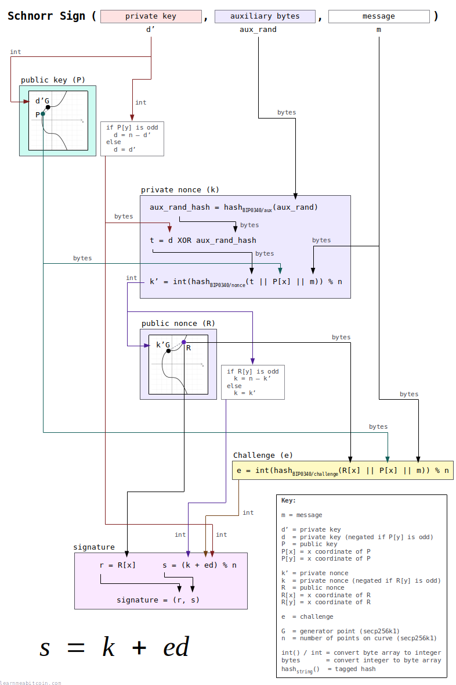](https://static.learnmeabitcoin.com/diagrams/png/schnorr-sign.png)


Sign (Code)

This snippet requires the [Secp256k1 parameters](#secp256k1-parameters) and [elliptic curve mathematics](#elliptic-curve-mathematics) code above.

```


copied


copied

# ---------
# Functions
# ---------
# helper functions

# convert hexadecimal string of bytes to integer
def int(bytes)
  return bytes.to_i(16)
end

# convert integer to hexadecimal string of bytes
def bytes(int)
  return int.to_s(16).rjust(64, "0") # convert to hex and pad with zeros to make it 32 bytes (64 characters)
end

# -----------
# Tagged Hash
# -----------
require "digest" # library for SHA256 hash function

# hash some data using SHA256 with a tag prefix
def tagged_hash(tag, message)

  # create a hash of the tag first
  tag_hash = Digest::SHA256.hexdigest(tag) # hash the string directly

  # prefix the message with the tag hash (the tag_hash is prefixed twice so that the prefix is 64 bytes in total)
  preimage = [tag_hash + tag_hash + message].pack("H*") # also convert to byte sequence before hashing

  # SHA256(tag_hash || tag_hash || message)
  result = Digest::SHA256.hexdigest(preimage);

  return result
end

# ----
# Sign
# ----
puts "Signing:"

private_key = "b7e151628aed2a6abf7158809cf4f3c762e7160f38b4da56a784d9045190cfef"
aux_rand = "0000000000000000000000000000000000000000000000000000000000000001" # auxiliary bytes for contributing to randomness of the nonce (security does not rely on this being random)
message = "243f6a8885a308d313198a2e03707344a4093822299f31d0082efa98ec4e6c89"

puts " private key: #{private_key}"
puts " aux rand:    #{aux_rand}"
puts " message:     #{message}"

# convert private key to an integer
d0 = int(private_key)

# make sure private key is in valid range (greater than 0 and less than the number of points on the curve)
unless (1..$n-1).include?(d0)
  raise "private key must be in the range 1..n-1"
end

# calculate the public key point from the private key
public_key_point = multiply(d0) # multiply() checks for point at infinity

# negate the private key if the public key it creates doesn't have an even y value, else keep the private key the same
# note: due to the way the elliptic curve works, negate the private key will produce a public key with the same x coordinate, but the opposite y value
if public_key_point[:y] % 2 != 0
  d = $n - d0
else
  d = d0
end

# create a tagged hash of the auxiliary bytes
aux_rand_hash = tagged_hash("BIP0340/aux", aux_rand)

# first step toward creating the nonce is to XOR the private key with the hash of the auxiliary bytes
t = d ^ int(aux_rand_hash)

# create the nonce by hashing t (from the previous step) along with the public_key and message
k0 = int(tagged_hash("BIP0340/nonce", bytes(t) + bytes(public_key_point[:x]) + message)) % $n # public key is included in hash for "key-prefixed" schnorr signatures

# check that the nonce isn't zero
if k0 == 0
  raise "nonce must not be zero (this is almost impossible, but checking anyway)"
end

# use this nonce to get a point on the curve
random_point = multiply(k0) # multiply() checks for point at infinity

# negate the nonce used to create the random point if the public key it creates doesn't have an even y value
if random_point[:y] % 2 != 0
  k = $n - k0
  # note: due to the way the elliptic curve works, the inverse private key will produce an even y value
else
  k = k0
end

# create the challenge e value by hashing the random point with the public key and message
e = int(tagged_hash("BIP0340/challenge", bytes(random_point[:x]) + bytes(public_key_point[:x]) + message)) % $n

# r value is the x-coordinate of point R
r =  random_point[:x]

# s value: (k + e*d) mod n
s = (k + e * d) % $n # this is linear (whereas s in ECDSA is non-linear)

# signature is the r and s values converted to 32-byte hexadecimal string and concatenated
sig = bytes(r) + bytes(s)

# you should check the signature verifies before returning it
puts "              ↓"
puts " signature:   #{sig}" #=> 6896bd60eeae296db48a229ff71dfe071bde413e6d43f917dc8dcf8c78de33418906d11ac976abccb20b091292bff4ea897efcb639ea871cfa95f6de339e4b0a
puts
```


Method

#### 1. Get the data needed for signing.

To create a Schnorr signature you need to start with the following data:

* **Private Key (`d'`)** — This is the private key used to create the public key you want to create a signature for.
* **Auxiliary Bytes (`aux_rand`)** — Some randomly generated 32-bytes of data. This is used to create the *random* part of the signature. It's ideal if these bytes are completely random, but it's fine to simply *increment* these auxiliary bytes for each signature you create from a specific private key.
* **Message (`m`)** — The message you want to sign. It can be any size, although it's typically a 32-byte hash of some data.

#### 2. Calculate the public key (`P`).

`P = d'·G`

To start with, calculate the public key (`P`) from the private key (`d'`) using elliptic curve multiplication.

 Number Converter

Binary (Base 2)

0b

`0 digits`

Decimal (Base 10)

0d

`0 digits`

Hexadecimal (Base 16)

0x

`0 digits`


+1


0 secs

 EC Multiply

Generator Point

Random Point


Point 1

x:

0d

y:

0d


Multiplier

0d


+1

Random


Point 1 x Multiplier

x:

0d

y:

0d


Steps
 


0 secs

In technical terms:

1. Convert the private key (`d'`) to an integer.
2. Check that the private key is valid (in the range of `1..n-1`, where `n` is the number of points on the elliptic curve).
3. Multiply the generator point (`G`) by the private key (`d'`).

The public key is used in a couple of places when creating the signature, so that's why we're doing this at the start.

#### 3. Negate the private key (`d'`) if the y-coordinate of the public key (`P[y]`) is odd.

If the private key produces a public key with an **even** y-coordinate, we keep the private key the same:

`d = d'`

However, if the private key produces a public key with an **odd** y-coordinate, we need to *negate* the private key by subtracting it from the number of points on the curve:

`d = n - d'`

The Schnorr signature scheme in Bitcoin assumes that all points have even y-coordinates, so we need to use the "correct" version of the private key before using it in the upcoming steps.

A *negated* private key will produce a public key with the same x-coordinate, but the *opposite* y-coordinate.

So even though we may negate the private key in this step, the original private key is still valid, because both the original private key and negated version produce the "same" public key (i.e. the same x-coordinate).

For example, here's a private key and its negation. Try converting both to public keys to see what I mean:

```
n = 115792089237316195423570985008687907852837564279074904382605163141518161494337

private key (d) = 49097021556540366728351378259471079529932651371354504836784826377767265482141
negated (n - d) = 66695067680775828695219606749216828322904912907720399545820336763750896012196

private key (d) = 0x6c8bedef612883700a7e66e2746eba4db006fd28bdd6db8f389a8845a0e3b59d
negated (n - d) = 0x937412109ed77c8ff581991d8b9145b10aa7dfbdf171c4ac8737d6472f528ba4
```

 Public Key

Generate Random

Private Key

`0 bytes`

Public Key


Coordinates

x:

0d

y:

0d

parity:

A public key is just a point on an elliptic curve. The final public key is these coordinates in hexadecimal.

Compression
 Compressed (02 or 03 prefix)
 Uncompressed (04 prefix)
 x-only (no prefix)

The elliptic curve is symmetrical along the x-axis, so a *compressed* public key only needs to store the full x-coordinate and whether the y-coordinate is even or odd.

An x-only public key is used in [Taproot](/technical/upgrades/taproot/) outputs. The corresponding y-coordinate is assumed to be even.

`0 bytes`


**Never enter your private key into a website, or use a private key generated by a website.** Websites can easily save the private key and use it to steal your bitcoins.

0 secs

#### 4. Create the private nonce (`k'`).

The private nonce (`k'`) is the random element of the signature. It is constructed in three steps:

##### 1. Create a tagged hash of your chosen auxiliary bytes (`aux_rand`):

`aux_rand_hash = hashBIP0340/aux(aux_rand)`

 Tagged Hash

Random Example

String


BIP0340/aux
BIP0340/nonce
BIP0340/challenge

TapLeaf
TapBranch
TapTweak
TapSighash

Data (Hex)

`0 bytes`

Result

SHA256(SHA256(string) || SHA256(string) || data)

`0 bytes`


0 secs

The auxiliary bytes will be used to modify our private key (`d`), which will be used as the source of randomness for our signature.

**The auxiliary bytes must be different for each signature.** Otherwise, the upcoming private nonce (`k'`) will be the same for different signatures, which would allow an attacker to calculate our private key.

##### 2. XOR the private key (`d`) with the hash of the auxiliary bytes (`aux_rand_hash`):

`t = d XOR aux_rand_hash`

This produces a temporary value (`t`), which will be different for every signature we create.

It's perfectly fine to increment the auxiliary bytes for each signature instead of generating completely random 32-bytes each time, as this temporary value (`t`) will still be unique enough for the signature to be secure. However, it's preferable to use random auxiliary bytes each time if you can.

##### 3. Create the final private nonce (`k'`):

`k' = int(hashBIP0340/nonce(t || P[x] || m)) % n`

 Tagged Hash

Random Example

String


BIP0340/aux
BIP0340/nonce
BIP0340/challenge

TapLeaf
TapBranch
TapTweak
TapSighash

Data (Hex)

`0 bytes`

Result

SHA256(SHA256(string) || SHA256(string) || data)

`0 bytes`


0 secs

This private nonce (`k'`) is a [tagged hash](#tagged-hash) of the following data:

* `t` = temporary value (from previous step)
* `P[x]` = x-coordinate of the public key (from [step 2](#sign-step-2)) converted to bytes
* `m` = message (from [step 1](#sign-step-1))

We then convert this hash to an *integer*, and modulo it by the number of points on the elliptic curve (`n`).

This produces a number that we can use as our private nonce (`k'`) to use when creating the signature.

**The *secret* input to this hash is (`t`).** This comes from the combination of the private key (`d`) and our chosen auxiliary bytes (`aux_rand`).

The private nonce (`k'`) in most signature schemes is just a simple randomly-generated number.

However, using this somewhat complicated setup means that we can use our private key (`d`) as the "seed" for the randomness, which means we can then simply increment some auxiliary bytes (`aux_rand`) to create a secure enough private nonce (`k'`). This may be safer than trying to generate a random number in some situations.

#### 5. Calculate the public nonce (`R`).

The next step is to produce a public version of our private nonce (`k'`) that will be shared as part of our overall signature. This is known as the public nonce (`R`):

`R = k'·G`

To create this public nonce, we use elliptic curve multiplication to multiply the generator point (`G`) by the private nonce (`k'`) calculated in the previous step.

 Number Converter

Binary (Base 2)

0b

`0 digits`

Decimal (Base 10)

0d

`0 digits`

Hexadecimal (Base 16)

0x

`0 digits`


+1


0 secs

 EC Multiply

Generator Point

Random Point


Point 1

x:

0d

y:

0d


Multiplier

0d


+1

Random


Point 1 x Multiplier

x:

0d

y:

0d


Steps
 


0 secs

In technical terms:

* Convert the private nonce (`k'`) to an integer.
* Check that the private nonce isn't zero (it's almost impossible for this to happen, but you should check anyway).
* Multiply the generator point (`G`) by the private nonce (`d'`).

This step is the same as creating a public key, except that we're multiplying the generator point by the *private nonce* (`k'`) instead of a private key (`d'`).

#### 6. Negate the private nonce (`k'`) if the y-coordinate of the public nonce (`R[y]`) is odd.

If the y-coordinate of the resulting public nonce (`R[y]`) is **even**, keep the private nonce (`k'`) the same:

`k = k'`

But if the y-coordinate is **odd**, negate the private nonce (`k'`) so that it produces a point with the same x-coordinate but with an even y-coordinate instead:

`k = n - k'`

Again, all elliptic curve points within the Schnorr signature scheme in Bitcoin are assumed to have an even y-coordinate, so we use the version of the private nonce (`k'`) that produces a point with an even y-coordinate.

#### 7. Calculate the challenge (`e`).

`e = int(hashBIP0340/challenge(R[x] || P[x] || m)) % n`

 Tagged Hash

Random Example

String


BIP0340/aux
BIP0340/nonce
BIP0340/challenge

TapLeaf
TapBranch
TapTweak
TapSighash

Data (Hex)

`0 bytes`

Result

SHA256(SHA256(string) || SHA256(string) || data)

`0 bytes`


0 secs

The challenge (`e`) is a [tagged hash](#tagged-hash) of the following data:

* `R[x]` = x-coordinate of the public nonce (from [step 5](#sign-step-5)) converted to bytes
* `P[x]` = x-coordinate of the public key (from [step 2](#sign-step-2)) converted to bytes
* `m` = message (from [step 1](#sign-step-1))

We then convert this hash result to an *integer*, and modulo it by the number of points on the elliptic curve (`n`).

#### 8. Construct the signature.

The complete signature consists of two parts:

##### 1. `r = R[x]`

This is just the x-coordinate of the public nonce (`R`).

We need to send this to the verifier as part of our signature so they can construct the same challenge (`e`) during verification.

##### 2. `s = (k + ed) % n`

This is the "actual" signature part that proves to the verifier that we know the private key (`d`) for the public key (`P`).

* The private nonce (`k`) is used to hide our private key (`d`).
* The challenge (`e`) is required to prove to the verifier that we haven't cheated when creating the signature.

Lastly, we convert both of these `r` and `s` values to 32 hexadecimal bytes, and concatenate them to create our complete 64-byte [encoded signature](#signature-encoding):

`signature = (r, s)`

### Verify

Random Example

Public Key (P[x])

0x


Random

`0 bytes`

Message (m)

0x


Random

`0 bytes`

Signature (r, s)

0x

`0 bytes`


---


Details


Public Key (P)


x:

0d

y:

0d


Signature


r:

0d

s:

0d


Point 1 = sG


x:

0d

y:

0d


Challenge (e) = int(hashBIP0340/challenge(r || P[x] || m)) % n

0d

(n - e)

0d


Point 2 = (n-e)P


x:

0d

y:

0d


R = sG + (n-e)P


x:

0d

y:

0d


Verify (r = R[x])


r:   

0d

R[x]:

0d


0 secs

[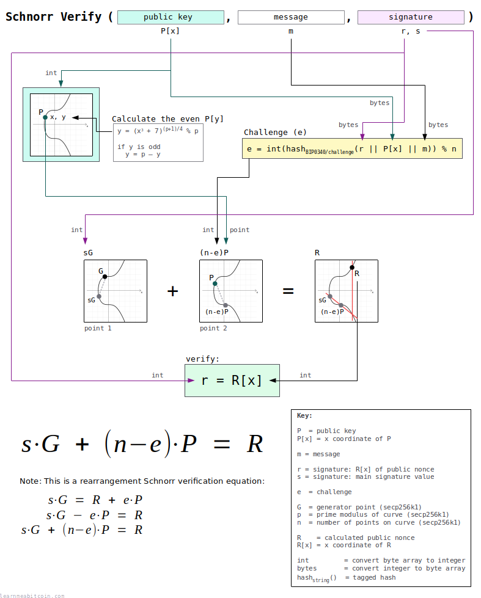](https://static.learnmeabitcoin.com/diagrams/png/schnorr-verify.png)


Verify (Code)

This snippet requires the [Secp256k1 parameters](#secp256k1-parameters) and [elliptic curve mathematics](#elliptic-curve-mathematics) code above.

```


copied


copied

# ---------
# Functions
# ---------
# helper functions

# convert hexadecimal string of bytes to integer
def int(bytes)
  return bytes.to_i(16)
end

# convert integer to hexadecimal string of bytes
def bytes(int)
  return int.to_s(16).rjust(64, "0") # convert to hex and pad with zeros to make it 32 bytes (64 characters)
end

# -----------
# Tagged Hash
# -----------
require "digest" # library for SHA256 hash function

# hash some data using SHA256 with a tag prefix
def tagged_hash(tag, message)

  # create a hash of the tag first
  tag_hash = Digest::SHA256.hexdigest(tag) # hash the string directly

  # prefix the message with the tag hash (the tag_hash is prefixed twice so that the prefix is 64 bytes in total)
  preimage = [tag_hash + tag_hash + message].pack("H*") # also convert to byte sequence before hashing

  # SHA256(tag_hash || tag_hash || message)
  result = Digest::SHA256.hexdigest(preimage);

  return result
end

# ------
# Verify
# ------
puts "Verifying:"

public_key = "dff1d77f2a671c5f36183726db2341be58feae1da2deced843240f7b502ba659"
message = "243f6a8885a308d313198a2e03707344a4093822299f31d0082efa98ec4e6c89"
sig = "6896bd60eeae296db48a229ff71dfe071bde413e6d43f917dc8dcf8c78de33418906d11ac976abccb20b091292bff4ea897efcb639ea871cfa95f6de339e4b0a"

puts " public key:  #{public_key}"
puts " message:     #{message}"
puts " signature:   #{sig}"

# convert public key (x coordinate only) in to a point - lift_x() in BIP 340
x = int(public_key) # convert from x coordinate from hex to an integer
y_sq = (x**3 + 7) % $p # use the elliptic curve equation (y² = x³ + ax + b) to work out the value of y from x
y = y_sq.pow(($p+1)/4, $p) # secp256k1 is chosen in a special way so that the square root of y is y^((p+1)/4)

# check that x coordinate is less than the field size
if x >= $p
  raise "x value in public key is not a valid coordinate because it is not less than the elliptic curve field size"
end

# verify that the computed y value is the square root of y_sq (otherwise the public key was not a valid x coordinate on the curve)
if (y**2) % $p != y_sq
  raise "public key is not a valid x coordinate on the curve"
end

# if the calculated y value is odd, negate it to get the even y value instead (for this x-coordinate)
if y % 2 != 0
  y = $p - y
end

# public key point
public_key_point = {x: x, y: y}

# extract r value from the signature and convert to an integer
r = sig[0..63] # first 32 bytes (64 characters)

# extract s value from the signature and convert to an integer
s = sig[64..-1] # last 32 bytes (64 characters)

# check that r is less than the field size
if int(r) >= $p
  raise "r value in signature is not less than the elliptic curve field size"
end

# check that s is less than the number of points on the curve (order)
if int(s) >= $n
  raise "s value in signature is not less than the number of points on the elliptic curve"
end

# create the challenge e by hashing the random point with the public key and message (same as during signing)
e = tagged_hash("BIP0340/challenge", r + bytes(x) + message).to_i(16) % $n # converting the x coordinate integer to 32-byte hexadecimal string

# create a point on the curve by multiplying the generator point by s
point1 = multiply(int(s), $G)

# create another point on the curve by multiplying the public key point by e
point2 = multiply($n - e, public_key_point) # note: we use ($n - e) so that the point addition in following step is subtraction instead (i.e. point1 - point2)

# add these points to get calculate a third point (R)
point3 = add(point1, point2) # add() checks for point at infinity

# check R has even y value
if point3[:y] % 2 != 0
  raise "calculated R during signature verification has an odd y value (it should be even)"
end

# signature verification: check that the third point calculated matches the x coordinate of the random point (r) given in the signature
puts "              ↓"
puts " result:      success" if point3[:x] == int(r)
puts " result:      fail" if point3[:x] != int(r)
```


Method

#### 1. Get the data needed to verify.

Three pieces of data are required to verify a signature:

* **Public Key (`P[x]`)** — This is the public key for the private key that was used to create the signature. This public key is just the 32-byte x coordinate only.
* **Message (`m`)** — The message that was signed. This is usually the 32-byte hash of some transaction data.
* **Signature (`r, s`)** — This 64-byte signature contains two parts; the 32-byte random part (`r`), and the 32-byte signature part (`s`).

#### 2. Convert the public key (`P[x]`) to a point.

To perform the final verification step we need to convert the encoded public key to a *point*.

However, the public key (`P[x]`) we're given is **just an x coordinate**. Therefore, we need to calculate the y coordinate from it to convert it back to a point.

##### 1. Calculating the y coordinate.

To start with, we can find the value of `y2` by plugging `x` into the equation for the elliptic curve:

`y2 = x3 + 7`

So now we just need to find the square root of `y2` to get `y`.

However, it's not actually possible to "square root" this value directly when working with coordinates on the elliptic curve. Fortunately, the [Secp256k1 parameters](#secp256k1-parameters) have been chosen so that the square root can be found using this equation:

`y = (y2)(p+1)/4) % p`

Note: I don't know why this works. I just know that it does and that it's very handy.

And this gives us the y coordinate.

##### 2. Select the *even* y coordinate.

Lastly, because we've found the square root of a number, the result could be one of **two possible values**.

In everyday mathematics the square root of a number will either be *positive* or *negative*. But in elliptic curve mathematics, this y coordinate will either be *even* or *odd*.

And remember, we only work with [*even* y coordinates](#public-key-encoding) for Schnorr signatures in Bitcoin. So **if the y coordinate is odd**, we need to *negate* it to get the even `y` value instead:

`y = p - y`

This gives us the ***even* y coordinate for the same x coordinate**.

So now we have both `x` and `y` coordinates that make up the full public key point (`P`).

When negating a y *coordinate* you subtract it from the field size `p` (see [parameters](#secp256k1-parameters)). This is different to [signing step 3](#sign-method) where we negated the *scalar* `d'` by subtracting it from the number of points on the curve `n`.

Check that the x coordinate is a valid before continuing:

* Check that `x` is less than the field size (`p`).
* Check that the computed `y` value is actually equal to `y2` when you square it. If not, the x coordinate was invalid to start with.

If either of these things are not true, the given public key (`P[x]`) is invalid.

This entire step is known as `lift_x` in [BIP 340](https://github.com/bitcoin/bips/blob/master/bip-0340.mediawiki).

#### 3. Extract the `r` and `s` values from the signature.

The 64-byte signature is made up of two parts.

* **`r` (first 32 bytes)** – This is `R[x]`, which is the x coordinate of the public nonce (`R`) generated during [signing](#sign). When we verify the signature, we're going to check that we can recreate this same point.
* **`s` (last 32 bytes)** – This is the actual signature part. This is the "magic" value that proves the person who created this `s` value has the private key for the given public key.

Perform a couple of checks on this signature data before continuing:

* Check the `r` value is less than the field size (`p`).
* Check the `s` value is less than the number of points on the curve (`n`).

If either of these are not true, the signature is invalid.

#### 4. Calculate the challenge (`e`).

`e = int(hashBIP0340/challenge(r || P[x] || m)) % n`

 Tagged Hash

Random Example

String


BIP0340/aux
BIP0340/nonce
BIP0340/challenge

TapLeaf
TapBranch
TapTweak
TapSighash

Data (Hex)

`0 bytes`

Result

SHA256(SHA256(string) || SHA256(string) || data)

`0 bytes`


0 secs

The challenge (`e`) is a tagged hash of the following data:

* `r` = This is the `R[x]` value we just extracted from the signature (from the previous step)
* `P[x]` = x-coordinate of the public key (from [step 1](#verify-step-1))
* `m` = message (from [step 1](#verify-step-1))

We then convert this hash to an integer, and modulo it by the number of points on the elliptic curve.

You'll notice that this challenge (`e`) is the **same as the one created during signing**. This is because both the signer and verifier need to be able to [calculate the same challenge independently](#basics-non-interactive).

#### 5. Verify the signature.

We now have everything we need to verify this signature.

Signature verification is performed by **calculating three points** on the elliptic curve. These points are calculated using [elliptic curve multiplication and addition](#elliptic-curve-mathematics):

##### Point 1

`point1 = s·G`

The first point is the `s` value from the signature *multiplied* by the generator point (`G`).

##### Point 2

`point2 = (n-e)·P`

The second point is the challenge (`e`) *multiplied* by the full public key (`P`) we constructed in [step 1](#verify-step-1).

However, because the upcoming third point is going to be calculated by *subtracting* this second point from the first point, we need to negate this scalar (`e`) by subtracting it from the number of points on the curve (`n`).

By using `(n-e)·P` instead of `e·P`, the result of elliptic curve addition in the next step will be equivalent to *subtraction*.

##### Point 3

`point3 = s·G + (n-e)·P`

The third point (`R`) is calculated by adding *point 1* and *point 2*.

This is a rearrangement of the original verification equation `s·G = R + e·P`:

1. `s·G = R + e·P`
2. `R = s·G - e·P`
3. `R = s·G + (n-e)·P`

Finally, we check to see if **x coordinate of point 3 (`R`)** is equal to the **`r`** value from the signature:

`r == R[x]`

If these values are **equal**, the signature is **valid**.

If these values are **not equal**, the signature is **invalid**.

The `r` value in the signature is the x coordinate of the signer's chosen random public point. We would only be able to calculate the same `R[x]` value if they are able to give us a valid `s` value in their signature (in conjunction with the public key and message) to be able to recreate it.

### Batch Verify

The cool thing about Schnorr signatures is that you can **verify multiple signatures at the same time**.

This is known as *batch verification*, and it's [faster](https://bitcoin.stackexchange.com/questions/80698/schnorrs-batch-validation) than verifying each signature individually.

[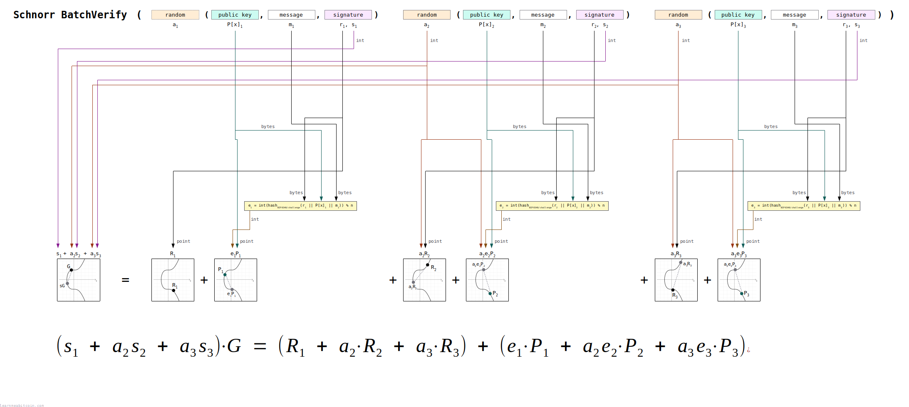](https://static.learnmeabitcoin.com/diagrams/png/schnorr-batch-verify.png)


Batch Verify (Full Code)

```


copied


copied

# -------------------------
# Elliptic Curve Parameters
# -------------------------
# these are the parameters for secp256k1, which is the same curve used in ECDSA
# note: setting these as $global variables so they're accessible from with the functions below (without having to pass them as arguments)

# y² = x³ + ax + b
$a = 0
$b = 7

# prime field
$p = 115792089237316195423570985008687907853269984665640564039457584007908834671663 #=> 0xFFFFFFFFFFFFFFFFFFFFFFFFFFFFFFFFFFFFFFFFFFFFFFFFFFFFFFFEFFFFFC2F

# number of points on the curve we can hit ("order")
$n = 115792089237316195423570985008687907852837564279074904382605163141518161494337 #=> 0xFFFFFFFFFFFFFFFFFFFFFFFFFFFFFFFEBAAEDCE6AF48A03BBFD25E8CD0364141

# generator point (the starting point on the curve used for all calculations)
$G = {
  x: 55066263022277343669578718895168534326250603453777594175500187360389116729240, #=> 0x79BE667EF9DCBBAC55A06295CE870B07029BFCDB2DCE28D959F2815B16F81798
  y: 32670510020758816978083085130507043184471273380659243275938904335757337482424, #=> 0x483ADA7726A3C4655DA4FBFC0E1108A8FD17B448A68554199C47D08FFB10D4B8
}

# ---------------
# Modular Inverse: Ruby doesn't have a built-in modinv function
# ---------------
def inverse(a, m = $p)
  m_orig = m         # store original modulus
  a = a % m if a < 0 # make sure a is positive
  y_prev = 0
  y = 1
  while a > 1
    q = m / a

    y_before = y # store current value of y
    y = y_prev - q * y # calculate new value of y
    y_prev = y_before # set previous y value to the old y value

    a_before = a # store current value of a
    a = m % a # calculate new value of a
    m = a_before # set m to the old a value
  end
  return y % m_orig
end

# ------
# Double: add a point to itself
# ------
def double(point)
  # check for point at infinity (greatest common divisor between 2y and p isn't 1)
  if (((2 * point[:y]) % $p).gcd($p) != 1) # taken from BitcoinECDSA.php
    raise "Point at infinity."
  end

  # slope = (3x₁² + a) / 2y₁
  slope = ((3 * point[:x] ** 2 + $a) * inverse((2 * point[:y]), $p)) % $p # using inverse to help with division

  # x = slope² - 2x₁
  x = (slope ** 2 - (2 * point[:x])) % $p

  # y = slope * (x₁ - x) - y₁
  y = (slope * (point[:x] - x) - point[:y]) % $p

  # Return the new point
  return { x: x, y: y }
end

# ---
# Add: add two points together
# ---
def add(point1, point2)
  # double if both points are the same
  if point1 == point2
    return double(point1)
  end

  # check for point at infinity (greatest common divisor between x1-x2 and p isn't 1)
  if ((point1[:x] - point2[:x]).gcd($p) != 1) # taken from BitcoinECDSA.php
    raise "Point at infinity."
  end

  # slope = (y₁ - y₂) / (x₁ - x₂)
  slope = ((point1[:y] - point2[:y]) * inverse(point1[:x] - point2[:x], $p)) % $p

  # x = slope² - x₁ - x₂
  x = (slope ** 2 - point1[:x] - point2[:x]) % $p

  # y = slope * (x₁ - x) - y₁
  y = ((slope * (point1[:x] - x)) - point1[:y]) % $p

  # Return the new point
  return { x: x, y: y }
end

# --------
# Multiply: use double and add operations to quickly multiply a point by an integer value (i.e. a private key)
# --------
def multiply(k, point = $G)
  # create a copy the initial starting point (for use in addition later on)
  current = point

  # convert integer to binary representation
  binary = k.to_s(2)

  # double and add algorithm for fast multiplication
  binary.split("").drop(1).each do |char| # from left to right, ignoring first binary character
    # 0 = double
    current = double(current)

    # 1 = double and add
    current = add(current, point) if char == "1"
  end

  # return the final point
  current
end


# ---------
# Functions
# ---------
# helper functions used in schnorr signing and verifying
require "digest" # library for SHA256 hash function

# hash some data using SHA256 with a tag prefix
def tagged_hash(tag, message)

  # create a hash of the tag first
  tag_hash = Digest::SHA256.hexdigest(tag) # hash the string directly

  # prefix the message with the tag hash (the tag_hash is prefixed twice so that the prefix is 64 bytes in total)
  preimage = [tag_hash + tag_hash + message].pack("H*") # also convert to byte sequence before hashing

  # SHA256(tag_hash || tag_hash || message)
  result = Digest::SHA256.hexdigest(preimage);

  return result
end

# convert hexadecimal string of bytes to integer (convenience function to make the upcoming steps clearer)
def int(bytes)
  return bytes.to_i(16)
end

# convert integer to hexadecimal string of bytes (convenience function to make the upcoming steps clearer)
def bytes(int)
  return int.to_s(16).rjust(64, "0") # convert to hex and pad with zeros to make sure it's 32 bytes (64 characters)
end

# convert x coordinate to a point (with an even y value)
def lift_x(x)

  # calculate the y value from x
  x = int(x) # convert from x coordinate from hex to an integer
  y_sq = (x**3 + 7) % $p # use the elliptic curve equation (y² = x³ + ax + b) to work out the value of y from x
  y = y_sq.pow(($p+1)/4, $p) # secp256k1 is chosen in a special way so that the square root of y is y^((p+1)/4)

  # check that x coordinate is less than the field size
  if x >= $p
    raise "x value in public key is not a valid coordinate because it is not less than the elliptic curve field size"
  end

  # verify that the computed y value is the square root of y_sq (otherwise the public key was not a valid x coordinate on the curve)
  if (y**2) % $p != y_sq
    raise "public key is not a valid x coordinate on the curve"
  end

  # if the calculated y value is odd, negate it to get the even y value instead (for this x-coordinate)
  if y % 2 != 0
    y = $p - y
  end

  # return x and y coordinates for this point
  return {x: x, y: y}
end


# ------------
# Batch Verify
# ------------

# batch verification data
signatures = [ 
  {public_key: '9abfac866a8fdd9b50cdf68b16f9861652f16ac6113949f4a5d4f6c57c192db2', message: '26e906314b0215b9035de37a6da02dc43fa60939eade2992058c4fdb4d43f845', signature: '5db322e0dd3718cc3a3f8fa21aa899fb1bebae4506c8fed6e9305e2f834202780c77078e3aef618275501df3caf1ab6cc45b0d102712e08b67b8545589347046'},
  {public_key: '1bdf2f729a6dde85b479e02430c311f7a5a409d6d147d4075f6d58f073a7a6d6', message: 'a8514d48b2b07a5e00ff844437e65d4a02d43fd6de85b7814a841cade6a904ac', signature: 'a61206a5dcaa820de0a382879c3f58298b2d28bee9a99ba3a04882b342a7470aa12e6e3d2f5af9a71d6c996f359fcdeae9810f06c1fe179410280294a88017ea'},
  {public_key: '691d8375c0965e72b70fdfe8e13613ff47405f3d0834c723d374c12c6a493742', message: 'c28a737f65457b54d8e7dfe49f45cf7adf20c97457f797b444cb98247bfea36d', signature: '8821b6b62a399555f23114904376c7916ac5bbbdb3105c6f97054d0fcc75ff7cd1d48e3572a130ea6b487cf60a9a7fbc4ccfb51003ca8a14b044da7d06267ac3'},
]

# calculate the number of signatures we're going to batch verify
u = signatures.length

# ------
# Step 1 - Generate a random number for each signature we're going to batch verify (except for the first one)
# ------

# combine the public keys, messages, and signatures
public_keys_combined = ""
messages_combined = ""
signatures_combined = ""

signatures.each do |x|
  public_keys_combined << x[:public_key]
  messages_combined << x[:message]
  signatures_combined << x[:signature]
end

# create an initial seed to use with the hash function
seed = Digest::SHA256.hexdigest([public_keys_combined + messages_combined + signatures_combined].pack("H*"))

# initialize array for holding the random numbers for each of the signatures
a = []

(1..u-1).each do |i|
  # generate a random number by hashing the inital seed along with the index for this loop
  # ChaCha20 is recommended (but not available in Ruby), so using this method instead (which works just as well)
  random_number = Digest::SHA256.hexdigest(seed + i.to_s).to_i(16)

  # check the random number is less than the number of points on the curve
  unless (1..$n-1).include?(random_number)
    raise "random number (a) must be in the range 1..n-1"
  end

  # store the random number in array for later
  a[i] = random_number
end

# ------
# Step 2 - Calculate the left side of the equation
# ------
# left = (s_1 + (a_2 * s_2) + ... + (a_u * s_u)) * G

# starting scalar value is the s value of the first signature
s_0 = signatures[0][:signature][64..-1].to_i(16) # last 32 bytes (64 characters) is the s value
left_scalar = s_0

# run through the rest of the signatures
(1..u-1).each do |i|

  # multiply the s value of each signature by the random number we've generated for it, then add it to the scalar
  s_i = signatures[i][:signature][64..-1].to_i(16)
  left_scalar += s_i * a[i]

end

# multiply the generator point by the scalar we've just calculated
left = multiply(left_scalar, $G)

# ------
# Step 3 - Calculate the right side of the equation
# ------
# right = [R_1 + (a_2 * R_2) + .. + (a_u * R_u)] + [(e_1 * P_1) + (a_2 * e_2 * P_2) + ... + (a_u * e_u * P_u)]

# get the r value, message, and public key for the first signature
r_0 = signatures[0][:signature][0..63]
message_0 = signatures[0][:message]
public_key_0 = signatures[0][:public_key]

# convert r value to a point
r_0_point = lift_x(r_0)

# starting point for the right side of the equation is R
right = r_0_point

# convert public key to a point
public_key_0_point = lift_x(public_key_0)

# calculate the challenge
e_0 = tagged_hash("BIP0340/challenge", r_0 + public_key_0 + message_0).to_i(16) % $n # converting the x coordinate integer to 32-byte hexadecimal string

# multiply the public key point by the challenge scalar
eP_0 = multiply(e_0, public_key_0_point)

# add this to the right side of the equation
right = add(right, eP_0)

# run through the rest of the signatures
(1..u-1).each do |i|

  # get the r value, message, and public key for this signature
  r_i = signatures[i][:signature][0..63]
  message_i = signatures[i][:message]
  public_key_i = signatures[i][:public_key]

  # convert r value to a point (R)
  r_i_point = lift_x(r_i)

  # multiply R point by the random number for this signature
  aR_i = multiply(a[i], r_i_point)

  # add this to the right side of the equation
  right = add(right, aR_i)

  # convert public key to a point
  public_key_i_point = lift_x(public_key_i)

  # calculate the challenge
  e_i = tagged_hash("BIP0340/challenge", r_i + public_key_i + message_i).to_i(16) % $n # converting the x coordinate integer to 32-byte hexadecimal string

  # multiply the challenge by the random number for this signature
  ae_i = e_i * a[i]

  # multiply the public key point by this value
  aeP_i = multiply(ae_i, public_key_i_point)

  # add this to the right side of the equation
  right = add(right, aeP_i)

end

# ------
# Step 4 - Verify
# ------

# check that the left side of the equation is equal to the right side of the equation
puts left == right

# If all signatures are valid (i.e. verifying each signature individually would be successful), batch verification will always be successful
# If at least one signature is invalid, batch verification will return success with at most a negligible probability
```


Method

Batch verification uses the same fundamental equation as when [verifying a single signature](#verify):

[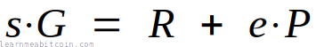](https://static.learnmeabitcoin.com/diagrams/png/schnorr-equation-verify.png)

The only difference is that we *expand* it (including some extra multiplication with random numbers) so that we can verify multiple signatures at the same time:

[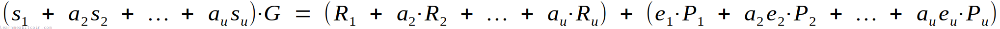](https://static.learnmeabitcoin.com/diagrams/png/schnorr-equation-batch-verify.png)

But don't worry, it looks more complicated than it actually is.

#### 1. Get all the data needed for batch verification.

To verify multiple signatures at the same time, you need to start with some signature "triplets".

For example:

* `triplet0 = (public key, message, signature)`
* `triplet1 = (public key, message, signature)`
* `triplet2 = (public key, message, signature)`

As you can see, each triplet contains the same data required for the verification of a single signature.

Now, seeing as we could have a varying number of signatures, it's helpful to define a couple of extra variables:

* `i` – The number for each signature triplet (e.g. `i=0` for the first one)
* `u` – The total number of signature triplets (e.g. `u=3` in this example)

#### 2. Generate a random number (`ai`) for each triplet.

We start by generating a random number for each triplet.

The recommended way to generate these random numbers is to start by creating an initial "seed" (see [BIP 340](https://github.com/bitcoin/bips/blob/master/bip-0340.mediawiki)). This seed is the [SHA-256](/technical/cryptography/hash-function/#sha256) hash of the `public keys`, `messages`, and `signatures` from each of the triplets concatenated together:

`seed = SHA-256( public keys || messages || signatures)`

We then use this seed as the starting point to generate all the random numbers we need.

For example, a simple way to create each random number is to hash this seed with the *index number* (`i`) for each triplet. This will produce a unique hash, which we convert to an integer and use as the random number for each triplet:

`ai = int(SHA-256(seed || i))`

We don't need a random number for the first triplet.

#### 3. Perform batch verification.

aka "draw the rest of the owl"

The batch verification equation looks like this:

`(s1 + a2s2 + .. au+su)G = (R1 + a2R2 + .. auRu) + (e1P1 + a2e2P2 + .. aueuPu)`

This looks complex, but we can break it down into three steps:

##### 1. Calculate the left side of the equation.

`(s1 + a2s2 + .. au+su)G`

For each triplet, multiply the `s` value from the signature by its random number `a`.

Then add all of these values together, and multiply the result by the generator point (`G`).

This step is the same as `s·G` in single signature verification. Except here we're multiplying each of the `s` values by `a` then adding them all together first.

##### 2. Calculate the right side of the equation

`(R1 + a2R2 + .. auRu) + (e1P1 + a2e2P2 + .. + aueuPu)`

For each triplet we calculate two points:

1. `aiRi`
   * `R` is the `r` value from the signature converted to a point.
   * We don't multiply `R1` by a random number.
2. `aieiPi`
   * `P` is the public key converted to a point.
   * The challenge `e` is calculated for each triplet in the same way as [single signature verification](#verify-method) (step 4).
   * We don't multiply `e1P1` by a random number.

We then add all of these points together, and this gives us the right side of the equation.

This step is the same as `R + e·P` in single signature verification. Except here we're multiplying each term by `a` then adding them all together first.

##### 3. Check if the left side equals the right side of the equation.

If both sides of the equation are **equal**, then *all* of the signatures are **valid**.

If both sides of the equation are **not equal**, then *one or more* of the signatures are **invalid**.

It's *technically* possible that the random numbers you generate could end up creating a balanced equation, even if one or more of the signatures are invalid. However, there is a "negligible" probability of this happening. In other words, it's too close to impossible for it to be a concern.


Where does this equation come from?

The verification equation for a single signature looks like this:

[](https://static.learnmeabitcoin.com/diagrams/png/schnorr-equation-verify.png)

So if you have two signatures, you can combine and verify them at the same time like so:

[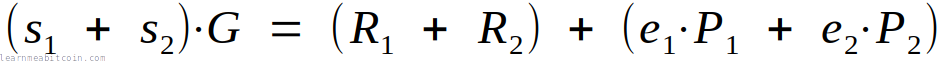](https://static.learnmeabitcoin.com/diagrams/png/schnorr-equation-batch-verify-1.png)

Therefore, a *general* equation for combining and verifying multiple signatures at the same time looks like this (where `u` is the total number of signatures):

[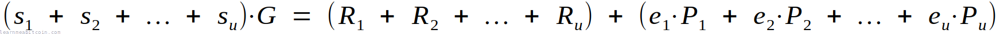](https://static.learnmeabitcoin.com/diagrams/png/schnorr-equation-batch-verify-2.png)

However, this equation isn't completely secure, as it's possible to construct a signature that will balance out the equation for an invalid signature. So to prevent this from happening, we multiply each individual verification equation by its own random number (which we call `a`). So the equation now looks like this:

[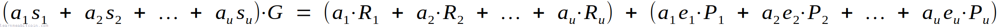](https://static.learnmeabitcoin.com/diagrams/png/schnorr-equation-batch-verify-3.png)

Lastly, we don't need to multiply the *first* verification equation by a random number, so we just leave that out:

[](https://static.learnmeabitcoin.com/diagrams/png/schnorr-equation-batch-verify.png)

And that's where this batch verification equation comes from.

This equation takes advantage of the fact that Schnorr signatures can be added together (see [linearity](#linearity)).

In the batch verification diagram above I have rearranged the equation to look like this:

`(s1 + a2s2 + .. au+su)G = (R1 + e1P1) + (a2R2 + a2e2P2) + .. + (auRu + aueuPu)`

Both equations are the same; I've just rearranged the right-hand side to make the diagram easier to follow.

## Design

How are Schnorr signatures implemented in Bitcoin?

The implementation of Schnorr signatures in Bitcoin includes some modifications to the [basic Schnorr signature scheme](#basics).

These are minor adjustments *specific to Bitcoin*; the underlying mathematics is still the same.

1. [Public Key Encoding](#public-key-encoding)
2. [Key-Prefixing](#key-prefixing)
3. [Tagged Hashes](#tagged-hash)
4. [Nonce Generation](#nonce-generation)
5. [Signature Encoding](#signature-encoding)

I don't know enough about cryptography to explain the technical details behind every design decision for the implementation of Schnorr signatures in Bitcoin, so I've given a simple overview of *why* they're implemented the way they are instead.

### 1. Public Key Encoding

When using Schnorr signatures in Bitcoin, a public key is encoded as the 32-byte **x-coordinate only**.

This [saves space](https://medium.com/blockstream/reducing-bitcoin-transaction-sizes-with-x-only-pubkeys-f86476af05d7) compared to using 33-byte [compressed public keys](/technical/keys/public-key/#compressed) or 65-byte [uncompressed public keys](/technical/keys/public-key/#uncompressed).

The reason for this is that we don't actually need the y-coordinate, as for any given x-coordinate there are only two possible y-coordinates:

1. An **even** y-coordinate
2. An **odd** y-coordinate

[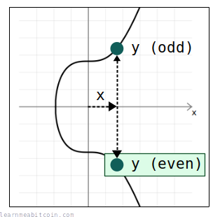](https://static.learnmeabitcoin.com/diagrams/png/schnorr-public-key-y-coordinate.png)

And when reconstructing the full public key, we always use the **even y-coordinate** out of the two.

So for any given public key x-coordinate, we use the elliptic curve equation (`y² = x³ + 7`) to figure out the two potential y coordinates, then select the *even* one out of the two to give us the full (x, y) coordinates of the public key.

#### Code

```


copied


copied

# -------------------------
# Elliptic Curve Parameters
# -------------------------

# prime field
$p = 115792089237316195423570985008687907853269984665640564039457584007908834671663

# ---------
# Functions
# ---------

# convert hexadecimal string of bytes to integer
def int(bytes)
  return bytes.to_i(16)
end

# ------------------------------
# Decompress Public Key (lift_x)
# ------------------------------

# encoded public key (32-byte x-coordinate only)
public_key = "dff1d77f2a671c5f36183726db2341be58feae1da2deced843240f7b502ba659"

# calculate one of the possible y values from the x coordinate
x = int(public_key) # convert from x coordinate from hex to an integer
y_sq = (x**3 + 7) % $p # use the elliptic curve equation (y² = x³ + 7) to work out the value of y from x
y = y_sq.pow(($p+1)/4, $p) # secp256k1 is chosen in a special way so that the square root of y is y^((p+1)/4)

# check that x coordinate is less than the field size
if x >= $p
  raise "x value in public key is not a valid coordinate because it is not less than the elliptic curve field size"
end

# verify that the computed y value is the square root of y_sq (otherwise the public key was not a valid x coordinate on the curve)
if (y**2) % $p != y_sq
  raise "public key is not a valid x coordinate on the curve"
end

# show current x and y value (this y value is odd, but sometimes it will already be even)
puts "x: #{x}" #=> 101293062680523315514373137351023114440902235251657644508821325047911886333529
puts "y: #{y}" #=> 95491709537915294920828256998521669146617750390665870859237534620269297521559

# if the calculated y value is odd, negate it to get the even y value instead (for this x-coordinate)
if y % 2 != 0
  y = $p - y
end

# show even y value
puts "y: #{y}" #=> 20300379699400900502742728010166238706652234274974693180220049387639537150104
```

The initial method of finding the y-coordinate from an x-coordinate is the same as when [decompressing a public key](/technical/keys/public-key/#decompress).

* Using the even y-coordinate every time means we don't have to try both possible y coordinates during [signature verification](#verify).
* Calculating the full public key point (x, y) from an encoded public key requires an extra step, but it's considered worth it to save an extra 1 byte of space in the blockchain for each public key.
* The `r` value in the signature (a random point) is also encoded as an x-coordinate only.

#### Doesn't this make the signature scheme less secure?

Seeing as we're only using the even y-coordinate for each public key, this does mean that two different private keys will actually produce the same *encoded* public key.

For example:

```
private_key_1 = b7e151628aed2a6abf7158809cf4f3c762e7160f38b4da56a784d9045190cfef
private_key_2 = 481eae9d7512d595408ea77f630b0c3757c7c6d77693c5e5184d85887ea57152

private_key_1_encoded_public_key = dff1d77f2a671c5f36183726db2341be58feae1da2deced843240f7b502ba659
private_key_2_encoded_public_key = dff1d77f2a671c5f36183726db2341be58feae1da2deced843240f7b502ba659
```

 Public Key

Generate Random

Private Key

`0 bytes`

Public Key


Coordinates

x:

0d

y:

0d

parity:

A public key is just a point on an elliptic curve. The final public key is these coordinates in hexadecimal.

Compression
 Compressed (02 or 03 prefix)
 Uncompressed (04 prefix)
 x-only (no prefix)

The elliptic curve is symmetrical along the x-axis, so a *compressed* public key only needs to store the full x-coordinate and whether the y-coordinate is even or odd.

An x-only public key is used in [Taproot](/technical/upgrades/taproot/) outputs. The corresponding y-coordinate is assumed to be even.

`0 bytes`


**Never enter your private key into a website, or use a private key generated by a website.** Websites can easily save the private key and use it to steal your bitcoins.

0 secs

The second private key in this example is the *additive inverse* of the first private key (i.e. I negated it by subtracting it from the [number of points on the curve](/technical/cryptography/elliptic-curve/#parameters)). This "inverted" private key produces the exact same x-coordinate for the public key, but with the opposing y-coordinate instead.

However, somewhat surprisingly, the fact that two private keys will produce the same public key [does not weaken the security of Schnorr signatures in Bitcoin](https://bitcoin.stackexchange.com/questions/90118/why-is-no-security-lost-by-using-32-byte-public-keys-in-schnorr-signatures-inste).

### 2. Key-Prefixing

In the [standard Schnorr signature scheme](#basics), the challenge (`e`) is created by hashing the public nonce (`kG`) with the message (`m`):

[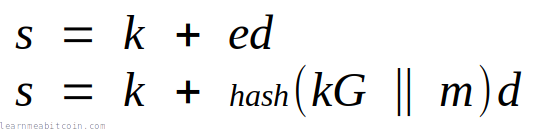](https://static.learnmeabitcoin.com/diagrams/png/schnorr-challenge-standard.png)

However, in the Bitcoin this hash also includes the x-coordinate of the public key (`Px`):

[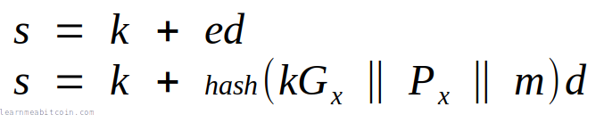](https://static.learnmeabitcoin.com/diagrams/png/schnorr-challenge-bitcoin.png)

This is referred to as key-prefixing, and it's included to [prevent attacks when generating signatures from unhardened public keys in a HD wallet](https://bitcoin.stackexchange.com/questions/79768/a-couple-of-questions-on-schnorr-sig).

This key prefixing is also used when [generating the private nonce](#nonce-generation).

### 3. Tagged Hashes

 Tagged Hash

Random Example

String


BIP0340/aux
BIP0340/nonce
BIP0340/challenge

TapLeaf
TapBranch
TapTweak
TapSighash

Data (Hex)

`0 bytes`

Result

SHA256(SHA256(string) || SHA256(string) || data)

`0 bytes`


0 secs

A tagged hash is the hash of some data with an additional **tag prefix**. This method of hashing has been introduced as part of the implementation of Schnorr signatures in Bitcoin.

[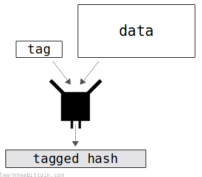](https://static.learnmeabitcoin.com/diagrams/png/schnorr-tagged-hash.png)

This gives each hash a *context*, so if you hashed the same data in a different context, you wouldn't get the same hash result.

Creating a tagged hash in Bitcoin is pretty simple:

1. Hash a string (the *tag*) that describes the context for the final hash.
2. Hash the data with this *tag hash* (prefixing the tag hash twice).

[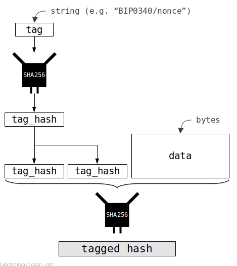](https://static.learnmeabitcoin.com/diagrams/png/schnorr-tagged-hash-technical.png)


Code

```


copied


copied

# -----------
# Tagged Hash
# -----------
require "digest" # library for SHA256 hash function

# hash some data using SHA256 with a tag prefix
def tagged_hash(tag, message)

  # create a hash of the tag first
  tag_hash = Digest::SHA256.hexdigest(tag) # hash the string directly

  # prefix the message with the tag hash (the tag_hash is prefixed twice so that the prefix is 64 bytes in total)
  preimage = [tag_hash + tag_hash + message].pack("H*") # also convert to byte sequence before hashing

  # SHA256(tag_hash || tag_hash || message)
  result = Digest::SHA256.hexdigest(preimage);

  return result
end
```


#### Why is the tag hash prefixed twice?

A tagged hash is created as follows:

```
tag = SHA256(string) || SHA256(string)
tagged_hash = SHA256(tag || data)
```

It would be simpler if we just used `SHA256(string)` (32 bytes) as the tag, but using `SHA256(string) || SHA256(string)` (64 bytes) allows for an **efficiency optimization** when creating tagged hashes.

You see, the [SHA256 hash algorithm](https://www.youtube.com/watch?v=f9EbD6iY9zI) works by hashing the input data in 64-byte blocks. It performs a round of hashing on each of these 64-byte blocks, then layers the results of each round on top of each other to produce the final hash result.

So by using `SHA256(string) || SHA256(string)`, we're creating a prefix that is **exactly 64 bytes in length**, which means it will fit inside the first message block during the first round of hashing. Therefore, for each tagged hash, we can pre-compute the result of the first message block (the tag prefix) and use this as the starting point within the hash algorithm.

In other words, using a 64-byte prefix allows us to skip the first round of hashing when creating a tagged hash.

This is a rather low-level optimization, and it's not something you need to use in your own code (unless extreme speed is a requirement). Nonetheless, the opportunity for more efficiency is the reason why we the tag prefix is constructed to be exactly 64 bytes in length.

### 4. Nonce Generation

[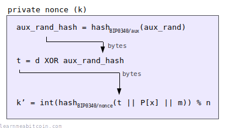](https://static.learnmeabitcoin.com/diagrams/png/schnorr-nonce-generation.png)

Every signature you create needs to include a **random nonce** (`k`).

In most signature schemes (e.g. [ECDSA](/technical/cryptography/elliptic-curve/ecdsa/)), this nonce is just a randomly-generated number. But in the implementation of Schnorr signatures in Bitcoin, we use a **specific method** for generating each nonce.

In short:

1. The private key (`d`) is used as the starting "seed".
2. This private key gets [XOR](https://stackoverflow.com/questions/14526584/what-does-the-xor-operator-do)'ed by the [tagged hash](#tagged-hash) of some auxiliary bytes (`aux_rand_hash`) to create a modified private key (`t`).
3. The random nonce (`k`) is then the tagged hash of the modified private key (`t`), public key (`Px`), and message (`m`).

This scheme for generating the nonce makes the whole Schnorr signature implementation look far more intimidating than it actually is. However, the nonce generation part has been designed this way to make it **more secure** (because you do not need to depend on your source of randomness being reliable), whilst also protecting against specific types of attacks.

I don't know enough about cryptography to explain the reasons behind this specific design, so here are some links that you may find useful:

* [k selection for Schnorr signatures](https://bitcoin.stackexchange.com/questions/95762/k-selection-for-schnorr-signatures) — First explanations of the reasons behind the scheme.
* [[bitcoin-dev] Mitigating Differential Power Analysis in BIP-340](https://gnusha.org/pi/bitcoindev/143g8W700TxSwkQM6rPf7NfRYcaVJoBqYLfR99gwtb-kBfL76EK556d4U8aNyEVRz5bp1eFzApLwPMSnhwAnK5m_htjqVREn5yZxXRCORiU=@wuille.net/) — Summary of the reasons behind the scheme.
* [Discussion on power analysis attacks](https://github.com/sipa/bips/issues/195) — This contains the thought process behind the nonce generation scheme.

In short, it may look complex, but it has been designed this way for a reason.

### 5. Signature Encoding

A Schnorr signature is *encoded* by concatenating the 32-byte `r` value and 32-byte `s` value.

[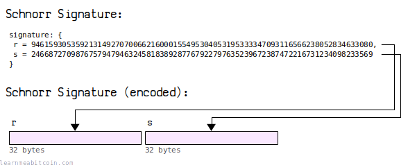](https://static.learnmeabitcoin.com/diagrams/png/schnorr-signature-encoding.png)

So a Schnorr signature is always **64 bytes** in length.

#### Schnorr vs. ECDSA Signature Encoding

For [ECDSA](/technical/cryptography/elliptic-curve/ecdsa/) signatures, the equivalent `r` and `s` values are wrapped within [DER encoding](/technical/keys/signature/#der):

[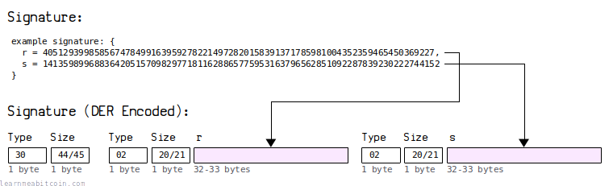](https://static.learnmeabitcoin.com/diagrams/png/keys-signature-der-encoding.png)

This DER encoding results in signatures that vary between **70-72 bytes** in length.

Using DER encoding for signatures was always inefficient because the `r` and `s` values are always the same size, so the additional *type* and *size* fields used in DER were an unnecessary overhead. So that's why we've done away with it for Schnorr signatures.

As a result, this reduction of at least 6 bytes per signature will save a significant amount of space in the blockchain over time.

Satoshi likely used DER encoding because it was the standard method for encoding signatures in the [OpenSSL](https://www.openssl.org/) library they were using at the time. The fact that it was inefficient was probably an oversight.

## Benefits

What are the benefits of Schnorr signatures?

There are a number of benefits to using Schnorr signatures compared to [ECDSA](/technical/cryptography/elliptic-curve/ecdsa/):

1. [Simplicity](#simplicity)
2. [Efficiency](#efficiency)
3. [Security](#security)
4. [Linearity](#linearity)
5. [Non-malleability](#non-malleability)

### 1. Simplicity

The Schnorr signature scheme is mathematically simpler than ECDSA.

This is the equation for creating a Schnorr signature:

[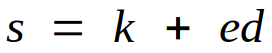](https://static.learnmeabitcoin.com/diagrams/png/schnorr-equation-sign.png)

This is the equation for creating an ECDSA signature:

[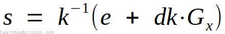](https://static.learnmeabitcoin.com/diagrams/png/ecdsa-equation-sign.png)

From a **mathematical** point of view, Schnorr signatures are more *logical* and more *elegant*.

From a **practical** point of view, they're also [provably secure](#security) and [more efficient](#efficiency). Better still, the Schnorr signature equation is [linear](#linearity), which means you can *add signatures together* (which you cannot do with ECDSA).

### 2. Efficiency

The equation for creating a Schnorr signature uses arithmetic *addition* and *multiplication* only:

[](https://static.learnmeabitcoin.com/diagrams/png/schnorr-equation-sign.png)

On the other hand, the equation for creating a signature in ECDSA includes [elliptic curve multiplication](/technical/cryptography/elliptic-curve/#multiply) and [modular inverse](/technical/cryptography/elliptic-curve/#modular-inverse):

[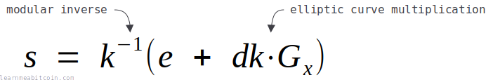](https://static.learnmeabitcoin.com/diagrams/png/ecdsa-equation-sign-annotated.png)

So Schnorr signatures are mathematically more efficient, and are therefore faster to calculate.

Of course, neither the elliptic curve multiplication nor modular inverse operations used in ECDSA are exactly *slow* on a modern computer. But not having to perform these operations when creating a Schnorr signature provides an efficiency gain nonetheless.

Another efficiency benefit of Schnorr Signatures is that you can verify multiple signatures at the same time using [batch verification](#batch-verify). Whereas you can only verify signatures individually with ECDSA.

### 3. Security

The simplicity of the Schnorr signature equation also means that it's **provably secure**.

[](https://static.learnmeabitcoin.com/diagrams/png/schnorr-equation-sign.png)

In other words, there is a [mathematical proof](https://crypto.stackexchange.com/questions/48616/prove-the-security-of-schnorrs-signature-scheme) that shows that Schnorr signatures cannot be broken unless you can solve the [discrete logarithm problem](#discreet-logarithm-problem).

In contrast, the complexity of the equation for creating signatures in ECDSA means that there is no formal proof that it's secure. This is due to the inclusion of the elliptic curve multiplication part, which makes forming a proof difficult:

[](https://static.learnmeabitcoin.com/diagrams/png/ecdsa-equation-sign-annotated.png)

There is a strong *assumption* that ECDSA is secure, but there is no actual proof. So having an actual proof of security is another win for Schnorr signatures.

#### Discrete Logarithm Problem

The discrete logarithm problem looks like this:

Given the numbers `a` and `b`, and a prime number `p`, find the value for `k`.

```
ak mod p = b
```

Here's a simple example:

```
3k mod 17 = 6
```

The only way to find out that `k` is `15` is to run through all of the possible values for `k` until you find a number that works. There is no mathematical shortcut to finding out what `k` is, and the only way to find the answer is through brute-force:

```
31 mod 17 = 3
32 mod 17 = 9
33 mod 17 = 10
34 mod 17 = 13
35 mod 17 = 5
36 mod 17 = 15
37 mod 17 = 11
38 mod 17 = 16
39 mod 17 = 14
310 mod 17 = 8
311 mod 17 = 7
312 mod 17 = 4
313 mod 17 = 12
314 mod 17 = 2
315 mod 17 = 6    <- found the answer
```

It's not difficult to find the answer when working with small numbers, but when you're working with extremely large numbers (as we do in [cryptography](/technical/cryptography/)), finding a value for `k` becomes impossible.

For example, see if you can find out what `k` is this time:

```
71916331368884415102528573409726749875552388602224548694948731024252851890102k mod 115792089237316195423570985008687907853269984665640564039457584007908834671663 = 11790564026517817731571347968670053249854067159256829888660539131158964346271
```

I know the answer (because I created the equation), but you never will. And that's the security Schnorr signatures are built upon.

Answer

The answer is:

```
k = 93350855816723809765951314891371850338090431368773987746149549196975035370474
```

But as I say, you would never have been able to figure that out unless I told you (or you've got [a few billion years](/beginners/security/#12-vs-24-word-seed) to brute-force your way to the answer).

### 4. Linearity

Schnorr signatures are *linear*, whereas ESCDSA signatures are not:

[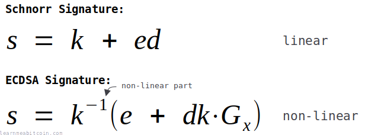](https://static.learnmeabitcoin.com/diagrams/png/schnorr-equation-linearity.png)

This means you can **add Schnorr signatures** together, which is something you cannot do with ECDSA signatures.

For example, you can add public keys together in both Schnorr and ECDSA:

[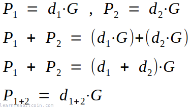](https://static.learnmeabitcoin.com/diagrams/png/schnorr-equation-public-key-addition.png)

But you can only add signatures together in Schnorr (due to the fact that they're *linear*):

[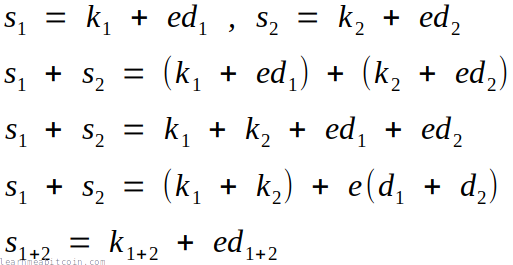](https://static.learnmeabitcoin.com/diagrams/png/schnorr-equation-signature-addition.png)

This ability to add Schnorr signatures together allows you to do useful things like [batch verification](#batch-verify), and construct efficient [multisignature](#multisignature) locking scripts.

#### Basic Multisignature Example

The fact that you can add Schnorr signatures together means that you can produce a single signature that is valid for the **sum of multiple public keys**.

For example, in the legacy [P2MS](/technical/script/p2ms/) locking script (which uses ECDSA), you have to provide each individual public key in the locking script. And to unlock it, you need to provide a signature for each of those public keys.

[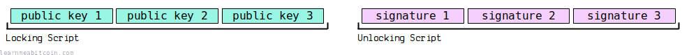](https://static.learnmeabitcoin.com/diagrams/png/schnorr-multisignature-basic.png)

But with Schnorr signatures, you can add all of the public keys together to create a "public key sum" and put that in the locking script instead. To unlock it, you can then create a signature for each of those public keys, then add them together and put a single "signature sum" in the unlocking script:

[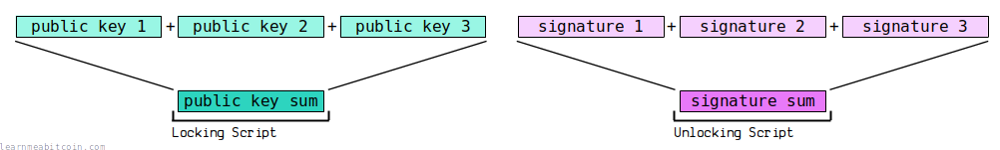](https://static.learnmeabitcoin.com/diagrams/png/schnorr-multisignature-sum.png)

This provides two major benefits.

1. **Space** — You now only need to provide a single public key (32 bytes) and a single signature (64 bytes) instead of multiple of each.
2. **Speed** — You now only need to perform a single signature verification instead of multiple.

This is a simple example used to illustrate how multisignature scripts can work using Schnorr signatures. However, this basic design is vulnerable to a "key-cancellation" attack, so it requires some additional adjustments to make it completely secure for use in Bitcoin transactions (see [Musig](https://bitcoinops.org/en/topics/musig/)). However, the underlying mathematics works in the same way.

### 5. Non-malleability

Schnorr signatures are **non-malleable**, whereas ECDSA signatures are malleable.

* **Malleable** — You can make an adjustment to a signature and it will still be valid.
* **Non-malleable** — You cannot make any changes to a signature without making it invalid.

So non-malleability is preferable.

Signature malleability has been a bit of an annoyance in Bitcoin's history, as it meant that [TXID](/technical/transaction/input/txid/)s could be adjusted after you had sent a [transaction](/technical/transaction/) into the network. For example, a miner could take your transaction, negate the `s` value in one of the signatures, and the TXID would end up being different.

This "transaction malleability" wasn't a huge problem, as the transaction would still get [mined](/technical/mining/) and the coins would be sent to the same place. It just meant that TXIDs were not 100% reliable, so you couldn't build any applications on top of bitcoin that depended on a transaction's TXID remaining the same after you sent it into the network.

Transaction malleability in Bitcoin was largely "patched" through [BIP 62](https://github.com/bitcoin/bips/blob/master/bip-0062.mediawiki) (using the low s-value only) and [Segwit](/technical/upgrades/segregated-witness/) (signatures no longer influence the TXID), but the underlying malleability still exists in ECDSA.

If Schnorr signatures had been used in Bitcoin from the start, transaction malleability would never have been a problem.

#### ECDSA vs Schnorr Malleability Example

In ECDSA you can use the *additive inverse* of the signature's `s` value (`n - s`) and the signature will still be valid:

```
ECDSA Signature Malleability Example (works):

# n is the number of points on the elliptic curve (Secp256k1)
n = 115792089237316195423570985008687907852837564279074904382605163141518161494337

message = ef5a8f37fccf71096afd9a11a2da2b446d8b33689f4d20e26c638f4a989531fe

signature
r = 66877274282749947925738202103737060826792639332019467521650159742093834512161
s = 52838996486501912417250039507174624042914096621748978414744411801275148621923

signature (malleated)
r = 66877274282749947925738202103737060826792639332019467521650159742093834512161
n - s = 62953092750814283006320945501513283809923467657325925967860751340243012872414

public key = 03f8598d649e50f593c7fa78fa279e77deb5551e0983a06fecacbe4642f8e2aa49
```

 ECDSA Verify

Random Example

Message Hash (z)

0x

`0 bytes`


Signature


R:

0d

S:

0d


Public Key (Q)

0x

`0 bytes`


Signature Verification


x:

0d

y:

0d


0 secs

However, if you try this with a Schnorr signature, the negated `s` value (`n - s`) will no longer be a valid signature:

```
Schnorr Signature Malleability Example (doesn't work):

# n is the number of points on the elliptic curve (Secp256k1)
n = 115792089237316195423570985008687907852837564279074904382605163141518161494337

public key = f8598d649e50f593c7fa78fa279e77deb5551e0983a06fecacbe4642f8e2aa49
message = ef5a8f37fccf71096afd9a11a2da2b446d8b33689f4d20e26c638f4a989531fe

signature:
r = 114044020606335199196415233777177936773828372395311453975809869274310626581346
s = 68385771140937257490418462830158146547018738395060108953065794598947526976254
sig = fc22a0d2d248490485a4d47bf85de155477068ad3fc8ba25e44e306c9ca91b629730f98d5acb8b510cdf78c3a710ddfd79e7445f3e1b6f8031371d2ab442a2fe

signature (malleated):
r = 114044020606335199196415233777177936773828372395311453975809869274310626581346
n - s = 47406318096378937933152522178529761305818825884014795429539368542570634518083
sig = fc22a0d2d248490485a4d47bf85de155477068ad3fc8ba25e44e306c9ca91b6268cf0672a53474aef320873c58ef220140c79887712d30bb8e9b41621bf39e43
```

 Schnorr Verify

Random Example

Public Key (P[x])

0x


Random

`0 bytes`

Message (m)

0x


Random

`0 bytes`

Signature (r, s)

0x

`0 bytes`


---


Details


Public Key (P)


x:

0d

y:

0d


Signature


r:

0d

s:

0d


Point 1 = sG


x:

0d

y:

0d


Challenge (e) = int(hashBIP0340/challenge(r || P[x] || m)) % n

0d

(n - e)

0d


Point 2 = (n-e)P


x:

0d

y:

0d


R = sG + (n-e)P


x:

0d

y:

0d


Verify (r = R[x])


r:   

0d

R[x]:

0d


0 secs

## Basics

How do Schnorr signatures work?

I suppose it would be a good idea to explain **how Schnorr signatures work**, and where these *signing* and *verifying* equations come from:

[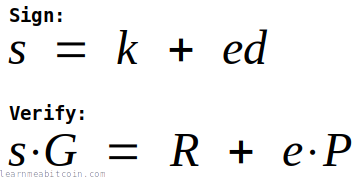](https://static.learnmeabitcoin.com/diagrams/png/schnorr-basics-equations.png)

I'll start with the basics and work up.

### 1. Keys

[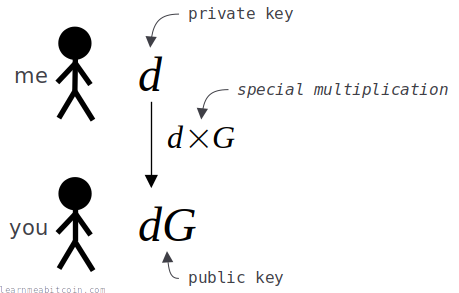](https://static.learnmeabitcoin.com/diagrams/png/schnorr-basics-keys.png)

First of all, to be able to create a digital signature I need to generate a pair of keys:

* **Private Key** (`d`) — A randomly generated number that I keep secret.
* **Public Key** (`dG`) — My private key (`d`) multiplied by another number (`G`).

We've both agreed on the number `G` beforehand. So `d` is secret, but `G` is not.

Now, even though I have "multiplied" my private key (`d`) by the number `G`, let's assume that it's not actually possible to "divide" the public key (`dG`) by `G` to get back to the private key (`d`). I know it's possible with basic mathematics, but let's say we're using a *special* type of multiplication that works in the same way as normal multiplication, but it doesn't have a reverse "divide" operation.

And trust me, this special "multiply" operation does actually exist in cryptography (I'll cover this in a moment).

Anyway, because I've used this special "multiply" operation, I can actually give you my public key (`dG`), and you won't be able to figure out what my private key (`d`) is.

This set of keys (and the special "multiply" operation) is the starting point for creating a digital signature.

#### Goal

My goal is to prove to you that I have the private key (`d`) used to create the public key (`dG`), without having to reveal the actual private key.

This proof is going to be called my **digital signature** (`s`).

### 2. Nonce

[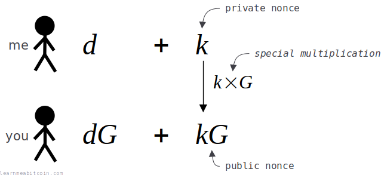](https://static.learnmeabitcoin.com/diagrams/png/schnorr-basics-nonce.png)

Before creating a digital signature, I need to generate a one-time random number called a **nonce** (`k`).

This nonce is used to help me *hide* my private key, as I add it to my private key when creating my signature.

Anyway, to be able to verify the signature you will need to have some information about this nonce (`k`) too, but I don't want to actually reveal it to you directly. So I multiply my private nonce (`k`) by the number `G` to create a **public nonce** (`kG`).

I send you this public nonce (`kG`), and because I've used the same special "multiply" function as before, you can't work backwards from it to find out what my private nonce (`k`) is.

**I need to use a *different* nonce for each signature I create.** If I use the same private nonce (`k`) more than once it will be possible for you to work out my private key (`d`).

### 3. Challenge

[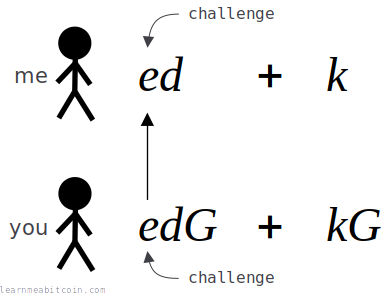](https://static.learnmeabitcoin.com/diagrams/png/schnorr-basics-challenge.png)

Now that I've sent you this public nonce (`kG`), I need you to come up with a **challenge** (`e`) and send it to me.

This challenge (`e`) is a random number that *you* generate, and it's going to prevent me from fabricating a signature that makes it look like I know the private key (`d`) even if I don't.

I don't know what this challenge is going to be, and seeing as I've already committed myself to using the private nonce (`k`) by sending you the public nonce (`kG`), it's not going to be possible for me to adjust my private nonce (`k`) value to allow me to produce a valid signature even if I don't know the private key (`d`) for the public key (`dG`).

In short, the challenge is used to make sure that I can't cheat.

### 4. Signature

[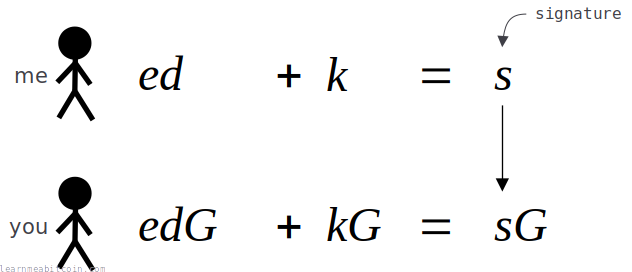](https://static.learnmeabitcoin.com/diagrams/png/schnorr-basics-signature.png)

I create my **digital signature** (`s`) by multiplying my private key (`d`) by the challenge (`e`), and then add the private nonce (`k`) to it.

I will then send you my digital signature (`s`).

You then run the **same equation**. The only difference is you're performing a *scaled up* version of the equation, where all of the numbers I'm using have been scaled up by the same number `G`.

And if both sides of your equation are equal, you know that the digital signature (`s`) I sent you could only have been created by the person who knows the private key (`d`). So this proves that I know the private key (`d`) for the public key (`dG`).

Anyone who doesn't know the private key (`d`) for the public key (`dG`) would not have been able to calculate the digital signature (`s`) that will satisfy your equation.

So these equations are the heart of the Schnorr signature scheme:

[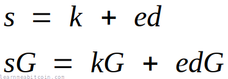](https://static.learnmeabitcoin.com/diagrams/png/schnorr-basics-signature-equations.png)

These are the same as the equations in the diagram above, just rearranged.

### 5. Simple example

This has all just been a bunch of equations using letters so far, so lets use some *actual numbers* to prove that these equations work.

[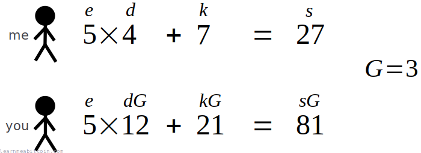](https://static.learnmeabitcoin.com/diagrams/png/schnorr-basics-example.png)

This example just uses **small numbers** and **simple multiplication**.

Of course, these numbers are too small for this system to be secure, and normal multiplication isn't a good choice because you can just use division to work out the original private key.

However, in cryptography, we use very large numbers and a special type of "multiplication" operation that doesn't actually have an inverse "division" operation (I promise I'll get to this in a moment).

But at least you can see that these equations work.

### 6. Non-interactive

The downside to the current setup is that it's *interactive*.

In other words, you need to send me the challenge (`e`) number *after* I've sent you the public nonce (`kG`), otherwise I would be able to forge the signature.

It would be better if this setup was **non-interactive**, where I could just generate a signature (`s`) without us having to exchange the public nonce (`kG`) and challenge (`e`) first.

So what if *I* was able to create the challenge (`e`) number instead?

To do this, I would need to be able to *commit* to using my private nonce (`k`) in some way, whilst also being able to create an unpredictable number for the challenge (`e`) on my side without being able to change my mind about the private nonce (`k`) afterwards.

The solution is to use a [hash function](/technical/cryptography/hash-function/), and use it to hash the value of the public nonce (`kG`) to create the challenge (`e`).

[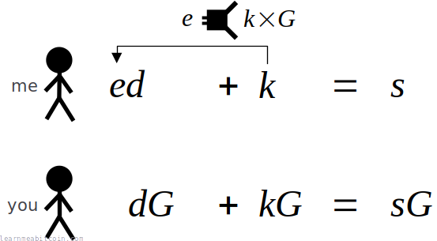](https://static.learnmeabitcoin.com/diagrams/png/schnorr-basics-non-interactive-me.png)

A hash function is perfect because it produces an unpredictable result for whatever data you feed in to it. Furthermore, by hashing the public nonce (`kG`), it means I'm committed to using the private nonce (`k`), because I won't be able to change that after the fact without it altering the challenge (`e`).

So now, instead of us having to perform an interactive exchange of `kG` and `e` beforehand, I can now calculate a digital signature (`s`), and send you that along with the public nonce (`kG`) in one go.

You can then use that public nonce (`kG`) to calculate the same unpredictable challenge (`e`) that I generated on my side, and use this to verify the digital signature (`s`) using the same equation as before:

[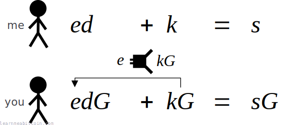](https://static.learnmeabitcoin.com/diagrams/png/schnorr-basics-non-interactive-you.png)

As a result, using a hash function to create the challenge (`e`) means we have converted this digital signature system from an interactive one to a **non-interactive** one. This is a very handy upgrade to our system.

Now every time I want to create a digital signature, I can send one to you along with the public nonce (`kG`) without you needing to send me a challenge (`e`) first.

So thanks to the introduction of the hash function to create the challenge (`e`), the signing and verifying equations now look like this:

[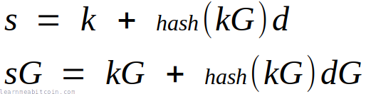](https://static.learnmeabitcoin.com/diagrams/png/schnorr-basics-non-interactive-equations.png)

This technique of using a hash function to create the challenge non-interactively is known as a [Fiat-Shamir transformation](https://www.zkdocs.com/docs/zkdocs/protocol-primitives/fiat-shamir/).

### 7. Message signing

[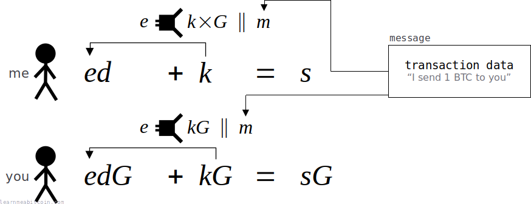](https://static.learnmeabitcoin.com/diagrams/png/schnorr-basics-message.png)

Up until now I've just been using a digital signature (`s`) to prove that I am the *owner* of a public key (`dG`).

This is cool, but it would be even more useful if I could *sign a message*, so if I sent you a signature (`s`) and a message (`m`), you can verify that I said or agree with that message.

This is like signing things in real life. Your signature on its own is unique enough to prove that *you* made it, but we usually put signatures on things like contracts to show that we have agreed to them. The message (`m`) here is the "contract" we want to put our signature (`s`) on.

In Bitcoin for example, this message is usually [transaction data](/technical/transaction/). By signing the transaction data, we can prove that we are the owner of the public key that some bitcoins have been locked to (so they can be unlocked), whilst also agreeing to the destination that we're sending the coins to. Nobody can then change this transaction data (e.g. try to send the coins somewhere else) without invalidating the signature.

Anyway, to sign a message, I just need to include this message (`m`) as part of my signature (`s`) somehow. This is done by **including the message (`m`) as part of the hash** when I'm creating the challenge (`e`).

By including the message (`m`) inside this hash, I am *committing* to this message and making it part of my final signature (`s`). So if anyone tried to change the message to say I said something different, the signature would not verify for that message.

Anyway, now that we've included the **message** as part of our signature, the signing and verifying equations look like this:

[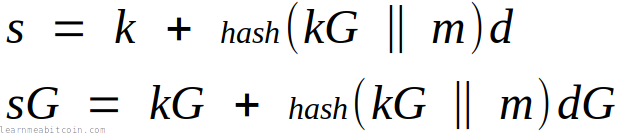](https://static.learnmeabitcoin.com/diagrams/png/schnorr-basics-message-equations.png)

**These are the fundamental equations for a non-interactive Schnorr signature scheme.**  You'll see these equations (in this form or similar) every time you look at any mathematical explanation of "Schnorr signatures".

### 8. Elliptic curves

Finally, we get to the special "multiplication" part.

Up until now we've been using simple multiplication inside of our equations. But this won't work in the real world, because multiplication can be *reversed* using division.

What we need is a special type of "multiplication" that has the same properties as normal multiplication (so our equations still work), but doesn't have a reverse "division" operation.

This is where [elliptic curves](/technical/cryptography/elliptic-curve/) come in.

There is actually a [multiplication operation](/technical/cryptography/elliptic-curve/#multiply) that works on *points* of an elliptic curve: you can take one *point* on the curve (e.g. `G`), multiply it by a *number* (e.g. `d`), and it will produce a completely new point on the same curve (e.g `dG`). But interestingly, if you give someone this new point (`dG`), there is no operation that allows you to "divide" by `G` to work out what `d` was.

This is perfect for our system, and it's the reason why the mathematics of Schnorr signatures is performed over an **elliptic curve**.

Furthermore, you can [add](/technical/cryptography/elliptic-curve/#add) two points on an elliptic curve too, which is important because we also need to add two points during verification (`kG` + `edG`)

So **the equations work in the same way as before**, but the *multiply* and *addition* operations now take place using points on an *elliptic curve* rather than using simple arithmetic multiplication and addition that we've been using up to this point.

To illustrate the slightly different type of multiplication operation we're now using in our equations, I'll use the dot "⋅" operator to signify elliptic curve multiplication:

[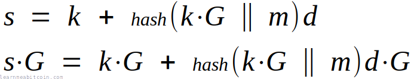](https://static.learnmeabitcoin.com/diagrams/png/schnorr-basics-elliptic-curve-equations.png)

* A **lowercase** letter (e.g. `k`, `d`, `e`, `s`) indicates a **scalar** (a number).
* An **uppercase** letter (e.g. `G`) indicates a **point**.

If you multiply a **point by a *scalar***, you get a new **point**.

There are other options for being able to multiply without division, but elliptic curves are the most popular in cryptography due to their security and speed.

### 9. Summary

The final Schnorr signing and verifying equations look like this:

[](https://static.learnmeabitcoin.com/diagrams/png/schnorr-basics-elliptic-curve-equations.png)

But we can also simplify it:

* The challenge `hash(kg || m)` is called `e`.
* The public nonce point (`kG`) is called `R`.
* The public key point (`dG`) is called `P`.

So if we **substitute** these terms in to our equations we get:

[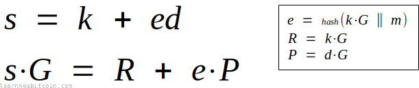](https://static.learnmeabitcoin.com/diagrams/png/schnorr-basics-summary-equations-substitute.png)

And that's where these signing and verifying at the top of this page come from.

Lastly, we can **rearrange** the verification equation to get:

[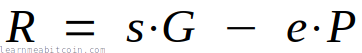](https://static.learnmeabitcoin.com/diagrams/png/schnorr-basics-summary-equations-verification-rearrange.png)

And that's the equation used during [verification](#verify) for Schnorr signatures in Bitcoin.

## History

Why weren't Schnorr signatures used in Bitcoin from the start?

The Schnorr signature scheme was under patent when Bitcoin was first being developed.

Satoshi used the OpenSSL library for the cryptography used in Bitcoin, and Schnorr signatures were not available in this library at the time, so they used [ECDSA](/technical/cryptography/elliptic-curve/ecdsa/) instead. So even though Schnorr signatures are simpler and more useful than ECDSA, they were not a viable option at the time Bitcoin was created.

Here's a brief history:

* **1989** — The mathematics for Schnorr signatures is published by Claus Schnorr in the paper [Efficient identification and signatures for smart cards](https://link.springer.com/content/pdf/10.1007/0-387-34805-0_22.pdf).
* **1990** — Clause Schnorr applies for a [patent of the Schnorr signature scheme](https://patents.google.com/patent/US4995082A/en).
* **1991** — Patent for Schnorr signature scheme is granted.
* **1992** — [Dr. Scott Vanstone proposes ECDSA](https://www.cs.miami.edu/home/burt/learning/Csc609.142/ecdsa-cert.pdf) as an alternative for creating digital signatures.
* **1998** — ECDSA is accepted as an ISO standard.
* **1999** — ECDSA is accepted as an ANSI standard.
* **2000** — ECDSA is accepted as an IEEE and NIST standard.
* **2007** — Satoshi Nakamoto starts work on Bitcoin, and uses ECDSA for signatures.
* **2009** — First version of Bitcoin is released.
* **2010** — Schnorr signature scheme patent expires.
* **2015** — Research starts into including Schnorr signatures in Bitcoin.
* **2021** — Schnorr signatures are introduced into Bitcoin as part of the Taproot upgrade.

## Summary

**Schnorr signatures are an upgrade from ECDSA** for creating and verifying digital signatures in Bitcoin.

The only reason we didn't use Schnorr signatures from the start is because they were patented until 2010, so [ECDSA](/technical/cryptography/elliptic-curve/ecdsa/) was the next best option (which does the job, just not as elegantly). But since the patent has expired, we're free to use Schnorr signatures and take advantage of all the benefits that come with them.

In slightly stronger terms:

> The real question should be why are people still using ECDSA? It is a malformed adaptation of Schnorr which should become a mistake of the past.

CurveEnthusiast, [crypto.stackexchange.com](https://crypto.stackexchange.com/questions/48528/security-of-schnorr-signature-versus-dsa-and-dlp#answer-48592)

In other words, Schnorr signatures are **how digital signatures are meant to be**.

The implementation of Schnorr signatures in Bitcoin appears more complex than ECDSA, but it's not actually as difficult as it looks. The underlying *mathematics* is simpler; it's just that there are some additional [Bitcoin-specific design implementations](#design) included on top. So don't let the complex diagrams put you off. If you take it one step at a time, it shouldn't be too hard to implement.

Plus, if you're interested in the *mathematics* of how digital signatures work, it makes more sense to try and understand the [basic Schnorr signature scheme](#basics) before moving on to ECDSA.

You don't need to know *how* Schnorr signatures work to be able to add them to your code, but it's cool to see how they do.

## Resources

* [BIP 340: Schnorr Signatures for secp256k1](https://github.com/bitcoin/bips/blob/master/bip-0340.mediawiki)

* [Cryptoshorts e02: Schnorr signature](https://www.youtube.com/watch?v=r9hJiDrtukI) - A simple and concise video explaining the basics of how Schnorr signatures work.
* [How to Design Schnorr Signatures](https://www.youtube.com/watch?v=wjACBRJDfxc) - Excellent explanation of the design of Schnorr signatures by Adam Gibson (Waxwing).
* [Taproot, and Schnorr, and SIGHASH\_NOINPUT, oh my!](https://www.youtube.com/watch?v=YSUVRj8iznU) - Summary of the benefits of Schnorr signatures and Taproot by Pieter Wuille.
* [Introduction to Schnorr Signatures with Elichai Turkel](https://www.youtube.com/watch?v=XKatSGCZ-gE) - Technical presentation on Schnorr signatures and their uses in Bitcoin.