[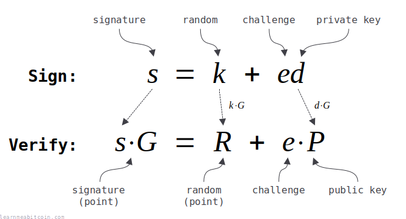](../../../images/diagrams_png_schnorr-equations-summary.png)

在创建和验证[数字签名](../../keys/signature.md)方面，Schnorr 签名优于 [ECDSA](ecdsa.md)。

它们比 ECDSA 更简单、更高效且更安全。

此外，更简单的数学运算还允许您将签名*相加*，以及同时[验证多个签名](#batch-verify)。这是 ECDSA 所不具备的两个功能。

无论如何，作为 [Taproot](../../upgrades/taproot.md) 升级的一部分，Schnorr 签名于 2021 年被引入比特币中，目前用于解锁 [P2TR](../../script/p2tr.md) 锁定脚本。

在本页中，我将向您展示[如何实现](#implementation)比特币中的 Schnorr 签名，并简要解释[它们的工作原理](#basics)。

## Schnorr 签名（完整代码）

```
# -------------------------
# Elliptic Curve Parameters
# -------------------------
# these are the parameters for secp256k1, which is the same curve used in ECDSA
# note: setting these as $global variables so they're accessible from with the functions below (without having to pass them as arguments)

# y² = x³ + ax + b
$a = 0
$b = 7

# prime field
$p = 115792089237316195423570985008687907853269984665640564039457584007908834671663 #=> 0xFFFFFFFFFFFFFFFFFFFFFFFFFFFFFFFFFFFFFFFFFFFFFFFFFFFFFFFEFFFFFC2F

# number of points on the curve we can hit ("order")
$n = 115792089237316195423570985008687907852837564279074904382605163141518161494337 #=> 0xFFFFFFFFFFFFFFFFFFFFFFFFFFFFFFFEBAAEDCE6AF48A03BBFD25E8CD0364141

# generator point (the starting point on the curve used for all calculations)
$G = {
  x: 55066263022277343669578718895168534326250603453777594175500187360389116729240, #=> 0x79BE667EF9DCBBAC55A06295CE870B07029BFCDB2DCE28D959F2815B16F81798
  y: 32670510020758816978083085130507043184471273380659243275938904335757337482424, #=> 0x483ADA7726A3C4655DA4FBFC0E1108A8FD17B448A68554199C47D08FFB10D4B8
}

# --------------------------
# Elliptic Curve Mathematics
# --------------------------

# Modular Inverse: Ruby doesn't have a built-in modinv function
def inverse(a, m = $p)
  m_orig = m         # store original modulus
  a = a % m if a < 0 # make sure a is positive
  y_prev = 0
  y = 1
  while a > 1
    q = m / a

    y_before = y # store current value of y
    y = y_prev - q * y # calculate new value of y
    y_prev = y_before # set previous y value to the old y value

    a_before = a # store current value of a
    a = m % a # calculate new value of a
    m = a_before # set m to the old a value
  end
  return y % m_orig
end

# Double: add a point to itself
def double(point)
  # check for point at infinity (greatest common divisor between 2y and p isn't 1)
  if (((2 * point[:y]) % $p).gcd($p) != 1) # taken from BitcoinECDSA.php
    raise "Point at infinity."
  end

  # slope = (3x₁² + a) / 2y₁
  slope = ((3 * point[:x] ** 2 + $a) * inverse((2 * point[:y]), $p)) % $p # using inverse to help with division

  # x = slope² - 2x₁
  x = (slope ** 2 - (2 * point[:x])) % $p

  # y = slope * (x₁ - x) - y₁
  y = (slope * (point[:x] - x) - point[:y]) % $p

  # Return the new point¢ªº
  return { x: x, y: y }
end

# Add: add two points together
def add(point1, point2)
  # double if both points are the same
  if point1 == point2
    return double(point1)
  end

  # check for point at infinity (greatest common divisor between x1-x2 and p isn't 1)
  if ((point1[:x] - point2[:x]).gcd($p) != 1) # taken from BitcoinECDSA.php
    raise "Point at infinity."
  end

  # slope = (y₁ - y₂) / (x₁ - x₂)
  slope = ((point1[:y] - point2[:y]) * inverse(point1[:x] - point2[:x], $p)) % $p

  # x = slope² - x₁ - x₂
  x = (slope ** 2 - point1[:x] - point2[:x]) % $p

  # y = slope * (x₁ - x) - y₁
  y = ((slope * (point1[:x] - x)) - point1[:y]) % $p

  # Return the new point
  return { x: x, y: y }
end

# Multiply: use double and add operations to quickly multiply a point by an integer value (i.e. a private key)
def multiply(k, point = $G)
  # create a copy the initial starting point (for use in addition later on)
  current = point

  # convert integer to binary representation
  binary = k.to_s(2)

  # double and add algorithm for fast multiplication
  binary.split("").drop(1).each do |char| # from left to right, ignoring first binary character
    # 0 = double
    current = double(current)

    # 1 = double and add
    current = add(current, point) if char == "1"
  end

  # return the final point
  current
end

# ---------
# Functions
# ---------
# helper functions

# convert hexadecimal string of bytes to integer
def int(bytes)
  return bytes.to_i(16)
end

# convert integer to hexadecimal string of bytes
def bytes(int)
  return int.to_s(16).rjust(64, "0") # convert to hex and pad with zeros to make it 32 bytes (64 characters)
end

# -----------
# Tagged Hash
# -----------
require "digest" # library for SHA256 hash function

# hash some data using SHA256 with a tag prefix
def tagged_hash(tag, message)

  # create a hash of the tag first
  tag_hash = Digest::SHA256.hexdigest(tag) # hash the string directly

  # prefix the message with the tag hash (the tag_hash is prefixed twice so that the prefix is 64 bytes in total)
  preimage = [tag_hash + tag_hash + message].pack("H*") # also convert to byte sequence before hashing

  # SHA256(tag_hash || tag_hash || message)
  result = Digest::SHA256.hexdigest(preimage);

  return result
end

# ----
# Keys
# ----
# Example private key (in hexadecimal)
private_key = "b7e151628aed2a6abf7158809cf4f3c762e7160f38b4da56a784d9045190cfef"

# Public key is the generator point multiplied by the private key
point = multiply(int(private_key))

# the public key is just the x value of this point
public_key = bytes(point[:x]) # convert x coordinate to hex bytes

#puts public_key #=> dff1d77f2a671c5f36183726db2341be58feae1da2deced843240f7b502ba659

# ----
# Sign
# ----
puts "Signing:"

private_key = "b7e151628aed2a6abf7158809cf4f3c762e7160f38b4da56a784d9045190cfef"
aux_rand = "0000000000000000000000000000000000000000000000000000000000000001" # auxiliary bytes for contributing to randomness of the nonce (security does not rely on this being random)
message = "243f6a8885a308d313198a2e03707344a4093822299f31d0082efa98ec4e6c89"

puts " private key: #{private_key}"
puts " aux rand:    #{aux_rand}"
puts " message:     #{message}"

# convert private key to an integer
d0 = int(private_key)

# make sure private key is in valid range (greater than 0 and less than the number of points on the curve)
unless (1..$n-1).include?(d0)
  raise "private key must be in the range 1..n-1"
end

# calculate the public key point from the private key
public_key_point = multiply(d0) # multiply() checks for point at infinity

# negate the private key if the public key it creates doesn't have an even y value, else keep the private key the same
# note: due to the way the elliptic curve works, negate the private key will produce a public key with the same x coordinate, but the opposite y value
if public_key_point[:y] % 2 != 0
  d = $n - d0
else
  d = d0
end

# create a tagged hash of the auxiliary bytes
aux_rand_hash = tagged_hash("BIP0340/aux", aux_rand)

# first step toward creating the nonce is to XOR the private key with the hash of the auxiliary bytes
t = d ^ int(aux_rand_hash)

# create the nonce by hashing t (from the previous step) along with the public_key and message
k0 = int(tagged_hash("BIP0340/nonce", bytes(t) + bytes(public_key_point[:x]) + message)) % $n # public key is included in hash for "key-prefixed" schnorr signatures

# check that the nonce isn't zero
if k0 == 0
  raise "nonce must not be zero (this is almost impossible, but checking anyway)"
end

# use this nonce to get a point on the curve
random_point = multiply(k0) # multiply() checks for point at infinity

# negate the nonce used to create the random point if the public key it creates doesn't have an even y value
if random_point[:y] % 2 != 0
  k = $n - k0
  # note: due to the way the elliptic curve works, the inverse private key will produce an even y value
else
  k = k0
end

# create the challenge e value by hashing the random point with the public key and message
e = int(tagged_hash("BIP0340/challenge", bytes(random_point[:x]) + bytes(public_key_point[:x]) + message)) % $n

# r value is the x-coordinate of point R
r =  random_point[:x]

# s value: (k + e*d) mod n
s = (k + e * d) % $n # this is linear (whereas s in ECDSA is non-linear)

# signature is the r and s values converted to 32-byte hexadecimal string and concatenated
sig = bytes(r) + bytes(s)

# you should check the signature verifies before returning it
puts "              ↓"
puts " signature:   #{sig}" #=> 6896bd60eeae296db48a229ff71dfe071bde413e6d43f917dc8dcf8c78de33418906d11ac976abccb20b091292bff4ea897efcb639ea871cfa95f6de339e4b0a
puts

# ------
# Verify
# ------
puts "Verifying:"

public_key = "dff1d77f2a671c5f36183726db2341be58feae1da2deced843240f7b502ba659"
message = "243f6a8885a308d313198a2e03707344a4093822299f31d0082efa98ec4e6c89"
sig = "6896bd60eeae296db48a229ff71dfe071bde413e6d43f917dc8dcf8c78de33418906d11ac976abccb20b091292bff4ea897efcb639ea871cfa95f6de339e4b0a"

puts " public key:  #{public_key}"
puts " message:     #{message}"
puts " signature:   #{sig}"

# convert public key (x coordinate only) in to a point - lift_x() in BIP 340
x = int(public_key) # convert from x coordinate from hex to an integer
y_sq = (x**3 + 7) % $p # use the elliptic curve equation (y² = x³ + ax + b) to work out the value of y from x
y = y_sq.pow(($p+1)/4, $p) # secp256k1 is chosen in a special way so that the square root of y is y^((p+1)/4)

# check that x coordinate is less than the field size
if x >= $p
  raise "x value in public key is not a valid coordinate because it is not less than the elliptic curve field size"
end

# verify that the computed y value is the square root of y_sq (otherwise the public key was not a valid x coordinate on the curve)
if (y**2) % $p != y_sq
  raise "public key is not a valid x coordinate on the curve"
end

# if the calculated y value is odd, negate it to get the even y value instead (for this x-coordinate)
if y % 2 != 0
  y = $p - y
end

# public key point
public_key_point = {x: x, y: y}

# extract r value from the signature and convert to an integer
r = sig[0..63] # first 32 bytes (64 characters)

# extract s value from the signature and convert to an integer
s = sig[64..-1] # last 32 bytes (64 characters)

# check that r is less than the field size
if int(r) >= $p
  raise "r value in signature is not less than the elliptic curve field size"
end

# check that s is less than the number of points on the curve (order)
if int(s) >= $n
  raise "s value in signature is not less than the number of points on the elliptic curve"
end

# create the challenge e by hashing the random point with the public key and message (same as during signing)
e = tagged_hash("BIP0340/challenge", r + bytes(x) + message).to_i(16) % $n # converting the x coordinate integer to 32-byte hexadecimal string

# create a point on the curve by multiplying the generator point by s
point1 = multiply(int(s), $G)

# create another point on the curve by multiplying the public key point by e
point2 = multiply($n - e, public_key_point) # note: we use ($n - e) so that the point addition in following step is subtraction instead (i.e. point1 - point2)

# add these points to get calculate a third point (R)
point3 = add(point1, point2) # add() checks for point at infinity

# check R has even y value
if point3[:y] % 2 != 0
  raise "calculated R during signature verification has an odd y value (it should be even)"
end

# signature verification: check that the third point calculated matches the x coordinate of the random point (r) given in the signature
puts "              ↓"
puts " result:      success" if point3[:x] == int(r)
puts " result:      fail" if point3[:x] != int(r)
```

## 实现

如何创建 Schnorr 签名？

首先，Schnorr 签名使用**椭圆曲线密码学**。在实现 Schnorr 签名之前，没有必要非得去弄懂[椭圆曲线数学](../elliptic-curve.md#mathematics)，但搞懂它会有所帮助。

无论如何，Schnorr 签名使用与 [ECDSA](ecdsa.md) 相同的 *Secp256k1* 椭圆曲线：

Secp256k1 参数

```
# y² = x³ + ax + b
$a = 0
$b = 7

# prime field
$p = 115792089237316195423570985008687907853269984665640564039457584007908834671663 #=> 0xFFFFFFFFFFFFFFFFFFFFFFFFFFFFFFFFFFFFFFFFFFFFFFFFFFFFFFFEFFFFFC2F

# number of points on the curve we can hit ("order")
$n = 115792089237316195423570985008687907852837564279074904382605163141518161494337 #=> 0xFFFFFFFFFFFFFFFFFFFFFFFFFFFFFFFEBAAEDCE6AF48A03BBFD25E8CD0364141

# generator point (the starting point on the curve used for all calculations)
$G = {
  x: 55066263022277343669578718895168534326250603453777594175500187360389116729240, #=> 0x79BE667EF9DCBBAC55A06295CE870B07029BFCDB2DCE28D959F2815B16F81798
  y: 32670510020758816978083085130507043184471273380659243275938904335757337482424, #=> 0x483ADA7726A3C4655DA4FBFC0E1108A8FD17B448A68554199C47D08FFB10D4B8
}
```

此外，您还需要能够在椭圆曲线上**点乘**（与 [ECDSA](ecdsa.md) 相同）：

椭圆曲线数学

```
# Modular Inverse: Ruby doesn't have a built-in modinv function
def inverse(a, m = $p)
  m_orig = m         # store original modulus
  a = a % m if a < 0 # make sure a is positive
  y_prev = 0
  y = 1
  while a > 1
    q = m / a

    y_before = y # store current value of y
    y = y_prev - q * y # calculate new value of y
    y_prev = y_before # set previous y value to the old y value

    a_before = a # store current value of a
    a = m % a # calculate new value of a
    m = a_before # set m to the old a value
  end
  return y % m_orig
end

# Double: add a point to itself
def double(point)
  # check for point at infinity (greatest common divisor between 2y and p isn't 1)
  if (((2 * point[:y]) % $p).gcd($p) != 1) # taken from BitcoinECDSA.php
    raise "Point at infinity."
  end

  # slope = (3x₁² + a) / 2y₁
  slope = ((3 * point[:x] ** 2 + $a) * inverse((2 * point[:y]), $p)) % $p # using inverse to help with division

  # x = slope² - 2x₁
  x = (slope ** 2 - (2 * point[:x])) % $p

  # y = slope * (x₁ - x) - y₁
  y = (slope * (point[:x] - x) - point[:y]) % $p

  # Return the new point¢ªº
  return { x: x, y: y }
end

# Add: add two points together
def add(point1, point2)
  # double if both points are the same
  if point1 == point2
    return double(point1)
  end

  # check for point at infinity (greatest common divisor between x1-x2 and p isn't 1)
  if ((point1[:x] - point2[:x]).gcd($p) != 1) # taken from BitcoinECDSA.php
    raise "Point at infinity."
  end

  # slope = (y₁ - y₂) / (x₁ - x₂)
  slope = ((point1[:y] - point2[:y]) * inverse(point1[:x] - point2[:x], $p)) % $p

  # x = slope² - x₁ - x₂
  x = (slope ** 2 - point1[:x] - point2[:x]) % $p

  # y = slope * (x₁ - x) - y₁
  y = ((slope * (point1[:x] - x)) - point1[:y]) % $p

  # Return the new point
  return { x: x, y: y }
end

# Multiply: use double and add operations to quickly multiply a point by an integer value (i.e. a private key)
def multiply(k, point = $G)
  # create a copy the initial starting point (for use in addition later on)
  current = point

  # convert integer to binary representation
  binary = k.to_s(2)

  # double and add algorithm for fast multiplication
  binary.split("").drop(1).each do |char| # from left to right, ignoring first binary character
    # 0 = double
    current = double(current)

    # 1 = double and add
    current = add(current, point) if char == "1"
  end

  # return the final point
  current
end
```

### 密钥对

要创建和验证 Schnorr 签名，您首先需要生成**一对密钥**。

1. [私钥](#private-key)
2. [公钥](#public-key)

这些[私钥](../../keys/private-key.md)和[公钥](../../keys/public-key.md)与您已在比特币中生成的完全相同。

#### 1. 私钥 (Private Key)

私钥是一个随机生成的 256 位数字。

这通常表示为 32 字节的十六进制字符串：

```
6c8bedef612883700a7e66e2746eba4db006fd28bdd6db8f389a8845a0e3b59d
```


| Field | Value |
| --- | --- |
| Bits | `0 bits` |
| Binary | 0b `0 bits` |
| Decimal | 0d |
| Hexadecimal | 0x `0 bytes` |

**切勿使用由网站生成的私钥，或在网站中输入您的私钥。** 网站很容易保存私钥并用其盗取您的比特币。

这与您在比特币中生成的任何其他私钥都是相同的。

有效的私钥范围是 `1..n-1`，其中 n 是 Secp256k1 椭圆曲线上的点数（参见[参数](#secp256k1-parameters)）。因此私钥实际上略小于可能的最大 256 位数字。您不太可能会生成一个超出该范围的 256 位私钥，但应该总是检查一下。

#### 2. 公钥 (Public Key)

公钥是通过将椭圆曲线上的基点**点乘**私钥来创建的。

例如：

```
public key = {
  x: 94143704248521553317086831157498059579898345832673799690735511018320990355030,
  y: 44438543306112247703620323006762464482367802894269621488396118668492541437765,
}
```

 公钥 (Public Key)

| Field | Value |
| --- | --- |
| 私钥 (Private Key) | `0 bytes` |
| 公钥 (Public Key) 坐标 (Coordinates) x | 0d |
| 公钥 (Public Key) 坐标 (Coordinates) y | 0d |
| 奇偶性 (parity) | |
| 压缩方式 | 压缩格式 (以 02 或 03 开头) / 未压缩格式 (以 04 开头) / 仅含 x 轴 (无前缀) |
| 结果 | `0 bytes` |

**切勿在网站中输入您的私钥，或使用由网站生成的私钥。** 网站很容易保存私钥并用其盗取您的比特币。

这与您生成其他公钥的方式是相同的。

然而，在比特币中使用 Schnorr 签名时，**编码的公钥仅为 x 坐标**，表示为 32 字节的十六进制字符串：

```
d02372c4789c6a1d6cf6cf137cc708153a4dbf70ec3ecd0b578476c5a2b4be56
```

**比特币中 Schnorr 签名的公钥总是使用 *偶数 (even)* y 坐标**。因此，编码的公钥中不包含关于 y 坐标正负号的信息。

您可以将典型的[压缩公钥](../../keys/public-key.md#compressed)转换为用于 Schnorr 签名的公钥，只需删除第一个字节（该字节用于指示 y 坐标的极性）：

```
compressed public key = 03d02372c4789c6a1d6cf6cf137cc708153a4dbf70ec3ecd0b578476c5a2b4be56
schnorr public key    =   d02372c4789c6a1d6cf6cf137cc708153a4dbf70ec3ecd0b578476c5a2b4be56
```

#### 密钥对代码

此代码片段需要上述 [Secp256k1 参数](#secp256k1-parameters)和[椭圆曲线数学](#elliptic-curve-mathematics)代码。

```
# ---------
# Functions
# ---------
# helper functions

# convert hexadecimal string of bytes to integer
def int(bytes)
  return bytes.to_i(16)
end

# convert integer to hexadecimal string of bytes
def bytes(int)
  return int.to_s(16).rjust(64, "0") # convert to hex and pad with zeros to make it 32 bytes (64 characters)
end

# ----
# Keys
# ----
# Example private key (in hexadecimal)
private_key = "b7e151628aed2a6abf7158809cf4f3c762e7160f38b4da56a784d9045190cfef"

# Public key is the generator point multiplied by the private key
point = multiply(int(private_key))

# the public key is just the x value of this point
public_key = bytes(point[:x]) # convert x coordinate to hex bytes

#puts public_key #=> dff1d77f2a671c5f36183726db2341be58feae1da2deced843240f7b502ba659
```

### 签名 (Sign)

| Field | Value |
| --- | --- |
| 挑战 (Challenge) (e) | 0d |
| 点 2 (Point 2) = (n-e)P x/y | 0d / 0d |
| R = sG + (n-e)P x/y | 0d / 0d |
| 验证 (Verify) r | 0d |
| 验证 (Verify) R[x] | 0d |

[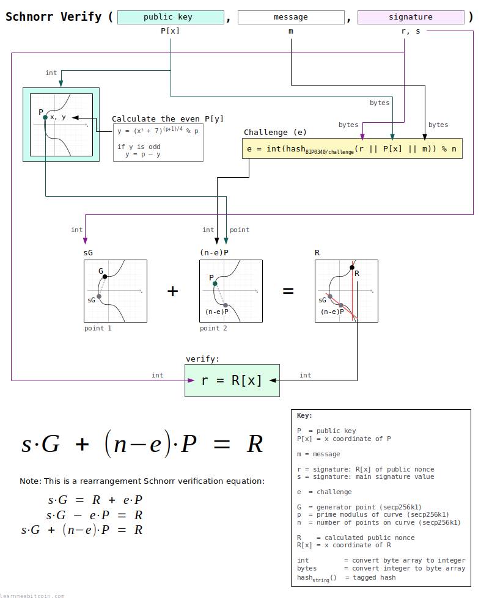](../../../images/diagrams_png_schnorr-verify.png)

#### 验证代码

此代码片段需要上述 [Secp256k1 参数](#secp256k1-parameters)和[椭圆曲线数学](#elliptic-curve-mathematics)代码。

```
# ---------
# Functions
# ---------
# helper functions

# convert hexadecimal string of bytes to integer
def int(bytes)
  return bytes.to_i(16)
end

# convert integer to hexadecimal string of bytes
def bytes(int)
  return int.to_s(16).rjust(64, "0") # convert to hex and pad with zeros to make it 32 bytes (64 characters)
end

# -----------
# Tagged Hash
# -----------
require "digest" # library for SHA256 hash function

# hash some data using SHA256 with a tag prefix
def tagged_hash(tag, message)

  # create a hash of the tag first
  tag_hash = Digest::SHA256.hexdigest(tag) # hash the string directly

  # prefix the message with the tag hash (the tag_hash is prefixed twice so that the prefix is 64 bytes in total)
  preimage = [tag_hash + tag_hash + message].pack("H*") # also convert to byte sequence before hashing

  # SHA256(tag_hash || tag_hash || message)
  result = Digest::SHA256.hexdigest(preimage);

  return result
end

# ------
# Verify
# ------
puts "Verifying:"

public_key = "dff1d77f2a671c5f36183726db2341be58feae1da2deced843240f7b502ba659"
message = "243f6a8885a308d313198a2e03707344a4093822299f31d0082efa98ec4e6c89"
sig = "6896bd60eeae296db48a229ff71dfe071bde413e6d43f917dc8dcf8c78de33418906d11ac976abccb20b091292bff4ea897efcb639ea871cfa95f6de339e4b0a"

puts " public key:  #{public_key}"
puts " message:     #{message}"
puts " signature:   #{sig}"

# convert public key (x coordinate only) in to a point - lift_x() in BIP 340
x = int(public_key) # convert from x coordinate from hex to an integer
y_sq = (x**3 + 7) % $p # use the elliptic curve equation (y² = x³ + ax + b) to work out the value of y from x
y = y_sq.pow(($p+1)/4, $p) # secp256k1 is chosen in a special way so that the square root of y is y^((p+1)/4)

# check that x coordinate is less than the field size
if x >= $p
  raise "x value in public key is not a valid coordinate because it is not less than the elliptic curve field size"
end

# verify that the computed y value is the square root of y_sq (otherwise the public key was not a valid x coordinate on the curve)
if (y**2) % $p != y_sq
  raise "public key is not a valid x coordinate on the curve"
end

# if the calculated y value is odd, negate it to get the even y value instead (for this x-coordinate)
if y % 2 != 0
  y = $p - y
end

# public key point
public_key_point = {x: x, y: y}

# extract r value from the signature and convert to an integer
r = sig[0..63] # first 32 bytes (64 characters)

# extract s value from the signature and convert to an integer
s = sig[64..-1] # last 32 bytes (64 characters)

# check that r is less than the field size
if int(r) >= $p
  raise "r value in signature is not less than the elliptic curve field size"
end

# check that s is less than the number of points on the curve (order)
if int(s) >= $n
  raise "s value in signature is not less than the number of points on the elliptic curve"
end

# create the challenge e by hashing the random point with the public key and message (same as during signing)
e = tagged_hash("BIP0340/challenge", r + bytes(x) + message).to_i(16) % $n # converting the x coordinate integer to 32-byte hexadecimal string

# create a point on the curve by multiplying the generator point by s
point1 = multiply(int(s), $G)

# create another point on the curve by multiplying the public key point by e
point2 = multiply($n - e, public_key_point) # note: we use ($n - e) so that the point addition in following step is subtraction instead (i.e. point1 - point2)

# add these points to get calculate a third point (R)
point3 = add(point1, point2) # add() checks for point at infinity

# check R has even y value
if point3[:y] % 2 != 0
  raise "calculated R during signature verification has an odd y value (it should be even)"
end

# signature verification: check that the third point calculated matches the x coordinate of the random point (r) given in the signature
puts "              ↓"
puts " result:      success" if point3[:x] == int(r)
puts " result:      fail" if point3[:x] != int(r)
```

### 批量验证 (Batch Verify)

#### 1. 获取批量验证所需的所有数据。
#### 2. 为每个三元组生成一个随机数 (`ai`)。
#### 3. 执行批量验证。
##### 1. 计算方程的左侧。
##### 2. 计算方程的右侧
##### 3. 检查方程的左侧是否等于右侧。

## 设计

比特币中如何实现 Schnorr 签名？

比特币中的 Schnorr 签名实现包括对[基本 Schnorr 签名方案](#basics)的一些修改。

这些是*针对比特币特有*的微调；底层的数学原理仍是一样的。

1. [公钥编码](#public-key-encoding)
2. [键前缀 (Key-Prefixing)](#key-prefixing)
3. [标记哈希 (Tagged Hashes)](#tagged-hash)
4. [Nonce 生成](#nonce-generation)
5. [签名编码](#signature-encoding)

我对比特币密码学的了解还不够深入，无法解释比特币中 Schnorr 签名实现背后每个设计决定的技术细节，因此我给出了一个简单的概述，说明*为什么*它们要被这样实现。

### 1. 公钥编码

在比特币中使用 Schnorr 签名时，公钥仅被编码为 32 字节的 **x 坐标**。

与使用 33 字节的[压缩公钥](../../keys/public-key.md#compressed)或 65 字节的[未压缩公钥](../../keys/public-key.md#uncompressed)相比，这[节省了空间](https://medium.com/blockstream/reducing-bitcoin-transaction-sizes-with-x-only-pubkeys-f86476af05d7)。

原因在于我们实际上不需要 y 坐标，因为对于任何给定的 x 坐标，只有两个可能的 y 坐标：

1. **偶数** y 坐标
2. **奇数** y 坐标

[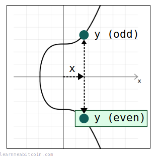](../../../images/diagrams_png_schnorr-public-key-y-coordinate.png)

当重构完整的公钥时，我们始终使用这两者之中的**偶数 y 坐标**。

因此，对于任何给定的公钥 x 坐标，我们使用椭圆曲线方程（`y² = x³ + 7`）计算出两个潜在的 y 坐标，然后从中选择*偶数*的一个，即可得到公钥的完整 (x, y) 坐标。

#### 代码

```
# -------------------------
# Elliptic Curve Parameters
# -------------------------

# prime field
$p = 115792089237316195423570985008687907853269984665640564039457584007908834671663

# ---------
# Functions
# ---------

# convert hexadecimal string of bytes to integer
def int(bytes)
  return bytes.to_i(16)
end

# ------------------------------
# Decompress Public Key (lift_x)
# ------------------------------

# encoded public key (32-byte x-coordinate only)
public_key = "dff1d77f2a671c5f36183726db2341be58feae1da2deced843240f7b502ba659"

# calculate one of the possible y values from the x coordinate
x = int(public_key) # convert from x coordinate from hex to an integer
y_sq = (x**3 + 7) % $p # use the elliptic curve equation (y² = x³ + 7) to work out the value of y from x
y = y_sq.pow(($p+1)/4, $p) # secp256k1 is chosen in a special way so that the square root of y is y^((p+1)/4)

# check that x coordinate is less than the field size
if x >= $p
  raise "x value in public key is not a valid coordinate because it is not less than the elliptic curve field size"
end

# verify that the computed y value is the square root of y_sq (otherwise the public key was not a valid x coordinate on the curve)
if (y**2) % $p != y_sq
  raise "public key is not a valid x coordinate on the curve"
end

# show current x and y value (this y value is odd, but sometimes it will already be even)
puts "x: #{x}" #=> 101293062680523315514373137351023114440902235251657644508821325047911886333529
puts "y: #{y}" #=> 95491709537915294920828256998521669146617750390665870859237534620269297521559

# if the calculated y value is odd, negate it to get the even y value instead (for this x-coordinate)
if y % 2 != 0
  y = $p - y
end

# show even y value
puts "y: #{y}" #=> 20300379699400900502742728010166238706652234274974693180220049387639537150104
```

从 x 坐标求出 y 坐标的初始方法与[解压公钥](../../keys/public-key.md#decompress)时相同。

* 每次使用偶数 y 坐标意味着我们在[签名验证](#verify)过程中无需尝试两种可能的 y 坐标。
* 从编码的公钥计算出完整的公钥点 (x, y) 需要一个额外的计算步骤，但为了在区块链中为每个公钥节省 1 字节的空间，这被认为是值得的。
* 签名中的 `r` 值（一个随机点）同样也被编码为仅含 x 坐标。

#### 这难道不会降低签名方案的安全性吗？

既然我们对每个公钥都只使用其偶数 y 坐标，这确实意味着两个不同的私钥会产生相同的*编码*公钥。

例如：

```
private_key_1 = b7e151628aed2a6abf7158809cf4f3c762e7160f38b4da56a784d9045190cfef
private_key_2 = 481eae9d7512d595408ea77f630b0c3757c7c6d77693c5e5184d85887ea57152

private_key_1_encoded_public_key = dff1d77f2a671c5f36183726db2341be58feae1da2deced843240f7b502ba659
private_key_2_encoded_public_key = dff1d77f2a671c5f36183726db2341be58feae1da2deced843240f7b502ba659
```

 公钥 (Public Key)

| Field | Value |
| --- | --- |
| 私钥 (Private Key) | `0 bytes` |
| 公钥 (Public Key) 坐标 (Coordinates) x | 0d |
| 公钥 (Public Key) 坐标 (Coordinates) y | 0d |
| 奇偶性 (parity) | |
| 压缩方式 | 压缩格式 (以 02 或 03 开头) / 未压缩格式 (以 04 开头) / 仅含 x 轴 (无前缀) |
| 结果 | `0 bytes` |

**切勿在网站中输入您的私钥，或使用由网站生成的私钥。** 网站很容易保存私钥并用其盗取您的比特币。

此示例中的第二个私钥是第一个私钥的*加法逆元*（即我通过从[曲线上的点数](../elliptic-curve.md#parameters)中减去它来使其取负值）。该“反转”的私钥为公钥生成完全相同的 x 坐标，但带相反的 y 坐标。

然而，有些令人惊讶的是，两个私钥生成同一个公钥的事实[并不会削弱比特币中 Schnorr 签名的安全性](https://bitcoin.stackexchange.com/questions/90118/why-is-no-security-lost-by-using-32-byte-public-keys-in-schnorr-signatures-inste)。

### 2. 键前缀 (Key-Prefixing)

在[标准 Schnorr 签名方案](#basics)中，通过将公有 Nonce (`kG`) 与消息 (`m`) 进行哈希运算来创建挑战 (`e`)：

[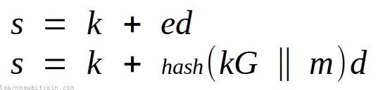](../../../images/diagrams_png_schnorr-challenge-standard.png)

然而，在比特币中，该哈希还包含了公钥的 x 坐标 (`Px`)：

[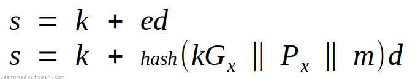](../../../images/diagrams_png_schnorr-challenge-bitcoin.png)

这被称为键前缀 (key-prefixing)，引入它是为了[在 HD 钱包中从非硬分叉公钥生成签名时防止相关攻击](https://bitcoin.stackexchange.com/questions/79768/a-couple-of-questions-on-schnorr-sig)。

此键前缀同样在[生成私有 Nonce](#nonce-generation) 时被使用。

### 3. 标记哈希 (Tagged Hashes)

 标记哈希 (Tagged Hash)

| Field | Value |
| --- | --- |
| 挑战 (Challenge) (e) | 0d |
| 点 2 (Point 2) = (n-e)P x/y | 0d / 0d |
| R = sG + (n-e)P x/y | 0d / 0d |
| 验证 (Verify) r | 0d |
| 验证 (Verify) R[x] | 0d |

## 基本原理

Schnorr 签名是如何工作的？

我想在此解释一下 **Schnorr 签名是如何工作的**，以及这些*签署*和*验证*的方程究竟是怎么来的：

[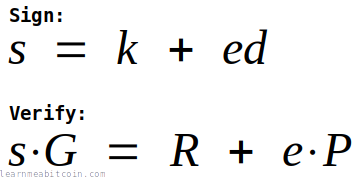](../../../images/diagrams_png_schnorr-basics-equations.png)

我将从最基础的开始逐步讲解。

### 1. 密钥对

[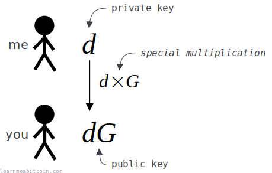](../../../images/diagrams_png_schnorr-basics-keys.png)

首先，为了能够创建一个数字签名，我需要生成一对密钥：

* **私钥** (`d`) — 一个我需要保密的随机生成数字。
* **公钥** (`dG`) — 我的私钥 (`d`) 乘以另一个数字 (`G`) 的结果。

我们已事先在数字 `G` 上达成一致。因此 `d` 是秘密的，但 `G` 并不是。

现在，虽然我将我的私钥 (`d`) 乘以数字 `G` 得到了公钥，但让我们假设在此并不能通过将公钥 (`dG`) 除以 `G` 来反向求得私钥 (`d`)。我知道这在普通的数学中是完全可行的，但假定我们使用了一种*特殊的*乘法，它以与普通乘法相同的方式工作，却不具备反向的“除法”运算。

而且请相信我，这种特殊的“点乘”运算在密码学中确实存在（我马上会讲到它）。

总之，因为我使用了这种特殊的“点乘”运算，我能够将我的公钥 (`dG`) 提供给您，而您却完全无法由此算出我的私钥 (`d`) 是什么。

这组密钥（以及特殊的“点乘”运算）是创建数字签名的起点。

#### 目标

我的目标是向您证明，我确实拥有用于创建该公钥 (`dG`) 的对应私钥 (`d`)，而无需透露该私钥的具体数值。

这一证明就将被称为我的**数字签名** (`s`)。

### 2. Nonce

[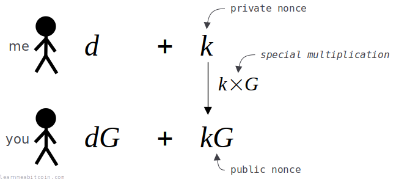](../../../images/diagrams_png_schnorr-basics-nonce.png)

在创建数字签名之前，我需要生成一个一次性的随机数，称为 **nonce** (`k`)。

此 nonce 用于帮助我*隐藏*我的私钥，因为我在创建签名时会将其加到我的私钥中。

总之，为了能够验证签名，您也将需要了解关于此 nonce (`k`) 的某些信息，但我同样不想将其直接透露给您。因此，我将我的私有 nonce (`k`) 乘以数字 `G`，从而创建一个**公有 nonce** (`kG`)。

我将这个公有 nonce (`kG`) 发送给您，同样因为我们使用了与此前相同的特殊“点乘”函数，您无法从其反向求得我的私有 nonce (`k`)。

**我需要为我创建的每一个签名使用一个*不同*的 nonce。** 如果我多次使用同一个私有 nonce (`k`)，您将能够推算出我的私钥 (`d`)。

### 3. 挑战 (Challenge)

[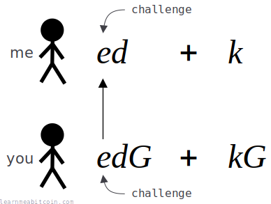](../../../images/diagrams_png_schnorr-basics-challenge.png)

既然我已经向您发送了该公有 nonce (`kG`)，我需要您想出一个**挑战** (`e`) 数值并发送给我。

这个挑战 (`e`) 是一个由*您*生成的随机数，它将阻止我通过伪造签名的方式，假装自己知道私钥 (`d`)，即使我实际并不知道。

我无法预先知道这个挑战数是多少，且既然我已经通过向您发送公有 nonce (`kG`) 承诺了要使用私有 nonce (`k`) 的数值，那么即使我不知道公钥 (`dG`) 对应的私钥 (`d`)，我也不可能通过调整我的私有 nonce (`k`) 值的手段来制作出有效的签名了。

简而言之，挑战是为了确保我无法作弊。

### 4. 签名 (Signature)

[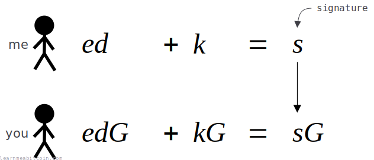](../../../images/diagrams_png_schnorr-basics-signature.png)

我通过将私钥 (`d`) 乘以挑战 (`e`)，再加上私有 nonce (`k`) 来创建我的**数字签名** (`s`)。

然后我将向您发送我的数字签名 (`s`)。

然后您也运行**同一个方程**。唯一的区别在于，您在执行该方程的*放大*版本，即我所使用的所有数字都已被同一个数字 `G` 进行了点乘放大。

如果您的方程式左右两边相等，您就知道我发送给您的数字签名 (`s`) 只能是由知道私钥 (`d`) 的人创建的。这便证明了我确实知道公钥 (`dG`) 所对应的私钥 (`d`)。

任何不知道公钥 (`dG`) 对应私钥 (`d`) 的人，都无法计算出能使您的方程成立的数字签名 (`s`)。

所以，这些方程是 Schnorr 签名方案的核心：

[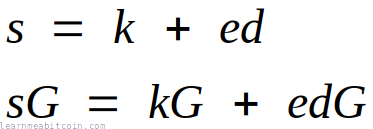](../../../images/diagrams_png_schnorr-basics-signature-equations.png)

这与上面示意图中的方程完全相同，只是重新进行了排列。

### 5. 简单示例

到目前为止，这一切都只是使用字母表示的方程式，所以让我们使用一些*实际数字*来证明这些方程确实有效。

[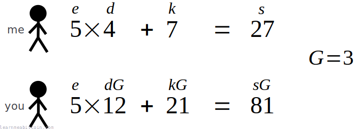](../../../images/diagrams_png_schnorr-basics-example.png)

该示例仅使用了**小数字**和**简单的乘法**。

当然，这些数字太小了，系统根本无法保证安全，且普通的乘法也并非明智的选择，因为您只需使用除法即可轻松求出原始私钥。

然而在密码学中，我们使用的是庞大的数字以及一种特殊的“乘法”运算，该运算实际上并不存在反向的“除法”运算（我保证马上会讲到它）。

但至少您能看出这些方程式确实有效。

### 6. 非交互式 (Non-interactive)

当前设计的缺点在于它是*交互式*的。

换句话说，您必须在收到我发送的公有 nonce (`kG`) *之后*，再将挑战数 (`e`) 发送给我，否则我将能伪造签名。

如果此方案是**非交互式**的，即我可以直接在我的端生成签名 (`s`)，而我们无需在事先进行 `kG` 和 `e` 的数据往返交互，那就会方便得多。

那么如果*我*可以在我自己这边直接创建挑战数 (`e`) 呢？

为此，我需要能以某种方式*承诺*使用我的私有 nonce (`k`)，同时能够在我的端产生一个不可预测的挑战数 (`e`)，并且此后无法更改我的私有 nonce (`k`)。

解决方案是使用[哈希函数](../hash-function.md)，通过对公有 nonce (`kG`) 进行哈希运算来创建挑战 (`e`)。

[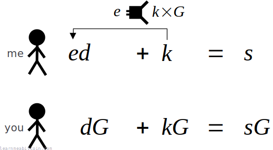](../../../images/diagrams_png_schnorr-basics-non-interactive-me.png)

哈希函数是完美的，因为它会为输入其中的任何数据生成一个不可预测的随机结果。此外，通过哈希公有 nonce (`kG`)，意味着我已承诺了使用私有 nonce (`k`)，因为一旦更改了 nonce，就会改变随后计算出的挑战 (`e`)。

因此，现在我们无需在事前进行交互式的 `kG` 和 `e` 数据传输，我可以直接计算出数字签名 (`s`)，并将其与公有 nonce (`kG`) 一并发送给您。

随后，您可以使用该公有 nonce (`kG`) 算得与我在我这一端生成的完全相同的挑战 (`e`)，并使用此挑战采用相同的方程来验证数字签名 (`s`)：

[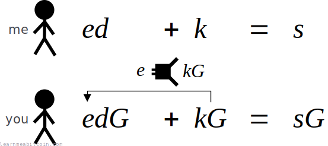](../../../images/diagrams_png_schnorr-basics-non-interactive-you.png)

结果，使用哈希函数来创建挑战 (`e`)，使我们成功将数字签名系统从交互式升级为了**非交互式**系统。这是我们系统的一大便利升级。

现在每次我想创建数字签名时，我可以直接将签名与公有 nonce (`kG`) 一起发送给您，而不需要您先向我发送挑战 (`e`)。

因此，由于引入了哈希函数来创建挑战 (`e`)，签署和验证的方程组现在看起来如下所示：

[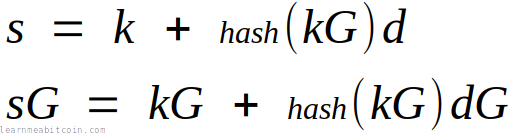](../../../images/diagrams_png_schnorr-basics-non-interactive-equations.png)

这种非交互式创建挑战的技术在学术上被称为 [Fiat-Shamir 变换 (Fiat-Shamir transformation)](https://www.zkdocs.com/docs/zkdocs/protocol-primitives/fiat-shamir/)。

### 7. 消息签署 (Message signing)

[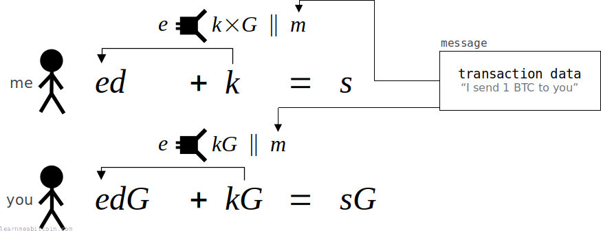](../../../images/diagrams_png_schnorr-basics-message.png)

在此之前，我一直是在用数字签名 (`s`) 来证明我是某个公钥 (`dG`) 的*所有者*。

这非常酷，但如果我们能*签署消息*，便会更加实用，这样如果我向您发送一个签名 (`s`) 和一条消息 (`m`)，您可以验证我是否说过或者同意了该消息。

这就像在现实生活中签署文件一样。您的签名本身足够独特，可以证明是*您*签署的，但我们通常会将签名写在像合同这样的文本上，以证明我们同意了其内容。消息 (`m`) 在此就充当我们想要附上签名 (`s`) 的“合同”。

例如在比特币中，此消息通常就是[交易数据](../../transaction.md)。通过对交易数据进行签名，我们既可以证明自己是比特币所锁定的对应公钥的所有者（以便能解锁它们），同时又同意了我们要将这笔比特币发送到哪里。此后，任何人都不能修改交易数据（例如试图将比特币发往其他地方），否则会导致签名失效。

总之，为了能够签署消息，我只需以某种方式将消息 (`m`) 包含在我的签名 (`s`) 运算中。这是通过在创建挑战 (`e`) 时，**将消息 (`m`) 也包含在哈希输入中**来实现的。

通过将消息 (`m`) 包含在哈希输入中，我已经将此消息*锁定*到了我最终生成的签名 (`s`) 中。如果有人尝试篡改消息以假装我同意了不同的内容，该签名将无法通过针对新消息的验证。

总之，现在我们已将**消息**作为我们签名的一部分，签署和验证的方程看起来如下所示：

[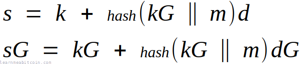](../../../images/diagrams_png_schnorr-basics-message-equations.png)

**这些是非交互式 Schnorr 签名方案的基础方程组。** 每当您查阅关于“Schnorr 签名”的任何数学解释时，您都会看到（以这种形式或其变体形式呈现的）这些方程式。

### 8. 椭圆曲线

最后，我们来到了特殊的“点乘”部分。

在此之前，我们在方程中一直使用简单的乘法。但这在现实世界中行不通，因为乘法可以通过除法轻易被*逆转*。

我们需要的是一种特殊的“乘法”，它具有与普通乘法相同的性质（这样我们的方程式依然成立），但不存在逆向的“除法”运算。

这正是[椭圆曲线](../elliptic-curve.md)派上用场的地方。

在椭圆曲线的*点*上确实存在一种[点乘运算](../elliptic-curve.md#multiply)：您可以取曲线上的一点（例如 `G`），将其乘以一个*标量*（例如 `d`），这将在同一条曲线上产生一个完全不同的新点（例如 `dG`）。但有趣的是，如果您把这个新点 (`dG`) 提供给他人，却没有任何数学运算能让他们通过除以 `G` 逆向推导出 `d` 是什么。

这对于我们的系统而言是完美的，也是为什么 Schnorr 签名的数学运算必须在**椭圆曲线**上进行的原因。

此外，您同样可以对椭圆曲线上的两个点进行[相加](../elliptic-curve.md#add)运算，这很重要，因为我们在验证过程中也需要将两个点相加 (`kG` + `edG`)。

因此，**方程以与此前相同的方式工作**，但*相乘*和*相加*运算现在转为使用*椭圆曲线*上的点运算来进行，而不是使用我们在此之前一直在用的简单算术乘法和加法。

为了说明我们现在在方程中使用的与之前略微不同的乘法运算，我将使用点“⋅”操作符来表示椭圆曲线乘法：

[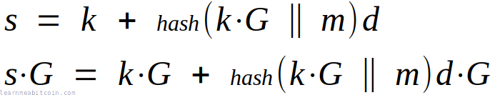](../../../images/diagrams_png_schnorr-basics-elliptic-curve-equations.png)

* **小写**字母（例如 `k`, `d`, `e`, `s`）表示一个**标量 (scalar)**（一个数字）。
* **大写**字母（例如 `G`）表示曲线上的一个**点 (point)**。

如果您将一个**点乘以一个标量**，您将得到一个新的**点**。

还有其他不需要除法即可进行乘法运算的替代方案，但椭圆曲线因其安全性和速度而在密码学中最为流行。

### 9. 总结

最终的 Schnorr 签署和验证方程如下所示：

[](../../../images/diagrams_png_schnorr-basics-elliptic-curve-equations.png)

我们也可以对其进行简化：

* 挑战 `hash(kg || m)` 被简称为 `e`。
* 公有 Nonce 点 (`kG`) 被简称为 `R`。
* 公钥点 (`dG`) 被简称为 `P`。

因此，如果我们代入这些术语，我们的方程将变为：

[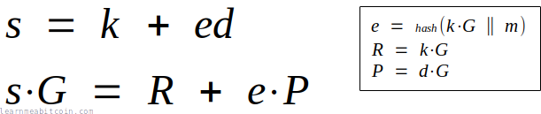](../../../images/diagrams_png_schnorr-basics-summary-equations-substitute.png)

这便是我们在本页最上方所示的签署和验证公式的由来。

最后，我们可以对验证方程进行**移项重新整理**以得到：

[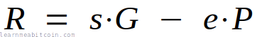](../../../images/diagrams_png_schnorr-basics-summary-equations-verification-rearrange.png)

而这正是比特币中用于 Schnorr 签名[验证](#verify)的方程式。

## 历史

为什么比特币从一开始就没有使用 Schnorr 签名？

在比特币最初开发时，Schnorr 签名方案还在专利保护期内。

中本聪使用 OpenSSL 库来为比特币提供密码学支持，而当时该库中并不支持 Schnorr 签名，因此他们使用了 [ECDSA](ecdsa.md)。所以即使 Schnorr 签名比 ECDSA 更简单也更有用，但在创建比特币时，它们并不是一个可行的选择。

以下是简要的历史发展线：

* **1989 年** — Claus Schnorr 在论文《高效识别与智能卡签名》(Efficient identification and signatures for smart cards) 中发表了 Schnorr 签名的数学原理。
* **1990 年** — Claus Schnorr 申请了 [Schnorr 签名方案的专利](https://patents.google.com/patent/US4995082A/en)。
* **1991 年** — Schnorr 签名方案的专利获得批准。
* **1992 年** — Scott Vanstone 博士提出将 ECDSA 作为创建数字签名的替代方案。
* **1998 年** — ECDSA 被接受为 ISO 标准。
* **1999 年** — ECDSA 被接受为 ANSI 标准。
* **2000 年** — ECDSA 被接受为 IEEE 和 NIST 标准。
* **2007 年** — 中本聪开始开发比特币，并使用 ECDSA 作为签名机制。
* **2009 年** — 比特币的第一个版本发布。
* **2010 年** — Schnorr 签名方案专利到期。
* **2015 年** — 将 Schnorr 签名引入比特币的研究工作开始。
* **2021 年** — Schnorr 签名作为 Taproot 升级的一部分被引入比特币。

## 总结

在比特币中创建和验证数字签名方面，**Schnorr 签名是相比 ECDSA 的一大升级**。

我们当初没有使用 Schnorr 签名的唯一原因是因为其专利在 2010 年前一直有效，所以 [ECDSA](ecdsa.md) 是当时次优的选择（它同样胜任工作，只是不够优雅）。但既然专利已经失效，我们便可以自由使用 Schnorr 签名并利用它们所带来的所有优势。

用更笃定的语气说：

> 真正的问题应该是，为什么人们还在使用 ECDSA？它是对 Schnorr 的低劣改造，应该早日成为历史的过去。
> 
> CurveEnthusiast, [crypto.stackexchange.com](https://crypto.stackexchange.com/questions/48528/security-of-schnorr-signature-versus-dsa-and-dlp#answer-48592)

换句话说，Schnorr 签名才是**数字签名本来应有的样子**。

比特币中的 Schnorr 签名实现看起来比 ECDSA 更加复杂，但实际并没有看起来那么难。它底层的*数学原理*更加简单；只不过其上融入了某些[比特币特定的设计实现](#design)。因此不要被那些复杂的图表吓跑。如果您一步一步来，实现它并不难。

此外，如果您对数字签名工作原理的*数学原理*感兴趣，那么先去尝试理解[基础 Schnorr 签名方案](#basics)然后再去研究 ECDSA 也是更为合理的路线。

您不需要知道 Schnorr 签名的工作原理也能将其添加到您的代码中，但了解它的来龙去脉是件很酷的事情。

## 资源

* [BIP 340: Schnorr Signatures for secp256k1](https://github.com/bitcoin/bips/blob/master/bip-0340.mediawiki)
* [Cryptoshorts e02: Schnorr signature](https://www.youtube.com/watch?v=r9hJiDrtukI) - 一个简单明了的视频，解释了 Schnorr 签名工作原理的基础知识。
* [How to Design Schnorr Signatures](https://www.youtube.com/watch?v=wjACBRJDfxc) - Adam Gibson 对 Schnorr 签名设计极其出色的讲解。
* [Taproot, and Schnorr, and SIGHASH\_NOINPUT, oh my!](https://www.youtube.com/watch?v=YSUVRj8iznU) - Pieter Wuille 对 Schnorr 签名与 Taproot 优势的总结。
* [Introduction to Schnorr Signatures with Elichai Turkel](https://www.youtube.com/watch?v=XKatSGCZ-gE) - 关于 Schnorr 签名及其在比特币中应用的学术演讲。