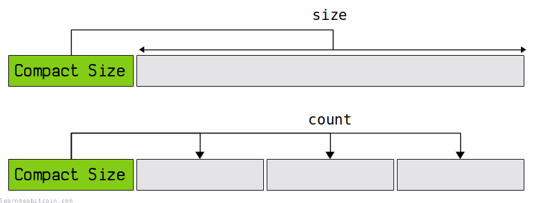
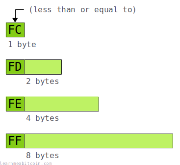

[](https://static.learnmeabitcoin.com/diagrams/png/bytes-compact-size.png)

A compact size field is used in [network messages](/technical/networking/#messages) to indicate the **size of an upcoming field** or the **number of upcoming fields**.

It can store numbers between 0 and 18446744073709551615.

The size of the field increases as the number it contains increases. Or in other words, smaller numbers take up less space. This means you don't have to use a larger fixed-size field at all times to accommodate the largest acceptable number.

Integer

0d

Compact Size

`0 bytes`


Prefix

The first byte indicates which bytes encode the integer:

 `<=FC`
– This byte (0 - 252)
 `FD`
– The next two bytes (253 - 65535)
 `FE`
– The next four bytes (65536 - 4294967295)
 `FF`
– The next eight bytes (4294967296 - 18446744073709551615)

Note: Bytes encoding the integer are in little endian.


0 secs

## Structure

A compact size field is a variable-length [byte](/technical/general/bytes/) structure. The *leading byte* indicates the **size** of the field, and also indicates the bytes that contain the **number**.

[](https://static.learnmeabitcoin.com/diagrams/png/bytes-compact-size-prefix.png)

| Leading Byte | Number | Range | Field Size | Example |
| --- | --- | --- | --- | --- |
| `FC` (and below) | Current byte | 0 - 252 | 1 byte | `64` (100) |
| `FD` | Next 2 bytes | 253 - 65535 | 3 bytes | `FDE803` (1,000) |
| `FE` | Next 4 bytes | 65536 - 4294967295 | 5 bytes | `FEA0860100` (100,000) |
| `FF` | Next 8 bytes | 4294967296 - 18446744073709551615 | 9 bytes | `FF00E40B5402000000` (10,000,000,000) |

**Note:** The bytes containing the number are in [little-endian](/technical/general/little-endian/).

So for small numbers of 252 or less, you just use a single byte. But for larger numbers you use a prefix of `FD`, `FE`, or `FF`, and the integer is contained in the next 2, 4, or 8 bytes.

The maximum value a compact size field can hold is 18446744073709551615, which is `FFFFFFFFFFFFFFFFFF` (an `FF` prefix followed by `FFFFFFFFFFFFFFFFFF`).

You'll most commonly see compact size fields holding numbers of 252 or less. So at first you might assume you're looking at a simple 1-byte field, and not realize you're looking at a special type of field that can vary in size.

A compact size field starting with `FF` (for 8-byte numbers) is complete overkill and is never used in Bitcoin. This would be used to indicate an upcoming 4 GB+ of data, which is far more than could ever fit inside an actual block of data.

You can actually use the `FF` prefix and then use the next 8 bytes of `0000000000000001` to indicate a value of 1. It would be a waste of space, but it would still be as valid as if you just used the single byte `01`.

## Examples

Here are some examples of the different compact size prefixes found inside [transaction](/technical/transaction/) data:

### `FC` (and below)

A single-byte of `FC` or below is by far the most common:

* [a1075db55d416d3ca199f55b6084e2115b9345e16c5cf302fc80e9d5fbf5d48d](/explorer/tx/a1075db55d416d3ca199f55b6084e2115b9345e16c5cf302fc80e9d5fbf5d48d) – This is the famous [pizza transaction](https://bitcointalk.org/index.php?topic=137.0). To form the 10,000 BTC [output](/technical/transaction/output/), this transaction collected 131 [inputs](/technical/transaction/input/) together, so the input count was a single byte compact size field of `83`.

This is just one quick example. You can look up any transaction in the blockchain and you'll find simple single-byte compact size fields. They're everywhere.

### `FD`

You'll occasionally run into the `FD` prefix every now and then. This happens when there's a higher-than-average input/output count, or if a [scriptsig](/technical/transaction/input/scriptsig/)/[scriptpubkey](/technical/transaction/output/scriptpubkey/) is unusually large:

* [6bb9c31f15c6940d4bd664054e398e420425339aadc65e8c491cf1151fe7ff4b](/explorer/tx/6bb9c31f15c6940d4bd664054e398e420425339aadc65e8c491cf1151fe7ff4b) – This transaction has 965 inputs, so the compact size field is `FDC503` (don't forget that the last two bytes are in [little-endian](/technical/general/little-endian/), so `03C5` = 965).
* [e411dbebd2f7d64dafeef9b14b5c59ec60c36779d43f850e5e347abee1e1a455](/explorer/tx/e411dbebd2f7d64dafeef9b14b5c59ec60c36779d43f850e5e347abee1e1a455) – This transaction has an unusually large scriptpubkey (it has `OP_CHECKSIG` repeated multiple times for some reason). The script is 4,026 bytes in length, so the compact size field is `FDBA0F`.
* [3454605a6e24181a6061574720e93a79689865e7952c56c330ebcb98fa95e936](/explorer/tx/3454605a6e24181a6061574720e93a79689865e7952c56c330ebcb98fa95e936) – This transaction has 254 outputs. Whilst a single byte can hold the number 254 in normal circumstances, when using a compact size field the maximum single-byte value is 252. So in this instance the `FD` prefix was used and the number 254 was encoded in the next 2 bytes instead, resulting in a compact size field of `FDFE00`

### `FE` and `FF`

You'll *very rarely* come across the `FE` or `FF` prefixes (for numbers greater than 65,535).

This is because the maximum scriptpubkey/scriptsig size is 10,000 bytes (see [script.h](https://github.com/bitcoin/bitcoin/blob/master/src/script/script.h)). Furthermore, due to the block size limit of 4,000,000 [weight](/technical/block/#weight) units, it would be impossible to have more than 65,535 inputs in a single transaction, and it would be incredibly difficult to have more than 65,535 outputs.

#### Minimum transaction input and output sizes

* The minimum *[input](/technical/transaction/input/)* size is 41 bytes (32 byte [TXID](/technical/transaction/input/txid/) + 4 byte [VOUT](/technical/transaction/input/vout/) + 1 byte [scriptsig](/technical/transaction/input/scriptsig/) + 4 byte [sequence](/technical/transaction/input/sequence/)). So if you put 65,535 of these in a transaction, it would be 2.686 MB (10,747,740 [weight units](/technical/transaction/size/#weight)) in size, which is larger than the maximum size for an entire block.
* The minimum *[output](/technical/transaction/output/)* size is 9 bytes (8 byte amount + 1 byte [scriptpubkey](/technical/transaction/output/scriptpubkey/)). So if you put 65,535 of these in a transaction, it would take you up to 0.589 MB (2,359,260 weight units), which *would* technically fit inside a block.

On the mainnet chain:

* The most outputs I've seen in one transaction is 13,107: [dd9f6bbf80ab36b722ca95d93268667a3ea6938288e0d4cf0e7d2e28a7a91ab3](/explorer/tx/dd9f6bbf80ab36b722ca95d93268667a3ea6938288e0d4cf0e7d2e28a7a91ab3)
* The largest scriptpubkey I've seen is 4,026 bytes: [e411dbebd2f7d64dafeef9b14b5c59ec60c36779d43f850e5e347abee1e1a455](/explorer/tx/e411dbebd2f7d64dafeef9b14b5c59ec60c36779d43f850e5e347abee1e1a455)

But still, both of these are well below needing to use a compact size prefix of `FE`.

The only time you find an `FE` or `FF` prefix in the wild is if it has been incorrectly used to store a number that could have been put inside a smaller compact size field.

## Location

Here's where you'll most commonly find compact size fields:

* [Transaction Data](#transaction-data)
* [Block Data](#block-data)
* [Network Messages](#network-messages)

### Transaction Data

Compact size fields are used throughout raw [transactions](/technical/transaction/). They're used for indicating:

* The number of [inputs](/technical/transaction/input/).
* The number of [outputs](/technical/transaction/output/).
* The size of the [scriptsig](/technical/transaction/input/scriptsig/).
* The size of the [scriptpubkey](/technical/transaction/output/scriptpubkey/).
* The number of [witness](/technical/transaction/witness/) elements. ([Segwit](/technical/upgrades/segregated-witness/) Transactions)
  + The size of each witness element.

Here's an example legacy transaction ([414719d592b73341b77497165d9f46f6eff6c243469265f95d920b779c7a0492](/explorer/tx/414719d592b73341b77497165d9f46f6eff6c243469265f95d920b779c7a0492)). I've split the raw transaction data into individual fields and highlighted the compact size fields in green:

```
01000000
  01 <-input count
    79fe743502ff8cd181121572fececac3feee5ef3034edfb3ccd2bfaa24537dae00000000
    6b <-scriptsig size
      483045022100d39e64d275f0e69d5a2722ad93e3e206e98bf03584525cec05b5fcb75dc3e5a8022071fc39e3784be3a76d8469ed13ade270d8da25677fc5a226c5e7223a85701c7c012102b0453d54d1e0c0b41a63b3ca898afc4cc4243ed0241a9cc116e37854969a2270
    ffffffff
  01 <-output count
    72c9000000000000
    19 <-scriptpubkey size
      76a91400bafac9185e183c1203025fbdac30a4be5af91088ac
00000000
```

Here's an example segwit transaction ([672d9428242a097e57c5def8b300d05068e0d85a1028ac3e93c9a487561f36c9](/explorer/tx/672d9428242a097e57c5def8b300d05068e0d85a1028ac3e93c9a487561f36c9)), again with the compact size fields highlighted in green:

```
01000000
    0001
    01 <-input count
        53baeaeed4799240f2a48e99fcc6e504672120764d622e4e5af9fd04b37a8293
        05000000
        00 <-scriptsig size
        ffffffff
    01 <-output count
      4ac7010000000000
      17 <-scriptpubkey size
        a914f314b4ac619e1d3f96a5ffac796b17e0a47b52b987
    02 <-witness element count
      47 <- witness element size
        3044022064576f10eee1b679648965b72081a636ac46b21be3e36558585775fc523dbcdf0220440b31af77adcbc75cf79679406d8ba1e2c14ff03d02606725d29ffdaa028a5f01
      21 <- witness element size
          021ce981c19e4f998b62091ffd960549ead5f8ced3de7fc919d5d4a25e6edf42cd
00000000
```

### Block Data

A compact size field is used once within a raw block of data. It indicates:

* The number of transactions in the block.

For example, this is the genesis block ([000000000019d6689c085ae165831e934ff763ae46a2a6c172b3f1b60a8ce26f](/explorer/block/000000000019d6689c085ae165831e934ff763ae46a2a6c172b3f1b60a8ce26f)), and it only has one transaction in it:

```
01000000
0000000000000000000000000000000000000000000000000000000000000000
3ba3edfd7a7b12b27ac72c3e67768f617fc81bc3888a51323a9fb8aa4b1e5e4a
29ab5f49
ffff001d
1dac2b7c
01 <-transaction count
01000000010000000000000000000000000000000000000000000000000000000000000000ffffffff4d04ffff001d0104455468652054696d65732030332f4a616e2f32303039204368616e63656c6c6f72206f6e206272696e6b206f66207365636f6e64206261696c6f757420666f722062616e6b73ffffffff0100f2052a01000000434104678afdb0fe5548271967f1a67130b7105cd6a828e03909a67962e0ea1f61deb649f6bc3f4cef38c4f35504e51ec112de5c384df7ba0b8d578a4c702b6bf11d5fac00000000
```

It sits between the [block header](/technical/block/#header) and the transactions. This is the only time the compact size field is used inside a raw block (not including the transactions).

### Network Messages

The compact size field is used inside the various [messages](https://en.bitcoin.it/wiki/Protocol_documentation#Message_types) that nodes send to each other on the bitcoin [network](/technical/networking/).

For example, the payload of an ["inv" message](/technical/networking/#inv) uses a compact size field to indicate the number of upcoming items:

```
01 01000000aa325e9122aa39ca18c75aabe2a3ceaf9802acd1a40720925bfd77fff58ed821
```

This message indicates that there is one item in the list, and it's this TXID: [21d88ef5ff77fd5b922007a4d1ac0298afcea3e2ab5ac718ca39aa22915e32aa](/explorer/tx/21d88ef5ff77fd5b922007a4d1ac0298afcea3e2ab5ac718ca39aa22915e32aa) ([reverse byte order](/technical/general/byte-order/#reverse-byte-order)).

*Transactions* and *blocks* are actually messages that get sent across the bitcoin network too. So the compact size field helps to save space in the serialized *messages* that get sent between nodes. You always want to send the least amount of data across the wire as possible (for efficiency), so that's why compact size is useful.

## Benefits

Why are compact size fields used in Bitcoin?

The compact size field saves a few extra bytes of space.

For example, you can quite comfortably fit a few thousand outputs in a transaction, but the majority of the time you're only creating one or two. So for the *output count* field, a basic solution would be to make it a fixed 2-byte field at all times to allow for a large number of outputs on rare occasions, even though the vast majority of the time it won't be needed. So for example, across 10 transactions you might have the following fields:

```
Fixed 2-Byte Field:

Number  | Bytes
--------|------
 2      | 0002
 2      | 0002
 1      | 0001
 2      | 0002
 27     | 001B
 3      | 0003
 3000   | 0BB8
 2      | 0002
 1      | 0001
 2      | 0002

 TOTAL BYTES = 40
```

But by using a flexible compact size field instead, we can use a 1-byte field size most of the time, and then expand up to 3 bytes (1 byte prefix + 2 byte number) to accommodate larger numbers on the rare occasions that we need them. Over the same 10 transactions for example:

```
Compact Size Field:

Number  | Bytes
--------|------
 2      | 02
 2      | 02
 1      | 01
 2      | 02
 27     | 1B
 3      | 03
 3000   | FD0BB8
 2      | 02
 1      | 01
 2      | 02

 TOTAL BYTES = 24
```

It's a minor space-saving technique. But when you have multiple of these fields in a transaction, and hundreds of thousands of transactions traveling between computers every day (and billions of transactions stored in the [blockchain](/technical/blockchain/)), the bytes add up.

## Code

Here's a quick code example showing how you can convert between an integer and compact size in Ruby:

```


copied


copied

# pack()       - converts an integer to raw bytes of a specific length and byte order (e.g. little-endian) based on the directive given
# unpack("H*") - converts raw bytes to a hexadecimal string

# Directives:
#
# C  =  8-bit integer
# S< = 16-bit integer, little-endian
# L< = 32-bit integer, little-endian
# Q< = 64-bit integer, little-endian

def encode(i)
    # convert integer to a hex string with the correct prefix depending on the size of the integer
    if (                     i <= 252)                  then compactsize =        [i].pack("C").unpack("H*")[0]
    elsif (i > 252        && i <= 65535)                then compactsize = 'fd' + [i].pack("S<").unpack("H*")[0]
    elsif (i > 65535      && i <= 4294967295)           then compactsize = 'fe' + [i].pack("L<").unpack("H*")[0]
    elsif (i > 4294967295 && i <= 18446744073709551615) then compactsize = 'ff' + [i].pack("Q<").unpack("H*")[0]
    end

    return compactsize
end

def decode(compactsize)
    # get the first byte
    first = compactsize[0...2]

    # get the correct number of bytes from the hex string, then convert this hex string to an integer
    if    (first == "fd") then i = [compactsize[2...6]].pack("H*").unpack("S<")[0]
    elsif (first == "fe") then i = [compactsize[2...10]].pack("H*").unpack("L<")[0]
    elsif (first == "ff") then i = [compactsize[2...18]].pack("H*").unpack("Q<")[0]
    else                       i = [compactsize[0...2]].pack("H*").unpack("C")[0]
    end

    return i
end


# Encode Examples
puts encode(0)                    #=> 00
puts encode(252)                  #=> fc

puts encode(253)                  #=> fdfd00
puts encode(65535)                #=> fdffff

puts encode(65536)                #=> fe00000100
puts encode(4294967295)           #=> feffffffff

puts encode(4294967296)           #=> ff0000000001000000
puts encode(18446744073709551615) #=> ffffffffffffffffff

# Decode Examples
puts decode("00")                 #=> 0
puts decode("fc")                 #=> 252

puts decode("fdfd00")             #=> 253
puts decode("fdffff")             #=> 65535

puts decode("fe00000100")         #=> 65536
puts decode("feffffffff")         #=> 4294967295

puts decode("ff0000000001000000") #=> 4294967296
puts decode("ffffffffffffffffff") #=> 18446744073709551615
```

## Summary

A compact size field is used for indicating an upcoming number of items or the upcoming length of some data in network messages (e.g. raw transactions). It's usually 1 byte in size, but can expand up to 9 bytes in length when needed to encode larger numbers.

It has been part of the protocol since the first release of Bitcoin (v0.1.0) and can be found in [serialize.h](https://github.com/bitcoin/bitcoin/blob/master/src/serialize.h). I believe this compact size encoding is something Satoshi came up with when programming Bitcoin, as I haven't seen it used anywhere else.

### Compact Size vs VarInt

I used to think a compact size field was called a *VarInt* (Variable Integer). They both encode variable-length integers in a compact form, but they actually have different structures:

* **Compact Size** – The first byte indicates how many bytes you need to read to calculate the integer value. You'll find this in many of the serialized messages sent across the bitcoin network (e.g. transactions and blocks).
* **VarInt** – You keep reading bytes until the first bit is not set, then combine those bytes together to calculate the integer. You'll find [VarInts in the LevelDB Chainstate database](https://github.com/in3rsha/bitcoin-chainstate-parser/blob/master/README.md#varints).

So they have a similar purpose, but they work differently.

I actually used to call a compact size field a "VarInt" on this website in the past. Sorry for the confusion. You can also find the compact size field being referred to as a var\_int in [BIP 141](https://github.com/bitcoin/bips/blob/master/bip-0141.mediawiki#transaction-id).

These kinds of variable-length byte structures for integers are also known as "variable length encodings" in other programs. It can be found in UTF-8 encoding, the MIDI file format, and WAP (Wireless Application Protocol). However, these work slightly differently to the "compact size" structure found in Bitcoin.

## Resources

* <https://developer.bitcoin.org/reference/transactions.html#compactsize-unsigned-integers>