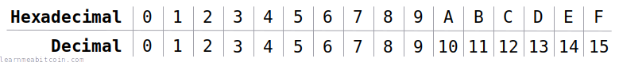
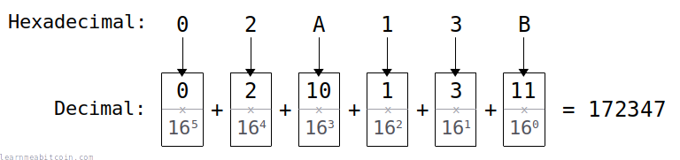
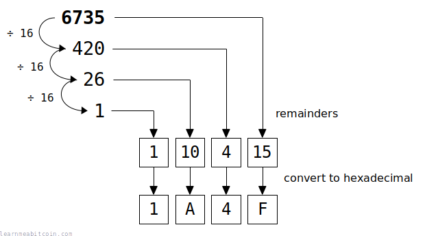
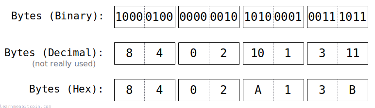

[](https://static.learnmeabitcoin.com/diagrams/png/numbers-hexadecimal-key.png)

The hexadecimal numbering system uses the **digits 0-9 and the characters A-F** to represent the numbers **0-15**.

So basically the hexadecimal system (16 symbols) is an extension of the decimal system (10 symbols). This means you can represent numbers from 0 to 15 using just one symbol.

This system is useful for representing [bytes](/docs/technical/general/bytes.md), because half a byte has 16 different combinations, so you can represent a whole byte using just 2 hexadecimal symbols. That's why a lot of the data you see in Bitcoin (e.g. [private keys](/docs/technical/keys/private-key.md), [transactions](/docs/technical/transaction.md)) is in hexadecimal.

The letters in hexadecimal can be **uppercase or lowercase**, it doesn't matter (e.g. 1337af is the same as 1337AF).

Hexa = 6, Deci = 10. So *hexadeci*mal refers to the fact that there are 16 different characters in this numbering system.

Binary (Base 2)

0b

`0 digits`

Decimal (Base 10)

0d

`0 digits`

Hexadecimal (Base 16)

0x

`0 digits`


+1


0 secs

## Number Prefixes

We use prefixes to identify numbers in hexadecimal, decimal, and binary.

* 0x = Hexadecimal
* 0d = Decimal
* 0b = Binary

For example:

* 0x100 = 256
* 0d100 = 100
* 0b100 = 4

We don't usually prefix decimal numbers with 0d (unless it makes sense to do so). So if you see 100, you can assume that it's one hundred.

## Hexadecimal to Decimal

[](https://static.learnmeabitcoin.com/diagrams/png/numbers-hexadecimal-decimal-conversion.png)

To convert hexadecimal to decimal, you multiply each character by increasing powers of 16.

1. Convert each hexadecimal symbol to its corresponding decimal value.
2. Multiply each of these decimal values (from smallest to largest) by an increasing power of 16 (e.g. 160, 161, 162, 163, etc.)
3. Add up all of the results together to get the final decimal value.

For example:

```
Hexadecimal = 02A13B

B = 11 * 160 = 11
3 = 3  * 161 = 48
1 = 1  * 162 = 256
A = 10 * 163 = 40960
2 = 2  * 164 = 131072
0 = 0  * 165 = 0

Decimal = 0 + 131072 + 40960 + 256 + 48 + 11 = 172347
```

This sounds confusing at first, but it's exactly how the decimal system works too. Every number in a decimal value represents 10 to an increasing power (because there are 10 digits in the decimal system, aka "base 10"). For example, the number 123 is saying (1 x 102) + (2 x 101) + 3 x (100), or "one 100, two 10's, and three 1's".

Any number to the power of zero is 1. For example, 100 = 1, and 160 = 1.

You don't have to be able to convert hexadecimal to decimal in your head, but it's good to remember that ultimately you're just looking at numbers when you're looking at hexadecimal digits and characters.

**[Little-Endian](/docs/technical/general/little-endian.md).** Most numbers stored within fields in bitcoin data (e.g. [vout](/docs/technical/transaction.md#structure-inputs-vout), [amount](/docs/technical/transaction.md#structure-outputs-amount)) are in *little-endian* (where the bytes are in reverse order), so you need to reverse the order of bytes first before converting to decimal.

### Code Examples

You can convert hexadecimal strings to decimal in any good programming language. There should be built-in functions to make it easy, so you shouldn't have to perform the conversion manually.

```


copied


copied

# hexadecimal to decimal
puts "02A13B".to_i(16) #=> 172347
```

```


copied


copied

# hexadecimal to decimal
echo "ibase=16; 02A13B" | bc #=> 172347
```

## Decimal to Hexadecimal

[](https://static.learnmeabitcoin.com/diagrams/png/numbers-decimal-hexadecimal-conversion.png)

To convert decimal to hexadecimal, you just need to keep dividing by 16.

The *remainder* of each division gives you the number for each hexadecimal character (from smallest to largest). You then take the result of each division (quotient), and keep going until you cannot divide the remainder any more (i.e. the quotient is zero).

For example:

```
Decimal = 6735

6735 / 16 = 420 (remainder 15)
 420 / 16 =  26 (remainder  4)
  26 / 16 =   1 (remainder 10)
   1 / 16 =   0 (remainder  1)

Hexadecimal = 1A4F
```

**Modulus.** The modulus operation (%) returns the *remainder* after division.

### Code Examples

```


copied


copied

# decimal to hexadecimal
puts 6735.to_s(16) #=> 1a4f
```

```


copied


copied

# decimal to hexadecimal
echo "obase=16; 6735" | bc #=> 1A4F
```

## [Bytes](/docs/technical/general/bytes.md)

What's the use of hexadecimal?

[](https://static.learnmeabitcoin.com/diagrams/png/bytes-hexadecimal.png)

You will encounter lots of hexadecimal characters when working with raw data in Bitcoin. For example, here's a random private key:

```
25be2890d1c4140c792d0b4e650974e364272a8b439c78b3bef42c7d4c68ff9c
```

This private key represents 32 bytes of data.

Why do we use hexadecimal for showing bytes? Because half of a byte of data has 16 different possible combinations, and there are 16 different hexadecimal characters. Therefore, we can represent half a byte using one single hexadecimal character, and a whole byte using two hexadecimal characters.

It's a match made in computing heaven.

Binary

Byte

0

0

0

0

0

0

0

0

Hexadecimal

`0`
`0`

Tip: The *lowest value* bit is on the right →

Tip: Half of a byte is called a "nibble". But that's not important to know for Bitcoin.

For example, rather than displaying all eight individual [bits](/docs/technical/general/bytes.md#bit) using binary like `10110101`, we can shorten it two hexadecimal characters `B5` instead (because `1011` = `B` and `0101` = `5`).

So basically, the hexadecimal system is a *convenient* system for displaying raw bytes of data.

## Resources

* [Practical Guide to Binary, Decimal and Hexadecimal Numbers](https://web.archive.org/web/20170628180513/http://www.myhome.org/pg/numbers.html)
* [A Brief Explanation of Hexadecimal Numbers](https://tseggleston.com/hex-numbers/)