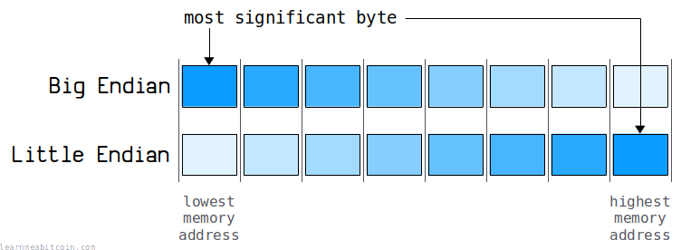
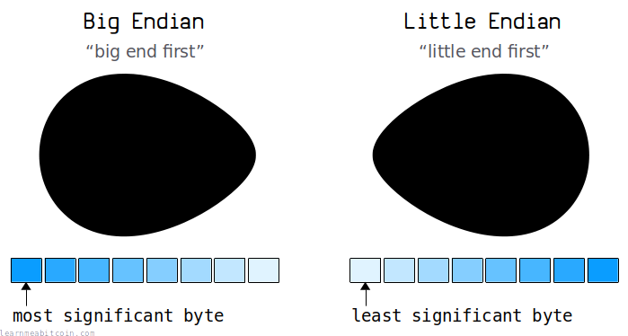

+1

Decimal

0d

Hex Bytes (Big Endian)

0x

`0 bytes`

Hex Bytes (Little Endian)

0x

`0 bytes`


Field Size

 Any

 2 Bytes

 4 Bytes

 8 Bytes

 12 Bytes

 16 Bytes

 32 Bytes


0 secs

术语 little-endian 指的是在计算机中存储整数时的字节顺序。它是指最低有效字节（least-significant byte）排在最前面，或者更简单地说，就是**字节顺序相反**。

原始比特币数据中的几乎所有整数都以 little-endian 字节顺序存储，因此非常值得习惯它。

## 示例

什么是 little-endian？

假设我们要将一个交易[输出（output）](../transaction/output.md)的*金额（amount）*设置为 `12345678` 聪（satoshis）。

该*金额*字段的大小为 8 字节。如果我们把这个数值转换为[十六进制字节（hexadecimal bytes）](hexadecimal.md#bytes)，它看起来是这样的：

```
00 00 00 00 00 bc 61 4e
```

这种字节顺序被称为 **big-endian**。

我们显然没有用满这个字段，因为这个 8 字节字段能容纳的最大整数是 `0xffffffffffffffff`（即 `18446744073709551615`）。这很明显，因为左边有许多零，而作为*人类*，我们期望在左边看到最大的数字。

然而，计算机（以及比特币）喜欢从另一个方向读取这些字节：

```
4e 61 bc 00 00 00 00 00
```

这种字节顺序被称为 **little-endian**。

我们拥有完全*相同的字节*，但它们的*顺序相反*。因此，我们不是从右到左读取最小的字节，而是从左到右读取它们。

## 字节顺序 (Byte Orders)

[](../../images/diagrams_png_bytes-endianness-memory.png)

如前所述，在计算机上存储整数时，有两种不同的字节排序方式：

1. [Big Endian](#big-endian)
2. [Little Endian](#little-endian)

有些计算机使用 big-endian 架构，而另一些则使用 little-endian 架构。

### 1. Big Endian

（在比特币中极少使用）

这是更符合“人类阅读习惯”的格式。包含最大数值的字节排在最前面：

```
00 00 00 00 00 bc 61 4e
```

或者从更技术性的角度来说，是指**最高有效字节（most-significant byte）**存储在一组字节的**最低内存地址**中。例如：

```
┌────────────────┬──────────┐
│ Memory Address │ Contents │
├────────────────┼──────────┤
│ 100            │ 0x00     │
│ 101            │ 0x00     │
│ 102            │ 0x00     │
│ 103            │ 0x00     │
│ 104            │ 0x00     │
│ 105            │ 0xbc     │
│ 106            │ 0x61     │
│ 107            │ 0x4e     │
└────────────────┴──────────┘
```

该表中的**最低内存地址**位于**顶部**。我已将内存地址从低到高排序。

**内存地址。** 地址是计算机内存中的一个位置。每个内存字节都有自己的地址。这里的 `100` 到 `107` 地址只是示例。这是一个关于[内存地址的 10 分钟视频](https://www.youtube.com/watch?v=lzMCuw_5dfM)。

### 2. Little Endian

（在比特币中常用）

这是更符合“计算机阅读习惯”的格式。包含最小数值的字节排在最前面：

```
4e 61 bc 00 00 00 00 00
```

或者从更技术性的角度来说，是指**最高有效字节（most-significant byte）**存储在一组字节的**最高内存地址**中。例如：

```
┌────────────────┬──────────┐
│ Memory Address │ Contents │
├────────────────┼──────────┤
│ 100            │ 0x4e     │
│ 101            │ 0x61     │
│ 102            │ 0xbc     │
│ 103            │ 0x00     │
│ 104            │ 0x00     │
│ 105            │ 0x00     │
│ 106            │ 0x00     │
│ 107            │ 0x00     │
└────────────────┴──────────┘
```

正如你所猜测的，中本聪（Satoshi）在编写比特币程序时，使用的是一台 little-endian 架构的计算机。

## 命名来源 (Terminology)

为什么它们被称为 "little-endian" 和 "big-endian"？

[](../../images/diagrams_png_bytes-little-endian.png)

基本上，是因为**鸡蛋**。

术语 "little-endian" 和 "big-endian" 源自 1726 年的小说《格列佛游记》（Gulliver's Travels）。书中提到了两类不同的人：一类人从“小端”（little end）敲开鸡蛋，而另一类人则从“大端”（big end）敲开鸡蛋。

这些“小端”和“大端”的说法随后被借用来描述计算机上字节排序的两种不同方式。

## 在比特币中的应用 (Usage)

我们什么时候在比特币中使用 little-endian？

在处理[网络消息（network messages）](../networking.md#messages)中的**整数**时，你会在比特币中发现 little-endian 字段。

最常见到 little-endian 的地方是原始[交易数据（transaction data）](../transaction.md)和原始[区块头（block headers）](../block.md#header)。

### 交易数据 (Transaction Data)

这是一笔原始交易。我将其拆分并用绿色高亮显示了 little-endian 字段。

```
02000000 <- version (little-endian)
    01 <- input count
        79fe743502ff8cd181121572fececac3feee5ef3034edfb3ccd2bfaa24537dae <- txid
        01000000 <- vout (little-endian)
        6a 473044022...915 <- scriptsig
        fdffffff <- sequence (little-endian)
    01 <- output count
        2a5f020000000000 <- output amount (little-endian)
        19 76a914a9970b7ed051822ea52a088b9c628eb158dd57e588ac <- scriptpubkey
ff30a00 <- locktime (little-endian)
```

例如，*vout* 是一个 4 字节的 little-endian 字段，在此交易中它引用前一个输出编号为 `1`。如果该字段是 big-endian，它将是 `00000001`，但因为它是 little-endian，字节顺序是相反的 `01000000`。

### 区块头 (Block Header)

这是一个原始区块头。

```
00000020 <- version (little-endian)
b91fd2b09d4a8238ad4c814e4fa0ab9ed34bf0f75a3a00000000000000000000 <- previous block hash
330b32016c8176153071283d3e5fe87c2318b3fd41d6ca1b1a8bf12670908e38 <- merkle root
daf0d861 <- time (little-endian)
ab980b17 <- bits (little-endian)
0e69d05c <- nonce (little-endian)
```

如你所见，所有的 little-endian 字段都是包含某种数值的字段。

例如，区块头中的时间是一个 4 字节的 little-endian 字段，包含一个 Unix 时间戳。这里它是 `daf0d861`，在 big-endian 中将是 `61d8f0da`。如果我们将其转换为十进制，得到 `1641607386`，这是 *2022 年 1 月 8 日 02:03:06 UTC* 的 Unix 时间戳。

## 转换方式 (Converting)

如何在 big-endian 和 little-endian 之间进行转换

如果你正在处理字符串，一种简单粗暴的逆转字节顺序的方法是将字符串分割成由 2 个字符组成的一组（2 个十六进制字符 = 1 [字节（byte）](bytes.md)），然后反转该数组。

```
# integer
amount = 12345678

# ----------
# Hex Strings
# -----------

# convert integer to 8-byte hexadecimal string (big endian)
big_endian = amount.to_s(16).rjust(16, "0") # 16 hex characters = 8 bytes
puts big_endian #=> 0000000000bc614e

# convert big-endian hexadecimal string to little-endian (reverse the byte order)
little_endian = big_endian.scan(/../).reverse.join
puts little_endian #=> 4e61bc0000000000
```

或者（更专业的方法），你可以使用 `pack` 和 `unpack` 函数在数字和实际原始字节之间进行转换。

```
# integer
amount = 12345678

# -----
# Bytes - pack() and unpack()
# -----
# Pack directives for integers:
#
# C< = 8-bit  integer (unsigned), (a single byte has no endianness)
# S< = 16-bit integer (unsigned), little-endian
# L< = 32-bit integer (unsigned), little-endian
# Q< = 64-bit integer (unsigned), little-endian
#
# v  = 16-bit integer (unsigned), little-endian (same as <S)
# V  = 32-bit integer (unsigned), little-endian (same as <L)
#
# Note: The "<" forces little-endian. Without it pack() will use the endianness of your system (i.e. native byte order).
# Note: An asterisk "*" will repeat the directive for all remaining elements.
# Source: https://ruby-doc.org/core-3.1.0/Array.html#method-i-pack

# convert integer to 8 bytes in little-endian
bytes = [amount].pack("Q<")

# convert bytes to hexadecimal string
string = bytes.unpack("H*")[0]
puts string #=> 4e61bc0000000000
```

这里是在命令行上进行 big-endian 和 little-endian 快速转换的简单命令：

```
echo -n acbd | tac -rs ..
```

感谢 [Greg Tonoski](https://github.com/GregTonoski) 提供这个实用的 bash 单行命令。

## 争议与看法 (Popularity)

little-endian 是比特币开发者们普遍喜欢的选择吗？

并不完全是。自 2011 年以来就有相关的[讨论](https://bitcointalk.org/index.php?topic=4278.0)：

> 我最想改的第一件事，就是把网络协议改为 big endian。

error, [bitcointalk.org](https://bitcointalk.org/index.php?topic=4278.msg62130#msg62130)


> Little Endian 很烦人，我已经说过很多次了。

Christian Decker, [bitcointalk.org](https://bitcointalk.org/index.php?topic=4278.msg62278#msg62278)


> 固定 little endian 就很好，而且刚好符合我们目前 99.9% 的使用场景。

jgarzik, [bitcointalk.org](https://bitcointalk.org/index.php?topic=4278.msg62161#msg62161)


> 如今几乎所有的 CPU 都原生以 little-endian 运行。要操作 big-endian 数字，需要额外的字节交换指令。对大多数事情来说，我认为这种影响微乎其微。网络协议需要一个规范来表示事物，比特币的创始人选了一个。实际选择其实并不重要。

Pieter Wuille, [bitcoin.stackexchange.com](https://bitcoin.stackexchange.com/questions/103345/what-does-the-little-endian-notation-improve-for-bitcoin#answer-103349)

所以，如果你觉得使用 little-endian 很别扭，你并不孤单。

基本上有两个阵营：

1. Little-endian 合理是因为大多数现代计算机内部使用 little-endian 架构。
2. Big-endian 合理是因为大多数网络通信都使用 big-endian。

我个人认为在所有地方都使用 big-endian 会容易得多。

这会让比特币开发变得更加直观，因为它能消除为了弄清“这个字段是 little-endian 吗？”而频繁查阅文档的需要。另外，[交易 ID](../transaction/input/txid.md) 和 [区块哈希](../block/hash.md) 在显示时其[字节顺序](byte-order.md)都会反转为 big-endian 格式，因此使用 big-endian 会让一切保持一致。更不用说 big-endian 更符合人类的阅读习惯了。

但是这都无关紧要。比特币从一开始就是 little-endian，改变它将导致一场极具争议且收效甚微的[硬分叉（hard fork）](../blockchain/hard-fork.md)，因此**它不会改变**。

好的一面是，这确实给了你一个学习 little-endian 和 big-endian 字节顺序差异的机会。在开始研究比特币数据之前，我甚至不知道有字节顺序这回事。

## 为什么比特币使用 little-endian？

因为中本聪是在一台使用 little-endian 架构的计算机上开发比特币的。

起初这看起来可能很不寻常，但 little-endian 字节顺序实际上比你想象的更普遍：

> 如今几乎所有的 CPU 都原生以 little-endian 运行。

Pieter Wuille, [bitcoin.stackexchange.com](https://bitcoin.stackexchange.com/questions/103345/what-does-the-little-endian-notation-improve-for-bitcoin#answer-103349)


> 现代计算机内部几乎总是使用 little-endian。

theymos, [bitcoin.stackexchange.com](https://bitcoin.stackexchange.com/questions/2063/why-does-the-bitcoin-protocol-use-the-little-endian-notation#answer-2069)

因此，虽然它在人类看来是反向的，但在计算机上却是非常标准的。

你可以使用 [Python](https://www.python.org/) 检查你的计算机架构是 big-endian 还是 little-endian：

```
import sys
print("System Byte Order:", sys.byteorder)
```

在日常编程中，你通常不会关心系统的底层架构。但是，当你开始处理通过网络发送的原始数据字节（例如[交易数据](../transaction.md)）时，字节顺序（endianness）可能就会变得相关。

## 总结

Little-endian 是我们在原始比特币数据中存储整数（以及其他多字节结构，例如 [bits](../block/bits.md) 字段）时所使用的字节顺序，例如在[交易](../transaction.md)和[区块头](../block.md#header)中。

在人类眼中，little-endian 看起来像是字节以*相反*的顺序排列。然而，许多现代计算机使用 little-endian 架构，且中本聪在 little-endian 计算机上编写了比特币的第一个版本，这就是我们在比特币中使用 little-endian 的原因。

从开发角度来看，所有东西都采用 big-endian 可能会更容易，但 little-endian 是中本聪做出的选择，所以你只需要习惯它。

欢迎来到比特币编程的世界。

## 相关资源

* [Big and Little Endian - cs.umd.edu](https://web.archive.org/web/20150323052207/http://www.cs.umd.edu/class/sum2003/cmsc311/Notes/Data/endian.html)