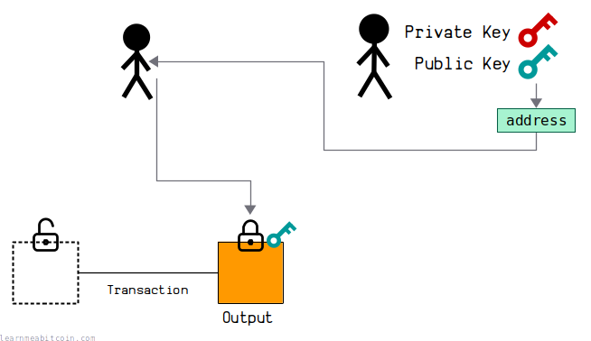
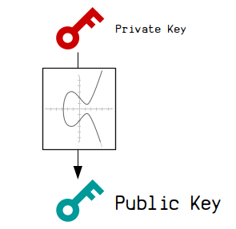
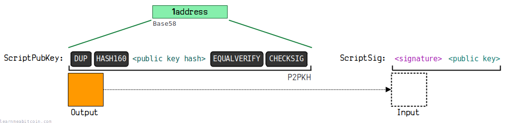

Keys are used to control the ownership of bitcoins.

To "send" and "receive" bitcoins, all you need is to generate a [private key](/technical/keys/private-key/) and [public key](/technical/keys/public-key/) *pair*.

* The public key is placed inside the lock of an [output](/technical/transaction/output/) when you want to "send" someone bitcoins in a [transaction](/technical/transaction/).
* The private key is then used to create a [signature](/technical/keys/signature/) to unlock that output when you want to "spend" it as an [input](/technical/transaction/input/) in a new transaction.

The private key and public key pair are mathematically connected. As are the signatures.

So when you provide a signature alongside a public key, there will be a *mathematical connection* between the two, which is what "unlocks" bitcoins for spending in transactions.

In other words, the signature allows you to provide a one-time proof that you are the owner of the private key that the public key was created from. Nobody can produce a signature that has a mathematical connection to the public key unless they have access to the original private key.

Using signatures means that you don't have to reveal the original private key, which prevents anyone from stealing any other bitcoins locked to the same public key.

This mechanism is known as **public key cryptography**. It existed before Bitcoin was created, and Satoshi simply made use of it as a way to control the ownership of coins.

Lastly, in Bitcoin we convert these public keys to addresses, which are simply human-friendly encodings of the public keys.

So when you "send" bitcoins to someone's address, you're actually just locking up some bitcoins to their public key.

## [Private Key](/technical/keys/private-key/)

Generate Random
Reset

Bits

0

0

0

0

0

0

0

0

0

0

0

0

0

0

0

0

0

0

0

0

0

0

0

0

0

0

0

0

0

0

0

0

0

0

0

0

0

0

0

0

0

0

0

0

0

0

0

0

0

0

0

0

0

0

0

0

0

0

0

0

0

0

0

0

0

0

0

0

0

0

0

0

0

0

0

0

0

0

0

0

0

0

0

0

0

0

0

0

0

0

0

0

0

0

0

0

0

0

0

0

0

0

0

0

0

0

0

0

0

0

0

0

0

0

0

0

0

0

0

0

0

0

0

0

0

0

0

0

0

0

0

0

0

0

0

0

0

0

0

0

0

0

0

0

0

0

0

0

0

0

0

0

0

0

0

0

0

0

0

0

0

0

0

0

0

0

0

0

0

0

0

0

0

0

0

0

0

0

0

0

0

0

0

0

0

0

0

0

0

0

0

0

0

0

0

0

0

0

0

0

0

0

0

0

0

0

0

0

0

0

0

0

0

0

0

0

0

0

0

0

0

0

0

0

0

0

0

0

0

0

0

0

0

0

0

0

0

0

0

0

0

0

0

0

0

0

0

0

0

0

0

0

0

0

0

0

Binary

0b

`0 bits`

Decimal

0d

Hexadecimal

0x

`0 bytes`

**Never use a private key generated by a website, or enter your private key into a website.** Websites can easily save the private key and use it to steal your bitcoins.

0 secs

Example Private Key:

bd7a7eefb68dd27651ce5aadc7a2c0b0c8a40371d35a4614a11d41176c677152

A private key is a 256-[bit](/technical/general/bytes/#bit) **randomly generated number**.

The range of valid private keys is between **0** and **115792089237316195423570985008687907852837564279074904382605163141518161494336**.

Private keys are typically displayed as 32-byte [hexadecimal](/technical/general/hexadecimal/) strings. But ultimately it's still just a random number.

The actual valid range of private keys is slightly less than the *maximum* possible 256-bit value. This is due to mathematics involved in how the subsequent public key is calculated.

There are so many possible private keys that generating one *randomly* is enough to ensure that nobody else will generate the same one as you. It seems hard to believe, but honestly, a 256-bit number is so large that it's effectively impossible for any two individuals to generate the same random number within that range.

## [Public Key](/technical/keys/public-key/)

Generate Random

Private Key

`0 bytes`

Public Key

Coordinates

x:

0d

y:

0d

parity:

A public key is just a point on an elliptic curve. The final public key is these coordinates in hexadecimal.

Compression
 Compressed (02 or 03 prefix)
 Uncompressed (04 prefix)
 x-only (no prefix)

The elliptic curve is symmetrical along the x-axis, so a *compressed* public key only needs to store the full x-coordinate and whether the y-coordinate is even or odd.

An x-only public key is used in [Taproot](/technical/upgrades/taproot/) outputs. The corresponding y-coordinate is assumed to be even.

`0 bytes`

**Never enter your private key into a website, or use a private key generated by a website.** Websites can easily save the private key and use it to steal your bitcoins.

0 secs

Example Public Key (compressed):

02d41a576876f4212acb7abd9cf44fd099327fd951d80b86a9b73cabd3e8061758

A public key is a set of coordinates calculated from a private key.

This set of coordinates is calculated using [elliptic curve cryptography](/technical/cryptography/elliptic-curve/), which is what creates a mathematical connection between the private key and public key.

This special mathematical connection is what allows us to generate signatures from the private key too, which will also have a mathematical connection to the public key. This means we can prove we have the private key without having to reveal it.

Anyway, when you see a public key, you're actually looking at a set of **x and y coordinates** on very large graph.

**Compressed Public Keys.** Even though the public key is a set of x and y coordinates, due to the mathematics of elliptic curve cryptography we do not actually have to store the full y-coordinate of the public key. Instead, we can simply store the 32-byte (256-bit) x-value, along with a 1-byte prefix to indicate whether the y-coordinate is *even* or *odd*. This is known as a *compressed* public key, and it's the most common type of public key you'll see and use in Bitcoin.

## [Address](/technical/keys/address/)

An address is basically a **human-friendly** encoding of a public key.

There are a couple benefits to using an address over a raw public key:

* **Shorter.** An address is shorter than a public key. This makes it quicker write out manually, should you need to.
* **Error Detection.** An address contains a [checksum](/technical/keys/checksum/), which helps to detect errors if you happen to make a mistake. This helps to prevent sending bitcoins to an invalid public key and losing them forever.

Now, there are actually *different types* of addresses you can use in Bitcoin. The type you use depends on the type of [lock](/technical/transaction/output/scriptpubkey/) you want to place on an [output](/technical/transaction/output/):

### Base58 Address (P2PKH)

**This is a legacy address format.** This format was commonly used up until 2016 before the [Segregated Witness](/technical/upgrades/segregated-witness/) upgrade was introduced. You can still use it, but it's now more common to use [Bech32](/technical/keys/bech32/) addresses (see below).

A [base58](/technical/keys/base58/) address corresponds to a legacy [P2PKH](/technical/script/p2pkh/) locking script.

To create a base58 address, you first need to shorten the public key by putting it through HASH160. This shortens it from 33-bytes to a 20-byte [public key hash](/technical/keys/public-key/hash/):

Data (Hex)

A public key or script for example

`0 bytes`

SHA-256

RIPEMD-160

HASH160

RIPEMD-160(SHA-256(data))

`0 bytes`

0 secs

Example Public Key Hash:

50f5becf9a4cc046d2928834f4f713c23d61a146

You then put this public key hash through [Base58Check](/technical/keys/base58/#base58check) encoding, which adds a checksum to the public key hash and then converts the whole thing to base58 characters.

There is also a 1-byte `00` prefix at the start, which is used to identify that the address contains a public key hash and should be used to create a P2PKH lock:

Generate Random

Prefix`1 byte`

Type
 P2PKH
 P2SH
 P2PKH (Testnet)
 P2SH (Testnet)

HASH160`0 bytes`

Checksum`0 bytes`

Address

Base58 encoding of the above data

`0 characters`

0 secs

Example Address (Base58):

18P5T2vCnb6foStGk4GhR9jXZQ1EydK4sj

So if you "send" bitcoins to this address using a [bitcoin wallet](/beginners/wallets/), the wallet will create a [P2PKH](/technical/script/p2pkh/) locking script using the public key hash contained within the address.

The base58 address format is also used for [P2SH](/technical/script/p2sh/), which contains a script hash instead of a public key hash.

### Bech32 Address (P2WPKH)

A [bech32](/technical/keys/bech32/) address corresponds to a [P2WPKH](/technical/script/p2wpkh/) locking script.

To create a bech32 address, you start by shortening a 33-byte *compressed* public key by putting it through HASH160 to get a 20-byte [public key hash](/technical/keys/public-key/hash/):

Data (Hex)

A public key or script for example

`0 bytes`

SHA-256

RIPEMD-160

HASH160

RIPEMD-160(SHA-256(data))

`0 bytes`

0 secs

Example Public Key Hash:

50f5becf9a4cc046d2928834f4f713c23d61a146

You must only use **compressed public keys** when creating a bech32 address.

Before converting this public key hash to a bech32 address, you need to construct the full [P2WPKH](/technical/script/p2wpkh/) [ScriptPubKey](/technical/transaction/output/scriptpubkey/).

In short, this is a prefix of `0014` followed by the 20-byte public key hash. For example:

Example P2WPKH ScriptPubKey:

`001450f5becf9a4cc046d2928834f4f713c23d61a146`

You can then convert this full P2WPKH ScriptPubKey to bech32:

Generate Random

ScriptPubKey

Version
 `OP_0` (P2WPKH or P2WSH)
 `OP_1` (P2TR)

Data
(public key hash or script hash)
`0 bytes`

Hex

`0 bytes`
`Type:`

Network
 Mainnet
 Testnet
 Regtest

Address

Bech32 encoding of the ScriptPubKey

`0 characters`

0 secs

Example Address (Bech32):

bc1q2r6manu6fnqyd55j3q60facncg7krg2xh06tck

So if you "send" bitcoins to this address using a bitcoin wallet, the wallet will create a [P2WPKH](/technical/script/p2wpkh/) locking script using the public key hash contained within the address.

Whereas a base58 address is created by just using the public key hash only, a bech32 address is created from a public key hash within a full ScriptPubKey.

The bech32 address format is also used for [P2WSH](/technical/script/p2wsh/) locking scripts, which contains a script hash instead of a public key hash.

## Summary

To send and receive bitcoins you need to be able to **generate a pair of keys**; a private key and a public key.

These private keys and public keys are just *numbers* that you can generate on your own computer. They're mathematically connected, and this mathematical connection is what allows us to "send" and "receive" bitcoins. This special type of mathematics is known as [elliptic curve cryptography](/technical/cryptography/elliptic-curve/), and it existed before Bitcoin.

In Bitcoin, we typically convert the public key to an address, which makes it shorter and more user-friendly when sending bitcoins using bitcoin wallets.

These addresses contain the public key hash, and they correspond to the specific *type* of lock we want to place on some bitcoins (e.g. [P2PKH](/technical/script/p2pkh/) or [P2WPKH](/technical/script/p2wpkh/)). The type of address therefore indicates *how* the public key hash is locked and unlocked using the internal [Script](/technical/script/) language in Bitcoin.

But ultimately it's easiest to think of an address as a human-friendly encoding of a public key.

Addresses are not used internally in bitcoin. If you browse the raw data in the blockchain, you will only find public keys and signatures.

If you're interested in doing some Bitcoin programming for yourself, generating your own keys (and addresses) is a fun way to get started. Just be prepared to lose bitcoins if you do something wrong though… don't ask me how I know.

But if you're careful you should be fine.