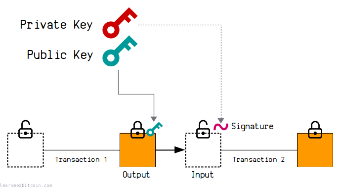
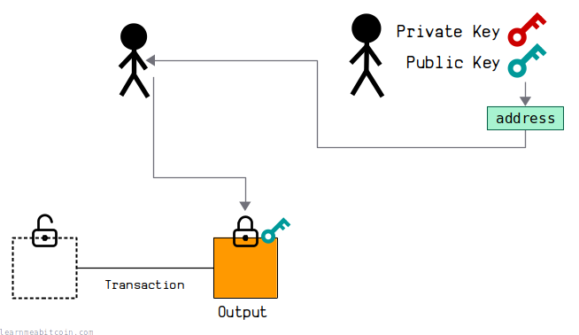
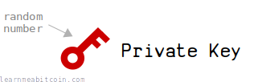
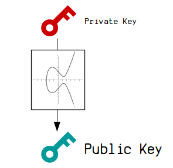
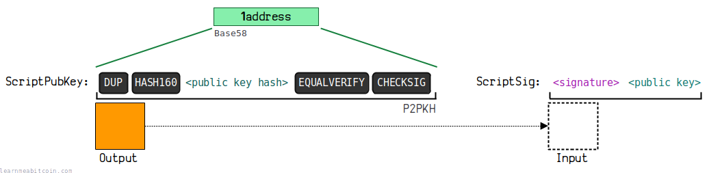
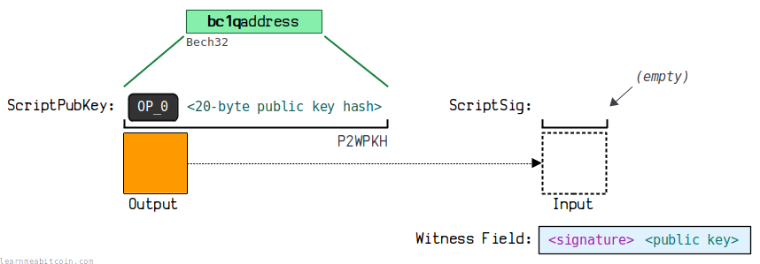

# 密钥总览 (Keys)

密钥用于控制比特币的所有权。

要“发送”和“接收”比特币，您只需要生成一对[私钥](keys/private-key.md)和[公钥](keys/public-key.md)*密钥对*。

* 当您想在[交易](transaction.md)中向某人“发送”比特币时，公钥会被放置在[输出](transaction/output.md)的锁中。
* 随后，当您想在新的交易中将其作为[输入](transaction/input.md)“花费”时，将使用私钥创建[签名](keys/signature.md)来解锁该输出。

私钥和公钥对在数学上是相连的。签名也是如此。

因此，当您提供签名和公钥时，两者之间会存在*数学联系*，这就是“解锁”比特币以便在交易中花费的原因。

换句话说，签名允许您提供一次性证明，证明您是创建该公钥的私钥的所有者。除非有人能够访问原始私钥，否则没有人可以生成与该公钥具有数学联系的签名。

使用签名意味着您不必透露原始私钥，从而防止任何人窃取锁定在同一公钥上的任何其他比特币。

这种机制被称为**公钥密码学**。它在比特币创建之前就已经存在，中本聪只是利用它来控制硬币的所有权。

最后，在比特币中，我们将这些公钥转换为地址，这些地址只是公钥的人类友好编码。

因此，当您将比特币“发送”到某人的地址时，您实际上只是将一些比特币锁定到他们的公钥上。

## [私钥 (Private Key)](keys/private-key.md)

| 字段 (Field) | 值 (Value) |
| --- | --- |
| 比特 (Bits) | 0 |
| 二进制 (Binary) | 0b `0 bits` |
| 十进制 (Decimal) | 0d |
| 十六进制 (Hexadecimal) | 0x `0 bytes` |

**切勿使用网站生成的私钥，或在网站中输入您的私钥。**网站可以轻松保存私钥并利用它窃取您的比特币。

示例私钥：

aeae8733ac057ef3591f1587390bcc620fdc4b8d91a0afe88c2e95168eccd8b4

私钥是一个256[比特](general/bytes.md#bit)的**随机生成数字**。

有效私钥的范围在 **0** 到 **115792089237316195423570985008687907852837564279074904382605163141518161494336** 之间。

私钥通常显示为32字节的[十六进制](general/hexadecimal.md)字符串。但归根结底，它仍然只是一个随机数。

实际有效私钥范围略小于*最大*可能的256位值。这是由于计算后续公钥时涉及的数学原理造成的。

可能的私钥多到只要*随机*生成一个，就足以确保没有其他人会生成与您相同的私钥。这似乎难以置信，但老实说，一个256位的数字是如此巨大，以至于任何两个人实际上都不可能在该范围内生成相同的随机数。

## [公钥 (Public Key)](keys/public-key.md)

| 字段 (Field) | 值 (Value) |
| --- | --- |
| 私钥 (Private Key) | `0 bytes` |
| 公钥坐标 (Public Key Coordinates) | x: 0d y: 0d 奇偶性 (parity):  公钥只是椭圆曲线上的一个点。最终的公钥是这些十六进制形式的坐标。 |
| 压缩 (Compression) | - 压缩的 (02 或 03 前缀) - 未压缩的 (04 前缀) - 仅x的 (无前缀)  椭圆曲线沿x轴对称，因此*压缩的*公钥只需要存储完整的x坐标以及y坐标是偶数还是奇数。  仅x的公钥用于[Taproot](upgrades/taproot.md)输出。相应的y坐标假定为偶数。 |
| 公钥 (十六进制) | `0 bytes` |

**切勿在网站中输入您的私钥，或使用网站生成的私钥。**网站可以轻松保存私钥并利用它窃取您的比特币。

示例公钥（压缩）：

022f5282edbbee94d0c42afa3c169ef2b03f23914c5bd4a44abbbdbdacc865dd47

公钥是根据私钥计算出的一组坐标。

这组坐标是使用[椭圆曲线密码学](cryptography/elliptic-curve.md)计算出来的，这也正是创建私钥和公钥之间数学联系的原因。

这种特殊的数学联系也允许我们从私钥生成签名，签名也会与公钥有数学联系。这意味着我们可以证明我们拥有私钥而不必透露它。

无论如何，当你看到一个公钥时，你实际上是在看一个非常大的图表上的一组**x和y坐标**。

**压缩公钥。**尽管公钥是一组x和y坐标，但由于椭圆曲线密码学的数学原理，我们实际上不必存储公钥的完整y坐标。相反，我们可以只存储32字节（256位）的x值，以及一个1字节的前缀来指示y坐标是*偶数*还是*奇数*。这被称为*压缩*公钥，它是您在比特币中看到和使用的最常见的公钥类型。

## [地址 (Address)](keys/address.md)

地址基本上是公钥的**人类友好**编码。

与原始公钥相比，使用地址有几个好处：

* **更短。**地址比公钥短。如果需要，这使其可以更快地手动写出。
* **错误检测。**地址包含一个[校验和 (checksum)](keys/checksum.md)，如果您碰巧犯了错误，这有助于检测出错误。这有助于防止将比特币发送到无效的公钥并永久丢失它们。

现在，您在比特币中实际可以使用*不同类型*的地址。您使用的类型取决于您想放置在[输出](transaction/output.md)上的[锁](transaction/output/scriptpubkey.md)的类型：

### Base58 地址 (P2PKH)

**这是一种传统的地址格式。**在2016年引入[隔离见证 (Segregated Witness)](upgrades/segregated-witness.md)升级之前，这种格式很常用。您仍然可以使用它，但现在更常见的是使用[Bech32](keys/bech32.md)地址（见下文）。

[base58](keys/base58.md)地址对应于传统的[P2PKH](script/p2pkh.md)锁定脚本。

要创建base58地址，您首先需要通过HASH160来缩短公钥。这会将其从33字节缩短为20字节的[公钥哈希 (public key hash)](keys/public-key/hash.md)：

| 字段 (Field) | 值 (Value) |
| --- | --- |
| 数据 (Hex) | 例如，公钥或脚本 `0 bytes` |
| HASH160 | RIPEMD-160(SHA-256(data)) `0 bytes` |

示例公钥哈希：

5a42499bf73f175901bd5cffa14c535c6ee5afb0

然后，您将这个公钥哈希通过[Base58Check](keys/base58.md#base58check)编码，该编码向公钥哈希添加一个校验和，然后将整个内容转换为base58字符。

在开始处还有一个1字节的`00`前缀，用于识别该地址包含公钥哈希并且应用于创建P2PKH锁：

| 字段 (Field) | 值 (Value) |
| --- | --- |
| 前缀 (Prefix) | `1 byte` |
| 类型 (Type) | - P2PKH - P2SH - P2PKH (测试网) - P2SH (测试网) |
| HASH160 | `0 bytes` |
| 校验和 (Checksum) | `0 bytes` |
| 地址 (Address) | 上述数据的Base58编码 `0 characters` |

示例地址 (Base58)：

19EFE1CjwGqrXTUau6z35LQUTs9LvioX7t

因此，如果您使用[比特币钱包](../beginners/wallets.md)将比特币“发送”到此地址，钱包将使用该地址中包含的公钥哈希创建一个[P2PKH](script/p2pkh.md)锁定脚本。

base58地址格式也用于[P2SH](script/p2sh.md)，其包含的是脚本哈希而不是公钥哈希。

### Bech32 地址 (P2WPKH)

[bech32](keys/bech32.md)地址对应于[P2WPKH](script/p2wpkh.md)锁定脚本。

要创建bech32地址，您首先通过将33字节的*压缩*公钥通过HASH160进行缩短，以获得20字节的[公钥哈希](keys/public-key/hash.md)：

| 字段 (Field) | 值 (Value) |
| --- | --- |
| 数据 (Hex) | 例如，公钥或脚本 `0 bytes` |
| HASH160 | RIPEMD-160(SHA-256(data)) `0 bytes` |

示例公钥哈希：

5a42499bf73f175901bd5cffa14c535c6ee5afb0

在创建bech32地址时，您只能使用**压缩公钥**。

在将此公钥哈希转换为bech32地址之前，您需要构建完整的[P2WPKH](script/p2wpkh.md) [ScriptPubKey](transaction/output/scriptpubkey.md)。

简而言之，这是一个`0014`的前缀，后跟20字节的公钥哈希。例如：

示例 P2WPKH ScriptPubKey：

`00145a42499bf73f175901bd5cffa14c535c6ee5afb0`

然后您可以将此完整的 P2WPKH ScriptPubKey 转换为 bech32：

| 字段 (Field) | 值 (Value) |
| --- | --- |
| ScriptPubKey 版本 (Version) | - `OP_0` (P2WPKH 或 P2WSH) - `OP_1` (P2TR) |
| ScriptPubKey 数据 (Data) | (公钥哈希 或 脚本哈希) `0 bytes` |
| 十六进制 (Hex) | `0 bytes` `类型:` |
| 网络 (Network) | - Mainnet (主网) - Testnet (测试网) - Regtest (回归测试网) |
| 地址 (Address) | ScriptPubKey的Bech32编码 `0 characters` |

示例地址 (Bech32)：

bc1qtfpynxlh8ut4jqdatnl6znznt3hwttasryr8d0

因此，如果您使用比特币钱包将比特币“发送”到此地址，钱包将使用该地址中包含的公钥哈希创建一个[P2WPKH](script/p2wpkh.md)锁定脚本。

base58地址仅通过使用公钥哈希创建，而bech32地址是根据完整的 ScriptPubKey 中的公钥哈希创建的。

bech32地址格式也用于[P2WSH](script/p2wsh.md)锁定脚本，其包含的是脚本哈希而不是公钥哈希。

## 总结 (Summary)

要发送和接收比特币，您需要能够**生成一对密钥**；一个私钥和一个公钥。

这些私钥和公钥只是可以在您自己的计算机上生成的*数字*。它们在数学上是联系在一起的，这种数学联系就是允许我们“发送”和“接收”比特币的原因。这种特殊的数学类型被称为[椭圆曲线密码学](cryptography/elliptic-curve.md)，它在比特币出现之前就存在了。

在比特币中，我们通常将公钥转换为地址，这使得在使用比特币钱包发送比特币时，它变得更短、更便于用户使用。

这些地址包含公钥哈希，它们对应于我们想要放置在某些比特币上的特定*类型*的锁（例如 [P2PKH](script/p2pkh.md) 或 [P2WPKH](script/p2wpkh.md)）。因此，地址类型指示了在比特币中如何使用内部[脚本 (Script)](script.md)语言来锁定和解锁公钥哈希。

但归根结底，最简单的还是将地址视为公钥的人类友好编码。

比特币内部不使用地址。如果您在区块链中浏览原始数据，您只会找到公钥和签名。

如果您有兴趣自己做一些比特币编程，生成自己的密钥（和地址）是一个有趣的入门方式。只是要准备好，如果你做错了什么，你就会丢失比特币……别问我怎么知道的。

但是，如果您小心谨慎，应该会没事的。