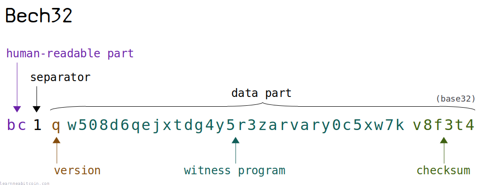
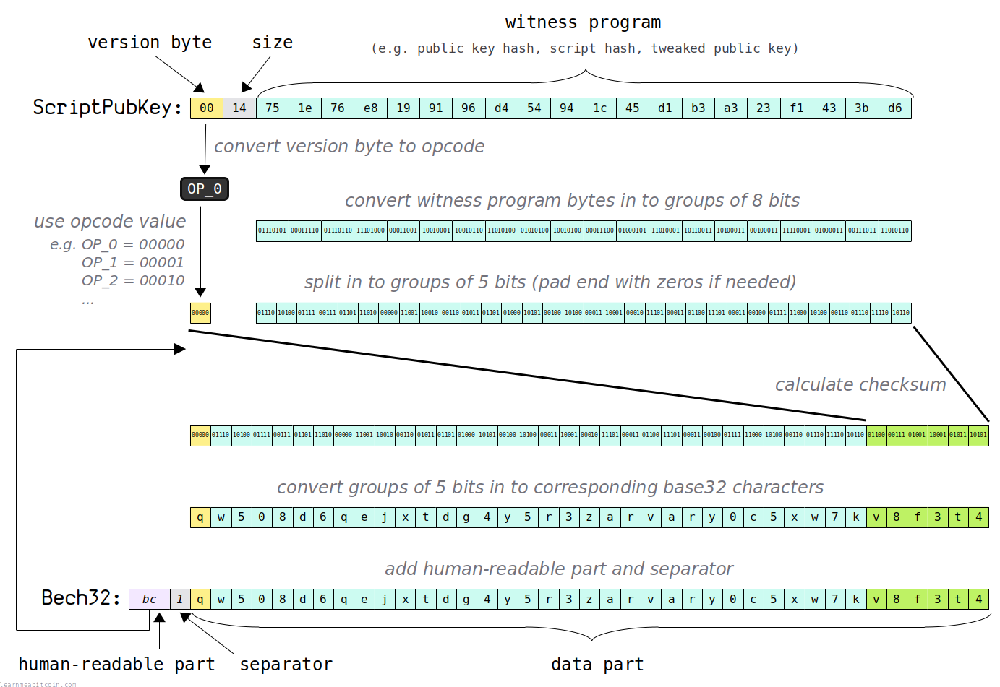
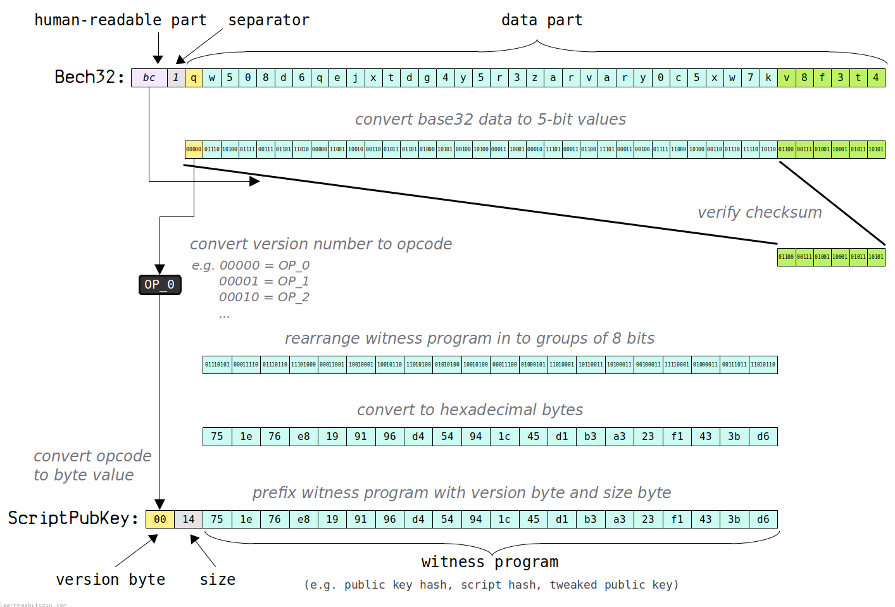
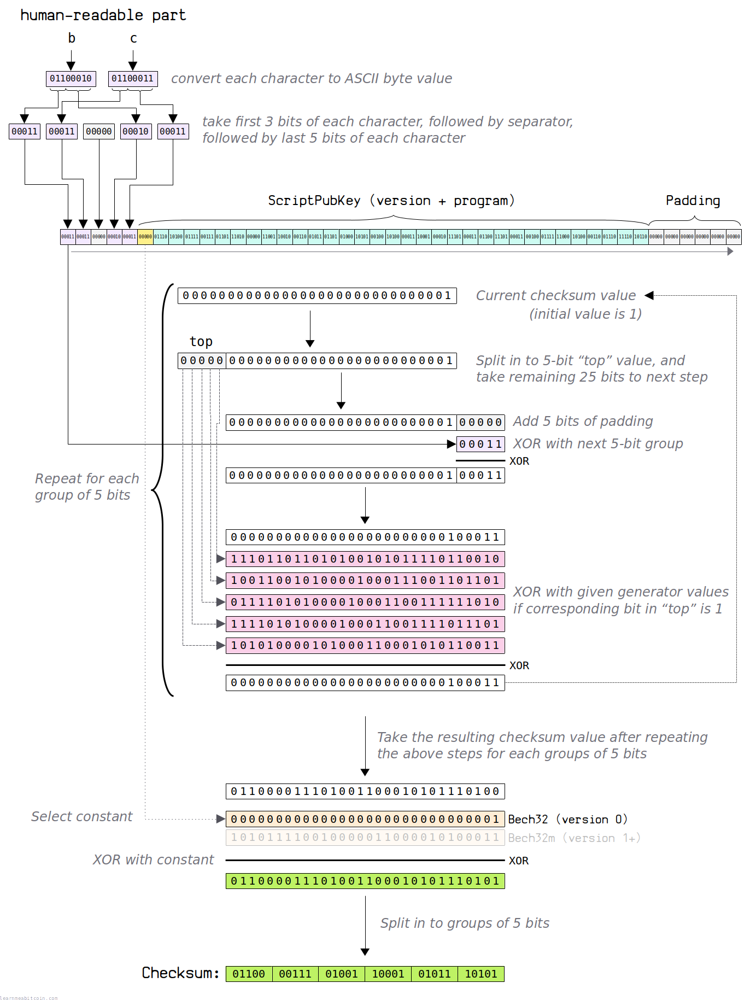
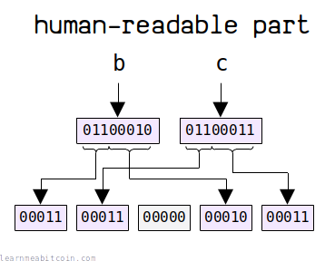

* [BIP 173: Bech32](https://github.com/bitcoin/bips/blob/master/bip-0173.mediawiki)
* [BIP 350: Bech32m](https://github.com/bitcoin/bips/blob/master/bip-0350.mediawiki)

[](https://static.learnmeabitcoin.com/diagrams/png/keys-bech32.png)

Bech32（读作 "besh thirty-two"）是一种**[地址（address）](/docs/technical/keys/address.md)格式**，用于表示 *SegWit 锁定脚本*，如 [P2WPKH](/docs/technical/script/p2wpkh.md)、[P2WSH](/docs/technical/script/p2wsh.md) 和 [P2TR](/docs/technical/script/p2tr.md)。

它是在 [隔离见证（Segregated Witness）](/docs/technical/upgrades/segregated-witness.md) 升级后不久引入的，旨在为新的 SegWit 锁定脚本提供更好的地址格式。它是对传统的 [Base58](/docs/technical/keys/base58.md) 格式的一种改进。

以下是它们的一些示例：

| 类型 | 地址 | 长度 |
| --- | --- | --- |
| P2WPKH | `bc1qx5y8r50l39cap3r9cd65fz7xfvlkjrl258hs8m` | 42 个字符 |
| P2WSH | `bc1q37qzzxnhnwdsde7yjzq5hc0wktmnqejp3zt0pj9l0pgn9f2gpyls4hahsc` | 62 个字符 |
| P2TR | `bc1p4pzgu93t5nlw9mscn0v6s7spfya7qntp0afynva267lr0vp0sxyqqj24dc` | 62 个字符 |

你可以通过前缀 `bc1` 来识别 Bech32 地址。

在本页中，我将展示如何对 Bech32 地址进行**编码（encode）**和**解码（decode）**，并解释为什么它们比 Base58 地址更好。

## 优势 (Benefits)

Bech32 有哪些优势？

对于地址而言，Bech32 比传统的 [Base58](/docs/technical/keys/base58.md) 格式更*用户友好*且更*高效*。

简而言之，与 Base58 相比，它是一次*升级*。

### 用户友好 (User-friendly)

由于以下三个原因，Bech32 地址比 Base58 地址更易于使用：

#### 1. 不区分大小写 (Case-insensitive)

Bech32 地址**不混用大写字母和小写字母**，这使得它们与 Base58 相比更容易输入和朗读。

因此，如果你在电话里把地址告诉别人，你不再需要不断地切换着说“大写 X，小写 y……”等等。

Bech32 地址通常全部是*小写*，但使用全部*大写*也是完全可以的（这也是它们被[存储在 QR 码](#smaller-qr-codes)中的方式）。

为了防止混淆，Bech32 地址**不应混用大写字母和小写字母**。钱包应当将大小写混用的 Bech32 地址视为无效。

与 Base58 相比，Bech32 使用更少的字符（即 32 进制而不是 58 进制），这意味着地址通常会*更长*，但由于所有字符均采用*单一口径的大小写*，这使得 Bech32 地址总体上更容易使用。

#### 2. 友好的字符集 (Friendly character set)

这其实不算是一个“升级”，因为 [Base58](/docs/technical/keys/base58.md) 也做了类似的事情，但 Bech32 **不使用彼此相似的字符**。

确切地说，地址的*数据*部分使用了除 "1"、"b"、"i" 和 "o" 以外的所有字母数字字符：

比特币 Base32 字符集

```
0 1 2 3 4 5 6 7 8 9
a b c d e f g h i j k l m n o p q r s t u v w x y z
```

* 移除了数字 "**1**"，因为它看起来类似于小写字母 "l"。
* 移除了字母 "**b**"，因为大写字母 "B" 看起来类似于数字 8（感谢 [bordalix](https://bitcoin.stackexchange.com/questions/125902/why-doesnt-bech32-use-the-character-b-in-the-data-part)）。
* 移除了字母 "**o**"，因为大写字母 "O" 通常看起来类似于数字 "0"。
* 移除了字母 "**i**"，因为大写字母 "I" 在某些字体中看起来类似于小写字母 "l"。

因此，在 36 个可能的字母数字字符中，移除了 4 个*最不具辨识度*的字符，剩下总共 32 个字符。

这与预先存在的 "base 32" 字符集略有不同。例如：

* [z-base-32](https://philzimmermann.com/docs/human-oriented-base-32-encoding.txt) — 移除了 "0"、"l"、"v" 和 "2"
* [RFC3548](http://www.faqs.org/rfcs/rfc3548.html) — 移除了 "0"、"1"、"8" 和 "9"

**人类可读部分（human-readable part）不受上述 base 32 字符集的限制。** 它可以包含任何 [US-ASCII](https://www.columbia.edu/kermit/ascii.html) 字符（在 33-126 范围内），这就是为什么你可以在地址的开头使用 "b"。

#### 3. 更好的校验和 (Better checksum)

Bech32 地址使用改进的[校验和算法（checksum algorithm）](#checksum)，允许你*检测并修复地址中的错误*。

总结其差异如下：

* **[Base58 Checksum](/docs/technical/keys/base58.md#base58check)** — 允许你识别地址输入是正确还是错误。
* **Bech32 Checksum** — 允许你识别地址输入是正确还是错误。此外，如果地址输入错误，它可以定位错误在*哪里*，并提供修改*建议*。

所以简而言之，Bech32 的校验和更*聪明*。

### 高效 (Efficient)

由于以下三个原因，Bech32 地址比 Base58 地址更高效：

#### 1. 更小的 QR 码 (Smaller QR codes)

Bech32 地址使用单大小写这一事实，使得你能以[字母数字模式（alphanumeric mode）](https://www.thonky.com/qr-code-tutorial/alphanumeric-mode-encoding)将它们编码到 QR 码中。

这意味着你可以创建更紧凑的 QR 码，因为 Base58 同时需要大写和小写字母（这意味着你无法使用字母数字模式），而 Bech32 则不需要。

例如：

Base58 地址

1MHKKX3cN2RnWrxnzg9kLfPzi6vCd1B2H7

[](/docs/technical/keys/bech32/base58-qr.png.md)

Bech32 地址

BC1QMEU8D90HWHFHM49GHGN5ZFGEXDPJSSPZGN28T4

[](/docs/technical/keys/bech32/bech32-qr-ignorecase.png.md)

如你所见，尽管 Bech32 地址有更多字符，但由于可以使用字母数字模式，QR 码整体使用的数据更少。

**QR 码的字母数字模式仅支持大写字母。** 因此，当你扫描包含 Bech32 地址的 QR 码时，它通常会以全大写形式显示。这完全没问题，因为 Bech32 地址是[不区分大小写](#case-insensitive)的。

#### 2. 更快的编码 (Faster encoding)

计算 [Bech32 校验和](#checksum) 比计算 [Base58 校验和](/docs/technical/keys/base58.md#base58check) 更快，这意味着编码 Bech32 地址的速度更快。

我知道 Bech32 校验和算法看起来非常复杂，但它仍然比创建 Base58 校验和所需的 [双重 SHA256](/docs/technical/cryptography/hash-function.md#hash256) 运算更快。

#### 3. 更快的解码 (Faster decoding)

Bech32 地址中的字符直接*映射*到特定数值，这比 [解码 Base58 地址](/docs/technical/keys/base58.md#decode) 所需的大数*模运算*更快。

与 Bech32 相比，Base58 的编码/解码速度虽然并没有慢到夸张的程度，但 Bech32 无论如何都更为高效。

## 交互工具 (Tool)

Random Example

ScriptPubKey`0 bytes`
`Type:` 

ScriptPubKey (bytes)

Version

Witness Program

ScriptPubKey (8-bit groups)

Version

Witness Program`0 bits`

ScriptPubKey (5-bit groups)

Version

Witness Program`0 bits`

Checksum Constant
 Bech32 (Version 0: P2WPK, P2WSK)
 Bech32m (Version 1: P2TR)

Checksum Algorithm

Checksum

Data (Version + Witness Program + Checksum)

Data (Base32)

Bech32

hrp

bc

Network
 Mainnet
 Testnet
 Regtest

Separator

1

Data

Address`0 characters`

0 secs

## 编码 (Encode)

将 ScriptPubKey 转换为 Bech32 地址

用于 *SegWit 锁定脚本*（例如 [P2WPKH](/docs/technical/script/p2wpkh.md)、[P2WSH](/docs/technical/script/p2wsh.md)、[P2TR](/docs/technical/script/p2tr.md)）的 [ScriptPubKey](/docs/technical/transaction/output/scriptpubkey.md) 可以转换为 Bech32 地址。

编码过程的主体包括将 ScriptPubKey 的[字节（bytes）](/docs/technical/general/bytes.md)转换为二进制（1 和 0），将这些 1 和 0 分割为**5位数组（5-bit groups）**，然后将这些 5 位数组转换为对应的 **Base32 字符**。

这虽然是简化的解释，但它基本上就是这样运作的。最难的部分是计算[校验和](#encode-step-6)。

以下是逐步指南：

[](https://static.learnmeabitcoin.com/diagrams/png/keys-bech32-encode.png)

Bech32 编码仅设计用于 SegWit 锁定脚本（即 P2WPKH、P2WSH、P2TR）。这是因为它们遵循了 Bech32 编码所需的特定模式（它们基本上需要一个**版本号**和一些**数据字节**）。

### 1. 人类可读部分 (Human-readable part)

首先，你需要选择希望最终地址的前缀是什么。

在比特币中，这个前缀有 3 个选项：

* bc = 主网 (mainnet)
* tb = 测试网 (testnet)
* bcrt = 私有链 (regtest)

这被称为*人类可读部分*，它表明了该地址是用于主网、测试网还是私有链。

你需要在早期就选好人类可读部分，因为在[计算校验和](#encode-step-5)时会用到它。

### 2. ScriptPubKey

接下来，获取你想要转换为 Bech32 的完整 ScriptPubKey。

以下是一个 [P2WPKH](/docs/technical/script/p2wpkh.md) ScriptPubKey 示例：

`0014751e76e8199196d454941c45d1b3a323f1433bd6`

如果你还没意识到，每个 SegWit ScriptPubKey 都遵循类似的结构。该结构可以拆分为 3 部分：

#### 1. 版本号 (Version)

*第一个字节*对应一个 `OP_N` 操作码。

| 字节 | 操作码 |
| --- | --- |
| 00 | `OP_0` |
| 51 | `OP_1` |
| 52 | `OP_2` |
| ... | ... |
| 60 | `OP_16` |

该操作码代表的*整数*值表示 SegWit 锁定脚本的*版本*。

在我们的示例中，字节 `00` 对应操作码 `OP_0`，这表示一个**版本 0** 的 SegWit 锁定脚本（即 P2WPKH 或 P2WSH）。

版本字节应该为 `00` 或 `51` 到 `60`（即 `OP_0` 到 `OP_16`）。

#### 2. 大小 (Size)

*第二个字节*指示接下来的*见证程序（witness program）*的大小。

在我们的示例中，这个字节是 `14`，它指示接下来的见证程序长度为 20 字节。

**大小字节不包含在 Bech32 编码中**。这是因为在[解码](#decode) Bech32 地址后，你可以计算出*见证程序*的大小，因此无需显式包含大小字节。这在最终地址中节省了一两个字符。

#### 3. 见证程序 (Witness Program)

ScriptPubKey 中的其余数据就是*见证程序*。

这是 ScriptPubKey 中最独特的部分，通常包含 3 种类型的数据之一：

1. 20 字节的公钥哈希 (P2WPKH)
2. 32 字节的脚本哈希 (P2WSH)
3. 32 字节的微调公钥 (P2TR)

在我们的 P2WPKH 示例中，见证程序是一个 20 字节的公钥哈希：

`751e76e8199196d454941c45d1b3a323f1433bd6`

这段数据对我们最终的 Bech32 地址外观影响最大。

### 3. 版本号（5位）

接下来，我们需要将 ScriptPubKey 的版本号转换为一个 **5位整数值**。

在我们的示例中，版本字节为 `00`，它对应[操作码](/docs/technical/script.md#opcodes) `OP_0`。因此，此 ScriptPubKey 的版本号为 **0**。这可以表示为 5 位二进制值：

```
version = 00000
```

**使用操作码代表的数字，而不是字节值。** `OP_1` 到 `OP_16` 操作码使用的字节在 `51` 到 `60` 范围内。因此，重要的是将字节转换为其对应的 `OP_N` 操作码以获得正确的版本号，而不是直接使用字节的值。

* 版本号会影响最终地址前缀后的第一个字符。
  + 版本 0 的 SegWit 锁定脚本以 bc1**q** 开头 (P2WPKH 或 P2WSH)
  + 版本 1 的 SegWit 锁定脚本以 bc1**p** 开头 (P2TR)
* 版本号必须在 0 到 16 之间，因此它永远不会超过 5 位值的上限（即 31）。

### 4. 见证程序（8位数组）

接下来，我们将*见证程序*转换为 8 位数组。

这是我们的见证程序表现为字节数组的形式：

```
witness program = 75 1e 76 e8 19 91 96 d4 54 94 1c 45 d1 b3 a3 23 f1 43 3b d6
```

如果我们将每个字节转换为二进制位，得到：

```
witness program = 01110101 00011110 01110110 11101000 00011001 10010001 10010110 11010100 01010100 10010100 00011100 01000101 11010001 10110011 10100011 00100011 11110001 01000011 00111011 11010110
```

一个[字节](/docs/technical/general/bytes.md)中有 8 个二进制位。

### 5. 见证程序（5位数组）

将见证程序从 8 位数组重新排列为 5 位数组。

```
witness program = 01110 10100 01111 00111 01101 11010 00000 11001 10010 00110 01011 01101 01000 10101 00100 10100 00011 10001 00010 11101 00011 01100 11101 00011 00100 01111 11000 10100 00110 01110 11110 10110
```

如你所见，我们将见证程序从 **20 个 8位数组** 重新排列为了 **32 个 5位数组**。

**填充 (Padding)。** 如果在最后的 8 位组中没有足够的二进制位来转换为完整的 5 位组，则在最后的 5 位组中用零进行填充。

### 6. 校验和 (Checksum)

校验和是利用 *人类可读部分*、5位的 *版本号* 和见证程序的 *5位数组* 来计算的。

以下是我们作为校验和算法输入的数据：

```
hrp             = 'bc'
version         = 00000
witness program = 01110 10100 01111 00111 01101 11010 00000 11001 10010 00110 01011 01101 01000 10101 00100 10100 00011 10001 00010 11101 00011 01100 11101 00011 00100 01111 11000 10100 00110 01110 11110 10110
```

我们示例的计算所得校验和为：

```
checksum = 01100 00111 01001 10001 01011 10101
```

这个过程相当繁琐，我在这里先略过了。有关详细信息，请参阅[校验和](#checksum)算法部分。

### 7. 合并

将我们刚刚计算出的*校验和*添加到 5位*版本号*和见证程序*5位数组*的末尾：

```
version + witness_program + checksum = 00000 01110 10100 01111 00111 01101 11010 00000 11001 10010 00110 01011 01101 01000 10101 00100 10100 00011 10001 00010 11101 00011 01100 11101 00011 00100 01111 11000 10100 00110 01110 11110 10110 01100 00111 01001 10001 01011 10101
```

### 8. Base32 编码

将上一步中合并的 5 位组转换为**整数**，然后使用这些整数来**选择每个整数对应的 Base32 字符**：

```
Base32 字符映射表

0 = q   8 = g   16 = s   24 = c
1 = p   9 = f   17 = 3   25 = e
2 = z   10 = 2  18 = j   26 = 6
3 = r   11 = t  19 = n   27 = m
4 = y   12 = v  20 = 5   28 = u
5 = 9   13 = d  21 = 4   29 = a
6 = x   14 = w  22 = k   30 = 7
7 = 8   15 = 0  23 = h   31 = l
```

[Base32 字符集](#friendly-character-set)按此特定顺序排列是为了提高校验和的纠错能力。

例如：

```
version + witness_program + checksum (5位组) = 00000 01110 10100 01111 00111 01101 11010 00000 11001 10010 00110 01011 01101 01000 10101 00100 10100 00011 10001 00010 11101 00011 01100 11101 00011 00100 01111 11000 10100 00110 01110 11110 10110 01100 00111 01001 10001 01011 10101
version + witness_program + checksum (整数) = 0 14 20 15 7 13 26 0 25 18 6 11 13 8 21 4 20 3 17 2 29 3 12 29 3 4 15 24 20 6 14 30 22 12 7 9 17 11 21
version + witness_program + checksum (base32) = q w 5 0 8 d 6 q e j x t d g 4 y 5 r 3 z a r v a r y 0 c 5 x w 7 k v 8 f 3 t 4
```

该 Base32 字符串构成了最终 Bech32 地址的*数据部分*。

### 9. 拼装 Bech32

最后，在 Base32 字符串的开头添加*人类可读部分*和*分隔符*，以获得最终的 *Bech32 地址*。

```
hrp       = bc
separator = 1
base32    = qw508d6qejxtdg4y5r3zarvary0c5xw7kv8f3t4

bech32    = bc1qw508d6qejxtdg4y5r3zarvary0c5xw7kv8f3t4
```

**分隔符始终为 1。** 这用于将*人类可读部分*与 *Base32 数据* 部分隔开，因为人类可读部分的长度可以变化。字符 "1" 永远不会出现在地址的*数据*部分（因为它已被排除在 Base32 字符集之外），因此它能可靠地用作分隔符。

### 代码

```ruby
# --------
# settings
# --------

# human-readable prefix to use in the final Bech32 address
hrp = "bc" # bc = mainnet, tb = testnet

# separator between the human-readable part and the data part
separator = "1" # this is always 1

# base32 character set
characters = "qpzry9x8gf2tvdw0s3jn54khce6mua7l" # all lowercase alphanumeric characters except for "1", "b", "i", "o"

# display full checksum algorithm
display_checksum_algorithm = true # true or false

puts "------------"
puts "scriptpubkey"
puts "------------"
puts

# scriptpubkey we want to convert to Bech32
scriptpubkey = "0014751e76e8199196d454941c45d1b3a323f1433bd6" # example P2WPKH scriptpubkey
puts "scriptpubkey: #{scriptpubkey}"
puts

# split scriptpubkey in to version and witness program
version = scriptpubkey[0..1] # first byte
witness_program = scriptpubkey[4..-1] # bytes 2 to the end
puts "version: #{version}"
puts "program: #{witness_program}"
puts
# note: the size byte between the version and witness program is not used in Bech32 encoding

puts "-------"
puts "version"
puts "-------"
puts

# convert version byte to the integer value represented by its corresponding opcode
#
# 0x00 = OP_0 = 0 (P2WPKH and P2WSH)
# 0x51 = OP_1 = 1 (P2TR)
# 0x52 = OP_2 = 2
# ...
# 0x60 = OP_16 = 16
#
# caution: OP_1 to OP_16 start at 0x51, not 0x01
if (version == "00")
  version_opcode_int = 0
elsif (version.to_i(16) >= 0x51 && version.to_i(16) <= 0x60)
  version_opcode_int = version.to_i(16) - 0x50
else
  puts "Invalid version byte." # the version byte must be between OP_0 and OP_16
  exit
end

# convert version to 5-bit value
version_5_bits = version_opcode_int & 0b11111 # version should already 5 bits (i.e. 0 to 16), but take the last 5 bits just in case

# display version details
puts "version (byte):   #{version}"
puts "version (opcode): OP_#{version_opcode_int}"
puts "version (5-bits): #{version_5_bits.to_s(2).rjust(5, "0")}"
puts

puts "------------"
puts "8-bit groups"
puts "------------"
puts

# convert witness program to 8-bit integer array
version_8_bits = [version_opcode_int] # put 8-bit integer value in to an array
witness_program_8_bits = [witness_program].pack("H*").unpack("C*") # convert hex string to binary, then back in to arrays of 8-bit (1 byte) integers

# display witness program 8-bit array as binary strings
puts "program: #{witness_program_8_bits.map { |v| v.to_s(2).rjust(8, "0") }.join(' ')}"
puts

puts "------------"
puts "5-bit groups"
puts "------------"
puts

# rearrange witness program from 8-bit integer array in to 5-bit integer array
from = 8 # number of bits in starting integer
to   = 5 # number of bits in target integer
accumulator  = 0
counter = 0
max_value = (1 << to) - 1 # max value (5 bits = 0b100000 = 32)
max_accumulator = (1 << (from + to -1)) -1 # 8 bits + 5 bits - 1 bit = 12 bits = 4095 = 0b111111111111
witness_program_5_bits = [] # the return array

# run through each 8-bit integer in the witness program array
witness_program_8_bits.each do |int_8_bits|

  # return nil if negative
  if int_8_bits < 0
    return nil
  end

  # return nil if size of integer is greater than specified size of starting bit group
  if (int_8_bits >> from) != 0
    return nil
  end

  # add starting bits to accumulator
  accumulator = accumulator << from           # << = bitwise left shift
  accumulator = accumulator | int_8_bits      # | = bitwise OR
  accumulator = accumulator & max_accumulator # & = bitwise AND

  # increase counter
  counter += from

  # while there are enough bits to produce a new 5-bit group
  while counter >= to

    # decrease counter
    counter -= to

    # add 5-bit value to result
    witness_program_5_bits << ((accumulator >> counter) & max_value)
  end
end

# add padding
if (counter > 0)
  witness_program_5_bits << ((accumulator << (to - counter)) & max_value)
end

# display result
puts "program: #{witness_program_5_bits.map { |v| v.to_s(2).rjust(5, "0") }.join(' ')}"
puts

puts "------------------"
puts "checksum algorithm"
puts "------------------"
puts

# display human-readable part
puts "hrp:          #{hrp}"

# convert human-readable to corresponding UTF-8 character values
hrp_values = hrp.split("").map { |c| c.ord }
puts "hrp_values:   #{hrp_values.map { |v| v.to_s(2).rjust(8, "0") }.join(' ')}"

# expand human-readable part in to 5-bit groups
hrp_expanded = []

# take the first 3 bits of each character's integer value
hrp_values.each do |v|
  hrp_expanded << (v >> 5) # shift 5 bits to the right to get first 3 bits
end

# add separator
hrp_expanded << 0

# take the last 5 bits of each character's integer value
hrp_values.each do |v|
  hrp_expanded << (v & 0b11111) # use bitmask to extract last 5 bits
end

# display result
puts "hrp_expanded: #{hrp_expanded.map { |v| v.to_s(2).rjust(5, "0") }.join(' ')}"
puts

# combine the expanded human-readable part with the version and witness program (all 5-bit groups)
combined = hrp_expanded + [version_5_bits] + witness_program_5_bits

# add padding
combined_with_padding = combined + [0, 0, 0, 0, 0, 0]
puts "hrp + version + program + padding: #{combined_with_padding.map { |v| v.to_s(2).rjust(5, "0") }.join(' ')}"
puts

# checksum generator values
generator = [
  0b111011011010100101011110110010, # 0x3b6a57b2
  0b100110010100001000111001101101, # 0x26508e6d
  0b011110101000010001100111111010, # 0x1ea119fa
  0b111101010000100011001111011101, # 0x3d4233dd
  0b101010000101000110001010110011, # 0x2a1462b3
 ]

# initial checksum value (final checksum result will be 30 bits)
checksum = 1

# run through each 5-bit group in the combined array
combined_with_padding.each do |v|

  # display current checksum value
  puts "checksum: #{checksum.to_s(2).rjust(30, "0")}" if display_checksum_algorithm
  
  # remove 25 bits from the right of the current checksum value and store the result
  top = checksum >> 25
  puts "top:      #{top.to_s(2).rjust(5, "0")}" if display_checksum_algorithm

  # extract the bottom 25 bits from the current checksum value using a bitmask
  checksum = checksum & 0b1111111111111111111111111
  puts "bottom:        #{checksum.to_s(2).rjust(25, "0")}" if display_checksum_algorithm

  # left shift the checksum value (add 5 zero bits to the end, which creates space for xor'ing with the current 5-bit current value)
  checksum = checksum << 5
  puts "padded:        #{checksum.to_s(2).rjust(30, "0")}" if display_checksum_algorithm

  # xor the current checksum with the next 5-bit value
  checksum = checksum ^ v
  puts "5-bit group:                            #{v.to_s(2).rjust(5, "0")}" if display_checksum_algorithm
  puts "xor:           #{checksum.to_s(2).rjust(30, "0")}" if display_checksum_algorithm

  # run through the last 5 bits of the top value
  5.times do |i|

    # show current generator
    print "generator #{i}:   #{generator[i].to_s(2).rjust(30, "0")}" if display_checksum_algorithm

    # if the next bit of the top value is 1
    if ((top >> i) & 1) == 1

      # xor the current checksum with the corresponding generator value
      checksum = checksum ^ generator[i]

      # add indicator if this generator value was used for xor'ing
      puts " xor" if display_checksum_algorithm
    else 
      puts if display_checksum_algorithm
    end
  end

  # display checksum value after this 5-bit group
  puts "checksum:      #{checksum.to_s(2).rjust(30, "0")}" if display_checksum_algorithm
  puts if display_checksum_algorithm

end

# display checksum value after running through all 5-bit groups
puts "checksum:      #{checksum.to_s(2).rjust(30, "0")}" if display_checksum_algorithm

# set the constant to xor the checksum with based on the version number
if (version_opcode_int == 0)
  constant = 1 # bech32
else
  constant = 0x2bc830a3 # bech32m
end

# display constant
puts "constant:      #{constant.to_s(2).rjust(30, "0")}" if display_checksum_algorithm

# xor the checksum with the constant
checksum = checksum ^ constant

# display constant and final checksum value
puts "checksum:      #{checksum.to_s(2).rjust(30, "0")}" if display_checksum_algorithm
puts if display_checksum_algorithm

# convert the checksum in to 6 groups of 5-bits
checksum_5_bits = []

# we want 6 groups of 5 bits
6.times do |i|

  # calculate the right shift amount so we can grab each 5-bit group from the 30-bit checksum
  right_shift = 5 * (5 - i)

  # shift the checksum value to the right
  shifted = (checksum >> right_shift)

  # extract the last 5 bits from the shifted value
  bits = shifted & 0b11111

  # add the 5-bit group to the checksum array
  checksum_5_bits << bits
end

# display result
puts "checksum: #{checksum_5_bits.map { |v| v.to_s(2).rjust(5, "0") }.join(' ')}"
puts

puts "------"
puts "base32"
puts "------"
puts

# combine the version, program, and checksum
data = [version_5_bits] + witness_program_5_bits + checksum_5_bits
puts "version + program + checksum: #{data.map { |v| v.to_s(2).rjust(5, "0") }.join(' ')}"
puts "version + program + checksum: #{data.map { |v| v }.join(' ')}"

# convert each 5-bit group to its corresponding base32 character
base32 = data.map { |i| characters[i] }
puts "base32: #{base32.join(' ')}"
puts

puts "------"
puts "bech32"
puts "------"
puts

# display the hrp and separator
puts "hrp:       #{hrp}"
puts "separator: #{separator}"
puts

# combine the human-readable part, separator, and base32 data
bech32 = hrp + separator + base32.join
puts "bech32:    #{bech32}" # bc1qw508d6qejxtdg4y5r3zarvary0c5xw7kv8f3t4
```

## 解码 (Decode)

将 Bech32 地址转换为 ScriptPubKey

Bech32 地址可以被解码为 SegWit ScriptPubKey。

为此，你基本上需要将 Base32 字符转换为它们对应的 5位数值，将这些二进制位重新组合成 8位数组以获得十六进制字节值，然后重新构建出完整的 ScriptPubKey。

以下是逐步指南：

[](https://static.learnmeabitcoin.com/diagrams/png/keys-bech32-decode.png)

### 1. 地址 (Address)

首先，获取你想要转换为 ScriptPubKey 的地址。

以下是一个示例：

bc1qw508d6qejxtdg4y5r3zarvary0c5xw7kv8f3t4

接下来，你需要将地址拆分为 3 部分：

1. **人类可读部分 (Human-readable part)。** 分隔符之前的字符是人类可读部分。这部分的长度可以在 1 到 83 个字符之间。在比特币中，这部分表示地址是用于主网 ("bc")、测试网 ("tb") 还是私有链 ("bcrt")。
2. **分隔符 (Separator)。** 地址中*最后*出现的一个 "1" 是分隔符。这用于将*人类可读部分*与*数据*部分隔开。有效的地址必须包含一个 "1" 分隔符。
3. **数据部分 (Data)。** 分隔符之后的任何字符都是 "数据" 部分。这是对*版本*、*见证程序*和*校验和*的 Base32 编码。

将 Bech32 地址拆分为*人类可读部分*和*数据*部分的方法是寻找*分隔符*，也就是*最后*一次出现的字符 "1"。

因此对于这个地址，我们有：

1. **人类可读部分** = bc
2. **分隔符** = 1
3. **数据部分** = qw508d6qejxtdg4y5r3zarvary0c5xw7kv8f3t4

* **不要通过读取固定数量的字符来提取人类可读部分。** 它通常是 2 或 4 个字符，但从技术上讲，未来它的长度可能在 1 到 83 个字符之间。
* **不要搜索 *第一* 次出现的 "1"。** 从技术上讲，人类可读部分有可能包含 "1"，因此你最终会过早拆分地址，导致数据部分错误。为确保获取分隔符的正确位置，你应该扫描 *最后* 一次出现的 "1"。

**分隔符在之后不会被使用。** 后面我们仅使用*人类可读部分*和*数据*部分。

### 2. 5位数组 (5-bit groups)

将*数据*部分从 Base32 字符转换为它们对应的 5位整数值。

例如：

```
base32 = qw508d6qejxtdg4y5r3zarvary0c5xw7kv8f3t4
integers = 0 14 20 15 7 13 26 0 25 18 6 11 13 8 21 4 20 3 17 2 29 3 12 29 3 4 15 24 20 6 14 30 22 12 7 9 17 11 21
```

这个整数数组可以拆分为 3 部分：

1. **版本号 (Version)。** *第一*个整数代表版本。
2. **见证程序 (Witness Program)。** *版本号*和*校验和*之间的整数是*见证程序*。
3. **校验和 (Checksum)。** *最后* 6 个整数是校验和。

因此我们得到：

```
version         = 0
witness program = 14 20 15 7 13 26 0 25 18 6 11 13 8 21 4 20 3 17 2 29 3 12 29 3 4 15 24 20 6 14 30 22
checksum        = 12 7 9 17 11 21
```

如果你愿意，可以展示这些整数的 5 位二进制表示：

```
version         = 00000
witness program = 01110 10100 01111 00111 01101 11010 00000 11001 10010 00110 01011 01101 01000 10101 00100 10100 00011 10001 00010 11101 00011 01100 11101 00011 00100 01111 11000 10100 00110 01110 11110 10110
checksum        = 01100 00111 01001 10001 01011 10101
```

**我展示二进制格式的 5位整数仅供视觉参考。** 在解码时你不需要这样做，保持它们作为 5位整数数组即可。

### 3. 验证校验和 (Verify checksum)

接下来，我们应该**验证地址中的校验和是否*有效***。

为此，我们利用从[第 1 步](#decode-step-1)中解码出来的*人类可读部分*，以及从[第 2 步](#decode-step-2)中得到的*版本号*和*见证程序*来[计算校验和](#checksum)：

```
checksum (calculated) = 01100 00111 01001 10001 01011 10101
```

然后，我们将其与地址中提供的校验和进行比较：

```
checksum (address)    = 01100 00111 01001 10001 01011 10101
```

如果校验和匹配，我们就知道地址输入正确，没有发生任何错误。

**这只是一个简单的检查。** 校验和实际上允许你检测潜在错误的发生位置，并提供关于如何纠正它们的建议。

### 4. 版本号 (Version)

接下来，需要将*版本号*整数转换为对应 `OP_N` [操作码](/docs/technical/script.md#opcodes)的**十六进制字节**。

例如：

| 版本号 | 操作码 | 十六进制 |
| --- | --- | --- |
| 0 | `OP_0` | `00` |
| 1 | `OP_1` | `51` |
| 2 | `OP_2` | `52` |
| ... | ... | ... |
| 16 | `OP_16` | `60` |

在我们的示例中，版本号为 **0**，它对应 `OP_0` 操作码，由以下十六进制字节表示：

```
version = 00
```

**快速转换。** 如果版本号大于零，只需加上 `0x51` 即可获得 `OP_N` 操作码的字节值。

* **不要直接将版本号整数转换为十六进制字节。** 例如，版本 **1** 对应 `OP_1`，它由字节 `51` 表示。如果你直接转换，会得到 `01`，这是该版本号的无效操作码。
* **版本号必须介于 0 和 16 之间。** 任何其他版本号都是无效的。

### 5. 8位数组 (8-bit groups)

将见证程序从 5 位数组重新排列为 **8 位数组**：

```
witness program (5-bit groups) = 01110 10100 01111 00111 01101 11010 00000 11001 10010 00110 01011 01101 01000 10101 00100 10100 00011 10001 00010 11101 00011 01100 11101 00011 00100 01111 11000 10100 00110 01110 11110 10110

witness program (8-bit groups) = 01110101 00011110 01110110 11101000 00011001 10010001 10010110 11010100 01010100 10010100 00011100 01000101 11010001 10110011 10100011 00100011 11110001 01000011 00111011 11010110
```

如你所见，我们只是简单地将二进制位重新收集到 8 位数组中。

**检查 5 位组是否包含过多的填充。** 如果 5 位组中总二进制位数除以 8 的余数是 5 或更大，则说明地址包含过多填充。

**检查填充是否仅包含零。** 填充量是 5 位组中的总二进制位数减去 8 位组中的总二进制位数。如果该填充包含除零以外的任何内容，则填充是无效的。

如果我们将这些 8 位数组转换为十六进制字节，我们得到：

```
witness program (bytes) = 75 1e 76 e8 19 91 96 d4 54 94 1c 45 d1 b3 a3 23 f1 43 3b d6
```

### 6. ScriptPubKey

最后，为了构建最终的 ScriptPubKey，我们首先需要计算上一步见证程序的*大小*。

在我们的示例中，见证程序长度为 **20** 字节，转换为十六进制为 `14`。这使得我们拥有：

```
version = 00
size = 14
witness program = 75 1e 76 e8 19 91 96 d4 54 94 1c 45 d1 b3 a3 23 f1 43 3b d6
```

如果我们*合并*这 3 部分数据，就能得到完整的 ScriptPubKey：

```
scriptpubkey = 0014751e76e8199196d454941c45d1b3a323f1433bd6
```

看到这是具有 **20字节见证程序** 的 **版本 0** 脚本，我们就可以断定这是一个 [P2WPKH](/docs/technical/script/p2wpkh.md) 锁定脚本。

### 代码

```ruby
# --------
# settings
# --------

# base32 character set
characters = "qpzry9x8gf2tvdw0s3jn54khce6mua7l" # all lowercase alphanumeric characters except for "1", "b", "i", "o"

# display full checksum algorithm
display_checksum_algorithm = false # true or false

puts "-------"
puts "address"
puts "-------"
puts

# Bech32 address we want to convert to a scriptpubkey
address = "bc1qw508d6qejxtdg4y5r3zarvary0c5xw7kv8f3t4" # example P2WPKH scriptpubkey
puts "address:   #{address}"
puts

# find the position of the separator (the last occurrence of a "1")
separator_position = address.rindex("1")
# note: the separator is always "1"
# caution: you want the _last_ occurrence of "1" as the human-readable part could potentially contain "1"

# everything before the separator is the human-readable part
hrp = address[0..separator_position - 1]

# everything after the separator is the data part
data = address[separator_position + 1..-1]

puts "hrp:       #{hrp}"
puts "data:      #{data}"
puts
# note: the separator is not used when converting the address to a scriptpubkey

puts "------------"
puts "5-bit groups"
puts "------------"
puts

# convert each base32 character to its corresponding 5-bit integer value
data_5_bits = data.split("").map { |c| characters.index(c) }

# first 5-bit group is the version
version_5_bits = data_5_bits.shift

# last 6 5-bit groups are the checksum
checksum_5_bits = data_5_bits.pop(6)

# remaining 5-bit groups are the witness program
witness_program_5_bits = data_5_bits

# display the 5-bit groups as integers
puts "version:   #{version_5_bits}"
puts "program:   #{witness_program_5_bits.join(' ')}"
puts "checksum:  #{checksum_5_bits.join(' ')}"
puts

# show the 5-bit groups as binary strings
puts "version:   #{version_5_bits.to_s(2).rjust(5, "0")}"
puts "program:   #{witness_program_5_bits.map { |v| v.to_s(2).rjust(5, "0") }.join(' ')}"
puts "checksum:  #{checksum_5_bits.map { |v| v.to_s(2).rjust(5, "0") }.join(' ')}"
puts

puts "---------------------"
puts "checksum verification"
puts "---------------------"
puts
# calculate the checksum from the given hrp and witness program

# convert human-readable to corresponding UTF-8 character values
hrp_values = hrp.split("").map { |c| c.ord }

# expand human-readable part in to 5-bit groups
hrp_expanded = []

# take the first 3 bits of each character's integer value
hrp_values.each do |v|
  hrp_expanded << (v >> 5) # shift 5 bits to the right to get first 3 bits
end

# add separator
hrp_expanded << 0

# take the last 5 bits of each character's integer value
hrp_values.each do |v|
  hrp_expanded << (v & 0b11111) # use bitmask to extract last 5 bits
end

# combine the expanded human-readable part with the version and witness program (all 5-bit groups)
combined = hrp_expanded + [version_5_bits] + witness_program_5_bits

# add padding
combined_with_padding = combined + [0, 0, 0, 0, 0, 0]

# checksum generator values
generator = [
  0b111011011010100101011110110010, # 0x3b6a57b2
  0b100110010100001000111001101101, # 0x26508e6d
  0b011110101000010001100111111010, # 0x1ea119fa
  0b111101010000100011001111011101, # 0x3d4233dd
  0b101010000101000110001010110011, # 0x2a1462b3
]

# initial checksum value (final checksum result will be 30 bits)
checksum = 1

# run through each 5-bit group in the combined array
combined_with_padding.each do |v|
  
  # remove 25 bits from the right of the current checksum value and store the result
  top = checksum >> 25

  # extract the lower 25 bits from the current checksum value using a bitmask
  checksum = checksum & 0b1111111111111111111111111

  # left shift the checksum value (add 5 zero bits to the end, which creates space for xor'ing with the current 5-bit current value)
  checksum = checksum << 5

  # xor the current checksum with the next 5-bit value
  checksum = checksum ^ v

  # run through the last 5 bits of the top value
  5.times do |i|

    # if the next bit of the top value is 1
    if ((top >> i) & 1) == 1

      # xor the current checksum with the corresponding generator value
      checksum = checksum ^ generator[i]
    end
  end

end

# set the constant to xor the checksum with based on the version number
if (version_5_bits == 0)
  constant = 1 # bech32
else
  constant = 0x2bc830a3 # bech32m
end

# display constant
puts "constant:      #{constant.to_s(2).rjust(30, "0")}" if display_checksum_algorithm

# xor the checksum with the constant
checksum = checksum ^ constant

# convert the checksum in to 6 groups of 5-bits
checksum_verify = []

# we want 6 groups of 5 bits
6.times do |i|

  # calculate the right shift amount so we can grab each 5-bit group from the 30-bit checksum
  right_shift = 5 * (5 - i)

  # shift the checksum value to the right
  shifted = (checksum >> right_shift)

  # extract the last 5 bits from the shifted value
  bits = shifted & 0b11111

  # add the 5-bit group to the checksum array
  checksum_verify << bits
end

# display calculated checksum
print "checksum:  #{checksum_verify.map { |v| v.to_s(2).rjust(5, "0") }.join(' ')}"

# check the calculated checksum matches the checksum in the address
if checksum_5_bits == checksum_verify
  puts " ✓"
else
  puts " ✗"
end
puts


puts "-------"
puts "version"
puts "-------"
puts

# convert version integer value to its corresponding OP_N hex byte
if (version_5_bits == 0)
  version_op_n_hex = version_5_bits.to_s(16).rjust(2, "0") # OP_0
else
  version_op_n_hex = (version_5_bits + 0x50).to_s(16).rjust(2, "0") # OP_1 to OP_16
end

puts "5-bits:    #{version_5_bits.to_s(2).rjust(5, "0")}"
puts "opcode:    OP_#{version_5_bits}"
puts "hex:       #{version_op_n_hex}"
puts


puts "------------"
puts "8-bit groups"
puts "------------"
puts

# rearrange witness program from 5-bit integer array in to 8-bit integer array
from = 5 # number of bits in starting integer
to   = 8 # number of bits in target integer
accumulator  = 0
counter = 0
max_value = (1 << to) - 1 # max value (5 bits = 0b100000 = 32)
max_accumulator = (1 << (from + to -1)) -1 # 8 bits + 5 bits - 1 bit = 12 bits = 4095 = 0b111111111111
witness_program_8_bits = [] # the return array

# run through each 5-bit integer in the witness program array
witness_program_5_bits.each do |int_5_bits|

  # return nil if negative
  if int_5_bits < 0
    return nil
  end

  # return nil if size of integer is greater than specified size of starting bit group
  if (int_5_bits >> from) != 0
    return nil
  end

  # add starting bits to accumulator
  accumulator = accumulator << from           # << = bitwise left shift
  accumulator = accumulator | int_8_bits      # | = bitwise OR
  accumulator = accumulator & max_accumulator # & = bitwise AND

  # increase counter
  counter += from

  # while there are enough bits to produce a new 8-bit group
  while counter >= to

    # decrease counter
    counter -= to

    # add 8-bit value to result
    witness_program_8_bits << ((accumulator >> counter) & max_value)
  end
end

# display result
puts "program:   #{witness_program_8_bits.map { |v| v.to_s(2).rjust(8, "0") }.join(' ')}"
puts

puts "------------"
puts "scriptpubkey"
puts "------------"
puts

# calculate the size of the witness program and convert to hex byte
witness_program_size_hex = witness_program_8_bits.size.to_s(16).rjust(2, "0")

# convert witness program to hex
witness_program_hex = witness_program_8_bits.map { |v| v.to_s(16).rjust(2, "0") }.join

# display the version, size, and witness program as hex
puts "version:   #{version_op_n_hex}"
puts "size:      #{witness_program_size_hex}"
puts "program:   #{witness_program_hex}"
puts

# combine the version, size, and witness program in to a scriptpubkey
scriptpubkey = version_op_n_hex + witness_program_size_hex + witness_program_hex
puts "scriptpubkey: #{scriptpubkey}" # 0014751e76e8199196d454941c45d1b3a323f1433bd6
```

## 校验和 (Checksum)

如何计算 Bech32 校验和？

Bech32 编码中最复杂的部分是**计算*校验和（checksum）***。

校验和算法使用了 [BCH码（BCH codes）](https://en.wikipedia.org/wiki/BCH_code)，允许跨数据进行纠错（这在使用 [Base58](/docs/technical/keys/base58.md) 的[简单校验和](/docs/technical/keys/checksum.md)中是无法实现的）。这使得 Bech32 校验和更加实用，但计算起来也更为复杂。

我对比特币中关于 BCH 码的设计算法理解尚浅，无法详细阐述其设计原理，因此我仅在此向你展示*如何计算此校验和*。

[](https://static.learnmeabitcoin.com/diagrams/png/keys-bech32-checksum-algorithm.png)

### 1. 准备数据

Bech32 地址的校验和由以下数据计算得出：

1. **人类可读部分 (Human-readable part)。** 在创建校验和之前，需要选择好用于最终地址的前缀。这个前缀通常是 'bc'（主网）、'tb'（测试网）或 'bcrt'（私有链）。
2. **版本号 (Version)。** 这是 SegWit ScriptPubKey 的版本号。这是一个由 `OP_N` 操作码指示的 5位整数值。
3. **见证程序 (Witness Program)。** 这是 ScriptPubKey 中的*见证程序*转换得到的 5位数组。因此，如果你从原始 ScriptPubKey 计算校验和，需要首先将见证程序从 8位字节数组重新排列为 5位数组。

以下是示例数据：

```
hrp             = 'bc'
version         = 00000
witness program = 01110 10100 01111 00111 01101 11010 00000 11001 10010 00110 01011 01101 01000 10101 00100 10100 00011 10001 00010 11101 00011 01100 11101 00011 00100 01111 11000 10100 00110 01110 11110 10110
```

ScriptPubKey 中的*大小*字节以及地址中的*分隔符*不包含在校验和覆盖范围内。

### 2. 展开人类可读部分

[](https://static.learnmeabitcoin.com/diagrams/png/keys-bech32-checksum-hrp-expand.png)

*人类可读部分*被用作地址的前缀。它必须包含在校验和中，以便我们可以检测其是否被正确输入。

该前缀是长度为 1 到 83 个 [US-ASCII](https://www.columbia.edu/kermit/ascii.html) 字符的字符串。因此，我们需要“展开”这些字符，将它们转换为 5位整数值组成的数组。

以下是展开人类可读部分的方法：

1. 将每个字符转换为其 **8位** ASCII 字节值。
2. 获取每个字符字节值的**前 3 位**。
3. 加入一个**零**作为分隔符。
4. 获取每个字符字节值的**后 5 位**。

也就是说，由于每个 ASCII 字符代表一个 8 位的值，我们将其拆开，以便我们可以得到一个 5 位值组成的数组。

例如：

```
hrp            = 'bc'
hrp (ASCII)    = 01100010 01100011
hrp (expanded) = 00011 00011 00000 00010 00011
```

**人类可读部分现在被表示为 5 位整数数组。** 这与*版本号*和*见证程序*的结构相匹配（它们也是 5位整数数组）。

### 3. 构建 5位数组

校验和算法的输入是以下数据的 5位数组：

1. **展开的人类可读部分。** 来自[第 2 步](#checksum-step-2)的 5位整数数组。
2. **版本号。** 基于 `OP_N` 操作码值的 5位整数。
3. **见证程序。** 5位整数组成的数组。
4. **填充 (Padding)。** 由 6 个全零 5位整数组成的数组。

因此，你基本上需要将 *hrp*、*版本号* 和 *见证程序* 拼合起来，并在末尾加上一些*填充*。

例如：

```
hrp (expanded)  = 00011 00011 00000 00010 00011
version         = 00000
witness program = 01110 10100 01111 00111 01101 11010 00000 11001 10010 00110 01011 01101 01000 10101 00100 10100 00011 10001 00010 11101 00011 01100 11101 00011 00100 01111 11000 10100 00110 01110 11110 10110
padding         = 00000 00000 00000 00000 00000 00000

5-bit array     = 00011 00011 00000 00010 00011 00000 01110 10100 01111 00111 01101 11010 00000 11001 10010 00110 01011 01101 01000 10101 00100 10100 00011 10001 00010 11101 00011 01100 11101 00011 00100 01111 11000 10100 00110 01110 11110 10110 00000 00000 00000 00000 00000 00000
```

这个组合的 5位整数数组是主校验和算法的输入。

### 4. 模多项式 (Polymod)

这是最有趣的部分。

最终校验和将是一个 30 位的值。校验和的起始值为 1，所以我们的初始校验和看起来像这样：

```
000000000000000000000000000001
```

我们现在将遍历数组中的每个 5位整数，并执行以下步骤：

#### 1. 顶部 (Top)

获取当前校验和值的前 5 位。这是 "top" 值，将在后面的步骤中使用。

```
top = 00000
```

#### 2. 底部 (Bottom)

获取当前校验和值的低 25 位。这是 "bottom" 值，这是我们接下来要调整的部分。

```
bottom = 0000000000000000000000001
```

#### 3. 填充 (Padding)

在上一步的 "bottom" 25 位末尾加上 5 位的填充，组成总共 30 位。

```
padded = 000000000000000000000000100000
```

#### 4. 与下一个 5位值进行 XOR 运算

从数组中提取下一个 5位值，并将其与上一步得到的填充后 30位校验和值进行 [XOR](https://stackoverflow.com/questions/14526584/what-does-the-xor-operator-do)（异或）运算：

```
padded      = 000000000000000000000000100000
5-bit value =                          00011
xor         = 000000000000000000000000100011
```

#### 5. 与生成器值进行 XOR 运算

我们现在将上一步得到的值与以下生成器值进行 XOR 运算：

```
generator 0 = 111011011010100101011110110010
generator 1 = 100110010100001000111001101101
generator 2 = 011110101000010001100111111010
generator 3 = 111101010000100011001111011101
generator 4 = 101010000101000110001010110011
```

然而，**我们并不总是与所有这些生成器值进行 XOR 运算**。相反，我们使用 "top" 值来确定我们具体与哪些生成器值进行 XOR 运算。

我们根据 "top" 值中从右到左哪些二进制位被设置为 "1"，来决定与哪些对应的生成器值进行异或。如果该位被设置（即为 "1"），则与该对应的生成器值进行 XOR。

在我们的示例中：

```
top = 00000

generator 0 = 111011011010100101011110110010 (bit 4 = 0, 不进行 XOR)
generator 1 = 100110010100001000111001101101 (bit 3 = 0, 不进行 XOR)
generator 2 = 011110101000010001100111111010 (bit 2 = 0, 不进行 XOR)
generator 3 = 111101010000100011001111011101 (bit 1 = 0, 不进行 XOR)
generator 4 = 101010000101000110001010110011 (bit 0 = 0, 不进行 XOR)
xor         = 000000000000000000000000100011

result      = 000000000000000000000000100011
```

"top" 中的任何一位都没有被设置，因此我们不需要将当前的校验和值与任何生成器值进行 XOR。

如果最右边的位被设置，我们与 generator 0 进行 XOR。如果右边数起的第二位被设置，我们也与 generator 1 进行 XOR，依此类推。

#### 6. 重复 (Repeat)

对数组中的所有 5位整数重复上述步骤。

### 5. 常量 (Constant)

最后，我们将计算得出的校验和值与一个*常量*进行 XOR。

我们使用的常量取决于 ScriptPubKey 的版本（参见 [Bech32m](#bech32m)）：

```
Version 0  = 000000000000000000000000000001
Version 1+ = 101011110010000011000010100011
```

我们的示例是一个 P2WPKH ScriptPubKey，其版本为 **0**：

```
checksum = 011000011101001100010101110100
constant = 000000000000000000000000000001
result   = 011000011101001100010101110101
```

### 6. 拆分为 5位组 (Split into 5-bit groups)

最后，我们可以将 30位校验和拆分为 6 个 5位组：

```
checksum = 011000011101001100010101110101
checksum = 01100 00111 01001 10001 01011 10101
```

这是我们最终的校验和。

### 代码

有关校验和算法，请参见[编码](#encode-code)或[解码](#decode-code)部分的代码。

## Bech32m

[BIP 350](https://github.com/bitcoin/bips/blob/master/bip-0350.mediawiki)

Bech32m 是指对 **版本 1** 及以上的 Bech32 地址的[校验和算法](#checksum)做出的*微调*。

唯一的区别是，在计算最终校验和值之前，你需要使用一个**不同的[常量](#checksum-step-5)**：

| 版本号 | 常量 | 地址类型 |
| --- | --- | --- |
| 0 | `0b000000000000000000000000000001` | [P2WPKH](/docs/technical/script/p2wpkh.md)、[P2WSH](/docs/technical/script/p2wsh.md) |
| 1+ | `0b101011110010000011000010100011` | [P2TR](/docs/technical/script/p2tr.md) |

Bech32 编码的其他所有方面均保持不变。

此更改修复了一个问题：即如果地址的最后一个字符是 "p"，那么插入或删除任意数量的 "q" 字符将不会导致校验和失效。

这并不是一个严重的问题，因为现有的 P2WPKH 和 P2WSH 地址被限制在两个特定的长度，因此不受影响。无论如何，这项变动确保了校验和对于所有未来的地址都是可靠的。

**把这看作是“Bech32”新的默认编码方法会更容易。** 换句话说，版本 0 锁定脚本（P2WPKH 和 P2WSH）只是使用了一个不同的“传统”常量。

## 名字由来 (Etymology)

"Bech32" 这个名字是从哪里来的？

"Bech32" (besh thirty-two) 这个名字源于以下事实：该地址使用 **Base32** 字符集，并且校验和在错误检测/纠正算法中使用了 **BCH** 码。

所以，如果你把 "base32" 和 "BCH" 挤在一起，你就会得到 "Bech32"。差不多吧。

> "Bech" 包含了字符 BCH（所使用的错误检测算法）并且听起来有点像 "base"。

Pieter Wuille, [BIP 173](https://github.com/bitcoin/bips/blob/master/bip-0173.mediawiki)

我知道这并不完美，但勉强说得通。

## 总结

与 [Base58](/docs/technical/keys/base58.md) 相比，Bech32 只是一个**更好的地址格式**。

Base58 曾经/现在很有用，因为它为你提供了一个不错的字符集以及一个用于检测错误的简单校验和。但 Bech32 提供了许多有用的*改进*：

* 更小的 QR 码。
* 更容易手动输入。
* 更智能的纠错校验和。
* 更快的编码和解码速度。
* 前缀更具灵活性。

Base58 已经做得很不错了，你不能因为它的不完美而责备中本聪，因为他们当时可能没有几个月的时间来构建终极地址格式；它简单且有效。但自那以后，我们有了充足的时间来构建更好的格式。

我们目前仍然在*传统锁定脚本（legacy locking scripts）*、*私钥（private keys）*和*扩展密钥（extended keys）*中使用 **Base58**：

* [P2PKH](/docs/technical/script/p2pkh.md) (*2009 年至今*)
* [P2SH](/docs/technical/script/p2sh.md) (*2012 年至今*)
* [WIF 私钥](/docs/technical/keys/private-key/wif.md) (*2011 年至今*)
* [扩展密钥](/docs/technical/keys/hd-wallets/extended-keys.md) (*2012 年至今*)

但 **Bech32** 现已用于所有*现代锁定脚本（modern locking scripts）*：

* [P2WPKH](/docs/technical/script/p2wpkh.md) (*2017 年至今*)
* [P2WSH](/docs/technical/script/p2wsh.md) (*2017 年至今*)
* [P2TR](/docs/technical/script/p2tr.md) (*2021 年至今*)

Bech32 唯一让人抓狂的缺点是，它的 [Base32 字符集](#friendly-character-set)中没有字母 "b"，因此我无法使用 [vanitygen](https://github.com/10gic/vanitygen-plusplus) 构建一个包含 "beer"（啤酒）字样的个性化捐赠地址（这也是为什么我至今仍在[捐赠页面](/donate/)使用 Base58 地址的原因）。但这是我必须忍受的代价。

## 相关资源

* [bech32.cpp](https://github.com/bitcoin/bitcoin/blob/master/src/bech32.cpp)
* [Bech32 error detection and correction](https://bitcoin.stackexchange.com/questions/125961/bech32-error-detection-and-correction-reference-implementation)
* [(Some of) the math behind Bech32 addresses](https://medium.com/@meshcollider/some-of-the-math-behind-bech32-addresses-cf03c7496285)