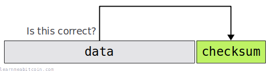
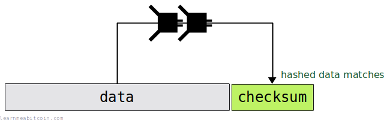
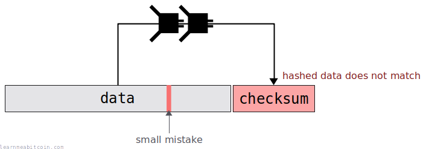
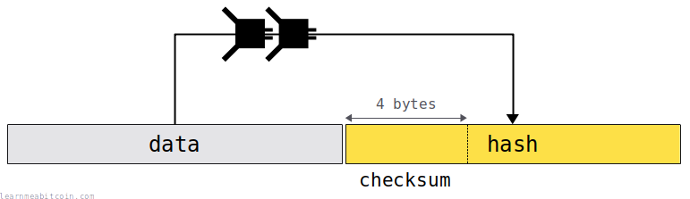

[](https://static.learnmeabitcoin.com/diagrams/png/bytes-checksum.png)

A checksum is a small piece of data that allows you to check if another piece of **data is the same as expected**.

They're most commonly found within [addresses](/docs/technical/keys/address.md) to detect typos. This helps to prevent sending bitcoins to the wrong address.

Random Example

Data

Some bytes of data you want to create a checksum for

`0 bytes`

Checksum

First 4 bytes of [hash256](/docs/technical/cryptography/hash-function.md#hash256)(data)

`Expected:`

Data with Checksum

The original data with the checksum appended

`0 bytes`


0 secs

To be more precise, a checksum can be added to the end of some data to create a combined `data+checksum`.

So when you re-enter this entire piece of data somewhere later on, you can make sure that everything is correct by checking that the `data` still matches the `checksum`:

[](https://static.learnmeabitcoin.com/diagrams/png/bytes-checksum-valid.png)

If you were to make a mistake, the `data` will not match the `checksum` (or vice versa) and you can be alerted that the data is incorrect in some way:

[](https://static.learnmeabitcoin.com/diagrams/png/bytes-checksum-invalid.png)

**This type of checksum does not help with error *correction*.** The checksum will *detect* errors, but it will not help by telling you where the error is or how it should be corrected.

## Location

Where are checksums used in Bitcoin?

Here are a few examples of where checksums are used in Bitcoin:

* **[Addresses](/docs/technical/keys/address.md)** – Every Base58 address (ones that start with a 1 or 3) contains a checksum. This helps to prevent losing bitcoins by sending them to the incorrect address if you make a typo.
* **[WIF Private Keys](/docs/technical/keys/private-key/wif.md)** – A WIF private key is like an address format for a private key. These also contain checksums, so you can be informed if you're importing an incorrect private key into a wallet.
* **[Extended Keys](/docs/technical/keys/hd-wallets/extended-keys.md)** – Every extended private key and extended public key contains its own checksum. Again, this allows you to detect errors when transcribing them.
* **[Network Messages](/docs/technical/networking.md#messages)** – Every message that gets sent between nodes on the network has a checksum attached to it. This allows you to detect if the message has been tampered with, or if the message has been corrupted during transmission.

Modern [Bech32](/docs/technical/keys/bech32.md) addresses also contain checksums, but they're more complex than the simple checksums described on this page.

## Creating

How do you create a checksum?

[](https://static.learnmeabitcoin.com/diagrams/png/bytes-checksum-create.png)

A checksum is created by taking the **first 4 [bytes](/docs/technical/general/bytes.md) of the [HASH256](/docs/technical/cryptography/hash-function.md#hash256) of some data**.

For example:

```
data          = aaaaaaaaaaaaaaaaaaaaaaaaaaaaaaaaaaaaaaaa
hash256(data) = 05c4de7c1069e9de703efd172e58c1919f48ae03910277a49c9afd7ded58bbeb
checksum      = 05c4de7c
```

 HASH256

Random Transaction Data

Random Block Header

Data (Hex)

`0 bytes`


SHA-256


SHA-256

HASH256

SHA-256(SHA-256(data))

`0 bytes`


0 secs

```


copied


copied

# ---------
# Functions
# ---------

require 'digest'

# hash256 function (checksums use hash256)
def hash256(hex)
  binary = [hex].pack("H*")
  hash1 = Digest::SHA256.digest(binary)
  hash2 = Digest::SHA256.digest(hash1)
  result = hash2.unpack("H*")[0]
  return result
end

# checksum function
def checksum(hex)
  hash = hash256(hex) # Hash the data through SHA256 twice
  return hash[0...8]  # Return the first 4 bytes (8 characters)
end

# ---------------
# Create Checksum
# ---------------

# data
data = "aaaaaaaaaaaaaaaaaaaaaaaaaaaaaaaaaaaaaaaa"

# checksum
puts checksum(data) #=> 05c4de7c
```

## Verifying

How do you verify a checksum?

To verify a checksum, you just need to check that the data hashes to the checksum that has been provided with the data.

In other words, you just **recalculate the checksum**:

```
# original data
data+checksum = aaaaaaaaaaaaaaaaaaaaaaaaaaaaaaaaaaaaaaaa05c4de7c
data          = aaaaaaaaaaaaaaaaaaaaaaaaaaaaaaaaaaaaaaaa
checksum      = 05c4de7c

# checksum verification
hash256(data) = 05c4de7c1069e9de703efd172e58c1919f48ae03910277a49c9afd7ded58bbeb
checksum      = 05c4de7c <- it matches
```

This is just a simple example, but the process is the same throughout Bitcoin.

```


copied


copied

# ---------
# Functions
# ---------

require 'digest'

# hash256 function (checksums use hash256)
def hash256(hex)
  binary = [hex].pack("H*")
  hash1 = Digest::SHA256.digest(binary)
  hash2 = Digest::SHA256.digest(hash1)
  result = hash2.unpack("H*")[0]
  return result
end

# checksum function
def checksum(hex)
  hash = hash256(hex) # Hash the data through SHA256 twice
  return hash[0...8]  # Return the first 4 bytes (8 characters)
end

# ---------------
# Verify Checksum
# ---------------

# data+checksum
datachecksum = "aaaaaaaaaaaaaaaaaaaaaaaaaaaaaaaaaaaaaaaa05c4de7c"

# data
data = datachecksum[0...40]

# checksum
checksum = datachecksum[40...48]

# verify
puts checksum(data) == checksum #=> true
```

## Reliability

How reliable are checksums in Bitcoin?

There is a **1 in 4,294,967,295** chance that a checksum will not detect an error.

A checksum is 4 [bytes](/docs/technical/general/bytes.md) in size. This means that there are only 0xFFFFFFFF (4,294,967,295) possible checksums, so there is a chance that two different pieces of data will end up having the same checksum.

In other words, if you make a typo when entering an address, there is roughly a **one in four billion** chance that the resulting checksum will inadvertently be the same and **the typo will not be detected**.

So it's very unlikely, but possible.

It would be more reliable to use the full 32-byte hash result as a checksum. However, this would make addresses much longer, so taking the first 4 bytes only strikes a balance between practicality and keeping addresses as short as possible.

## Terminology

Why is it called a "checksum"?

Early checksums used to literally be the "sum" of some data. So for example, let's say I wanted to store the following string:

```
abc
```

To create a simple checksum for it, I could just give each character a number (e.g. a = 1, b = 2, c = 3) and add the sum of those to the end:

```
abc+6
```

If I were to make a typo when transcribing this string later on, like this:

```
abb+6
```

The checksum would no longer match the sum of the characters (`abb` = 1 + 2 + 2 = 5), and I would know that I've made a mistake somewhere. So by "checking" the "sum", I can see that something has gone wrong somewhere. Hence, the name "checksum".

Anyway, in Bitcoin we actually use a [hash function](/docs/technical/cryptography/hash-function.md) to create the checksum, which is a more reliable fingerprint for the data than simply summing characters. Nonetheless, it does the same job, and that's why we still call this extra piece of error-detection data a *checksum*.

Thanks to [Greg Maxwell](https://nt4tn.net/) for the quick computer science lesson on (and the history of) checksums.

## Summary

A checksum is a useful tool for **detecting typos**.

As a user, it's good to know that things like addresses contain checksums. So if you make a mistake when typing an address into a wallet, you can be pretty sure that the wallet will detect any errors and stop you from sending bitcoins to the wrong address and losing them forever.

**It's best to think of checksums as a backup safety net.** There's no substitute for double (or triple) checking an address.

As a developer, if something contains a checksum, you should always use it to verify that the data is correct. That's what they're there for. And if you can save *one person* from losing coins, then it's worth the short time it takes to write the checksum verification code.

Checksums are used throughout computer science, and they're very handy for simple error-detection, so they're a handy tool to have in your programming toolbox.

## Resources

* [en.wikipedia.org/wiki/Checksum](https://en.wikipedia.org/wiki/Checksum)